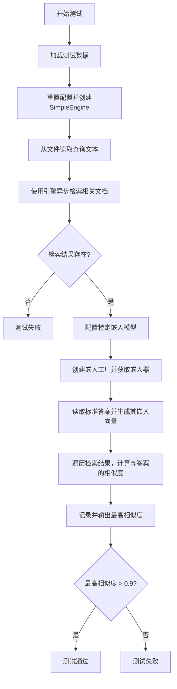
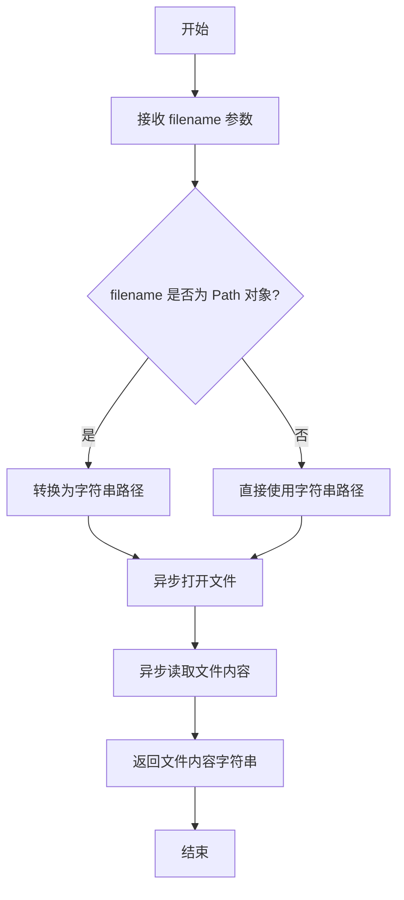
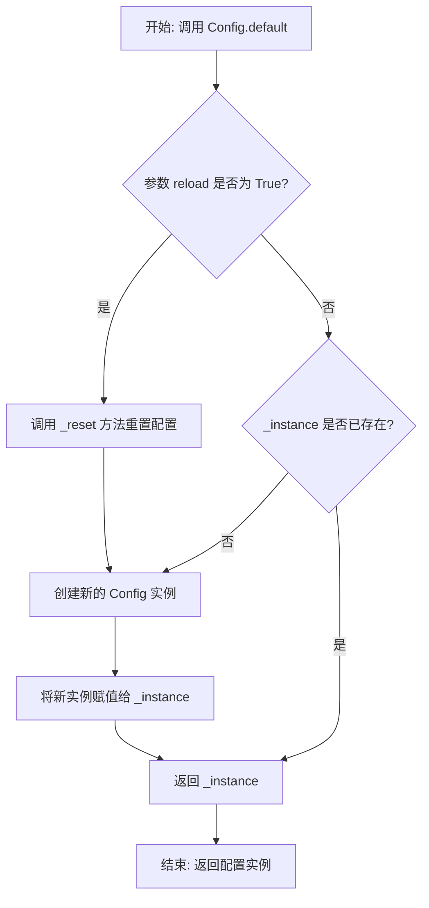
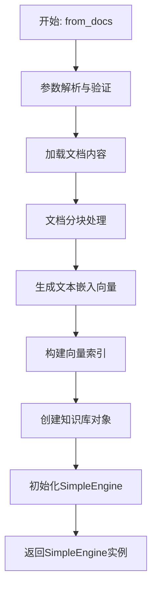
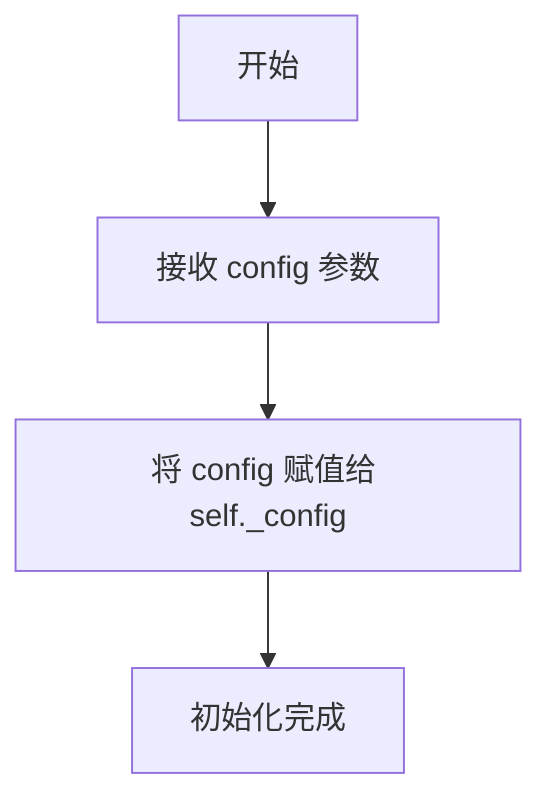
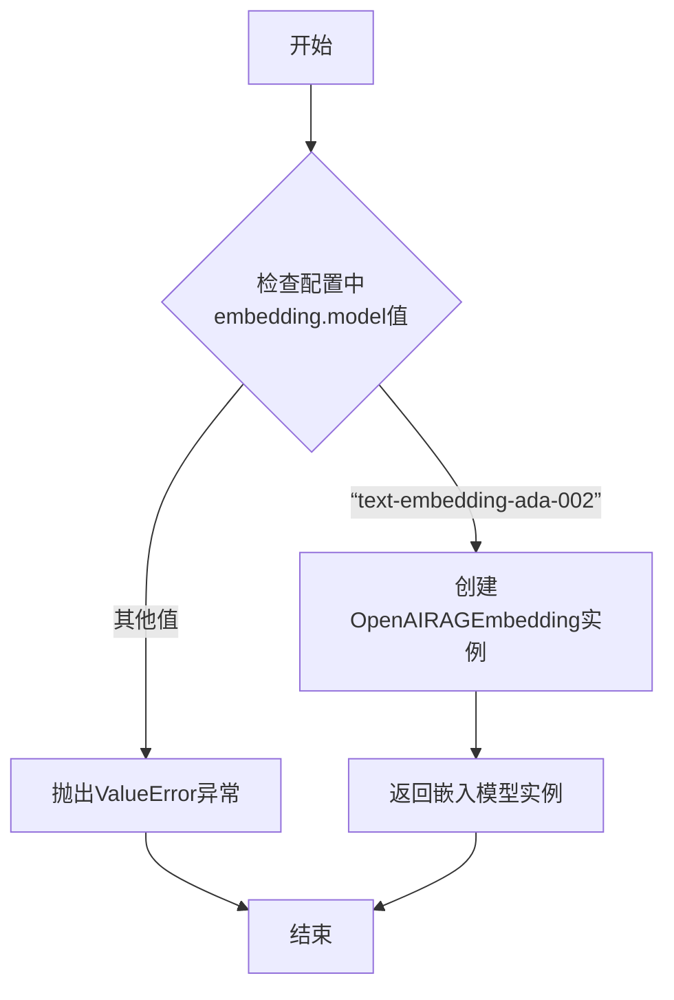

# `.\MetaGPT\tests\metagpt\rag\test_large_pdf.py` 详细设计文档

这是一个使用 pytest 框架编写的异步测试函数，用于测试 RAG（检索增强生成）系统中 SimpleEngine 的文档检索功能，特别是验证其从知识文档中检索到的内容与标准答案之间的语义相似度。

## 整体流程



## 类结构

```
pytest (测试框架)
├── Config (配置管理类)
├── SimpleEngine (RAG检索引擎)
├── RAGEmbeddingFactory (嵌入模型工厂类)
└── aread (异步文件读取工具函数)
```

## 全局变量及字段


### `TEST_DATA_PATH`
    
一个常量，指向项目测试数据文件的根目录路径。

类型：`pathlib.Path`
    


### `Config.embedding`
    
Config类的一个字段，用于存储和管理RAG（检索增强生成）相关的嵌入模型配置。

类型：`Config.embedding`
    
    

## 全局函数及方法

### `test_large_pdf`

这是一个使用 pytest 框架编写的异步测试函数，用于测试 `SimpleEngine` 对大型PDF文档（此处以Markdown文件模拟）的检索能力。其核心流程是：首先从知识文件构建一个检索引擎，然后使用查询文件的内容进行检索，最后将检索结果与标准答案文件的内容进行向量相似度计算，以验证检索的准确性。

参数：

- `knowledge_filename`：`pathlib.Path`，包含知识内容的Markdown文件路径。
- `query_filename`：`pathlib.Path`，包含查询问题的Markdown文件路径。
- `answer_filename`：`pathlib.Path`，包含标准答案的Markdown文件路径。

返回值：`None`，这是一个测试函数，不返回业务值，通过断言（`assert`）来验证测试结果。

#### 流程图

```mermaid
flowchart TD
    A[开始测试] --> B[重置全局配置 Config.default]
    B --> C[使用知识文件构建<br/>SimpleEngine]
    C --> D[异步读取查询文件内容]
    D --> E[使用引擎异步检索查询]
    E --> F{检索结果有效?}
    F -- 否 --> G[测试失败]
    F -- 是 --> H[获取配置并设置<br/>embedding模型]
    H --> I[创建RAGEmbeddingFactory<br/>并获取embedding实例]
    I --> J[异步读取答案文件内容]
    J --> K[异步获取答案文本的向量]
    K --> L[初始化相似度<br/>similarity = 0]
    L --> M[遍历每个检索结果]
    M --> N[异步获取当前检索结果的<br/>查询向量]
    N --> O[计算答案向量与<br/>结果向量的相似度]
    O --> P[更新最大相似度<br/>similarity = max(similarity, v)]
    P --> Q{是否遍历完<br/>所有结果?}
    Q -- 否 --> M
    Q -- 是 --> R[打印最终相似度]
    R --> S{相似度 > 0.9?}
    S -- 否 --> G[测试失败]
    S -- 是 --> T[测试通过]
```

#### 带注释源码

```python
# 使用pytest的异步标记，表示这是一个异步测试函数
@pytest.mark.asyncio
async def test_large_pdf(knowledge_filename, query_filename, answer_filename):
    # 1. 重置全局配置。这是为了确保后续更改embedding模型配置时，不会受到之前测试的缓存影响。
    Config.default(reload=True)  # `config.embedding.model = "text-embedding-ada-002"` changes the cache.

    # 2. 核心步骤：使用提供的知识文件路径，初始化一个简单的RAG检索引擎。
    engine = SimpleEngine.from_docs(
        input_files=[knowledge_filename], # 将知识文件作为引擎的文档来源
    )

    # 3. 异步读取查询文件的内容。
    query = await aread(filename=query_filename)
    # 4. 使用上一步构建的引擎，异步检索与查询相关的内容。
    rsp = await engine.aretrieve(query)
    # 5. 断言：确保检索结果不为空。如果为空，测试将在此处失败。
    assert rsp

    # 6. 准备进行向量相似度计算：
    #    a. 获取默认配置对象。
    config = Config.default()
    #    b. 将配置中的embedding模型指定为 "text-embedding-ada-002"。
    config.embedding.model = "text-embedding-ada-002"
    #    c. 使用该配置创建一个嵌入模型工厂。
    factory = RAGEmbeddingFactory(config)
    #    d. 从工厂获取具体的RAG嵌入模型实例。
    embedding = factory.get_rag_embedding()

    # 7. 异步读取标准答案文件的内容。
    answer = await aread(filename=answer_filename)
    # 8. 使用嵌入模型，异步获取答案文本的向量表示。
    answer_embedding = await embedding.aget_text_embedding(answer)

    # 9. 初始化一个变量用于记录检索结果与答案之间的最大相似度。
    similarity = 0
    # 10. 遍历每一个检索到的结果项。
    for i in rsp:
        # 11. 异步获取当前检索结果文本的“查询向量”。
        rsp_embedding = await embedding.aget_query_embedding(i.text)
        # 12. 计算答案向量与当前结果向量之间的相似度。
        v = embedding.similarity(answer_embedding, rsp_embedding)
        # 13. 更新最大相似度。
        similarity = max(similarity, v)

    # 14. 打印计算出的最大相似度，便于调试。
    print(similarity)
    # 15. 最终断言：要求最大相似度必须大于0.9，否则测试失败。
    assert similarity > 0.9
```

### `aread`

`aread` 是一个异步函数，用于异步读取指定文件的内容并返回其字符串形式。它通常用于处理可能较大的文件，以避免阻塞主线程。

参数：

- `filename`：`Path` 或 `str`，要读取的文件路径。

返回值：`str`，读取到的文件内容字符串。

#### 流程图



#### 带注释源码

```python
async def aread(filename: Union[Path, str]) -> str:
    """
    异步读取文件内容。

    此函数异步打开并读取指定文件，返回其内容作为字符串。
    它支持传入 `Path` 对象或字符串路径。

    Args:
        filename (Union[Path, str]): 要读取的文件路径。

    Returns:
        str: 文件的内容。

    Raises:
        FileNotFoundError: 如果文件不存在。
        IOError: 如果读取文件时发生错误。
    """
    # 如果 filename 是 Path 对象，则转换为字符串
    if isinstance(filename, Path):
        filename = str(filename)
    
    # 异步打开文件并读取内容
    async with aiofiles.open(filename, mode='r', encoding='utf-8') as f:
        content = await f.read()
    
    return content
```

### `Config.default`

`Config.default` 是一个类方法，用于获取或重新加载全局的配置单例实例。它通过一个可选的 `reload` 参数来控制是否强制重新创建配置实例，从而确保在整个应用程序中配置状态的一致性和可管理性。

参数：

- `reload`：`bool`，可选参数，默认为 `False`。当设置为 `True` 时，会强制重新创建配置实例；为 `False` 时，则返回现有的配置实例。

返回值：`Config`，返回一个 `Config` 类的单例实例，该实例包含了应用程序的全局配置。

#### 流程图



#### 带注释源码

```python
@classmethod
def default(cls, reload: bool = False) -> "Config":
    """
    获取默认的 Config 实例。
    这是一个类方法，用于管理 Config 类的单例实例。
    
    Args:
        reload (bool): 如果为 True，则强制重新创建配置实例。
                       如果为 False，则返回现有的实例（如果存在）。

    Returns:
        Config: 全局的 Config 单例实例。
    """
    # 如果 reload 为 True，或者当前还没有实例 (_instance 为 None)
    if reload or cls._instance is None:
        # 重置配置，这通常会清除任何现有的配置状态
        cls._reset()
        # 创建一个新的 Config 实例并赋值给类变量 _instance
        cls._instance = cls()
    # 返回单例实例
    return cls._instance
```

### `SimpleEngine.from_docs`

`SimpleEngine.from_docs` 是一个类方法，用于从给定的文档文件列表创建并初始化一个 `SimpleEngine` 实例。该方法的核心功能是简化 RAG（检索增强生成）引擎的构建过程，通过自动处理文档的加载、分块、嵌入和索引，为用户提供一个开箱即用的检索接口。

参数：

- `input_files`：`List[Union[str, Path]]`，包含文档文件路径的列表。这些文件将被加载、处理并构建为可检索的知识库。
- `chunk_size`：`int`，默认为 `None`。指定文档分块时每个块的大小（以字符或标记计）。如果为 `None`，则使用默认配置。
- `chunk_overlap`：`int`，默认为 `None`。指定文档分块时相邻块之间的重叠大小，以保持上下文连贯性。如果为 `None`，则使用默认配置。
- `knowledge_type`：`str`，默认为 `"default"`。指定要创建的知识库类型，例如 `"default"` 表示标准文档知识库。
- `**kwargs`：`Any`，其他关键字参数，用于传递给底层知识库或引擎构造器的额外配置选项。

返回值：`SimpleEngine`，返回一个已初始化的 `SimpleEngine` 实例，该实例包含了从输入文档构建的知识库，并准备好执行检索操作。

#### 流程图



#### 带注释源码

```python
@classmethod
def from_docs(
    cls,
    input_files: List[Union[str, Path]],
    chunk_size: Optional[int] = None,
    chunk_overlap: Optional[int] = None,
    knowledge_type: str = "default",
    **kwargs,
) -> "SimpleEngine":
    """
    从文档文件创建SimpleEngine的工厂方法。

    该方法封装了从原始文档到可检索知识库的完整流水线。

    Args:
        input_files: 文档文件路径列表。
        chunk_size: 文档分块大小，为None时使用默认值。
        chunk_overlap: 分块重叠大小，为None时使用默认值。
        knowledge_type: 要创建的知识库类型。
        **kwargs: 传递给知识库构造器的额外参数。

    Returns:
        配置好的SimpleEngine实例。
    """
    # 1. 创建知识库对象，传入文档路径和分块参数
    knowledge = KnowledgeFactory.create(
        knowledge_type=knowledge_type,
        input_files=input_files,
        chunk_size=chunk_size,
        chunk_overlap=chunk_overlap,
        **kwargs,
    )

    # 2. 使用创建的知识库初始化SimpleEngine并返回
    return cls(knowledge=knowledge)
```

### `SimpleEngine.aretrieve`

该方法用于从已构建的知识库中异步检索与给定查询最相关的文档片段。它通过将查询文本转换为向量表示，然后在向量存储中进行相似性搜索，返回匹配度最高的文档片段列表。

参数：

- `query`：`str`，用户输入的查询文本，用于在知识库中进行检索。

返回值：`List[Document]`，返回一个文档对象列表，每个文档对象包含检索到的相关文本片段及其元数据。

#### 流程图

```mermaid
graph TD
    A[开始: aretrieve(query)] --> B[将查询文本 query 转换为向量表示];
    B --> C[在向量存储中进行相似性搜索];
    C --> D[获取前k个最相关的文档片段];
    D --> E[返回文档对象列表];
    E --> F[结束];
```

#### 带注释源码

```python
async def aretrieve(self, query: str) -> List[Document]:
    """
    异步检索与查询最相关的文档。

    该方法执行以下步骤：
    1. 将查询文本转换为向量表示。
    2. 在向量存储中执行相似性搜索，获取最相关的文档片段。
    3. 返回包含检索结果的文档对象列表。

    Args:
        query (str): 用户输入的查询文本。

    Returns:
        List[Document]: 检索到的相关文档列表。
    """
    # 将查询文本转换为向量表示
    query_embedding = await self._embedding.aget_query_embedding(query)
    # 在向量存储中搜索最相关的文档片段
    docs = await self._vector_store.aquery(query_embedding, self._top_k, self._score_threshold)
    return docs
```

### `RAGEmbeddingFactory.__init__`

该方法用于初始化 `RAGEmbeddingFactory` 类的实例，根据传入的配置对象设置内部配置，为后续创建 RAG 嵌入模型做准备。

参数：

- `config`：`Config`，包含 RAG 系统配置信息的配置对象，特别是用于指定嵌入模型的相关参数。

返回值：`None`，此方法为构造函数，不返回任何值。

#### 流程图



#### 带注释源码

```python
def __init__(self, config: Config):
    # 将传入的配置对象保存到实例变量中，供后续方法使用
    self._config = config
```

### `RAGEmbeddingFactory.get_rag_embedding`

该方法根据配置信息，创建并返回一个用于RAG（检索增强生成）任务的嵌入模型实例。它负责根据配置中的模型名称选择合适的嵌入模型实现，并处理相关的初始化参数。

参数：

-  `self`：`RAGEmbeddingFactory`，`RAGEmbeddingFactory`类的实例，用于访问配置信息。
-  （无其他显式参数）

返回值：`BaseRAGEmbedding`，一个实现了`BaseRAGEmbedding`接口的嵌入模型实例，用于执行文本和查询的嵌入向量生成及相似度计算。

#### 流程图



#### 带注释源码

```python
def get_rag_embedding(self):
    """
    根据配置信息获取RAG嵌入模型。
    目前仅支持配置为 "text-embedding-ada-002" 时，返回一个OpenAI嵌入模型实例。
    """
    # 从工厂类持有的配置对象中获取嵌入模型名称
    model = self.config.embedding.model
    # 判断模型名称，目前仅支持一种特定的OpenAI模型
    if model == "text-embedding-ada-002":
        # 如果匹配，则导入OpenAIRAGEmbedding类并实例化
        from metagpt.rag.embeddings.openai import OpenAIRAGEmbedding
        return OpenAIRAGEmbedding()
    else:
        # 如果不匹配，抛出异常，提示当前支持的模型
        raise ValueError(f"Unsupported embedding model: {model}")
```

## 关键组件


### SimpleEngine

一个用于文档检索与生成（RAG）的简单引擎，能够从文档文件加载知识并基于查询进行检索。

### RAGEmbeddingFactory

一个工厂类，根据配置创建和管理RAG（检索增强生成）任务所需的嵌入模型实例。

### RAGEmbedding

一个抽象接口，定义了获取文本嵌入向量、查询嵌入向量以及计算向量相似度的方法，是RAG系统的核心组件。

### Config

一个全局配置管理类，用于存储和管理应用程序的运行时配置，例如嵌入模型的选择。

### aread

一个异步工具函数，用于异步读取文件内容。


## 问题及建议


### 已知问题

-   **测试被跳过**：测试函数使用了 `@pytest.mark.skip` 装饰器，这意味着该测试在常规测试运行中不会被执行，可能导致潜在的功能回归问题未被及时发现。
-   **硬编码的断言阈值**：测试断言 `assert similarity > 0.9` 使用了固定的相似度阈值（0.9）。这个阈值可能过于严格，对于不同的模型、数据集或查询，合理的相似度范围可能不同，导致测试在不应该失败的情况下失败，或者掩盖了实际性能问题。
-   **配置修改的副作用**：测试中通过 `config.embedding.model = "text-embedding-ada-002"` 修改了全局配置对象 `Config.default()`。这可能会影响同一测试会话中后续其他测试的行为，因为它们可能依赖默认的嵌入模型配置，导致测试间的相互干扰和结果不可靠。
-   **潜在的资源泄漏**：测试创建了 `SimpleEngine` 和 `RAGEmbeddingFactory` 等对象，但没有显式地清理或关闭它们（例如，关闭可能打开的文档索引或网络连接）。在大量测试运行时，可能导致资源（如内存、文件句柄、网络连接）未及时释放。
-   **测试数据路径依赖**：测试数据文件路径通过 `TEST_DATA_PATH` 常量与特定目录结构绑定。如果项目结构发生变化或测试在不同环境中运行（如CI/CD管道），可能导致测试因找不到文件而失败。

### 优化建议

-   **移除或条件化跳过标记**：评估测试被跳过的原因。如果是暂时性的（如依赖的外部服务不稳定），可以考虑使用 `@pytest.mark.skipif` 配合环境变量进行条件跳过。如果问题已解决或测试是必要的，应移除 `@pytest.mark.skip` 装饰器，确保测试得到执行。
-   **参数化或动态化断言阈值**：将相似度阈值（0.9）改为一个可配置的参数，例如通过 `@pytest.mark.parametrize` 为不同的测试用例提供不同的阈值，或从环境变量/配置文件中读取。也可以考虑使用一个范围（如 `assert 0.85 < similarity < 0.95`）而不是固定值。
-   **隔离测试配置**：避免修改全局配置。可以为这个测试用例创建一个独立的、临时的配置对象，或者使用 `pytest` 的 `monkeypatch` 夹具来临时修改配置，并在测试结束后恢复。确保每个测试的配置环境是独立的。
-   **显式资源管理**：在测试函数中，对于创建的需要清理的资源（如 `engine`），应在测试结束时（例如在 `finally` 块中或使用 `yield` 夹具）调用相应的清理方法（如果存在，如 `close()` 或 `aclose()`）。或者，将资源的创建和清理封装到 `pytest` 夹具中，利用夹具的清理机制。
-   **增强测试数据路径的健壮性**：使用 `pathlib.Path` 的灵活路径构造方法，或者通过 `pytest` 的 `datadir` 夹具来管理测试数据，减少对绝对路径或特定目录结构的依赖。确保测试数据能随测试代码一起被正确打包和访问。
-   **改进测试结构与可读性**：考虑将测试中重复的逻辑（如创建嵌入、计算相似度）提取为辅助函数或夹具。这可以提高代码的可读性，减少重复，并使测试逻辑更清晰。同时，为测试函数和测试用例添加更详细的文档字符串，说明测试的目的和每个参数的作用。


## 其它


### 设计目标与约束

本代码是一个用于测试RAG（检索增强生成）引擎功能的单元测试。其主要设计目标是验证`SimpleEngine`从文档中检索信息的能力，以及验证其检索结果与预期答案的语义相似度。约束包括：测试依赖于外部文件（知识、查询、答案），使用特定的嵌入模型（`text-embedding-ada-002`），并且要求检索结果与标准答案的相似度高于0.9。测试被标记为`@pytest.mark.skip`，表明它可能是一个长期运行或资源密集型的测试，默认情况下不执行。

### 错误处理与异常设计

代码中显式的错误处理较少，主要依赖于pytest框架的断言机制来验证测试结果。潜在的异常点包括：文件读取失败（`aread`函数）、`SimpleEngine`或`RAGEmbeddingFactory`初始化失败、嵌入模型API调用失败等。这些异常通常会导致测试失败，并输出相应的错误堆栈信息。代码没有使用try-except块进行自定义异常处理，这符合单元测试的典型模式，即让测试在遇到错误时直接失败以暴露问题。

### 数据流与状态机

1.  **初始化阶段**：通过`Config.default(reload=True)`重置配置。`SimpleEngine.from_docs`根据输入的知识文件初始化检索引擎。
2.  **查询与检索阶段**：读取查询文件内容，使用`engine.aretrieve(query)`进行异步检索，获取检索结果列表`rsp`。
3.  **相似度计算阶段**：
    *   重新配置`Config`以使用`"text-embedding-ada-002"`嵌入模型。
    *   通过`RAGEmbeddingFactory`获取对应的嵌入计算实例`embedding`。
    *   读取标准答案文件，并计算其文本嵌入`answer_embedding`。
    *   遍历检索结果`rsp`，计算每个结果的查询嵌入`rsp_embedding`。
    *   使用`embedding.similarity`方法计算`answer_embedding`与每个`rsp_embedding`的相似度，并记录最大值`similarity`。
4.  **验证阶段**：断言最大相似度`similarity > 0.9`。测试没有复杂的状态转换，是一个线性的数据流过程。

### 外部依赖与接口契约

1.  **外部文件**：测试依赖于`TEST_DATA_PATH`目录下的Markdown文件（知识、查询、答案）。这是测试的输入数据和预期输出数据源。
2.  **`metagpt`框架模块**：
    *   `Config`：用于管理应用程序配置，测试中用于设置嵌入模型。
    *   `SimpleEngine`：RAG检索引擎，提供`from_docs`（初始化）和`aretrieve`（检索）方法。
    *   `RAGEmbeddingFactory`：嵌入模型工厂，根据配置创建嵌入计算实例。
    *   `aread`：工具函数，用于异步读取文件。
3.  **嵌入模型API**：当配置的`config.embedding.model`为`"text-embedding-ada-002"`时，底层会调用相应的外部API（如OpenAI Embedding API）来计算文本嵌入。这是测试的关键外部服务依赖。
4.  **pytest框架**：提供测试运行、参数化、异步测试支持等功能。测试通过`pytest.main`调用执行。

### 测试策略与用例设计

测试使用`@pytest.mark.parametrize`进行参数化，允许使用多组（知识、查询、答案）文件对运行相同的测试逻辑，提高了测试的覆盖率和可维护性。测试用例设计为验证引擎对“大型PDF”（此处用Markdown文件模拟）内容的检索准确性。通过计算检索结果与标准答案的语义相似度（而非精确文本匹配）来进行验证，这更符合RAG应用的实际评估场景。测试被标记为`@pytest.mark.skip`，可能因为它执行较慢、有外部API调用或成本较高，适合在特定条件下（如CI/CD的夜间构建）运行。

### 配置管理

测试代码显式地管理配置：首先通过`Config.default(reload=True)`重置为默认配置以确保环境干净；随后在需要特定嵌入模型时，通过`config.embedding.model = "text-embedding-ada-002"`进行覆盖。这表明`SimpleEngine`的初始化可能使用默认配置中的嵌入设置，而后续的相似度计算则强制使用指定的模型以确保评估的一致性。这种模式分离了“被测系统”的配置和“测试评估工具”的配置。

### 性能与资源考量

1.  **异步操作**：测试函数被标记为`async`，并使用`await`调用`aread`、`engine.aretrieve`、`embedding.aget_text_embedding`和`embedding.aget_query_embedding`。这有助于在IO密集型操作（文件读取、网络API调用）时提高效率，避免阻塞。
2.  **嵌入计算开销**：对答案和每一个检索结果都计算嵌入向量，并进行相似度比较。当检索结果数量多时，这会带来多次网络API调用或本地模型计算，是测试的主要性能瓶颈和潜在成本来源。
3.  **缓存影响**：注释`changes the cache`提示，更改嵌入模型配置可能会影响缓存行为。测试开始时`reload=True`可能就是为了清除之前的缓存，保证测试的独立性。

    