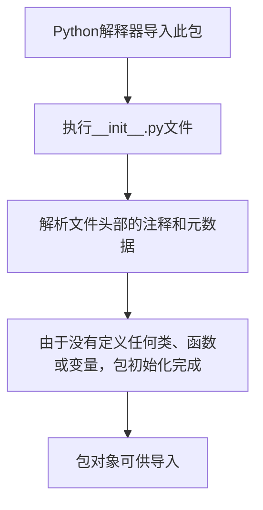

# `.\MetaGPT\tests\metagpt\roles\__init__.py` 详细设计文档

这是一个Python包的初始化文件，当前版本仅包含文件头部的元信息（如时间、作者、文件名），没有定义任何实际的类、函数或变量。它可能是一个更大项目的一部分，用于标记目录为Python包，但目前不包含任何可执行的功能性代码。

## 整体流程



## 类结构

```
此文件不包含任何类定义，因此没有类层次结构。
```

## 全局变量及字段


    

## 全局函数及方法


## 关键组件


### 初始化模块

这是一个Python包的初始化文件，用于标记目录为Python包，并可能包含包的版本信息、作者信息或导入关键模块以简化外部访问。


## 问题及建议


### 已知问题

-   该文件是一个空的 `__init__.py` 文件，仅包含元信息注释，未定义任何模块级别的变量、函数或类。这可能导致导入该包时无法提供任何有意义的公共接口或初始化逻辑。

### 优化建议

-   **明确包的功能与导出项**：如果该包旨在作为一个功能模块，应在 `__init__.py` 中明确导出核心类、函数或变量，例如使用 `__all__` 列表。这有助于用户理解包的用途并正确导入所需组件。
-   **添加包级文档字符串**：在文件顶部添加一个模块文档字符串（docstring），简要说明该包的目的、主要功能和用法示例，以提升代码的可读性和可维护性。
-   **考虑包初始化逻辑**：如果包需要在导入时执行某些初始化操作（如配置加载、资源预加载等），可以在 `__init__.py` 中添加相应的代码。但需注意避免执行耗时或产生副作用的操作。
-   **移除冗余注释**：文件头部的 `@Time`、`@Author`、`@File` 等注释通常由IDE或代码生成工具自动添加，并非Python标准。可以考虑移除或简化，仅保留必要的文档字符串和代码。


## 其它


### 设计目标与约束

该代码文件是一个包的初始化文件（`__init__.py`），其主要设计目标是定义Python包的命名空间，并可能包含包的版本信息、作者信息、以及导入包内关键模块以简化外部调用。约束在于它必须是一个有效的Python模块文件，其内容会影响包的导入行为和公开的接口。

### 错误处理与异常设计

当前文件为空，不包含任何自定义的错误处理或异常定义。包的初始化过程依赖于Python解释器的标准导入机制，任何错误（如循环导入、语法错误、找不到模块等）将由Python运行时抛出标准异常（如`ImportError`, `SyntaxError`）。

### 数据流与状态机

由于该文件当前仅作为包的标识和容器，不包含任何业务逻辑，因此不存在内部数据流或状态机。其“状态”仅在Python解释器加载（导入）该包时被设置一次。

### 外部依赖与接口契约

1.  **外部依赖**：无显式外部依赖。隐式依赖于Python标准库的导入系统。
2.  **接口契约**：作为包的入口点，它定义了包的顶层命名空间。当前空的`__init__.py`意味着包本身不直接提供任何变量、函数或类。外部代码通过`import`语句（如`import {package_name}`）与该文件交互，其公开的接口由后续在该文件中导入的子模块决定。

### 安全考虑

当前文件内容不涉及任何安全敏感操作，如文件读写、网络请求或系统命令执行。安全风险极低，主要风险来自于未来可能被添加的不安全代码。

### 测试策略

对`__init__.py`文件的测试通常是集成测试的一部分，验证包能否被正确导入，以及预期的顶级属性是否可用。由于当前文件为空，测试用例可能仅包含一个简单的导入断言（例如，`import {package_name}` 不抛出异常）。

### 部署与运维

该文件作为源代码的一部分进行部署。运维方面无特殊要求。如果未来在此文件中初始化全局资源（如数据库连接池、配置加载），则需要考虑这些资源的生命周期管理、失败重试和优雅关闭。

### 扩展性设计

当前结构具有良好的扩展性。未来可以通过在此文件中：
1.  导入子模块，将子模块的公共类、函数或变量暴露在包级别。
2.  定义包的`__version__`、`__author__`等元数据。
3.  编写包级别的初始化或清理代码（需谨慎，避免副作用）。

    