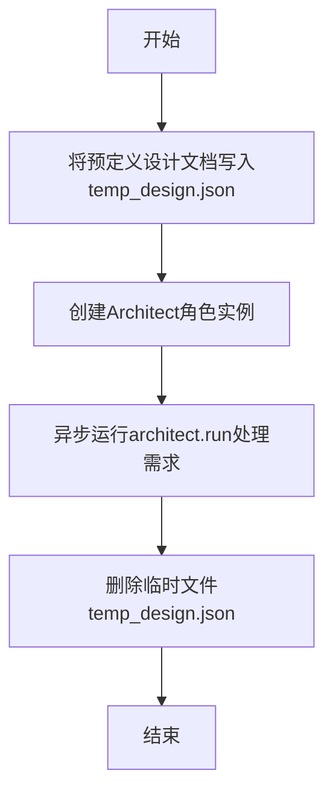

# `.\MetaGPT\tests\metagpt\roles\di\run_architect.py` 详细设计文档

该代码是一个使用MetaGPT框架的示例脚本，其核心功能是模拟一个架构师角色（Architect）处理用户需求的过程。具体来说，它接收一个关于贪吃蛇游戏系统设计的改写需求，将预定义的设计文档写入临时文件，然后调用MetaGPT的Architect角色来运行该需求，最后清理临时文件。

## 整体流程



## 类结构

```
Architect (MetaGPT角色类)
└── run (异步方法)
```

## 全局变量及字段


### `DESIGN_DOC_SNAKE`
    
一个包含贪吃蛇游戏系统设计文档的JSON格式字符串，作为初始设计模板。

类型：`str`
    


### `WRITE_SNAKE`
    
一个指令字符串，要求使用Pygame为贪吃蛇游戏编写一个系统设计。

类型：`str`
    


### `REWRITE_SNAKE`
    
一个指令字符串，要求重写位于`temp_design.json`的系统设计，并添加一个Web用户界面。

类型：`str`
    


### `CASUAL_CHAT`
    
一个随意的聊天消息字符串，用于测试或对话。

类型：`str`
    


    

## 全局函数及方法

### `main`

这是一个异步主函数，它根据传入的需求字符串，创建一个临时的设计文档文件，然后实例化一个`Architect`角色并运行它来处理该需求，最后清理临时文件。

参数：
- `requirement`：`str`，一个描述需求的字符串，例如要求重写设计文档或进行闲聊。

返回值：`None`，该函数没有返回值。

#### 流程图

```mermaid
flowchart TD
    A[开始: main(requirement)] --> B[将DESIGN_DOC_SNAKE写入temp_design.json]
    B --> C[实例化Architect角色]
    C --> D[异步运行architect.run<br/>传入包含需求的Message]
    D --> E[删除临时文件temp_design.json]
    E --> F[结束]
```

#### 带注释源码

```python
async def main(requirement):
    # 1. 将预定义的DESIGN_DOC_SNAKE（一个JSON格式的字符串）写入到临时文件"temp_design.json"中。
    with open("temp_design.json", "w") as f:
        f.write(DESIGN_DOC_SNAKE)
    
    # 2. 实例化一个Architect角色。
    architect = Architect()
    
    # 3. 异步调用architect的run方法，传入一个Message对象。
    #    Message的内容是传入的需求(requirement)，并指定发送给"Bob"。
    #    此步骤是核心，Architect角色将根据需求处理临时设计文件。
    await architect.run(Message(content=requirement, send_to="Bob"))
    
    # 4. 处理完成后，删除临时创建的"temp_design.json"文件，进行清理。
    os.remove("temp_design.json")
```

### `Architect.run`

该方法是一个异步方法，是 `Architect` 角色的核心执行方法。它接收一个 `Message` 对象作为输入，根据消息内容执行相应的逻辑。在本例中，它被用于处理一个重写系统设计的请求，具体行为是读取一个名为 `temp_design.json` 的临时设计文件，然后根据新的需求（例如“添加Web UI”）来更新或重写该设计文档。

参数：
-  `message`：`Message`，包含用户指令或需求的消息对象。

返回值：`None`，此方法不返回任何值。

#### 流程图

```mermaid
flowchart TD
    A[开始: run(message)] --> B{消息内容是否包含<br>“Rewrite”或“Update”?}
    B -- 是 --> C[读取临时设计文件<br>temp_design.json]
    C --> D[解析文件内容<br>为设计文档对象]
    D --> E[根据新需求<br>修改设计文档]
    E --> F[将更新后的设计文档<br>写回文件或输出]
    F --> G[结束]
    B -- 否 --> H[执行其他逻辑<br>（如初始设计）]
    H --> G
```

#### 带注释源码

```python
async def run(self, message: Message):
    """
    异步执行方法，处理传入的消息。
    根据消息内容决定是创建新设计还是修改现有设计。
    """
    # 1. 从消息中提取用户需求
    requirement = message.content
    
    # 2. 判断需求类型：是重写/更新现有设计，还是创建全新设计？
    #    通常通过检查关键词如“rewrite”、“update”或文件路径来判断。
    if "rewrite" in requirement.lower() or "update" in requirement.lower():
        # 3. 重写逻辑：读取现有的设计文件
        try:
            with open("temp_design.json", "r") as f:
                existing_design = f.read() # 读取现有设计内容
        except FileNotFoundError:
            # 如果文件不存在，则当作新设计处理或报错
            existing_design = None
            # 这里可以记录日志或抛出更具体的异常
            print("Warning: Design file not found. Proceeding as new design.")
        
        # 4. 将现有设计（如果存在）与新的需求结合，生成新的设计文档
        #    这里调用一个内部方法 `_rewrite_design` 来处理核心的重写逻辑。
        new_design = await self._rewrite_design(existing_design, requirement)
        
        # 5. 输出或保存新的设计文档
        #    示例中是打印，实际可能写入文件或发送消息。
        print(new_design)
        # 例如：await self._save_design(new_design)
        
    else:
        # 6. 全新设计逻辑：直接根据需求生成设计文档
        new_design = await self._generate_design(requirement)
        # 输出或保存新的设计文档
        print(new_design)
        # 例如：await self._save_design(new_design)
    
    # 7. 方法执行完毕，无返回值。
    #    在实际的MetaGPT框架中，这里可能会将结果封装成Message发送出去。
    return
```

## 关键组件


### 异步任务执行与消息驱动架构

代码通过 `asyncio.run` 启动一个异步主函数，该函数接收一个需求字符串作为输入，并创建一个 `Architect` 角色实例。系统通过向该角色发送一个包含需求的 `Message` 对象来驱动其执行，这体现了基于消息传递的异步任务处理模式。

### 临时文件管理与设计文档操作

代码定义了一个包含设计文档的常量字符串 `DESIGN_DOC_SNAKE`，并在 `main` 函数中将其写入一个名为 `temp_design.json` 的临时文件。在 `Architect` 角色完成任务后，该临时文件被删除。这模拟了一个读取、修改或重写现有设计文档的工作流程。

### 角色与智能体框架集成

代码的核心是实例化并运行一个来自 `metagpt` 框架的 `Architect` 角色。该角色被设计为能够处理 `Message` 对象，并根据消息内容（如 `REWRITE_SNAKE` 或 `CASUAL_CHAT`）执行相应的逻辑，例如分析需求、生成或修改系统设计。这展示了将特定功能封装为可交互智能体的架构模式。

### 需求与指令的抽象表示

代码通过预定义的字符串常量（如 `WRITE_SNAKE`, `REWRITE_SNAKE`, `CASUAL_CHAT`）来表示不同的用户需求或指令。这些常量作为参数传递给 `main` 函数，并最终封装到 `Message` 对象中，实现了需求输入的参数化和抽象化，便于测试和不同场景的切换。


## 问题及建议


### 已知问题

-   **硬编码的设计文档路径**：代码中硬编码了设计文档的写入路径 `temp_design.json` 和读取逻辑（在 `Architect` 角色内部），这缺乏灵活性，且在多线程或并发环境下可能导致文件访问冲突或数据不一致。
-   **临时文件管理不当**：代码在 `main` 函数中创建了临时文件 `temp_design.json`，但在 `Architect.run` 方法执行后立即删除。如果 `Architect` 角色的处理逻辑是异步的或在删除后仍需访问该文件，将导致错误。这种“创建-使用-立即删除”的模式风险较高。
-   **缺乏错误处理**：代码没有对文件操作（如打开、写入、删除）或 `Architect` 角色的异步执行过程进行异常捕获和处理。例如，如果 `temp_design.json` 文件无法创建或 `Architect.run` 抛出异常，程序将崩溃，且临时文件可能残留。
-   **代码功能与常量命名不符**：常量 `WRITE_SNAKE` 和 `REWRITE_SNAKE` 的命名暗示了“编写”和“重写”操作，但实际代码逻辑（写入固定内容到文件，然后让 `Architect` 处理一个需求）与“重写一个已有设计”的语义不完全匹配，尤其是 `DESIGN_DOC_SNAKE` 内容被固定写入，而非根据 `REWRITE_SNAKE` 的需求动态生成或修改。
-   **潜在的资源泄漏**：使用 `asyncio.run` 运行主函数是标准的，但若 `Architect` 角色内部启动了未正确管理的事件循环或任务，可能会在程序结束时留下未清理的异步资源。

### 优化建议

-   **解耦文件路径与逻辑**：将设计文档的路径作为配置项或函数参数传入，而不是硬编码。例如，可以修改 `main` 函数，接受一个 `design_file_path` 参数，或者从环境变量中读取。`Architect` 角色也应能配置其读取的源文件路径。
-   **改进临时文件生命周期管理**：重新评估临时文件的使用必要性。如果 `Architect` 角色必须从文件读取设计，应考虑使用更安全的方式，如 `tempfile` 模块创建具有唯一名称的临时文件，并确保其在所有使用完成后（例如在 `finally` 块中）被清理。或者，探索是否可以通过内存中的数据结构（如传递 `Message` 对象时附带设计文档内容）而非文件来传递信息。
-   **增加健壮的错误处理**：在 `main` 函数中包裹 `try...except...finally` 块。在 `try` 块中执行核心逻辑，在 `except` 中捕获 `IOError`、`asyncio` 相关异常等，并记录或打印有意义的错误信息。在 `finally` 块中确保临时文件被安全删除（如果使用临时文件），避免文件残留。
-   **重构常量与逻辑清晰度**：重新审视 `WRITE_SNAKE` 和 `REWRITE_SNAKE` 的使用场景。如果它们代表不同的操作模式，应实现对应的逻辑分支。例如，`WRITE_SNAKE` 可能对应创建一个空设计文件或初始模板，而 `REWRITE_SNAKE` 则读取现有文件并修改。当前代码中两者都触发相同的“写入固定内容然后处理需求”的流程，这令人困惑。考虑将设计文档的内容生成与 `Architect` 的处理需求解耦。
-   **明确异步任务管理**：确保 `Architect.run` 方法内部启动的所有异步任务都能在方法返回前被正确地 `await` 或通过任务组管理。在主入口点，使用 `asyncio.run()` 是合适的，但应确保它是程序中唯一的事件循环入口点。
-   **考虑添加日志记录**：引入日志记录机制（如使用 Python 的 `logging` 模块），记录关键步骤（如文件创建、`Architect` 角色开始运行、任务完成、错误发生等），便于调试和监控执行流程。


## 其它


### 设计目标与约束

本代码的核心设计目标是作为一个演示或测试用例，展示如何利用`metagpt`框架中的`Architect`角色，根据给定的需求（一段自然语言描述）来生成或修改一个软件系统的设计文档。其核心约束包括：
1.  **异步执行**：代码必须运行在异步环境中，主函数`main`被定义为`async`。
2.  **文件操作**：流程中涉及临时文件的创建（`temp_design.json`）和删除。
3.  **框架依赖**：代码严重依赖`metagpt`框架，特别是`Architect`角色和`Message`数据结构。
4.  **单一职责**：脚本功能聚焦，即根据输入的需求字符串，驱动`Architect`完成一次设计任务。

### 错误处理与异常设计

当前代码中错误处理机制较为薄弱，主要存在以下设计：
1.  **文件操作异常**：`open`和`os.remove`操作未使用`try-except`块进行包裹，可能导致`IOError`或`PermissionError`等异常直接抛出，导致程序崩溃。
2.  **异步任务异常**：`await architect.run(...)`执行过程中可能发生异常（例如，`Architect`内部错误、网络问题等），这些异常未被捕获和处理。
3.  **资源清理**：如果`architect.run()`执行过程中发生异常，`os.remove("temp_design.json")`可能不会被执行，导致临时文件残留。
4.  **输入验证**：`main`函数接收`requirement`参数，但未对其内容（如是否为空、格式）进行任何验证。

### 数据流与状态机

1.  **数据流**：
    *   **输入**：通过`main`函数的`requirement`参数传入，在示例中为预定义的字符串常量（`WRITE_SNAKE`, `REWRITE_SNAKE`, `CASUAL_CHAT`）。
    *   **内部数据**：
        *   `DESIGN_DOC_SNAKE`：一个硬编码的、符合特定格式的JSON字符串，作为初始设计文档模板。
        *   `temp_design.json`：一个临时文件，用于存储`DESIGN_DOC_SNAKE`的内容，作为`Architect`角色处理的输入或上下文。
    *   **处理**：`Architect.run()`方法接收一个包含`requirement`的`Message`对象，并可能读取`temp_design.json`文件，执行其内部逻辑（如分析、重写设计）。
    *   **输出**：`Architect`角色的输出（新的设计文档、回答等）由其内部逻辑决定，本代码未捕获或展示此输出。主要的副作用是临时文件的创建与删除。

2.  **状态机**（程序执行流程状态）：
    *   **初始状态**：脚本启动。
    *   **文件写入状态**：将`DESIGN_DOC_SNAKE`写入`temp_design.json`。
    *   **Architect处理状态**：异步调用`architect.run()`，这是核心处理阶段。
    *   **清理状态**：删除`temp_design.json`文件。
    *   **结束状态**：脚本运行完毕。任何阶段的异常都可能导致状态中断。

### 外部依赖与接口契约

1.  **外部库依赖**：
    *   `asyncio`：Python标准库，用于支持异步操作。
    *   `os`：Python标准库，用于文件删除操作。
    *   `metagpt`：第三方框架，是本代码功能的核心依赖。
        *   `from metagpt.roles.architect import Architect`：依赖`Architect`角色的具体实现。
        *   `from metagpt.schema import Message`：依赖`Message`数据结构的定义。

2.  **接口契约**：
    *   `Architect`类：必须提供一个异步的`run`方法，该方法接受一个`Message`对象作为参数。其内部行为（如何解析需求、如何处理文件）由`metagpt`框架定义。
    *   `Message`类：必须具有`content`和`send_to`等属性，用于封装通信内容。
    *   `temp_design.json`文件：作为与`Architect`角色交互的隐含接口，`Architect`的`run`方法预期可能会读取此文件以获取初始设计（尤其在`REWRITE_SNAKE`场景下）。文件的格式（JSON）和结构由`DESIGN_DOC_SNAKE`常量定义。

3.  **环境假设**：
    *   拥有当前目录的读写权限。
    *   Python环境已安装`metagpt`及其所有依赖项。
    *   运行在一个支持异步事件循环的环境中。

    