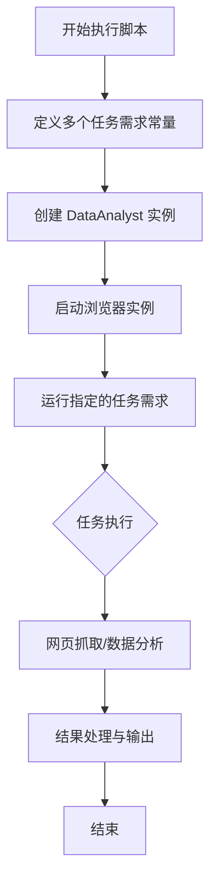
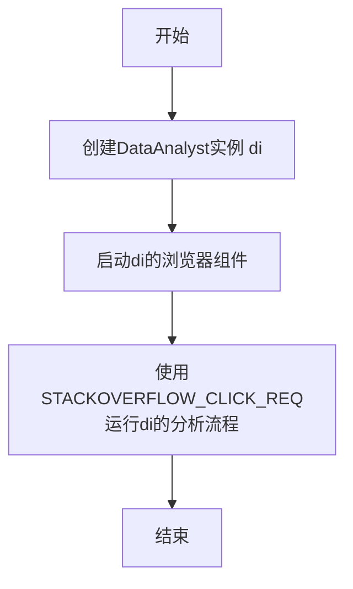
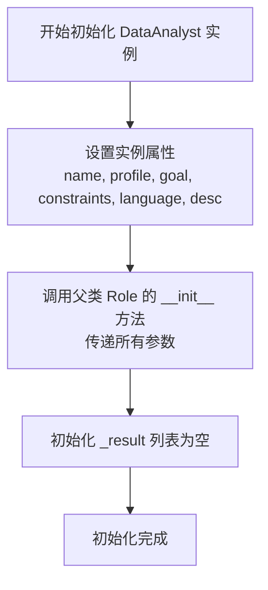

# `.\MetaGPT\tests\metagpt\roles\di\run_data_analyst.py` 详细设计文档

该代码是一个使用 MetaGPT 框架中 DataAnalyst 角色的演示脚本，用于执行多种数据获取与分析任务。它定义了多个不同领域（如房价预测、网页爬虫、信息检索）的任务需求描述，并通过异步主函数调用 DataAnalyst 来执行其中一个指定的网页抓取任务（从 StackOverflow 抓取问题列表）。

## 整体流程



## 类结构

```
外部依赖
├── metagpt.roles.di.data_analyst.DataAnalyst (主功能类)
└── asyncio (异步运行时)
```

## 全局变量及字段


### `HOUSE_PRICE_TRAIN_PATH`
    
存储房价数据集训练集CSV文件的本地路径字符串。

类型：`str`
    


### `HOUSE_PRICE_EVAL_PATH`
    
存储房价数据集评估集CSV文件的本地路径字符串。

类型：`str`
    


### `HOUSE_PRICE_REQ`
    
一个描述房价预测任务目标、数据路径和评估指标（对数RMSE）的详细需求说明字符串。

类型：`str`
    


### `CALIFORNIA_HOUSING_REQ`
    
一个描述加州房价数据集分析、建模（使用多种机器学习算法）和评估（MSE）任务的详细需求说明字符串。

类型：`str`
    


### `PAPER_LIST_REQ`
    
一个描述从指定网页表格中爬取包含特定关键词的论文列表并保存为CSV文件的任务需求说明字符串。

类型：`str`
    


### `ECOMMERCE_REQ`
    
一个描述从电商网站爬取第一页产品信息（名称、价格、URL、图片URL）并保存为CSV文件的任务需求说明字符串。

类型：`str`
    


### `NEWS_36KR_REQ`
    
一个描述从36kr创投平台爬取并筛选最近3天融资快讯信息，并保存为CSV文件的多步骤中文任务需求说明字符串。

类型：`str`
    


### `WIKIPEDIA_SEARCH_REQ`
    
一个描述在维基百科上搜索“LLM”并打印其所有有意义解释的任务需求说明字符串。

类型：`str`
    


### `STACKOVERFLOW_CLICK_REQ`
    
一个描述在Stack Overflow网站上点击“Questions”标签并爬取第一页问题信息（名称、投票、回答、浏览数）保存为CSV文件的任务需求说明字符串。

类型：`str`
    


### `DataAnalyst.browser`
    
DataAnalyst角色实例内部用于执行网页浏览、导航和自动化操作（如爬虫任务）的浏览器对象。

类型：`Browser (from metagpt.roles.di.data_analyst)`
    
    

## 全局函数及方法


### `main`

`main` 函数是程序的异步入口点。它创建了一个 `DataAnalyst` 实例，启动其内部的浏览器组件，然后使用一个预定义的网页抓取任务描述（`STACKOVERFLOW_CLICK_REQ`）来运行数据分析流程。

参数：
-  无显式参数。

返回值：`None`，该函数不返回任何值。

#### 流程图



#### 带注释源码

```python
async def main():
    # 1. 实例化 DataAnalyst 角色
    di = DataAnalyst()
    # 2. 启动 DataAnalyst 内部集成的浏览器（用于网页抓取等任务）
    await di.browser.start()
    # 3. 运行 DataAnalyst 的核心流程，传入一个具体的任务需求。
    #    这里的 STACKOVERFLOW_CLICK_REQ 是一个字符串常量，
    #    描述了“点击 StackOverflow 的 Questions 标签并抓取第一页数据”的任务。
    await di.run(STACKOVERFLOW_CLICK_REQ)
```


### `DataAnalyst.run`

该方法是一个异步方法，是`DataAnalyst`角色的核心执行入口。它接收一个自然语言描述的任务需求，通过调用`DataAnalyst`内部的`_act`方法，协调并执行一系列子任务（如数据获取、分析、建模、报告生成等），最终完成整个数据分析或数据工程任务。

参数：

-  `instruction`：`str`，一个描述具体任务的字符串。该字符串定义了任务的目标、数据源、处理步骤和输出要求。

返回值：`None`，此方法不返回任何值，其执行结果（如生成的报告、模型、数据文件等）通过角色内部状态或输出到指定位置来体现。

#### 流程图

```mermaid
flowchart TD
    A[开始: run(instruction)] --> B[调用 _act 方法]
    B --> C{_act 方法执行}
    C --> D[解析指令<br>规划任务]
    D --> E[执行子任务<br>（如数据爬取、清洗、建模）]
    E --> F[生成结果与报告]
    F --> G[结束]
```

#### 带注释源码

```python
    async def run(self, instruction: str) -> None:
        """
        异步执行方法，是DataAnalyst角色的主要入口点。
        接收一个任务指令，触发并管理整个分析流程的执行。

        Args:
            instruction (str): 描述具体分析任务的自然语言指令。
        """
        # 调用内部的 _act 方法，传入任务指令，开始执行核心业务流程。
        await self._act(instruction)
```

### `DataAnalyst.__init__`

该方法用于初始化 `DataAnalyst` 类的实例。它负责设置数据分析师角色的基本属性，包括其名称、配置文件、语言、目标、约束、描述、指令、工具集以及用于存储分析结果的列表。此初始化过程确保了 `DataAnalyst` 实例在后续执行数据分析任务时具备所有必要的上下文和能力。

参数：

-  `name`：`str`，数据分析师角色的名称，默认为 "David"。
-  `profile`：`str`，角色的配置文件或描述，默认为 "Data Analyst"。
-  `goal`：`str`，角色的目标，默认为 "Perform data analysis, data preprocessing, feature engineering, and modeling to predict the target."。
-  `constraints`：`str`，角色在执行任务时的约束条件，默认为 "Use machine learning techniques such as linear regression (including ridge regression and lasso regression), random forest, CatBoost, LightGBM, XGBoost or other appropriate method."。
-  `language`：`str`，角色使用的语言，默认为 "en"。
-  `desc`：`str`，角色的详细描述，默认为空字符串。
-  `**kwargs`：`dict`，其他可选的关键字参数，用于传递给父类的初始化方法。

返回值：`None`，此方法不返回任何值，仅用于初始化实例。

#### 流程图



#### 带注释源码

```python
def __init__(
    self,
    name: str = "David",
    profile: str = "Data Analyst",
    goal: str = "Perform data analysis, data preprocessing, feature engineering, and modeling to predict the target.",
    constraints: str = "Use machine learning techniques such as linear regression (including ridge regression and lasso regression), random forest, CatBoost, LightGBM, XGBoost or other appropriate method.",
    language: str = "en",
    desc: str = "",
    **kwargs,
):
    """
    初始化 DataAnalyst 实例。

    参数:
        name (str): 数据分析师角色的名称，默认为 "David"。
        profile (str): 角色的配置文件或描述，默认为 "Data Analyst"。
        goal (str): 角色的目标，默认为执行数据分析、预处理、特征工程和建模。
        constraints (str): 角色在执行任务时的约束条件，默认为使用指定的机器学习技术。
        language (str): 角色使用的语言，默认为 "en"。
        desc (str): 角色的详细描述，默认为空字符串。
        **kwargs (dict): 其他可选的关键字参数，传递给父类 Role 的初始化方法。
    """
    # 调用父类 Role 的 __init__ 方法，传递所有参数以完成基础角色的初始化
    super().__init__(
        name=name,
        profile=profile,
        goal=goal,
        constraints=constraints,
        language=language,
        desc=desc,
        **kwargs,
    )
    # 初始化一个空列表，用于存储数据分析任务的结果
    self._result = []
```

## 关键组件


### DataAnalyst 角色

DataAnalyst 是 MetaGPT 框架中的一个核心角色，负责执行端到端的数据分析任务。它能够理解自然语言描述的需求，并自主规划、执行包括数据获取（如网络爬虫）、数据预处理、特征工程、建模和结果评估在内的完整数据分析流程。

### 异步任务执行与浏览器自动化

代码通过 `asyncio.run(main())` 启动异步执行流程。`DataAnalyst` 角色内部集成了浏览器自动化能力（通过 `di.browser.start()` 启动），使其能够处理涉及网页交互、数据抓取和动态内容解析的任务，例如爬取 StackOverflow 问题列表。

### 任务需求定义与配置

代码通过一系列预定义的字符串常量（如 `STACKOVERFLOW_CLICK_REQ`）来具体描述不同的数据分析任务。这些需求说明充当了高级别的配置或“提示”，指导 `DataAnalyst` 角色执行特定的操作序列，例如指定目标网站、需要提取的数据字段、保存格式以及任务的特殊注意事项。

### 模块化与可扩展的任务处理

代码展示了通过更换 `DataAnalyst.run()` 方法的输入参数，即可轻松切换执行不同的预定义任务（如房价预测、电商数据爬取、新闻快讯收集等）。这体现了系统设计上的模块化和可扩展性，核心的 `DataAnalyst` 引擎能够解析并适配多种差异化的需求。


## 问题及建议


### 已知问题

-   **硬编码的路径和配置**：代码中包含了多个硬编码的文件路径（如 `HOUSE_PRICE_TRAIN_PATH`）和任务请求字符串。这使得代码难以复用和维护，任何路径或需求的变更都需要直接修改源代码。
-   **缺乏模块化和配置管理**：所有任务请求都以全局变量的形式定义在主脚本中，与执行逻辑（`main` 函数）紧耦合。这违反了关注点分离原则，使得添加新任务或修改现有任务变得笨拙。
-   **潜在的资源管理风险**：在 `main` 函数中，`DataAnalyst` 实例的浏览器（`browser`）被启动，但在脚本结束或发生异常时，没有明确的代码来确保浏览器被正确关闭，可能导致资源泄漏。
-   **单一任务执行**：当前 `main` 函数仅执行 `STACKOVERFLOW_CLICK_REQ` 任务。虽然这可能是示例，但代码结构没有提供一种清晰、可配置的方式来选择或顺序执行多个预定义任务。
-   **错误处理不足**：`main` 函数和 `di.run` 调用周围没有错误处理逻辑（如 `try...except`）。网络请求、页面解析或文件操作失败可能导致脚本崩溃，且没有提供有意义的错误信息或恢复机制。
-   **依赖特定环境**：文件路径（如 `/data/house-prices-advanced-regression-techniques/...`）暗示了对特定目录结构的依赖，这在不同环境（如开发、测试、生产）中可能不存在或不一致，导致运行时错误。

### 优化建议

-   **引入配置文件**：将任务请求、文件路径等配置信息移出代码，放入配置文件（如 JSON、YAML 或 `.env` 文件）中。这提高了可维护性，并允许在不同环境（开发、测试、生产）中轻松切换配置。
-   **重构任务管理**：创建一个专门的任务注册表或管理器类。该类可以从配置文件加载任务定义，并提供方法来按名称获取、验证和执行任务。这使主执行逻辑与任务定义解耦。
-   **实现资源上下文管理**：修改 `DataAnalyst` 类的使用方式，或确保在 `main` 函数中使用 `async with` 上下文管理器来启动和关闭浏览器。这样可以保证即使在发生异常时，资源也能被正确清理。
-   **增强任务调度与选择**：改进 `main` 函数，使其能够通过命令行参数、配置文件或交互式菜单接受要执行的任务标识符。这样可以灵活地运行单个任务、一系列任务或所有任务。
-   **添加全面的错误处理与日志记录**：在 `main` 函数和 `DataAnalyst.run` 方法周围包裹健壮的错误处理逻辑。捕获异常，记录详细的错误日志（包括任务名称、错误类型和堆栈跟踪），并根据错误类型尝试恢复或优雅降级。考虑使用结构化的日志库。
-   **环境变量与路径抽象**：使用环境变量来定义基础数据路径，并在代码中通过 `os.path.join` 等方式构建完整路径。或者，创建一个路径配置模块，根据当前运行环境解析和提供正确的路径。
-   **增加输入验证**：在任务执行前，验证配置的路径是否存在、URL 是否可访问等。这可以在运行时尽早发现问题，提供更清晰的错误信息。
-   **考虑任务并行化**：如果任务之间相互独立，可以考虑使用 `asyncio.gather` 或其他并发机制来并行执行多个任务，以提高整体执行效率。
-   **编写单元测试与集成测试**：为配置加载、任务管理、核心数据处理函数等关键组件编写测试。对于涉及网络请求的任务，可以使用 mocking 技术进行测试，以确保代码的健壮性和可靠性。


## 其它


### 设计目标与约束

本代码的设计目标是提供一个灵活、可扩展的框架，用于执行多种类型的数据分析任务。这些任务包括但不限于：基于结构化数据的预测建模、网页数据抓取（爬虫）以及信息提取。核心约束包括：
1.  **任务多样性支持**：框架必须能够解析和执行多种自然语言描述的任务需求，从传统的机器学习流程到复杂的网页交互。
2.  **异步执行**：为支持高效的网络I/O操作（如网页抓取），核心执行流程采用异步编程模型。
3.  **可配置性**：通过预定义的全局变量（任务需求字符串）来配置不同的任务，无需修改核心代码。
4.  **模块化**：将具体的任务执行逻辑封装在 `DataAnalyst` 角色类中，主程序仅负责初始化和触发。

### 错误处理与异常设计

代码中未显式展示详细的错误处理机制，但基于其任务性质，潜在的错误处理需求包括：
1.  **网络请求异常**：在执行网页抓取任务时，需处理连接超时、HTTP错误（如404、500）、SSL证书错误等。应实现重试机制和友好的错误日志记录。
2.  **数据解析异常**：在解析HTML、JSON或处理CSV文件时，可能遇到格式不符、编码错误或缺失数据。需要健壮的解析逻辑和异常捕获，防止程序因单条数据问题而崩溃。
3.  **外部服务依赖异常**：例如，在 `CALIFORNIA_HOUSING_REQ` 任务中依赖 `sklearn.datasets` 在线获取数据，需要处理可能的网络或服务不可用情况。
4.  **任务指令解析异常**：`DataAnalyst.run()` 方法需要解析自然语言指令。如果指令模糊或包含无法识别的操作，应有相应的反馈或降级处理策略。
5.  **资源清理**：在 `main` 函数中，`browser.start()` 启动了浏览器实例，必须有确保在任务结束或发生异常时能正确执行 `browser.close()` 的逻辑，防止资源泄漏。

### 数据流与状态机

1.  **数据流**：
    *   **输入**：预定义的、描述任务的全局字符串常量（如 `STACKOVERFLOW_CLICK_REQ`）。
    *   **处理**：`main` 函数创建 `DataAnalyst` 实例，调用其异步 `run` 方法，并将任务需求字符串传入。`DataAnalyst.run()` 方法内部负责解析需求、执行相应操作（数据加载、分析、建模或网页抓取）。
    *   **输出**：根据任务需求，输出可能包括控制台打印的指标（如RMSE、MSE）、生成的CSV文件、或打印到控制台的列表信息。输出目标由任务需求字符串具体指定。

2.  **状态机（简化）**：
    *   **初始状态**：脚本加载，全局变量定义。
    *   **启动状态**：`main` 函数被调用，`DataAnalyst` 实例创建，浏览器启动 (`di.browser.start()`)。
    *   **执行状态**：`di.run(task_req)` 被调用，根据 `task_req` 的内容，内部状态可能经历：解析需求 -> 获取数据（从文件/网络）-> 处理/分析数据 -> 输出结果。
    *   **结束状态**：任务执行完毕，程序退出。理想情况下，应包含浏览器关闭等清理动作。

### 外部依赖与接口契约

1.  **外部库依赖**：
    *   `metagpt`: 核心框架，提供 `DataAnalyst` 角色类。这是代码运行的基础。
    *   `asyncio`: Python标准库，用于支持异步操作。
    *   **隐式依赖**：根据不同的任务需求，`DataAnalyst` 内部可能调用以下库，但未在代码中显式导入：
        *   `pandas`, `numpy`: 用于数据处理和分析。
        *   `scikit-learn`, `xgboost`, `lightgbm`, `catboost`: 用于机器学习建模。
        *   `aiohttp`, `requests`, `beautifulsoup4`, `selenium`: 用于网页抓取和解析。
        *   `playwright` 或 `puppeteer` (通过 `browser` 属性): 用于控制浏览器进行复杂交互和渲染。

2.  **接口契约**：
    *   `DataAnalyst` 类：提供 `run` 方法作为主要接口。调用者需传递一个描述任务的自然语言字符串。该方法应返回任务执行结果（可能为 `None`，具体取决于实现）。
    *   `DataAnalyst.browser` 属性：预期提供一个具有 `start()` 和 `close()` 方法的浏览器控制对象，用于网页交互任务。
    *   **文件路径契约**：在 `HOUSE_PRICE_REQ` 任务中，代码假设特定路径 (`/data/house-prices-advanced-regression-techniques/`) 下存在 `split_train.csv` 和 `split_eval.csv` 文件。这是一个硬编码的依赖，在实际部署中可能成为问题。
    *   **网络服务契约**：部分任务（如 `CALIFORNIA_HOUSING_REQ`, `PAPER_LIST_REQ`）依赖于特定网站或API的可用性及页面结构稳定性。这些外部服务的任何变更都可能导致任务失败。

### 安全与合规性考虑

1.  **网页抓取合规性**：
    *   **Robots协议**：代码应尊重目标网站的 `robots.txt` 文件规定。
    *   **访问频率**：需要实现请求速率限制，避免对目标服务器造成过大负载，防止IP被封禁。
    *   **版权与数据使用权**：抓取的数据可能受版权保护。代码应明确其用于个人学习或研究目的，并考虑数据的后续使用是否合规。
2.  **数据安全**：
    *   代码中包含了硬编码的数据文件路径。在生产环境中，敏感路径或配置应通过环境变量或配置文件管理，避免泄露。
    *   任务需求字符串中可能包含URL等外部资源信息，需防范注入攻击（虽然在此上下文中风险较低）。
3.  **依赖安全**：所有第三方库（尤其是 `metagpt` 及其间接依赖）应使用经过验证的版本，并定期更新以修复已知安全漏洞。

### 部署与运行环境

1.  **环境要求**：
    *   **Python版本**：需要支持 `async/await` 语法的Python版本（建议3.7+）。
    *   **浏览器驱动**：对于需要浏览器交互的任务，需要安装相应的浏览器（如Chrome、Firefox）及其与 `playwright` 或 `selenium` 兼容的驱动。
    *   **系统依赖**：某些数据科学或机器学习库可能有底层系统依赖（如C++编译器、数学库）。
2.  **运行方式**：通过命令行执行 `python <script_name>.py`。由于使用了异步 `main` 函数，入口点通过 `asyncio.run(main())` 启动。
3.  **配置管理**：当前任务通过硬编码的全局变量配置。更灵活的部署方式是将这些任务需求移至外部配置文件（如YAML、JSON）或数据库，并通过命令行参数指定要运行的任务。
4.  **日志与监控**：代码未体现日志记录。在生产部署中，应添加详细的日志，记录任务开始、结束、关键步骤、警告和错误，便于问题排查和运行状态监控。

    