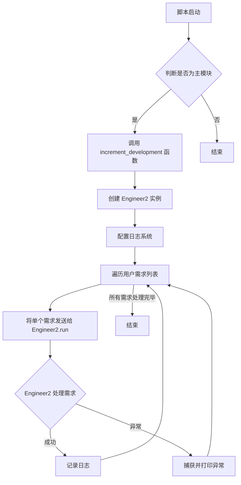
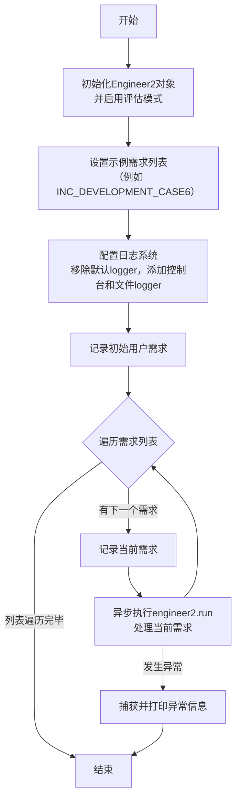
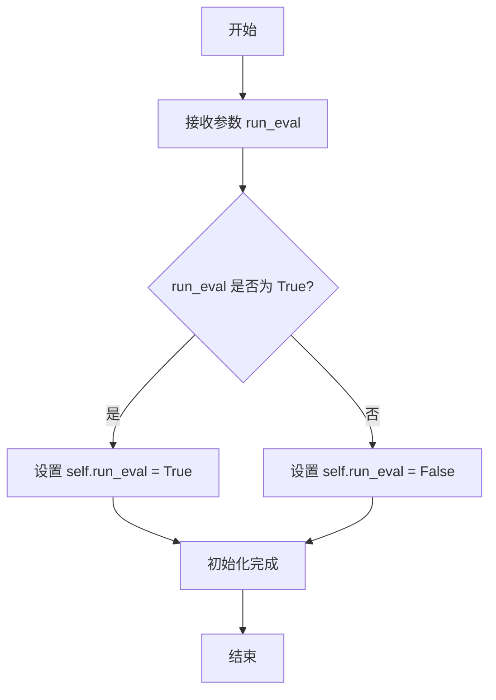

# `.\MetaGPT\tests\metagpt\roles\di\run_engineer2.py` 详细设计文档

该代码是一个基于MetaGPT框架的AI工程师代理（Engineer2）的启动脚本，主要用于演示和测试增量式软件开发流程。它预定义了多个游戏（如2048、贪吃蛇）的设计文档、任务文档和用户需求，并通过异步函数调用Engineer2角色来执行代码生成、代码审查和迭代开发任务。

## 整体流程



## 类结构

```
Engineer2 (来自 metagpt.roles.di.engineer2)
├── 继承自 Role (MetaGPT 角色基类)
│   ├── 包含 Action、Memory 等组件
│   └── 负责执行规划、编码、审查等任务
└── 本脚本作为其客户端和测试用例
```

## 全局变量及字段


### `DESIGN_DOC_2048`
    
包含2048游戏设计文档的JSON字符串，定义了实现方法、文件列表、数据结构、接口和程序调用流程

类型：`str`
    


### `TASK_DOC_2048`
    
包含2048游戏任务文档的JSON字符串，定义了所需的Python包、逻辑分析、任务列表和共享知识

类型：`str`
    


### `DESIGN_DOC_SNAKE`
    
包含贪吃蛇游戏设计文档的JSON字符串，定义了实现方法、文件列表、数据结构、接口和程序调用流程

类型：`str`
    


### `TASK_DOC_SNAKE`
    
包含贪吃蛇游戏任务文档的JSON字符串，定义了所需的Python包、逻辑分析、任务列表和共享知识

类型：`str`
    


### `GAME_REQ_2048`
    
2048游戏的完整开发请求字符串，包含设计文档和任务文档，指定了代码输出路径

类型：`str`
    


### `GAME_REQ_SNAKE`
    
贪吃蛇游戏的完整开发请求字符串，包含设计文档和任务文档，指定了代码输出路径

类型：`str`
    


### `GAME_REQ_2048_NO_DOC`
    
无文档的2048游戏开发请求字符串，要求使用pygame实现并指定代码输出路径

类型：`str`
    


### `GAME_INC_REQ_2048`
    
2048游戏的增量开发请求字符串，用于修复合并后不生成新方块的bug

类型：`str`
    


### `GAME_INC_REQ_SNAKE`
    
贪吃蛇游戏的增量开发请求字符串，用于修复generate_new_position函数参数缺失的bug

类型：`str`
    


### `CASUAL_CHAT`
    
简单的聊天请求字符串，询问AI的名称

类型：`str`
    


### `INC_DEVELOPMENT_CASE1`
    
贪吃蛇游戏增量开发用例1的需求列表，包含控制反转、按钮位置、暂停功能和实时显示等要求

类型：`list[str]`
    


### `INC_DEVELOPMENT_CASE2`
    
贪吃蛇游戏增量开发用例2的需求列表，包含标题修改、控制反转、暂停功能、实时显示和样式优化等要求

类型：`list[str]`
    


### `INC_DEVELOPMENT_CASE3`
    
2048游戏增量开发用例3的需求列表，包含按钮位置、实时显示、样式优化和重启功能等要求

类型：`list[str]`
    


### `INC_DEVELOPMENT_CASE4`
    
2048游戏增量开发用例4的需求列表，包含实时显示和重启功能等要求

类型：`list[str]`
    


### `INC_DEVELOPMENT_CASE5`
    
TODO列表网站增量开发用例的需求列表，包含任务管理功能和清理按钮等要求

类型：`list[str]`
    


### `INC_DEVELOPMENT_CASE6`
    
塔罗牌网站增量开发用例的需求列表，包含响应式布局、角色扩充、描述优化和语言替换等要求

类型：`list[str]`
    


    

## 全局函数及方法

### `increment_development`

这是一个异步函数，用于执行增量开发流程。它初始化一个`Engineer2`角色，配置日志系统，并循环处理一系列用户需求（存储在`example`列表中）。对于列表中的每个需求，它都会调用`engineer2.run`方法来执行相应的开发任务。该函数主要用于自动化处理多个、顺序的软件开发或修改请求。

参数：
- 无显式参数。函数内部使用预定义的常量列表（如`INC_DEVELOPMENT_CASE6`）作为输入源。

返回值：`None`，该函数不返回任何值，其主要作用是执行一系列异步操作。

#### 流程图



#### 带注释源码

```python
async def increment_development():
    # 1. 初始化Engineer2角色，并设置run_eval=True以启用评估模式
    engineer2 = Engineer2(run_eval=True)
    
    # 2. 定义本次运行要处理的需求列表，这里以INC_DEVELOPMENT_CASE6为例
    example = INC_DEVELOPMENT_CASE6
    
    # 3. 配置日志系统
    #    移除所有现有的日志处理器
    logger.remove()
    #    添加一个输出到标准错误(stderr)的处理器，日志级别为INFO
    logger.add(sys.stderr, level="INFO")
    #    添加一个输出到文件的处理器，日志文件以UUID命名，级别为DEBUG
    logger.add(Path("logs") / f"{str(uuid.uuid4())[-12:]}.log", level="DEBUG")
    
    # 4. 记录整个用户需求列表，便于追踪
    logger.info("user requirement:\n" + "\n".join(example))
    
    # 5. 遍历需求列表，依次处理每个需求
    try:
        for user_requirement in example:
            # 记录当前正在处理的具体需求
            logger.info(f"input:{user_requirement}")
            # 调用Engineer2的run方法异步执行该需求对应的开发任务
            await engineer2.run(user_requirement)
    except Exception as e:
        # 6. 异常处理：捕获并打印执行过程中出现的任何异常
        print(e)
```

### `Engineer2.__init__`

该方法用于初始化 `Engineer2` 类的实例，设置其内部状态和配置选项，包括是否启用评估模式。

参数：

- `run_eval`：`bool`，指示是否启用评估模式。如果为 `True`，则启用评估功能；如果为 `False` 或未提供，则不启用。

返回值：`None`，无返回值。

#### 流程图



#### 带注释源码

```python
def __init__(self, run_eval=False):
    """
    初始化 Engineer2 实例。

    参数:
        run_eval (bool): 是否启用评估模式。默认为 False。
    """
    # 将传入的 run_eval 参数赋值给实例变量 self.run_eval
    self.run_eval = run_eval
```

### `Engineer2.run`

该方法是一个异步方法，用于执行工程师角色的核心工作流。它接收一个用户需求字符串，解析需求，生成或更新代码实现，并可能进行代码审查和优化。该方法内部会协调多个子任务，包括需求分析、任务分解、代码编写、代码审查和重构等，以完成一个软件项目的开发或迭代。

参数：

- `user_requirement`：`str`，用户提供的需求描述文本，用于指导代码的生成或修改。

返回值：`None`，该方法不返回任何值，其执行结果体现在文件系统的代码文件变更和日志输出中。

#### 流程图

```mermaid
flowchart TD
    A[开始: run(user_requirement)] --> B[解析用户需求]
    B --> C{需求类型判断}
    C -- 新项目需求 --> D[生成设计文档与任务列表]
    C -- 增量/修复需求 --> E[分析现有代码与问题]
    D --> F[根据任务列表<br>循环执行代码编写]
    E --> G[执行代码审查]
    G --> H[根据审查结果<br>生成修复任务]
    H --> F
    F --> I[执行代码审查]
    I --> J[根据审查结果<br>进行代码优化或重构]
    J --> K[结束]
```

#### 带注释源码

```python
    async def run(self, user_requirement: str) -> None:
        """
        执行工程师角色的主要工作流。
        1. 解析用户需求。
        2. 根据需求类型（新项目/增量开发/问题修复）采取不同策略。
        3. 对于新项目，生成设计文档和任务列表，然后依次实现每个任务。
        4. 对于增量开发或问题修复，先进行代码审查，识别问题，然后生成修复任务并执行。
        5. 在代码实现后，执行代码审查，并根据审查结果进行优化或重构。
        整个过程是异步的，并会通过日志记录关键步骤和结果。
        """
        # 解析用户需求，可能涉及自然语言处理以理解意图
        parsed_requirement = self._parse_requirement(user_requirement)
        
        # 判断需求类型：是新项目、增量功能还是问题修复
        requirement_type = self._classify_requirement(parsed_requirement)
        
        if requirement_type == "new_project":
            # 为新项目生成顶层设计文档和详细的任务分解列表
            design_doc, task_list = await self._generate_design_and_tasks(parsed_requirement)
            # 循环处理任务列表中的每一项，编写代码
            for task in task_list:
                await self._write_code_for_task(task, design_doc)
        else:  # "incremental" or "bug_fix"
            # 对于已有项目，首先进行代码审查以理解现状和发现问题
            code_review_results = await self._review_existing_code(parsed_requirement)
            # 基于审查结果，生成需要执行的具体修复或增强任务
            fix_tasks = self._generate_fix_tasks_from_review(code_review_results)
            for task in fix_tasks:
                await self._write_code_for_task(task)
        
        # 在所有主要代码编写完成后，执行一轮整体的代码审查
        final_review = await self._conduct_final_code_review()
        # 根据最终审查的结果，可能需要对代码进行优化、重构或调整
        if final_review.requires_optimization:
            await self._refactor_and_optimize_code(final_review)
        
        # 记录工作流完成
        logger.info("Engineer2 run workflow completed.")
```

## 关键组件


### 异步任务执行引擎

该组件通过 `asyncio.run(increment_development())` 驱动，负责协调整个脚本的异步执行流程。它定义了 `increment_development` 异步函数，该函数初始化 `Engineer2` 角色，并循环处理一系列用户需求，实现增量式开发任务。

### 需求与设计文档管理器

该组件通过预定义的常量（如 `DESIGN_DOC_2048`, `TASK_DOC_SNAKE`, `GAME_REQ_2048` 等）来存储和管理不同游戏项目（如2048、贪吃蛇）的完整设计规范、任务清单和用户请求。它作为 `Engineer2` 角色的输入数据源，为代码生成和迭代开发提供结构化指导。

### 增量开发用例集

该组件由多个列表（如 `INC_DEVELOPMENT_CASE1` 到 `INC_DEVELOPMENT_CASE6`）构成，每个列表代表一个独立的、多步骤的增量开发场景。每个场景包含从初始需求到后续功能增强的一系列用户指令，用于测试和演示 `Engineer2` 角色处理复杂、分阶段开发任务的能力。

### 日志与调试系统

该组件通过 `metagpt.logs.logger` 实现，在 `increment_development` 函数中进行配置。它负责将不同级别的日志信息（INFO, DEBUG）同时输出到标准错误流（`sys.stderr`）和指定的日志文件中，用于跟踪 `Engineer2` 角色的执行过程和调试问题。

### 工程代理角色 (Engineer2)

该组件是 `metagpt.roles.di.engineer2.Engineer2` 类的实例，是代码生成与迭代的核心执行者。它接收结构化的需求或设计文档（如 `GAME_REQ_2048`）或增量开发指令（如 `INC_DEVELOPMENT_CASE6`），并执行完整的软件开发周期，包括代码编写、代码审查和代码改进。


## 问题及建议

### 已知问题

1.  **硬编码的路径和配置**：代码中多处使用了硬编码的路径（如 `/Users/gary/Files/temp/workspace/...` 和 `/home/mgx/mgx/MetaGPT/workspace/...`）和游戏设计文档字符串。这使得代码难以移植到其他环境或用于其他项目，降低了可维护性和可复用性。
2.  **全局变量污染**：`DESIGN_DOC_2048`、`TASK_DOC_2048`、`GAME_REQ_2048` 等大量全局变量直接定义在模块顶层。这不仅增加了模块的初始化负担，还可能导致命名冲突，并使代码结构显得混乱。
3.  **缺乏配置管理**：游戏需求、设计文档和任务列表都以字符串形式硬编码在代码中。理想情况下，这些配置应存储在外部文件（如 JSON、YAML）或数据库中，便于独立管理和更新，而无需修改源代码。
4.  **代码重复与结构僵化**：`GAME_REQ_2048` 和 `GAME_REQ_SNAKE` 等变量的构建逻辑相似，但通过字符串格式化重复实现。`increment_development` 函数中的多个 `INC_DEVELOPMENT_CASE` 列表也呈现重复模式。这违反了 DRY（Don‘t Repeat Yourself）原则。
5.  **入口函数职责过重**：`increment_development` 函数承担了过多职责：配置日志、选择用例、循环处理需求。这降低了函数的可测试性和单一职责性。错误处理也较为简单，仅打印异常。
6.  **潜在的资源管理问题**：代码使用 `asyncio.run` 运行主协程，但在 `increment_development` 函数中创建的 `Engineer2` 实例及其可能持有的资源（如文件句柄、网络连接）没有显式的清理或关闭逻辑。
7.  **日志配置硬编码**：日志文件路径和级别在函数内部硬编码配置，限制了日志策略的灵活性。

### 优化建议

1.  **外部化配置**：
    *   将硬编码的路径、设计文档、任务文档和游戏需求移至配置文件（如 `config.yaml` 或 `settings.py`）。
    *   使用环境变量或命令行参数来指定工作空间根目录等动态路径。
2.  **重构全局变量**：
    *   将相关的配置变量（如设计文档、任务文档）封装到配置类或字典中。
    *   考虑使用单例模式或依赖注入来管理这些配置数据，减少全局命名空间的污染。
3.  **实现配置加载器**：
    *   创建一个专门的配置加载模块，负责从外部文件或环境变量中读取和验证配置，并提供给程序其他部分使用。
4.  **抽象和复用代码**：
    *   将构建游戏请求的逻辑（如组合设计文档和任务文档）抽象成独立的函数或类方法。
    *   将 `INC_DEVELOPMENT_CASE` 列表的定义移至配置文件，并通过一个统一的加载器来获取用例列表。
5.  **重构入口函数**：
    *   将 `increment_development` 函数拆分为更小的、职责单一的函数，例如：`setup_logging`, `load_development_cases`, `process_requirement`。
    *   改进错误处理，记录更详细的错误信息，并考虑实现重试机制或更优雅的降级策略。
6.  **完善资源管理**：
    *   为 `Engineer2` 类实现上下文管理器协议（`__aenter__` / `__aexit__`）或提供明确的 `close` / `cleanup` 方法，确保在程序结束时正确释放资源。
    *   在主协程中使用 `async with` 语句来管理 `Engineer2` 实例的生命周期。
7.  **增强日志灵活性**：
    *   将日志配置（如文件路径、格式、级别）移至外部配置文件。
    *   提供通过命令行参数覆盖默认日志配置的能力。
8.  **增加类型注解**：为函数和方法参数、返回值添加更详细的类型注解，以提高代码的可读性和可维护性，并方便静态类型检查工具（如 `mypy`）进行分析。
9.  **编写单元测试**：为关键函数（如配置加载、请求构建）编写单元测试，确保重构和优化不会引入回归错误。

## 其它


### 设计目标与约束

本代码是一个基于`Engineer2`角色的增量式游戏开发任务执行器。其核心设计目标是：**解析结构化的用户需求（如游戏设计文档和任务列表），并驱动`Engineer2`角色按顺序、自动化地执行代码编写、代码审查和问题修复等软件开发任务**。主要约束包括：1) 输入需求需遵循预定义的JSON格式（如`DESIGN_DOC_*`和`TASK_DOC_*`）或明确的自然语言指令列表；2) 执行过程是异步的，依赖于`asyncio`事件循环；3) 代码生成和修改操作限定在指定的工作空间目录下（如`/Users/gary/Files/temp/workspace/`）；4) 要求生成完整可运行的代码，不能遗留未实现的占位符。

### 错误处理与异常设计

代码中的错误处理主要采用“捕获-记录-继续/终止”的模式。在`increment_development`函数中，使用`try...except`块包裹核心执行逻辑`await engineer2.run(user_requirement)`。当`Engineer2`执行过程中抛出任何`Exception`时，异常会被捕获并打印到控制台（`print(e)`），但程序不会因此崩溃，这确保了单个任务的失败不会中断整个需求列表的处理流程。然而，对于`Engineer2`内部可能发生的更细粒度的错误（如文件读写错误、依赖安装失败、代码生成逻辑错误等），当前代码并未显式处理，这些错误的传播和处置依赖于`Engineer2`类自身的实现。日志系统（`metagpt.logs.logger`）被配置为同时输出到标准错误流和文件，用于记录执行过程中的INFO和DEBUG级别信息，辅助问题定位。

### 数据流与状态机

数据流始于预定义的、硬编码的游戏需求字符串常量（如`GAME_REQ_2048`, `INC_DEVELOPMENT_CASE6`）。主执行路径`increment_development`将需求列表（`example`）作为输入，按顺序迭代。对于列表中的每一项`user_requirement`，它被传递给`Engineer2`实例的`run`方法。`Engineer2`类作为核心处理器，其内部应包含解析需求、规划任务、执行代码生成/修改、运行代码审查等状态转换。虽然外部代码没有展示`Engineer2`的内部状态机，但可以推断其工作流可能包含如下状态：`IDLE` -> `PARSING_REQUIREMENT` -> `PLANNING_TASKS` -> `WRITING_CODE` -> `REVIEWING_CODE` -> `FIXING_ISSUES` -> `COMPLETED`。每个`user_requirement`的处理是独立的，前一个任务的结果（如生成的文件）构成下一个任务执行的上下文（工作空间状态）。全局数据（如`DESIGN_DOC_SNAKE`）作为模板或知识库被引用，但不随执行过程改变。

### 外部依赖与接口契约

1.  **外部库依赖**:
    *   `asyncio`: 提供异步执行框架，是`increment_development`和`Engineer2.run`方法的基础。
    *   `metagpt`: 核心依赖，特别是从`metagpt.roles.di.engineer2`导入的`Engineer2`类。该类的`run`方法是主要的功能接口，其契约是接受一个字符串类型的用户需求，并异步执行相应的开发任务。
    *   `pathlib.Path`, `sys`, `uuid`, `loguru.logger`: 用于路径操作、日志配置和生成唯一标识符的辅助库。

2.  **接口契约**:
    *   `Engineer2.run(user_requirement: str) -> Awaitable[None]`: 核心异步接口。调用者需提供明确的需求描述。该接口负责整个任务生命周期的管理，但其内部的具体步骤、返回值细节未在给定代码中公开。
    *   **隐式文件系统契约**: 代码通过硬编码的路径（如`/Users/gary/Files/temp/workspace/2048_game/src`）与文件系统交互。`Engineer2`被期望在该目录下进行文件的创建、读取、修改和删除。
    *   **需求格式契约**: 虽然代码也能处理自由文本（如`GAME_REQ_2048_NO_DOC`），但其高效处理依赖于`DESIGN_DOC_*`和`TASK_DOC_*`中定义的特定JSON结构。这构成了与上游需求提供方（可能是另一个AI模块或用户）的隐式数据接口契约。

### 配置与初始化

程序的配置主要体现在`increment_development`函数中：
1.  **`Engineer2`实例化**: 创建`Engineer2`对象时传入`run_eval=True`参数，这表明实例被配置为在运行中包含评估（可能是代码审查或测试）环节。
2.  **日志系统配置**: 使用`loguru.logger`进行配置。首先移除所有现有处理器(`logger.remove()`)，然后添加两个新的处理器：一个将`INFO`及以上级别日志输出到标准错误流(`sys.stderr`)，另一个将`DEBUG`及以上级别日志写入到以随机UUID命名的文件中（路径为`logs/{uuid}.log`）。这种配置分离了不同详细程度的日志输出目的地。
3.  **工作案例选择**: 通过赋值`example = INC_DEVELOPMENT_CASE6`来选择要执行的增量开发案例。案例是预定义的列表，每个元素代表一个开发阶段或需求。
程序的初始化由`if __name__ == "__main__":`块触发，调用`asyncio.run(increment_development())`来启动异步主函数。

    