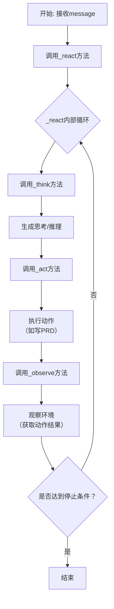

# `.\MetaGPT\tests\metagpt\roles\di\run_product_manager.py` 详细设计文档

该代码是一个基于MetaGPT框架的产品经理角色演示脚本，核心功能是接收一系列不同的产品需求描述（如游戏、智能家居、市场分析等），通过实例化ProductManager角色，以异步方式运行并生成相应的产品需求文档（PRD）或市场分析报告。

## 整体流程

```mermaid
graph TD
    A[开始] --> B[初始化日志系统]
    B --> C[遍历需求用例列表]
    C --> D{是否还有未处理用例?}
    D -- 是 --> E[获取下一个用例]
    E --> F[附加根路径信息]
    F --> G[记录用户需求日志]
    G --> H[实例化ProductManager]
    H --> I[异步运行product_manager.run(case)]
    I --> J{执行成功?}
    J -- 是 --> C
    J -- 否 --> K[打印异常信息]
    K --> C
    D -- 否 --> L[结束]
```

## 类结构

```
ProductManager (MetaGPT角色类)
├── 继承自: Role (MetaGPT基础角色类)
└── 核心方法: run (执行角色任务)
```

## 全局变量及字段


### `CASE0_WRITE_2048`
    
一个用于生成命令行2048游戏产品需求文档（PRD）的用户需求字符串。

类型：`str`
    


### `CASE1_GREEDY_SNAKE`
    
一个用于设计贪吃蛇游戏的用户需求字符串。

类型：`str`
    


### `CASE2_SMART_HOME`
    
一个用于分析智能家居市场（米家、华为、海尔）的用户需求字符串。

类型：`str`
    


### `CASE3_BEST_SELLING_REFRIGERATOR`
    
一个用于调研智能冰箱关键特性的用户需求字符串。

类型：`str`
    


### `OLD_PRD`
    
一份现有的音乐流媒体服务产品需求文档（PRD）的完整文本，作为CASE4的输入。

类型：`str`
    


### `CASE4_MUSIC_STREAMING_MEDIA`
    
一个基于用户反馈（需要更好的个性化推荐）来调整现有PRD（OLD_PRD）的用户需求字符串。

类型：`str`
    


### `CASE5_SMART_BIG_SCREEN`
    
一个用于分析2024年上半年中国家庭智能大屏行业并输出市场报告的用户需求字符串。

类型：`str`
    


### `CASE6_ELECTRONIC_CIGARETTE`
    
一个用于完成电子烟产品市场调研分析报告的用户需求字符串。

类型：`str`
    


### `cases`
    
存储待处理用户需求案例的列表，当前仅包含CASE5_SMART_BIG_SCREEN。

类型：`List[str]`
    


### `root_path`
    
指定产品经理（ProductManager）运行时的根目录路径，用于文件输出等操作。

类型：`str`
    


### `case`
    
在循环中迭代`cases`列表时，代表当前正在处理的单个用户需求字符串。

类型：`str`
    


### `product_manager`
    
ProductManager类的一个实例，用于执行处理用户需求、生成PRD等核心任务。

类型：`ProductManager`
    


### `e`
    
在try-except块中捕获的异常对象，用于处理`product_manager.run`方法执行过程中可能出现的错误。

类型：`Exception`
    


    

## 全局函数及方法

### `main`

`main` 函数是程序的入口点，负责初始化日志配置，并遍历一个包含不同用户需求用例的列表。对于每个用例，它会创建一个 `ProductManager` 实例，并异步执行其 `run` 方法以处理该需求。函数还包含基本的错误处理，以捕获并打印执行过程中可能出现的异常。

参数：
- 无显式参数。

返回值：`None`，无返回值。

#### 流程图

```mermaid
flowchart TD
    A[开始] --> B[定义用例列表cases]
    B --> C[设置日志路径和级别]
    C --> D[遍历cases中的每个case]
    D --> E[为case添加根路径信息]
    E --> F[记录用户需求]
    F --> G[创建ProductManager实例]
    G --> H[异步运行product_manager.run(case)]
    H --> I{是否发生异常?}
    I -- 是 --> J[打印异常信息]
    I -- 否 --> K[继续下一个case]
    J --> K
    K --> D
    D --> L[所有case处理完毕]
    L --> M[结束]
```

#### 带注释源码

```python
def main():
    # 定义一个包含不同用户需求用例的列表，当前仅启用 CASE5_SMART_BIG_SCREEN
    cases = [
        # CASE0_WRITE_2048,
        # CASE1_GREEDY_SNAKE,
        # CASE2_SMART_HOME,
        # CASE3_BEST_SELLING_REFRIGERATOR,
        # CASE4_MUSIC_STREAMING_MEDIA,
        CASE5_SMART_BIG_SCREEN,
        # CASE6_ELECTRONIC_CIGARETTE,
    ]
    # 设置根路径，用于文件操作等
    root_path = "/tmp"
    # 移除所有现有的日志处理器
    logger.remove()
    # 添加一个标准错误输出处理器，日志级别为 INFO
    logger.add(sys.stderr, level="INFO")
    # 遍历用例列表
    for case in cases:
        # 为每个用例附加根路径信息
        case += f"\nroot path: '{root_path}'"
        # 记录当前处理的用户需求
        logger.info(f"user requirement:\n{case}")
        try:
            # 创建 ProductManager 角色实例
            product_manager = ProductManager()
            # 异步运行 ProductManager 的 run 方法处理当前用例
            asyncio.run(product_manager.run(case))
        except Exception as e:
            # 如果执行过程中发生异常，打印异常信息
            print(e)
```

### `ProductManager.run`

该方法用于执行产品经理角色的核心工作流程，接收用户需求，通过一系列异步操作（如思考、行动、观察）来生成产品需求文档（PRD）或其他相关产出。

参数：
- `message`：`str`，包含用户需求或指令的字符串，是启动整个工作流程的输入。

返回值：`None`，该方法不返回任何值，其执行结果（如生成的文档）会通过角色内部的机制（如发布消息到环境）进行输出。

#### 流程图



#### 带注释源码

```python
    async def run(self, message: str) -> None:
        """
        Run the agent: think, act, observe in a loop until reaching done.
        This is the standard workflow of an agent.

        Args:
            message: The input message for the agent to process.

        Returns:
            None. The results are handled through the agent's internal state or environment.
        """
        # 将输入的消息包装成Message对象，并添加到角色的记忆（上下文）中。
        await self._observe(message)
        # 进入反应循环。该方法会循环调用 _think, _act, _observe，
        # 直到角色认为任务完成（例如，成功生成了PRD）或达到其他停止条件。
        rsp = await self._react()
        # 将最终的反应（响应）发送到环境，供其他角色或系统使用。
        await self._publish_message(rsp)
        return rsp
```

## 关键组件


### ProductManager 角色

MetaGPT框架中负责产品需求文档（PRD）生成的核心角色，通过异步运行接收用户需求并驱动整个PRD创作流程。

### 异步任务执行器

通过 `asyncio.run()` 方法驱动 `ProductManager` 角色的 `run` 方法，以异步方式处理用户需求，实现非阻塞的任务执行。

### 日志系统

使用 `logger` 进行日志记录，在代码中用于移除默认日志处理器并添加标准错误输出流（`sys.stderr`）作为新的日志目标，同时设置日志级别为 `INFO`，用于跟踪程序运行状态和用户需求信息。

### 用户需求案例集

定义了一系列字符串常量（如 `CASE0_WRITE_2048`, `CASE1_GREEDY_SNAKE` 等），作为预置的用户需求输入，用于测试或演示 `ProductManager` 生成不同领域PRD的能力。

### 主执行流程

`main` 函数作为程序的入口点，负责初始化日志配置、遍历预定义的需求案例列表、实例化 `ProductManager` 角色，并为每个案例异步执行PRD生成任务。


## 问题及建议


### 已知问题

-   **硬编码的用例和路径**：代码中硬编码了多个测试用例 (`CASE0_WRITE_2048` 到 `CASE6_ELECTRONIC_CIGARETTE`) 和根路径 (`root_path = "/tmp"`)。这使得代码不灵活，难以复用或适应不同的输入场景。
-   **缺乏配置管理**：用例选择、日志级别、输出路径等关键参数都直接写在代码中，而不是通过配置文件或命令行参数进行管理。这增加了维护成本和部署复杂性。
-   **异常处理过于宽泛**：`main` 函数中的 `try-except` 块捕获了所有 `Exception`，这虽然能防止程序崩溃，但不利于调试和错误定位。它只是简单地打印异常，没有提供足够的上下文信息或进行适当的错误恢复。
-   **同步与异步混合使用**：`main` 函数是一个同步函数，但内部调用了异步的 `asyncio.run(product_manager.run(case))`。虽然这在简单脚本中可行，但在更复杂的应用或需要与其他异步组件集成时，可能会引发事件循环管理问题。
-   **日志配置重置**：代码中使用了 `logger.remove()` 和 `logger.add(sys.stderr, level="INFO")` 来重置和配置日志。这可能会干扰应用其他部分的日志配置，尤其是在作为模块被导入时。
-   **用例列表注释导致潜在混淆**：`cases` 列表中的大部分用例都被注释掉了，只保留了 `CASE5_SMART_BIG_SCREEN`。这种注释/取消注释的方式来选择用例的方式容易出错，且不便于自动化或批处理。

### 优化建议

-   **参数化输入和配置**：将用例内容、根路径、日志级别等作为命令行参数或从配置文件（如 YAML、JSON）中读取。这可以大大提高代码的灵活性和可配置性。
-   **改进异常处理**：将宽泛的 `except Exception` 替换为更具体的异常类型捕获。记录完整的堆栈跟踪和相关的上下文信息（如当前正在处理的用例），以便于问题诊断。可以考虑实现重试机制或更优雅的失败处理。
-   **重构为纯异步或提供同步接口**：如果这是一个独立的异步应用，考虑将 `main` 函数也定义为 `async` 并使用 `asyncio.run(main())`。如果需要同步调用，可以为 `ProductManager` 提供一个同步包装器方法。
-   **解耦日志配置**：避免在业务逻辑代码中直接重置全局日志器。可以将日志配置移到单独的初始化模块或通过环境变量来控制。确保日志配置不会影响导入此模块的其他代码。
-   **使用更结构化的用例管理**：考虑将用例定义在外部文件（如 JSON）或数据库中。可以设计一个简单的命令行界面（CLI）来让用户选择或输入用例，而不是通过修改源代码。
-   **添加类型注解**：为函数参数和返回值添加类型注解，这可以提高代码的可读性，并利用静态类型检查工具（如 mypy）来提前发现潜在的类型错误。
-   **考虑性能与资源管理**：当前代码是顺序执行每个用例。如果用例很多或单个用例执行时间很长，可以考虑使用 `asyncio.gather` 进行并发执行（需评估 `ProductManager` 是否支持并发）。同时，确保在用例执行完成后正确清理资源。


## 其它


### 设计目标与约束

本代码的设计目标是作为一个演示脚本，用于展示如何利用 `ProductManager` 角色处理多种不同类型的产品需求文档（PRD）生成或市场分析任务。其核心约束包括：1) 作为示例代码，需保持简洁明了，便于理解和修改；2) 依赖外部的 `metagpt` 框架，需确保环境配置正确；3) 采用异步执行模式，需正确处理异步事件循环；4) 文件输出路径硬编码为 `/tmp`，缺乏灵活性。

### 错误处理与异常设计

代码的错误处理策略较为基础。在 `main` 函数的主循环中，使用了一个 `try-except` 块来捕获 `product_manager.run(case)` 执行过程中可能抛出的任何 `Exception`。捕获到异常后，仅通过 `print(e)` 将异常信息打印到控制台，脚本会继续处理下一个用例。这种设计确保了单个用例的失败不会导致整个脚本终止，但缺乏对异常类型的区分和更细致的处理（如日志记录、重试机制或资源清理），属于防御性编程的初级形式。

### 数据流与状态机

数据流清晰且线性：
1.  **输入**：预定义的字符串常量（`CASE*`），作为用户需求输入。
2.  **处理**：`main` 函数遍历选定的用例列表。对于每个用例，脚本会附加根路径信息，记录日志，然后实例化 `ProductManager` 角色，并异步执行其 `run` 方法，将用例作为参数传入。
3.  **输出**：输出由 `ProductManager` 角色内部处理，根据需求可能生成文档文件（存储于 `/tmp` 路径下）或在控制台打印信息。脚本本身不直接管理输出内容。

本代码不涉及复杂的状态机。其状态可简化为：`初始化` -> `遍历用例` -> `对单个用例执行 (执行中/执行成功/执行异常)` -> `结束`。

### 外部依赖与接口契约

1.  **外部库依赖**：
    *   `asyncio`: Python 标准库，用于支持异步操作，是调用 `product_manager.run`（一个异步方法）所必需的。
    *   `metagpt`: 核心外部框架。代码依赖于其 `logs` 模块中的 `logger` 对象进行日志记录，以及 `roles` 模块中的 `ProductManager` 类来执行核心业务逻辑。版本兼容性未指定。
2.  **接口契约**：
    *   `ProductManager` 类：必须提供一个异步的 `run` 方法，该方法接受一个字符串参数（用户需求），并负责执行具体的 PRD 生成或分析任务。其内部实现、返回值类型和副作用（如文件写入）是本脚本的隐含依赖。
    *   `logger` 对象：必须支持 `remove()`、`add(sink, level)` 和 `info(msg)` 方法，用于配置和记录日志。
3.  **环境约束**：脚本硬编码了输出根路径 `root_path = "/tmp"`，这要求运行环境（尤其是非 Unix-like 系统）下该路径存在且可写。

    