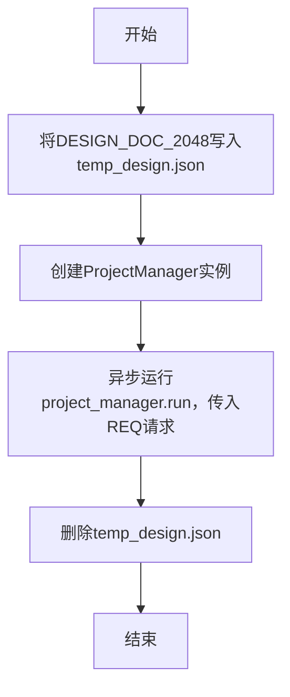

# `.\MetaGPT\tests\metagpt\roles\di\run_project_manager.py` 详细设计文档

该代码是一个基于MetaGPT框架的简单项目调度器。它通过预定义的游戏设计文档（2048和贪吃蛇），将其中一个设计文档（2048）写入临时文件，然后创建一个ProjectManager角色来处理基于该设计文档的项目调度请求，最后清理临时文件。

## 整体流程



## 类结构

```
无显式类层次结构
├── 全局变量 (DESIGN_DOC_2048, DESIGN_DOC_SNAKE, REQ, CASUAL_CHAT)
└── 全局函数 (main)
```

## 全局变量及字段


### `DESIGN_DOC_2048`
    
一个包含2048游戏设计文档的JSON格式字符串，定义了实现方法、文件列表、数据结构、接口和程序调用流程。

类型：`str`
    


### `DESIGN_DOC_SNAKE`
    
一个包含贪吃蛇游戏设计文档的JSON格式字符串，定义了实现方法、文件列表、数据结构、接口和程序调用流程。

类型：`str`
    


### `REQ`
    
一个字符串，包含基于设计文档生成项目进度的指令。

类型：`str`
    


### `CASUAL_CHAT`
    
一个用于测试或闲聊的示例消息字符串。

类型：`str`
    


    

## 全局函数及方法

### `main`

该函数是一个异步入口函数，用于模拟一个项目管理的流程。它首先将一个预定义的2048游戏设计文档写入一个临时JSON文件，然后创建一个`ProjectManager`角色实例，并异步执行其`run`方法，传入一个包含特定需求（`REQ`）的消息。任务执行完毕后，它会清理临时文件。

参数：
- `requirement`：`str`，一个字符串参数，表示要传递给`ProjectManager`的需求或指令。

返回值：`None`，该函数没有返回值。

#### 流程图

```mermaid
flowchart TD
    A[开始: main(requirement)] --> B[写入设计文档到 temp_design.json]
    B --> C[创建 ProjectManager 实例]
    C --> D[异步执行 project_manager.run]
    D --> E[删除临时文件 temp_design.json]
    E --> F[结束]
```

#### 带注释源码

```python
async def main(requirement):
    # 1. 将预定义的2048游戏设计文档写入一个临时文件。
    with open("temp_design.json", "w") as f:
        f.write(DESIGN_DOC_2048)
    
    # 2. 创建一个项目管理者（ProjectManager）角色实例。
    project_manager = ProjectManager()
    
    # 3. 异步执行项目管理者的`run`方法，传入一个包含需求内容的消息。
    #    Message 的 `send_to` 参数指定了消息的接收者（这里为 "Eve"）。
    await project_manager.run(Message(content=requirement, send_to="Eve"))
    
    # 4. 任务执行完毕后，删除临时文件以清理环境。
    os.remove("temp_design.json")
```

### `ProjectManager.run`

该方法负责执行项目管理的核心流程，包括接收需求、处理设计文档、生成项目计划、分配任务给工程师，并最终输出项目结果。

参数：

- `message`：`Message`，包含用户需求或指令的消息对象，其`content`属性为具体的需求文本。

返回值：`None`，该方法不直接返回值，其执行结果通过异步任务和内部状态体现。

#### 流程图

```mermaid
flowchart TD
    A[开始: run(message)] --> B{消息内容是否为空?}
    B -- 是 --> C[记录日志并返回]
    B -- 否 --> D[记录需求到历史]
    D --> E[解析需求并生成项目计划]
    E --> F[将计划转换为任务列表]
    F --> G[为每个任务创建工程师角色]
    G --> H[异步执行所有工程师任务]
    H --> I[等待所有任务完成]
    I --> J[汇总并输出最终结果]
    J --> K[结束]
```

#### 带注释源码

```python
async def run(self, message: Message) -> None:
    """
    项目管理主运行方法。
    处理传入的需求消息，协调生成项目计划、分解任务并驱动工程师执行。
    Args:
        message (Message): 包含用户需求的消息。
    """
    # 1. 检查消息内容是否为空
    if not message.content:
        self._log.warning("Message content is empty.")
        return

    # 2. 将需求消息记录到角色历史中
    self.rc.memory.add(message)

    # 3. 根据需求生成项目计划
    #    调用内部方法，将需求文本转换为结构化的项目计划
    plan = await self._generate_plan(message.content)

    # 4. 将项目计划分解为具体的开发任务
    #    每个任务对应一个需要实现的功能点或模块
    tasks = self._plan_to_tasks(plan)

    # 5. 为每个任务创建一个工程师角色实例
    #    工程师将负责执行具体的编码任务
    engineers = [Engineer(task) for task in tasks]

    # 6. 并发执行所有工程师的任务
    #    使用asyncio.gather实现异步并行处理
    results = await asyncio.gather(
        *[engineer.run() for engineer in engineers]
    )

    # 7. 汇总所有工程师的执行结果
    #    将代码文件、文档等产出物合并为最终的项目交付物
    final_output = self._summarize_results(results)

    # 8. 输出最终结果
    #    可能包括保存文件、发送通知或更新状态等操作
    await self._output(final_output)
```

## 关键组件

### 异步任务执行器

负责使用 `asyncio` 库来运行异步的 `main` 函数，协调整个脚本的启动和异步流程。

### 设计文档管理器

负责处理设计文档的临时文件生命周期，包括将硬编码的设计文档字符串写入到 `temp_design.json` 文件，以及在项目任务执行完毕后删除该文件。

### 项目管理者 (`ProjectManager`)

作为 `metagpt` 框架中的核心角色，负责接收包含项目需求的消息，并根据设计文档（如 `temp_design.json`）来执行项目规划或管理任务。

### 消息传递系统 (`Message`)

作为 `metagpt` 框架中的数据结构，用于封装任务请求（如 `REQ` 中的内容）并指定接收者，实现系统内部组件间的通信。

### 硬编码设计文档

包含两个预定义的、格式化的 JSON 字符串（`DESIGN_DOC_2048` 和 `DESIGN_DOC_SNAKE`），分别描述了“2048游戏”和“贪吃蛇游戏”的详细设计方案，作为项目执行的输入或模板。

### 需求定义器

定义了具体的任务请求字符串（`REQ`），用于驱动 `ProjectManager` 执行基于设计文档（`temp_design.json`）的项目计划制定工作。

## 问题及建议

### 已知问题

-   **硬编码的设计文档**：代码中硬编码了两个游戏（2048和贪吃蛇）的设计文档字符串（`DESIGN_DOC_2048` 和 `DESIGN_DOC_SNAKE`）。这使得系统僵化，无法动态处理其他项目的设计文档，违背了软件设计的“开闭原则”。
-   **临时文件管理风险**：代码通过写入 `temp_design.json` 文件来传递设计信息，并在运行后删除。这种方式存在并发访问冲突的风险（例如，多个进程同时运行时文件会被覆盖），并且依赖于文件系统的I/O操作，效率较低且可能因权限问题导致失败。
-   **单一且固定的需求**：`main` 函数接收的 `requirement` 参数虽然被传入，但实际执行时，项目管理器（`ProjectManager`）处理的是硬编码写入文件的设计文档内容，而非传入的需求参数 `REQ`。这造成了逻辑上的不一致和潜在的误导。
-   **缺乏错误处理**：代码中没有对文件操作（如打开、写入、删除）或异步任务执行进行任何异常捕获和处理。例如，如果 `temp_design.json` 文件因权限问题无法删除，程序将抛出异常并终止。
-   **资源未妥善管理**：`ProjectManager` 实例化后，其生命周期和可能占用的资源（如网络连接、内存）没有明确的清理或关闭机制，在长期运行或多次调用中可能引发资源泄漏。

### 优化建议

-   **解耦设计文档来源**：建议将设计文档的提供方式抽象为一个接口或数据源。例如，可以通过命令行参数、配置文件、数据库或网络API来动态获取设计文档内容，而不是在源码中硬编码。这样能提高代码的灵活性和可复用性。
-   **使用内存数据传递替代临时文件**：应避免使用临时文件作为模块间通信的手段。可以直接将设计文档的数据结构（如Python字典）传递给 `ProjectManager` 的 `run` 方法，或者通过消息队列、共享内存等更高效、更安全的方式进行数据交换。
-   **明确需求与设计的处理逻辑**：重构 `main` 函数，使其逻辑清晰。要么根据传入的 `requirement` 参数动态生成或获取对应的设计文档，要么明确注释说明此示例中需求参数仅作演示，实际处理的是固定设计。更好的做法是让 `ProjectManager` 能够接受并处理原始需求。
-   **增加健壮的错误处理**：在文件操作和异步调用周围添加 `try...except` 块，以优雅地处理可能出现的 `IOError`、`PermissionError` 或 `asyncio` 相关异常。对于临时文件，可以考虑使用 `tempfile` 模块来创建具有唯一名称且自动管理的临时文件。
-   **实现资源管理上下文**：为 `ProjectManager` 类实现上下文管理器协议（`__enter__`/`__exit__` 或异步上下文 `__aenter__`/`__aexit__`），确保在其工作完成后能够正确清理资源。或者在 `main` 函数中使用 `async with` 语句来管理其生命周期。
-   **提升代码可测试性**：当前的硬编码和文件依赖使得单元测试非常困难。通过上述解耦建议后，可以轻松地通过模拟（Mock）数据源或内存对象来对 `main` 函数和 `ProjectManager` 进行测试，而无需操作真实文件系统。

## 其它


### 设计目标与约束

本代码的核心设计目标是作为一个轻量级的自动化任务执行器，用于演示或测试 MetaGPT 框架中 `ProjectManager` 角色的功能。其主要约束包括：1) 作为单次运行的脚本，不提供长期服务或状态保持；2) 依赖外部文件（`temp_design.json`）作为临时数据交换媒介，该文件在运行前后被创建和删除；3) 输入需求（`REQ`）和设计文档（`DESIGN_DOC_*`）被硬编码在脚本中，不具备动态配置能力。

### 错误处理与异常设计

当前代码的错误处理机制较为基础。`main` 函数使用 `with open` 语句进行文件写入，这确保了文件句柄的正确释放。然而，在 `asyncio.run(main(REQ))` 执行过程中，如果 `project_manager.run` 方法内部发生未捕获的异常，或者文件操作（如写入、删除）因权限或路径问题失败，程序将直接崩溃并抛出异常，没有进行任何恢复或用户友好的错误提示。`os.remove` 操作在 `project_manager.run` 完成后执行，如果后者失败，此删除操作可能不会执行，导致临时文件残留。

### 数据流与状态机

数据流清晰但简单：1) 启动时，硬编码的 `DESIGN_DOC_2048` 字符串被写入 `temp_design.json` 文件。2) 初始化 `ProjectManager` 实例。3) 将包含硬编码需求 `REQ` 的 `Message` 对象发送给 `ProjectManager` 处理。4) `ProjectManager` 内部逻辑（非本代码范围）会读取 `temp_design.json` 文件作为设计输入。5) 处理完毕后，删除 `temp_design.json` 文件。整个流程是线性的，没有分支或循环状态，可视为一个简单的“写入 -> 处理 -> 清理”状态序列。

### 外部依赖与接口契约

1.  **MetaGPT 框架**：强依赖 `metagpt.roles.project_manager.ProjectManager` 和 `metagpt.schema.Message`。代码假设这些类已正确安装且其 `run` 方法能异步处理 `Message` 对象，并会读取当前目录下的 `temp_design.json` 文件。接口契约隐含在 `ProjectManager.run` 方法的行为中。
2.  **Python 标准库**：依赖 `asyncio` 用于异步执行，`os` 用于文件删除操作。这是稳定的依赖。
3.  **文件系统**：代码与本地文件系统有契约，需要在当前工作目录有创建和删除 `temp_design.json` 文件的权限。
4.  **输入/输出**：没有标准输入或用户交互。所有输入（需求、设计文档）均硬编码在脚本顶部的全局变量中。输出完全依赖于 `ProjectManager.run` 方法的内部实现（如控制台打印、生成新文件等），本脚本不直接管理任何输出。

### 安全与合规性考虑

1.  **临时文件安全**：使用固定文件名（`temp_design.json`）可能在同一目录并发执行时导致冲突或数据覆盖。文件内容来源于代码内硬编码的字符串，不存在注入风险，但若设计文档内容来自不可信源，则需防范。
2.  **依赖安全**：依赖于第三方库 `metagpt`，其安全性取决于该库本身及其依赖链。脚本未包含版本锁定或安全检查。
3.  **资源清理**：通过 `os.remove` 尝试清理临时文件，但在异常路径下可能失败，存在资源（文件句柄、磁盘空间）未释放的微小风险。脚本本身不涉及网络、敏感数据或持久化状态，整体安全风险较低。

### 部署与运行环境

1.  **环境要求**：需要 Python 环境（支持 `asyncio`）并安装 `metagpt` 包。脚本是平台无关的。
2.  **运行方式**：直接通过命令行执行 `python <script_name>.py`。无参数、配置文件或环境变量要求。
3.  **部署复杂度**：极低。仅为一个脚本文件，但需要确保 Python 环境和依赖已正确安装。不适合作为生产服务部署，仅用于演示、测试或一次性任务。
4.  **生命周期**：进程启动 -> 执行 `main` 函数 -> 进程结束。无守护、监控或重启机制。

    