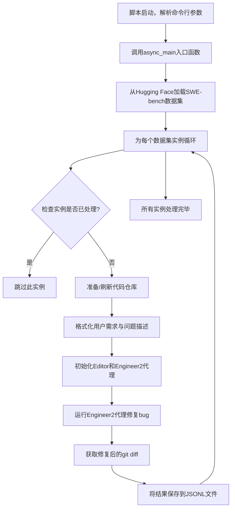
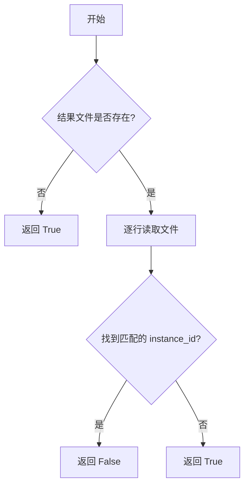
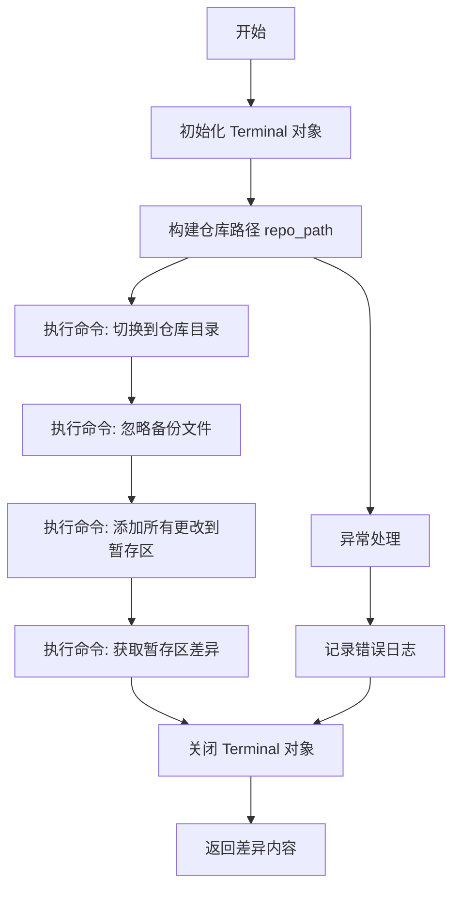
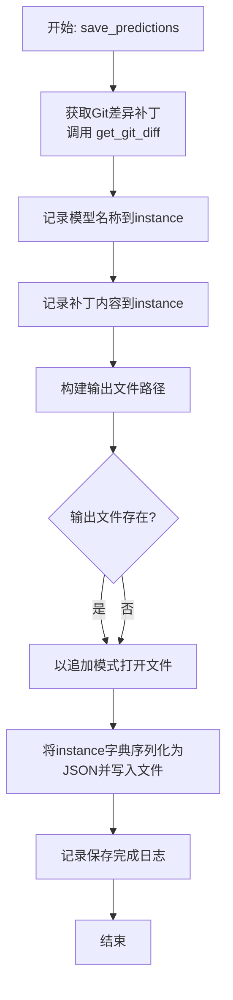
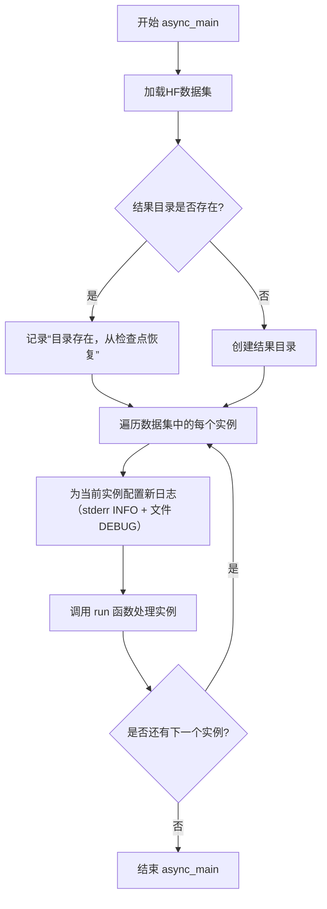

# `.\MetaGPT\tests\metagpt\roles\di\run_swe_agent_for_benchmark.py` 详细设计文档

该代码是一个用于自动化软件工程任务（特别是修复SWE-bench基准测试中的bug）的脚本。它通过加载Hugging Face数据集中的问题实例，为每个实例准备代码仓库环境，然后使用一个名为Engineer2的AI代理（结合了编辑器和终端工具）来分析和修复代码问题，最后将修复结果（git diff）保存到JSONL文件中。

## 整体流程



## 类结构

```
run_swe_agent_for_benchmark.py (主脚本)
├── 全局常量 (INSTANCE_TEMPLATE, TEST_REPO_DIR, DATA_DIR)
├── 全局函数
│   ├── check_instance_status
│   ├── terminal_run_command
│   ├── refresh_repo
│   ├── get_git_diff
│   ├── run
│   ├── save_predictions
│   └── async_main
└── 外部依赖类
    ├── Engineer2 (来自 metagpt.roles.di.engineer2)
    ├── Editor (来自 metagpt.tools.libs.editor)
    └── Terminal (来自 metagpt.tools.libs.terminal)
```

## 全局变量及字段


### `TEST_REPO_DIR`
    
用于存储测试仓库的本地目录路径，通常指向项目数据目录下的test_repo子目录。

类型：`pathlib.Path`
    


### `DATA_DIR`
    
用于缓存从Hugging Face加载的数据集的本地目录路径。

类型：`pathlib.Path`
    


### `INSTANCE_TEMPLATE`
    
一个多行字符串模板，用于为每个待处理的软件工程基准测试实例生成具体的用户需求和指令。

类型：`str`
    


    

## 全局函数及方法

### `check_instance_status`

检查给定的测试实例是否已在结果文件中存在，用于避免重复执行。

参数：

- `instance`：`dict`，包含测试实例信息的字典，其中必须包含键`"instance_id"`。
- `swe_result_dir`：`pathlib.Path`，存储测试结果文件的目录路径。

返回值：`bool`，如果实例尚未被处理（即不存在于结果文件中），则返回`True`；如果已存在或结果文件不存在，则返回`False`。

#### 流程图



#### 带注释源码

```python
def check_instance_status(instance, swe_result_dir):
    # 构建结果文件的完整路径
    output_file = swe_result_dir / "all_preds.jsonl"
    # 默认返回值为 True，表示可以处理该实例
    res = True
    # 先检查all_preds.jsonl文件是否存在
    if not output_file.exists():
        # 如果结果文件不存在，直接返回 True
        return res
    # 打开结果文件进行读取
    with open(output_file, "r") as fp:
        # 逐行读取文件内容
        for line in fp:
            # 将每行 JSON 字符串解析为字典
            existing_instance = json.loads(line.strip())
            # 检查当前行实例的 ID 是否与传入实例的 ID 相同
            if existing_instance["instance_id"] == instance["instance_id"]:
                # 如果找到匹配项，说明该实例已处理过，返回 False
                return False
    # 如果遍历完文件未找到匹配项，返回 True
    return res
```

### `terminal_run_command`

该函数是一个异步辅助函数，用于在给定的终端对象上执行一条命令，并记录命令及其输出。

参数：
- `cmd`：`str`，要执行的命令行字符串。
- `terminal`：`Terminal`，一个终端对象，用于执行命令。

返回值：`str`，返回命令执行后的输出字符串。

#### 流程图

```mermaid
flowchart TD
    A[开始] --> B[调用 terminal.run_command(cmd)]
    B --> C[获取命令输出 cmd_output]
    C --> D[使用 logger.info 记录命令和输出]
    D --> E[返回 cmd_output]
    E --> F[结束]
```

#### 带注释源码

```python
async def terminal_run_command(cmd, terminal):
    # 在提供的终端对象上异步执行命令
    cmd_output = await terminal.run_command(cmd)
    # 使用日志记录器记录执行的命令及其输出
    logger.info(f"command:{cmd} output:\n {cmd_output}")
    # 返回命令的输出结果
    return cmd_output
```

### `refresh_repo`

该函数负责准备或刷新一个用于软件工程基准测试的代码仓库。它根据传入的实例信息，在指定的测试目录下，要么克隆一个新的仓库，要么重置一个已存在的仓库到指定的基础提交版本。其核心逻辑是确保目标目录下存在一个干净的、处于正确版本（由`base_commit`指定）的代码仓库副本。

参数：

-  `instance`：`dict`，包含待处理仓库信息的字典，必须包含`repo`（仓库标识符，如`owner/repo_name`）、`version`（版本标识符）和`base_commit`（基础提交哈希）等键。
-  `test_repo_dir`：`str` 或 `Path`，用于存放克隆仓库的根目录路径。
-  `reclone_existing_repo`：`bool`，标志位。如果为`True`，则无论目标路径是否存在，都会先删除再重新克隆；如果为`False`，则对已存在的仓库执行重置操作。

返回值：`Path`，返回最终准备好的本地仓库的绝对路径对象。

#### 流程图

```mermaid
flowchart TD
    A[开始: refresh_repo(instance, test_repo_dir, reclone_existing_repo)] --> B[初始化Terminal对象]
    B --> C[构造本地仓库路径repo_path]
    C --> D{路径存在且<br>reclone_existing_repo为True?}
    D -- 是 --> E[删除已存在的仓库目录]
    E --> F
    D -- 否 --> F{路径是否存在?}
    F -- 是 --> G[执行Git重置命令序列<br>清理并切换到主分支]
    F -- 否 --> H[执行Git克隆命令序列<br>克隆并检出到指定提交]
    G --> I[关闭Terminal]
    H --> I
    I --> J[返回repo_path]
```

#### 带注释源码

```python
async def refresh_repo(instance, test_repo_dir, reclone_existing_repo=False):
    # 初始化一个终端对象，用于执行shell命令
    terminal = Terminal()
    try:
        # 根据实例信息，构造本地仓库的存储路径。
        # 路径格式：`test_repo_dir` / `owner__repo_name`_`version`
        # 例如：`/data/test_repo/owner__repo_name_v1.0`
        repo_path = Path(test_repo_dir) / (
            instance["repo"].replace("-", "_").replace("/", "__") + "_" + instance["version"]
        )
        # 从实例中提取仓库标识符（如 "owner/repo_name"）和基础提交哈希
        repo_identifier = instance["repo"]
        base_commit = instance["base_commit"]

        # 如果目标路径已存在，并且参数要求重新克隆
        if os.path.exists(repo_path) and reclone_existing_repo is True:
            logger.info(f"remove exist repo path:{repo_path.absolute()}")
            # 递归删除整个目录
            shutil.rmtree(repo_path)

        # 再次检查路径是否存在（可能刚被删除，或原本就存在但不需要重新克隆）
        if os.path.exists(repo_path):
            logger.info(f"reset exist repo path:{repo_path.absolute()}")
            # 对已存在的仓库执行一系列Git命令，将其重置到干净状态
            for cmd in [
                f"cd {repo_path.absolute()}",  # 切换到仓库目录
                "git reset --hard && git clean -n -d && git clean -f -d",  # 硬重置并清理未跟踪文件
                "BRANCH=$(git remote show origin | awk '/HEAD branch/ {print $NF}')",  # 获取远程主分支名
                'git checkout "$BRANCH"',  # 切换到远程主分支
                "git branch",  # 列出分支（用于日志确认）
                "pwd",  # 打印当前目录（用于日志确认）
            ]:
                # 异步执行命令并记录日志
                await terminal_run_command(cmd, terminal)
        else:
            # 如果路径不存在，则克隆一个新仓库
            logger.info(f"clone repo to path:{repo_path}")
            # 构建克隆和初始化命令序列
            clone_cmd = f"git clone 'https://github.com/{repo_identifier}.git' {repo_path.absolute()}"
            checkout_cmd = f"cd {repo_path.absolute()}" + f" && git checkout -f {base_commit}" if base_commit else ""
            for cmd in [
                clone_cmd,  # 克隆仓库
                checkout_cmd,  # 如果指定了base_commit，则检出到该提交
                "git branch",  # 列出分支（用于日志确认）
                "pwd",  # 打印当前目录（用于日志确认）
            ]:
                # 异步执行命令并记录日志
                await terminal_run_command(cmd, terminal)
    except Exception as e:
        # 捕获并记录执行过程中的任何异常
        logger.warning(e)
    finally:
        # 无论成功与否，最终都要关闭终端对象以释放资源
        await terminal.close()
    # 返回最终准备好的本地仓库路径
    return repo_path
```

### `get_git_diff`

该函数用于获取指定代码仓库在特定实例下的 Git 差异（即暂存区与上一次提交之间的差异）。它首先导航到仓库目录，忽略备份文件，然后将所有更改添加到暂存区，最后执行 `git diff --cached` 命令来获取差异内容。

参数：

- `instance`：`dict`，包含仓库信息的字典，如 `repo`（仓库标识符）和 `version`（版本号）。
- `test_repo_dir`：`str` 或 `Path`，测试仓库的根目录路径。

返回值：`str`，返回 Git 差异的字符串表示。如果执行过程中发生错误，则返回空字符串。

#### 流程图



#### 带注释源码

```python
async def get_git_diff(instance, test_repo_dir):
    # 初始化 Git 差异字符串
    git_diff = ""
    # 创建 Terminal 对象用于执行命令
    terminal = Terminal()
    try:
        # 构建仓库路径：基于 test_repo_dir、仓库标识符和版本号
        repo_path = Path(test_repo_dir) / (
            instance["repo"].replace("-", "_").replace("/", "__") + "_" + instance["version"]
        )
        # 忽略备份文件并提交到暂存区
        for cmd in [f"cd {repo_path.absolute()} ", "echo '.backup.*' >> .gitignore", "git add -A"]:
            # 执行命令并记录输出
            await terminal_run_command(cmd, terminal)
        # 获取暂存区与上一次提交的差异
        git_diff = await terminal_run_command("git diff --cached", terminal)
    except Exception as e:
        # 记录错误信息
        logger.error(f"Error during submission: {e}")
    finally:
        # 确保关闭 Terminal 对象
        await terminal.close()
    # 返回 Git 差异内容（如果出错则为空字符串）
    return git_diff
```

### `run`

该函数是SWE-bench基准测试中处理单个测试实例的核心执行流程。它首先检查该实例是否已处理过，然后准备代码仓库环境，构造用户需求，启动`Engineer2`角色来修复bug，最后保存生成的代码补丁。

参数：

- `instance`：`dict`，包含单个SWE-bench测试实例的所有信息，如仓库标识、问题描述、基础提交等。
- `swe_result_dir`：`Path`，用于保存测试结果和日志的目录路径。
- `args`：`argparse.Namespace`，命令行参数对象，包含测试仓库目录、最大等待时间等配置。

返回值：`None`，该函数不返回任何值，其执行结果通过写入文件系统来体现。

#### 流程图

```mermaid
flowchart TD
    A[开始: run(instance, swe_result_dir, args)] --> B{检查实例状态<br>check_instance_status}
    B -- 已处理 --> C[记录日志并跳过]
    B -- 未处理 --> D[准备代码仓库<br>refresh_repo]
    D --> E[构造用户需求<br>INSTANCE_TEMPLATE]
    E --> F[启动Engineer2角色<br>engineer.run]
    F --> G{执行是否超时或异常?}
    G -- 是 --> H[记录异常日志]
    G -- 否 --> I[保存预测结果<br>save_predictions]
    H --> I
    I --> J[结束]
    C --> J
```

#### 带注释源码

```python
async def run(instance, swe_result_dir, args):
    # 1. 检查当前测试实例是否已在结果文件中存在，避免重复执行
    if not check_instance_status(instance, swe_result_dir):
        logger.info(f"Instance {instance['instance_id']} already exists, skipping execution.")
        return

    # 2. 准备阶段：克隆或重置指定的代码仓库到本地
    logger.info(f"**** Preparing to run {instance['instance_id']}****")
    test_repo_dir = args.test_repo_dir
    repo_path = await refresh_repo(instance, test_repo_dir, args.reclone_existing_repo)

    # 3. 根据模板和实例数据，构造给AI Agent的详细任务描述
    user_requirement_and_issue = INSTANCE_TEMPLATE.format(
        issue=instance["problem_statement"],
        hints_text=instance["hints_text"],
        repo_path=repo_path.absolute(),
        version=instance["version"],
        base_commit=instance["base_commit"],
    )

    # 4. 执行阶段：启动Engineer2角色来分析和修复bug
    logger.info(f"**** Starting to run {instance['instance_id']}****")
    logger.info("User Requirement:\n" + user_requirement_and_issue)
    try:
        # 创建编辑器工具和工程师角色，并设置超时
        editor = Editor(enable_auto_lint=True, working_dir=Path(repo_path))
        engineer = Engineer2(run_eval=True, editor=editor)
        await asyncio.wait_for(engineer.run(user_requirement_and_issue), timeout=args.max_wait_time_per_case * 60)
    except Exception as e:
        # 记录执行过程中发生的任何异常
        logger.warning(f"**** exception lead to end: {instance['instance_id']}****\n\nerror:{e}")
    # 5. 后处理阶段：无论成功与否，都保存当前仓库的代码差异作为预测结果
    await save_predictions(engineer, instance, test_repo_dir, swe_result_dir)
    logger.info(f"**** Finished running {instance['instance_id']}****")
```

### `save_predictions`

该函数负责将工程师（Engineer2）处理特定软件工程任务（SWE-bench）实例后的预测结果（即代码补丁）保存到JSONL文件中。它首先获取当前代码仓库的Git差异（即修改的补丁），然后将其与实例信息（如模型名称）一起追加写入到指定的输出文件中。

参数：

- `engineer`：`Engineer2`，包含任务执行状态和配置（特别是使用的LLM模型）的工程师实例。
- `instance`：`dict`，包含当前待处理任务实例的详细信息，如 `instance_id`、`repo`、`problem_statement` 等。
- `test_repo_dir`：`str` 或 `Path`，用于存放测试代码仓库的临时目录路径。
- `swe_result_dir`：`str` 或 `Path`，用于存放所有结果和日志的目录路径。

返回值：`None`，该函数不返回任何值，其主要作用是产生文件写入的副作用。

#### 流程图



#### 带注释源码

```python
async def save_predictions(engineer, instance, test_repo_dir, swe_result_dir):
    # 构建输出文件的完整路径，文件名为 all_preds.jsonl
    output_file = swe_result_dir / "all_preds.jsonl"
    # 从工程师配置中获取使用的LLM模型名称，并记录到实例信息中
    instance["model_name_or_path"] = engineer.config.llm.model
    # 异步调用 get_git_diff 函数，获取当前代码仓库相对于基准提交的修改补丁
    instance["model_patch"] = await get_git_diff(instance, test_repo_dir)
    # 记录获取到的补丁内容到日志（通常用于调试）
    logger.info(f"'model_patch':\n{instance['model_patch']}")
    # 记录即将保存预测结果的信息
    logger.info(f"Preparing to save predictions to {output_file}")

    # 以追加模式（'a+'）打开输出文件。如果文件不存在则创建。
    # 将更新后的 instance 字典（已包含 model_name_or_path 和 model_patch）序列化为JSON字符串，
    # 并写入文件的一行。flush=True 确保数据立即写入磁盘。
    with open(output_file, "a+") as fp:
        print(json.dumps(instance), file=fp, flush=True)

    # 记录保存操作完成的信息
    logger.info(f"Saved prediction of {instance['instance_id']} to {output_file}")
```

### `async_main`

该函数是脚本的异步主入口，负责加载指定的SWE-bench数据集，为每个测试实例设置独立的日志文件，并调用`run`函数来处理每个实例。它管理着整个批处理流程，包括结果目录的创建和日志配置。

参数：

- `args`：`argparse.Namespace`，包含从命令行解析的运行参数，如测试仓库目录、结果保存文件夹、每个案例的最大等待时间以及是否重新克隆现有仓库的标志。

返回值：`None`，该函数不返回任何值。

#### 流程图



#### 带注释源码

```python
async def async_main(args):
    # 1. 定义要加载的数据集路径（此处为轻量级测试集）
    dataset_path = "manna-ai/SWE-bench_Nano"  # "princeton-nlp/SWE-bench_Lite" #"manna-ai/SWE-bench_Nano"
    # 2. 从Hugging Face加载指定的数据集，缓存到本地DATA_DIR，并指定使用测试集
    dataset = load_hf_dataset(dataset_name_or_path=dataset_path, cache_dir=DATA_DIR, split="test")
    
    # 3. 根据命令行参数确定结果保存目录
    swe_result_dir = Path(args.save_folder)
    # 4. 检查结果目录是否存在，若存在则记录为恢复模式
    if swe_result_dir.exists():
        logger.info(f"{swe_result_dir} exists; resuming test from last checkpoint.")
    # 5. 确保结果目录存在（如果不存在则创建，包括父目录）
    swe_result_dir.mkdir(parents=True, exist_ok=True)
    
    # 6. 遍历数据集中的每一个测试实例
    for index, instance in enumerate(dataset):
        # 7. 为每个实例切换新的日志配置，确保日志隔离
        # 先移除所有现有的日志处理器
        logger.remove()
        # 添加一个输出到标准错误流（stderr）的处理器，级别为INFO
        logger.add(sys.stderr, level="INFO")
        # 添加一个输出到文件的处理器，文件以索引和实例ID命名，级别为DEBUG，便于详细调试
        logger.add(swe_result_dir / "logs" / f"{index+1}_{instance['instance_id']}.log", level="DEBUG")
        
        # 8. 调用核心的`run`函数处理当前实例
        await run(instance, swe_result_dir, args)
```

## 关键组件


### 代码库管理与同步组件

负责从GitHub克隆、重置或清理指定的代码仓库，确保测试环境基于正确的提交版本（base_commit），为后续的代码修复任务提供隔离且版本一致的工作空间。

### 自动化软件工程代理执行组件

通过实例化 `Engineer2` 角色并为其配备 `Editor` 工具，在指定的代码仓库目录中执行用户需求（即修复指定的Issue）。该组件封装了AI代理的完整运行流程，包括接收问题描述、在代码库中导航、执行命令和编辑文件。

### 任务状态检查与结果持久化组件

通过检查结果文件（`all_preds.jsonl`）来避免重复执行已处理的任务实例。在任务执行完成后，通过计算并保存代码仓库的Git差异（`git diff --cached`）作为“模型补丁”，并将完整的任务实例信息（包括补丁）以JSONL格式追加保存到结果文件中，实现任务的断点续跑和结果记录。

### 命令行参数与配置管理组件

使用 `argparse` 定义并解析脚本的运行参数，包括测试仓库目录、结果保存文件夹、单案例最大等待时间以及是否强制重新克隆仓库等选项。同时，该组件集成了全局配置（`config`）来动态生成默认的结果保存路径。

### 日志记录与监控组件

利用 `logger` 对象进行分级日志记录（INFO和DEBUG级别），将关键流程信息输出到控制台，并将详细的调试日志写入按任务实例索引和ID命名的独立日志文件中，便于对每个任务的执行过程进行追踪和事后分析。


## 问题及建议

### 已知问题

-   **硬编码的数据集路径**：`async_main`函数中直接硬编码了数据集路径`"manna-ai/SWE-bench_Nano"`，这使得脚本的灵活性受限，无法方便地切换或配置不同的基准测试数据集。
-   **日志切换逻辑可能导致信息丢失**：在`async_main`函数的循环中，每次迭代都会调用`logger.remove()`移除所有现有的日志处理器，然后重新添加。如果脚本的其他部分或导入的模块在循环开始前配置了自定义日志处理器，此操作会将其清除，可能导致意外的日志行为或信息丢失。
-   **潜在的资源泄露**：`refresh_repo`和`get_git_diff`函数中创建了`Terminal`实例，并在`try...finally`块中确保其被关闭。然而，如果在`await terminal_run_command(cmd, terminal)`调用中发生异常，`terminal.close()`可能不会被等待（尽管在finally中，但若异常发生在`await`过程中，流程可能不会正常到达finally的`await`）。虽然`asyncio`任务取消等场景下这通常会被处理，但显式地使用`async with`上下文管理器会更健壮。
-   **命令构建的健壮性**：`refresh_repo`函数中构建Git命令的字符串拼接方式（例如`f”cd {repo_path.absolute()}” + f” && git checkout -f {base_commit}” if base_commit else “”`）在路径或提交哈希包含特殊Shell字符时可能存在注入风险或执行失败。虽然此脚本的运行环境相对可控，但这仍是一个潜在的安全和稳定性隐患。
-   **异常处理可能过于宽泛**：`run`函数中使用`except Exception as e`捕获了`Engineer2`执行过程中的所有异常。这虽然能防止单个测试用例失败导致整个程序崩溃，但也可能掩盖了代码逻辑错误或环境配置问题，使得调试变得困难。
-   **结果文件写入的竞争条件**：多个异步任务可能同时执行`run`函数并调用`save_predictions`，而该函数以追加模式（`”a+”`）打开共享的`all_preds.jsonl`文件进行写入。虽然Python的文件写入操作通常是线程安全的，但在高并发或极端的异步交错执行下，仍存在日志行错乱或数据损坏的微小风险。

### 优化建议

-   **将数据集路径参数化**：建议通过命令行参数（例如`--dataset`）来指定要加载的数据集名称或路径，取代当前的硬编码方式。这将提升脚本的通用性和可配置性，使其能够轻松适配不同的SWE-bench数据集版本。
-   **改进日志配置策略**：避免在循环内部使用`logger.remove()`。可以改为在脚本初始化时统一配置日志，或为每个测试实例创建独立的`logger`对象。如果必须切换文件，应更精确地操作处理器，例如通过`logger.configure(handlers=[...])`（如果使用的日志库支持）来替换特定的文件处理器，而不是清除所有配置。
-   **使用上下文管理器管理资源**：检查`Terminal`类是否支持异步上下文管理器协议（`__aenter__`/`__aexit__`）。如果支持，将`refresh_repo`和`get_git_diff`中的`terminal = Terminal()`和`try...finally`块改为`async with Terminal() as terminal:`的写法，这能更清晰、更安全地保证资源的获取与释放。
-   **使用`shlex.quote`或`subprocess`列表参数安全构建命令**：在构建要传递给`terminal.run_command`的shell命令时，对于变量部分（如`repo_path`, `base_commit`），应使用`shlex.quote()`进行转义，或者考虑重构`Terminal.run_command`接口，使其能够接受命令参数列表（如`[‘git’, ‘checkout’, ‘-f’, base_commit]`），从而完全避免Shell注入风险并提高跨平台兼容性。
-   **细化异常处理与错误日志**：在`run`函数的`try`块中，考虑捕获更具体的异常类型，或者至少将捕获的异常详细信息（包括堆栈跟踪）记录到日志中，以便于事后分析。可以区分操作超时（`asyncio.TimeoutError`）、网络错误、模型API错误等，并采取不同的后续操作（如重试、跳过）。
-   **确保结果文件写入的原子性**：如果担心并发写入问题，可以在`save_predictions`函数中使用锁（`asyncio.Lock`）来序列化对`output_file`的写操作。或者，考虑为每个测试实例生成独立的输出文件（如以`instance_id`命名），最后再合并，这也能避免单个文件损坏导致全部结果丢失的风险。
-   **增加运行状态检查点**：当前仅通过检查`all_preds.jsonl`文件来判断实例是否已运行。可以增加一个更明确的进度记录文件（如`progress.json`），在实例开始、成功、失败时更新状态。这有助于在脚本被中断后更精确地恢复，也便于监控长时间运行的批量任务。
-   **配置管理优化**：脚本开头从`metagpt.config2`导入全局`config`用于构建默认结果目录。建议将LLM模型等关键配置也通过命令行参数暴露，而不是完全依赖全局配置，使得单次运行的目标更明确，避免环境配置的副作用。

## 其它


### 设计目标与约束

本脚本的核心设计目标是自动化执行SWE-bench基准测试，评估`Engineer2`智能体在给定代码仓库中修复指定bug的能力。主要约束包括：1) 环境隔离：每个测试实例需在独立的、指定版本的代码仓库副本中运行，避免污染；2) 过程记录：完整记录智能体的操作过程（日志）和最终生成的代码补丁；3) 断点续跑：支持从上次中断处继续执行，避免重复工作；4) 资源控制：通过超时机制限制单个测试实例的最大执行时间，防止进程挂起。

### 错误处理与异常设计

脚本采用分层的错误处理策略。在顶层`async_main`循环中捕获异常可能导致整个流程中断，因此未设置。核心错误处理位于`run`函数：1) 使用`asyncio.wait_for`包装智能体执行过程，实现超时控制，超时后抛出`asyncio.TimeoutError`；2) 使用`try...except`块捕获`run`函数内（包括智能体执行和保存结果）的所有异常，记录警告日志后继续处理下一个测试实例，确保单个实例的失败不影响整体流程。`refresh_repo`和`get_git_diff`等辅助函数也使用`try...except`捕获并记录操作Git仓库时可能出现的异常（如网络问题、路径错误），并在`finally`块中确保终端资源被正确关闭。

### 数据流与状态机

数据流始于从Hugging Face加载的SWE-bench数据集。每个`instance`（测试实例）作为核心数据对象，流经以下处理阶段：1) **状态检查** (`check_instance_status`)：依据结果文件`all_preds.jsonl`判断该实例是否已处理，实现幂等性。2) **环境准备** (`refresh_repo`)：根据实例信息克隆或重置目标代码仓库到指定版本。3) **任务执行** (`run`)：将实例信息填充至`INSTANCE_TEMPLATE`生成用户需求，驱动`Engineer2`智能体在编辑器中执行修复任务。4) **结果收集** (`save_predictions`)：通过`get_git_diff`获取智能体修改后产生的Git补丁，与实例元数据一并追加保存到`all_preds.jsonl`文件。脚本状态隐含于结果文件的写入进度和日志文件的轮换中。

### 外部依赖与接口契约

1.  **数据集接口**：依赖`load_hf_dataset`函数从Hugging Face加载特定格式（SWE-bench）的数据集。期望每个数据实例包含`instance_id`、`repo`、`version`、`base_commit`、`problem_statement`、`hints_text`等字段。
2.  **智能体接口**：依赖`Engineer2`类。契约是向其`run`方法传入格式化的用户需求字符串，智能体将异步执行修复操作，其内部状态和行动通过注入的`Editor`实例反映到工作目录的文件系统中。
3.  **工具接口**：依赖`Editor`（提供代码编辑与检查能力）和`Terminal`（提供Shell命令执行能力）。`Engineer2`通过`Editor`操作文件，而脚本自身使用`Terminal`管理Git仓库。
4.  **配置系统**：依赖`metagpt.config2.config`获取LLM模型等全局配置。`config.llm.model`的值直接影响结果目录的命名和记录。
5.  **文件系统**：依赖本地目录结构存放临时仓库(`TEST_REPO_DIR`)、缓存数据(`DATA_DIR`)和结果(`swe_result_dir`)。

### 并发与资源管理

脚本本身是顺序处理测试实例的，未实现多实例并发。主要的资源管理体现在：1) **终端会话管理**：`Terminal`对象在`refresh_repo`和`get_git_diff`函数中临时创建，执行完一系列Git命令后立即在`finally`块中关闭，防止残留进程。2) **工作目录隔离**：每个测试实例的仓库被克隆到以`{repo}_{version}`命名的独立子目录下，避免交叉影响。3) **日志文件管理**：每处理一个新的测试实例，会移除之前的日志处理器并添加新的日志文件，文件以实例序号和ID命名，实现日志的按实例分离。4) **超时控制**：通过`max_wait_time_per_case`参数限制单个实例的最大执行时间，保护系统资源。

### 配置与参数化

脚本行为高度参数化，通过命令行参数控制：1) `--test_repo_dir`：指定临时代码仓库的存储根目录。2) `--save_folder`：指定结果和日志的保存目录。3) `--max_wait_time_per_case`：设定每个测试案例的最大执行时间（分钟），是重要的资源控制和安全阀。4) `--reclone_existing_repo`：标志位，决定是否强制重新克隆已存在的仓库，用于环境清理。此外，还通过`config.llm.model`动态生成默认的结果目录名，将模型信息与实验结果关联。

### 测试与验证策略

脚本自身是一个测试执行框架，其验证策略内嵌在流程中：1) **幂等性验证**：通过`check_instance_status`函数检查`all_preds.jsonl`，确保每个实例只被成功处理一次。2) **环境验证**：`refresh_repo`函数中的Git命令序列（如`git branch`, `pwd`）输出被记录，用于间接验证仓库状态是否就绪。3) **结果验证**：保存的`model_patch`（Git diff）是核心输出，需人工或通过后续脚本评估其是否正确修复了`problem_statement`中描述的bug。脚本注释中提供了两种典型的运行示例，展示了常规执行和强制重建环境执行的用法。

    