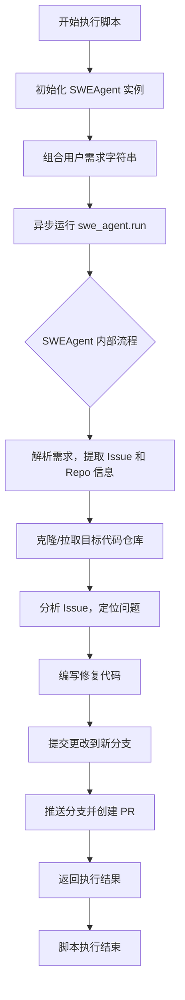

# `.\MetaGPT\tests\metagpt\roles\di\run_swe_agent_open_source_issue.py` 详细设计文档

该代码是一个使用 MetaGPT 框架中 SWEAgent 角色的异步脚本，其核心功能是接收一个包含 GitHub Issue 链接和代码仓库地址的用户需求，启动一个软件工程代理（SWEAgent）来自动化地分析问题、编写修复代码、提交更改并创建拉取请求（PR），以完成对指定开源项目 Issue 的修复工作。

## 整体流程



## 类结构

```
SWEAgent (软件工程代理角色)
├── 继承自 MetaGPT Role 基类
├── 包含 Actions (如分析、编码、提交等)
└── 使用 LLM 进行决策和代码生成
```

## 全局变量及字段


### `FIX_ISSUE1`
    
一个包含修复 langchain-ai/langchain 仓库中 issue #20453 指令的字符串，指定了目标仓库和修复任务。

类型：`str`
    


### `FIX_ISSUE2`
    
一个包含修复 geekan/MetaGPT 仓库中 issue #1275 指令的字符串，指定了目标仓库、分支和修复任务。

类型：`str`
    


### `FIX_ISSUE3`
    
一个包含修复 geekan/MetaGPT 仓库中 issue #1262 指令的字符串，指定了目标仓库和修复任务。

类型：`str`
    


### `FIX_ISSUE_SIMPLE`
    
一个包含修复 mannaandpoem/simple_calculator 仓库中 issue #1 指令的字符串，指定了目标仓库和修复任务。

类型：`str`
    


### `NO_ENV_TIP`
    
一个环境提示字符串，指示在无可用环境时，无需运行或修改测试用例文件。

类型：`str`
    


### `swe_agent`
    
SWEAgent 类的一个实例，用于执行软件工程任务，如修复代码问题。

类型：`SWEAgent`
    


### `user_requirement_and_issue`
    
一个组合字符串，包含具体的修复任务指令（FIX_ISSUE1）和环境提示（NO_ENV_TIP），作为输入传递给 SWEAgent 实例。

类型：`str`
    


    

## 全局函数及方法

### `SWEAgent.run`

该方法是一个异步方法，用于执行软件工程代理（SWEAgent）的核心工作流。它接收一个用户需求（通常是一个需要修复的Issue描述），并驱动代理完成从理解问题、分析代码、制定修复方案、编写代码、运行测试到最终提交修复的完整流程。

参数：

-  `user_requirement`：`str`，包含需要修复的Issue链接和可选操作指令的字符串，是驱动整个流程的初始输入。

返回值：`None`，此方法主要执行一系列操作，不返回具体值。

#### 流程图

```mermaid
graph TD
    A[开始: run(user_requirement)] --> B[调用 _observe 方法<br/>接收并解析用户需求]
    B --> C[调用 _think 方法<br/>分析问题并制定行动计划]
    C --> D[调用 _act 方法<br/>执行计划，如编写代码、运行测试]
    D --> E{是否完成？}
    E -- 否 --> C
    E -- 是 --> F[结束]
```

#### 带注释源码

```python
    async def run(self, user_requirement: str) -> None:
        """
        运行SWEAgent的核心异步方法。
        该方法遵循观察（Observe）、思考（Think）、行动（Act）的循环，直到任务完成。
        
        Args:
            user_requirement (str): 用户的需求描述，通常包含Issue链接和操作指令。
        """
        # 1. 观察阶段：接收并处理用户输入的需求
        await self._observe(user_requirement)
        # 2. 进入思考-行动循环
        while True:
            # 2.1 思考阶段：基于当前观察，推理并生成下一步行动计划
            await self._think()
            # 2.2 检查思考结果，如果为None或空，则跳出循环
            if self.rc.todo is None:
                break
            # 2.3 行动阶段：执行思考阶段制定的计划
            await self._act()
```

## 关键组件


### SWEAgent (软件工程代理)

这是一个用于自动化软件工程任务的代理类，核心功能是接收包含问题描述和代码仓库信息的用户需求，通过一系列自动化步骤（如拉取代码、分析问题、编写修复、提交代码、创建拉取请求等）来修复指定的GitHub Issue。

### 异步任务运行器 (`asyncio.run`)

用于启动和管理`SWEAgent`的异步执行流程，确保代理的`run`方法能够在一个异步事件循环中被正确调用和执行。

### 日志记录器 (`logger`)

提供结构化的日志输出功能，用于记录代理执行过程中的关键事件和状态信息，便于调试和监控。

### 用户需求与问题定义 (`FIX_ISSUE*` 常量)

定义了具体的软件修复任务，每个常量包含一个GitHub Issue的链接和目标代码仓库的地址，作为`SWEAgent`的输入指令。

### 环境约束提示 (`NO_ENV_TIP`)

一个附加的指令说明，告知代理在特定环境（如测试环境不可用）下，无需运行或修改测试用例文件，简化了修复任务的执行范围。


## 问题及建议


### 已知问题

-   **硬编码的配置与任务**：代码中直接硬编码了多个任务字符串（`FIX_ISSUE1`, `FIX_ISSUE2`等），这使得程序功能单一，无法灵活处理用户动态输入的新任务。每次执行不同的任务都需要修改源代码。
-   **缺乏配置管理**：任务相关的参数（如仓库地址、分支名、PR目标等）直接写在代码注释或字符串中，没有使用配置文件或环境变量进行管理，导致维护困难和潜在的安全风险（如暴露内部仓库信息）。
-   **单一执行流程**：主程序入口（`__main__`）每次只能执行一个预定义的任务（当前为`FIX_ISSUE1`），无法批量处理任务或根据外部输入选择任务，限制了脚本的实用性。
-   **错误处理不完善**：代码中未看到对`SWEAgent().run()`方法可能抛出的异常（如网络错误、仓库操作失败、API调用异常等）进行捕获和处理，程序可能因意外错误而崩溃。
-   **代码可测试性差**：由于任务逻辑和代理执行直接耦合在`__main__`中，且依赖外部网络和仓库，难以编写单元测试来验证核心逻辑。

### 优化建议

-   **参数化与配置化**：将任务描述、目标仓库、分支策略等作为命令行参数或从配置文件（如YAML、JSON）中读取。可以设计一个`TaskConfig`类来封装这些信息，使脚本能够接受动态输入。
-   **重构主程序逻辑**：将主执行逻辑封装到一个独立的函数（如`main()`）中，接收任务配置作为参数。这样可以支持循环处理多个任务，或从外部系统（如任务队列）读取任务。
-   **增强错误处理与日志**：在`asyncio.run(swe_agent.run(...))`外层添加`try...except`块，捕获特定异常（如`asyncio.TimeoutError`, `git.exc.GitCommandError`等），并记录详细的错误日志，确保程序健壮性。
-   **引入依赖注入**：考虑将`SWEAgent`的实例化过程抽象出来，便于在测试时替换为Mock对象，从而提高代码的可测试性。
-   **添加任务验证**：在任务执行前，增加对输入参数（如仓库URL有效性、Issue链接格式）的验证逻辑，提前发现无效输入，避免无效操作。
-   **分离关注点**：考虑将任务定义、代理执行、结果汇报等逻辑拆分为不同的模块或类，遵循单一职责原则，使代码结构更清晰，易于维护和扩展。


## 其它


### 设计目标与约束

本代码的设计目标是创建一个能够自动修复开源项目Issue的代理程序。它通过实例化一个SWEAgent角色，接收包含Issue链接和代码仓库地址的用户需求，然后异步执行修复任务。主要约束包括：1) 环境限制：由于环境不可用，代理不应运行或修改现有测试用例文件，也不应添加新的测试用例文件来确保Bug被修复；2) 依赖外部服务：需要访问GitHub等代码托管平台来获取Issue详情和代码仓库；3) 异步执行：使用asyncio库进行异步操作，以提高任务执行效率。

### 错误处理与异常设计

代码中显式的错误处理逻辑较少，主要依赖于底层`SWEAgent`类的内部实现和`asyncio`框架的异常传播。潜在的错误点包括：1) 网络请求失败（如访问GitHub API或克隆仓库时）；2) 代码解析或修改过程中的语法错误；3) Git操作失败（如分支创建、提交、推送）。当前设计将异常处理的责任委托给了`SWEAgent.run`方法。建议在`SWEAgent`类中实现更细粒度的错误捕获和日志记录，例如对网络超时、认证失败、仓库不存在等特定异常进行区分和处理，并向用户或日志系统提供清晰的错误信息。

### 数据流与状态机

数据流起始于硬编码的用户需求字符串（如`FIX_ISSUE1`），该字符串被传递给`SWEAgent`实例的`run`方法。`SWEAgent`内部预计会解析该字符串，提取Issue URL和目标仓库URL。随后，代理会进入一个工作流，可能包括：获取Issue详情、克隆目标仓库、分析问题、编写修复代码、执行Git操作（如创建分支、提交、推送，虽然当前代码注释掉了这部分指令）。整个流程由一个主异步任务驱动。虽然没有显式的状态机定义，但`SWEAgent`的内部逻辑很可能包含诸如`IDLE`、`ANALYZING`、`CODING`、`TESTING`（在当前约束下可能跳过）、`PUSHING`等状态。数据（如代码片段、分析结果、Git引用）在这些状态间流转。

### 外部依赖与接口契约

1.  **外部依赖**：
    *   **MetaGPT框架**：核心依赖，特别是`metagpt.roles.di.swe_agent.SWEAgent`类，提供了修复Issue的智能体能力。
    *   **GitHub**：作为Issue和代码仓库的数据源，以及代码推送的目标平台。代理需要与GitHub的REST API或Git协议交互。
    *   **asyncio**：Python标准库，用于支持异步并发操作。
    *   **Git**：用于执行版本控制操作（如克隆、分支、提交、推送），这通常是`SWEAgent`或其依赖的工具链的一部分。

2.  **接口契约**：
    *   `SWEAgent.run(user_requirement: str) -> Coroutine[Any, Any, Any]`: 这是主要的调用接口。它接受一个描述任务的自然语言字符串，并返回一个协程。调用者（本脚本）负责通过`asyncio.run()`来运行这个协程。该方法的内部实现（如如何解析需求、返回什么结果）是`SWEAgent`的私有细节。
    *   用户需求字符串的格式是一个隐式契约。当前示例表明，字符串应包含Issue的URL和可进行修复的代码仓库URL。`NO_ENV_TIP`字符串的拼接则传递了一个重要的环境约束条件。

### 配置与可扩展性

当前代码将配置（如要修复的Issue、目标仓库、环境提示）硬编码在脚本顶部的全局变量中。这缺乏灵活性。为了提高可扩展性，可以考虑：1) 从配置文件（如YAML、JSON）或环境变量中读取这些参数；2) 支持命令行参数，允许用户动态指定Issue和仓库；3) 将`SWEAgent`的配置（如模型参数、工作目录）外部化。这样，同一个脚本可以更容易地应用于修复不同的Issue，而无需修改源代码。

### 安全与合规考虑

1.  **代码安全**：代理将自动修改代码并可能推送到远程仓库。必须确保其修改是安全且符合预期的，避免引入安全漏洞或恶意代码。这高度依赖于底层`SWEAgent`模型的可靠性和安全性。
2.  **访问权限**：脚本（通过`SWEAgent`）需要对指定的GitHub仓库有写入权限（用于推送分支）。这通常需要配置有效的GitHub个人访问令牌（PAT）。密钥管理是一个关键点，不应将令牌硬编码在代码中。
3.  **合规使用**：自动创建PR到第三方仓库可能涉及该项目的贡献者许可协议（CLA）或行为准则。用户应确保其使用符合目标项目的规则。
4.  **数据隐私**：如果处理的Issue或代码包含敏感信息，需要考虑数据隐私问题。当前脚本处理的是公开的开源项目，此风险较低。

    