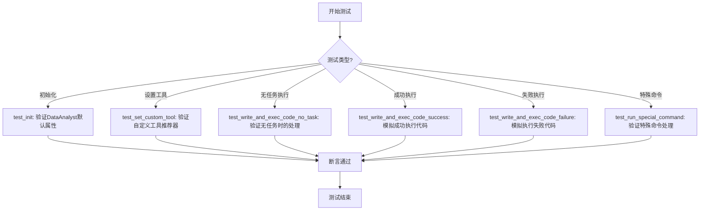
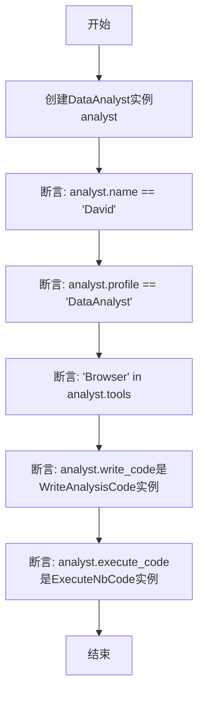
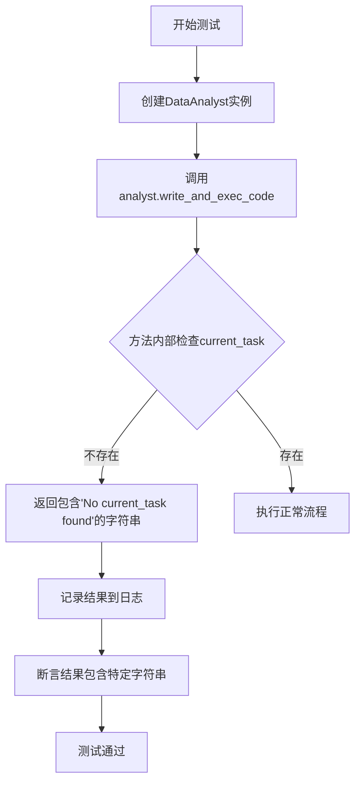
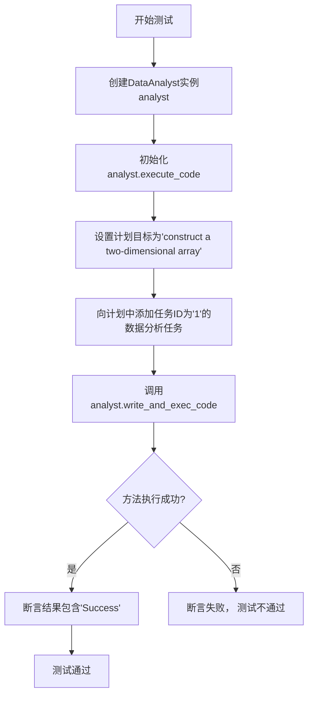
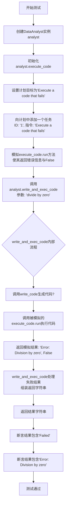

# `.\MetaGPT\tests\metagpt\roles\di\test_data_analyst.py` 详细设计文档

该文件是一个针对 DataAnalyst 角色的单元测试文件，用于验证 DataAnalyst 的初始化、自定义工具设置、代码编写与执行（包括成功、失败和无任务场景）以及特殊命令处理等核心功能。

## 整体流程



## 类结构

```
TestDataAnalyst (测试类)
├── test_init (测试初始化方法)
├── test_set_custom_tool (测试自定义工具设置方法)
├── test_write_and_exec_code_no_task (测试无任务时的代码执行)
├── test_write_and_exec_code_success (测试成功执行代码)
├── test_write_and_exec_code_failure (测试执行失败代码)
└── test_run_special_command (测试特殊命令处理)
```

## 全局变量及字段


### `TestDataAnalyst.analyst`
    
测试用例中用于测试DataAnalyst角色的实例对象

类型：`DataAnalyst`
    


### `TestDataAnalyst.result`
    
存储异步测试方法执行后的结果字符串

类型：`str`
    


### `TestDataAnalyst.cmd`
    
包含特殊命令信息的字典，用于测试_run_special_command方法

类型：`dict`
    
    

## 全局函数及方法

### `TestDataAnalyst.test_init`

该方法是一个单元测试，用于验证`DataAnalyst`类实例化后的初始状态。它检查实例的默认属性值是否正确设置，以及关键组件是否被正确初始化。

参数：
- `self`：`TestDataAnalyst`，指向当前测试类实例的引用。

返回值：`None`，单元测试方法通常不返回值，而是通过断言（assert）来验证测试结果。

#### 流程图



#### 带注释源码

```python
def test_init(self):
    # 创建一个DataAnalyst类的实例
    analyst = DataAnalyst()
    # 断言：检查实例的name属性是否为默认值"David"
    assert analyst.name == "David"
    # 断言：检查实例的profile属性是否为默认值"DataAnalyst"
    assert analyst.profile == "DataAnalyst"
    # 断言：检查默认工具列表（analyst.tools）中是否包含"Browser"
    assert "Browser" in analyst.tools
    # 断言：检查write_code属性是否为WriteAnalysisCode类的实例
    assert isinstance(analyst.write_code, WriteAnalysisCode)
    # 断言：检查execute_code属性是否为ExecuteNbCode类的实例
    assert isinstance(analyst.execute_code, ExecuteNbCode)
```

### `TestDataAnalyst.test_set_custom_tool`

该方法用于测试 `DataAnalyst` 类的 `custom_tools` 属性设置功能。它创建一个 `DataAnalyst` 实例，为其 `custom_tools` 属性赋值，然后验证该赋值操作是否成功触发了内部 `custom_tool_recommender` 的初始化，并确认其类型为 `BM25ToolRecommender`。

参数：
-  `self`：`TestDataAnalyst`，测试类实例的引用。

返回值：`None`，该测试方法不返回任何值，其目的是通过断言（assert）来验证代码行为。

#### 流程图

```mermaid
flowchart TD
    A[开始] --> B[创建DataAnalyst实例analyst]
    B --> C[设置analyst.custom_tools = <br/>["web scraping", "Terminal"]]
    C --> D{断言：<br/>analyst.custom_tool_recommender <br/>是BM25ToolRecommender实例}
    D -->|是| E[测试通过]
    D -->|否| F[测试失败，抛出异常]
```

#### 带注释源码

```python
def test_set_custom_tool(self):
    # 1. 创建 DataAnalyst 类的实例，用于测试
    analyst = DataAnalyst()
    
    # 2. 为实例的 custom_tools 属性赋值一个包含两个工具名称的列表
    analyst.custom_tools = ["web scraping", "Terminal"]
    
    # 3. 断言：验证设置 custom_tools 后，
    #    实例的 custom_tool_recommender 属性被正确初始化为 BM25ToolRecommender 类型
    assert isinstance(analyst.custom_tool_recommender, BM25ToolRecommender)
```

### `TestDataAnalyst.test_write_and_exec_code_no_task`

这是一个单元测试方法，用于测试 `DataAnalyst` 角色的 `write_and_exec_code` 方法在未设置当前任务（`current_task`）时的行为。它验证了当没有任务可供执行时，方法会返回一个包含特定错误信息的字符串。

参数：
- `self`：`TestDataAnalyst`，测试类实例的引用。

返回值：`None`，这是一个测试方法，不返回业务值，仅通过断言（assert）来验证测试结果。

#### 流程图



#### 带注释源码

```python
@pytest.mark.asyncio  # 标记此测试为异步测试，以便使用await
async def test_write_and_exec_code_no_task(self):
    # 步骤1: 创建待测试的DataAnalyst角色实例
    analyst = DataAnalyst()
    
    # 步骤2: 调用核心方法，但不传入任务指令。
    # 此操作旨在触发方法内部因`current_task`为None而返回错误信息的逻辑。
    result = await analyst.write_and_exec_code()
    
    # 步骤3: 将方法返回的结果记录到日志中，便于调试和查看。
    logger.info(result)
    
    # 步骤4: 断言验证。检查返回的字符串中是否包含预期的错误提示信息。
    # 这是本测试的核心断言，用于确认方法在无任务时的行为符合设计。
    assert "No current_task found" in result
```

### `TestDataAnalyst.test_write_and_exec_code_success`

这是一个单元测试方法，用于测试 `DataAnalyst` 角色的 `write_and_exec_code` 方法在成功执行数据分析任务时的行为。它模拟了一个完整的成功场景：初始化代码执行环境、设置任务目标、添加具体的数据分析任务，然后调用被测方法并验证其返回结果包含“Success”字符串。

参数：

-  `self`：`TestDataAnalyst`，测试类实例的引用

返回值：`None`，这是一个测试方法，不返回业务值，其成功与否由 `assert` 语句判定。

#### 流程图



#### 带注释源码

```python
    @pytest.mark.asyncio  # 标记此方法为异步测试，以便pytest-asyncio插件能够正确处理
    async def test_write_and_exec_code_success(self):
        # 步骤1：创建被测对象DataAnalyst的实例
        analyst = DataAnalyst()
        # 步骤2：初始化代码执行环境（例如，启动一个Jupyter内核）
        await analyst.execute_code.init_code()
        # 步骤3：为analyst内部的计划器设置一个明确的目标
        analyst.planner.plan.goal = "construct a two-dimensional array"
        # 步骤4：向计划中添加一个具体的任务，模拟用户请求
        analyst.planner.plan.append_task(
            task_id="1",  # 任务唯一标识
            dependent_task_ids=[],  # 该任务不依赖其他任务
            instruction="construct a two-dimensional array",  # 任务指令，与目标一致
            assignee="David",  # 任务分配给名为David的角色（即此analyst）
            task_type="DATA_ANALYSIS",  # 指定任务类型为数据分析
        )

        # 步骤5：调用核心的被测方法，传入任务指令
        result = await analyst.write_and_exec_code("construct a two-dimensional array")
        # 记录结果以便调试
        logger.info(result)
        # 步骤6：断言。验证在成功执行代码后，返回的字符串中包含“Success”字样。
        assert "Success" in result
```

### `TestDataAnalyst.test_write_and_exec_code_failure`

这是一个单元测试方法，用于测试 `DataAnalyst` 角色的 `write_and_exec_code` 方法在代码执行失败时的行为。它模拟了执行一个会失败的代码（例如除以零）的场景，并验证了方法能够正确捕获错误、返回包含“Failed”状态和错误信息的字符串。

参数：

-  `self`：`TestDataAnalyst`，测试类实例的引用。

返回值：`None`，这是一个测试方法，不返回业务值，其目的是通过断言（assert）来验证代码行为。

#### 流程图



#### 带注释源码

```python
    @pytest.mark.asyncio  # 标记此方法为异步测试，以便pytest-asyncio插件能够正确处理
    async def test_write_and_exec_code_failure(self):
        # 1. 创建被测试的DataAnalyst角色实例
        analyst = DataAnalyst()
        # 2. 初始化代码执行器（例如，准备Jupyter Notebook环境）
        await analyst.execute_code.init_code()
        # 3. 设置角色计划的目标，描述本次测试要模拟的失败场景
        analyst.planner.plan.goal = "Execute a code that fails"

        # 4. 向角色的计划中添加一个具体的任务。
        #    这个任务的指令是“Execute a code that fails”，它将被传递给write_and_exec_code方法。
        analyst.planner.plan.append_task(
            task_id="1",  # 任务唯一标识
            dependent_task_ids=[],  # 无依赖任务
            instruction="Execute a code that fails",  # 任务指令
            assignee="David"  # 任务分配给谁（角色名）
        )

        # 5. 关键步骤：模拟（Mock）代码执行器的`run`方法。
        #    `AsyncMock`创建一个异步方法的模拟对象。
        #    这里将其配置为直接返回一个元组：('Error: Division by zero', False)。
        #    第一个元素是模拟的执行错误输出，第二个元素`False`表示执行失败。
        #    这绕过了真实的代码执行，直接模拟了失败情况。
        analyst.execute_code.run = AsyncMock(return_value=("Error: Division by zero", False))

        # 6. 调用被测试的核心方法：`write_and_exec_code`。
        #    参数`'divide by zero'`是提示信息，可能用于日志或上下文，但在此测试中，
        #    由于上一步的模拟，实际执行的代码和结果由Mock决定。
        result = await analyst.write_and_exec_code("divide by zero")

        # 7. 记录返回结果，便于调试
        logger.info(result)
        # 8. 断言：验证返回的字符串结果中是否包含“Failed”关键字，表明方法正确识别了失败状态。
        assert "Failed" in result
        # 9. 断言：验证返回的字符串结果中是否包含模拟的错误信息“Error: Division by zero”。
        assert "Error: Division by zero" in result
```

### `TestDataAnalyst.test_run_special_command`

这是一个单元测试方法，用于测试 `DataAnalyst` 类的 `_run_special_command` 方法在接收到特殊命令 `{"command_name": "end"}` 时的行为。它验证了当执行该命令后，计划（plan）会被标记为完成，并且方法返回包含“All tasks are finished”的字符串。

参数：

-  `self`：`TestDataAnalyst`，测试类实例的引用。

返回值：`None`，这是一个单元测试方法，不返回业务值，其成功与否由 `assert` 语句决定。

#### 流程图

```mermaid
graph TD
    A[开始测试] --> B[创建DataAnalyst实例analyst]
    B --> C[设置计划目标为'test goal']
    C --> D[向计划中添加一个测试任务]
    D --> E{断言: 计划未完成}
    E -->|是| F[构造特殊命令cmd: command_name='end']
    F --> G[调用analyst._run_special_command(cmd)]
    G --> H{断言: 结果包含'All tasks are finished'}
    H -->|是| I{断言: 计划已完成}
    I -->|是| J[测试通过]
    E -->|否| K[测试失败]
    H -->|否| K
    I -->|否| K
```

#### 带注释源码

```python
    @pytest.mark.asyncio
    async def test_run_special_command(self):
        # 1. 创建被测试的DataAnalyst角色实例
        analyst = DataAnalyst()

        # 2. 设置测试环境：为analyst内部的计划器(planner)设置一个目标并添加一个任务
        analyst.planner.plan.goal = "test goal"
        analyst.planner.plan.append_task(task_id="1", dependent_task_ids=[], instruction="test task", assignee="David")
        # 3. 验证在命令执行前，计划状态为“未完成”
        assert not analyst.planner.plan.is_plan_finished()
        
        # 4. 构造一个特殊的命令字典，命令名为'end'，这通常用于指示结束当前计划
        cmd = {"command_name": "end"}
        
        # 5. 调用被测试的私有方法 `_run_special_command` 并获取结果
        result = await analyst._run_special_command(cmd)
        
        # 6. 验证结果：返回的字符串应包含完成信息
        assert "All tasks are finished" in result
        # 7. 验证状态：执行命令后，计划应被标记为“已完成”
        assert analyst.planner.plan.is_plan_finished()
```

## 关键组件


### DataAnalyst 角色类

DataAnalyst 类是数据分析师角色的核心实现，负责协调代码编写与执行流程，管理任务规划，并集成工具推荐功能。

### WriteAnalysisCode 动作类

WriteAnalysisCode 是用于生成数据分析代码的动作类，作为 DataAnalyst 角色的一个关键依赖，负责将分析需求转化为可执行的代码。

### ExecuteNbCode 动作类

ExecuteNbCode 是用于执行笔记本（Notebook）代码的动作类，作为 DataAnalyst 角色的另一个关键依赖，负责安全地运行生成的代码并返回结果。

### BM25ToolRecommender 工具推荐器

BM25ToolRecommender 是一个基于 BM25 算法的工具推荐器，当 DataAnalyst 角色设置了自定义工具时，用于根据任务上下文推荐合适的工具。

### Planner 与 Plan 组件

Planner 及其内部的 Plan 组件负责管理 DataAnalyst 角色的任务规划，包括任务的创建、依赖关系管理以及计划状态的跟踪（如判断计划是否完成）。

### 特殊命令处理机制

`_run_special_command` 方法及其处理的命令（如 `"end"`）构成了 DataAnalyst 角色的特殊命令处理机制，用于执行非代码生成/执行的特定操作，例如标记计划完成。


## 问题及建议

### 已知问题

-   **测试用例对内部实现细节依赖过强**：多个测试方法（如 `test_write_and_exec_code_success`、`test_write_and_exec_code_failure`）直接访问和操作被测类 `DataAnalyst` 的内部属性（如 `analyst.planner.plan`、`analyst.execute_code`）。这使得测试变得脆弱，一旦 `DataAnalyst` 的内部结构或属性名发生改变，这些测试就会失败，增加了维护成本。
-   **测试数据构造复杂且不直观**：在 `test_write_and_exec_code_success` 等测试中，需要手动构建一个完整的计划（`plan`）对象并设置其内部状态（`goal`，`append_task`）来模拟一个任务场景。这种方式不仅代码冗长，而且将测试逻辑与复杂的业务对象初始化逻辑耦合在一起，降低了测试的可读性和可维护性。
-   **存在未使用的导入和潜在的测试覆盖缺口**：代码中导入了 `pytest` 但未使用其高级特性（如 `fixture`），同时，`test_init` 方法中检查了 `analyst.tools` 包含 `"Browser"`，但未测试 `DataAnalyst` 初始化时 `tools` 列表的完整性和正确性。此外，`test_set_custom_tool` 方法仅验证了 `custom_tool_recommender` 的类型，未测试其实际功能或与 `custom_tools` 的关联逻辑。
-   **异步测试的 `Mock` 使用可能不完整**：在 `test_write_and_exec_code_failure` 中，使用 `AsyncMock` 模拟了 `analyst.execute_code.run` 方法。然而，测试并未验证 `write_and_exec_code` 方法在调用 `write_code.run`（写入代码步骤）时的行为，也未模拟可能发生的其他异步异常，测试场景较为单一。

### 优化建议

-   **重构测试以减少对内部实现的依赖**：应通过公共接口或方法来驱动测试，而非直接操作内部状态。例如，可以考虑为 `DataAnalyst` 类提供设置任务目标或接收任务指令的公共方法，测试通过调用这些方法来设置测试场景。如果必须测试复杂状态，可以考虑使用工厂模式或构建器模式来创建测试用的 `Plan` 对象，或者使用 `pytest.fixture` 来封装通用的测试数据准备逻辑。
-   **简化测试数据准备，提升可读性**：利用 `pytest.fixture` 来创建共享的、预设状态的 `DataAnalyst` 实例或 `Plan` 对象。将复杂的对象构建逻辑移入 `fixture` 中，使测试用例本身更专注于断言和行为验证。例如，可以创建一个 `@pytest.fixture` 返回一个带有特定目标和一个任务的 `DataAnalyst` 实例。
-   **完善测试覆盖，充分利用测试框架**：增加测试用例以覆盖 `DataAnalyst` 的更多行为，例如：使用不同工具列表初始化、`custom_tools` 设置后 `custom_tool_recommender` 的推荐功能、`write_and_exec_code` 在 `write_code.run` 失败时的行为等。同时，审查并移除未使用的导入。考虑使用 `pytest.mark.parametrize` 对相似测试逻辑进行参数化，减少代码重复。
-   **增强异步 `Mock` 和异常测试**：在模拟异步依赖时，确保覆盖所有关键的异步调用路径。对于 `test_write_and_exec_code_failure`，可以扩展为两个测试：一个模拟 `execute_code.run` 失败，另一个模拟 `write_code.run` 失败。同时，可以测试当这些方法抛出异常（而不仅仅是返回错误结果）时，`write_and_exec_code` 方法的错误处理是否健壮。确保 `AsyncMock` 的行为（如是否被调用、调用参数）得到充分断言。

## 其它


### 设计目标与约束

本测试套件的设计目标是验证 `DataAnalyst` 角色的核心功能，包括其初始化、自定义工具设置、代码编写与执行流程（涵盖成功、失败及无任务场景）以及特殊命令处理。约束在于测试必须完全隔离，不依赖外部数据源或服务，通过模拟（Mock）和桩（Stub）技术来模拟 `ExecuteNbCode` 等依赖组件的行为，确保测试的可靠性和可重复性。

### 错误处理与异常设计

测试用例明确设计了针对错误场景的验证。在 `test_write_and_exec_code_failure` 中，通过 `AsyncMock` 模拟 `execute_code.run` 方法返回错误信息和失败状态，测试 `DataAnalyst` 对执行失败情况的处理能力，确保其能正确捕获并返回错误详情。在 `test_write_and_exec_code_no_task` 中，测试了当没有当前任务时系统的行为，验证其能返回明确的提示信息而非抛出未处理的异常。

### 数据流与状态机

测试展示了 `DataAnalyst` 与 `planner.plan` 之间的数据流和状态交互。在 `test_write_and_exec_code_success` 和 `test_run_special_command` 中，通过设置 `plan.goal` 和 `append_task` 来初始化计划状态。`write_and_exec_code` 方法内部会依赖此计划状态来获取当前任务。`_run_special_command` 方法处理 `"end"` 命令，其核心是调用 `plan.is_plan_finished()` 来改变计划完成状态，测试验证了命令执行前后计划状态的变化。

### 外部依赖与接口契约

测试用例的外部依赖主要包括 `WriteAnalysisCode`、`ExecuteNbCode` 和 `BM25ToolRecommender` 类。测试通过断言 `isinstance` 来验证 `DataAnalyst` 是否正确初始化了这些依赖组件。对于 `ExecuteNbCode.run` 方法，测试定义了其接口契约：它应是一个异步方法，返回一个包含执行结果字符串和成功布尔值的元组 `(str, bool)`。`test_write_and_exec_code_failure` 通过模拟此返回值来测试上游逻辑。

### 测试策略与覆盖范围

测试策略采用单元测试，聚焦于 `DataAnalyst` 类的方法。覆盖范围包括：构造函数初始化、属性设置（`test_init`）、自定义工具推荐器的初始化（`test_set_custom_tool`）、核心业务方法 `write_and_exec_code` 在无任务、成功执行、失败执行三种路径下的行为，以及内部方法 `_run_special_command` 对计划状态的影响。通过模拟隔离，确保了测试的独立性和执行速度。

    