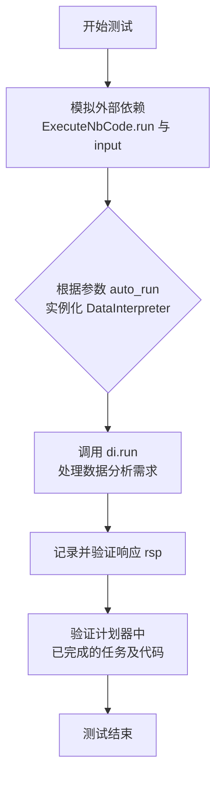
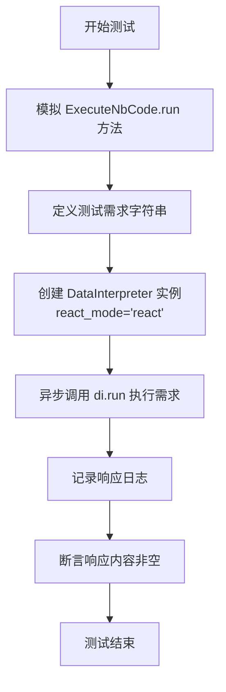
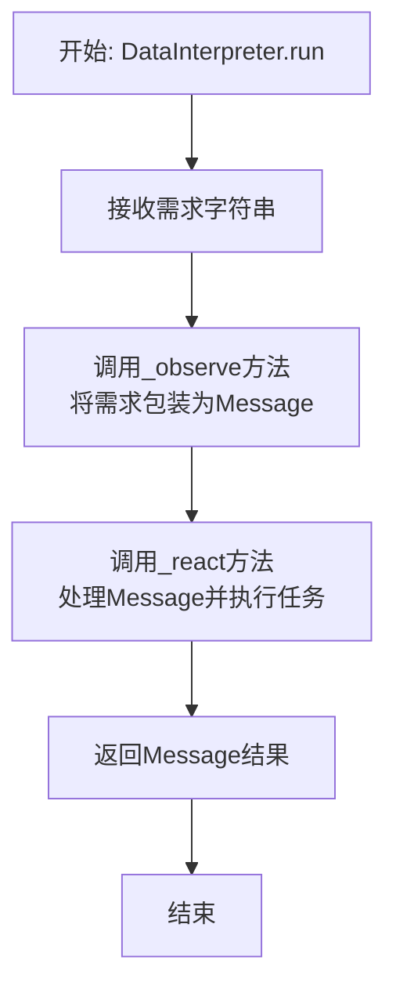

# `.\MetaGPT\tests\metagpt\roles\di\test_data_interpreter.py` 详细设计文档

该文件是一个针对 DataInterpreter 角色的单元测试文件，用于测试其在不同配置（如自动运行模式和 ReAct 模式）下，处理数据科学任务（如对 sklearn Wine 数据集进行分析、绘图、训练模型并验证）的能力。测试通过模拟（mock）外部依赖来验证核心逻辑的正确性。

## 整体流程

```mermaid
graph TD
    A[开始测试] --> B{测试参数化?}
    B -- 是 --> C[test_interpreter: 设置模拟]
    B -- 否 --> D[test_interpreter_react_mode: 设置模拟]
    C --> E[创建DataInterpreter实例]
    D --> F[创建DataInterpreter实例]
    E --> G[调用di.run(requirement)]
    F --> G
    G --> H[模拟ExecuteNbCode.run返回成功]
    H --> I[模拟用户输入'confirm']
    I --> J[断言响应内容非空]
    J --> K[断言有已完成任务]
    K --> L[断言任务包含代码]
    L --> M[测试通过]
```

## 类结构

```
pytest 测试模块
├── test_interpreter (异步测试函数)
└── test_interpreter_react_mode (异步测试函数)
```

## 全局变量及字段


### `logger`
    
用于记录代码执行过程中的日志信息的日志记录器实例。

类型：`Logger`
    


### `requirement`
    
一个字符串，描述了需要DataInterpreter执行的具体任务或目标。

类型：`str`
    


### `DataInterpreter.auto_run`
    
一个布尔标志，指示DataInterpreter是否应自动执行任务而无需人工确认。

类型：`bool`
    


### `DataInterpreter.react_mode`
    
一个字符串，指定DataInterpreter在解决问题时采用的推理模式（例如'react'模式）。

类型：`str`
    


### `DataInterpreter.planner`
    
负责为给定需求规划和分解任务的规划器组件实例。

类型：`Planner`
    
    

## 全局函数及方法

### `test_interpreter`

这是一个使用 `pytest` 框架编写的异步测试函数，用于测试 `DataInterpreter` 类在两种不同配置下的核心功能。它通过模拟（mocking）外部依赖来验证 `DataInterpreter` 能否处理一个复杂的数据分析需求，并生成包含代码和结果的有效响应。

参数：

- `mocker`：`pytest-mock.MockerFixture`，`pytest-mock` 插件提供的模拟对象，用于在测试中替换（mock）指定的函数或方法，以隔离测试环境。
- `auto_run`：`bool`，一个布尔值参数，用于控制 `DataInterpreter` 实例的 `auto_run` 属性。当为 `True` 时，代码可能自动执行；为 `False` 时，可能需要等待用户确认。

返回值：`None`，这是一个测试函数，其主要目的是通过断言（assert）来验证代码行为，不返回业务值。

#### 流程图



#### 带注释源码

```python
# 使用 pytest 的异步和参数化装饰器
# @pytest.mark.asyncio: 标记此函数为异步测试函数。
# @pytest.mark.parametrize: 参数化测试，`auto_run` 参数将分别以 `True` 和 `False` 运行一次此测试。
@pytest.mark.asyncio
@pytest.mark.parametrize("auto_run", [(True), (False)])
async def test_interpreter(mocker, auto_run):
    # 1. 模拟（Mock）外部依赖
    # 将 `ExecuteNbCode.run` 方法替换为一个模拟函数，使其返回预定义的成功结果。
    # 这确保了测试不依赖于真实的代码执行环境。
    mocker.patch("metagpt.actions.di.execute_nb_code.ExecuteNbCode.run", return_value=("a successful run", True))
    # 模拟内置的 `input` 函数，使其始终返回 "confirm"，模拟用户确认操作。
    mocker.patch("builtins.input", return_value="confirm")

    # 2. 定义测试需求
    # 这是一个具体的、多步骤的数据分析任务描述，用于驱动 DataInterpreter。
    requirement = "Run data analysis on sklearn Wine recognition dataset, include a plot, and train a model to predict wine class (20% as validation), and show validation accuracy."

    # 3. 创建测试对象并执行
    # 使用给定的 `auto_run` 参数实例化 DataInterpreter。
    di = DataInterpreter(auto_run=auto_run)
    # 异步调用 `run` 方法处理需求，并获取响应。
    rsp = await di.run(requirement)
    # 使用日志记录器输出响应内容，便于调试。
    logger.info(rsp)
    # 断言1：验证响应对象 `rsp` 的 `content` 属性非空，确保有结果返回。
    assert len(rsp.content) > 0

    # 4. 验证内部状态
    # 从 DataInterpreter 内部的计划器（planner）中获取所有已完成的任务列表。
    finished_tasks = di.planner.plan.get_finished_tasks()
    # 断言2：验证至少有一个任务被标记为完成。
    assert len(finished_tasks) > 0
    # 断言3：检查第一个已完成任务的 `code` 属性非空，确保任务执行过程中生成了代码。
    assert len(finished_tasks[0].code) > 0  # check one task to see if code is recorded
```

### `test_interpreter_react_mode`

这是一个使用 `pytest` 框架编写的异步单元测试函数，用于测试 `DataInterpreter` 类在 `react` 模式下的核心功能。该测试模拟了一个数据分析和机器学习任务的需求，通过模拟（Mock）外部依赖来验证 `DataInterpreter` 能否在指定模式下正确执行并生成有效响应。

参数：
- `mocker`：`pytest-mock` 提供的 `MockerFixture` 对象，用于在测试中创建模拟对象（Mock），以隔离和替换被测试代码的外部依赖。

返回值：`None`，这是一个测试函数，其主要目的是通过断言（assert）来验证代码行为，不返回业务值。

#### 流程图



#### 带注释源码

```python
# 使用 pytest 的异步和模拟标记
@pytest.mark.asyncio
async def test_interpreter_react_mode(mocker):
    # 1. 模拟（Mock）关键依赖：将 `ExecuteNbCode.run` 方法的执行替换为返回固定成功值的模拟函数。
    #    这确保了测试不依赖于真实的外部代码执行环境（如 Jupyter Notebook 内核）。
    mocker.patch("metagpt.actions.di.execute_nb_code.ExecuteNbCode.run", return_value=("a successful run", True))

    # 2. 定义一个具体的、包含数据分析、可视化和模型训练步骤的测试需求。
    requirement = "Run data analysis on sklearn Wine recognition dataset, include a plot, and train a model to predict wine class (20% as validation), and show validation accuracy."

    # 3. 创建被测试对象 `DataInterpreter` 的实例，并显式设置其工作模式为 `"react"`。
    di = DataInterpreter(react_mode="react")

    # 4. 异步执行 `DataInterpreter.run` 方法，传入测试需求。
    rsp = await di.run(requirement)

    # 5. 使用日志记录器输出执行后的响应，便于调试和观察。
    logger.info(rsp)

    # 6. 核心断言：验证 `DataInterpreter` 返回的响应对象 `rsp` 的内容（`content` 属性）不为空。
    #    这证明了在 `react` 模式下，流程能够执行完毕并产生输出。
    assert len(rsp.content) > 0
```

### `DataInterpreter.run`

该方法用于执行数据解释器的核心运行流程，根据给定的需求（requirement）启动任务规划、代码执行和结果处理，最终返回处理结果。

参数：

- `requirement`：`str`，用户提出的需求描述，例如数据分析和模型训练任务。

返回值：`Message`，包含执行结果的Message对象，其中content字段存储了最终的输出内容（如分析报告、图表、模型准确率等）。

#### 流程图



#### 带注释源码

```python
async def run(self, requirement: str) -> Message:
    """
    运行数据解释器的主要入口方法。
    将用户需求转换为内部消息，并触发反应链进行处理。
    
    Args:
        requirement (str): 用户的需求描述。
        
    Returns:
        Message: 包含最终处理结果的消息对象。
    """
    # 将字符串需求包装成一个Message对象，以便在角色系统中传递
    msg = await self._observe(requirement)
    # 触发角色的反应逻辑，执行规划、代码生成、运行等完整流程
    rsp = await self._react()
    return rsp
```

## 关键组件


### DataInterpreter

DataInterpreter 是执行数据解释任务的核心角色类，它接收自然语言需求，通过规划、代码生成与执行等步骤，自动化地完成数据分析、可视化及建模等任务。

### Planner

Planner 是 DataInterpreter 内部用于任务规划和管理的组件，负责将用户需求分解为可执行的任务序列，并跟踪任务的完成状态。

### ExecuteNbCode Action

ExecuteNbCode 是一个动作（Action），负责执行由 Planner 生成的 Notebook 代码单元，并返回执行结果和状态，是代码执行环节的关键组件。

### React Mode

React Mode 是 DataInterpreter 的一种运行模式，在此模式下，系统可能会采用类似于 ReAct（Reasoning + Acting）的交互式推理与执行循环来处理复杂任务。


## 问题及建议


### 已知问题

-   **测试用例对实现细节耦合度高**：测试用例通过 `mocker.patch` 直接模拟了 `ExecuteNbCode.run` 和 `builtins.input` 的内部方法。这种模拟方式非常脆弱，一旦被模拟的类、方法名或函数签名发生改变，测试就会失败，即使 `DataInterpreter` 的核心逻辑没有变化。这增加了维护测试的成本。
-   **测试断言过于宽泛**：测试断言如 `assert len(rsp.content) > 0` 和 `assert len(finished_tasks[0].code) > 0` 仅验证了输出非空，但没有验证其内容的正确性、格式或是否符合需求。这可能导致测试通过，但实际功能已损坏。
-   **测试覆盖不完整**：测试用例主要验证了“成功路径”。对于 `DataInterpreter` 在处理错误输入、网络异常、代码执行失败、用户取消操作（`auto_run=False` 时）等边界情况和异常路径时的行为，缺乏相应的测试。
-   **存在重复代码**：两个测试函数 `test_interpreter` 和 `test_interpreter_react_mode` 在准备测试数据（`requirement`）、创建 `DataInterpreter` 实例、执行 `run` 方法以及进行基础断言的部分存在大量重复代码，违反了 DRY（Don‘t Repeat Yourself）原则。
-   **异步测试潜在问题**：测试使用了 `@pytest.mark.asyncio`，但未对异步操作（如 `di.run`）可能发生的超时进行管理。如果被测试代码存在死锁或长时间运行，测试可能会挂起。

### 优化建议

-   **重构测试以减少实现耦合**：建议使用更高级的模拟或依赖注入。例如，可以创建一个 `MockExecuteNbCodeAction` 类来替换真实的 `ExecuteNbCode` 动作，并将其注入到 `DataInterpreter` 中。或者，使用 pytest 的 fixture 来在更高的层次（如动作的工厂或执行器）进行模拟，而不是深入到具体的方法。
-   **增强测试断言**：测试应验证更具体的业务逻辑。例如，可以检查 `rsp.content` 中是否包含预期的关键词（如“accuracy”、“plot”），或者验证 `finished_tasks` 中任务的状态和顺序是否符合预期。对于 `react_mode` 的测试，可以验证其与 `auto_run` 模式在任务执行步骤上的差异。
-   **补充边界和异常测试**：增加测试用例以覆盖：
    -   空需求或无效需求。
    -   `ExecuteNbCode.run` 返回执行失败（`False`）的情况。
    -   `auto_run=False` 时，模拟用户输入“取消”或提供无效输入。
    -   网络请求失败或依赖库缺失的模拟场景。
-   **提取公共代码为 Fixture 或 Helper 函数**：将 `requirement` 字符串、`DataInterpreter` 的创建和基础断言逻辑提取到 pytest fixture 或模块级的 helper 函数中。这能提高代码复用性，使测试主体更专注于测试特定的行为差异（如 `auto_run` 和 `react_mode`）。
-   **为异步测试添加超时控制**：使用 `asyncio.wait_for` 或 pytest 的 `pytest.mark.timeout` 标记来为异步测试设置合理的超时时间，避免测试无限期挂起。
-   **考虑增加集成测试或组件测试**：当前测试是高度模拟的单元测试。建议补充一些轻量级的集成测试，例如在一个隔离的临时环境中真实地执行一个简单的、确定性的数据分析任务，以验证 `DataInterpreter` 各组件协同工作的整体流程。


## 其它


### 设计目标与约束

本测试代码的设计目标是验证 `DataInterpreter` 角色在不同配置（`auto_run` 参数为 `True` 或 `False`，以及 `react_mode` 参数为 `"react"`）下的核心功能是否正常工作。主要约束包括：1) 测试环境需模拟外部依赖（如代码执行和用户输入）的行为以确保测试的独立性和可重复性；2) 测试用例需覆盖异步执行流程；3) 断言需验证角色执行后产出的非空性以及内部任务规划组件的状态正确性。

### 错误处理与异常设计

测试代码本身不包含业务逻辑的错误处理，其目的是验证被测对象（`DataInterpreter`）在正常模拟场景下的行为。测试通过 `pytest` 框架管理，任何断言失败或未捕获的异常都会导致测试用例失败，从而反馈功能缺陷。测试通过 `mocker.patch` 模拟了 `ExecuteNbCode.run` 和 `builtins.input` 的返回值，确保测试路径不依赖于外部系统的真实状态或交互，避免了因外部错误导致的测试不稳定。

### 数据流与状态机

1.  **输入数据流**：测试的输入是固定的字符串 `requirement`，描述了数据分析任务。
2.  **模拟数据流**：
    *   `ExecuteNbCode.run` 方法被模拟为始终返回成功结果 `("a successful run", True)`。
    *   `builtins.input` 在 `test_interpreter` 测试中被模拟为返回 `"confirm"`。
3.  **被测对象内部状态流**：
    *   `DataInterpreter` 实例根据 `requirement` 生成计划并执行任务。
    *   执行结束后，通过 `di.planner.plan.get_finished_tasks()` 获取已完成的任务列表，验证其非空性及任务中记录的代码非空，这验证了角色内部状态机从“规划”到“执行完成”的迁移是成功的。
4.  **输出数据流**：`DataInterpreter.run` 的返回对象 `rsp` 的 `content` 属性被验证为非空，作为功能输出的主要断言。

### 外部依赖与接口契约

1.  **外部依赖**：
    *   `metagpt.actions.di.execute_nb_code.ExecuteNbCode`：其 `run` 方法被模拟。测试假设其接口契约是返回一个元组 `(str, bool)`。
    *   `builtins.input`：用户输入函数，在 `test_interpreter` 中当 `auto_run=False` 时可能被调用，测试中模拟其返回固定字符串。
    *   `metagpt.roles.di.data_interpreter.DataInterpreter`：这是被测的主要对象，测试依赖于其 `__init__` 和 `run` 方法的公开接口。
    *   `pytest`、`pytest-asyncio`、`pytest-mock`：测试框架依赖。
2.  **接口契约验证**：测试通过模拟和断言，间接验证了 `DataInterpreter` 与上述依赖（特别是 `ExecuteNbCode`）之间的协作符合预期。例如，模拟 `ExecuteNbCode.run` 返回成功，并最终断言 `rsp.content` 非空，验证了 `DataInterpreter` 能够处理成功的代码执行结果并生成输出。

### 测试策略与覆盖范围

1.  **测试策略**：采用基于模拟（Mocking）的单元测试策略，隔离被测对象，聚焦于其内部逻辑与流程。使用 `@pytest.mark.parametrize` 进行参数化测试，高效覆盖 `auto_run` 的不同取值。
2.  **覆盖范围**：
    *   **功能路径**：覆盖了 `DataInterpreter` 在自动运行模式（`auto_run=True`）、需确认模式（`auto_run=False`）以及特定反应模式（`react_mode="react"`）下的执行流程。
    *   **状态验证**：不仅验证最终输出，还通过检查 `plan.get_finished_tasks()` 验证了内部任务规划组件的状态更新，提供了更深层次的验证。
    *   **集成点**：通过模拟验证了与关键动作 `ExecuteNbCode` 的集成。
3.  **未覆盖范围**：测试未覆盖 `ExecuteNbCode.run` 返回失败（`False`）或抛出异常的场景、复杂的用户输入序列、`react_mode` 的其他可能取值、以及 `DataInterpreter` 在长时间运行或资源受限环境下的行为。


    