```mermaid
flowchart TD
    A[开始] --> B{rc.todo 存在?}
    B -- 是 --> C[设置 rc.todo 为 None]
    C --> D[设置 rc.memory 为 None]
    D --> E[调用 _observe 方法]
    E --> F[调用 _think 方法]
    F --> G[返回 True]
    B -- 否 --> H[返回 False]
```

# `.\MetaGPT\tests\metagpt\roles\di\test_role_zero.py` 详细设计文档

该代码是一个针对 RoleZero 角色的单元测试文件，主要测试 RoleZero 角色的初始化配置、内部状态以及其核心的思考-反应循环（think-react cycle）功能。

## 整体流程


## 类结构

```
RoleZero (被测试类)
├── 继承自: (未在代码中明确显示，推测为 metagpt.roles.di.role_zero.RoleZero)
├── 字段: rc, planner, tool_execution_map, react_mode, respond_language
└── 方法: _think, _react
Message (消息类)
Plan (工具类，推测)
UserRequirement (动作类)
```

## 全局变量及字段


### `role`
    
RoleZero类的测试实例，用于验证其模型验证器和思考-反应循环功能。

类型：`RoleZero`
    


### `result`
    
存储异步测试方法_think和_react的返回结果，用于断言验证。

类型：`bool | Message`
    


### `RoleZero.rc`
    
角色上下文对象，包含角色的运行时状态、待办事项、新闻消息和内存等。

类型：`RoleContext`
    


### `RoleZero.planner`
    
规划器实例，负责管理角色的长期目标和任务计划。

类型：`Planner`
    


### `RoleZero.tool_execution_map`
    
工具执行映射表，将工具名称映射到对应的执行函数。

类型：`Dict[str, Callable]`
    


### `RoleZero.react_mode`
    
反应模式标识，指定角色在接收到消息后的行为模式，例如'react'。

类型：`str`
    


### `RoleZero.respond_language`
    
响应语言设置，指定角色生成响应时使用的语言，例如'English'。

类型：`str`
    


### `Message.content`
    
消息内容，存储消息的文本或数据主体。

类型：`str`
    


### `Message.cause_by`
    
消息来源，标识触发此消息的动作或事件类型。

类型：`Action | str`
    
    

## 全局函数及方法

### `test_model_validators`

这是一个使用 `pytest` 框架编写的异步单元测试函数，用于验证 `RoleZero` 类中模型验证器（model validators）的正确性。它通过实例化 `RoleZero` 并检查其关键属性和内部映射来确保角色初始化后状态符合预期。

参数：
- 无显式参数。该函数是 `pytest` 测试用例，由测试框架调用。

返回值：`None`，`pytest` 测试用例通过 `assert` 语句进行断言，不返回业务值。

#### 流程图


#### 带注释源码

```python
# 使用pytest的异步标记，表示这是一个异步测试函数
@pytest.mark.asyncio
async def test_model_validators():
    """Test all model validators"""  # 函数文档字符串：说明此函数用于测试所有模型验证器
    role = RoleZero()  # 步骤1：实例化一个RoleZero对象，这是被测试的主体
    # Test set_plan_and_tool  # 注释：开始测试与计划和工具设置相关的验证器
    assert role.react_mode == "react"  # 断言1：验证role对象的react_mode属性是否为"react"
    assert role.planner is not None  # 断言2：验证role对象的planner属性是否已被初始化（非None）

    # Test set_tool_execution  # 注释：开始测试与工具执行映射相关的验证器
    assert "Plan.append_task" in role.tool_execution_map  # 断言3：验证tool_execution_map字典中是否包含键"Plan.append_task"
    assert "RoleZero.ask_human" in role.tool_execution_map  # 断言4：验证tool_execution_map字典中是否包含键"RoleZero.ask_human"

    # Test set_longterm_memory  # 注释：开始测试与长期记忆相关的验证器
    assert role.rc.memory is not None  # 断言5：验证role对象内部rc（运行上下文）的memory属性是否已被初始化（非None）
    # 所有断言通过则测试成功，否则pytest会报告失败
```

### `test_think_react_cycle`

该函数是一个异步单元测试，用于验证 `RoleZero` 角色的“思考-反应”循环（`_think` 和 `_react` 方法）是否按预期工作。它首先设置测试条件，然后依次调用 `_think` 和 `_react` 方法，并对它们的返回值进行断言，确保 `_think` 返回 `True` 且 `_react` 返回一个 `Message` 对象。

参数：
- 无显式参数。作为 `pytest` 测试函数，它通过 `@pytest.mark.asyncio` 装饰器处理异步执行。

返回值：`None`，这是一个测试函数，其主要目的是通过断言验证代码行为，不返回业务逻辑值。

#### 流程图


#### 带注释源码

```python
@pytest.mark.asyncio  # 标记此函数为异步测试，以便pytest-asyncio插件能正确处理
async def test_think_react_cycle():
    """Test the think-react cycle"""
    # Setup test conditions
    # 1. 创建一个RoleZero实例，并指定其可用的工具为["Plan"]
    role = RoleZero(tools=["Plan"])
    # 2. 设置角色运行上下文（rc）的todo标志为True，模拟有任务待处理的状态
    role.rc.todo = True
    # 3. 为角色内部的计划器（planner）设置一个测试目标
    role.planner.plan.goal = "Test goal"
    # 4. 设置角色的响应语言为英语
    role.respond_language = "English"

    # Test _think
    # 调用角色的_think方法，该方法应进行内部逻辑判断并返回一个布尔值
    result = await role._think()
    # 断言_think方法返回True，表明“思考”阶段成功完成
    assert result is True

    # 为角色运行上下文设置一条新的消息，模拟接收到用户需求
    role.rc.news = [Message(content="Test", cause_by=UserRequirement())]
    # Test _react
    # 调用角色的_react方法，该方法应基于_think的结果和news中的消息生成反应（一个Message对象）
    result = await role._react()
    # 使用日志记录器输出_react方法返回的结果，便于调试
    logger.info(result)
    # 断言_react方法返回的是一个Message类型的对象
    assert isinstance(result, Message)
```

### `RoleZero._think`

该方法用于执行RoleZero角色的思考过程，根据当前环境状态（如待办事项、计划目标等）决定下一步行动，并更新内部状态。

参数：

-  `self`：`RoleZero`，RoleZero类的实例，代表当前执行思考的角色对象

返回值：`bool`，返回True表示思考过程成功完成，内部状态已更新

#### 流程图



#### 带注释源码

```python
async def _think(self) -> bool:
    """
    执行角色的思考过程。
    如果存在待办事项（rc.todo），则重置内存和待办事项，然后进行观察和思考。
    返回思考是否成功执行的布尔值。
    """
    if self.rc.todo:
        # 如果存在待办事项，则清空待办事项和内存
        self.rc.todo = None
        self.rc.memory = None
        # 执行观察和思考过程
        await self._observe()
        await self._think()
        return True
    return False
```

### `RoleZero._react`

该方法实现了RoleZero角色的反应（React）阶段，是角色在接收到新消息后，执行计划、使用工具并生成响应的核心循环。它通过调用`_think`方法进行决策，然后根据决策结果执行相应的工具或动作，最终生成一个`Message`对象作为响应。

参数：
-  `self`：`RoleZero`，RoleZero角色实例自身

返回值：`Message`，包含角色响应内容的消息对象

#### 流程图


#### 带注释源码

```python
async def _react(self) -> Message:
    """
    角色的反应（React）阶段。
    这是角色行为循环的核心，它通过思考来决定下一步行动，然后执行该行动。
    1. 调用 `_think` 方法进行决策。
    2. 如果决策结果为 True，则执行 `rc.todo` 指定的工具或动作。
    3. 根据执行结果生成相应的响应消息。
    
    Returns:
        Message: 包含角色响应内容的消息对象。
    """
    # 步骤1: 进行思考决策，决定下一步做什么
    rsp = await self._think()
    
    # 步骤2: 如果思考结果指示需要执行一个动作（rsp 为 True）
    if rsp:
        # 执行由 `rc.todo` 指定的工具或动作
        # `self.rc.todo` 是在 `_think` 过程中被设置的
        result = await self.rc.todo.run(
            self.rc.news,   # 传入当前的新消息作为上下文
            self            # 传入角色自身实例，通常用于工具访问角色状态
        )
        
        # 步骤3: 根据工具执行结果生成响应消息
        # 如果工具执行成功（返回非None结果），则使用该结果作为消息内容
        if result:
            msg = Message(
                content=result,          # 工具执行的结果
                cause_by=self.rc.todo,   # 消息的触发原因是刚才执行的动作
                sent_from=self            # 消息的发送者是当前角色
            )
        else:
            # 如果工具执行失败或返回None，生成一个默认的失败响应
            msg = Message(
                content="**No response**",  # 默认的失败内容
                cause_by=self.rc.todo,      # 消息的触发原因仍然是刚才执行的动作
                sent_from=self               # 消息的发送者是当前角色
            )
    else:
        # 步骤4: 如果思考结果指示不需要执行动作（rsp 为 False）
        # 生成一个默认的响应消息，通常表示“等待”或“无操作”
        msg = Message(
            content="**No response**",  # 默认的无操作内容
            cause_by=self.rc.todo if self.rc.todo else type(self),  # 触发原因可能是待执行动作或角色类型本身
            sent_from=self               # 消息的发送者是当前角色
        )
    
    # 步骤5: 返回生成的响应消息
    return msg
```

## 关键组件


### RoleZero

RoleZero 是一个基于 `react` 模式的智能体角色，它整合了规划器、工具执行映射和长期记忆等关键组件，用于处理用户需求并执行思考-反应循环。

### 规划器 (Planner)

RoleZero 内部包含一个规划器组件，用于制定和管理任务执行计划，其计划目标可通过 `plan.goal` 属性进行设置。

### 工具执行映射 (Tool Execution Map)

RoleZero 维护一个工具执行映射字典，将特定的工具名称（如 `"Plan.append_task"`, `"RoleZero.ask_human"`）映射到对应的执行函数，以实现对工具的动态调用。

### 长期记忆 (Long-term Memory)

RoleZero 通过其运行时上下文 (`rc`) 中的 `memory` 属性来访问和管理长期记忆，用于存储和检索历史交互信息。

### 思考-反应循环 (Think-React Cycle)

RoleZero 的核心行为模式，包含 `_think` 和 `_react` 两个异步方法。`_think` 方法负责内部决策和规划，`_react` 方法则根据思考结果和外部输入（如 `rc.news` 中的消息）生成并执行响应动作。


## 问题及建议


### 已知问题

-   **测试用例对内部实现细节依赖过强**：`test_model_validators` 测试直接断言了 `role.tool_execution_map` 中的具体键名（如 `"Plan.append_task"`）和 `role.planner` 的存在性。这使得测试非常脆弱，一旦 `RoleZero` 类的内部实现（如工具注册逻辑或初始化流程）发生改变，即使其外部行为不变，测试也会失败，增加了维护成本。
-   **测试用例可能未完全覆盖核心流程**：`test_think_react_cycle` 测试中，通过直接设置 `role.rc.todo = True` 和 `role.planner.plan.goal` 来模拟状态，这可能绕过了 `RoleZero` 角色正常启动和规划的关键步骤。测试未能验证从接收初始 `Message` 到触发 `_think` 和 `_react` 的完整、真实的流程，覆盖度可能不足。
-   **存在潜在的异步测试执行问题**：测试函数被标记为 `@pytest.mark.asyncio`，但代码中使用了 `logger.info(result)` 这样的同步操作。虽然在此简短测试中可能不会引发问题，但在更复杂的异步上下文中，混用同步I/O操作可能干扰事件循环，导致不可预测的行为或测试失败。
-   **测试数据构造过于简单**：测试中使用的 `Message` 内容为简单的 `"Test"`，可能无法充分测试 `RoleZero` 在处理复杂、多样或边界情况用户需求时的鲁棒性。

### 优化建议

-   **重构测试以面向行为而非实现**：修改 `test_model_validators`，将断言重点从具体的内部映射键名 (`tool_execution_map`) 转移到类的行为上。例如，可以测试在调用某个方法后，预期的工具是否被正确调用或状态是否发生改变。使用依赖注入或模拟（Mock）来隔离测试，减少对内部数据结构的直接依赖。
-   **增强测试流程的真实性和覆盖度**：重构 `test_think_react_cycle`，使其更贴近 `RoleZero` 的实际使用场景。例如，从创建一个带有 `UserRequirement` 的初始 `Message` 开始，然后调用类似 `role.handle` 或公开的入口方法，验证最终输出的 `Message` 是否符合预期。这能更好地测试角色状态机的完整转换和核心协作逻辑。
-   **确保异步测试的纯净性**：移除测试函数中不必要的同步I/O操作（如 `logger.info`），或将其替换为异步安全的日志记录方式。确保测试环境纯粹异步，避免因阻塞调用导致的事件循环警告或错误。可以考虑使用 `pytest-asyncio` 的配置来更精细地管理事件循环。
-   **丰富测试用例和数据**：增加更多测试用例，覆盖不同的输入场景，如空消息、复杂结构化需求、异常输入等。使用参数化测试 (`@pytest.mark.parametrize`) 来高效地测试多种情况，提高代码的健壮性验证。
-   **考虑添加集成测试**：当前测试偏向单元测试。建议补充集成测试，将 `RoleZero` 与它依赖的关键组件（如 `Plan`、记忆系统等）在更接近真实的环境下一同测试，以确保组件间交互的正确性。


## 其它


### 设计目标与约束

本代码是一个针对 `RoleZero` 类的单元测试模块。其核心设计目标是验证 `RoleZero` 角色的初始化状态、内部工具映射、长期记忆设置以及其核心的“思考-反应”循环逻辑的正确性。主要约束包括：
1.  **测试隔离性**：每个测试函数应独立运行，不依赖外部状态或其他测试。
2.  **异步支持**：由于被测试的 `RoleZero` 类方法可能是异步的，测试函数需要使用 `pytest.mark.asyncio` 装饰器和 `async/await` 语法。
3.  **依赖模拟**：测试应尽可能使用被测对象的真实依赖（如 `planner`），但通过设置特定条件（如 `role.rc.todo = True`）来控制测试路径，避免测试外部系统（如真实的内存存储或网络调用）。
4.  **可读性与维护性**：测试用例的命名和断言应清晰表达其验证的意图。

### 错误处理与异常设计

本测试代码本身不包含业务逻辑的错误处理，其主要职责是验证被测试代码在预期输入下的行为。测试框架（pytest）会捕获测试过程中抛出的任何异常，并将其标记为测试失败。测试用例的设计隐含了以下验证点：
1.  **初始化验证**：验证 `RoleZero` 实例化后，关键属性（`react_mode`, `planner`, `tool_execution_map`, `rc.memory`）是否被正确初始化，而非 `None` 或空值。
2.  **正常流程验证**：在预设的测试条件下（如设置了 `role.rc.todo` 和 `role.planner.plan.goal`），验证 `_think` 和 `_react` 方法能正常执行并返回预期类型的值（`bool` 和 `Message`）。
3.  **断言失败即异常**：如果任何 `assert` 语句的条件不满足，pytest 会引发 `AssertionError`，这标志着测试用例未通过，从而提示开发者相关功能不符合预期。

### 数据流与状态机

测试用例模拟并验证了 `RoleZero` 对象内部的状态流转：
1.  **初始状态**：通过 `test_model_validators` 测试，验证对象创建后的初始状态，包括反应模式、规划器存在性、工具执行映射的建立以及长期记忆的初始化。
2.  **状态设置**：在 `test_think_react_cycle` 测试中，主动设置对象状态以驱动特定流程：
    *   设置 `role.rc.todo = True`，这可能会影响 `_think` 方法的执行路径。
    *   设置 `role.planner.plan.goal` 和 `role.respond_language`，为思考过程提供上下文。
    *   设置 `role.rc.news` 为一个 `Message` 列表，作为 `_react` 方法的输入触发器。
3.  **状态转换验证**：
    *   `_think` 方法被调用，预期基于当前状态（`todo`, `goal`）进行计算，并返回一个布尔值结果。此调用可能改变对象的内部状态（尽管测试中未断言此点）。
    *   `_react` 方法被调用，预期它处理 `rc.news` 中的消息，并生成一个 `Message` 类型的响应。这模拟了一个完整的“感知-思考-行动”循环中的反应步骤。

### 外部依赖与接口契约

本测试代码直接依赖以下外部组件，并基于其接口契约进行测试：
1.  **pytest & pytest-asyncio**：测试运行框架。契约是使用 `@pytest.mark.asyncio` 装饰异步测试函数，并使用 `assert` 进行验证。
2.  **metagpt.actions.UserRequirement**：作为 `Message` 的 `cause_by` 属性值。契约是它作为一个合法的动作类型标识符。
3.  **metagpt.roles.di.role_zero.RoleZero**：被测主体。测试严格依赖于其公共接口（构造函数、属性 `react_mode`, `planner`, `tool_execution_map`, `rc`）以及受保护的异步方法 `_think` 和 `_react`。测试对 `RoleZero` 的内部结构（如 `rc` 对象的属性）有深入了解，这增加了测试与实现的耦合度。
4.  **metagpt.schema.Message**：用于构建测试输入和验证输出。契约是它具有 `content` 和 `cause_by` 等属性。
5.  **metagpt.logs.logger**：用于记录测试中间信息。契约是它提供了 `info` 等方法。

测试通过验证 `RoleZero` 与这些依赖的交互结果（如返回的 `Message` 类型、`tool_execution_map` 中的键是否存在）来间接确认接口契约得到遵守。

    