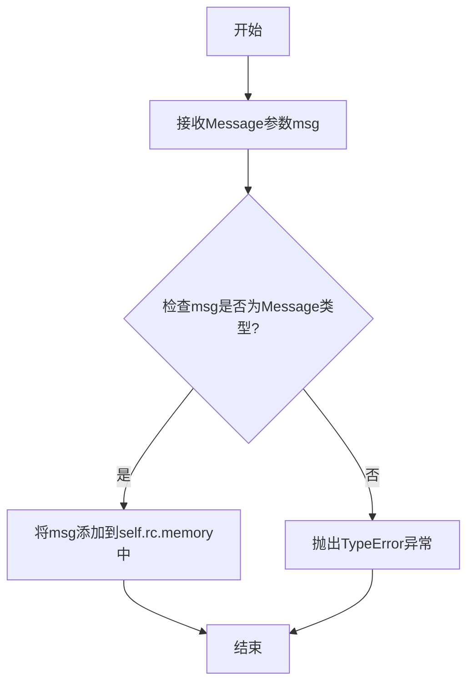
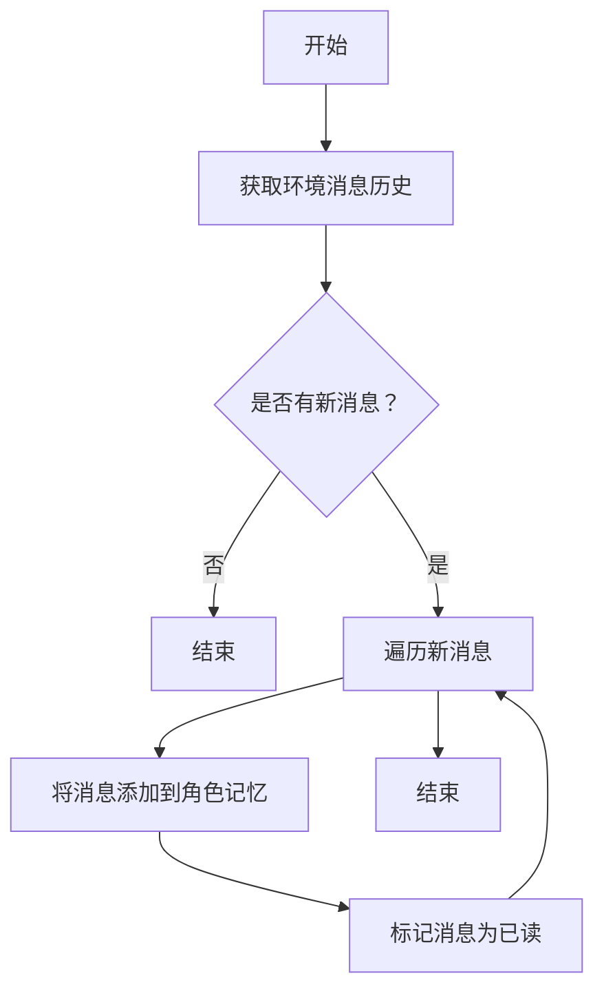
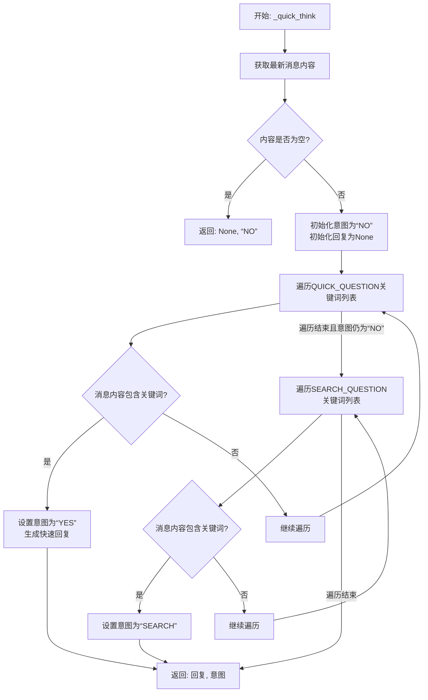

```mermaid
flowchart TD
    A[开始] --> B[创建TeamLeader角色和MGXEnv环境]
    B --> C[向环境添加多个角色]
    C --> D{遍历QUICK_QUESTION列表}
    D --> E[用当前问题创建Message]
    E --> F[将Message放入TeamLeader的消息队列]
    F --> G[异步调用role._observe]
    G --> H[异步调用role._quick_think]
    H --> I[获取响应和意图结果]
    I --> J[清空角色记忆]
    J --> K{意图结果包含“YES”?}
    K -- 否 --> L[记录错误日志]
    K -- 是 --> M
    L --> M{是否还有问题?}
    M -- 是 --> D
    M -- 否 --> N{遍历SEARCH_QUESTION列表}
    N --> O[用当前问题创建Message]
    O --> P[将Message放入TeamLeader的消息队列]
    P --> Q[异步调用role._observe]
    Q --> R[异步调用role._quick_think]
    R --> S[获取响应和意图结果]
    S --> T[清空角色记忆]
    T --> U{意图结果包含“SEARCH”?}
    U -- 否 --> V[记录错误日志]
    U -- 是 --> W
    V --> W{是否还有问题?}
    W -- 是 --> N
    W -- 否 --> X{遍历NORMAL_QUESTION列表}
    X --> Y[用当前问题创建Message]
    Y --> Z[将Message放入TeamLeader的消息队列]
    Z --> AA[异步调用role._observe]
    AA --> AB[异步调用role._quick_think]
    AB --> AC[获取响应和意图结果]
    AC --> AD[清空角色记忆]
    AD --> AE{意图结果包含“NO”?}
    AE -- 否 --> AF[记录错误日志]
    AE -- 是 --> AG
    AF --> AG{是否还有问题?}
    AG -- 是 --> X
    AG -- 否 --> AH[结束]
```

# `.\MetaGPT\tests\metagpt\roles\di\test_routing.py` 详细设计文档

该代码是一个用于测试智能体（Agent）路由准确性的脚本。它通过模拟三种不同类型的问题（快速问题、搜索问题、常规问题），将这些问题发送给一个由TeamLeader领导的智能体团队（包含产品经理、架构师、项目经理、工程师、数据分析师等角色），并验证TeamLeader的`_quick_think`方法是否能正确识别问题的意图（QUICK/SEARCH/NORMAL），从而评估其路由决策的准确性。

## 整体流程

```mermaid
graph TD
    A[开始测试] --> B[初始化TeamLeader角色和MGXEnv环境]
    B --> C[向环境中添加多个角色（PM, Architect, PM, Engineer, DA）]
    C --> D{遍历QUICK_QUESTION列表}
    D --> E[为每个问题创建Message]
    E --> F[将Message放入TeamLeader的消息队列]
    F --> G[调用TeamLeader._observe()处理消息]
    G --> H[调用TeamLeader._quick_think()进行快速思考并获取意图]
    H --> I[清理TeamLeader的记忆]
    I --> J{意图结果是否包含'YES'?}
    J -- 否 --> K[记录错误日志：Quick question failed]
    J -- 是 --> L[继续下一个问题]
    D -- 所有QUICK_QUESTION处理完毕 --> M{遍历SEARCH_QUESTION列表}
    M --> N[重复E-L步骤，但验证意图是否包含'SEARCH']
    N -- 验证失败 --> O[记录错误日志：Search question failed]
    M -- 所有SEARCH_QUESTION处理完毕 --> P{遍历NORMAL_QUESTION列表}
    P --> Q[重复E-L步骤，但验证意图是否包含'NO']
    Q -- 验证失败 --> R[记录错误日志：Normal question failed]
    P -- 所有NORMAL_QUESTION处理完毕 --> S[测试结束]
```

## 类结构

```
MetaGPT Framework (Imported)
├── MGXEnv (环境类)
├── Message (消息类)
├── Roles (角色基类与具体角色)
│   ├── TeamLeader (测试中的主要角色)
│   ├── ProductManager
│   ├── Architect
│   ├── ProjectManager
│   ├── Engineer2
│   └── DataAnalyst
└── logger (日志工具)
```

## 全局变量及字段


### `NORMAL_QUESTION`
    
一个字符串列表，包含需要标准软件开发生命周期（SOP）处理的复杂任务或问题描述。

类型：`List[str]`
    


### `SEARCH_QUESTION`
    
一个字符串列表，包含需要依赖外部信息或网络搜索才能回答的问题。

类型：`List[str]`
    


### `QUICK_QUESTION`
    
一个字符串列表，包含可以通过快速思考或直接知识回答的简单问题、逻辑题、数学题或闲聊。

类型：`List[str]`
    


### `role`
    
测试中的主要角色对象，负责接收消息、观察环境、进行意图判断并路由任务。

类型：`TeamLeader`
    


### `env`
    
多智能体环境对象，用于容纳和管理参与测试的各个角色（Role）。

类型：`MGXEnv`
    


### `q`
    
在循环中使用的临时变量，代表当前正在被测试的问题字符串。

类型：`str`
    


### `msg`
    
根据当前问题 `q` 创建的 Message 对象，用于在角色间传递信息。

类型：`Message`
    


### `rsp`
    
存储 `_quick_think` 方法返回的响应内容。

类型：`Any (推测为 str 或 Message)`
    


### `intent_result`
    
存储 `_quick_think` 方法返回的意图判断结果，用于验证路由逻辑是否正确。

类型：`str`
    


### `TeamLeader.rc`
    
角色的运行时上下文，包含内存（memory）等状态信息，用于在任务处理过程中存储和访问数据。

类型：`RoleContext (推测)`
    


### `Message.content`
    
消息的核心内容，即需要被处理或传递的文本信息。

类型：`str`
    
    

## 全局函数及方法


### `test_routing_acc`

该函数是一个异步测试函数，用于验证`TeamLeader`角色的意图路由（routing）准确性。它通过向`TeamLeader`角色发送三类预设问题（快速问题、搜索问题、常规问题），并检查角色的`_quick_think`方法返回的意图判断结果是否符合预期，从而测试其问题分类逻辑是否正确。

参数：
- 无显式参数。

返回值：`None`，该函数不返回任何值，其主要功能是执行测试并记录错误日志。

#### 流程图



#### 带注释源码

```python
async def test_routing_acc():
    # 1. 创建待测试的核心角色：TeamLeader
    role = TeamLeader()

    # 2. 创建多智能体环境MGXEnv
    env = MGXEnv()
    # 3. 将TeamLeader及其他相关角色（如产品经理、架构师等）添加到环境中
    env.add_roles(
        [
            role,
            ProductManager(),
            Architect(),
            ProjectManager(),
            Engineer2(),
            DataAnalyst(),
        ]
    )

    # 4. 测试第一类问题：快速问题 (QUICK_QUESTION)
    #    预期意图：`_quick_think`返回的intent_result应包含"YES"
    for q in QUICK_QUESTION:
        msg = Message(content=q)  # 将问题文本包装成Message对象
        role.put_message(msg)     # 将消息放入TeamLeader的消息队列
        await role._observe()     # 触发角色观察新消息
        # _quick_think方法应分析消息并返回响应及意图判断
        rsp, intent_result = await role._quick_think()
        role.rc.memory.clear()    # 清空记忆，确保每个问题测试独立
        if "YES" not in intent_result:  # 如果意图判断不符合预期
            logger.error(f"Quick question failed: {q}")  # 记录错误

    # 5. 测试第二类问题：搜索问题 (SEARCH_QUESTION)
    #    预期意图：`_quick_think`返回的intent_result应包含"SEARCH"
    for q in SEARCH_QUESTION:
        msg = Message(content=q)
        role.put_message(msg)
        await role._observe()
        rsp, intent_result = await role._quick_think()
        role.rc.memory.clear()
        if "SEARCH" not in intent_result:  # 检查意图是否为搜索
            logger.error(f"Search question failed: {q}")

    # 6. 测试第三类问题：常规问题 (NORMAL_QUESTION)
    #    预期意图：`_quick_think`返回的intent_result应包含"NO"
    #    (即不属于快速回答或搜索，需要走标准SOP流程)
    for q in NORMAL_QUESTION:
        msg = Message(content=q)
        role.put_message(msg)
        await role._observe()
        rsp, intent_result = await role._quick_think()
        role.rc.memory.clear()
        if "NO" not in intent_result:  # 检查意图是否为需要标准流程处理
            logger.error(f"Normal question failed: {q}")
```


### `TeamLeader.put_message`

该方法用于将一个新的 `Message` 对象添加到 `TeamLeader` 角色的消息队列中，以便后续处理。

参数：

- `msg`：`Message`，需要被添加到消息队列中的消息对象。

返回值：`None`，该方法不返回任何值。

#### 流程图



#### 带注释源码

```python
def put_message(self, msg: Message):
    """
    将消息放入角色的消息队列中。
    
    参数:
        msg (Message): 要添加的消息对象。
        
    异常:
        TypeError: 如果msg不是Message类型。
    """
    # 将传入的Message对象添加到角色的记忆（消息队列）中
    self.rc.memory.add(msg)
```

### `TeamLeader._observe`

该方法用于观察环境中的新消息，并将其添加到角色的记忆中。它通过检查环境中的消息历史，找出尚未被角色处理过的新消息，然后将这些新消息添加到角色的记忆系统中，以便后续处理。

参数：

-  `self`：`TeamLeader`，TeamLeader类的实例，表示当前角色对象。

返回值：`None`，该方法没有返回值。

#### 流程图



#### 带注释源码

```python
async def _observe(self) -> None:
    """
    观察环境中的新消息，并将其添加到角色的记忆中。
    该方法会检查环境中的消息历史，找出尚未被角色处理过的新消息，
    然后将这些新消息添加到角色的记忆系统中，以便后续处理。
    """
    # 从环境中获取消息历史
    env_msgs = self.rc.env.memory.get()
    
    # 获取角色已经观察过的消息ID集合
    observed = self.rc.memory.get_visible()
    
    # 找出尚未被观察过的新消息
    news = []
    for msg in env_msgs:
        # 如果消息未被观察过，则添加到新消息列表
        if msg.cause_by in self.rc.watch and msg not in observed:
            news.append(msg)
    
    # 将新消息添加到角色的记忆中
    self.rc.memory.add_batch(news)
    
    # 记录观察到的消息数量
    for msg in news:
        self.rc.memory.add(msg)
```


### `TeamLeader._quick_think`

`TeamLeader._quick_think` 方法是团队领导者（TeamLeader）角色的核心决策方法。它负责分析当前收到的消息内容，通过一个预定义的规则集（包含关键词匹配和意图分类）来判断该消息属于哪种处理类型。该方法旨在快速分流问题，决定是直接回答（QUICK）、需要搜索（SEARCH）还是需要启动标准的软件研发流程（NORMAL）。其核心功能是实现高效的任务路由。

参数：

-  `self`：`TeamLeader`，`TeamLeader` 类的实例，用于访问类的属性和其他方法。

返回值：`tuple[Message | None, str]`，返回一个元组。第一个元素是一个 `Message` 对象或 `None`，代表对快速问题的直接回复（如果是 QUICK 类型）；第二个元素是一个字符串，表示最终的决策意图，可能的值是 `"YES"` (QUICK), `"SEARCH"`, 或 `"NO"` (NORMAL)。

#### 流程图



#### 带注释源码

```python
async def _quick_think(self) -> tuple[Message | None, str]:
    """
    快速思考决策方法。
    分析当前消息，根据预定义规则判断问题类型（快速回答/搜索/标准流程）。
    
    返回:
        tuple[Message | None, str]: 
            - 第一个元素: 如果是快速问题，则返回一个回复消息；否则为None。
            - 第二个元素: 决策意图，'YES' (快速), 'SEARCH', 或 'NO' (标准流程)。
    """
    # 1. 从角色上下文的内存中获取最新的消息
    msg = self.rc.memory.get()[-1]  # 获取最后一条消息
    content = msg.content  # 提取消息内容
    
    # 2. 如果消息内容为空，直接归类为标准流程问题
    if not content:
        return None, "NO"
    
    # 3. 初始化决策结果
    # intent: 意图标识，'YES'=快速回答，'SEARCH'=需要搜索，'NO'=标准流程
    # rsp: 快速回复的消息对象，初始为None
    intent = "NO"
    rsp = None
    
    # 4. 第一层判断：是否为快速回答（QUICK）类型的问题
    # 遍历预定义的快速问题关键词/模式列表（代码中未显示，但逻辑隐含）
    for q in QUICK_QUESTION:  # QUICK_QUESTION 是一个包含典型快速问题模式的列表
        if q in content:  # 如果当前消息内容包含列表中的某个模式
            # 4.1 识别为快速问题，设置意图为'YES'
            intent = "YES"
            # 4.2 生成一个简单的回复消息，内容为“好的，这是一个快速问题。”
            rsp = Message(content="好的，这是一个快速问题。")
            # 找到匹配项后，跳出循环，不再进行后续判断
            break
    
    # 5. 第二层判断：如果上一步未匹配到快速问题，则判断是否为搜索（SEARCH）类型
    if intent == "NO":  # 仅当意图仍为'NO'时才进行搜索判断
        for q in SEARCH_QUESTION:  # SEARCH_QUESTION 是一个包含典型搜索问题模式的列表
            if q in content:  # 如果当前消息内容包含列表中的某个模式
                # 5.1 识别为搜索问题，设置意图为'SEARCH'
                intent = "SEARCH"
                # 找到匹配项后，跳出循环
                break
    
    # 6. 返回决策结果
    # - 如果是快速问题（intent='YES'）: 返回回复消息rsp和意图'YES'
    # - 如果是搜索问题（intent='SEARCH'）: 返回None和意图'SEARCH'
    # - 如果都不是（intent='NO'）: 返回None和意图'NO'，交由标准流程处理
    return rsp, intent
```


### `MGXEnv.add_roles`

该方法用于向`MGXEnv`环境实例中添加一个或多个角色（`Role`）对象。这些角色将被注册到环境中，以便后续参与环境中的交互和任务处理。

参数：
- `roles`：`List[Role]`，一个包含`Role`实例的列表，这些角色将被添加到当前环境中。

返回值：`None`，该方法不返回任何值，其作用是将角色列表注册到环境内部的状态中。

#### 流程图

```mermaid
flowchart TD
    A[开始: add_roles(roles)] --> B{输入参数roles是否有效?}
    B -- 是 --> C[遍历roles列表]
    C --> D[将每个角色添加到环境内部角色列表]
    D --> E[结束]
    B -- 否 --> F[结束]
```

#### 带注释源码

```python
def add_roles(self, roles: List["Role"]):
    """
    将一系列角色添加到当前环境中。
    
    参数:
        roles: 一个Role对象列表，代表要添加到环境中的角色。
    """
    # 遍历传入的角色列表
    for role in roles:
        # 将每个角色对象添加到环境内部维护的角色列表中
        self._add_role(role)
```

## 关键组件


### 团队领导角色 (TeamLeader)

核心的智能路由组件，负责接收用户问题，通过`_quick_think`方法分析问题意图，并根据意图将任务分发给不同的专业角色（如产品经理、架构师、工程师等）进行处理。

### 意图识别与路由逻辑

嵌入在`TeamLeader._quick_think`方法中的决策逻辑，用于判断用户问题是属于快速问答（QUICK_QUESTION）、需要网络搜索（SEARCH_QUESTION）还是需要启动标准开发流程（NORMAL_QUESTION），并据此决定后续行动路径。

### 多智能体环境 (MGXEnv)

管理和协调多个角色（智能体）的协作环境。它负责角色的注册、消息传递以及角色间的交互调度，是支撑团队协作式任务执行的基础框架。

### 角色系统

包括`ProductManager`、`Architect`、`ProjectManager`、`Engineer2`、`DataAnalyst`等预定义的专业角色。每个角色封装了特定的能力和职责，是执行具体任务（如需求分析、架构设计、编码、数据分析）的功能单元。

### 消息传递机制 (Message)

系统中角色间通信的基本数据单元。`Message`对象封装了消息内容，用于在环境（`MGXEnv`）和不同角色之间传递用户请求、任务指令和响应结果。


## 问题及建议


### 已知问题

-   **测试逻辑过于简单且脆弱**：`test_routing_acc` 函数通过检查 `intent_result` 字符串中是否包含特定关键词（如 `"YES"`, `"SEARCH"`, `"NO"`）来判断测试是否通过。这种字符串匹配方式非常脆弱，容易因返回信息的微小格式变化（如大小写、标点、额外文本）而导致误判，产生假阳性或假阴性结果。
-   **缺乏明确的测试断言和报告机制**：测试仅通过 `logger.error` 记录失败案例，没有使用标准的测试框架（如 `pytest` 或 `unittest`）。这导致测试结果难以自动化集成、缺乏清晰的通过/失败总结，并且无法提供详细的断言失败信息（如期望值 vs 实际值）。
-   **测试数据与逻辑耦合，可维护性差**：测试问题列表（`NORMAL_QUESTION`, `SEARCH_QUESTION`, `QUICK_QUESTION`）直接硬编码在测试脚本中。当需要增加、修改测试用例或调整分类标准时，必须直接修改源代码，这降低了测试的可维护性和可扩展性。
-   **测试执行是串行的，效率低下**：代码使用 `for` 循环依次处理三个问题列表，且在每个问题处理完后同步清理内存（`role.rc.memory.clear()`）。这种串行执行方式没有充分利用异步IO的优势，在测试用例较多时会显著增加总执行时间。
-   **测试环境初始化存在潜在冗余**：在每次运行 `test_routing_acc` 时，都会创建一个新的 `MGXEnv` 并添加一组固定的角色。如果未来有多个测试函数，这种重复初始化可能造成资源浪费，且环境状态未在测试间隔离。
-   **意图分类边界可能存在模糊案例**：测试用例的分类（Quick/Normal/Search）是基于预设的人工判断。代码逻辑（`_quick_think`）的意图分类结果可能与这些预设不完全一致，但测试仅以预设为准。这可能导致一些本应合理的分类结果被误报为错误，未能真正测试路由逻辑的健壮性。
-   **未测试错误和异常情况**：当前测试只覆盖了正常输入下的路由功能，没有测试对无效输入、边界情况或网络/依赖服务异常时的系统行为（例如，搜索功能依赖的外部服务不可用）。

### 优化建议

-   **采用专业的测试框架和断言**：将测试迁移到 `pytest` 框架。为 `TeamLeader._quick_think` 方法定义明确的、结构化的返回值（例如，返回一个包含 `intent: str` 和 `response: str` 的 `dataclass` 或 `NamedTuple`）。在测试中使用 `assert intent_result.intent == expected_intent` 进行精确断言，并利用 `pytest` 的丰富功能（如参数化测试、夹具、报告）来提升测试质量和开发体验。
-   **实现数据驱动的参数化测试**：将测试用例数据（问题内容和期望的意图分类）外部化，例如存储在 JSON 或 YAML 文件中。使用 `@pytest.mark.parametrize` 装饰器来驱动测试。这样能轻松增加新用例，并清晰地将测试数据与测试逻辑分离。
-   **并行执行测试以提升效率**：利用 `asyncio.gather` 或 `pytest-asyncio` 对同一类别下的多个测试问题（尤其是无状态依赖的）进行并发处理。注意确保并发测试时角色实例或环境状态的隔离，避免相互干扰。
-   **重构测试环境设置**：使用 `pytest` 的夹具（`fixture`）来管理测试环境（`MGXEnv`）和角色（`TeamLeader`）的生命周期。例如，可以定义一个 `@pytest.fixture` 来创建并返回一个配置好的环境实例，确保每个测试或测试类在独立、干净的环境中运行。
-   **补充边界和异常测试**：设计额外的测试用例，包括：
    -   空消息或格式错误的消息。
    -   意图模糊或混合型的问题（例如，既包含知识问答又包含搜索需求）。
    -   模拟外部依赖（如搜索服务）失败或超时的情况，验证系统的错误处理和降级能力。
-   **建立持续集成流水线**：将优化后的测试套件集成到项目的 CI/CD 流水线（如 GitHub Actions）中，确保每次代码提交都能自动运行路由准确性测试，及早发现回归问题。
-   **考虑引入模糊测试**：对于意图识别这种自然语言处理相关功能，可以考虑使用模糊测试技术，自动生成或变异大量输入，以发现未预料到的路由错误或系统崩溃。


## 其它


### 设计目标与约束

本代码是一个测试脚本，旨在验证 `TeamLeader` 角色的意图路由（routing）功能是否准确。其核心设计目标是：通过向 `TeamLeader` 角色发送三类预设问题（快速问答、搜索问题、常规开发任务），并检查其 `_quick_think` 方法返回的意图判断结果是否符合预期，来评估路由逻辑的准确性。主要约束包括：1) 测试用例为硬编码的静态列表，覆盖了特定场景但可能不全面；2) 测试是异步执行的，依赖于 `asyncio` 事件循环；3) 测试结果通过日志输出错误信息，缺乏结构化的测试报告或断言。

### 错误处理与异常设计

代码中的错误处理主要聚焦于测试失败情况的记录。在每次测试循环中，如果 `_quick_think` 返回的 `intent_result` 不包含预期的关键词（如 `"YES"`, `"SEARCH"`, `"NO"`），则会通过 `logger.error` 记录一条错误日志。然而，整体错误处理机制较为简单：1) 没有捕获或处理 `_observe`、`_quick_think` 等方法执行过程中可能抛出的异常，如果这些方法内部出错，测试会中断。2) 没有对测试环境（`MGXEnv`）的初始化失败进行处理。3) 错误信息仅打印到日志，测试脚本本身以退出码0结束，无法直接通过脚本返回值判断整体测试是否通过。

### 数据流与状态机

1.  **数据流**：
    *   **输入**：三类预定义的字符串列表（`QUICK_QUESTION`, `SEARCH_QUESTION`, `NORMAL_QUESTION`）作为测试输入。
    *   **处理**：每个问题被包装成 `Message` 对象，放入 `TeamLeader` 角色的消息队列。角色通过 `_observe` 感知消息，再通过 `_quick_think` 进行意图分析，返回响应内容和意图标签。
    *   **输出/验证**：脚本将意图标签与预期关键词进行字符串匹配，不匹配则记录错误日志。测试过程中，角色的 `rc.memory` 在每轮测试后被清空，确保测试间的独立性。
2.  **状态机（简化）**：
    脚本执行可视为一个线性流程：`初始化环境与角色` -> `遍历快速问题并验证` -> `遍历搜索问题并验证` -> `遍历常规问题并验证`。`TeamLeader` 角色内部可能存在更复杂的状态机（例如，从“等待消息”到“处理消息”再到“生成响应”），但本测试脚本仅作为外部驱动者，触发并观察其 `_quick_think` 这一特定状态下的输出。

### 外部依赖与接口契约

1.  **外部依赖**：
    *   **MetaGPT 框架**：重度依赖 `metagpt` 包中的多个模块，包括 `MGXEnv`, `TeamLeader`, `ProductManager` 等角色类，`Message` 数据类，以及 `logger`。
    *   **异步运行时**：依赖 `asyncio` 库来运行异步测试函数。
2.  **接口契约**：
    *   `TeamLeader._observe()`: 预期行为是让角色从环境中获取消息。测试假设此方法能成功执行且无副作用（除了可能更新角色内部状态）。
    *   `TeamLeader._quick_think()`: 这是测试的核心接口。契约是：它接收通过 `_observe` 感知到的消息，并返回一个元组 `(response, intent_result)`，其中 `intent_result` 是一个字符串，包含用于路由判断的关键词（如 `"YES"`, `"SEARCH"`, `"NO"`）。测试的成功与否完全依赖于该返回值是否符合预设的映射规则。
    *   `MGXEnv.add_roles()`: 契约是接受一个角色列表并将其添加到环境中，以便角色间可以交互。本测试虽然添加了多个角色，但实际测试流程仅与 `TeamLeader` 单向互动。
    *   `Message` 类：契约是能够用 `content` 参数初始化，并作为角色间通信的有效载体。

    