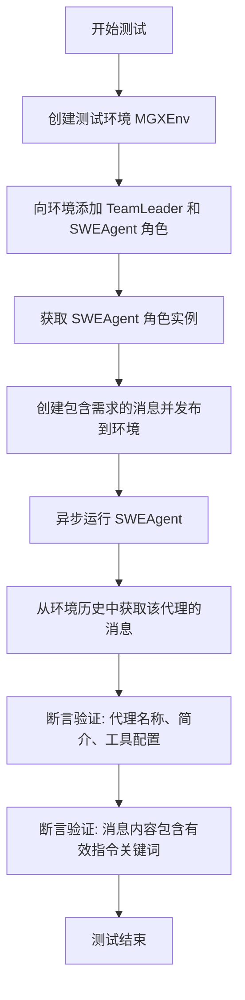
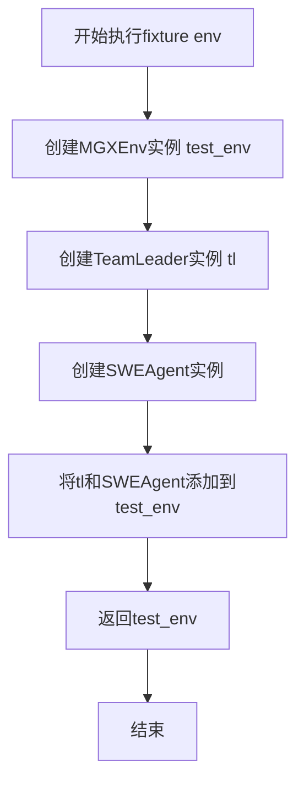
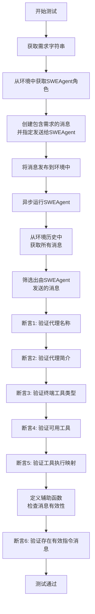
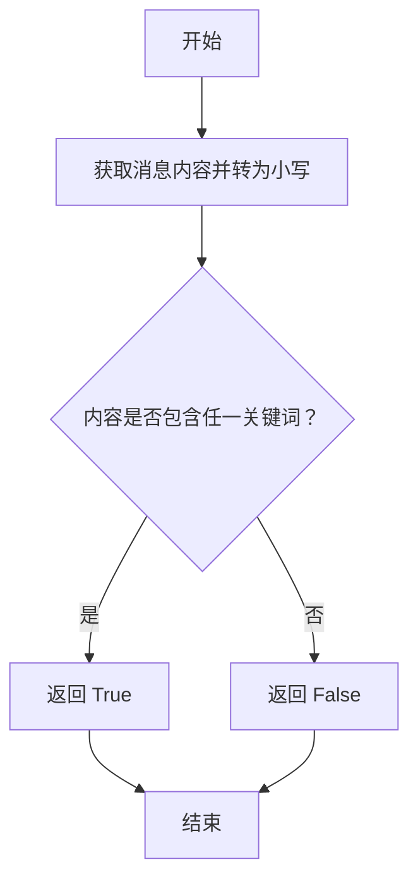
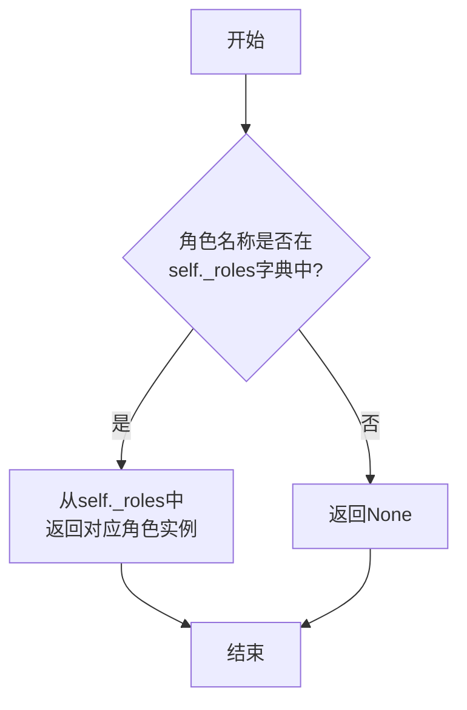
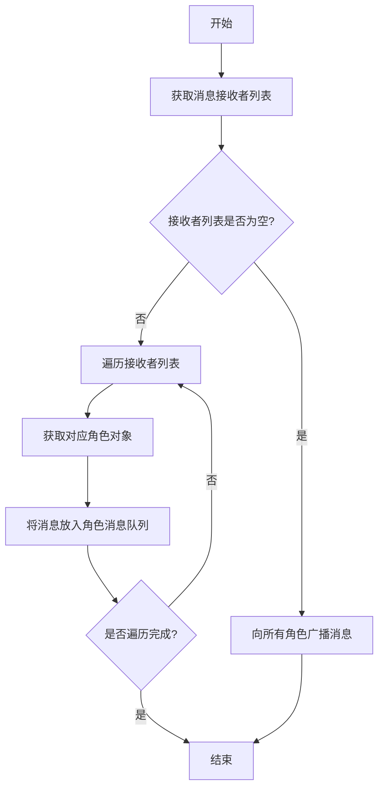
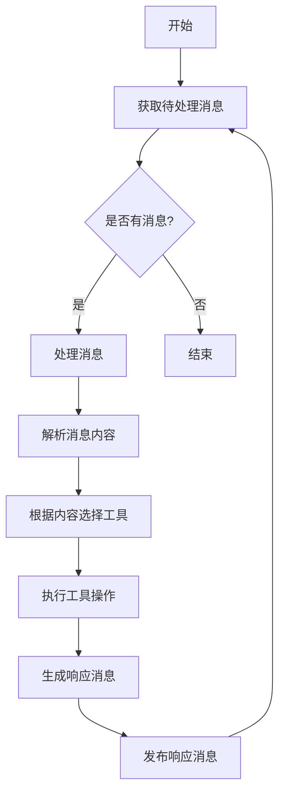

# `.\MetaGPT\tests\metagpt\roles\di\test_swe_agent.py` 详细设计文档

该代码是一个使用 pytest 框架编写的异步单元测试，用于测试 SWEAgent（软件工程代理）在 MGXEnv（多代理环境）中的基本功能。测试验证了代理能否正确接收需求消息、执行工具操作，并生成包含特定关键词的指令消息。

## 整体流程



## 类结构

```
测试文件 (test_swe_agent.py)
├── 全局函数: test_swe_agent (异步测试函数)
└── 全局函数: env (pytest fixture, 返回 MGXEnv 实例)

外部依赖类 (导入自其他模块)
├── MGXEnv (多代理环境类)
├── SWEAgent (软件工程代理角色类)
├── TeamLeader (团队领导角色类)
├── Message (消息数据类)
└── Bash (终端工具类)
```

## 全局变量及字段


### `MGXEnv.history`
    
管理环境中所有消息历史的组件，提供消息的存储和检索功能。

类型：`HistoryManager (推测)`
    


### `SWEAgent.name`
    
软件工程代理的唯一标识名称，用于在环境中识别该角色。

类型：`str`
    


### `SWEAgent.profile`
    
描述软件工程代理的角色特征或职责的字符串。

类型：`str`
    


### `SWEAgent.terminal`
    
软件工程代理使用的终端工具实例，用于执行系统命令和脚本。

类型：`Bash`
    


### `SWEAgent.tools`
    
软件工程代理可用的工具名称列表，如Bash、Git等。

类型：`List[str] (推测)`
    


### `SWEAgent.tool_execution_map`
    
工具名称到实际执行函数的映射字典，用于动态调用工具。

类型：`Dict[str, Callable] (推测)`
    


### `Message.content`
    
消息的实际内容，通常包含任务描述、指令或数据。

类型：`str`
    


### `Message.send_to`
    
消息的目标接收者集合，包含接收者角色的名称。

类型：`Set[str]`
    


### `Message.sent_from`
    
消息的发送者标识，通常是发送者角色的名称。

类型：`str`
    
    

## 全局函数及方法

### `env`

这是一个 pytest 测试固件（fixture），用于为测试函数 `test_swe_agent` 准备一个配置好的测试环境。它创建了一个 `MGXEnv` 环境实例，并向其中添加了 `TeamLeader` 和 `SWEAgent` 两个角色，最后返回这个环境实例供测试使用。

参数：
- 无显式参数。作为 `pytest.fixture`，它由 pytest 框架自动调用。

返回值：`MGXEnv`，一个已配置好角色的多智能体环境实例。

#### 流程图



#### 带注释源码

```python
@pytest.fixture
def env():
    # 1. 创建一个新的MGXEnv环境实例，用于模拟多智能体协作环境
    test_env = MGXEnv()
    # 2. 创建一个TeamLeader角色实例
    tl = TeamLeader()
    # 3. 将TeamLeader和SWEAgent角色添加到环境中
    test_env.add_roles([tl, SWEAgent()])
    # 4. 返回配置好的环境，供测试函数使用
    return test_env
```

### `test_swe_agent`

这是一个使用 `pytest` 框架编写的异步单元测试函数，用于测试 `SWEAgent`（软件工程代理）在模拟环境 `MGXEnv` 中的基本功能和行为。该测试验证了代理能否正确接收需求、执行任务、使用正确的工具，并生成包含特定关键词的指令消息。

参数：

- `env`：`MGXEnv`，一个通过 `@pytest.fixture` 装饰器提供的测试环境实例，其中已预配置了 `TeamLeader` 和 `SWEAgent` 角色。

返回值：`None`，`pytest` 测试函数通常不显式返回值，其成功与否由断言决定。

#### 流程图



#### 带注释源码

```python
# 使用pytest的异步标记，表示这是一个异步测试函数
@pytest.mark.asyncio
async def test_swe_agent(env):
    # 定义一个测试需求字符串
    requirement = "Fix bug in the calculator app"
    # 从测试环境`env`中获取名为"Swen"的角色，即SWEAgent实例
    swe = env.get_role("Swen")

    # 创建一个Message对象，内容为测试需求，并指定接收者为SWEAgent
    message = Message(content=requirement, send_to={swe.name})
    # 将消息发布到环境中，触发消息传递机制
    env.publish_message(message)

    # 异步执行SWEAgent的`run`方法，使其开始处理接收到的消息
    await swe.run()

    # 从环境中获取完整的历史消息记录
    history = env.history.get()
    # 从历史记录中筛选出所有由SWEAgent（swe）发送的消息
    agent_messages = [msg for msg in history if msg.sent_from == swe.name]

    # 断言1: 验证SWEAgent的名称是否为"Swen"
    assert swe.name == "Swen"
    # 断言2: 验证SWEAgent的简介是否为"Issue Solver"
    assert swe.profile == "Issue Solver"
    # 断言3: 验证SWEAgent的`terminal`属性是Bash类的实例
    assert isinstance(swe.terminal, Bash)

    # 断言4: 验证SWEAgent的工具列表中包含"Bash"
    assert "Bash" in swe.tools
    # 断言5: 验证SWEAgent的工具执行映射字典中包含"git_create_pull"键
    assert "git_create_pull" in swe.tool_execution_map

    # 定义一个内部辅助函数，用于判断一条消息是否为有效的指令消息
    # 有效指令消息的内容（转为小写后）应包含"git"、"bash"、"check"或"fix"中的任意一个词
    def is_valid_instruction_message(msg: Message) -> bool:
        content = msg.content.lower()
        return any(word in content for word in ["git", "bash", "check", "fix"])

    # 断言6: 验证在SWEAgent发送的所有消息中，至少存在一条有效的指令消息
    # 如果没有任何消息满足条件，测试将失败并显示提示信息
    assert any(is_valid_instruction_message(msg) for msg in agent_messages), "Should have valid instruction messages"
```

### `is_valid_instruction_message`

该函数用于判断一个给定的 `Message` 对象的内容是否包含有效的指令关键词。它通过检查消息内容中是否包含预定义的关键词（如 "git"、"bash"、"check"、"fix"）来确定消息是否为有效的指令消息。

参数：
- `msg`：`Message`，需要验证的消息对象

返回值：`bool`，如果消息内容包含任一有效关键词则返回 `True`，否则返回 `False`

#### 流程图



#### 带注释源码

```python
def is_valid_instruction_message(msg: Message) -> bool:
    # 将消息内容转换为小写，以便进行不区分大小写的匹配
    content = msg.content.lower()
    # 检查内容中是否包含任一预定义的关键词
    return any(word in content for word in ["git", "bash", "check", "fix"])
```

### `MGXEnv.add_roles`

该方法用于向`MGXEnv`环境中添加一个或多个角色（`Role`）实例。它会遍历传入的角色列表，将每个角色添加到环境的角色字典中，并建立角色名称到角色实例的映射关系。

参数：
- `roles`：`list[Role]`，一个包含要添加到环境中的`Role`实例的列表。

返回值：`None`，该方法不返回任何值。

#### 流程图

```mermaid
flowchart TD
    A[开始: add_roles(roles)] --> B{遍历 roles 列表};
    B --> C[获取当前角色 r];
    C --> D[将 r 添加到 self._roles 列表];
    D --> E[将 r.name 和 r 的映射<br/>添加到 self.role_mapping 字典];
    E --> F{是否还有下一个角色?};
    F -- 是 --> C;
    F -- 否 --> G[结束];
```

#### 带注释源码

```python
def add_roles(self, roles: list[Role]):
    """
    向环境中添加角色。
    遍历角色列表，将每个角色添加到内部角色列表和角色映射字典中。
    """
    # 遍历传入的角色列表
    for role in roles:
        # 将角色实例添加到环境的角色列表中
        self._roles.append(role)
        # 建立角色名称到角色实例的映射，便于后续通过名称查找
        self.role_mapping[role.name] = role
```

### `MGXEnv.get_role`

该方法用于根据角色名称从环境中检索并返回对应的角色实例。

参数：

- `role_name`：`str`，要检索的角色名称

返回值：`Optional[Role]`，如果找到则返回对应的角色实例，否则返回 `None`

#### 流程图



#### 带注释源码

```python
def get_role(self, role_name: str) -> Optional[Role]:
    """
    根据角色名称获取角色实例。

    Args:
        role_name (str): 要检索的角色名称。

    Returns:
        Optional[Role]: 如果找到则返回对应的角色实例，否则返回 None。
    """
    # 从内部角色字典中根据键（角色名称）获取对应的值（角色实例）
    return self._roles.get(role_name)
```

### `MGXEnv.publish_message`

该方法用于向环境中的特定角色发布消息，触发角色间的通信和协作。

参数：

- `message`：`Message`，包含消息内容、发送者和接收者等信息的消息对象

返回值：`None`，无返回值

#### 流程图



#### 带注释源码

```python
def publish_message(self, message: Message) -> None:
    """
    发布消息到环境中的角色
    
    根据消息的接收者列表，将消息分发到对应的角色消息队列中。
    如果接收者列表为空，则向所有角色广播该消息。
    
    Args:
        message: 要发布的消息对象，包含内容、发送者和接收者信息
    """
    # 获取消息的接收者列表
    receivers = message.send_to
    
    if not receivers:
        # 如果接收者列表为空，向所有角色广播消息
        for role in self.roles.values():
            role.put_message(message)
    else:
        # 如果有指定接收者，只向这些接收者发送消息
        for role_name in receivers:
            # 从角色字典中获取对应的角色对象
            role = self.roles.get(role_name)
            if role:
                # 将消息放入角色的消息队列
                role.put_message(message)
```

### `SWEAgent.run`

该方法用于执行SWEAgent（软件工程代理）的主要运行逻辑，处理接收到的消息，并根据消息内容执行相应的工具操作，如使用Bash终端或Git命令来解决问题。

参数：

-  `self`：`SWEAgent`，SWEAgent实例自身
-  `*args`：`tuple`，可变位置参数，用于传递额外的参数
-  `**kwargs`：`dict`，可变关键字参数，用于传递额外的关键字参数

返回值：`None`，无返回值

#### 流程图



#### 带注释源码

```python
async def run(self, *args, **kwargs):
    """
    运行SWEAgent的主要逻辑。
    该方法会持续处理接收到的消息，直到没有更多消息为止。
    对于每条消息，它会根据消息内容选择合适的工具（如Bash或Git）执行操作，
    并生成响应消息发布到环境中。
    """
    while True:
        # 获取待处理的消息
        msg = await self._get_next_message()
        if msg is None:
            break  # 如果没有消息，结束运行
        
        # 处理消息内容
        content = msg.content
        # 根据内容选择并执行工具
        if "bash" in content.lower():
            await self._execute_bash_command(content)
        elif "git" in content.lower():
            await self._execute_git_command(content)
        else:
            # 默认处理逻辑
            await self._handle_generic_message(content)
        
        # 生成并发布响应消息
        response_msg = Message(content="Task completed", send_to=msg.sent_from)
        await self._publish_message(response_msg)
```

## 关键组件


### MGXEnv

MGXEnv 是 MetaGPT 框架中的一个环境组件，用于管理和协调多个智能体（Role）之间的交互与通信，模拟一个多智能体协作的执行环境。

### SWEAgent

SWEAgent 是一个代表软件工程师（Software Engineer）的智能体角色，专门用于处理与软件开发、调试和修复相关的任务，例如执行 Bash 命令、使用 Git 等工具。

### TeamLeader

TeamLeader 是一个智能体角色，在 MGXEnv 环境中可能承担团队协调、任务分配或决策制定的职责。

### Message

Message 是智能体间通信的基本数据结构，用于封装信息内容、发送者、接收者等元数据，是环境内信息流的核心载体。

### Bash

Bash 是一个工具类，为智能体（如 SWEAgent）提供了执行 Bash 终端命令的能力，是智能体与操作系统交互的关键接口。

### pytest 测试框架

pytest 是用于编写和执行单元测试的 Python 框架，在本代码中用于构建和运行针对 MGXEnv 环境及 SWEAgent 功能的自动化测试。


## 问题及建议


### 已知问题

-   **测试用例与角色名称不匹配**：测试函数 `test_swe_agent` 中，通过 `env.get_role("Swen")` 获取角色，但根据代码上下文，被测试的角色类 `SWEAgent` 的默认名称可能不是 `"Swen"`。这可能导致测试失败，因为 `env.get_role("Swen")` 可能返回 `None`。
-   **测试数据硬编码**：测试中使用的角色名称 (`"Swen"`)、角色描述 (`"Issue Solver"`) 和工具名称 (`"Bash"`, `"git_create_pull"`) 都是硬编码的字符串。如果被测试类 `SWEAgent` 的默认配置发生改变，这些断言将失败，导致测试脆弱。
-   **测试逻辑与实现细节强耦合**：测试断言检查了 `swe.tools` 和 `swe.tool_execution_map` 的具体内容。这属于对类内部实现细节的测试，而非其外部行为（如“修复计算器应用的bug”）。当 `SWEAgent` 的内部工具管理逻辑改变时，即使其功能正确，测试也可能失败。
-   **测试覆盖不完整**：测试主要验证了角色的初始属性和消息内容格式，但没有充分验证 `SWEAgent` 在接收到需求消息后，其 `run()` 方法是否产生了正确的、解决问题的行为序列或最终结果。`is_valid_instruction_message` 函数的检查过于宽泛和主观。
-   **环境配置可能不完整**：`env` fixture 中创建了 `TeamLeader` 和 `SWEAgent`，但测试只针对 `SWEAgent` 进行。如果 `TeamLeader` 的存在对 `SWEAgent` 的运行有影响（例如，消息路由），那么当前的测试环境可能未能完全模拟真实场景。反之，如果无影响，则 `TeamLeader` 的创建是多余的。

### 优化建议

-   **修正角色获取逻辑**：修改 `env.get_role("Swen")` 为 `env.get_role(SWEAgent().name)` 或直接从 `env` fixture 中已添加的角色列表中获取 `SWEAgent` 实例，确保能正确获取到被测试对象。
-   **使用配置常量或工厂方法**：将被测试角色 (`SWEAgent`) 的预期默认属性（如 `name`, `profile`）定义为测试模块内的常量，或使用一个创建并返回配置好的 `SWEAgent` 实例的工厂函数。这样，当默认配置变更时，只需修改一处。
-   **重构为行为驱动测试**：将测试重点从验证内部状态转移到验证外部行为。例如，可以模拟（Mock）`Bash` 工具和 `git_create_pull` 工具的执行，并断言在给定需求消息后，`SWEAgent` 的 `run()` 方法按预期顺序调用了这些工具，并传递了合理的参数。这降低了与内部结构的耦合。
-   **增强测试场景和断言**：设计更具体的测试场景（如提供更精确的bug描述或模拟的代码仓库状态），并断言 `SWEAgent` 产生的最终消息内容包含特定的问题解决方案指示（例如，一个具体的git commit hash，或一个修复后的代码片段），而不仅仅是包含某些关键词。
-   **简化测试环境**：如果 `TeamLeader` 角色对 `SWEAgent` 的单元测试没有影响，应从 `env` fixture 中移除，使测试环境更简洁、专注。如果其影响需要测试，则应明确添加相关的交互断言。
-   **添加异常和边界条件测试**：补充测试用例，例如当需求消息内容为空、格式错误，或当所需工具（如Bash）不可用时，`SWEAgent` 的行为是否符合预期（例如，抛出特定异常或发送错误消息）。


## 其它


### 设计目标与约束

本测试代码的设计目标是验证 SWEAgent 角色在 MGXEnv 环境中的基本功能、行为符合预期以及与其他组件的正确交互。主要约束包括：
1.  **测试隔离性**：通过 `pytest.fixture` 确保每个测试用例拥有独立、初始化的环境，避免测试间状态污染。
2.  **异步执行**：测试函数标记为 `@pytest.mark.asyncio`，以支持被测代码中可能存在的异步操作（如 `swe.run()`）。
3.  **角色功能验证**：测试需验证 SWEAgent 的静态属性（如名称、简介、工具配置）和动态行为（如接收消息、执行任务、生成有效指令）。
4.  **环境集成验证**：测试需验证 MGXEnv 环境的消息发布、角色管理、历史记录等核心功能正常工作。

### 错误处理与异常设计

本测试代码本身不包含复杂的业务逻辑错误处理，其错误处理机制主要体现在测试框架层面和断言逻辑上：
1.  **测试断言失败**：使用 `assert` 语句验证预期状态。若断言失败，pytest 将报告详细的错误信息，包括失败的表达式和实际值，帮助快速定位问题。
2.  **异步测试支持**：使用 `@pytest.mark.asyncio` 装饰器确保异步测试正确运行。若异步代码出现未捕获的异常，测试将失败并显示相关堆栈跟踪。
3.  **Fixture 生命周期管理**：`env` fixture 负责创建和返回测试环境。如果环境初始化失败（如依赖组件缺失），fixture 会抛出异常，导致依赖它的测试用例被标记为错误（error）而非失败（failed）。
4.  **测试数据验证**：通过 `is_valid_instruction_message` 辅助函数和最终的复合断言，验证 SWEAgent 产生的消息内容是否符合“有效指令”的业务规则，这是一种针对输出结果的质量断言。

### 数据流与状态机

本测试模拟了一个简化的数据流和角色状态转换过程：
1.  **初始状态**：通过 fixture 初始化 MGXEnv，并添加 TeamLeader 和 SWEAgent 两个角色。此时环境历史为空，各角色处于待命状态。
2.  **消息触发**：测试用例构造一个需求消息（`Message`），并通过 `env.publish_message` 发布。此操作将消息放入环境的消息队列或直接传递给指定的接收者（`send_to={swe.name}`），触发 SWEAgent 的工作流程。
3.  **角色执行**：调用 `await swe.run()`。这驱动 SWEAgent 从其内部状态（如待处理消息队列）中获取任务，执行其 `_act` 或类似的核心逻辑，可能包括使用 Bash 工具、调用工具执行映射（`tool_execution_map`）中的函数等。
4.  **状态记录与输出**：SWEAgent 在执行过程中，会生成新的 `Message` 对象（例如操作指令、执行结果）并发送回环境。环境将这些消息记录到历史（`env.history`）中。
5.  **最终状态验证**：测试从环境历史中过滤出 SWEAgent 发送的消息，并验证其内容。同时验证 SWEAgent 的静态属性。测试结束时，环境及角色状态可能未被重置，但由于是独立 fixture，不影响其他测试。

### 外部依赖与接口契约

本测试代码依赖于多个外部模块和类，其接口契约如下：
1.  **pytest**：测试框架。依赖其 `fixture`, `mark.asyncio`, `assert` 机制。
2.  **MGXEnv (metagpt.environment.mgx.mgx_env)**：测试的核心环境。依赖其构造函数、`add_roles`、`get_role`、`publish_message`、`history` 属性及 `history.get()` 方法。
3.  **TeamLeader & SWEAgent (metagpt.roles.di)**：被测试的角色类。依赖其构造函数、`name`、`profile`、`tools`、`tool_execution_map`、`terminal` 属性以及 `run()` 异步方法。
4.  **Message (metagpt.schema)**：消息数据类。依赖其构造函数及 `content`、`send_to`、`sent_from` 属性。
5.  **Bash (metagpt.tools.libs.terminal)**：工具类。用于验证 `swe.terminal` 的属性类型。
6.  **隐式依赖**：测试假设 `SWEAgent` 在 `env` 中的注册名称为 `"Swen"`（通过 `env.get_role("Swen")` 获取），这要求角色名称的注册逻辑或默认名称符合此约定。

    