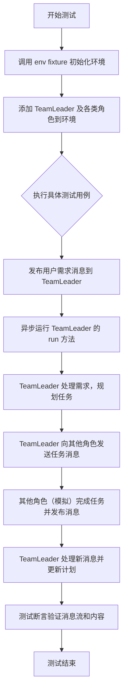
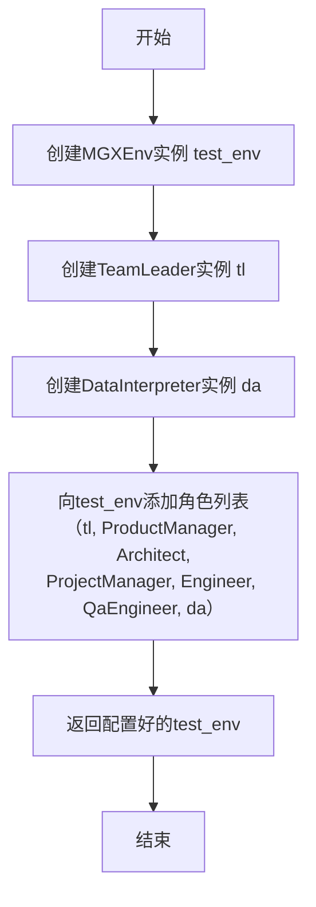
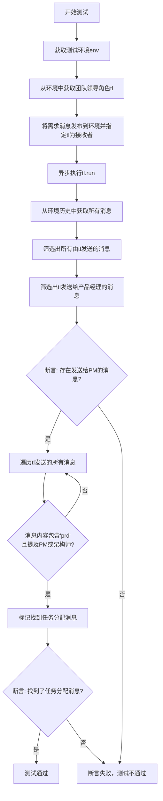
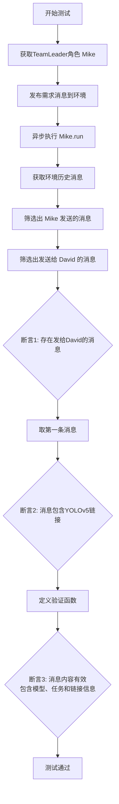
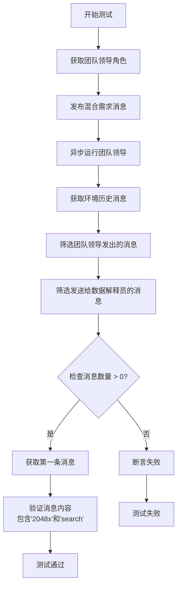
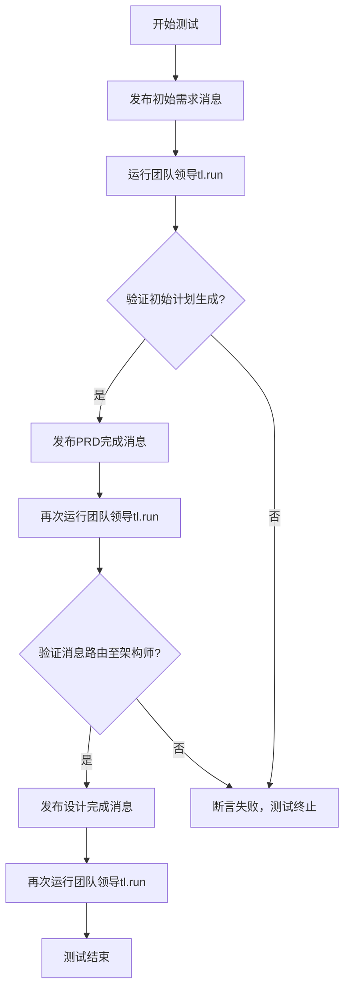
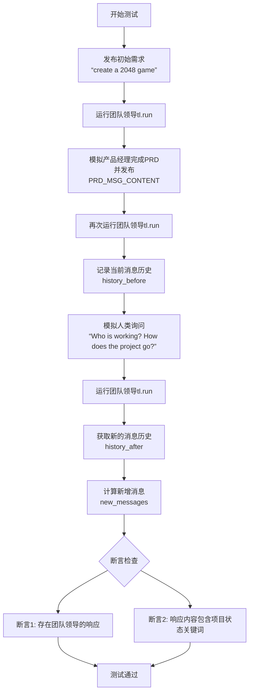
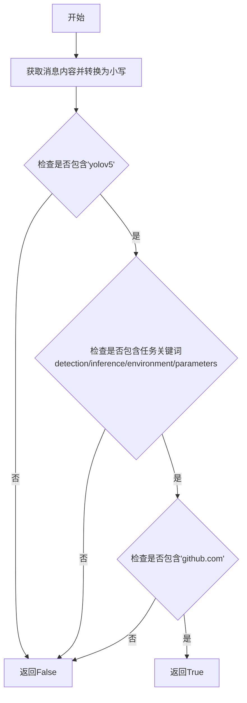
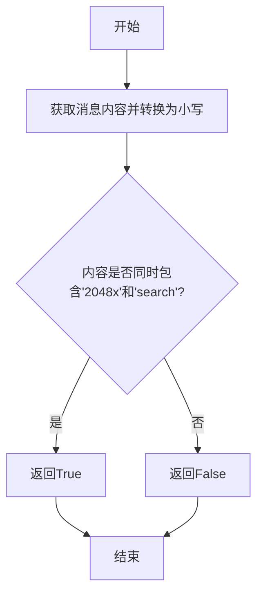

# `.\MetaGPT\tests\metagpt\roles\di\test_team_leader.py` 详细设计文档

该文件是一个使用 pytest 框架编写的集成测试文件，用于测试 MetaGPT 框架中 MGXEnv 环境与多个角色（如 TeamLeader, ProductManager, Architect, Engineer, QaEngineer, DataInterpreter）的协同工作流程。它模拟了从接收用户需求（如创建 2048 游戏、进行 YOLOv5 目标检测任务、混合搜索与复制任务）开始，到角色间通过消息传递进行任务规划、分配、执行和状态更新的完整过程，验证了多智能体协作系统的消息路由、任务分解和团队协作能力。

## 整体流程



## 类结构

```
pytest 测试模块
├── 全局 Fixture: env
├── 测试函数: test_plan_for_software_requirement
├── 测试函数: test_plan_for_data_related_requirement
├── 测试函数: test_plan_for_mixed_requirement
├── 测试函数: test_plan_update_and_routing
└── 测试函数: test_reply_to_human
外部依赖类:
├── MGXEnv (来自 metagpt.environment.mgx.mgx_env)
├── Message (来自 metagpt.schema)
└── 多个 Role 类 (来自 metagpt.roles)
```

## 全局变量及字段


### `PRD_MSG_CONTENT`
    
一个包含产品需求文档（PRD）详细信息的JSON格式字符串，用于模拟产品经理完成PRD任务后发送的消息内容。

类型：`str`
    


### `DESIGN_CONTENT`
    
一个包含系统设计文档详细信息的JSON格式字符串，用于模拟架构师完成设计任务后发送的消息内容。

类型：`str`
    


    

## 全局函数及方法

### `env`

这是一个pytest fixture函数，用于创建并配置一个MGXEnv测试环境。它初始化了环境，并添加了包含TeamLeader、ProductManager、Architect、ProjectManager、Engineer、QaEngineer和DataInterpreter在内的多个角色，用于后续的异步集成测试。

参数：
- 无显式参数。作为pytest fixture，它隐式接收`pytest`框架的fixture请求上下文。

返回值：`MGXEnv`，一个配置了多个角色的测试环境实例。

#### 流程图



#### 带注释源码

```python
# 定义一个pytest fixture，名称为`env`
@pytest.fixture
def env():
    # 1. 创建MGXEnv环境实例
    test_env = MGXEnv()
    
    # 2. 创建TeamLeader角色实例
    tl = TeamLeader()
    
    # 3. 创建DataInterpreter角色实例，并配置其属性
    da = DataInterpreter(
        name="David", # 角色名称
        profile="Data Analyst", # 角色简介
        goal="Take on any data-related tasks, such as data analysis, machine learning, deep learning, web browsing, web scraping, web searching, web deployment, terminal operation, git operation, etc.", # 角色目标
        react_mode="react", # 反应模式
    )
    
    # 4. 将创建的所有角色添加到测试环境中
    test_env.add_roles(
        [
            tl, # TeamLeader
            ProductManager(), # 产品经理
            Architect(), # 架构师
            ProjectManager(), # 项目经理
            Engineer(n_borg=5, use_code_review=True), # 工程师（配置了borg数量和代码审查）
            QaEngineer(), # 质量保证工程师
            da, # DataInterpreter
        ]
    )
    
    # 5. 返回配置好的环境，供测试用例使用
    return test_env
```

### `test_plan_for_software_requirement`

这是一个使用 `pytest` 框架编写的异步单元测试函数。它的核心功能是测试一个名为 `MGXEnv` 的智能体协作环境中，团队领导（`TeamLeader`）角色在接收到一个软件需求（“create a 2048 game”）后，能否正确地生成计划并将任务分配给产品经理（`ProductManager`）。测试通过检查环境中的历史消息来验证任务分配是否成功。

参数：
- `env`：`MGXEnv`，一个由 `@pytest.fixture` 装饰器提供的测试环境实例，其中已预置了包含团队领导、产品经理、架构师等多个角色的协作环境。

返回值：`None`，这是一个测试函数，其主要目的是通过断言（`assert`）来验证功能，不返回业务值。

#### 流程图



#### 带注释源码

```python
@pytest.mark.asyncio  # 标记此函数为异步测试，以便pytest-asyncio插件可以正确处理
async def test_plan_for_software_requirement(env):  # 定义异步测试函数，接收预置的测试环境fixture
    # 1. 定义测试输入：一个软件需求字符串
    requirement = "create a 2048 game"
    
    # 2. 从测试环境中获取名为"Mike"的团队领导（TeamLeader）角色实例
    tl = env.get_role("Mike")
    
    # 3. 将需求封装成Message对象，并发布到环境中，指定接收者为团队领导tl
    #    这模拟了用户或外部系统向团队提出需求的过程
    env.publish_message(Message(content=requirement, send_to=tl.name))
    
    # 4. 异步执行团队领导tl的`run`方法。
    #    在MetaGPT框架中，`run`方法会触发角色的推理和执行循环，
    #    团队领导会分析需求，制定计划，并与其他角色（如产品经理）进行通信。
    await tl.run()

    # 5. 测试验证阶段：从环境中获取完整的交互历史记录
    history = env.history.get()

    # 6. 从历史记录中筛选出所有由团队领导（tl）发送的消息
    messages_to_team = [msg for msg in history if msg.sent_from == tl.name]
    
    # 7. 进一步筛选出tl发送给产品经理（名为"Alice"）的消息
    pm_messages = [msg for msg in messages_to_team if "Alice" in msg.send_to]
    
    # 8. 第一个断言：必须至少有一条消息是发送给产品经理的。
    #    这验证了团队领导在接到软件需求后，知道需要产品经理介入（例如，编写PRD）。
    assert len(pm_messages) > 0, "Should have message sent to Product Manager"
    
    # 9. 初始化一个标志位，用于记录是否找到了具体的任务分配消息
    found_task_msg = False
    
    # 10. 遍历所有由tl发送的消息
    for msg in messages_to_team:
        # 11. 检查消息内容是否包含“prd”（产品需求文档）关键词（不区分大小写）
        #     并且消息内容中是否提到了产品经理("Alice")、架构师("Bob")等关键角色。
        #     这用于验证tl发出的消息是具体的、有针对性的任务分配，而不是泛泛而谈。
        if "prd" in msg.content.lower() and any(role in msg.content for role in ["Alice", "Bob", "Alex", "David"]):
            found_task_msg = True  # 找到符合条件的消息，更新标志位
            break  # 找到一条即可，退出循环
    
    # 12. 第二个断言：必须找到一条符合条件（包含‘prd’并提及相关角色）的任务分配消息。
    #     这验证了团队领导的计划是具体和可执行的。
    assert found_task_msg, "Should have task assignment message"
    # 函数结束，无返回值。测试的成功与否由上述两个断言决定。
```

### `test_plan_for_data_related_requirement`

这是一个使用 `pytest` 框架编写的异步测试函数，用于验证 `TeamLeader` 角色（在测试环境中名为 `Mike`）在接收到一个数据相关的需求（使用 YOLOv5 进行目标检测）后，能够正确地将任务分配给 `DataInterpreter` 角色（在测试环境中名为 `David`），并且分配的消息内容符合预期。

参数：
- `env`：`pytest.fixture`，测试环境，类型为 `MGXEnv`，包含已初始化的角色（如 `TeamLeader`, `DataInterpreter` 等）。

返回值：`None`，这是一个测试函数，其主要目的是通过断言（`assert`）来验证功能，不返回业务值。

#### 流程图



#### 带注释源码

```python
@pytest.mark.asyncio  # 标记此函数为异步测试
async def test_plan_for_data_related_requirement(env):
    # 定义一个数据相关的需求字符串，要求使用YOLOv5进行目标检测
    requirement = "I want to use yolov5 for target detection, yolov5 all the information from the following link, please help me according to the content of the link (https://github.com/ultralytics/yolov5), set up the environment and download the model parameters, and finally provide a few pictures for inference, the inference results will be saved!"

    # 从测试环境 `env` 中获取名为 `Mike` 的角色，即 TeamLeader
    tl = env.get_role("Mike")
    # 将需求包装成 Message 对象，并指定接收者为 `Mike`，然后发布到环境中
    env.publish_message(Message(content=requirement, send_to=tl.name))
    # 异步执行 TeamLeader 的 `run` 方法，触发其处理流程（如任务分解与分配）
    await tl.run()

    # 从环境中获取所有历史消息
    history = env.history.get()
    # 从历史消息中筛选出所有由 TeamLeader (`Mike`) 发送的消息
    messages_from_tl = [msg for msg in history if msg.sent_from == tl.name]
    # 进一步筛选出 TeamLeader 发送给 DataInterpreter (`David`) 的消息
    da_messages = [msg for msg in messages_from_tl if "David" in msg.send_to]
    # 断言1：必须至少有一条消息是发送给 David 的，否则测试失败
    assert len(da_messages) > 0

    # 取第一条发送给 David 的消息
    da_message = da_messages[0]
    # 断言2：该消息内容中必须包含 YOLOv5 的 GitHub 链接
    assert "https://github.com/ultralytics/yolov5" in da_message.content

    # 定义一个内部函数，用于验证消息内容是否有效
    def is_valid_task_message(msg: Message) -> bool:
        # 将消息内容转为小写，便于检查
        content = msg.content.lower()
        # 检查条件1：内容包含模型名称 "yolov5"
        has_model_info = "yolov5" in content
        # 检查条件2：内容包含与任务相关的关键词（检测、推理、环境、参数）
        has_task_info = any(word in content for word in ["detection", "inference", "environment", "parameters"])
        # 检查条件3：内容包含 GitHub 链接
        has_link = "github.com" in content
        # 只有同时满足三个条件，才认为是一条有效的任务分配消息
        return has_model_info and has_task_info and has_link

    # 断言3：发送给 David 的第一条消息必须是一条有效的任务分配消息
    assert is_valid_task_message(da_message)
```

### `test_plan_for_mixed_requirement`

这是一个异步的单元测试函数，用于验证团队领导（TeamLeader）在处理一个混合需求（包含搜索和复制任务）时，能够正确地将搜索任务分配给数据解释员（DataInterpreter）。该测试模拟了从需求发布到任务分配和验证的完整流程。

参数：
- `env`：`pytest.fixture`，测试环境，包含已配置好的MGXEnv环境和所有角色。

返回值：`None`，这是一个测试函数，不返回业务值，通过断言（assert）来验证测试结果。

#### 流程图



#### 带注释源码

```python
@pytest.mark.asyncio  # 标记此函数为异步测试
async def test_plan_for_mixed_requirement(env):
    # 定义混合需求：搜索并复制新游戏2048X
    requirement = "Search the web for the new game 2048X, then replicate it"

    # 从测试环境中获取名为"Mike"的团队领导角色
    tl = env.get_role("Mike")
    # 将需求消息发布到环境中，并指定发送给团队领导
    env.publish_message(Message(content=requirement, send_to=tl.name))
    # 异步运行团队领导的逻辑，处理接收到的消息
    await tl.run()

    # 从环境中获取所有历史消息
    history = env.history.get()
    # 筛选出所有由团队领导发出的消息
    messages_from_tl = [msg for msg in history if msg.sent_from == tl.name]

    # 从团队领导发出的消息中，筛选出所有发送给数据解释员"David"的消息
    da_messages = [msg for msg in messages_from_tl if "David" in msg.send_to]
    # 断言：至少有一条消息发送给了数据解释员
    assert len(da_messages) > 0

    # 获取发送给数据解释员的第一条消息
    da_message = da_messages[0]

    # 定义一个内部函数，用于验证消息内容是否是一个有效的搜索任务
    def is_valid_search_task(msg: Message) -> bool:
        content = msg.content.lower()  # 将消息内容转为小写以便于检查
        # 检查内容是否同时包含"2048x"和"search"关键词
        return "2048x" in content and "search" in content

    # 断言：发送给数据解释员的消息是一个有效的搜索任务
    assert is_valid_search_task(da_message)
```

### `test_plan_update_and_routing`

这是一个使用 `pytest` 框架编写的异步测试函数，用于验证在 `MGXEnv` 环境中，团队领导（`TeamLeader`）角色在接收到产品需求后，能否正确地处理来自产品经理（`ProductManager`）和架构师（`Architect`）的更新消息，并相应地更新计划、路由任务。

参数：
- `env`：`MGXEnv`，一个通过 `@pytest.fixture` 装饰器提供的测试环境实例，其中已预置了包含团队领导、产品经理、架构师等角色的完整团队。

返回值：`None`，这是一个测试函数，其主要目的是通过断言（`assert`）来验证代码行为，不返回业务值。

#### 流程图



#### 带注释源码

```python
@pytest.mark.asyncio
async def test_plan_update_and_routing(env):
    # 1. 定义测试需求
    requirement = "create a 2048 game"

    # 2. 从环境中获取团队领导角色（假设名为"Mike"）
    tl = env.get_role("Mike")
    # 3. 将初始需求发布到环境中，不指定接收者，通常由环境路由或团队领导监听
    env.publish_message(Message(content=requirement))
    # 4. 运行团队领导的处理循环，使其处理新消息并生成初始计划
    await tl.run()

    # 5. 模拟产品经理（Alice）完成了PRD（产品需求文档）并广播消息
    env.publish_message(Message(content=PRD_MSG_CONTENT, sent_from="Alice", send_to={"<all>"}))
    # 6. 再次运行团队领导，使其处理PRD完成的消息，更新计划并路由任务
    await tl.run()

    # 7. 获取环境中的完整消息历史
    history = env.history.get()
    # 8. 过滤出所有由团队领导发送的消息
    messages_from_tl = [msg for msg in history if msg.sent_from == tl.name]

    # 9. 断言验证：团队领导在收到PRD后，应向架构师（Bob）发送了消息
    architect_messages = [msg for msg in messages_from_tl if "Bob" in msg.send_to]
    assert len(architect_messages) > 0, "Should have message forwarded to architect"

    # 10. 断言验证：发送给架构师的消息内容应包含PRD相关信息
    architect_message = architect_messages[-1] # 取最后一条相关消息
    assert "2048 game based on the PRD" in architect_message.content, "Message to architect should contain PRD info"

    # 11. 模拟架构师（Bob）完成了系统设计并广播消息
    env.publish_message(Message(content=DESIGN_CONTENT, sent_from="Bob", send_to={"<all>"}))
    # 12. 再次运行团队领导，使其处理设计完成的消息，理论上会继续路由给工程师等角色
    await tl.run()
    # 注意：此函数后续没有进一步的断言，可能依赖于其他测试或此步骤仅为流程演示。
```

### `test_reply_to_human`

这是一个异步的Pytest测试函数，用于验证团队领导（TeamLeader）角色在接收到人类（用户）关于项目进展的询问时，能够正确响应并返回项目状态信息。该测试模拟了一个完整的软件需求处理流程，并在流程中插入人类询问，以测试系统的交互和状态报告能力。

参数：

- `env`：`MGXEnv`，通过`@pytest.fixture`装饰器提供的测试环境，其中已预配置了包含团队领导、产品经理、架构师等多个角色的模拟环境。

返回值：`None`，Pytest测试函数通常不显式返回值，其成功与否由断言（`assert`）决定。

#### 流程图



#### 带注释源码

```python
@pytest.mark.asyncio
async def test_reply_to_human(env):
    # 1. 定义初始的软件需求
    requirement = "create a 2048 game"

    # 2. 从环境中获取团队领导角色（假设名为"Mike"）
    tl = env.get_role("Mike")
    # 3. 将初始需求作为消息发布到环境中（不指定接收者，通常由环境路由）
    env.publish_message(Message(content=requirement))
    # 4. 异步运行团队领导的处理流程，以启动项目
    await tl.run()

    # 5. 模拟产品经理（Alice）完成了产品需求文档（PRD）并广播给所有人
    env.publish_message(Message(content=PRD_MSG_CONTENT, sent_from="Alice", send_to={"<all>"}))
    # 6. 再次运行团队领导，处理来自产品经理的PRD消息，并可能进行任务分派
    await tl.run()

    # 7. 在模拟人类询问之前，记录当前环境中的所有消息历史，作为基准
    history_before = env.history.get()

    # 8. 模拟人类（用户）向团队领导发送询问项目进展的消息
    env.publish_message(Message(content="Who is working? How does the project go?", send_to={tl.name}))
    # 9. 运行团队领导，处理人类询问
    await tl.run()

    # 10. 获取处理人类询问之后的环境消息历史
    history_after = env.history.get()
    # 11. 通过集合差集，找出在人类询问后新增的消息
    new_messages = [msg for msg in history_after if msg not in history_before]

    # 12. 断言1：从新增的消息中，筛选出来自团队领导（tl）的响应，并断言至少存在一条
    tl_responses = [msg for msg in new_messages if msg.sent_from == tl.name]
    assert len(tl_responses) > 0, "Should have response from team leader"

    # 13. 获取第一条团队领导的响应内容
    response = tl_responses[0].content
    # 14. 断言2：响应内容中应包含指示项目状态的关键词（如progress, status, working）
    assert any(
        keyword in response.lower() for keyword in ["progress", "status", "working"]
    ), "Response should contain project status information"
```

### `is_valid_task_message`

这是一个用于验证消息是否为有效任务消息的辅助函数。它检查消息内容是否包含特定的关键词，以判断该消息是否与YOLOv5目标检测任务相关。

参数：

- `msg`：`Message`，需要验证的消息对象

返回值：`bool`，如果消息内容包含所有必需的关键词（YOLOv5、任务相关词汇、GitHub链接），则返回True，否则返回False

#### 流程图



#### 带注释源码

```python
def is_valid_task_message(msg: Message) -> bool:
    # 将消息内容转换为小写，便于不区分大小写的匹配
    content = msg.content.lower()
    
    # 检查是否包含模型信息关键词
    has_model_info = "yolov5" in content
    
    # 检查是否包含任务相关的关键词
    has_task_info = any(word in content for word in ["detection", "inference", "environment", "parameters"])
    
    # 检查是否包含GitHub链接
    has_link = "github.com" in content
    
    # 只有当所有条件都满足时，才认为是有效的任务消息
    return has_model_info and has_task_info and has_link
```

### `is_valid_search_task`

该函数用于验证给定的消息是否包含有效的搜索任务，具体检查消息内容中是否同时包含"2048x"和"search"这两个关键词（不区分大小写）。

参数：

- `msg`：`Message`，需要验证的消息对象

返回值：`bool`，如果消息内容同时包含"2048x"和"search"则返回True，否则返回False

#### 流程图



#### 带注释源码

```python
def is_valid_search_task(msg: Message) -> bool:
    # 将消息内容转换为小写以便进行不区分大小写的匹配
    content = msg.content.lower()
    # 检查内容是否同时包含"2048x"和"search"关键词
    return "2048x" in content and "search" in content
```

## 关键组件


### MGXEnv

MGXEnv 是测试环境的核心组件，用于模拟和管理一个多智能体协作环境。它负责角色的添加、消息的发布与路由，以及历史记录的存储，是测试中智能体间交互的舞台。

### TeamLeader

TeamLeader 是团队领导角色，负责接收需求、协调团队成员（如 ProductManager, Architect 等）并分配任务。在测试中，它作为消息处理的核心，验证了需求解析、任务规划和消息路由的逻辑。

### DataInterpreter

DataInterpreter 是数据解释器角色，专门处理数据相关的任务（如数据分析、机器学习、网络操作等）。在测试中，它被用于验证系统对数据密集型需求（如 YOLOv5 环境搭建）的识别和任务分配能力。

### Message

Message 是智能体间通信的基本单元，封装了消息内容、发送者、接收者等信息。它是测试中验证消息流、任务分配和状态更新的关键数据结构。

### 角色协作与消息路由

这是一个关键的系统行为组件，描述了 TeamLeader 如何根据消息内容（如需求关键词、发送者）将任务分配给不同的专业角色（如 ProductManager, Architect, DataInterpreter），并验证了这种基于内容的动态路由机制。

### 测试验证逻辑

这是测试框架的核心组件，包含了一系列断言函数（如 `is_valid_task_message`, `is_valid_search_task`）和验证流程，用于自动化地检查系统在接收到不同需求后，其消息流、任务分配和内容是否符合预期。


## 问题及建议


### 已知问题

-   **测试数据硬编码与耦合**：测试用例中大量使用了硬编码的角色名称（如 `"Mike"`, `"Alice"`, `"Bob"`, `"David"`）和特定的消息内容（如 `PRD_MSG_CONTENT`, `DESIGN_CONTENT`）。这使得测试用例与具体的角色命名和消息格式强耦合，一旦角色名称或消息结构发生变化，所有相关测试都需要同步修改，维护成本高且容易出错。
-   **测试断言过于脆弱**：断言条件依赖于消息内容的特定字符串（如 `"prd" in msg.content.lower()`， `"2048 game based on the PRD"`）。这种字符串匹配方式非常脆弱，任何微小的内容格式调整（如大小写、标点、措辞）都可能导致测试失败，降低了测试的健壮性和可靠性。
-   **环境初始化逻辑重复且不灵活**：`env` fixture 固定初始化了包含特定角色集合的环境。当需要测试不同角色组合或配置的场景时，需要复制或修改此 fixture，导致代码重复。同时，`TeamLeader` 和 `DataInterpreter` 的实例化参数（如 `name`）在 fixture 和测试用例中不一致（fixture 中 `DataInterpreter` 名为 `"David"`，但测试中查找的是 `"Mike"`），这可能导致测试行为与预期不符或隐藏逻辑错误。
-   **异步测试潜在的执行顺序依赖**：测试用例依赖于 `await tl.run()` 的执行结果来填充 `env.history`，然后进行断言。如果 `tl.run()` 的内部异步行为（如消息处理、角色间协作）不稳定或存在竞态条件，测试结果可能不可预测，成为“片状测试”。
-   **测试覆盖不完整**：测试主要验证了消息的路由和内容匹配，但对于 `MGXEnv` 的核心功能（如角色管理、消息发布/订阅机制、历史记录管理）以及 `TeamLeader` 在各种边界条件（如无效输入、异常消息、角色不存在）下的行为缺乏直接和深入的测试。

### 优化建议

-   **解耦测试数据**：使用 pytest 的 `parametrize` 功能或从配置文件/工厂函数中获取测试数据，将角色名称、消息内容模板等与测试逻辑分离。为 `Message` 和各类角色创建工厂函数（factory fixtures），以提高测试数据的可维护性和复用性。
-   **强化断言逻辑**：避免对消息内容进行精确的字符串匹配。改为验证消息的结构化属性（如 `msg.send_to` 集合是否包含预期角色、`msg.meta` 中是否包含特定任务类型标识），或使用更灵活的正则表达式进行模式匹配。可以封装通用的断言辅助函数（如 `assert_message_sent_to(role_name, history)`）。
-   **重构环境配置**：将 `env` fixture 设计得更具可配置性。可以通过参数化 fixture 或使用工厂模式，允许测试用例按需传入角色列表和配置。确保在 fixture 内部，角色实例的创建和命名与测试用例中的查找逻辑保持一致。
-   **提升测试隔离性与确定性**：对 `MGXEnv` 和 `Role` 的关键依赖（如网络、文件I/O、随机性）进行 Mock 或 Patch，确保测试环境完全可控。考虑使用 `asyncio` 的测试工具（如 `asyncio.sleep(0)`）来确保异步任务充分调度，或者模拟 `tl.run()` 的协作过程，使测试焦点更明确。
-   **补充关键单元与集成测试**：为 `MGXEnv` 的 `add_roles`、`get_role`、`publish_message` 和 `history` 属性编写独立的单元测试。为 `TeamLeader` 的 `run` 方法设计更细粒度的测试用例，覆盖正常流程、错误处理、消息解析与转发策略等场景。增加对团队协作完整工作流（从需求到交付）的端到端集成测试，但需注意使用 Mock 来替代真实的外部调用（如代码执行、网络请求）。
-   **优化测试结构与可读性**：将冗长的测试用例（如 `test_plan_update_and_routing`）按逻辑阶段（如“初始需求处理”、“PRD消息路由”、“设计消息路由”）拆分为多个更小的测试函数或使用子测试（`pytest.subtests`）。为每个测试用例和断言添加清晰的行为描述注释。


## 其它


### 设计目标与约束

本测试套件的核心设计目标是验证 MetaGPT 框架中 `TeamLeader` 角色在接收到不同类型需求（软件需求、数据相关需求、混合需求）后，能否正确地进行任务规划、角色指派和消息路由。其核心约束在于测试环境（`MGXEnv`）的模拟性，它需要模拟一个包含产品经理、架构师、工程师、数据解释员等角色的完整团队交互，但无需实际执行角色内部的复杂逻辑（如代码生成、模型训练）。测试的重点是消息流（`Message`）的传递、过滤和内容验证，而非各角色任务的最终产出。因此，测试用例通过断言消息的发送者、接收者以及内容中的关键词来验证 `TeamLeader` 的决策逻辑是否符合预期。

### 错误处理与异常设计

当前测试代码主要依赖 `pytest` 的断言机制进行验证，未显式包含针对运行时错误的处理逻辑（如角色不存在、消息格式错误、异步操作超时）。潜在的异常情况包括：`env.get_role` 未找到指定名称的角色时可能返回 `None` 导致后续调用失败；`env.publish_message` 如果消息格式不符合 `Message` 类要求可能导致环境内部状态错误；异步测试函数 `tl.run()` 可能因角色内部逻辑问题而挂起或抛出异常。测试本身的设计是通过断言失败来暴露这些问题，而非在测试内部进行捕获和处理。这是一种符合单元测试哲学的做法，将错误作为测试失败的结果呈现。然而，对于集成测试，可能需要考虑增加超时机制（例如使用 `pytest-asyncio` 的 `timeout` 装饰器）来防止测试无限期等待。

### 数据流与状态机

测试中的数据流围绕 `MGXEnv` 实例的 `history` 属性和 `Message` 对象展开。其核心状态机可以描述为：
1.  **初始状态**：通过 `env` fixture 初始化环境，并预置包含 `TeamLeader` 在内的多个角色。
2.  **触发状态**：每个测试用例通过 `env.publish_message` 发布一个初始需求消息，作为状态机的输入触发器。消息的 `send_to` 字段指定了接收者（通常是 `TeamLeader` “Mike”）。
3.  **处理与流转状态**：调用 `await tl.run()` 驱动 `TeamLeader` 处理消息。此过程内部模拟了 `TeamLeader` 分析需求、制定计划、并可能将新任务消息发布到环境中的流程。这些新消息的 `sent_from` 是 `TeamLeader`，`send_to` 是其他角色（如“Alice”、“Bob”、“David”）。
4.  **验证状态**：测试从 `env.history.get()` 获取所有历史消息，通过过滤（如 `msg.sent_from == tl.name`）和内容分析（检查关键词、链接等）来断言消息流是否符合预期。这验证了 `TeamLeader` 是否在正确的状态下做出了正确的路由决策。
5.  **外部事件注入状态**：在 `test_plan_update_and_routing` 和 `test_reply_to_human` 中，测试模拟了外部角色（如“Alice”发送PRD）或人类用户发送新消息，再次触发 `TeamLeader` 的 `run` 方法，验证其处理更新和响应查询的能力。

整个流程是一个基于事件（消息）驱动的状态转换，`TeamLeader` 是核心的状态处理器和路由决策器。

### 外部依赖与接口契约

1.  **pytest & pytest-asyncio**：测试框架依赖。`@pytest.fixture` 用于构建可重用的测试环境 `env`。`@pytest.mark.asyncio` 用于标记异步测试函数。这是测试执行的基础设施依赖。
2.  **metagpt 核心模块**：
    *   `MGXEnv`：测试环境类。契约包括：`add_roles(roles)` 方法添加角色，`get_role(name)` 方法获取角色，`publish_message(message)` 方法发布消息，`history` 属性（推测有 `get()` 方法）获取消息历史。测试用例严重依赖于这些接口的稳定性和返回值的正确性。
    *   `Message`：消息数据类。契约包括其构造函数参数（`content`, `send_to`, `sent_from`）及属性（`content`, `send_to`, `sent_from`）。测试中对消息内容的分析和断言都基于此契约。
    *   各类角色类（`TeamLeader`, `ProductManager`, `Architect`, `Engineer`, `QaEngineer`, `DataInterpreter`）：测试依赖于它们的实例化方式（构造函数参数）以及它们被加入环境后能响应 `run()` 方法调用的行为。虽然测试不验证其内部实现，但依赖其外部行为（特别是 `TeamLeader` 的消息发布行为）。
3.  **隐式契约**：
    *   角色名称：测试中硬编码了角色名称，如“Mike”（`TeamLeader`）、“Alice”（`ProductManager`）、“Bob”（`Architect`）、“David”（`DataInterpreter`）。这要求 `TeamLeader` 实例在 fixture 中的默认名称或可获取的名称必须是“Mike”，且其他角色在 `env` 中的注册名称与之匹配。这是一个脆弱的隐式契约。
    *   消息内容格式：在 `test_plan_update_and_routing` 中，测试注入了 `PRD_MSG_CONTENT` 和 `DESIGN_CONTENT` 这种包含特定JSON结构的长字符串。这假设 `TeamLeader` 或接收这些消息的角色能够解析这种特定格式。这同样是测试与实现之间一个紧密的耦合点。

这些依赖和契约的稳定性直接决定了测试用例的可靠性和可维护性。

    