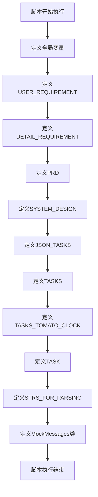

# `.\MetaGPT\tests\metagpt\roles\mock.py` 详细设计文档

该文件是一个模拟数据生成器，用于生成和存储一个智能搜索引擎项目的关键开发文档和消息数据。它定义了从用户需求、产品需求文档（PRD）、系统设计到开发任务分解等一系列结构化内容，并封装在`MockMessages`类中，旨在为项目开发流程（如需求分析、设计、任务规划）提供可复用的测试或演示数据。

## 整体流程



## 类结构

```
MockMessages (数据容器类)
└── 类字段 (静态数据)
    ├── req (Message对象)
    ├── prd (Message对象)
    ├── system_design (Message对象)
    ├── tasks (Message对象)
    └── json_tasks (Message对象)
```

## 全局变量及字段


### `USER_REQUIREMENT`
    
用户需求的简要描述，用于模拟用户输入的核心需求

类型：`str`
    


### `DETAIL_REQUIREMENT`
    
详细的需求说明，包含功能点、资源依赖等具体信息

类型：`str`
    


### `PRD`
    
产品需求文档，包含原始需求、产品目标、用户故事、竞品分析和开发需求池

类型：`str`
    


### `SYSTEM_DESIGN`
    
系统设计文档，包含项目名称、任务列表、数据结构与接口定义以及程序调用流程

类型：`str`
    


### `JSON_TASKS`
    
以JSON格式存储的任务分析，包含逻辑分析和任务列表

类型：`dict`
    


### `TASKS`
    
任务分析文档，包含逻辑依赖分析和任务执行顺序列表

类型：`str`
    


### `TASKS_TOMATO_CLOCK`
    
番茄钟应用的任务分析，包含第三方包依赖、逻辑分析和任务列表

类型：`str`
    


### `TASK`
    
单个任务文件路径，用于指定当前需要处理的具体任务

类型：`str`
    


### `STRS_FOR_PARSING`
    
用于解析测试的字符串列表，包含多种格式的代码块示例

类型：`list`
    


### `MockMessages.req`
    
模拟用户需求消息，包含角色、内容和触发动作

类型：`Message`
    


### `MockMessages.prd`
    
模拟产品需求文档消息，包含角色、内容和触发动作

类型：`Message`
    


### `MockMessages.system_design`
    
模拟系统设计文档消息，包含角色、内容和触发动作

类型：`Message`
    


### `MockMessages.tasks`
    
模拟任务分析文档消息，包含角色、内容和触发动作

类型：`Message`
    


### `MockMessages.json_tasks`
    
模拟JSON格式任务分析消息，包含角色、内容和触发动作

类型：`Message`
    
    

## 全局函数及方法


## 关键组件


### 张量索引与惰性加载

该组件负责高效地管理和检索存储在知识库（如ElasticSearch）中的大规模数据。它通过构建和维护索引结构，支持对上传的多种格式文档（如PDF、Word、TXT）进行快速查询。其惰性加载特性确保只有在查询需要时才从底层存储中加载具体数据，优化了内存使用和响应速度。

### 反量化支持

该组件处理从量化或压缩格式中恢复原始数据的过程。在私有知识库的上下文中，它可能涉及将从ElasticSearch检索出的、可能经过某种编码或压缩的文档内容，转换回可供大语言模型（LLM）处理的原始文本格式，确保数据在后续总结步骤中的可用性和准确性。

### 量化策略

该组件定义了数据在存储和传输过程中的压缩与优化方法。它可能包括对文档文本、向量嵌入或其他元数据进行编码的策略，以减少存储空间占用和网络传输开销，同时平衡检索速度与数据保真度。策略的选择直接影响知识库的存储效率和查询性能。


## 问题及建议

### 已知问题

1.  **硬编码的配置与依赖**：代码中硬编码了Elasticsearch的部署地址（`http://192.168.50.82:9200/`）。这降低了配置的灵活性，使得在不同环境（开发、测试、生产）中部署时需要修改代码，增加了维护成本和出错风险。
2.  **缺乏错误处理与异常设计**：在提供的设计文档和代码片段中，没有明确描述错误处理机制。例如，当Elasticsearch服务不可用、LLM调用失败、文件解析出错或用户输入非法时，系统应如何响应、记录日志并向用户提供有意义的反馈，目前是缺失的。
3.  **数据流与状态管理不明确**：设计文档中描述了组件间的调用顺序，但未涉及关键的数据结构和状态流转。例如，从知识库获取的原始数据、经过索引和排序的中间结果、以及最终生成的总结，它们的具体格式、如何在不同模块间传递、是否有缓存机制等均未定义。
4.  **外部接口契约未定义**：`KnowledgeBase` 类的 `fetch_data` 方法返回 `dict`，`Index` 类的 `query_index` 返回 `list`，但这些数据结构的详细模式（Schema）没有说明。这会导致模块间集成时出现歧义和错误。
5.  **潜在的性能瓶颈**：设计中将“总结”功能放在搜索流程的最后一步（`SearchEngine.search` 返回总结）。这意味着每次搜索都必须调用LLM进行总结，对于简单查询或高频搜索场景，这可能带来不必要的延迟和计算资源消耗。
6.  **安全考虑不足**：虽然有一个 `security.py` 模块被列入任务列表，但在核心设计描述中未提及任何安全措施。例如，没有考虑对用户查询进行 sanitization 以防止注入攻击，也没有提及对上传文件（PDF, Word等）进行病毒扫描或内容安全校验。
7.  **测试策略缺失**：`testing.py` 模块被列为任务，但设计中没有说明测试范围、测试类型（单元测试、集成测试、性能测试）以及如何模拟外部依赖（如LLM和Elasticsearch）。

### 优化建议

1.  **配置外部化**：将Elasticsearch连接地址、LLM API密钥、文件上传路径等所有配置项移出代码，使用配置文件（如YAML、JSON）或环境变量进行管理。考虑使用配置管理库（如`pydantic-settings`）来验证和加载配置。
2.  **设计健壮的错误处理框架**：
    *   定义项目级别的异常基类和一系列具体的异常子类（如`SearchEngineError`, `KnowledgeBaseConnectionError`, `LLMServiceError`等）。
    *   在关键接口（如`search`, `fetch_data`, `ask`）中使用清晰的错误码和消息。
    *   集成结构化日志系统（如`structlog`），记录错误、警告和关键操作信息，便于监控和调试。
3.  **明确数据契约与状态机**：
    *   使用`Pydantic`模型或`dataclass`明确定义在模块间传递的核心数据结构，例如`Query`、`SearchResult`、`Document`、`Summary`。
    *   考虑引入缓存层（如`Redis`），对频繁查询的结果或LLM生成的总结进行缓存，以提升响应速度并降低后端负载。
    *   评估是否将“总结”作为可选项或异步任务，允许用户选择是否需要对结果进行总结，或者将总结任务放入消息队列异步处理。
4.  **定义详细的接口契约**：为每个模块的公共方法编写详细的文档字符串，并使用类型注解明确输入/输出。例如，`KnowledgeBase.fetch_data`应说明返回的字典包含哪些字段及其类型。
5.  **制定安全规范**：
    *   在`security.py`中实现输入验证和清理，防止OS命令注入、NoSQL注入等。
    *   对用户上传的文件，在解析前应进行文件类型校验、大小限制，并在独立的安全沙箱环境中进行解析。
    *   考虑对LLM的提示词（Prompt）进行审查，防止提示词注入攻击。
6.  **完善测试与监控设计**：
    *   制定测试策略：为每个核心类（如`Index`, `Ranking`, `Summary`）编写单元测试，使用Mock对象隔离外部依赖。编写集成测试验证整个搜索流程。
    *   在`monitoring.py`中设计关键指标（如搜索延迟、总结耗时、缓存命中率、错误率）的收集和上报机制，便于进行性能分析和容量规划。
7.  **优化架构以解耦**：当前设计`SearchEngine`强依赖`Index`, `Ranking`, `Summary`。可以考虑引入依赖注入或事件驱动架构，使组件间耦合度更低，更容易独立扩展或替换（例如，更换不同的排序算法或总结模型）。

## 其它


### 设计目标与约束

本项目旨在开发一个基于大语言模型（LLM）与私有知识库的智能搜索引擎。核心设计目标包括：1）提供高准确性、高相关性的搜索结果；2）利用LLM对搜索结果进行智能总结，提升信息获取效率；3）支持对多种格式文档（PDF、Word、TXT）的解析与索引，并基于ElasticSearch构建可实时更新的私有知识库。主要约束包括：依赖已部署的ElasticSearch服务（http://192.168.50.82:9200/）和已封装的LLM抽象接口（`metagpt.llm.LLM`），需确保系统架构与此类外部服务松耦合。

### 错误处理与异常设计

系统应采用分层的错误处理机制。在数据访问层（如`KnowledgeBase`与ElasticSearch交互），需捕获连接超时、查询语法错误等异常，并转换为内部定义的异常类型（如`KnowledgeBaseConnectionError`, `QueryExecutionError`）。在业务逻辑层（如`SearchEngine`），应处理上游组件抛出的异常，并决定是向用户返回友好的错误信息（如“搜索服务暂时不可用”），还是进行重试或降级处理（例如，在LLM总结失败时返回原始搜索结果）。所有未捕获的异常应在应用入口（`Main`）被统一拦截并记录到日志系统，防止服务崩溃。

### 数据流与状态机

系统核心数据流始于用户查询，终于总结文本。具体流程为：1）用户输入查询字符串；2）`SearchEngine`接收查询并调用`Index.query_index`；3）`Index`向`KnowledgeBase`发起请求，获取原始文档数据；4）`KnowledgeBase`从ElasticSearch检索数据并返回；5）`Index`对结果进行初步筛选，返回给`SearchEngine`；6）`SearchEngine`调用`Ranking.rank_results`对结果排序；7）`SearchEngine`调用`Summary.summarize_results`，后者利用`LLM().ask(prompt)`生成总结；8）总结结果最终返回给用户。系统本身无复杂的长期状态机，但`KnowledgeBase`的更新操作（如文档上传、解析、索引）可视为一个异步任务流，包含“上传中”、“解析中”、“索引中”、“完成/失败”等状态。

### 外部依赖与接口契约

1.  **ElasticSearch服务**：依赖位于`http://192.168.50.82:9200/`的ES集群。`KnowledgeBase`类需实现与之交互的客户端，接口契约包括建立连接、执行搜索查询（`fetch_data`）、执行文档索引操作（`update`）。需约定索引的Mapping设置和查询DSL格式。
2.  **大语言模型（LLM）服务**：通过`from metagpt.llm import LLM`导入，使用`LLM().ask(prompt)`调用。接口契约为：输入一个格式化的提示字符串（`prompt`），返回一个文本形式的总结结果。`Summary`类负责构建符合LLM预期的提示词。
3.  **文件解析库**：为支持PDF、Word、TXT等格式，需引入相应的第三方库（如`PyPDF2`, `python-docx`）。这是`KnowledgeBase`在`update`方法中实现文档上传功能时的内部依赖。

### 安全与隐私考虑

1.  **查询注入防护**：在将用户查询传递给ElasticSearch前，`KnowledgeBase`或`Index`需对查询字符串进行适当的清理和转义，防止ES查询注入攻击。
2.  **数据访问控制**：私有知识库应设计认证与授权机制，确保只有授权用户或服务可以执行更新（`update`）或查询（`fetch_data`）操作。当前设计未体现此点，为潜在的安全债务。
3.  **内容安全**：在将原始文档内容或用户查询发送给外部LLM服务前，应考虑对敏感信息（如个人身份信息PII）进行脱敏处理。
4.  **输入验证**：所有用户输入（如查询词、上传的文件）在进入系统处理前都应进行有效性验证。

### 部署与运维

1.  **配置管理**：ElasticSearch连接地址、LLM服务参数等应通过配置文件（如`config.py`）或环境变量管理，实现与代码分离。
2.  **健康检查与监控**：`monitoring.py`模块应实现系统健康检查端点，并监控关键指标，如ES连接状态、LLM调用延迟与成功率、各API接口的QPS和错误率。
3.  **日志聚合**：系统各模块应输出结构化的日志，便于通过ELK等工具进行集中收集、检索和分析，以辅助故障排查和性能优化。
4.  **伸缩性**：`SearchEngine`作为无状态服务，理论上可以通过增加实例数量进行水平扩展。`KnowledgeBase`对ES的依赖意味着ES集群本身需要具备良好的伸缩性以支撑数据增长和查询压力。


    