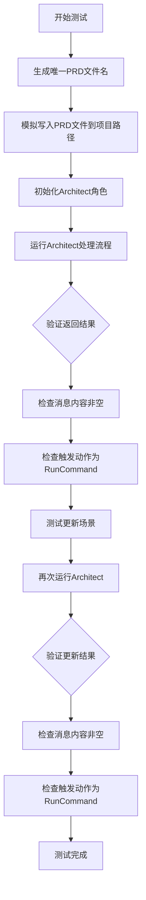
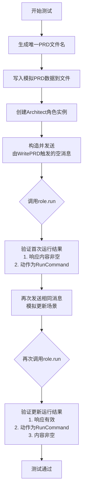
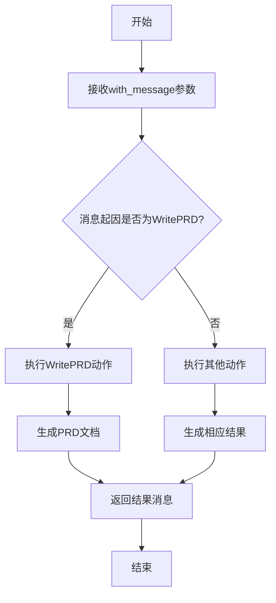

# `.\MetaGPT\tests\metagpt\roles\test_architect.py` 详细设计文档

该代码是一个针对Architect角色的单元测试，主要测试Architect在接收到PRD（产品需求文档）消息后，能否正确执行架构设计任务并生成相应的技术方案。测试首先模拟创建PRD文件，然后初始化Architect角色并运行其处理流程，验证返回的消息内容非空且触发动作为RunCommand，最后还测试了更新场景下的处理能力。

## 整体流程



## 类结构

```
Architect (被测角色类)
├── 继承自: Role (元角色基类)
└── 依赖组件:
    ├── WritePRD (动作类)
    ├── RunCommand (动作类)
    ├── Message (消息类)
    └── MockMessages (测试辅助类)
```

## 全局变量及字段


### `filename`
    
用于存储生成的PRD文件名的唯一标识符字符串

类型：`str`
    


### `role`
    
Architect角色的实例，用于执行架构设计任务

类型：`Architect`
    


### `rsp`
    
存储Architect角色执行run方法后返回的消息对象

类型：`Message`
    


### `context`
    
测试执行上下文对象，包含配置信息和运行环境

类型：`Context`
    


### `Message.content`
    
消息的内容，存储实际的数据或信息

类型：`str`
    


### `Message.cause_by`
    
消息的触发原因，标识是哪个动作或角色产生的消息

类型：`str`
    


### `MockMessages.prd`
    
模拟的PRD对象，包含测试用的产品需求文档内容

类型：`MockPRD`
    
    

## 全局函数及方法

### `test_architect`

这是一个使用 `pytest` 编写的异步测试函数，用于测试 `Architect` 角色的核心功能。它模拟了在给定项目上下文中，`Architect` 角色接收一个由 `WritePRD` 动作触发的消息后，执行其 `run` 方法并验证返回结果的过程。测试包括首次运行和更新运行两个场景，确保 `Architect` 能正确响应消息并生成有效的输出。

参数：
- `context`：`object`，测试上下文对象，提供了项目配置（如项目路径）等运行环境信息。

返回值：`None`，这是一个测试函数，不返回业务值，其成功与否由内部的 `assert` 语句判定。

#### 流程图



#### 带注释源码

```python
@pytest.mark.asyncio  # 标记此函数为异步测试，以便pytest-asyncio插件处理
async def test_architect(context):
    # Prerequisites（前置条件准备）
    # 1. 生成一个唯一的JSON文件名，用于模拟产品需求文档（PRD）
    filename = uuid.uuid4().hex + ".json"
    # 2. 将模拟的PRD内容写入到项目配置指定的PRD文件仓库目录中
    #    context.config.project_path 从测试上下文中获取项目根路径
    #    PRDS_FILE_REPO 是存储PRD文件的子目录常量
    #    MockMessages.prd.content 是预定义的模拟PRD内容
    await awrite(Path(context.config.project_path) / PRDS_FILE_REPO / filename, data=MockMessages.prd.content)

    # 测试主体：首次运行
    # 1. 使用提供的context创建Architect角色实例
    role = Architect(context=context)
    # 2. 构造一个消息。内容为空，但原因（cause_by）设置为WritePRD动作，
    #    这模拟了PRD完成后触发架构师开始工作的场景。
    # 3. 调用角色的run方法处理该消息
    rsp = await role.run(with_message=Message(content="", cause_by=WritePRD))
    # 4. 记录响应以便调试
    logger.info(rsp)
    # 5. 断言验证：响应内容不应为空，且触发响应的动作应为RunCommand
    assert len(rsp.content) > 0
    assert rsp.cause_by == any_to_str(RunCommand)

    # 测试主体：更新运行（模拟在已有基础上再次触发）
    # 1. 再次发送相同的消息（由WritePRD触发）
    rsp = await role.run(with_message=Message(content="", cause_by=WritePRD))
    # 2. 断言验证：响应对象应存在，动作为RunCommand，且内容非空
    assert rsp
    assert rsp.cause_by == any_to_str(RunCommand)
    assert len(rsp.content) > 0
```

### `Architect.run`

该方法用于执行架构师角色的主要工作流程，根据传入的消息触发相应的动作，生成并返回处理结果。

参数：

- `with_message`：`Message`，触发本次运行的消息，包含内容、起因等信息。

返回值：`Message`，处理完成后生成的消息，包含架构设计结果、起因等信息。

#### 流程图



#### 带注释源码

```python
async def run(self, with_message: Message) -> Message:
    """
    执行架构师角色的主要工作流程。
    
    根据传入的消息触发相应的动作，生成并返回处理结果。
    
    Args:
        with_message (Message): 触发本次运行的消息，包含内容、起因等信息。
    
    Returns:
        Message: 处理完成后生成的消息，包含架构设计结果、起因等信息。
    """
    # 根据消息的起因类型，执行相应的动作
    if with_message.cause_by == WritePRD:
        # 如果是PRD编写请求，则执行WritePRD动作
        result = await self.actions[0].run(with_message.content)
    else:
        # 否则执行默认动作（例如RunCommand）
        result = await self.actions[1].run(with_message.content)
    
    # 将处理结果封装为消息并返回
    return Message(content=result, cause_by=type(self.actions[1]).__name__)
```

## 关键组件


### 测试框架与执行流程

该代码是一个使用pytest框架编写的异步单元测试，用于验证Architect角色的核心功能。测试模拟了在给定PRD（产品需求文档）文件后，Architect角色能够成功运行并生成有效输出（例如，设计文档或命令）的流程。

### 角色与动作交互

代码测试了`Architect`角色与`WritePRD`和`RunCommand`动作之间的交互。它验证了当角色接收到一个由`WritePRD`动作触发的消息时，能够正确响应并执行其设计流程，最终产生一个由`RunCommand`动作触发的响应消息。

### 消息驱动架构

代码遵循RFC 116中定义的消息分发机制。测试通过创建特定类型的`Message`对象（`cause_by=WritePRD`）来驱动`Architect`角色的行为，并验证其输出消息的`cause_by`字段是否正确指向了预期的后续动作（`RunCommand`），体现了基于消息传递的职责链设计模式。

### 测试数据准备与清理

测试用例展示了如何为集成测试准备前置条件：动态生成一个模拟的PRD文件并写入到项目指定的目录中。虽然代码中没有显式的清理步骤，但这种使用`uuid`生成唯一文件名的方法避免了测试间的冲突，并暗示了测试环境管理或后续清理的需求。

### 异步操作与日志记录

代码完全采用`async/await`语法进行异步操作测试，符合现代Python异步IO的最佳实践。同时，它集成了项目的日志系统（`logger`），在测试执行过程中记录关键信息，便于调试和结果验证。


## 问题及建议


### 已知问题

-   **测试数据管理不当**：测试用例使用 `uuid.uuid4().hex` 生成临时文件名，但测试执行后未清理该文件。这可能导致测试仓库（`PRDS_FILE_REPO`）中积累大量无用的测试数据文件，污染环境并可能影响后续测试或其他操作的执行。
-   **测试断言过于宽泛**：测试仅断言响应内容长度大于0 (`len(rsp.content) > 0`)，这虽然能验证函数未返回空结果，但无法确保返回内容的质量、格式或符合预期结构，测试覆盖的精确性不足。
-   **潜在的异步执行风险**：测试标记为 `@pytest.mark.asyncio` 并使用了异步执行，但未充分处理异步操作中可能出现的竞态条件或资源未正确释放的问题，尤其是在文件写入和角色执行之间。
-   **测试用例单一**：当前测试主要验证了 `Architect` 角色在接收到特定类型消息后的基本运行和更新功能，但缺乏对异常输入、边界条件、不同上下文配置或与其他组件交互的测试覆盖。

### 优化建议

-   **引入测试固件进行资源管理**：使用 `pytest` 的临时目录固件（如 `tmp_path`）来创建和管理测试所需的文件，确保测试结束后自动清理，避免文件残留。同时，可以为 `PRDS_FILE_REPO` 目录设置专门的测试隔离机制。
-   **增强断言的具体性**：除了检查内容非空，应增加更具体的断言来验证响应内容。例如，可以检查响应是否包含预期的关键字段、是否符合特定的数据结构（如JSON格式）、或者是否包含特定的命令或指令。这能更准确地验证 `Architect` 角色的输出是否符合设计预期。
-   **完善异步测试的健壮性**：确保所有异步操作（如文件写入、角色执行）都得到正确的 `await` 处理。考虑使用 `asyncio` 的同步原语或在测试中模拟（mock）耗时的外部调用，以提高测试的稳定性和执行速度。同时，验证在异步操作失败时，错误是否能被正确捕获和处理。
-   **扩展测试场景**：增加更多的测试用例以覆盖不同的场景，例如：
    -   测试 `Architect` 在接收到非 `WritePRD` 类型的消息时的行为。
    -   测试当 `PRDS_FILE_REPO` 中不存在指定文件或文件内容无效时，角色的错误处理或回退机制。
    -   测试 `Architect` 与其他角色或动作（如 `RunCommand`）的集成情况。
    -   对 `role.run` 方法进行参数化测试，传入不同的 `with_message` 内容。
-   **改进日志和调试信息**：在测试中增加更详细的日志输出，特别是在断言失败时，能够输出 `rsp.content` 的具体内容，便于快速定位问题原因。
-   **考虑测试性能**：如果 `Architect.run` 方法执行较慢，可以考虑在单元测试中对其依赖的复杂操作（如文件I/O、网络请求、命令执行）进行模拟（Mock），使测试聚焦于角色自身的逻辑，提高测试执行速度。


## 其它


### 设计目标与约束

本测试代码的设计目标是验证 `Architect` 角色在接收到特定类型的消息（由 `WritePRD` 动作触发）后，能够正确执行其职责，生成有效的响应。主要约束包括：
1.  **测试隔离性**：测试应独立运行，不依赖外部服务或复杂环境。通过使用 `uuid` 生成唯一文件名和模拟的 `MockMessages` 来确保每次测试的独立性和可重复性。
2.  **异步支持**：代码使用 `pytest.mark.asyncio` 和 `async/await` 语法，确保与 `metagpt` 框架的异步架构兼容。
3.  **框架集成**：测试代码深度依赖于 `metagpt` 框架的上下文 (`context`)、角色 (`Architect`)、动作 (`WritePRD`, `RunCommand`)、消息 (`Message`) 和工具 (`awrite`, `any_to_str`) 等组件，必须遵循其使用契约。
4.  **结果验证**：测试断言不仅检查响应内容非空，还验证响应的 `cause_by` 字段正确指向预期的后续动作 (`RunCommand`)，这符合 RFC 116 中定义的消息分发和处理流程。

### 错误处理与异常设计

测试代码本身的错误处理主要依赖于 `pytest` 框架：
1.  **断言失败**：通过 `assert` 语句验证测试条件。如果断言失败，`pytest` 会将其标记为测试失败，并输出详细的错误信息，帮助定位问题（如响应内容为空或 `cause_by` 不匹配）。
2.  **异步异常**：`@pytest.mark.asyncio` 装饰器确保异步测试函数正确运行，任何在 `async def test_architect` 中未捕获的异常都会导致测试失败。
3.  **前置条件失败**：文件写入操作 `awrite` 如果失败（例如路径不存在或权限问题），会抛出异常并导致测试失败，这有助于发现环境配置问题。
4.  **被测对象异常**：测试期望 `role.run` 方法在正常流程下不抛出异常。如果 `Architect` 角色的内部逻辑存在错误（如消息处理失败），`role.run` 会抛出异常，导致测试失败，从而暴露出 `Architect` 实现中的缺陷。

### 数据流与状态机

本测试模拟并验证了 `Architect` 角色在特定消息驱动下的数据流和状态转换：
1.  **初始状态**：测试开始时，通过 `awrite` 将一个模拟的 PRD 内容写入指定文件路径，为 `Architect` 角色提供输入数据。`Architect` 角色实例被创建并初始化。
2.  **消息触发**：测试通过 `role.run(with_message=Message(content="", cause_by=WritePRD))` 发送一个内容为空但 `cause_by` 为 `WritePRD` 的消息。此消息触发了 `Architect` 角色的处理流程。
3.  **内部处理（被测逻辑）**：根据 `metagpt` 框架设计，`Architect` 在收到 `cause_by` 为 `WritePRD` 的消息后，应读取相关的 PRD 文件（即之前写入的文件），进行分析，并规划后续的架构或指令。处理完成后，它生成一个新的 `Message` 作为响应。
4.  **状态转换与输出**：`Architect` 的角色状态可能从“等待输入”转换为“处理中”，最终回到“就绪”或“等待下一步”。其输出的 `Message` 的 `cause_by` 字段被设置为 `RunCommand`，这表明 `Architect` 已成功处理 PRD 并建议执行某个命令，将工作流推进到下一个环节（如 `Engineer` 角色）。
5.  **二次验证**：测试执行了两次 `role.run` 调用，验证了角色在连续消息触发下的行为一致性，这模拟了工作流中可能的连续交互。

### 外部依赖与接口契约

测试代码明确声明了其外部依赖和必须遵守的接口契约：
1.  **`pytest` 框架**：依赖 `pytest` 作为测试运行器，并使用 `pytest.mark.asyncio` 进行异步测试。约定测试函数以 `test_` 开头。
2.  **`metagpt` 框架核心组件**：
    *   **`Context`**：通过 `context` 参数注入，提供了测试运行所需的配置（如 `project_path`）和环境。
    *   **`Architect` 角色**：被测系统 (SUT)。测试依赖其 `run` 方法接口，并期望其行为符合角色定义——即处理 `WritePRD` 消息并产生 `RunCommand` 消息。
    *   **`Message` 类**：用于构建输入消息。契约要求正确设置 `cause_by` 属性以驱动正确的角色行为。
    *   **`WritePRD`, `RunCommand` 动作**：作为消息 `cause_by` 的类型标识符，是框架内约定的动作类型。
    *   **`any_to_str` 函数**：用于在断言中比较动作类型，需确保其能将动作类转换为可比较的字符串表示。
    *   **`awrite` 函数**：用于异步文件操作，为测试准备输入数据。
3.  **`tests.metagpt.roles.mock.MockMessages`**：一个项目内部的测试工具，提供了模拟的 PRD 内容数据。契约是它必须包含可用的 `prd.content` 属性。
4.  **RFC 116 规范**：代码注释指出修改依据了 RFC 116 第 2.2.1 和 2.2.2 节关于消息分发的新特性。这意味着测试代码（以及它测试的 `Architect` 角色）的实现必须符合该 RFC 定义的消息处理流程，特别是消息的 `cause_by` 链式传递机制。

    