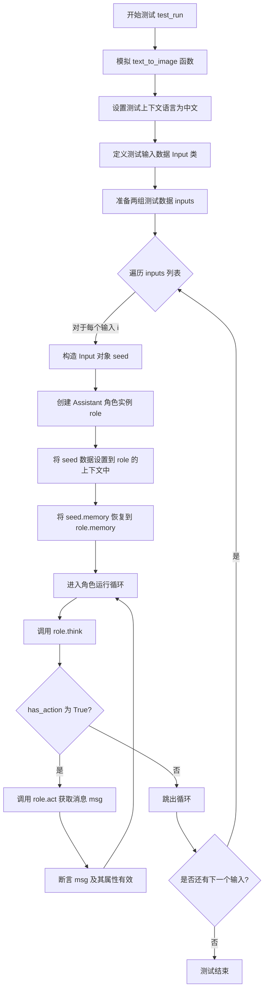
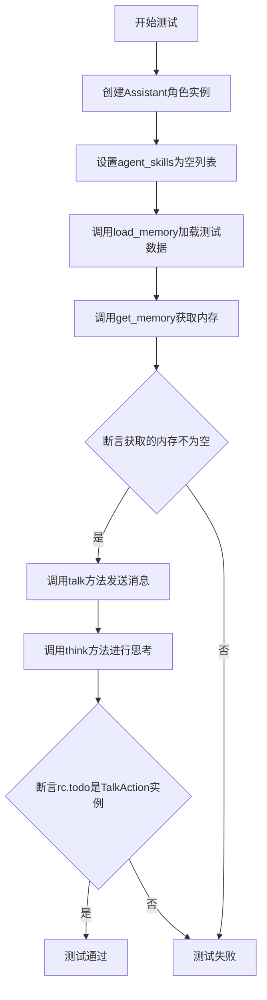
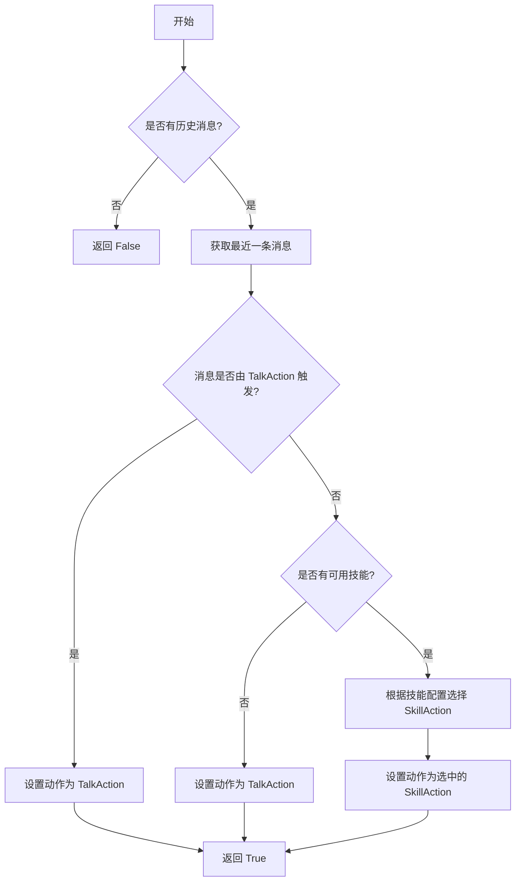
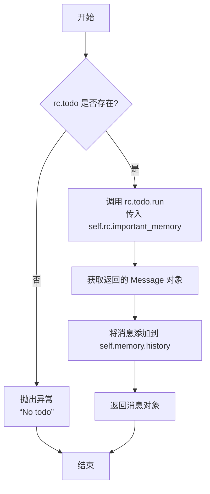
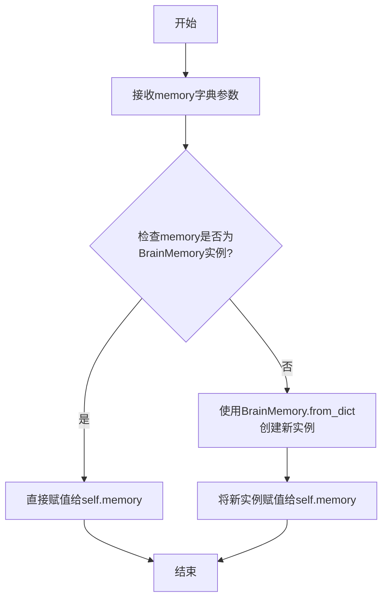
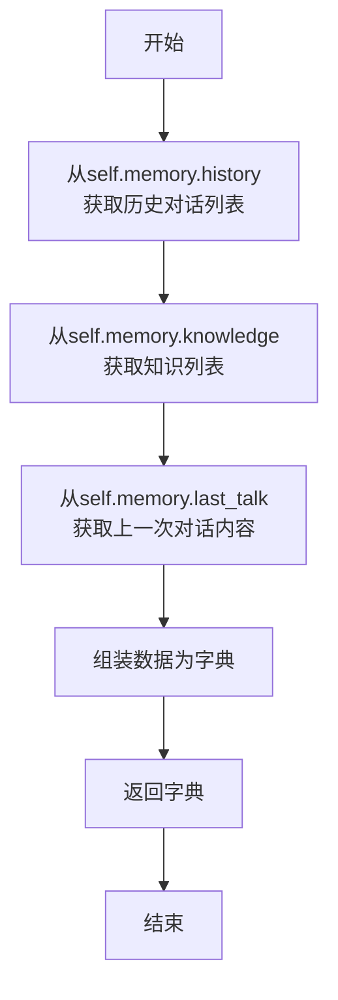

# `.\MetaGPT\tests\metagpt\roles\test_assistant.py` 详细设计文档

这是一个用于测试Assistant角色的单元测试文件，主要验证Assistant在模拟的对话记忆和技能配置下，能否正确地进行思考（think）、行动（act）和对话（talk），并确保其行为符合预期，例如根据不同的触发原因（cause_by）执行相应的动作（TalkAction或SkillAction）。

## 整体流程

```mermaid
graph TD
    A[开始测试] --> B{测试类型?}
    B -- test_run --> C[模拟text_to_image函数]
    C --> D[设置测试上下文和技能列表]
    D --> E[准备两个测试输入用例]
    E --> F[遍历每个输入用例]
    F --> G[创建Assistant角色实例]
    G --> H[配置角色语言、描述和技能]
    H --> I[恢复历史对话记忆]
    I --> J[进入思考循环]
    J --> K{role.think()返回True?}
    K -- 是 --> L[执行role.act()获取消息]
    L --> M[验证消息内容和触发原因]
    M --> J
    K -- 否 --> N[结束当前用例循环]
    N --> O{还有下一个用例?}
    O -- 是 --> F
    O -- 否 --> P[test_run结束]
    B -- test_memory --> Q[准备记忆数据]
    Q --> R[创建Assistant角色实例]
    R --> S[加载记忆数据]
    S --> T[验证记忆获取功能]
    T --> U[执行talk方法]
    U --> V[执行think方法]
    V --> W[验证待执行动作为TalkAction]
    W --> X[test_memory结束]
```

## 类结构

```
BaseModel (Pydantic基类)
└── Input (测试输入数据模型)

Assistant (被测试的主要角色类)
├── 继承自: 未知父类 (推测为Role基类)
├── 字段: memory, context, rc等
├── 方法: think, act, talk, load_memory, get_memory
└── 依赖: BrainMemory, Message, SkillAction, TalkAction
```

## 全局变量及字段


### `agent_skills`
    
包含多个技能配置的列表，每个技能包含id、name、type、config和enabled字段，用于定义Assistant角色可用的内置技能。

类型：`list[dict]`
    


### `inputs`
    
包含多个测试用例的列表，每个用例模拟Assistant角色在不同场景下的输入数据，包括memory、language、agent_description、cause_by和agent_skills。

类型：`list[dict]`
    


### `seed`
    
Input类的实例，用于封装单个测试用例的输入数据，便于传递给Assistant角色进行初始化或配置。

类型：`Input`
    


### `role`
    
Assistant类的实例，代表一个具有对话、思考和行动能力的智能体，用于在测试中模拟角色的行为。

类型：`Assistant`
    


### `msg`
    
Message类的实例，表示Assistant角色在行动（act）后生成的消息，包含内容、触发原因等信息，用于验证行为输出。

类型：`Message`
    


### `memory`
    
表示Assistant角色的记忆数据，包含历史对话记录（history）、知识库（knowledge）和最后一次对话内容（last_talk），用于模拟角色的记忆状态。

类型：`dict`
    


### `val`
    
从Assistant角色的get_memory方法返回的记忆数据，用于验证记忆加载和获取功能的正确性。

类型：`dict`
    


### `Input.memory`
    
Input类的字段，表示Assistant角色的记忆数据，类型为BrainMemory，用于在测试用例中初始化角色的记忆状态。

类型：`BrainMemory`
    


### `Input.language`
    
Input类的字段，表示Assistant角色使用的语言（如'English'或'Chinese'），用于配置角色的语言环境。

类型：`str`
    


### `Input.agent_description`
    
Input类的字段，表示Assistant角色的描述信息（如'chatterbox'或'painter'），用于定义角色的行为特征或职责。

类型：`str`
    


### `Input.cause_by`
    
Input类的字段，表示触发Assistant角色行动的原因（如TalkAction或SkillAction的字符串表示），用于验证角色行为的触发逻辑。

类型：`str`
    


### `Input.agent_skills`
    
Input类的字段，表示Assistant角色可用的技能列表，每个技能是一个字典，包含配置信息，用于定义角色的能力范围。

类型：`list[dict]`
    


### `Assistant.memory`
    
Assistant类的字段，存储角色的记忆数据，包括历史对话、知识和最后对话内容，支持角色的上下文感知和决策。

类型：`BrainMemory`
    


### `Assistant.context`
    
Assistant类的字段，表示角色的运行上下文，包含配置参数（如language、agent_description等），用于管理角色的环境和行为设置。

类型：`Context`
    


### `Assistant.rc`
    
Assistant类的字段，表示角色的运行时上下文，包含当前待执行的动作（todo）等信息，用于控制角色的思考和行动流程。

类型：`RoleContext`
    
    

## 全局函数及方法

### `test_run`

这是一个异步单元测试函数，用于测试 `Assistant` 角色的核心运行流程。它通过模拟不同的输入场景（如对话和技能触发），验证 `Assistant` 能否正确地进行思考（`think`）和行动（`act`），并检查生成的消息（`Message`）是否符合预期。

参数：
- `mocker`：`pytest-mock` 提供的 `MockerFixture` 类型，用于模拟（mock）函数或方法，例如在本测试中模拟了 `text_to_image` 函数。
- `context`：`Context` 类型，测试上下文对象，用于为被测试的 `Assistant` 角色提供运行时的配置和环境信息。

返回值：`None`，这是一个测试函数，不返回业务值，其成功与否由内部的断言（`assert`）决定。

#### 流程图



#### 带注释源码

```python
@pytest.mark.asyncio
async def test_run(mocker, context):
    # mock
    # 模拟 `metagpt.learn.text_to_image` 函数，使其返回一个固定的图片URL，避免测试时进行真实的网络或模型调用。
    mocker.patch("metagpt.learn.text_to_image", return_value="http://mock.com/1.png")

    # 设置测试上下文（context）的语言配置为中文，为后续测试场景做准备。
    context.kwargs.language = "Chinese"

    # 定义一个内部数据模型 `Input`，用于结构化地表示测试输入数据。
    class Input(BaseModel):
        memory: BrainMemory  # 角色的记忆数据，包含历史对话、知识等。
        language: str       # 角色应使用的语言。
        agent_description: str  # 角色的描述信息。
        cause_by: str       # 触发当前动作的上一动作类型。
        agent_skills: list  # 角色可用的技能列表。

    # 定义一个详细的技能列表，模拟一个具备多种内置技能（如文本转语音、图像生成、AI调用等）的智能体。
    agent_skills = [
        {"id": 1, "name": "text_to_speech", "type": "builtin", "config": {}, "enabled": True},
        {"id": 2, "name": "text_to_image", "type": "builtin", "config": {}, "enabled": True},
        {"id": 3, "name": "ai_call", "type": "builtin", "config": {}, "enabled": True},
        {"id": 3, "name": "data_analysis", "type": "builtin", "config": {}, "enabled": True},
        {"id": 5, "name": "crawler", "type": "builtin", "config": {"engine": "ddg"}, "enabled": True},
        {"id": 6, "name": "knowledge", "type": "builtin", "config": {}, "enabled": True},
        {"id": 6, "name": "web_search", "type": "builtin", "config": {}, "enabled": True},
    ]

    # 定义两组核心测试输入数据，模拟两种不同的交互场景。
    inputs = [
        # 场景一：纯对话场景。记忆中包含关于“tulin”的历史问答，触发动作为 `TalkAction`，技能列表为空。
        {
            "memory": {
                "history": [
                    {
                        "content": "who is tulin",
                        "role": "user",
                        "id": "1",
                    },
                    {"content": "The one who eaten a poison apple.", "role": "assistant"},
                ],
                "knowledge": [{"content": "tulin is a scientist."}],
                "last_talk": "Do you have a poison apple?",
            },
            "language": "English",
            "agent_description": "chatterbox",
            "cause_by": any_to_str(TalkAction),  # 使用工具函数将类转换为字符串标识
            "agent_skills": [],
        },
        # 场景二：技能触发场景。记忆中包含关于画图的对话，触发动作为 `SkillAction`，并赋予角色完整的技能列表。
        {
            "memory": {
                "history": [
                    {
                        "content": "can you draw me an picture?",
                        "role": "user",
                        "id": "1",
                    },
                    {"content": "Yes, of course. What do you want me to draw", "role": "assistant"},
                ],
                "knowledge": [{"content": "tulin is a scientist."}],
                "last_talk": "Draw me an apple.",
            },
            "language": "English",
            "agent_description": "painter",
            "cause_by": any_to_str(SkillAction),
            "agent_skills": agent_skills,  # 使用上面定义的完整技能列表
        },
    ]

    # 主测试逻辑：遍历所有测试场景。
    for i in inputs:
        # 1. 将字典输入转换为结构化的 `Input` 对象，便于访问。
        seed = Input(**i)
        # 2. 创建 `Assistant` 角色实例，初始语言设置为中文，但后续会被测试数据覆盖。
        role = Assistant(language="Chinese", context=context)
        # 3. 将当前测试场景的配置（语言、描述、技能）应用到角色的上下文中。
        role.context.kwargs.language = seed.language
        role.context.kwargs.agent_description = seed.agent_description
        role.context.kwargs.agent_skills = seed.agent_skills

        # 4. 将测试数据中的记忆（历史对话、知识等）加载到角色中，模拟一个“有记忆”的智能体。
        role.memory = seed.memory  # Restore historical conversation content.

        # 5. 运行角色的核心循环：思考 -> 行动，直到没有下一步动作为止。
        while True:
            # 5.1 角色根据当前记忆和状态进行“思考”，决定下一步做什么。
            has_action = await role.think()
            # 如果没有产生下一步动作，则结束当前场景的测试。
            if not has_action:
                break
            # 5.2 角色执行思考后决定的动作，并生成一条消息。
            msg: Message = await role.act()
            # 5.3 对生成的消息进行断言验证，确保其有效且符合预期。
            # logger.info(msg)  # 原注释掉的日志代码
            assert msg  # 消息对象不应为空
            assert msg.cause_by == seed.cause_by  # 消息的触发原因应与测试输入一致
            assert msg.content  # 消息内容不应为空
```

### `test_memory`

这是一个针对 `Assistant` 类内存功能的单元测试。它验证了 `Assistant` 角色能够正确地从提供的字典数据中加载内存（包括历史对话、知识和最后谈话），并能通过 `get_memory` 方法获取内存，以及后续的 `talk` 和 `think` 方法能正常工作。

参数：
-  `memory`：`dict`，一个包含 `history`（历史对话列表）、`knowledge`（知识列表）和 `last_talk`（最后谈话字符串）的字典，用于初始化 `Assistant` 角色的内存。
-  `context`：`Context`，测试框架提供的上下文对象，包含运行环境信息。

返回值：`None`，这是一个测试函数，不返回业务值，通过断言（`assert`）来验证测试结果。

#### 流程图



#### 带注释源码

```python
@pytest.mark.parametrize(
    "memory", # 使用pytest的参数化功能，为测试函数提供不同的memory输入数据
    [
        {
            "history": [
                {
                    "content": "can you draw me an picture?",
                    "role": "user",
                    "id": "1",
                },
                {"content": "Yes, of course. What do you want me to draw", "role": "assistant"},
            ],
            "knowledge": [{"content": "tulin is a scientist."}],
            "last_talk": "Draw me an apple.",
        }
    ],
)
@pytest.mark.asyncio # 标记此测试函数为异步函数
async def test_memory(memory, context): # 定义异步测试函数，接收memory和context参数
    role = Assistant(context=context) # 使用提供的context创建一个Assistant角色实例
    role.context.kwargs.agent_skills = [] # 将角色的agent_skills配置设置为空列表
    role.load_memory(memory) # 调用load_memory方法，将参数化的memory字典加载到角色内存中

    val = role.get_memory() # 调用get_memory方法，获取当前角色的内存状态
    assert val # 断言获取到的内存值不为空（Truthy），验证加载和获取功能

    await role.talk("draw apple") # 异步调用角色的talk方法，发送一条消息
    await role.think() # 异步调用角色的think方法，触发角色基于当前状态进行思考
    assert isinstance(role.rc.todo, TalkAction) # 断言角色思考后计划执行的下一个动作（rc.todo）是TalkAction类型
```

### `Assistant.think`

该方法用于决定助手下一步应该执行哪个动作。它基于当前的内存状态、技能配置和对话历史，通过分析最近的消息和可用技能，选择最合适的动作（如对话或技能执行）。如果没有合适的动作，则返回 `False`。

参数：

- `self`：`Assistant` 类型，表示当前助手实例。

返回值：`bool` 类型，如果存在可执行的动作则返回 `True`，否则返回 `False`。

#### 流程图



#### 带注释源码

```python
async def think(self) -> bool:
    """决定下一步要执行的动作"""
    if not self.rc.memory.get():  # 检查是否有历史消息
        return False  # 如果没有历史消息，返回 False

    # 获取最近一条消息
    msg = self.rc.memory.get()[-1]
    if msg.cause_by == any_to_str(TalkAction):  # 如果消息由 TalkAction 触发
        self.rc.todo = TalkAction()  # 设置动作为 TalkAction
    else:
        # 检查是否有可用的技能
        if self.context.kwargs.agent_skills:
            # 根据技能配置选择 SkillAction
            self.rc.todo = SkillAction(
                context=self.context,
                llm=self.llm,
                skill=self.context.kwargs.agent_skills[0],  # 选择第一个可用技能
            )
        else:
            self.rc.todo = TalkAction()  # 如果没有可用技能，设置动作为 TalkAction
    return True  # 返回 True 表示存在可执行的动作
```

### `Assistant.act`

该方法用于执行助理角色的当前待办动作（`rc.todo`），通常是基于`think`方法决策出的具体行动。它会调用相应的动作类（如`TalkAction`或`SkillAction`）来生成消息，并将该消息添加到角色的记忆中。

参数：

-  `self`：`Assistant`，当前助理角色实例

返回值：`Message`，执行动作后生成的消息对象

#### 流程图



#### 带注释源码

```python
async def act(self) -> Message:
    """
    执行当前待办动作（rc.todo）。
    该方法会调用由 `think` 方法设置的 `rc.todo` 动作（例如 `TalkAction` 或 `SkillAction`），
    传入重要的记忆信息（`self.rc.important_memory`）来生成一个消息（`Message`）。
    生成的消息随后会被添加到角色的记忆历史（`self.memory.history`）中。

    返回:
        Message: 执行动作后生成的消息对象。

    异常:
        如果 `rc.todo` 未设置（为 None），则抛出 RuntimeError。
    """
    # 检查是否有待执行的动作
    if not self.rc.todo:
        raise RuntimeError("No todo")
    
    # 执行动作，传入重要的记忆信息作为上下文
    msg = await self.rc.todo.run(self.rc.important_memory)
    
    # 将生成的消息转换为 Message 对象（如果还不是的话）并添加到记忆历史中
    msg = Message(msg)
    self.memory.add_history(msg)
    
    # 返回生成的消息
    return msg
```


### `Assistant.talk`

`Assistant.talk` 方法是 `Assistant` 角色的核心对话方法。它接收用户的文本输入，将其封装为消息并添加到角色的记忆（历史对话）中，然后触发角色的思考（`think`）过程以决定下一步行动（例如，执行某个技能或进行回复）。该方法主要用于处理用户的一次性输入并推进对话状态。

参数：

-  `message`：`str`，用户输入的文本消息内容。

返回值：`None`，该方法不直接返回任何值，其作用是通过更新内部状态（如记忆、待执行动作）来驱动角色行为。

#### 流程图

```mermaid
flowchart TD
    A[开始: Assistant.talk(message)] --> B[将message封装为Message对象]
    B --> C[将Message对象添加到memory.history]
    C --> D[调用self.think方法]
    D --> E{think方法返回True?}
    E -- 是 --> F[设置self.rc.todo为待执行动作]
    E -- 否 --> G[结束]
    F --> G
```

#### 带注释源码

```python
async def talk(self, message: str):
    """
    处理用户输入的消息。
    将消息添加到历史记录中，并触发思考过程以决定下一步行动。
    
    Args:
        message (str): 用户输入的文本消息。
    """
    # 1. 将字符串消息封装为Message对象，指定其触发原因为TalkAction。
    msg = Message(content=message, cause_by=TalkAction)
    # 2. 将新消息添加到角色的记忆（历史对话）中。
    self.memory.add_history(msg)
    # 3. 触发角色的思考过程。think方法会根据当前记忆和状态，
    #    决定下一步要执行的动作（self.rc.todo），例如是继续对话还是执行某个技能。
    await self.think()
```


### `Assistant.load_memory`

该方法用于将外部提供的记忆数据（包括历史对话、知识库和上一次对话内容）加载到`Assistant`角色的内存对象中，从而恢复或初始化其对话状态。

参数：

- `memory`：`dict`，一个包含`history`、`knowledge`和`last_talk`键的字典，分别代表历史消息列表、知识条目列表和上一次对话的文本内容。

返回值：`None`，该方法不返回任何值，其作用是将数据加载到实例的内存属性中。

#### 流程图



#### 带注释源码

```python
def load_memory(self, memory: Union[BrainMemory, dict]):
    """
    加载记忆数据到Assistant实例。
    
    如果传入的memory参数已经是BrainMemory的实例，则直接将其赋值给self.memory。
    如果传入的是一个字典，则使用BrainMemory.from_dict()方法将其转换为BrainMemory实例，
    然后再赋值给self.memory。
    
    Args:
        memory (Union[BrainMemory, dict]): 要加载的记忆数据，可以是BrainMemory实例或字典。
    """
    if isinstance(memory, BrainMemory):
        # 如果参数已经是BrainMemory实例，直接赋值
        self.memory = memory
    else:
        # 如果参数是字典，使用from_dict方法创建BrainMemory实例
        self.memory = BrainMemory.from_dict(memory)
```


### `Assistant.get_memory`

该方法用于获取助理（Assistant）角色的完整记忆（Memory）数据。它从角色的内部状态中提取历史对话记录、知识库信息以及上一次的对话内容，并将其封装成一个结构化的字典返回。

参数：
-  `self`：`Assistant`，指向当前Assistant实例的引用。

返回值：`dict`，返回一个包含`history`（历史对话列表）、`knowledge`（知识列表）和`last_talk`（上一次对话内容）三个键的字典。

#### 流程图



#### 带注释源码

```python
def get_memory(self):
    """
    获取助理角色的完整记忆数据。
    该方法将内部存储的记忆组件（BrainMemory）中的关键信息提取并组织成一个字典。
    返回的字典结构便于序列化、传输或持久化存储。

    Returns:
        dict: 包含以下键的字典：
            - 'history': 历史对话消息的列表。
            - 'knowledge': 存储的知识片段的列表。
            - 'last_talk': 上一次对话的文本内容。
    """
    # 从self.memory（一个BrainMemory实例）中提取历史对话记录。
    history = self.memory.history
    # 从self.memory中提取存储的知识片段。
    knowledge = self.memory.knowledge
    # 从self.memory中提取上一次对话的文本内容。
    last_talk = self.memory.last_talk
    # 将提取出的三个部分组装成一个字典并返回。
    return {"history": history, "knowledge": knowledge, "last_talk": last_talk}
```


## 关键组件


### Assistant 角色类

用于创建具备对话和技能执行能力的智能助手代理，能够根据历史记忆、知识库和配置的技能进行思考和行动。

### BrainMemory 记忆组件

存储和管理助手的历史对话记录、知识库信息以及上一次的对话内容，为助手的决策提供上下文支持。

### SkillAction 技能动作

代表助手可执行的特定技能操作，如文本转语音、文本转图像、AI调用等，是助手能力的具体实现单元。

### TalkAction 对话动作

代表助手进行自然语言对话的专用动作，用于处理用户输入并生成相应的文本回复。

### Message 消息模型

在助手与用户或其他组件之间传递信息的结构化数据模型，包含内容、发送者角色、触发动作类型等关键属性。

### 技能配置管理

通过 `agent_skills` 列表配置和管理助手可用的内置技能集合，支持动态启用/禁用和技能参数配置。


## 问题及建议


### 已知问题

-   **测试数据中存在重复的ID**：在`agent_skills`列表中，`id`为3和6的条目出现了重复，这可能导致在基于ID查找或处理技能时出现逻辑错误或数据覆盖。
-   **硬编码的测试数据**：测试用例中的输入数据（如`inputs`列表和`agent_skills`）是硬编码的，这使得测试不够灵活，难以扩展和维护。当业务逻辑或数据结构变更时，需要手动更新多处测试数据。
-   **测试逻辑与实现细节耦合**：测试用例直接操作了`role.context.kwargs`和`role.memory`等内部属性，这属于白盒测试。如果`Assistant`类的内部实现（如属性名或初始化逻辑）发生变化，测试用例将很容易失败，增加了维护成本。
-   **异步测试的潜在问题**：测试中使用了`while True`循环来驱动`role.think()`和`role.act()`，但没有明确的退出条件（除了`has_action`为`False`）。如果`think()`方法逻辑有误，可能导致无限循环。同时，对异步操作的断言（`assert msg`）可能不够充分，未检查消息的具体内容或状态。
-   **模拟（Mock）覆盖不完整**：`test_run`函数只模拟了`metagpt.learn.text_to_image`函数。如果`Assistant`在执行过程中调用了其他外部依赖（如其他`agent_skills`对应的操作），这些调用将是真实的，可能导致测试不稳定、速度慢或产生副作用（如网络请求、文件I/O）。

### 优化建议

-   **确保测试数据的唯一性和正确性**：修正`agent_skills`列表，确保每个技能的`id`字段是唯一的，以反映真实的数据约束。
-   **使用夹具（Fixtures）或工厂函数管理测试数据**：将`Input`数据类、`agent_skills`列表以及`inputs`中的字典数据抽取出来，定义为`pytest`的`fixture`。这样可以实现数据的集中管理、复用，并在需要时方便地生成动态或参数化的测试数据。
-   **采用黑盒测试或封装测试辅助方法**：尽量避免直接测试对象的内部状态。可以改为通过公共接口（如构造函数参数）来设置`Assistant`的初始条件。或者，为`Assistant`类创建一个专门的测试辅助类或方法，用于封装这些设置步骤，使测试用例更关注行为而非实现。
-   **增强测试的健壮性和明确性**：在`while`循环中添加一个安全计数器（如`max_iterations`）以防止无限循环。对`act()`方法返回的`Message`对象进行更详细的断言，例如验证其`content`是否非空、是否符合特定格式或包含关键信息。
-   **完善模拟策略**：审查`Assistant`角色在测试场景下可能执行的所有`SkillAction`，并使用`mocker.patch`对它们进行适当的模拟。例如，可以模拟`SkillAction`的`run`方法，返回预定义的、可控的结果。这能确保测试的隔离性、速度和确定性。考虑使用`pytest-mock`提供的`mocker`夹具来简化模拟过程。


## 其它


### 设计目标与约束

本测试代码的设计目标是验证 `Assistant` 角色类在模拟的对话和技能执行场景下的核心功能，包括：1）基于历史记忆和知识进行思考并选择正确的后续动作（`TalkAction` 或 `SkillAction`）；2）执行所选动作并生成符合预期的 `Message` 消息；3）正确加载和获取内存状态。主要约束包括：1）测试环境需模拟外部依赖（如 `text_to_image` 函数）；2）测试数据需覆盖多种输入组合（如不同的 `cause_by` 触发类型、技能列表）；3）测试需验证异步流程的正确性。

### 错误处理与异常设计

测试代码本身主要使用 `assert` 语句进行结果验证，属于正向测试。其错误处理策略包括：1）通过 `pytest.mark.asyncio` 和 `async/await` 确保异步测试的正确执行；2）使用 `mocker.patch` 模拟可能失败或具有副作用的外部调用（如 `text_to_image`），隔离测试环境；3）通过 `pytest.parametrize` 参数化测试数据，确保边界和异常数据情况得到覆盖。测试未显式包含对 `Assistant` 类内部可能抛出异常的捕获和验证，这部分应由被测试类自身的设计文档涵盖。

### 数据流与状态机

测试代码的数据流始于预定义的 `inputs` 列表和 `memory` 参数化数据。对于每个测试用例：1）输入数据（记忆、语言、描述、触发动作、技能列表）被封装到 `Input` 模型或直接传入；2）`Assistant` 角色实例根据输入数据初始化其上下文 (`context.kwargs`) 和内存 (`role.memory`)；3）测试驱动角色进入 `think-act` 循环：`think()` 方法基于当前内存和上下文决定下一个动作 (`rc.todo`)，`act()` 方法执行该动作并返回一个 `Message` 对象；4）输出的 `Message` 的 `cause_by` 和 `content` 属性被断言验证与输入预期一致。状态机的关键状态转移体现在 `think()` 方法根据 `memory.last_talk` 和 `cause_by` 等决定是继续对话还是执行技能，测试验证了这些转移逻辑。

### 外部依赖与接口契约

测试代码明确模拟和依赖以下外部组件：1）**`metagpt.learn.text_to_image` 函数**：被 `mocker.patch` 模拟返回固定URL，契约是接收文本并返回图像资源标识符。2）**`pydantic.BaseModel`**：用于定义 `Input` 数据验证模型，契约是提供类型检查和数据序列化。3）**`metagpt` 框架内的多个类**：`Assistant`, `BrainMemory`, `Message`, `TalkAction`, `SkillAction`。测试与这些类的契约包括：`Assistant` 的构造函数参数、`think()` 和 `act()` 方法的异步接口及返回值；`BrainMemory` 和 `Message` 的数据结构；`TalkAction` 和 `SkillAction` 作为可执行动作的标识。测试通过模拟和构造符合这些契约的数据来验证集成逻辑。

    