# `.\MetaGPT\tests\metagpt\roles\test_engineer.py` 详细设计文档

该文件是一个测试文件，用于测试MetaGPT框架中Engineer角色的功能，包括代码解析、任务处理、以及工程师角色在接收到需求、系统设计和任务列表后，如何生成代码并管理项目仓库的完整流程。

## 整体流程

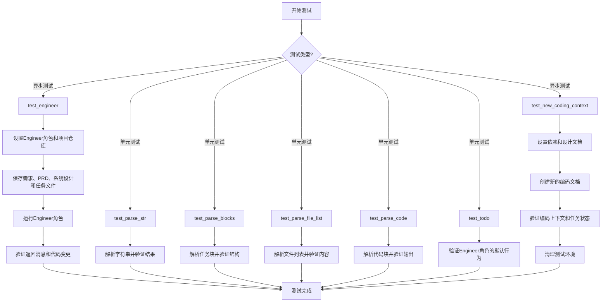

## 类结构

```
test_engineer.py (测试文件)
├── test_engineer (异步测试函数)
├── test_parse_str (单元测试函数)
├── test_parse_blocks (单元测试函数)
├── test_parse_file_list (单元测试函数)
├── test_parse_code (单元测试函数)
├── test_todo (单元测试函数)
└── test_new_coding_context (异步测试函数)
```

## 全局变量及字段


### `STRS_FOR_PARSING`
    
用于测试CodeParser.parse_str方法的一组字符串样本。

类型：`List[str]`
    


### `TASKS`
    
包含任务列表的文本块，用于测试CodeParser的解析功能。

类型：`str`
    


### `target_list`
    
预期的文件路径列表，用于验证test_parse_file_list函数的输出。

类型：`List[str]`
    


### `target_code`
    
预期的Python代码字符串，用于验证test_parse_code函数的输出。

类型：`str`
    


### `demo_path`
    
指向包含演示项目数据（如依赖项和设计文件）的目录路径。

类型：`Path`
    


### `deps`
    
从dependencies.json文件加载的依赖关系字典。

类型：`Dict[str, List[str]]`
    


### `dependency`
    
表示项目依赖关系的对象，用于管理模块间的依赖。

类型：`Dependency`
    


### `data`
    
从文件（如system_design.json或tasks.json）读取的原始字符串数据。

类型：`str`
    


### `rqno`
    
请求编号，用作保存和检索设计、任务等文档的文件名标识符。

类型：`str`
    


### `filename`
    
正在处理或测试的代码文件的名称（例如'game.py'）。

类型：`str`
    


### `engineer`
    
Engineer角色的实例，用于执行测试中的编码相关操作。

类型：`Engineer`
    


### `ctx_doc`
    
包含CodingContext序列化内容的文档对象。

类型：`Document`
    


### `ctx`
    
反序列化后的CodingContext对象，包含编码任务所需的所有上下文信息。

类型：`CodingContext`
    


### `role`
    
在测试中用于验证行为或状态的另一个Engineer角色实例。

类型：`Engineer`
    


### `Engineer.repo`
    
工程师角色关联的项目代码仓库，用于文件操作和版本控制。

类型：`ProjectRepo`
    


### `Engineer.input_args`
    
包含运行Engineer所需输入参数（如项目路径）的简单命名空间对象。

类型：`SimpleNamespace`
    


### `Engineer.code_todos`
    
待处理的编码任务上下文列表，工程师需要根据这些上下文编写代码。

类型：`List[CodingContext]`
    


### `ProjectRepo.docs`
    
项目仓库中用于管理各类文档（如PRD、设计、任务）的文档存储子模块。

类型：`Docs`
    


### `CodingContext.filename`
    
需要编写或修改的目标代码文件的名称。

类型：`str`
    


### `CodingContext.design_doc`
    
包含系统设计信息的文档，为编码提供高层设计指导。

类型：`Document`
    


### `CodingContext.task_doc`
    
包含具体开发任务描述的文档，定义了编码的具体要求。

类型：`Document`
    


### `CodingContext.code_doc`
    
用于存储最终生成或修改的代码内容的文档。

类型：`Document`
    


### `Message.content`
    
消息的主要内容，可以是文本、数据或指令。

类型：`str`
    


### `Message.cause_by`
    
指示触发此消息的前一个动作类型，用于在角色间传递工作流上下文。

类型：`Type[Action]`
    
    

## 全局函数及方法

### `test_engineer`

这是一个使用 `pytest` 框架编写的异步测试函数，用于测试 `Engineer` 角色的核心功能。它模拟了一个完整的软件开发生命周期场景：设置项目环境、提供需求文档、系统设计文档和任务列表，然后触发 `Engineer` 角色执行其 `run` 方法。测试验证了 `Engineer` 在接收到任务后，能够正确地处理消息并生成代码变更。

参数：

- `context`：`pytest` 的 `fixture` 对象，类型通常为 `dict` 或自定义的上下文对象，它提供了测试运行所需的配置和环境，例如项目路径、Git仓库等。

返回值：`None`，`pytest` 测试函数通常不显式返回值，而是通过 `assert` 语句来验证测试结果。

#### 流程图

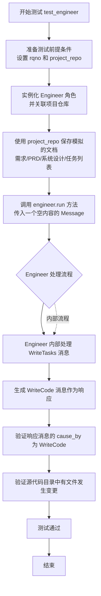

#### 带注释源码

```python
@pytest.mark.asyncio  # 标记此函数为异步测试
async def test_engineer(context):
    # Prerequisites
    # 准备测试前提：定义一个请求编号和项目仓库对象
    rqno = "20231221155954.json"
    project_repo = ProjectRepo(context.config.project_path)

    # 设置engineer
    # 实例化 Engineer 角色，并为其设置项目仓库和输入参数
    engineer = Engineer(context=context)
    engineer.repo = project_repo
    engineer.input_args = SimpleNamespace(project_path=context.config.project_path)

    # 使用project_repo保存所需文件
    # 将模拟的各类文档（需求、产品需求文档、系统设计、任务列表）保存到项目仓库的相应位置
    await project_repo.save(REQUIREMENT_FILENAME, content=MockMessages.req.content)
    await project_repo.docs.prd.save(rqno, content=MockMessages.prd.content)
    await project_repo.docs.system_design.save(rqno, content=MockMessages.system_design.content)
    await project_repo.docs.task.save(rqno, content=MockMessages.json_tasks.content)

    # 核心测试步骤：运行 Engineer 角色。
    # 传入一个内容为空但原因（cause_by）为 WriteTasks 的消息，模拟接收到任务列表后的触发。
    rsp = await engineer.run(Message(content="", cause_by=WriteTasks))

    # 记录响应并执行断言验证
    logger.info(rsp)
    # 验证响应的原因是否为 WriteCode，表明 Engineer 已准备开始编写代码
    assert rsp.cause_by == any_to_str(WriteCode)
    # 验证在源代码工作区中是否有文件被标记为已更改，表明代码生成或修改动作已发生
    assert context.repo.with_src_path(context.src_workspace).srcs.changed_files
```

### `test_parse_str`

该函数是一个单元测试，用于验证`CodeParser.parse_str`方法能否从给定的字符串列表中正确解析出指定的序号对应的字符串。它遍历一个预定义的字符串列表`STRS_FOR_PARSING`，对每个字符串调用`parse_str`方法，并断言解析结果等于"a"。

参数：
- 无显式参数。该函数是一个测试函数，不接收外部参数，其测试数据来自模块级变量`STRS_FOR_PARSING`。

返回值：`None`，该函数是一个测试函数，其主要目的是通过断言（`assert`）来验证代码逻辑，不返回业务值。

#### 流程图

```mermaid
flowchart TD
    Start[开始测试] --> LoopStart[遍历STRS_FOR_PARSING列表]
    LoopStart --> Condition{是否还有元素?}
    Condition -- 是 --> GetItem[获取当前索引idx和元素i]
    GetItem --> Parse[调用CodeParser.parse_str<br>参数: f"{idx+1}", i]
    Parse --> Assert[断言解析结果等于"a"]
    Assert --> LoopStart
    Condition -- 否 --> End[测试结束]
```

#### 带注释源码

```python
def test_parse_str():
    # 遍历预定义的测试字符串列表STRS_FOR_PARSING
    for idx, i in enumerate(STRS_FOR_PARSING):
        # 调用CodeParser.parse_str方法，尝试解析出序号（idx+1）对应的字符串
        # 预期行为：对于列表中的每个字符串i，解析出序号对应的部分应为"a"
        text = CodeParser.parse_str(f"{idx + 1}", i)
        # 记录日志（当前被注释）
        # logger.info(text)
        # 断言解析结果确实等于"a"，以验证parse_str方法的正确性
        assert text == "a"
```

### `test_parse_blocks`

该函数用于测试 `CodeParser.parse_blocks` 方法，验证其能否正确解析包含多个代码块的文本，并提取出块标题与内容的映射关系。

参数：

- 无显式参数，但函数内部使用了全局变量 `TASKS` 作为测试输入。

返回值：`None`，该函数是一个测试函数，不返回任何值，通过断言来验证测试结果。

#### 流程图

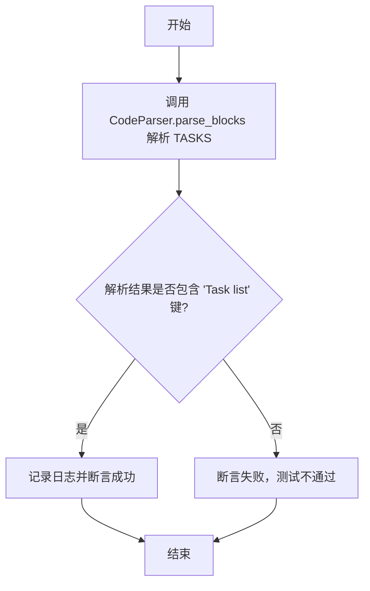

#### 带注释源码

```python
def test_parse_blocks():
    # 调用 CodeParser.parse_blocks 方法，传入全局变量 TASKS 作为待解析的文本。
    # 该方法预期返回一个字典，其中键是代码块的标题，值是对应的内容。
    tasks = CodeParser.parse_blocks(TASKS)
    
    # 使用 logger 记录解析后字典的所有键，便于调试和观察。
    logger.info(tasks.keys())
    
    # 断言：检查解析后的字典中是否包含键名为 "Task list" 的项。
    # 这是测试的核心，用于验证 parse_blocks 函数是否能正确识别出标题为 "Task list" 的代码块。
    assert "Task list" in tasks.keys()
```

### `test_parse_file_list`

该函数用于测试 `CodeParser.parse_file_list` 方法，验证其能否正确地从给定的任务文本中解析出文件列表，并与预期的目标列表进行比较。

参数：

- 无显式参数，但函数内部使用了全局变量 `TASKS` 和 `target_list`。

返回值：`None`，该函数是一个测试函数，不返回任何值，仅通过断言验证测试结果。

#### 流程图

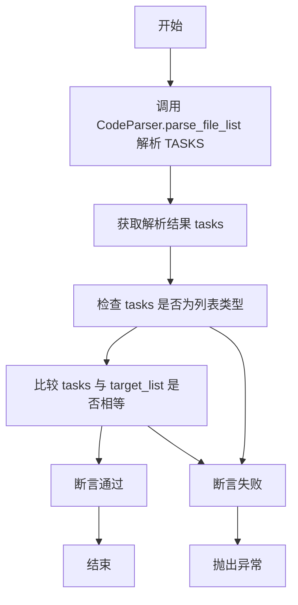

#### 带注释源码

```python
def test_parse_file_list():
    # 调用 CodeParser.parse_file_list 方法，从 TASKS 文本中解析出 "Task list" 块对应的文件列表
    tasks = CodeParser.parse_file_list("Task list", TASKS)
    
    # 记录解析结果，便于调试
    logger.info(tasks)
    
    # 断言解析结果是一个列表类型
    assert isinstance(tasks, list)
    
    # 断言解析出的文件列表与预期的 target_list 完全一致
    assert target_list == tasks
```

### `test_parse_code`

该函数用于测试 `CodeParser.parse_code` 方法，验证其能否从给定的文本块中正确解析出指定编程语言的代码片段。它通过比较解析结果与预期代码来断言测试是否通过。

参数：

- `block`：`str`，要解析的代码块名称，用于标识文本中的特定代码段。
- `text`：`str`，包含代码块的完整文本内容。
- `lang`：`str`，目标代码的编程语言，用于指导解析器识别语法结构。

返回值：`None`，该函数为测试函数，不返回任何值，仅通过断言验证测试结果。

#### 流程图

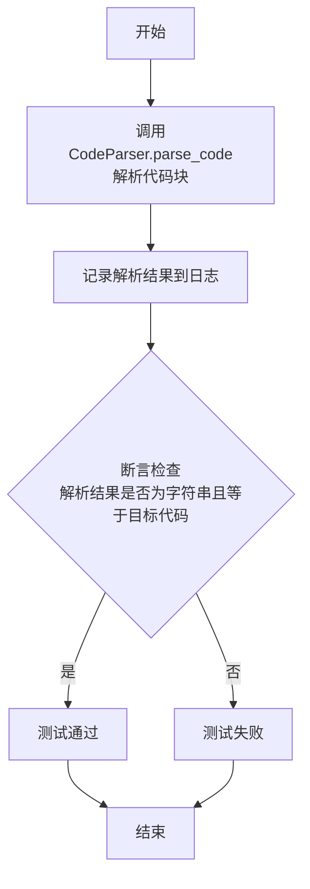

#### 带注释源码

```python
def test_parse_code():
    # 调用CodeParser.parse_code方法，从TASKS文本中解析名为"Task list"的Python代码块
    code = CodeParser.parse_code(block="Task list", text=TASKS, lang="python")
    # 将解析得到的代码记录到日志中，便于调试和验证
    logger.info(code)
    # 断言1：确保解析结果是一个字符串类型
    assert isinstance(code, str)
    # 断言2：确保解析得到的代码与预定义的目标代码完全一致
    assert target_code == code
```

### `test_todo`

这是一个单元测试函数，用于验证`Engineer`角色的`action_description`属性是否正确设置为`WriteCode`动作的名称。

参数：
- 无显式参数。该函数是一个测试函数，不接收外部参数。

返回值：无返回值（`None`）。该函数使用`assert`语句进行断言，如果断言失败，测试将不通过。

#### 流程图

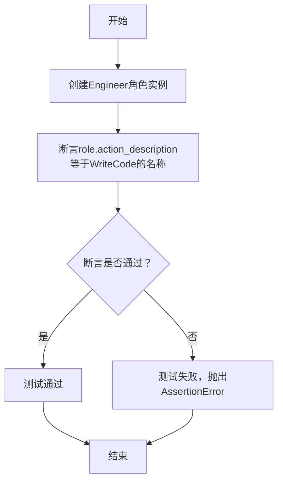

#### 带注释源码

```python
def test_todo():
    # 创建一个Engineer角色的实例，不传入任何上下文（context）
    role = Engineer()
    # 使用assert语句验证：role实例的action_description属性值
    # 是否等于通过any_to_name函数转换WriteCode动作后得到的名称字符串。
    # any_to_name函数的作用是将一个动作对象转换为其名称字符串表示。
    assert role.action_description == any_to_name(WriteCode)
```

### `Engineer._new_coding_context`

该方法用于为工程师角色创建一个新的编码上下文文档。它基于给定的文件名和依赖关系，从系统设计和任务文档中提取相关信息，构建一个包含设计、任务和现有代码信息的结构化上下文对象，以便后续的代码编写或分析。

参数：

- `filename`：`str`，需要创建编码上下文的源代码文件名。
- `dependency`：`Dependency`，项目的依赖关系对象，用于获取文件间的依赖信息。

返回值：`CodingContext`，一个包含完整编码上下文信息的对象，包括设计文档、任务文档、现有代码文档以及相关依赖。

#### 流程图

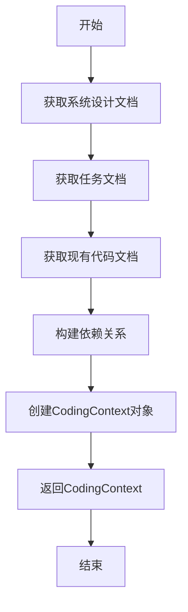

#### 带注释源码

```python
async def _new_coding_context(self, filename: str, dependency: Dependency) -> CodingContext:
    """
    为给定的文件名创建一个新的编码上下文。
    
    该方法会从系统设计和任务文档中提取相关信息，并结合现有代码和依赖关系，
    构建一个完整的编码上下文对象。
    
    Args:
        filename (str): 需要创建上下文的源代码文件名
        dependency (Dependency): 项目的依赖关系对象
    
    Returns:
        CodingContext: 包含完整编码上下文信息的对象
    """
    # 获取系统设计文档
    design_doc = await self._get_design_doc(filename)
    
    # 获取任务文档
    task_doc = await self._get_task_doc(filename)
    
    # 获取现有代码文档（如果存在）
    code_doc = await self._get_code_doc(filename)
    
    # 构建依赖关系
    dependencies = await dependency.get_file_dependencies(filename)
    
    # 创建并返回CodingContext对象
    return CodingContext(
        filename=filename,
        design_doc=design_doc,
        task_doc=task_doc,
        code_doc=code_doc,
        dependencies=dependencies,
        workspace=self.context.src_workspace
    )
```

### `logger.info`

`logger.info` 是 Python 标准库 `logging` 模块中 `Logger` 类的一个方法，用于记录一条严重级别为 `INFO` 的日志。它通常用于记录程序运行过程中的一般信息，如状态更新、进度提示等，以帮助开发者了解程序的执行流程和状态。

参数：

- `msg`：`str`，要记录的日志消息字符串。
- `args`：`tuple`，可选，用于格式化 `msg` 字符串的参数。
- `kwargs`：`dict`，可选，包含额外关键字参数的字典，例如 `exc_info`、`stack_info` 等。

返回值：`None`，此方法不返回任何值，仅执行日志记录操作。

#### 流程图

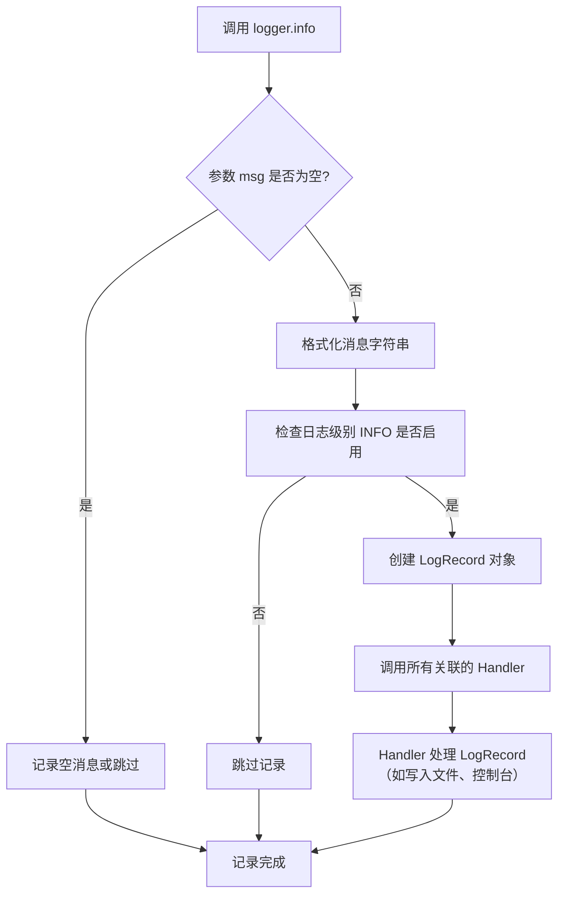

#### 带注释源码

```python
def info(self, msg, *args, **kwargs):
    """
    记录一条 INFO 级别的日志。

    如果根记录器配置的级别高于 INFO，则此调用将不执行任何操作。
    否则，将创建一个 LogRecord 并传递给此记录器上所有有效的处理器。

    Args:
        msg: 要记录的消息格式字符串。
        *args: 用于字符串格式化的参数。
        **kwargs: 额外的关键字参数。
                  支持的关键字参数包括 `exc_info` 用于异常信息，
                  `stack_info` 用于堆栈跟踪，以及 `extra` 用于自定义上下文。
    """
    # 检查此记录器是否对 INFO 级别有效
    if self.isEnabledFor(INFO):
        # 调用 _log 方法处理实际的日志记录逻辑
        self._log(INFO, msg, args, **kwargs)
```

### `logger.info`

`logger.info` 是 Python 标准库 `logging` 模块中 `Logger` 类的一个方法，用于记录一条级别为 `INFO` 的日志消息。它通常用于输出程序运行过程中的一般性信息，如状态更新、进度提示等，帮助开发者了解程序的执行流程。

参数：

- `msg`：`str`，要记录的日志消息字符串。
- `args`：`tuple`，可选，用于格式化 `msg` 字符串的参数。
- `kwargs`：`dict`，可选，额外的关键字参数，例如 `exc_info` 用于记录异常信息。

返回值：`None`，此方法不返回任何值。

#### 流程图

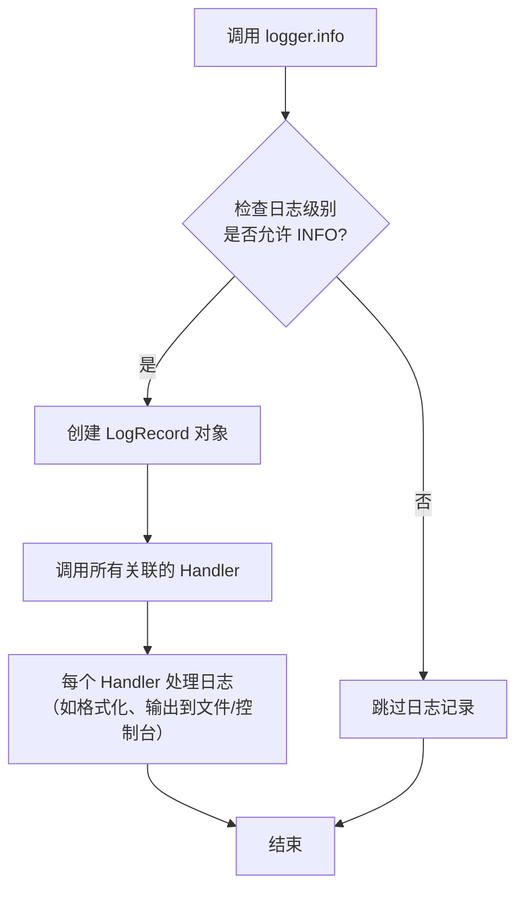

#### 带注释源码

```python
def info(self, msg, *args, **kwargs):
    """
    记录一条级别为 INFO 的日志消息。

    如果根记录器（root logger）配置的级别高于 INFO（如 WARNING、ERROR），
    则此消息可能不会被实际输出。

    :param msg: 消息字符串，可以包含格式说明符（如 %s, %d）。
    :param args: 用于格式化 msg 的参数元组。
    :param kwargs: 额外的关键字参数。常用的有：
                   - exc_info: 如果为 True，则会将当前异常信息添加到日志中。
    """
    # 调用内部方法 _log，传入日志级别 INFO（值为 20）
    if self.isEnabledFor(INFO):
        self._log(INFO, msg, args, **kwargs)
```

### `test_engineer`

这是一个使用 `pytest.mark.asyncio` 装饰的异步测试函数，用于测试 `Engineer` 角色的核心功能。它模拟了在一个项目环境中，工程师接收任务、处理消息并生成代码响应的完整流程。测试验证了工程师能够正确响应 `WriteTasks` 类型的消息，并最终产生 `WriteCode` 类型的输出，同时确保源代码文件发生了预期的变更。

参数：

- `context`：`pytest.fixture`，测试上下文对象，提供了测试所需的配置、仓库等环境依赖。

返回值：`None`，测试函数通常不显式返回值，其成功与否由内部的断言（`assert`）语句决定。

#### 流程图

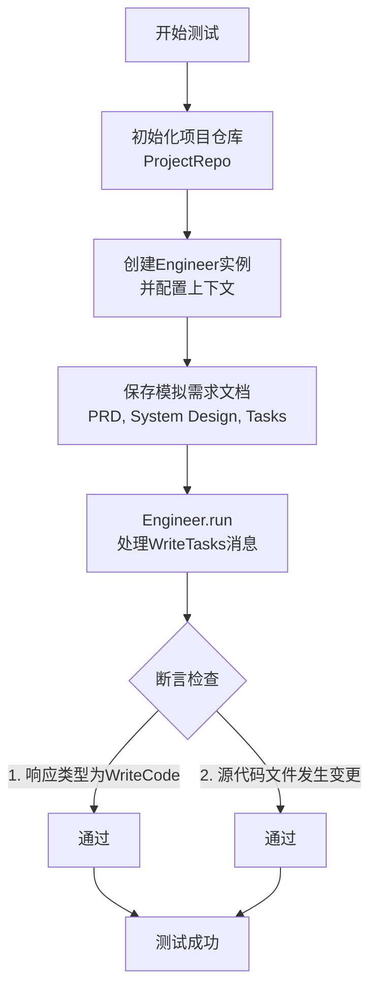

#### 带注释源码

```python
@pytest.mark.asyncio
async def test_engineer(context):
    # Prerequisites
    # 准备测试前提：生成一个请求编号，并基于测试上下文初始化项目仓库。
    rqno = "20231221155954.json"
    project_repo = ProjectRepo(context.config.project_path)

    # 设置engineer
    # 创建Engineer角色实例，并为其配置项目仓库和输入参数。
    engineer = Engineer(context=context)
    engineer.repo = project_repo
    engineer.input_args = SimpleNamespace(project_path=context.config.project_path)

    # 使用project_repo保存所需文件
    # 将模拟的各类文档（需求、产品设计、系统设计、任务列表）保存到项目仓库的相应位置。
    await project_repo.save(REQUIREMENT_FILENAME, content=MockMessages.req.content)
    await project_repo.docs.prd.save(rqno, content=MockMessages.prd.content)
    await project_repo.docs.system_design.save(rqno, content=MockMessages.system_design.content)
    await project_repo.docs.task.save(rqno, content=MockMessages.json_tasks.content)

    # 核心测试步骤：运行Engineer角色，向其发送一个由WriteTasks触发的空内容消息。
    rsp = await engineer.run(Message(content="", cause_by=WriteTasks))

    # 记录响应并执行断言验证。
    logger.info(rsp)
    # 断言1：验证工程师的响应是由WriteCode动作触发的。
    assert rsp.cause_by == any_to_str(WriteCode)
    # 断言2：验证在源代码工作区中有文件发生了变更。
    assert context.repo.with_src_path(context.src_workspace).srcs.changed_files
```

### `pytest.main`

`pytest.main` 是 Pytest 测试框架的入口函数，用于执行测试。它接收命令行参数，运行指定的测试，并返回退出码。

参数：

- `args`：`Optional[Union[List[str], PathLike[str]]]`，可选参数，指定要运行的测试路径、模块、类或方法，以及 Pytest 命令行选项。如果为 `None` 或未提供，则使用 `sys.argv[1:]`。
- `plugins`：`Optional[Sequence[Union[str, object]]]`，可选参数，指定要加载的插件列表。

返回值：`Union[int, ExitCode]`，返回退出码。`0` 表示所有测试通过，非 `0` 值表示测试失败或出现错误。

#### 流程图

```mermaid
flowchart TD
    A[开始] --> B[解析参数]
    B --> C{是否有参数?}
    C -->|是| D[使用传入的参数]
    C -->|否| E[使用 sys.argv[1:]]
    D --> F[配置 Pytest]
    E --> F
    F --> G[加载插件]
    G --> H[执行测试]
    H --> I[收集结果]
    I --> J[生成报告]
    J --> K[返回退出码]
    K --> L[结束]
```

#### 带注释源码

```python
def main(
    args: Optional[Union[List[str], PathLike[str]]] = None,
    plugins: Optional[Sequence[Union[str, object]]] = None,
) -> Union[int, ExitCode]:
    """
    执行 Pytest 测试的主函数。

    参数:
        args: 命令行参数列表或路径，用于指定测试和配置选项。
        plugins: 要加载的插件列表。

    返回值:
        退出码，0 表示成功，非 0 表示失败。
    """
    # 如果 args 为 None，则使用 sys.argv[1:] 作为默认参数
    if args is None:
        args = sys.argv[1:]

    # 配置 Pytest，加载插件并执行测试
    try:
        config = _prepare_config(args, plugins)
        return config.hook.pytest_cmdline_main(config=config)
    except UsageError as e:
        # 处理命令行参数错误
        print(f"UsageError: {e}")
        return ExitCode.USAGE_ERROR
    except Exception as e:
        # 处理其他异常
        print(f"Unexpected error: {e}")
        return ExitCode.INTERNAL_ERROR
```

### `any_to_name`

该函数用于将任意输入对象（如类、函数、实例等）转换为其名称的字符串表示。它通过检查对象的类型，优先返回`__name__`属性，如果不存在则回退到`__class__.__name__`，最后再尝试使用`str()`转换，确保始终返回一个字符串。

参数：
- `obj`：`Any`，任意需要获取名称的Python对象，如类、函数、实例等。

返回值：`str`，对象的名称字符串表示。

#### 流程图

```mermaid
flowchart TD
    A[开始: 输入对象obj] --> B{obj是否有__name__属性?}
    B -- 是 --> C[返回 obj.__name__]
    B -- 否 --> D{obj是否有__class__属性?}
    D -- 是 --> E[返回 obj.__class__.__name__]
    D -- 否 --> F[返回 str(obj)]
    C --> G[结束: 返回名称字符串]
    E --> G
    F --> G
```

#### 带注释源码

```python
def any_to_name(obj: Any) -> str:
    """
    将任意对象转换为其名称的字符串表示。
    
    处理逻辑:
    1. 如果对象有 __name__ 属性（如函数、类），则返回 obj.__name__
    2. 否则，如果对象有 __class__ 属性（如实例），则返回 obj.__class__.__name__
    3. 否则，返回 str(obj) 作为回退方案
    
    Args:
        obj: 任意需要获取名称的Python对象
        
    Returns:
        对象的名称字符串
    """
    # 优先使用对象的 __name__ 属性（适用于函数、类等）
    if hasattr(obj, "__name__"):
        return obj.__name__
    
    # 其次使用对象的类名（适用于实例对象）
    if hasattr(obj, "__class__"):
        return obj.__class__.__name__
    
    # 最后使用字符串表示作为回退
    return str(obj)
```

### `any_to_str`

该函数用于将任意输入对象（如类、函数、实例等）转换为一个可读的字符串表示形式，通常用于获取对象的名称或标识符。

参数：

- `obj`：`Any`，任意类型的输入对象，可以是类、函数、实例等。

返回值：`str`，返回输入对象的字符串表示形式，通常是对象的名称或标识符。

#### 流程图

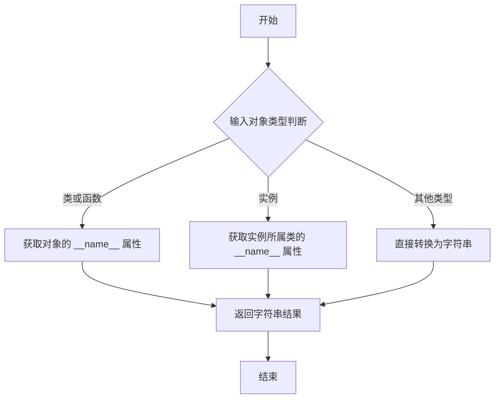

#### 带注释源码

```python
def any_to_str(obj: Any) -> str:
    """
    将任意对象转换为字符串表示形式。

    该函数处理多种类型的输入对象：
    1. 如果对象是类或函数，返回其 __name__ 属性。
    2. 如果对象是实例，返回其所属类的 __name__ 属性。
    3. 对于其他类型，直接使用 str() 转换为字符串。

    Args:
        obj (Any): 任意类型的输入对象。

    Returns:
        str: 对象的字符串表示形式。
    """
    if inspect.isclass(obj) or inspect.isfunction(obj):
        # 处理类和函数：返回其名称
        return obj.__name__
    elif hasattr(obj, '__class__'):
        # 处理实例：返回其所属类的名称
        return obj.__class__.__name__
    else:
        # 处理其他类型：直接转换为字符串
        return str(obj)
```

### `aread`

异步读取指定路径的文件内容，支持多种编码格式，并自动处理文件不存在的情况。

参数：

- `file_path`：`Union[str, Path]`，要读取的文件路径，可以是字符串或Path对象
- `encoding`：`str`，可选参数，默认为"utf-8"，指定文件的编码格式
- **kwargs：`Any`，其他传递给`open()`函数的参数

返回值：`str`，读取到的文件内容字符串

#### 流程图

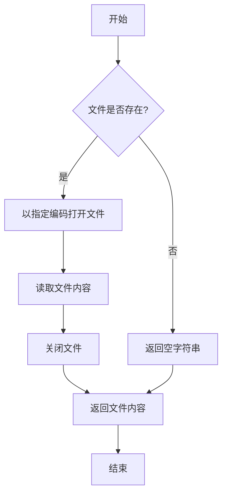

#### 带注释源码

```python
async def aread(file_path: Union[str, Path], encoding: str = "utf-8", **kwargs) -> str:
    """
    异步读取文件内容
    
    参数:
        file_path: 文件路径，可以是字符串或Path对象
        encoding: 文件编码，默认为utf-8
        **kwargs: 传递给open()函数的其他参数
        
    返回:
        文件内容字符串，如果文件不存在则返回空字符串
    """
    try:
        # 将路径转换为Path对象以确保一致性
        path = Path(file_path)
        
        # 使用异步方式打开文件并读取内容
        async with aiofiles.open(path, mode='r', encoding=encoding, **kwargs) as f:
            content = await f.read()
            return content
    except FileNotFoundError:
        # 文件不存在时返回空字符串，避免抛出异常
        logger.warning(f"File not found: {file_path}")
        return ""
    except UnicodeDecodeError as e:
        # 处理编码错误
        logger.error(f"Encoding error when reading {file_path}: {e}")
        # 尝试使用其他编码或返回空字符串
        return ""
```

### `awrite`

异步写入文件内容，支持字符串或字节数据。

参数：

- `file_path`：`Path`，目标文件的路径
- `content`：`Union[str, bytes]`，要写入的内容，可以是字符串或字节
- `encoding`：`str`，文件编码，默认为`"utf-8"`
- `errors`：`str`，编码错误处理方式，默认为`"strict"`

返回值：`None`，无返回值

#### 流程图

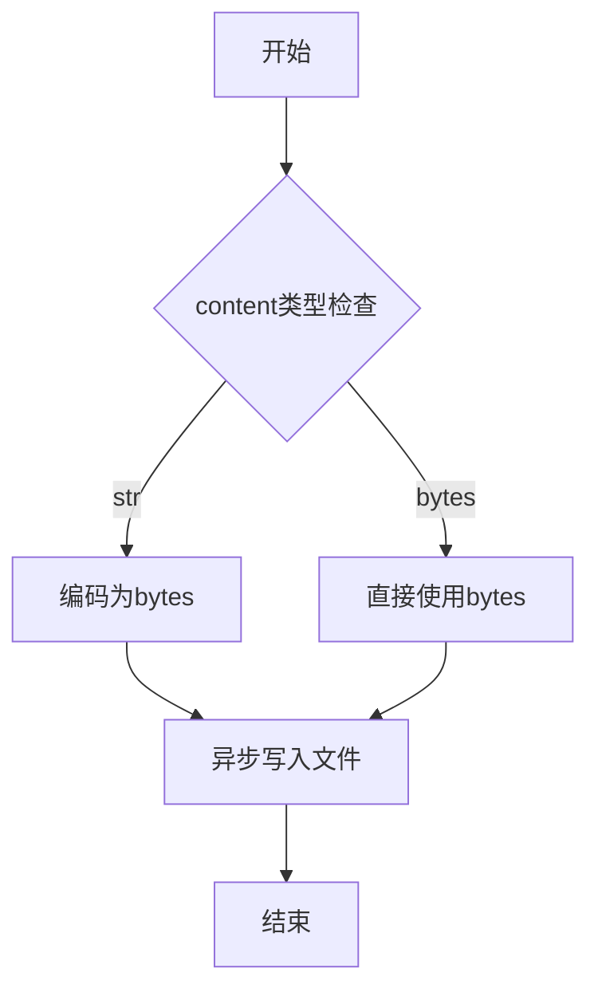

#### 带注释源码

```python
async def awrite(
    file_path: Path,
    content: Union[str, bytes],
    encoding: str = "utf-8",
    errors: str = "strict",
) -> None:
    """
    异步写入文件内容
    
    Args:
        file_path: 目标文件路径
        content: 要写入的内容，可以是字符串或字节
        encoding: 文件编码，默认为utf-8
        errors: 编码错误处理方式，默认为strict
    """
    # 确保父目录存在
    file_path.parent.mkdir(parents=True, exist_ok=True)
    
    # 根据内容类型处理
    if isinstance(content, str):
        # 字符串内容需要编码
        data = content.encode(encoding, errors)
    else:
        # 字节内容直接使用
        data = content
    
    # 异步写入文件
    async with aiofiles.open(file_path, "wb") as f:
        await f.write(data)
```

### `json.loads`

`json.loads` 是 Python 标准库 `json` 模块中的一个函数，用于将符合 JSON 格式的字符串（str）解析并转换为对应的 Python 对象（如字典、列表、字符串、数字等）。它是处理 JSON 数据反序列化的核心工具。

参数：

- `s`：`str`，需要被解析的 JSON 格式字符串。
- `*`：`object`，其他可选参数，用于控制解析行为，例如指定编码、对象钩子（object_hook）等，具体可参考官方文档。

返回值：`object`，返回解析后的 Python 对象。具体类型取决于 JSON 字符串的内容（例如，`{}` 解析为 `dict`，`[]` 解析为 `list`，字符串解析为 `str`，数字解析为 `int` 或 `float`，`true`/`false`/`null` 解析为 `True`/`False`/`None`）。

#### 流程图

```mermaid
graph TD
    A[开始: 调用 json.loads(s)] --> B{输入 s 是否为有效 JSON 字符串?};
    B -- 是 --> C[解析字符串为 Python 对象];
    C --> D[返回解析后的 Python 对象];
    B -- 否 --> E[抛出 json.JSONDecodeError 异常];
    E --> F[结束: 异常处理];
    D --> G[结束: 正常返回];
```

#### 带注释源码

```python
# 这是 json.loads 在 Python 标准库中的简化示意性源码，用于说明其核心逻辑。
# 实际实现更复杂，包含更多错误处理和性能优化。

def loads(s, *, cls=None, object_hook=None, parse_float=None,
          parse_int=None, parse_constant=None, object_pairs_hook=None, **kw):
    """
    将 JSON 字符串 `s` 反序列化为 Python 对象。

    参数:
        s: 要解码的 JSON 字符串。
        cls: 自定义的 JSON 解码器类。
        object_hook: 一个可选函数，用于自定义字典对象的解码。
        parse_float: 一个可选函数，用于解码浮点数。
        parse_int: 一个可选函数，用于解码整数。
        parse_constant: 一个可选函数，用于解码 JSON 常量（如 -Infinity, NaN）。
        object_pairs_hook: 一个可选函数，用于处理解码出的键值对列表。
        **kw: 其他关键字参数，传递给解码器。

    返回:
        解码后的 Python 对象。

    抛出:
        JSONDecodeError: 如果 `s` 不是有效的 JSON 字符串。
    """
    # 1. 检查输入类型
    if not isinstance(s, str):
        raise TypeError(f'the JSON object must be str, not {s.__class__.__name__}')

    # 2. 如果没有指定自定义解码器，则使用默认的 JSONDecoder
    if cls is None:
        cls = JSONDecoder

    # 3. 使用指定的解码器（或默认解码器）进行解码
    #    解码器内部会处理字符串扫描、词法分析、语法分析等步骤，
    #    并根据 JSON 语法规则构建对应的 Python 对象。
    return cls(
        object_hook=object_hook,
        parse_float=parse_float,
        parse_int=parse_int,
        parse_constant=parse_constant,
        object_pairs_hook=object_pairs_hook,
        **kw
    ).decode(s)  # decode 方法是实际执行解析的核心
```

### `Engineer.run`

Engineer.run 是 Engineer 角色的主要执行方法，它接收一个消息作为输入，根据消息类型触发工程师的工作流程，最终返回一个表示代码编写动作完成的消息。

参数：

- `message`：`Message`，触发工程师执行的消息，通常包含任务列表或相关上下文信息。

返回值：`Message`，返回一个消息，其内容为代码编写的结果，原因字段设置为 WriteCode，表示该消息由代码编写动作产生。

#### 流程图

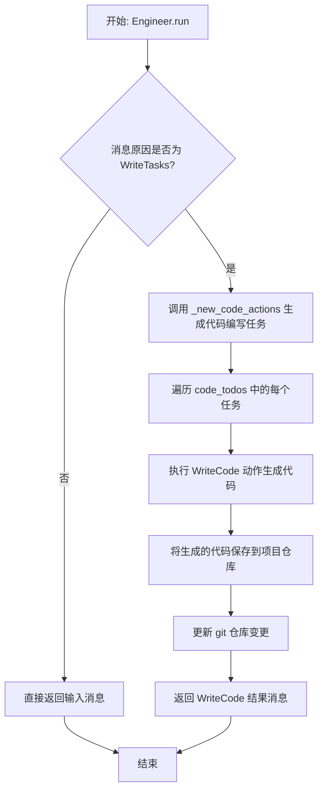

#### 带注释源码

```python
async def run(self, message: Message) -> Message:
    """
    工程师的主要执行方法。
    如果消息是由 WriteTasks 触发的，则生成代码编写任务并执行。
    否则，直接返回输入的消息。
    """
    if message.cause_by == WriteTasks:
        # 生成新的代码编写任务列表
        await self._new_code_actions()
        # 遍历所有代码编写任务
        for todo in self.code_todos:
            # 执行 WriteCode 动作生成代码
            code = await WriteCode(context=self.context).run(todo.dict())
            # 将生成的代码保存到项目仓库
            await self.repo.with_src_path(self.context.src_workspace).srcs.save(
                filename=todo.filename, content=code
            )
            # 更新 git 仓库的变更记录
            self.context.git_repo.add_change({todo.filename: ChangeType.ADD})
        # 提交代码变更到 git 仓库
        self.context.git_repo.commit("code done")
        # 返回一个表示代码编写完成的消息
        return Message(content="", cause_by=WriteCode)
    # 如果消息不是由 WriteTasks 触发的，直接返回原消息
    return message
```

### `Engineer._new_coding_doc`

该方法用于为指定的代码文件创建一个新的编码上下文文档。它通过读取相关的系统设计文档和任务文档，结合依赖关系，生成一个包含设计、任务和代码信息的`CodingContext`对象，并将其序列化为JSON格式保存到文档存储中。

参数：

- `filename`：`str`，要创建编码文档的代码文件名。
- `dependency`：`Dependency`，项目的依赖关系对象，用于获取代码文件的依赖信息。

返回值：`Document`，返回一个`Document`对象，其内容为序列化后的`CodingContext` JSON字符串。

#### 流程图

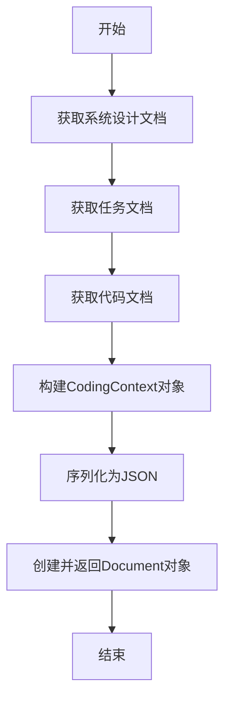

#### 带注释源码

```python
async def _new_coding_doc(
    self,
    filename: str,
    dependency: Dependency,
) -> Document:
    """
    为指定的代码文件创建一个新的编码上下文文档。

    该方法执行以下步骤：
    1. 从文档存储中读取系统设计文档。
    2. 从文档存储中读取任务文档。
    3. 从源代码存储中读取代码文档（如果存在）。
    4. 使用这些文档和依赖关系构建一个CodingContext对象。
    5. 将CodingContext对象序列化为JSON字符串。
    6. 创建一个新的Document对象，包含该JSON字符串作为内容。

    Args:
        filename (str): 要创建编码文档的代码文件名。
        dependency (Dependency): 项目的依赖关系对象。

    Returns:
        Document: 包含序列化CodingContext的Document对象。
    """
    # 从文档存储中获取系统设计文档
    design_doc = await self.repo.docs.system_design.get(filename)
    # 从文档存储中获取任务文档
    task_doc = await self.repo.docs.task.get(filename)
    # 从源代码存储中获取代码文档（如果存在）
    code_doc = await self.repo.with_src_path(self.context.src_workspace).srcs.get(filename)

    # 构建CodingContext对象
    ctx = CodingContext(
        filename=filename,
        design_doc=design_doc,
        task_doc=task_doc,
        code_doc=code_doc,
        dependencies=dependency.get_dependencies(filename),
    )

    # 将CodingContext对象序列化为JSON字符串
    content = ctx.model_dump_json()
    # 创建并返回一个新的Document对象
    return Document(content=content)
```

### `Engineer._new_code_actions`

该方法用于为工程师角色生成新的代码编写任务。它通过分析项目中的任务文档，识别出需要编写的代码文件列表，并为每个文件创建一个`WriteCode`动作，添加到工程师的待办事项中。

参数：

-  `self`：`Engineer`，工程师实例自身

返回值：`None`，无返回值

#### 流程图

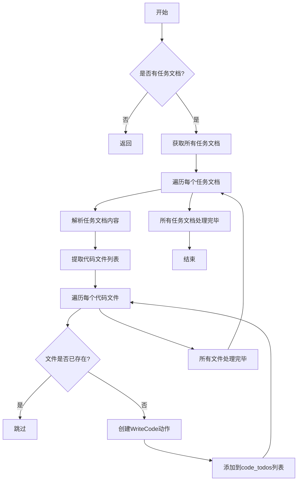

#### 带注释源码

```python
async def _new_code_actions(self):
    """
    为工程师角色生成新的代码编写任务。
    该方法会检查所有任务文档，解析出需要编写的代码文件列表，并为每个尚未存在的文件创建一个WriteCode动作。
    """
    # 获取所有任务文档
    task_docs = await self.repo.docs.task.get_all()
    for task_doc in task_docs:
        # 解析任务文档内容，提取代码文件列表
        tasks = CodeParser.parse_file_list("Task list", task_doc.content)
        for task in tasks:
            # 检查文件是否已存在，如果不存在则创建新的代码编写任务
            if not self.repo.with_src_path(self.context.src_workspace).srcs.exists(task):
                # 创建WriteCode动作，并添加到待办事项列表
                await self._new_code_action(task, task_doc)
```

### `ProjectRepo.save`

该方法用于将指定内容保存到项目仓库的指定文件中。它是一个异步方法，负责将内容写入文件，并处理相关的文件系统操作。

参数：

- `filename`：`str`，要保存的文件名，包括路径（相对于项目仓库的根目录）
- `content`：`str`，要写入文件的内容
- `dependencies`：`Optional[List[str]]`，可选参数，指定文件的依赖关系列表

返回值：`None`，无返回值

#### 流程图

```mermaid
graph TD
    A[开始] --> B[检查filename是否为空]
    B --> C{filename为空?}
    C -->|是| D[抛出ValueError异常]
    C -->|否| E[构建完整文件路径]
    E --> F[确保文件所在目录存在]
    F --> G[将内容写入文件]
    G --> H[更新依赖关系（如果提供）]
    H --> I[结束]
```

#### 带注释源码

```python
async def save(self, filename: str, content: str, dependencies: Optional[List[str]] = None) -> None:
    """
    保存内容到指定文件
    
    Args:
        filename: 文件名（可以包含路径）
        content: 要保存的内容
        dependencies: 可选的依赖文件列表
    """
    # 检查文件名是否有效
    if not filename:
        raise ValueError("Filename cannot be empty")
    
    # 构建完整的文件路径
    file_path = self.workdir / filename
    
    # 确保文件所在目录存在
    file_path.parent.mkdir(parents=True, exist_ok=True)
    
    # 将内容写入文件
    await awrite(file_path, content)
    
    # 如果有依赖关系，更新依赖管理
    if dependencies:
        await self._update_dependencies(filename, dependencies)
```

### `CodingContext.model_validate_json`

该方法是一个类方法，用于将JSON字符串反序列化为`CodingContext`模型实例。它继承自Pydantic的`BaseModel`，用于验证和解析JSON数据，确保数据符合`CodingContext`类定义的字段类型和约束。

参数：

- `data`：`str | bytes | bytearray`，包含JSON数据的字符串、字节或字节数组。

返回值：`CodingContext`，返回一个根据JSON数据创建的`CodingContext`实例。

#### 流程图

```mermaid
flowchart TD
    A[开始] --> B[接收JSON数据]
    B --> C{数据验证}
    C -->|验证成功| D[创建CodingContext实例]
    C -->|验证失败| E[抛出ValidationError异常]
    D --> F[返回实例]
    E --> G[结束]
    F --> G
```

#### 带注释源码

```python
@classmethod
def model_validate_json(
    cls,
    data: str | bytes | bytearray,
    *,
    strict: bool | None = None,
    context: dict[str, Any] | None = None,
    **kwargs,
) -> CodingContext:
    """
    将JSON字符串反序列化为CodingContext模型实例。
    
    参数：
        data: 包含JSON数据的字符串、字节或字节数组。
        strict: 是否启用严格模式验证（可选）。
        context: 额外的上下文信息（可选）。
        **kwargs: 其他关键字参数。
    
    返回值：
        CodingContext: 根据JSON数据创建的CodingContext实例。
    
    异常：
        ValidationError: 如果JSON数据不符合模型定义，则抛出验证错误。
    """
    # 调用父类BaseModel的model_validate_json方法进行JSON解析和验证
    return super().model_validate_json(data, strict=strict, context=context, **kwargs)
```

### `CodeParser.parse_str`

该方法用于从给定的文本中解析出指定序号的字符串块。它通过识别文本中的特定标记（如序号）来提取对应的字符串内容。

参数：

- `block`：`str`，要解析的文本块序号或标识符。
- `text`：`str`，包含多个字符串块的完整文本。

返回值：`str`，解析出的字符串内容。

#### 流程图

```mermaid
graph TD
    A[开始] --> B[输入 block 和 text]
    B --> C[在 text 中查找 block 对应的内容]
    C --> D{是否找到?}
    D -- 是 --> E[提取并返回字符串]
    D -- 否 --> F[返回空字符串或抛出异常]
    E --> G[结束]
    F --> G
```

#### 带注释源码

```python
@staticmethod
def parse_str(block: str, text: str) -> str:
    """
    从文本中解析出指定序号的字符串块。
    
    参数:
        block (str): 要解析的文本块序号或标识符。
        text (str): 包含多个字符串块的完整文本。
    
    返回:
        str: 解析出的字符串内容。
    """
    # 使用正则表达式查找 block 对应的内容
    pattern = rf'"{block}"\s*:\s*"([^"]+)"'
    match = re.search(pattern, text)
    if match:
        return match.group(1)
    else:
        # 如果未找到，返回空字符串或根据需求抛出异常
        return ""
```

### `CodeParser.parse_blocks`

该方法用于解析包含多个代码块的文本，将其拆分为一个字典，其中键是代码块的标题，值是代码块的内容。它通过识别特定的标记（如 `##` 或 ````）来划分不同的代码块。

参数：
- `text`：`str`，包含多个代码块的原始文本。
- `lang`：`str`，可选参数，指定代码块的语言类型（如 `python`），默认为空字符串。

返回值：`dict`，返回一个字典，键为代码块的标题，值为对应代码块的内容。

#### 流程图

```mermaid
graph TD
    A[开始] --> B[初始化空字典 blocks 和空字符串 current_block]
    B --> C[按行分割文本]
    C --> D[遍历每一行]
    D --> E{行是否以 '##' 开头?}
    E -->|是| F[提取标题并作为新键存入 blocks]
    E -->|否| G{行是否以 '```' 开头?}
    G -->|是| H[切换代码块状态]
    H --> I[将行内容添加到当前代码块]
    G -->|否| I
    I --> J[继续遍历下一行]
    J --> D
    D --> K[遍历结束]
    K --> L[返回 blocks 字典]
    L --> M[结束]
```

#### 带注释源码

```python
@classmethod
def parse_blocks(cls, text: str, lang: str = "") -> dict:
    """
    解析包含多个代码块的文本，返回一个字典，键为代码块标题，值为代码块内容。
    
    :param text: 包含多个代码块的原始文本
    :param lang: 代码块的语言类型（如 'python'），默认为空字符串
    :return: 字典，键为代码块标题，值为代码块内容
    """
    # 初始化结果字典和当前代码块变量
    blocks = cls.parse_block("", text, lang=lang)
    current_block = ""
    
    # 按行分割文本
    for line in text.split("\n"):
        # 检查是否为标题行（以 '##' 开头）
        if line.startswith("##"):
            # 提取标题并作为新键存入字典
            current_block = line.strip("##").strip()
            blocks[current_block] = ""
        # 检查是否为代码块开始或结束标记（以 '```' 开头）
        elif line.startswith("```"):
            # 切换代码块状态（开始或结束）
            pass
        else:
            # 将行内容添加到当前代码块
            if current_block:
                blocks[current_block] += line + "\n"
    
    # 去除每个代码块内容末尾的空白字符
    for k, v in blocks.items():
        blocks[k] = v.strip()
    
    return blocks
```

### `CodeParser.parse_file_list`

该方法用于从给定的文本中解析出指定代码块（block）的文件列表。它通过调用`parse_blocks`方法获取所有代码块，然后从指定块中提取文件列表，并返回一个字符串列表。

参数：

- `block`：`str`，要解析的代码块名称，例如"Task list"
- `text`：`str`，包含代码块的原始文本

返回值：`list`，解析出的文件路径字符串列表

#### 流程图

```mermaid
graph TD
    A[开始] --> B[调用parse_blocks解析所有代码块]
    B --> C{指定block是否存在?}
    C -->|是| D[获取指定block的内容]
    C -->|否| E[返回空列表]
    D --> F[按行分割内容]
    F --> G[去除每行首尾空白字符]
    G --> H[过滤掉空行和注释行]
    H --> I[返回文件路径列表]
    E --> J[结束]
    I --> J
```

#### 带注释源码

```python
@staticmethod
def parse_file_list(block: str, text: str) -> list:
    """
    解析指定代码块中的文件列表
    
    参数:
        block: 要解析的代码块名称
        text: 包含代码块的原始文本
        
    返回:
        文件路径字符串列表
    """
    # 首先解析所有代码块
    blocks = CodeParser.parse_blocks(text)
    
    # 检查指定的block是否存在
    if block not in blocks:
        return []
    
    # 获取指定block的内容
    block_text = blocks[block]
    
    # 按行分割并处理每行
    files = []
    for line in block_text.split('\n'):
        # 去除首尾空白字符
        line = line.strip()
        
        # 跳过空行和注释行
        if not line or line.startswith('#'):
            continue
            
        # 移除可能的引号和逗号
        line = line.strip('", ')
        
        # 添加到文件列表
        if line:
            files.append(line)
    
    return files
```

### `CodeParser.parse_code`

该方法用于从给定的文本中解析出指定代码块的内容，并返回该代码块的字符串表示。它通过识别文本中的特定标记（如代码块开始和结束标记）来提取代码，并支持指定编程语言以进行适当的格式化。

参数：

- `block`：`str`，要解析的代码块的名称或标识符。
- `text`：`str`，包含代码块的原始文本。
- `lang`：`str`，代码块使用的编程语言（例如 "python"），用于格式化输出。

返回值：`str`，解析后的代码块内容，以字符串形式返回。

#### 流程图

```mermaid
graph TD
    A[开始] --> B[输入参数 block, text, lang]
    B --> C[调用 parse_blocks 方法解析文本]
    C --> D{解析结果中是否包含指定 block?}
    D -->|是| E[获取指定 block 的内容]
    D -->|否| F[返回空字符串]
    E --> G[调用 parse_str 方法格式化代码]
    G --> H[返回格式化后的代码字符串]
    F --> H
    H --> I[结束]
```

#### 带注释源码

```python
def parse_code(block: str, text: str, lang: str) -> str:
    """
    解析文本中指定代码块的内容。

    参数:
        block (str): 要解析的代码块的名称或标识符。
        text (str): 包含代码块的原始文本。
        lang (str): 代码块使用的编程语言（例如 "python"），用于格式化输出。

    返回值:
        str: 解析后的代码块内容，以字符串形式返回。
    """
    # 调用 parse_blocks 方法解析文本，获取所有代码块
    blocks = parse_blocks(text)
    
    # 检查指定的代码块是否存在
    if block not in blocks:
        # 如果不存在，返回空字符串
        return ""
    
    # 获取指定代码块的内容
    code = blocks[block]
    
    # 调用 parse_str 方法格式化代码，并返回结果
    return parse_str(lang, code)
```

## 关键组件


### 测试框架与工具

使用pytest框架进行异步和同步测试，包含测试用例的组织、断言和日志记录。

### 角色与动作

定义了Engineer角色及其关联的WriteCode和WriteTasks动作，用于模拟代码生成和任务处理流程。

### 消息处理

基于RFC 116规范的消息分发机制，用于在角色间传递和处理包含需求、设计、任务等信息的消息。

### 项目仓库管理

通过ProjectRepo和GitRepository管理项目文件结构、版本控制和依赖关系，支持文件的保存、读取和变更跟踪。

### 代码解析器

提供CodeParser工具，用于从文本中解析特定格式的字符串、代码块和文件列表，支持自动化代码生成任务。

### 上下文管理

使用CodingContext封装代码生成所需的上下文信息，包括设计文档、任务文档和代码文档，支持序列化和反序列化。

### 模拟数据与依赖注入

通过MockMessages和模拟文件提供测试所需的初始数据，并使用依赖注入（如context）配置测试环境。


## 问题及建议


### 已知问题

-   **测试数据与逻辑耦合**：测试用例 `test_engineer` 和 `test_new_coding_context` 中嵌入了大量的数据准备和文件操作逻辑（如保存需求、设计、任务等文件），使得测试用例冗长且难以维护。测试的核心逻辑（验证Engineer角色的行为）被淹没在环境搭建的细节中。
-   **硬编码的测试数据**：测试中使用了硬编码的文件名（如 `rqno = "20231221155954.json"`）和路径（如 `demo_path = Path(__file__).parent / "../../data/demo_project"`）。这降低了测试的灵活性，当项目结构或命名约定改变时，需要同步修改多个测试用例。
-   **资源清理不彻底**：在 `test_new_coding_context` 的最后，虽然调用了 `context.git_repo.delete_repository()` 来清理Git仓库，但测试过程中在项目目录（`context.config.project_path`）下创建的其他文件（如通过 `project_repo.save` 保存的文件）可能未被清理，存在污染后续测试环境的风险。
-   **异步测试的潜在问题**：测试用例大量使用 `pytest.mark.asyncio` 和 `async/await`，但测试框架对异步任务的生命周期管理可能不完善。例如，在测试失败或异常时，某些异步操作可能未被正确等待或取消，导致资源泄漏或不可预测的行为。
-   **Mock对象使用不足**：测试严重依赖真实的 `ProjectRepo`、`GitRepository` 等外部组件。虽然使用了 `MockMessages`，但对于文件系统操作、Git操作等更底层的依赖没有进行充分的Mock，导致测试运行慢，且受外部环境（如Git配置、文件权限）影响。

### 优化建议

-   **重构测试夹具（Fixtures）**：将测试用例中重复的数据准备和清理逻辑（如创建项目目录、初始化仓库、写入特定文件）提取到 `pytest` 的 `fixture` 中。例如，可以创建 `project_repo_with_data` 或 `initialized_engineer_context` 等夹具，使测试用例更专注于行为验证，提高代码复用性和可读性。
-   **使用临时目录和依赖注入**：利用 `pytest` 的 `tmp_path` 夹具为每个测试用例创建独立的临时工作目录，从根本上避免测试间的相互干扰。同时，考虑通过构造函数或设置方法将 `ProjectRepo`、`GitRepository` 等依赖注入到 `Engineer` 实例中，以便在测试中轻松替换为Mock对象。
-   **增强Mock和桩（Stub）的使用**：对 `ProjectRepo.save`、`awrite`、`aread`、`GitRepository` 的方法等外部IO操作进行Mock。可以使用 `unittest.mock.AsyncMock` 来模拟异步方法。这可以使测试更快、更稳定，并明确测试的边界。
-   **分离数据与逻辑**：将测试数据（如 `STRS_FOR_PARSING`、`TASKS`、`target_list`、`target_code`）提取到独立的JSON或YAML文件中。测试用例读取这些文件来获取数据。这样便于统一管理测试数据，并在数据需要更新时，只需修改数据文件而非代码。
-   **增加负面测试用例**：当前的测试主要验证了正常路径（Happy Path）。建议增加测试用例来覆盖异常和边界情况，例如：当输入消息格式不正确时、当依赖文件缺失时、当代码解析失败时 `Engineer` 的行为是否符合预期（如抛出特定异常或记录错误）。
-   **优化测试断言**：部分断言可以更加精确。例如，在 `test_engineer` 中，除了检查 `rsp.cause_by`，还可以验证 `rsp` 的具体内容或 `engineer` 内部状态的变化。在 `test_parse_*` 系列测试中，可以使用参数化测试（`@pytest.mark.parametrize`）来更清晰地组织多组输入输出对的验证。
-   **明确测试清理步骤**：确保每个可能创建外部资源的测试用例都有一个对应的、可靠的清理阶段（`teardown`）。除了删除Git仓库，还应考虑删除测试中创建的所有临时文件和目录。可以将清理逻辑也封装到 `fixture` 中，并利用 `yield` 或 `addfinalizer` 确保其执行。


## 其它


### 设计目标与约束

本测试模块旨在验证 `Engineer` 角色及其相关组件（如 `CodeParser`、`ProjectRepo`）在模拟的软件项目开发环境中的核心功能。主要设计目标包括：1) 验证工程师角色能够正确接收上游任务（如 `WriteTasks`）并触发代码编写动作（`WriteCode`）；2) 测试 `CodeParser` 工具类从结构化文本中提取字符串、代码块和文件列表的能力；3) 验证在给定设计文档和任务列表的上下文中，工程师能够正确创建新的编码上下文（`CodingContext`）并管理待办事项（`code_todos`）。约束条件包括：测试依赖于特定的模拟数据（`MockMessages`）和临时项目仓库，需要确保测试的隔离性和可重复性，避免对实际文件系统造成持久化影响。

### 错误处理与异常设计

测试用例本身主要使用 `assert` 语句进行验证，测试失败时会抛出 `AssertionError`。对于异步操作（如 `engineer.run`），使用 `pytest.mark.asyncio` 装饰器进行管理。在 `test_new_coding_context` 测试中，通过 `try...finally` 块确保测试结束后清理临时创建的 Git 仓库（`context.git_repo.delete_repository()`），这是一种资源清理模式。代码中未显式展示针对网络超时、文件读写失败或数据解析错误等异常情况的处理，这些通常由底层的 `metagpt` 框架或 `pytest` 测试运行器捕获和处理。测试设计侧重于“快乐路径”，即预期成功场景的验证。

### 数据流与状态机

测试中的数据流起始于预置的模拟消息（`MockMessages`），包含需求、产品设计、系统设计和任务列表。这些数据通过 `ProjectRepo` 被写入模拟的项目文档仓库中。`Engineer` 角色被实例化并赋予此上下文后，其 `run` 方法被触发，处理一个空的 `Message`（但其 `cause_by` 为 `WriteTasks`）。这模拟了工程师接收到来自项目经理（或类似角色）的任务分配事件。工程师内部状态据此变化，最终应产生一个 `cause_by` 为 `WriteCode` 的响应消息，并导致源代码目录下的文件发生变更。在 `test_new_coding_context` 中，数据流更复杂：从外部 JSON 文件加载依赖、设计和任务数据 -> 写入项目仓库 -> 工程师创建 `CodingContext` 文档 -> 提交更改到 Git -> 保存模拟代码文件 -> 工程师更新内部 `code_todos` 状态。整个流程模拟了从设计到代码待办项生成的状态转换。

### 外部依赖与接口契约

1.  **`pytest` 框架**：用于组织测试用例、管理异步测试和断言。
2.  **`metagpt` 核心模块**：
    *   `Engineer` 类：被测角色，其 `run`、`_new_coding_doc`、`_new_code_actions` 方法的行为和返回值是测试验证的重点。
    *   `WriteCode`, `WriteTasks` 动作类：作为消息的 `cause_by` 类型，定义了角色间通信的契约。
    *   `CodeParser` 工具类：提供 `parse_str`、`parse_blocks`、`parse_file_list`、`parse_code` 等静态方法，其输入输出格式是测试验证的契约。
    *   `ProjectRepo` 与 `GitRepository`：提供项目文件存储和版本管理抽象。测试依赖于它们提供的 `save`、`get_dependency`、`add_change`、`commit` 等接口来设置环境和验证结果。
    *   `Message`、`CodingContext` 等 Schema 类：定义了数据交换的结构。
3.  **模拟数据** (`MockMessages`, `STRS_FOR_PARSING`, `TASKS`)：作为测试的输入，其格式必须符合被测试组件预期的契约。
4.  **文件系统路径** (`context.config.project_path`, `demo_path`)：测试依赖于临时或预定义的目录结构来运行。

### 测试策略与覆盖范围

测试采用分层策略：
*   **单元测试**：如 `test_parse_str`、`test_parse_blocks`、`test_parse_file_list`、`test_parse_code`、`test_todo`，针对 `CodeParser` 和 `Engineer` 的简单属性进行独立验证。
*   **集成测试**：如 `test_engineer` 和 `test_new_coding_context`，将 `Engineer` 角色置于包含 `ProjectRepo`、`GitRepository` 和模拟数据的完整上下文中，测试多个组件的协作。`test_engineer` 验证工程师角色对上游任务的响应和代码编写动作的触发。`test_new_coding_context` 更复杂，验证了从设计文档到生成具体文件编码上下文及待办事项的完整工作流。
覆盖范围包括核心的业务逻辑（消息处理、解析、上下文生成）、状态管理（`code_todos`）以及与项目仓库的交互。测试通过检查输出消息的类型、文件变更状态、解析结果的一致性以及内部状态的变化来确认功能正确性。

    