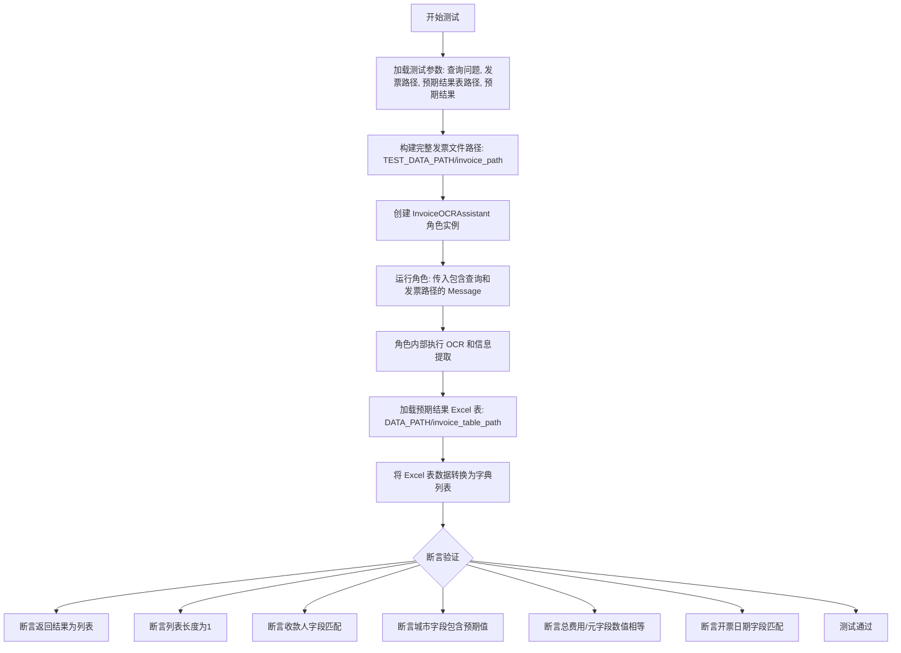
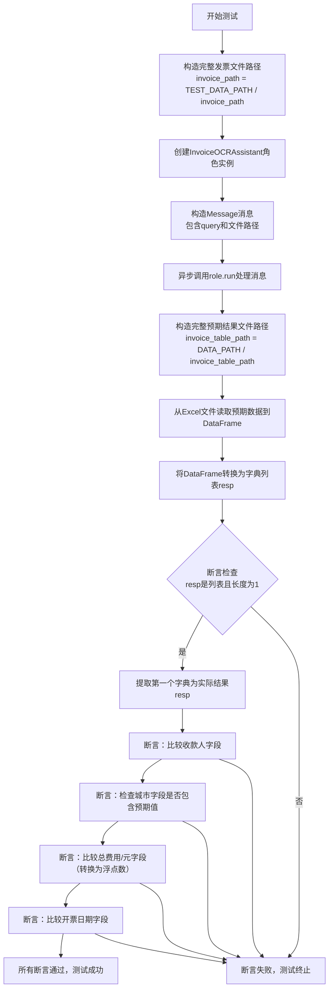
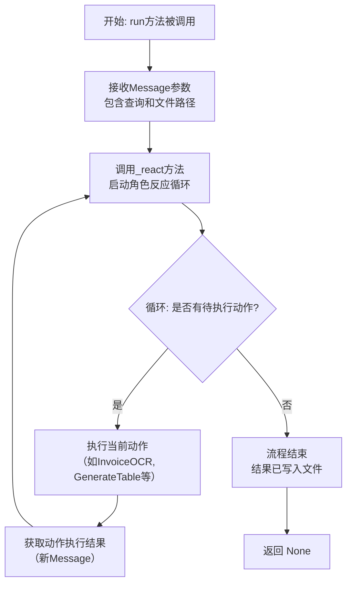

# `.\MetaGPT\tests\metagpt\roles\test_invoice_ocr_assistant.py` 详细设计文档

该文件是一个使用 pytest 框架编写的异步单元测试，用于测试 InvoiceOCRAssistant 角色的功能。它通过模拟不同的发票文件（PDF、PNG、JPG）和对应的查询问题，验证角色能否正确地从发票中提取指定信息（如收款人、城市、总费用、开票日期），并与预定义的 Excel 表格中的预期结果进行比对，从而确保发票 OCR 助手的准确性和可靠性。

## 整体流程



## 类结构

```
测试文件 (test_invoice_ocr_assistant.py)
├── 导入模块 (pytest, pathlib, pandas, metagpt 相关模块)
├── 测试函数 (test_invoice_ocr_assistant)
│   └── 使用 @pytest.mark.asyncio 和 @pytest.mark.parametrize 装饰器
└── 外部依赖类
    ├── InvoiceOCRAssistant (来自 metagpt.roles.invoice_ocr_assistant)
    ├── InvoicePath (来自 metagpt.roles.invoice_ocr_assistant)
    └── Message (来自 metagpt.schema)
```

## 全局变量及字段


### `DATA_PATH`
    
项目数据目录的路径常量，用于存储和读取数据文件

类型：`Path`
    


### `TEST_DATA_PATH`
    
测试数据目录的路径常量，专门用于存放测试相关的数据文件

类型：`Path`
    


### `InvoicePath.file_path`
    
发票文件的路径，用于指定需要处理的发票文件

类型：`Path`
    


### `Message.content`
    
消息的内容，通常包含用户查询或指令的文本信息

类型：`str`
    


### `Message.instruct_content`
    
消息的指令内容，用于传递结构化数据如发票路径

类型：`InvoicePath`
    
    

## 全局函数及方法

### `test_invoice_ocr_assistant`

这是一个使用 `pytest` 框架编写的异步测试函数，用于测试 `InvoiceOCRAssistant` 角色处理发票OCR识别的功能。该测试通过参数化输入不同的发票文件路径和预期结果，验证角色能否正确地从发票中提取指定信息（如收款人、城市、总费用、开票日期），并将提取结果与预存的Excel表格数据进行比对。

参数：
- `query`：`str`，查询字符串，用于指定需要从发票中提取的信息类型（例如“开票日期”）。
- `invoice_path`：`Path`，发票文件的相对路径，指向测试数据目录下的发票文件（如PDF、PNG、JPG格式）。
- `invoice_table_path`：`Path`，预期结果文件的相对路径，指向数据目录下存储预期提取结果的Excel文件。
- `expected_result`：`dict`，一个字典，包含测试用例期望的提取结果，用于与OCR处理后的实际结果进行比对。
- `context`：`pytest` 测试上下文对象，用于提供测试运行时的环境信息（如依赖注入）。

返回值：`None`，该函数不返回任何值，其核心功能是通过 `assert` 语句验证测试结果，测试失败时会抛出 `AssertionError`。

#### 流程图



#### 带注释源码

```python
async def test_invoice_ocr_assistant(
    query: str, invoice_path: Path, invoice_table_path: Path, expected_result: dict, context
):
    # 步骤1: 将传入的相对路径与测试数据根目录拼接，得到发票文件的绝对路径。
    invoice_path = TEST_DATA_PATH / invoice_path
    # 步骤2: 使用传入的context创建InvoiceOCRAssistant角色实例。
    role = InvoiceOCRAssistant(context=context)
    # 步骤3: 异步执行角色的run方法。传入一个Message对象，其内容为查询字符串，
    #        instruct_content属性是一个InvoicePath对象，包含了要处理的发票文件路径。
    await role.run(Message(content=query, instruct_content=InvoicePath(file_path=invoice_path)))
    # 步骤4: 将传入的相对路径与数据根目录拼接，得到预期结果Excel文件的绝对路径。
    invoice_table_path = DATA_PATH / invoice_table_path
    # 步骤5: 使用pandas读取Excel文件，数据加载到DataFrame中。
    df = pd.read_excel(invoice_table_path)
    # 步骤6: 将DataFrame转换为一个字典列表，每个字典代表一行数据。
    resp = df.to_dict(orient="records")
    # 断言1: 验证resp是一个列表。
    assert isinstance(resp, list)
    # 断言2: 验证resp列表的长度为1（预期每个测试用例的Excel只有一行数据）。
    assert len(resp) == 1
    # 步骤7: 从列表中取出第一个（也是唯一一个）字典作为实际提取的结果。
    resp = resp[0]
    # 断言3: 比较实际结果与预期结果中的“收款人”字段是否完全相等。
    assert expected_result["收款人"] == resp["收款人"]
    # 断言4: 检查预期结果中的“城市”字段是否包含在实际结果的“城市”字段中（使用`in`操作符，允许实际结果包含更多信息）。
    assert expected_result["城市"] in resp["城市"]
    # 断言5: 比较实际结果与预期结果中的“总费用/元”字段。先将两者都转换为浮点数再比较，以避免数据类型差异。
    assert float(expected_result["总费用/元"]) == float(resp["总费用/元"])
    # 断言6: 比较实际结果与预期结果中的“开票日期”字段是否完全相等。
    assert expected_result["开票日期"] == resp["开票日期"]
    # 如果所有断言都通过，则测试函数执行完毕，表示测试成功。
```

### `InvoiceOCRAssistant.run`

该方法是一个异步方法，是`InvoiceOCRAssistant`角色的核心执行入口。它接收一个包含用户查询和发票文件路径的消息，驱动整个发票OCR识别和信息提取流程。该方法会协调内部动作（Action）的执行，包括从PDF/图片中提取文本、解析文本以结构化信息，以及将结果存储到Excel表格中，最终返回处理结果。

参数：
- `self`：`InvoiceOCRAssistant`，`InvoiceOCRAssistant`类实例自身。
- `message`：`Message`，一个消息对象，其`content`属性包含用户的查询（如“Invoicing date”），`instruct_content`属性是一个`InvoicePath`对象，其中包含待处理发票文件的路径。

返回值：`None`，此方法不直接返回值。处理结果（提取的结构化发票信息）会被写入到指定的Excel文件中。

#### 流程图



#### 带注释源码

```python
# 注意：以下源码是基于对`InvoiceOCRAssistant`类及其父类`Role`的通用行为推断而来。
# 实际的`run`方法可能直接继承自父类或略有不同，但核心流程一致。

async def run(self, message: Message) -> None:
    """
    运行角色的主要异步方法。
    它启动一个反应循环，处理传入的消息，执行一系列动作（Actions），
    直到没有更多动作需要执行为止。

    Args:
        message (Message): 初始消息，包含用户指令和发票文件路径信息。

    Returns:
        None: 该方法不返回任何值，处理结果通过动作链最终写入文件。
    """
    # 调用父类或自身的_react方法，传入初始消息，开始处理流程。
    # _react方法会管理内部状态，并按顺序触发配置好的动作（如InvoiceOCR, GenerateTable）。
    await self._react(message)
    # 流程结束后，方法返回None。所有提取的数据已在动作执行过程中保存。
    return None
```

## 关键组件


### InvoiceOCRAssistant

一个用于处理发票OCR（光学字符识别）的智能助手角色，能够接收包含发票文件路径的查询消息，执行OCR处理，并将提取的结构化数据（如收款人、城市、总费用、开票日期）存储到指定的数据表中。

### InvoicePath

一个数据结构（可能是一个Pydantic模型或数据类），用于封装发票文件的路径信息，作为消息内容的一部分传递给`InvoiceOCRAssistant`，以指示需要处理的发票文件。

### Message

一个通用的消息结构体，用于在系统组件间传递信息。在本测试中，它用于向`InvoiceOCRAssistant`角色发送查询指令，其`instruct_content`字段承载了`InvoicePath`对象。

### 测试数据路径管理（DATA_PATH, TEST_DATA_PATH）

用于定位测试用例中使用的发票文件（如PDF、PNG、JPG格式）和预期结果数据表（Excel格式）的根目录路径常量，确保测试能够正确加载资源文件。

### 参数化测试用例

通过`pytest.mark.parametrize`定义的测试数据驱动机制，允许使用多组（发票文件、预期结果）数据对`InvoiceOCRAssistant`的功能进行批量验证，提高了测试的覆盖率和效率。


## 问题及建议


### 已知问题

-   **测试数据路径硬编码**：测试用例中直接使用了 `TEST_DATA_PATH` 和 `DATA_PATH` 来拼接文件路径。如果项目结构或测试数据存放位置发生变化，需要修改多个测试用例，增加了维护成本。
-   **测试断言过于具体和脆弱**：测试断言精确匹配了字典中的多个键值对（如“收款人”、“城市”、“总费用/元”、“开票日期”）。如果OCR提取逻辑或输出格式发生微调（例如，城市字段格式变化），即使核心功能正常，测试也可能失败，导致测试脆弱性。
-   **测试逻辑与业务逻辑耦合**：测试方法 `test_invoice_ocr_assistant` 直接调用了 `role.run` 并读取了预期的Excel结果文件进行断言。这更像是一个集成测试或端到端测试，而非单元测试。它依赖于外部数据文件、OCR服务（通过`InvoiceOCRAssistant`）以及文件I/O，使得测试运行慢、不稳定且难以隔离问题。
-   **缺乏错误处理测试**：当前测试用例只覆盖了“成功路径”。没有测试当传入无效文件路径、损坏的图片、OCR识别失败或网络异常等情况时，系统的行为是否符合预期（例如，是否抛出恰当的异常或返回错误信息）。
-   **异步测试上下文管理不明确**：测试使用了 `@pytest.mark.asyncio`，但 `context` fixture 的来源和生命周期在代码片段中未定义，可能引发 fixture 未找到或资源未正确清理的问题。

### 优化建议

-   **使用Fixture管理测试数据路径**：创建pytest fixture来提供测试数据的基础路径。这样，当数据位置改变时，只需更新fixture，而无需修改每个测试用例。
-   **重构断言以提高健壮性**：将精确匹配改为检查关键字段是否存在且值合理（例如，检查“总费用/元”是否为数字，“开票日期”是否符合日期格式）。或者，可以针对每个测试用例，只断言其最关心的特定查询结果（如“开票日期”），而非全部字段。
-   **将测试进行分层**：
    -   **单元测试**： mock `InvoiceOCRAssistant` 的依赖（如OCR引擎、文件读取），单独测试其消息处理和数据提取逻辑。
    -   **集成测试**： 当前测试可保留为集成测试，但应明确其范围，并考虑将其移至专门的集成测试目录。可以为其添加 `@pytest.mark.integration` 标签，以便在需要时单独运行。
-   **补充负面测试用例**：增加测试用例，用于验证系统对各类异常输入和边界情况的处理能力，确保系统的鲁棒性。
-   **明确并优化测试上下文**：检查或定义 `context` fixture，确保它在异步测试环境中能被正确初始化和销毁。考虑使用 `asyncio` 和 `pytest-asyncio` 的最佳实践来管理异步资源。
-   **考虑使用临时目录**：对于需要生成输出文件的测试，可以使用 `tmp_path` fixture 来创建临时目录存放输出，避免测试间相互干扰，并确保测试结束后自动清理。


## 其它


### 设计目标与约束

本测试代码的设计目标是验证 `InvoiceOCRAssistant` 角色类能够正确地从指定的发票图像/PDF文件中提取关键信息（如收款人、城市、总费用、开票日期），并与预定义的期望结果进行比对。主要约束包括：1) 测试依赖于外部数据文件（发票文件和对应的Excel表格），文件路径需正确配置；2) 测试为异步执行，需要兼容 `pytest-asyncio` 框架；3) 测试用例通过参数化方式覆盖多种输入文件格式（PDF, PNG, JPG）。

### 错误处理与异常设计

测试代码本身不包含复杂的业务逻辑错误处理，其错误处理主要体现在 `pytest` 框架的断言机制上。当 `InvoiceOCRAssistant` 的运行结果与预期值不匹配时，`assert` 语句会抛出 `AssertionError`，导致测试失败。潜在的异常来源包括：1) 文件路径错误导致的 `FileNotFoundError`；2) `pd.read_excel` 读取Excel文件失败；3) `role.run` 方法内部可能抛出的各种异常（如OCR识别失败、网络错误等）。这些异常通常会导致测试直接失败，并输出相应的错误堆栈信息。

### 数据流与状态机

1.  **数据输入**：测试通过参数化提供输入数据，包括查询字符串 `query`、发票文件路径 `invoice_path`、预期结果文件路径 `invoice_table_path` 和期望结果字典 `expected_result`。
2.  **数据处理**：
    *   测试函数内部将相对路径转换为绝对路径。
    *   创建 `InvoiceOCRAssistant` 角色实例。
    *   调用 `role.run` 方法，传入一个包含查询内容和文件路径的 `Message` 对象。此方法触发OCR识别和信息提取流程。
    *   （假定`role.run`会将结果写入`DATA_PATH`下的指定Excel文件）。
3.  **数据验证**：
    *   从 `DATA_PATH` 读取由 `role.run` 生成的Excel结果文件。
    *   将DataFrame转换为字典列表。
    *   使用一系列 `assert` 语句，将读取到的结果与 `expected_result` 字典中的值进行逐项比对（收款人完全匹配，城市包含关系，总费用数值相等，开票日期完全匹配）。
4.  **状态**：测试本身是无状态的，每个参数化用例独立运行。`InvoiceOCRAssistant` 的内部状态（如果有）在 `run` 方法调用后被重置或结束。

### 外部依赖与接口契约

1.  **外部依赖库**：
    *   `pytest` 和 `pytest-asyncio`：测试框架。
    *   `pandas`：用于读取和验证生成的Excel结果文件。
    *   `pathlib`：用于路径操作。
    *   `metagpt`：项目内部模块，测试依赖于 `InvoiceOCRAssistant` 角色、`Message` 消息类、`InvoicePath` 数据结构以及 `DATA_PATH` 和 `TEST_DATA_PATH` 配置常量。
2.  **接口契约**：
    *   `InvoiceOCRAssistant.run(message: Message)`: 测试的核心调用接口。测试期望该方法能根据传入的 `Message`（其中 `instruct_content` 为 `InvoicePath`）处理指定的发票文件，并将结构化结果输出到 `DATA_PATH` 目录下约定的位置（具体文件名由被测试逻辑决定，测试中通过 `invoice_table_path` 指定）。
    *   `DATA_PATH` 和 `TEST_DATA_PATH`：关键的目录配置常量，测试假设这些路径已正确设置，分别用于存放输出结果和输入测试数据。
    *   文件格式契约：测试假设 `role.run` 的输出是特定格式的Excel文件，且数据结构（列名：收款人、城市、总费用/元、开票日期）与预期结果文件一致。

### 测试策略与覆盖范围

1.  **测试类型**：集成测试。它测试了 `InvoiceOCRAssistant` 角色与OCR引擎（或相关服务）、文件系统读写、以及可能的数据处理管道之间的集成。
2.  **覆盖范围**：
    *   **路径处理**：验证相对路径到绝对路径的拼接。
    *   **文件格式**：通过三个用例覆盖了三种常见的发票文件格式：PDF (`invoice-1.pdf`)、PNG (`invoice-2.png`)、JPG (`invoice-3.jpg`)。
    *   **数据字段**：验证了四个关键业务字段的提取准确性：收款人、城市、总费用、开票日期。
    *   **角色执行**：验证了 `InvoiceOCRAssistant` 在接收到包含 `InvoicePath` 的 `Message` 后能够成功触发并完成工作流。
3.  **参数化**：使用 `@pytest.mark.parametrize` 高效地定义和运行多个相似但输入不同的测试用例，提高了测试代码的简洁性和维护性。
4.  **断言设计**：断言不仅检查值的存在和类型，还对“城市”字段使用了包含性检查（`in`），对“总费用/元”进行了浮点数转换后的等值比较，这考虑了数据提取可能存在的细微格式差异，使测试更具健壮性。

    