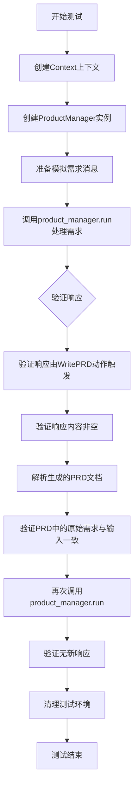
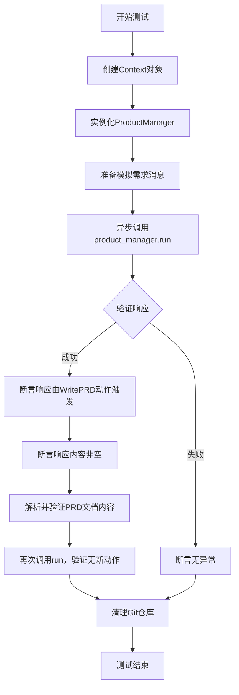
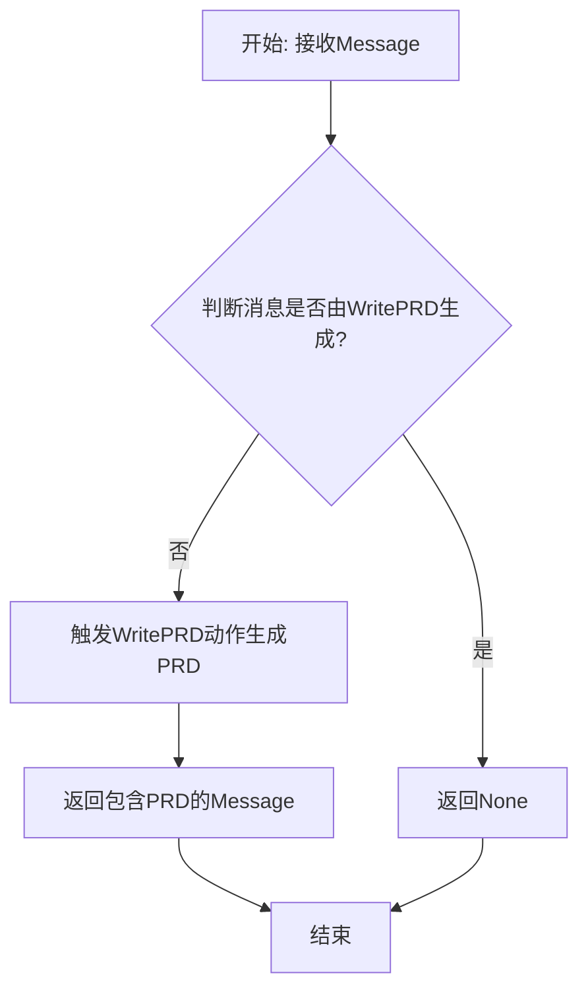
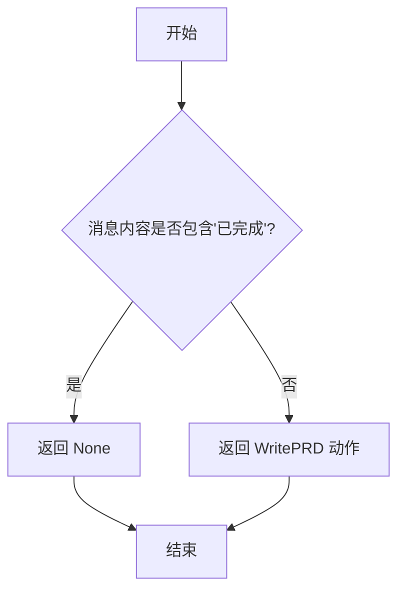
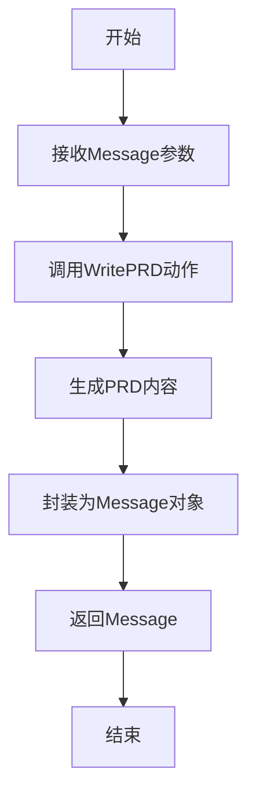

# `.\MetaGPT\tests\metagpt\roles\test_product_manager.py` 详细设计文档

该文件是一个针对ProductManager角色的单元测试，主要测试ProductManager在接收到需求后，能否正确运行并生成产品需求文档（PRD），并验证生成的文档内容与原始需求的一致性。

## 整体流程



## 类结构

```
ProductManager (被测试角色类)
├── 继承自Role基类
└── 包含actions、_think、_act等方法
Context (上下文类)
├── 包含config、repo等字段
└── 管理运行环境
MockMessages (模拟消息类)
├── 提供测试用的模拟消息
└── 包含req等字段
```

## 全局变量及字段


### `logger`
    
用于记录测试执行过程中的日志信息的日志记录器实例

类型：`logging.Logger`
    


### `new_filename`
    
pytest测试夹具，用于生成或提供测试所需的临时文件名

类型：`pytest.fixture`
    


### `ProductManager.context`
    
产品经理角色的运行上下文，包含配置和仓库等信息

类型：`Context`
    


### `ProductManager.actions`
    
产品经理角色可执行的动作列表，如编写PRD

类型：`List[Action]`
    


### `ProductManager._rc`
    
角色上下文，管理角色的状态、记忆和消息处理

类型：`RoleContext`
    


### `Context.config`
    
应用程序的配置信息，如项目路径、环境设置等

类型：`Config`
    


### `Context.repo`
    
Git仓库实例，用于管理项目文档和代码版本控制

类型：`GitRepository`
    


### `MockMessages.req`
    
模拟的需求消息，用于测试产品经理处理需求的能力

类型：`Message`
    
    

## 全局函数及方法

### `test_product_manager`

这是一个使用 `pytest` 框架编写的异步测试函数，用于测试 `ProductManager` 角色的核心功能。它模拟了产品经理接收需求、生成产品需求文档（PRD）并验证输出结果的过程，最后进行必要的资源清理。

参数：

- `new_filename`：`pytest fixture`，一个由测试框架提供的临时文件路径夹具，用于确保测试环境的隔离性。

返回值：`None`，测试函数通常不显式返回值，其成功与否由内部的断言（`assert`）决定。

#### 流程图



#### 带注释源码

```python
@pytest.mark.asyncio  # 标记此函数为异步测试函数
async def test_product_manager(new_filename):  # 定义异步测试函数，接收一个fixture参数
    context = Context()  # 创建一个应用上下文对象，用于管理配置和状态
    try:
        # 实例化产品经理角色，并传入上下文
        product_manager = ProductManager(context=context)
        
        # 准备模拟的需求文档，并记录日志
        logger.info(MockMessages.req)
        
        # 异步执行产品经理的run方法，传入模拟需求
        rsp = await product_manager.run(MockMessages.req)
        logger.info(rsp)  # 记录响应
        
        # 断言：响应是由WritePRD这个动作触发的
        assert rsp.cause_by == any_to_str(WritePRD)
        
        # 断言：响应内容长度大于0，确保生成了有效内容
        logger.info(rsp)
        assert len(rsp.content) > 0
        
        # 从响应的指令内容中提取第一个文档，并将其内容解析为JSON
        doc = list(rsp.instruct_content.docs.values())[0]
        m = json.loads(doc.content)
        
        # 断言：解析出的JSON中“原始需求”字段与输入的需求内容一致
        assert m["Original Requirements"] == MockMessages.req.content

        # 再次调用run方法，传入上一次的响应，预期没有新动作（返回None）
        rsp = await product_manager.run(rsp)
        assert rsp is None
    except Exception as e:
        # 如果发生任何异常，断言失败（即测试应不抛出异常）
        assert not e
    finally:
        # 测试结束后的清理工作
        # 如果上下文中配置了项目路径，则删除对应的Git仓库以保持环境干净
        if context.config.project_path:
            git_repo = GitRepository(context.config.project_path)
            git_repo.delete_repository()
```

### `ProductManager.run`

该方法用于执行产品经理角色的核心工作流程。它接收一个消息作为输入，根据消息内容判断是否需要生成新的产品需求文档（PRD）。如果输入消息是用户需求，则触发`WritePRD`动作来生成PRD；如果输入消息已经是PRD（即由`WritePRD`动作生成），则说明任务已完成，返回`None`。该方法体现了产品经理的职责：将用户需求转化为结构化的产品文档。

参数：

- `message`：`Message`，输入的消息对象，可能包含用户需求或已生成的PRD。

返回值：`Message | None`，如果生成了新的PRD，则返回包含PRD的消息对象；如果输入已经是PRD，则返回`None`表示无需进一步处理。

#### 流程图



#### 带注释源码

```python
async def run(self, message: Message) -> Message | None:
    """
    执行产品经理的核心工作流程。
    
    参数:
        message: 输入的消息，可能是用户需求或已生成的PRD。
    
    返回值:
        如果生成了PRD，返回包含PRD的Message；如果输入已是PRD，返回None。
    """
    # 检查消息是否由WritePRD动作生成，如果是则说明PRD已存在，无需处理
    if message.cause_by == WritePRD:
        return None
    # 否则，触发WritePRD动作来处理用户需求，生成PRD
    return await self._act(message)
```

### `ProductManager._think`

`ProductManager._think` 是 ProductManager 类中的一个私有方法，用于处理角色（ProductManager）的思考过程。它根据传入的消息（`Message` 对象）决定下一步要执行的动作（`Action`），并返回该动作。如果消息内容表明需求已经完成（例如包含“已完成”字样），则返回 `None`，表示无需进一步处理。

参数：

- `message`：`Message`，传入的消息对象，包含用户的需求或指令。

返回值：`Action` 或 `None`，返回下一步要执行的动作对象；如果需求已完成，则返回 `None`。

#### 流程图



#### 带注释源码

```python
async def _think(self) -> Action | None:
    """
    处理 ProductManager 的思考过程。
    如果消息内容包含'已完成'，则返回 None；否则返回 WritePRD 动作。
    """
    if "已完成" in self._rc.important_memory[-1].content:
        # 如果最新重要记忆包含'已完成'，表示需求已处理完毕，无需进一步动作
        return None
    # 否则，返回 WritePRD 动作，用于编写产品需求文档
    return WritePRD()
```

### `ProductManager._act`

该方法用于执行产品经理角色的核心动作，即根据接收到的消息（通常是需求）来撰写产品需求文档（PRD）。它通过调用`WritePRD`动作来处理输入消息，并返回一个包含PRD内容的响应消息。

参数：

- `message`：`Message`，包含用户原始需求或其他指令的消息对象。

返回值：`Message | None`，返回一个包含PRD内容的`Message`对象，如果无需进一步处理则返回`None`。

#### 流程图



#### 带注释源码

```python
async def _act(self) -> Message | None:
    """
    执行产品经理的核心动作：撰写PRD。
    通过WritePRD动作处理输入消息，生成产品需求文档。
    """
    # 调用WritePRD动作，传入当前消息
    rsp = await WritePRD().run(self.rc.memory.get())
    
    # 将WritePRD动作的响应封装为Message对象，并设置消息来源为WritePRD
    msg = Message(content=rsp, cause_by=WritePRD)
    
    # 返回包含PRD内容的Message对象
    return msg
```

## 关键组件


### 测试框架与执行器

使用 pytest 框架进行异步单元测试，负责测试 ProductManager 角色的核心功能。

### 模拟数据与消息

通过 MockMessages 类提供预定义的模拟请求消息，用于在测试中模拟用户输入。

### 角色功能测试

验证 ProductManager 角色能够接收需求、生成产品需求文档（PRD），并正确处理后续的无新输入场景。

### 上下文与资源管理

通过 Context 类管理测试环境配置和资源，并在测试结束后通过 GitRepository 清理生成的临时项目文件。

### 断言与验证逻辑

包含对角色输出消息的因果关系、内容非空性以及生成文档与原始需求一致性的多重断言，确保功能正确性。


## 问题及建议


### 已知问题

-   **异常处理逻辑错误**：测试代码中 `except Exception as e: assert not e` 的写法是错误的。`assert not e` 会检查异常对象 `e` 的布尔值是否为 `False`，而任何异常对象的布尔值通常都为 `True`，这会导致测试即使在捕获到异常时也会通过，掩盖了真实的测试失败。
-   **资源清理逻辑存在缺陷**：`finally` 块中的清理逻辑 `git_repo.delete_repository()` 依赖于 `context.config.project_path` 存在。如果 `context` 初始化失败或 `config.project_path` 为空，此操作可能引发 `AttributeError` 等异常，导致清理失败，并可能干扰后续测试。
-   **测试断言过于宽松**：对于 `rsp.instruct_content.docs` 的断言 `assert m["Original Requirements"] == MockMessages.req.content` 假设返回的文档列表至少有一个元素，且其内容为特定格式的JSON。如果 `docs` 为空或JSON结构不符合预期，此断言将失败，但错误信息可能不够清晰，难以定位根本原因。
-   **测试数据与逻辑耦合**：测试直接使用了 `MockMessages.req` 作为输入，并硬编码了对其内容的检查（`"Original Requirements"` 字段）。这使得测试与 `WritePRD` 动作输出的具体格式紧密耦合，一旦输出格式改变，测试就会失败，降低了测试的健壮性。

### 优化建议

-   **修正异常断言**：将 `except Exception as e: assert not e` 改为更合理的异常处理方式。例如，可以使用 `pytest.fail(f"Unexpected exception: {e}")` 来明确标记测试失败，或者根据测试预期，使用 `pytest.raises` 上下文管理器来捕获特定异常。
-   **增强资源清理的健壮性**：在 `finally` 块中执行清理操作前，应先检查 `git_repo` 对象及其所需属性（如 `context.config.project_path`）是否存在且有效。可以使用更安全的条件判断，例如 `if context and context.config and context.config.project_path:`，并考虑将清理逻辑封装在 `try...except` 块中以静默处理可能的清理异常，避免影响测试主流程的错误报告。
-   **细化测试断言并改进错误信息**：在访问 `rsp.instruct_content.docs` 前，先断言其非空且长度符合预期，例如 `assert rsp.instruct_content.docs` 和 `assert len(rsp.instruct_content.docs) > 0`。解析JSON后，可以更具体地检查数据结构，并使用更清晰的断言信息，例如 `assert m.get("Original Requirements") == MockMessages.req.content, f"Expected {MockMessages.req.content}, got {m.get('Original Requirements')}"`。
-   **解耦测试数据与验证逻辑**：考虑将测试的预期输出（如JSON的字段名和值）定义为测试类或模块级的常量或fixture。这样，当产品需求文档（PRD）的输出格式发生变化时，只需更新这些常量，而无需修改多个测试断言。同时，可以编写更通用的验证函数来检查PRD文档的结构完整性，而非特定的字段值。
-   **补充测试场景**：当前测试主要覆盖了“有需求时生成PRD”和“无新需求时无操作”两个场景。建议补充更多边界和异常场景的测试，例如：输入空需求、输入超长或特殊字符的需求、模拟 `WritePRD` 动作执行失败等，以提高代码的鲁棒性。


## 其它


### 设计目标与约束

本测试文件的设计目标是验证 ProductManager 角色在接收到需求后，能够正确生成产品需求文档（PRD），并确保生成的文档内容与原始需求一致。约束包括：测试环境需要模拟完整的上下文（Context），使用模拟消息（MockMessages）作为输入，并在测试结束后清理生成的临时文件。

### 错误处理与异常设计

测试中通过 try-except-finally 结构处理异常：在 try 块中执行主要测试逻辑，若发生异常，则断言异常不存在（assert not e），确保测试失败时能捕获异常。finally 块用于清理测试过程中可能创建的 Git 仓库，避免残留文件影响后续测试。

### 数据流与状态机

数据流：从 MockMessages.req（模拟需求）开始，作为输入传递给 ProductManager.run() 方法；ProductManager 处理需求并生成响应（rsp），其中包含生成的 PRD 文档；测试验证 rsp 的 cause_by 字段为 WritePRD 动作，并检查文档内容与原始需求的一致性。状态机：初始状态为需求接收状态，经过 ProductManager 处理进入文档生成状态，最终验证状态，若验证通过则测试成功，否则进入异常处理状态。

### 外部依赖与接口契约

外部依赖：pytest 框架用于测试执行和断言；metagpt 模块提供 ProductManager、Context、WritePRD 等核心组件；json 模块用于解析生成的文档内容。接口契约：ProductManager.run() 方法接受一个 Message 对象作为参数，返回一个 Message 对象或 None；GitRepository.delete_repository() 方法用于清理临时仓库。

### 测试策略与覆盖范围

测试策略：使用单元测试验证 ProductManager 的核心功能，包括需求处理、文档生成和内容验证。覆盖范围：测试了正常流程下 PRD 的生成和内容正确性，以及无新需求时的处理（返回 None）。通过模拟输入和清理机制，确保测试的隔离性和可重复性。

### 环境与配置管理

测试环境依赖于 Context 配置，特别是 project_path，用于创建和清理临时 Git 仓库。配置通过 context.config 管理，确保测试资源（如临时文件）在测试结束后被正确清理，避免资源泄漏。

### 性能与可扩展性考虑

测试性能：通过模拟消息和轻量级上下文，减少外部依赖，提高测试执行速度。可扩展性：测试结构允许轻松添加更多测试用例，例如验证不同需求格式或异常场景，通过扩展 MockMessages 或调整断言条件实现。

    