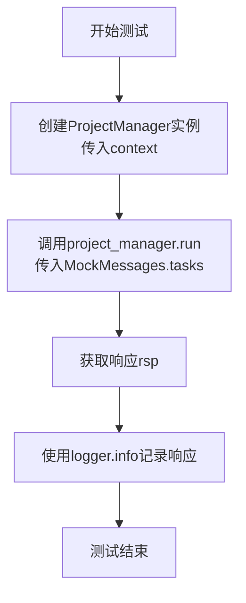

# `.\MetaGPT\tests\metagpt\roles\test_project_manager.py` 详细设计文档

该文件是一个使用 pytest 框架编写的异步单元测试文件，用于测试 ProjectManager 角色的核心功能。它通过模拟输入消息（任务列表）来验证 ProjectManager 能否正确处理任务并生成响应。

## 整体流程

```mermaid
graph TD
    A[开始测试] --> B[创建 ProjectManager 实例]
    B --> C[准备模拟任务消息 MockMessages.tasks]
    C --> D[异步调用 project_manager.run()]
    D --> E{ProjectManager 内部处理流程}
    E --> F[返回处理结果 rsp]
    F --> G[使用 logger 记录结果]
    G --> H[测试结束]
```

## 类结构

```
test_project_manager.py (测试文件)
├── 全局导入 (pytest, logger, ProjectManager, MockMessages)
├── 异步测试函数 test_project_manager
│   ├── 参数: context (测试上下文)
│   ├── 局部变量: project_manager (ProjectManager 实例)
│   ├── 局部变量: rsp (ProjectManager.run 的返回值)
│   └── 调用: logger.info(rsp)
└── 外部依赖
    ├── metagpt.logs.logger
    ├── metagpt.roles.ProjectManager
    └── tests.metagpt.roles.mock.MockMessages
```

## 全局变量及字段


### `logger`
    
用于记录日志的日志记录器实例。

类型：`Logger`
    


### `pytest`
    
用于编写和运行测试的测试框架模块。

类型：`Module`
    


### `ProjectManager`
    
项目管理员角色类，用于管理项目任务。

类型：`Class`
    


### `MockMessages`
    
模拟消息类，用于测试中提供模拟数据。

类型：`Class`
    


### `context`
    
测试上下文对象，提供测试所需的环境和配置。

类型：`Context`
    


### `project_manager`
    
项目管理员角色实例，用于执行测试。

类型：`ProjectManager`
    


### `rsp`
    
异步运行项目管理员后返回的响应结果。

类型：`Any`
    


    

## 全局函数及方法


### `test_project_manager`

这是一个使用 `pytest` 框架编写的异步单元测试函数，用于测试 `ProjectManager` 角色的 `run` 方法。它模拟了向 `ProjectManager` 实例发送任务消息并验证其响应的过程。

参数：

-  `context`：`metagpt.Context`，测试执行所需的上下文环境，通常包含配置、环境变量等信息。

返回值：`None`，该测试函数不返回任何值，其目的是通过断言或执行过程来验证功能。

#### 流程图



#### 带注释源码

```python
#!/usr/bin/env python
# -*- coding: utf-8 -*-
"""
@Time    : 2023/5/12 10:23
@Author  : alexanderwu
@File    : test_project_manager.py
"""
import pytest  # 导入pytest测试框架

from metagpt.logs import logger  # 导入项目日志模块
from metagpt.roles import ProjectManager  # 导入要测试的ProjectManager角色类
from tests.metagpt.roles.mock import MockMessages  # 导入用于测试的模拟消息数据


@pytest.mark.asyncio  # pytest装饰器，标记此测试函数为异步函数
async def test_project_manager(context):  # 定义异步测试函数，接收context参数
    project_manager = ProjectManager(context=context)  # 使用传入的context创建ProjectManager实例
    rsp = await project_manager.run(MockMessages.tasks)  # 异步调用project_manager的run方法，传入模拟的任务消息，并等待响应
    logger.info(rsp)  # 使用日志记录器记录返回的响应，便于调试和验证
```


### `ProjectManager.run`

该方法是一个异步方法，是`ProjectManager`角色的核心执行逻辑。它接收一个任务列表作为输入，通过一系列步骤（包括思考、计划、行动和观察）来处理这些任务，最终生成并返回一个包含任务执行结果的`Message`对象。

参数：

-  `with_message`：`Message`，一个包含待处理任务列表的`Message`对象。其`content`属性应为任务描述字符串。

返回值：`Message`，一个包含任务处理结果（例如，分解后的子任务列表、项目计划等）的`Message`对象。

#### 流程图

```mermaid
flowchart TD
    A[开始: run(with_message)] --> B[调用_think<br>思考如何处理任务]
    B --> C{_think是否返回新想法?}
    C -- 是 --> D[将新想法记录到<br>self.rc.memory]
    D --> E[调用_act<br>执行具体行动]
    C -- 否 --> E
    E --> F[调用_observe<br>观察环境/自身状态]
    F --> G{是否达到停止条件?<br>（如：想法枯竭、任务完成）}
    G -- 否 --> B
    G -- 是 --> H[返回最终的Message结果]
    H --> I[结束]
```

#### 带注释源码

```python
async def run(self, with_message: Message) -> Message:
    """
    运行项目管理者的主要工作流。
    这是一个异步方法，它循环执行思考、行动和观察的步骤，直到满足停止条件。
    
    参数:
        with_message (Message): 包含初始任务或指令的消息。
        
    返回:
        Message: 处理过程结束后生成的结果消息。
    """
    # 将传入的消息设置为要处理的消息
    self.rc.working_memory = with_message
    
    # 进入主处理循环
    while True:
        # 步骤1: 思考。分析当前情况，决定下一步做什么。
        await self._think()
        
        # 如果思考产生了新的、有价值的想法，则将其保存到记忆中
        if self.rc.todo:
            self.rc.memory.add(self.rc.todo)
            
        # 步骤2: 行动。执行思考后决定要做的动作。
        await self._act()
        
        # 步骤3: 观察。检查行动的结果或环境的新状态。
        await self._observe()
        
        # 检查是否满足停止循环的条件（例如，没有新想法、任务完成）
        if self.rc.state == 0:  # 假设 state == 0 表示需要停止
            break
            
    # 返回最终的处理结果，通常来自角色的记忆或最后生成的消息
    return self.rc.memory.get()[-1]  # 返回记忆中的最后一条消息作为结果
```


## 关键组件


### ProjectManager 角色类

ProjectManager 类是 MetaGPT 框架中的一个核心角色类，负责接收任务列表，并协调或规划项目的执行流程。

### MockMessages 测试工具类

MockMessages 是一个在测试环境中使用的工具类，用于生成模拟的、结构化的消息数据，以便于对 ProjectManager 等角色进行单元测试。

### pytest 异步测试框架

pytest 及其 `@pytest.mark.asyncio` 装饰器构成了异步测试的框架，用于编写和运行 `ProjectManager.run` 这类异步方法的单元测试。

### context 上下文对象

`context` 是传递给 `ProjectManager` 构造函数的上下文对象，它包含了角色运行所需的环境信息、配置或共享资源，是角色与系统交互的桥梁。


## 问题及建议


### 已知问题

-   **测试用例过于简单且依赖模拟数据**：当前测试用例`test_project_manager`仅验证了`ProjectManager`的`run`方法能够被调用并返回结果，但没有验证其内部逻辑、状态变化或与其它组件的交互是否正确。测试依赖于`MockMessages.tasks`，这可能导致测试覆盖不全，无法发现真实场景下的问题。
-   **缺乏对异步流程的全面测试**：测试使用了`@pytest.mark.asyncio`装饰器，但未测试`ProjectManager`在复杂异步操作（如并发任务处理、异步I/O）下的行为、错误处理和资源清理。
-   **测试结果验证不足**：测试仅通过`logger.info(rsp)`记录结果，没有使用断言（`assert`）来验证返回的`rsp`是否符合预期（例如，类型、结构、内容），使得测试的可靠性降低。
-   **上下文（Context）依赖未充分测试**：测试通过`context`参数传入上下文，但未验证`ProjectManager`在不同上下文配置下的行为差异，可能隐藏了上下文处理相关的缺陷。

### 优化建议

-   **增强测试覆盖率和断言**：为`test_project_manager`添加更多断言，验证`run`方法的返回值（如是否为特定类型、包含关键字段）。可以编写多个测试用例，分别测试正常流程、边界条件和异常情况。
-   **引入更真实的测试数据**：除了`MockMessages`，可以集成部分真实或更复杂的模拟数据，以测试`ProjectManager`处理实际任务的能力。考虑使用参数化测试（`@pytest.mark.parametrize`）覆盖多种输入场景。
-   **补充单元测试和集成测试**：为`ProjectManager`类的关键方法（如任务分解、进度跟踪、资源分配）编写独立的单元测试。同时，考虑编写集成测试，验证`ProjectManager`与系统中其他角色（如`Architect`、`Engineer`）的协作。
-   **改进异步测试**：确保测试充分覆盖`ProjectManager`的异步行为，例如使用`asyncio`模拟异步延迟或错误，验证其并发处理和异常恢复机制。
-   **明确测试上下文依赖**：在测试中明确设置和验证上下文（`context`）的内容，确保`ProjectManager`在不同上下文下的行为可预测。可以考虑为不同的上下文配置编写专门的测试用例。
-   **添加性能与负载测试**：如果`ProjectManager`需要处理大量任务，建议添加性能测试，评估其在高压下的响应时间和资源使用情况，以识别潜在的性能瓶颈。


## 其它


### 设计目标与约束

本测试文件旨在验证 `ProjectManager` 角色类的核心功能，即接收任务信息并生成相应的响应。设计目标包括：确保 `ProjectManager` 的 `run` 方法能够被异步调用并正确处理输入；验证其与上下文的集成；以及通过日志输出确认执行结果。主要约束在于它是一个单元测试，依赖于 `pytest` 框架、特定的模拟数据 (`MockMessages`) 和项目定义的 `context` 环境，不涉及完整的端到端业务流程测试。

### 错误处理与异常设计

测试本身不包含复杂的业务逻辑错误处理。它依赖于 `pytest` 的断言机制来捕获测试失败（例如，异步操作异常、断言错误）。如果 `ProjectManager.run` 方法内部抛出未处理的异常，测试将通过 `pytest` 标记为失败。测试设计预期在正常输入 (`MockMessages.tasks`) 下应成功执行，未显式测试异常输入场景。

### 数据流与状态机

数据流清晰且线性：
1.  **输入**：测试用例提供固定的 `MockMessages.tasks` 作为输入数据。
2.  **处理**：数据被传递给 `ProjectManager` 实例的 `run` 异步方法。
3.  **输出**：`run` 方法的返回值被捕获到变量 `rsp` 中。
4.  **观察**：`rsp` 的内容通过 `logger.info` 记录到日志中，供验证检查。
本测试不涉及 `ProjectManager` 内部的状态转换，仅验证其输入输出转换功能。

### 外部依赖与接口契约

1.  **pytest**: 测试运行框架，提供 `@pytest.mark.asyncio` 装饰器以支持异步测试函数，并注入 `context` 夹具。
2.  **metagpt.roles.ProjectManager**: 被测系统 (SUT)。测试依赖其公开的 `__init__` 和 `run` 方法接口。契约是：给定一个 `context` 对象和任务消息，`run` 方法应返回一个响应。
3.  **tests.metagpt.roles.mock.MockMessages**: 提供模拟的静态测试数据（`tasks`），用于解耦测试与真实数据源。
4.  **metagpt.logs.logger**: 用于输出调试信息，依赖于其 `info` 方法接口。
5.  **context 夹具 (pytest fixture)**: 由项目测试套件定义，提供 `ProjectManager` 运行所需的上下文环境（如配置、内存等）。这是测试的一个关键外部依赖。

### 测试策略与覆盖范围

采用**单元测试**策略，隔离测试 `ProjectManager` 角色的核心行为。覆盖范围聚焦于：
*   **正面路径 (Happy Path)**: 使用预设的模拟消息 (`MockMessages.tasks`) 调用 `run` 方法。
*   **集成点**: 验证 `ProjectManager` 能正确接收 `context` 并实例化。
测试未覆盖的场景包括：`run` 方法内部的具体逻辑、不同输入条件下的行为、错误恢复机制、以及 `ProjectManager` 与其他角色的交互。这些可能由其他测试文件或集成测试覆盖。

### 环境与配置

测试执行依赖于通过 `pytest` 夹具注入的 `context` 环境。该 `context` 应已配置好 `ProjectManager` 运行所需的所有基础组件（如 `llm` 服务、`memory` 等）。测试文件本身不进行环境配置或清理。日志级别取决于运行测试时的全局日志配置，`logger.info` 语句确保在测试通过或失败时都能在输出中看到关键结果信息。

    