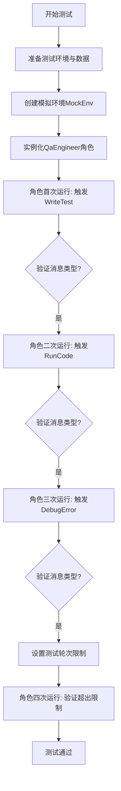
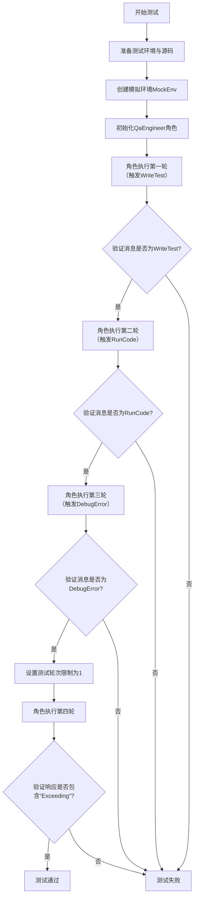
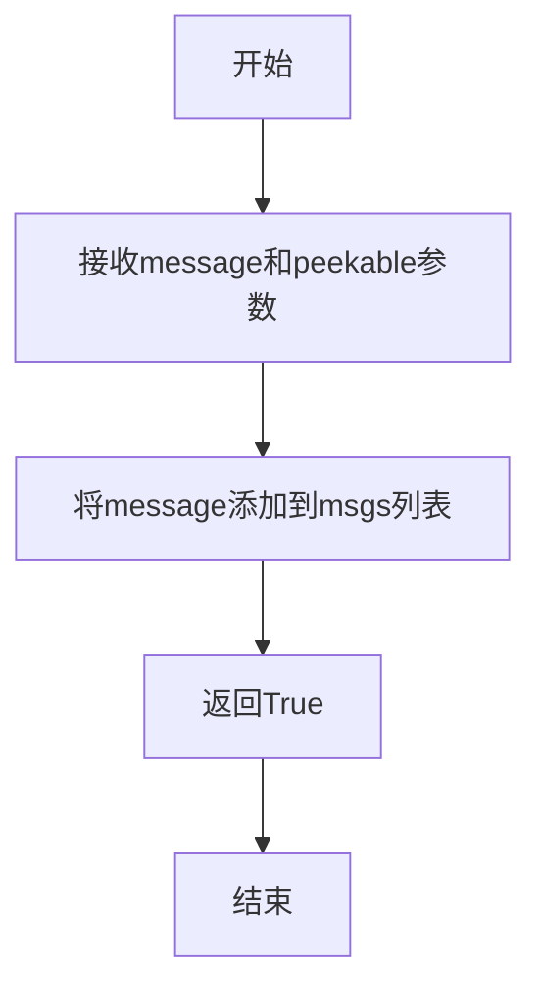

# `.\MetaGPT\tests\metagpt\roles\test_qa_engineer.py` 详细设计文档

该文件是一个针对QaEngineer角色的单元测试，模拟了质量保证工程师在接收到代码后，执行编写测试用例、运行代码、调试错误等完整工作流程的自动化测试场景。

## 整体流程



## 类结构

```
test_qa_engineer.py (测试文件)
├── test_qa (异步测试函数)
└── MockEnv (模拟环境类，继承自Environment)
    └── publish_message (重写方法)
```

## 全局变量及字段


### `demo_path`
    
指向演示项目game.py文件的路径对象

类型：`pathlib.Path`
    


### `context`
    
测试执行上下文，包含工作区路径等信息

类型：`metagpt.schema.Context`
    


### `data`
    
从demo_path读取的game.py文件内容

类型：`str`
    


### `env`
    
模拟的环境对象，用于跟踪消息传递

类型：`MockEnv`
    


### `role`
    
被测试的QA工程师角色实例

类型：`QaEngineer`
    


### `msg`
    
在测试流程中传递的消息对象

类型：`Message`
    


### `rsp`
    
角色运行后返回的响应消息

类型：`Message`
    


### `MockEnv.msgs`
    
存储环境接收到的消息列表

类型：`List[Message]`
    
    

## 全局函数及方法

### `test_qa`

这是一个用于测试 `QaEngineer` 角色的异步测试函数。它模拟了一个完整的质量保证工程师工作流程：首先设置测试环境并准备源代码，然后让 `QaEngineer` 角色依次执行编写测试、运行代码、调试错误等动作，并验证每个步骤产生的消息类型是否符合预期。最后，它测试了当测试轮次超过限制时的处理逻辑。

参数：
- `context`：`object`，测试上下文对象，提供了源代码仓库的工作目录等信息。

返回值：`None`，此函数不返回任何值，它使用 `assert` 语句来验证测试条件。

#### 流程图



#### 带注释源码

```python
async def test_qa(context):
    # Prerequisites
    # 1. 准备阶段：定义演示项目路径和目标工作空间路径。
    demo_path = Path(__file__).parent / "../../data/demo_project"
    context.src_workspace = Path(context.repo.workdir) / "qa/game_2048"
    # 2. 读取演示代码文件并写入到目标工作空间，模拟项目源码的部署。
    data = await aread(filename=demo_path / "game.py", encoding="utf-8")
    await awrite(filename=context.src_workspace / "game.py", data=data, encoding="utf-8")
    # 3. 创建一个空的requirements.txt文件。
    await awrite(filename=Path(context.repo.workdir) / "requirements.txt", data="")

    # 定义一个模拟环境类，用于捕获角色发布的消息。
    class MockEnv(Environment):
        msgs: List[Message] = Field(default_factory=list)

        def publish_message(self, message: Message, peekable: bool = True) -> bool:
            self.msgs.append(message)  # 将消息存储到列表中，而不是真正发布
            return True

    # 创建模拟环境实例。
    env = MockEnv()

    # 创建QaEngineer角色实例，并为其设置模拟环境。
    role = QaEngineer(context=context)
    role.set_env(env)
    # 第一轮执行：使用一个由SummarizeCode触发的空消息启动角色。
    # 预期角色会发布一个由WriteTest动作产生的消息。
    await role.run(with_message=Message(content="", cause_by=SummarizeCode))
    assert env.msgs  # 验证环境中有消息
    assert env.msgs[0].cause_by == any_to_str(WriteTest)  # 验证第一条消息由WriteTest触发
    msg = env.msgs[0]  # 保存该消息用于下一轮
    env.msgs.clear()  # 清空消息列表，准备下一轮验证

    # 第二轮执行：将上一轮产生的消息（WriteTest）传递给角色。
    # 预期角色会发布一个由RunCode动作产生的消息。
    await role.run(with_message=msg)
    assert env.msgs
    assert env.msgs[0].cause_by == any_to_str(RunCode)
    msg = env.msgs[0]
    env.msgs.clear()

    # 第三轮执行：将上一轮产生的消息（RunCode）传递给角色。
    # 预期角色会发布一个由DebugError动作产生的消息。
    await role.run(with_message=msg)
    assert env.msgs
    assert env.msgs[0].cause_by == any_to_str(DebugError)
    msg = env.msgs[0]
    env.msgs.clear()

    # 第四轮执行：测试轮次限制逻辑。
    # 将测试轮次限制设置为1，然后再次运行角色（传入DebugError消息）。
    # 由于已超过允许的轮次，预期角色会返回一个包含“Exceeding”字样的响应。
    role.test_round_allowed = 1
    rsp = await role.run(with_message=msg)
    assert "Exceeding" in rsp.content  # 验证响应内容包含特定字符串
```

### `MockEnv.publish_message`

该方法用于模拟环境中的消息发布功能，将传入的消息对象添加到内部的消息列表中，并返回一个布尔值表示操作成功。

参数：

- `message`：`Message`，需要发布的消息对象
- `peekable`：`bool`，指示消息是否可被查看（默认为True）

返回值：`bool`，始终返回True表示消息发布成功

#### 流程图



#### 带注释源码

```python
def publish_message(self, message: Message, peekable: bool = True) -> bool:
    # 将传入的消息对象添加到内部的消息列表msgs中
    self.msgs.append(message)
    # 始终返回True表示消息发布操作成功
    return True
```

## 关键组件


### QaEngineer 角色

负责执行软件质量保证流程的智能体角色，通过编写测试、运行代码和调试错误的循环来验证代码质量。

### WriteTest 动作

根据代码分析生成测试用例的动作，用于启动QA工程师的测试工作流。

### RunCode 动作

执行生成的测试代码以验证其正确性的动作。

### DebugError 动作

分析测试运行失败的原因并生成修复建议的动作。

### Environment 环境

提供消息发布与订阅机制的环境，用于协调不同角色和动作之间的通信。

### Message 消息

在环境中传递的信息单元，包含内容、发送者、接收者和触发动作类型等元数据。

### 测试执行循环

QA工程师角色的核心工作流，包含“编写测试 -> 运行测试 -> 调试错误”的迭代过程，直到测试通过或达到最大迭代次数。


## 问题及建议


### 已知问题

-   **测试数据依赖外部文件**：测试用例`test_qa`依赖于项目根目录`../../data/demo_project`下的`game.py`文件。这导致测试不具备自包含性，如果该文件被移动、重命名或内容发生变更，测试将失败，降低了测试的可靠性和可移植性。
-   **硬编码的路径和配置**：测试中硬编码了多个路径，如`context.src_workspace`、`requirements.txt`的写入路径以及`demo_path`。这使得测试逻辑与特定的目录结构紧密耦合，难以在不同环境或项目结构中复用。
-   **模拟环境（MockEnv）功能不完整**：`MockEnv`类仅重写了`publish_message`方法，用于记录消息。然而，`Environment`类可能包含其他在`QaEngineer.run`方法中被调用的关键方法（例如，获取历史消息、管理角色等）。当前模拟可能不充分，导致测试覆盖不全或隐藏了潜在的集成问题。
-   **测试断言过于依赖实现细节**：测试通过检查`env.msgs[0].cause_by`的值来断言特定动作（`WriteTest`, `RunCode`, `DebugError`）被触发。这使测试与`QaEngineer`内部的状态机逻辑和消息`cause_by`字段的具体值紧密耦合。一旦内部逻辑或消息格式改变，即使功能正确，测试也可能失败。
-   **潜在的异步执行问题**：测试中连续调用`await role.run`并检查`env.msgs`，假设每次`run`都是同步完成且消息被立即添加到列表。在更复杂的异步交互或`Environment`实现中，这可能存在竞态条件，导致测试不稳定。
-   **缺少对异常和错误路径的测试**：当前测试主要覆盖了“成功”流程（生成测试、运行、调试）。但未测试`QaEngineer`在代码运行失败、调试后仍失败、或输入无效消息等情况下的行为，测试覆盖率不足。

### 优化建议

-   **使用测试夹具（Fixture）和临时目录**：利用`pytest`的`tmp_path`夹具来创建临时工作目录和文件。将`game.py`的内容直接嵌入测试代码或作为测试资源加载，消除对外部文件的依赖，使测试完全自包含。
-   **抽象和配置化路径**：将硬编码的路径（如`"qa/game_2048"`）提取为配置常量或通过`context`属性动态设置。在测试中，使用临时目录来构建这些路径，提高灵活性。
-   **使用成熟的模拟框架**：使用`unittest.mock`或`pytest-mock`来模拟`Environment`实例及其方法（如`publish_message`）。这比手动创建模拟类更简洁、强大，能更好地控制模拟行为并验证调用。
-   **基于行为而非状态的断言**：减少对内部状态（如`msg.cause_by`）的断言。可以改为：
    -   断言模拟的`publish_message`方法被以预期的参数（如特定的动作类型）调用。
    -   或者，更高级地，断言最终的工作目录中产生了预期的输出文件（如测试文件）。
-   **增加测试场景的多样性**：
    -   **错误处理**：测试当`RunCode`动作返回失败结果时，`QaEngineer`是否会正确触发`DebugError`。
    -   **循环终止**：更全面地测试`test_round_allowed`限制，验证在达到上限后是否真的停止，并返回包含“Exceeding”的消息。
    -   **边界条件**：测试空项目、无效代码等情况。
-   **提升测试可读性和维护性**：将长的测试函数`test_qa`拆分为多个更小、更专注的测试函数（例如：`test_qa_writes_tests`， `test_qa_runs_code`， `test_qa_debugs_error`， `test_qa_round_limit`）。每个函数测试一个特定方面，并使用清晰的夹具来设置公共上下文。
-   **考虑集成测试与单元测试分离**：当前测试更像是`QaEngineer`角色与几个`Action`的集成测试。考虑补充更纯粹的单元测试，单独测试`QaEngineer`的决策逻辑（可能通过模拟所有`Action`），以及针对`WriteTest`、`RunCode`、`DebugError`等动作的独立单元测试。


## 其它


### 设计目标与约束

本测试代码的设计目标是验证 `QaEngineer` 角色在模拟环境中的完整工作流程，包括接收需求、生成测试、运行代码和调试错误。主要约束包括：1) 使用模拟环境 `MockEnv` 替代真实环境以隔离测试；2) 依赖外部数据文件（`demo_project/game.py`）作为被测代码；3) 测试流程需严格遵循 `WriteTest` -> `RunCode` -> `DebugError` 的动作序列；4) 需要控制测试轮次（`test_round_allowed`）以验证循环退出逻辑。

### 错误处理与异常设计

测试代码通过断言（`assert`）来验证流程的正确性和消息的因果关系。关键的错误处理场景包括：1) 验证每个 `run` 调用后，环境中的消息队列（`env.msgs`）非空且消息的 `cause_by` 字段符合预期；2) 通过设置 `test_round_allowed = 1` 并检查返回消息内容包含 "Exceeding" 来验证超出测试轮次限制时的处理逻辑。测试本身不包含复杂的异常捕获，主要依赖 `pytest` 框架来报告断言失败。

### 数据流与状态机

数据流始于外部数据文件 `game.py` 被读取并写入到测试工作区。核心状态机体现在 `QaEngineer` 角色的 `run` 方法中，其状态由传入的 `Message` 的 `cause_by` 属性驱动转换：
1.  初始状态（或无特定 `cause_by`）：触发 `WriteTest` 动作，生成测试代码。
2.  接收到 `WriteTest` 消息：触发 `RunCode` 动作，执行测试。
3.  接收到 `RunCode` 消息：触发 `DebugError` 动作，分析测试失败。
4.  接收到 `DebugError` 消息：根据 `test_round_allowed` 判断是否开启新一轮测试或结束。
测试通过 `MockEnv.msgs` 列表跟踪消息流，验证了状态转换的正确顺序。

### 外部依赖与接口契约

1.  **文件系统**：依赖 `pathlib.Path` 和 `metagpt.utils.common.aread/awrite` 来读取 `demo_project/game.py` 和写入测试工作区文件。契约是这些路径必须存在且可访问。
2.  **被测角色 (`QaEngineer`)**：依赖其 `run` 方法接收 `Message` 并按照内部逻辑发布新消息到环境。契约是 `QaEngineer` 的行为需符合 `WriteTest` -> `RunCode` -> `DebugError` 的循环。
3.  **动作类 (`WriteTest`, `RunCode`, `DebugError`)**：测试通过 `any_to_str` 检查消息的 `cause_by` 字段，与这些动作类的字符串表示进行匹配，构成了对动作类接口的间接依赖。
4.  **模拟环境 (`MockEnv`)**：实现了 `Environment` 的 `publish_message` 方法，契约是正确存储消息到 `msgs` 列表。
5.  **测试框架 (`pytest`)**：用于组织测试用例和执行断言。

    