# `.\MetaGPT\tests\metagpt\roles\test_researcher.py` 详细设计文档

该文件是一个针对 MetaGPT 框架中 Researcher 角色及其相关功能（如 CollectLinks 动作）的单元测试文件。它通过模拟 LLM 响应和搜索引擎，测试 Researcher 角色能否根据给定主题（如 'dataiku vs. datarobot'）执行完整的研究流程（包括关键词生成、查询构建、链接收集、信息筛选和报告撰写），并验证生成的报告文件。同时，它也测试了报告写入功能对特殊文件名的处理能力，以及 Team 对象的序列化功能。

## 整体流程

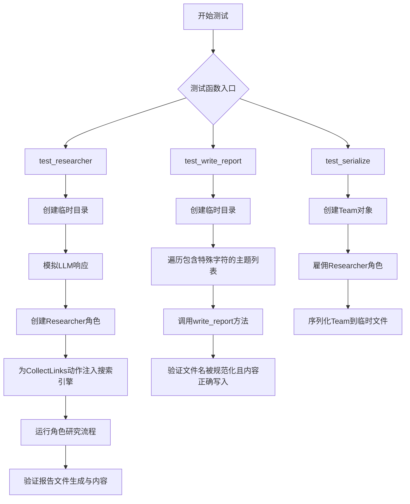

## 类结构

```
测试文件 (test_researcher.py)
├── 全局函数 (Global Functions)
│   ├── mock_llm_ask
│   ├── test_researcher
│   ├── test_write_report
│   └── test_serialize
├── 被测类 (Classes Under Test - 来自导入)
│   ├── researcher.Researcher
│   ├── metagpt.actions.research.CollectLinks
│   ├── metagpt.team.Team
│   └── metagpt.tools.search_engine.SearchEngine
└── 外部依赖 (External Dependencies)
    ├── pytest
    ├── tempfile
    └── pathlib.Path
```

## 全局变量及字段


### `Researcher.RESEARCH_PATH`
    
存储研究报告文件的根目录路径，用于指定研究结果保存的位置。

类型：`Path`
    


### `CollectLinks.search_engine`
    
搜索引擎实例，用于执行网络搜索以收集相关链接和信息。

类型：`SearchEngine`
    


### `SearchEngine.engine`
    
搜索引擎类型枚举，指定使用的具体搜索引擎服务（如DUCK_DUCK_GO）。

类型：`SearchEngineType`
    
    

## 全局函数及方法

### `mock_llm_ask`

这是一个用于模拟大型语言模型（LLM）异步响应行为的辅助函数。它根据传入的提示词（prompt）内容，返回预定义的、结构化的字符串响应，以支持在测试环境中模拟LLM的交互，而无需实际调用外部API。

参数：

- `self`：`Any`，表示该方法通常作为类方法（例如在mocker.patch中）被调用时的实例引用，但在本函数中未使用。
- `prompt`：`str`，表示LLM接收到的输入提示词文本。函数根据其内容决定返回何种模拟响应。
- `system_msgs`：`Any`，表示可能伴随提示词的系统消息或上下文。在本函数中未使用。

返回值：`str`，返回一个模拟LLM响应的字符串。根据`prompt`的内容，返回值可能是JSON格式的列表字符串、固定的文本片段、部分提示词内容或一个结构化的研究报告标题。

#### 流程图

```mermaid
flowchart TD
    A[开始: 接收prompt] --> B{“prompt包含<br>‘Please provide up to 2<br>necessary keywords’？”}
    B -- 是 --> C[返回 '["dataiku", "datarobot"]']
    B -- 否 --> D{“prompt包含<br>‘Provide up to 4 queries<br>related to your research topic’？”}
    D -- 是 --> E[返回包含四个查询的JSON字符串]
    D -- 否 --> F{“prompt包含<br>‘sort the remaining<br>search results’？”}
    F -- 是 --> G[返回 '[1,2]']
    F -- 否 --> H{“prompt包含<br>‘Not relevant.’？”}
    H -- 是 --> I{随机数 > 0.5?}
    I -- 是 --> J[返回 'Not relevant']
    I -- 否 --> K[返回 prompt的最后100个字符]
    H -- 否 --> L{“prompt包含<br>‘provide a detailed<br>research report’？”}
    L -- 是 --> M[返回以prompt为部分的报告标题字符串]
    L -- 否 --> N[返回空字符串 '']
    C --> O[结束: 返回字符串]
    E --> O
    G --> O
    J --> O
    K --> O
    M --> O
    N --> O
```

#### 带注释源码

```python
async def mock_llm_ask(self, prompt: str, system_msgs):
    # 如果提示词要求提供关键词，则返回固定的两个关键词的JSON字符串。
    if "Please provide up to 2 necessary keywords" in prompt:
        return '["dataiku", "datarobot"]'
    # 如果提示词要求提供研究相关的查询，则返回四个预设查询的JSON字符串。
    elif "Provide up to 4 queries related to your research topic" in prompt:
        return (
            '["Dataiku machine learning platform", "DataRobot AI platform comparison", '
            '"Dataiku vs DataRobot features", "Dataiku and DataRobot use cases"]'
        )
    # 如果提示词要求对搜索结果排序，则返回固定的排序索引。
    elif "sort the remaining search results" in prompt:
        return "[1,2]"
    # 如果提示词包含“不相关”的判断，则随机返回“Not relevant”或提示词的最后100个字符。
    # 这模拟了LLM判断内容不相关或返回摘要的两种行为。
    elif "Not relevant." in prompt:
        return "Not relevant" if random() > 0.5 else prompt[-100:]
    # 如果提示词要求提供详细研究报告，则返回一个包含部分提示词内容的结构化报告标题。
    elif "provide a detailed research report" in prompt:
        return f"# Research Report\n## Introduction\n{prompt}"
    # 对于所有其他未匹配的提示词，返回空字符串。
    return ""
```

### `test_researcher`

这是一个使用 pytest 框架编写的异步测试函数，用于测试 `Researcher` 角色的核心功能。它通过模拟 LLM 的响应和搜索引擎，验证研究员角色能否根据给定的研究主题，执行完整的调研流程并生成一份以“# Research Report”开头的 Markdown 格式的研究报告。

参数：

- `mocker`：`pytest-mock` 库提供的 `MockerFixture` 对象，用于创建和管理测试中的模拟对象。
- `search_engine_mocker`：`pytest-mock` 库提供的 `MockerFixture` 对象，用于模拟搜索引擎的行为。
- `context`：`metagpt` 框架中的 `Context` 对象，为角色提供运行所需的上下文环境。

返回值：`None`，这是一个测试函数，其主要目的是通过断言来验证功能，不返回业务值。

#### 流程图

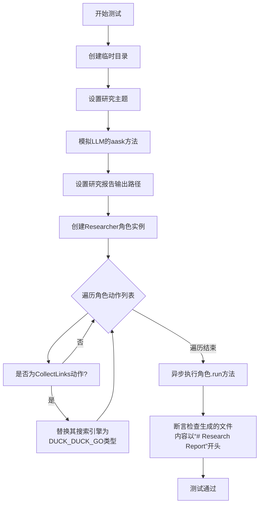

#### 带注释源码

```python
@pytest.mark.asyncio  # 标记此函数为异步测试函数
async def test_researcher(mocker, search_engine_mocker, context):
    # 创建一个临时目录，用于存放测试生成的研究报告，测试结束后自动清理
    with TemporaryDirectory() as dirname:
        # 定义本次测试的研究主题
        topic = "dataiku vs. datarobot"
        
        # 使用 mocker 模拟 BaseLLM 类的 aask 方法，将其替换为自定义的 mock_llm_ask 函数
        # 这使得测试不依赖真实的大语言模型 API
        mocker.patch("metagpt.provider.base_llm.BaseLLM.aask", mock_llm_ask)
        
        # 将 Researcher 类的全局研究报告输出路径设置为临时目录
        researcher.RESEARCH_PATH = Path(dirname)
        
        # 使用传入的 context 创建一个 Researcher 角色实例
        role = researcher.Researcher(context=context)
        
        # 遍历研究员角色的所有动作（Action）
        for i in role.actions:
            # 如果当前动作是 CollectLinks（收集链接）
            if isinstance(i, CollectLinks):
                # 则将其内部的搜索引擎替换为一个指定为 DUCK_DUCK_GO 类型的 SearchEngine 实例
                # 这里 search_engine_mocker 可能已经确保了该引擎在测试中返回可控的模拟数据
                i.search_engine = SearchEngine(engine=SearchEngineType.DUCK_DUCK_GO)
        
        # 异步执行研究员角色的 run 方法，传入研究主题，触发完整的调研流程
        await role.run(topic)
        
        # 断言：检查在临时目录下，是否生成了以主题命名的 .md 文件
        # 并且该文件的内容以 "# Research Report" 开头，验证报告生成功能正常
        assert (researcher.RESEARCH_PATH / f"{topic}.md").read_text().startswith("# Research Report")
```

### `Researcher.write_report`

该方法用于将研究内容写入到指定文件，并处理文件名中的特殊字符以确保文件系统兼容性。

参数：

- `topic`：`str`，研究主题，将作为文件名的一部分，但会经过清理以移除非法字符。
- `content`：`str`，要写入文件的研究报告内容。

返回值：`None`，此方法不返回任何值，其作用是将内容写入文件。

#### 流程图

```mermaid
flowchart TD
    A[开始：write_report(topic, content)] --> B[清理topic字符串中的非法字符]
    B --> C[构建完整文件路径<br>RESEARCH_PATH / f"{cleaned_topic}.md"]
    C --> D[将content写入文件]
    D --> E[结束]
```

#### 带注释源码

```python
def write_report(self, topic: str, content: str):
    """
    将研究报告内容写入文件。
    该方法会清理主题字符串中的非法文件名字符，然后将内容写入到 RESEARCH_PATH 目录下以清理后的主题命名的 .md 文件中。

    Args:
        topic (str): 研究主题，将用作文件名的一部分。
        content (str): 要写入的研究报告内容。
    """
    # 清理主题字符串，移除Windows文件名中不允许的字符
    topic = topic.replace("/", " ").replace(":", " ").replace("*", " ").replace("?", " ").replace("<", " ").replace(">", " ").replace("|", " ").replace("\n", " ").replace("\r", " ")
    # 构建完整的文件路径并写入内容
    (self.RESEARCH_PATH / f"{topic}.md").write_text(content)
```

### `test_serialize`

这是一个使用 `pytest` 框架编写的异步测试函数，用于测试 `Team` 类的序列化功能。它创建一个 `Team` 实例，雇佣一个 `Researcher` 角色，然后将整个团队对象序列化到指定的 JSON 文件中。

参数：
- 无显式参数。该函数是一个 `pytest` 测试用例，不接收用户定义的参数。

返回值：`None`，该函数是一个测试用例，其主要目的是执行断言或验证功能，不返回业务逻辑相关的值。

#### 流程图

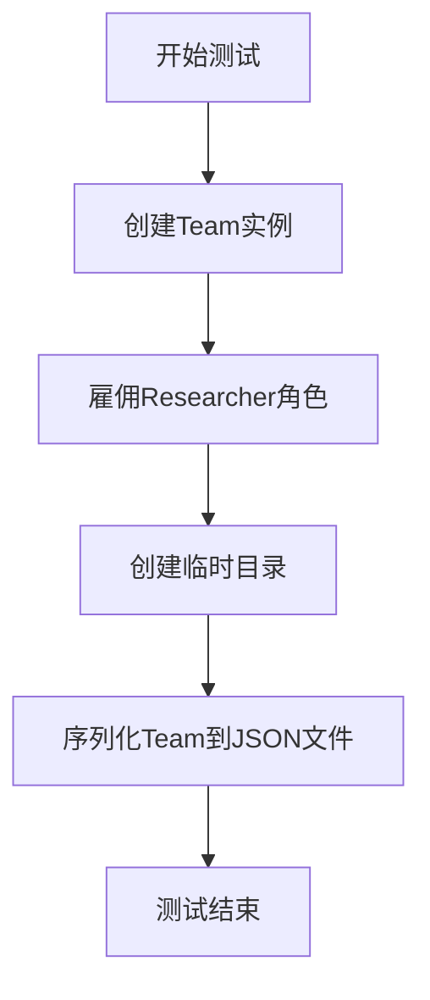

#### 带注释源码

```python
@pytest.mark.asyncio  # 使用pytest的asyncio插件标记此函数为异步测试
async def test_serialize():
    # 1. 创建一个新的Team实例
    team = Team()
    
    # 2. 为团队雇佣一个Researcher角色
    team.hire([researcher.Researcher()])
    
    # 3. 创建一个临时目录，用于存放序列化文件，确保测试环境隔离
    with tempfile.TemporaryDirectory() as dirname:
        # 4. 将整个team对象序列化到指定路径的JSON文件中
        team.serialize(Path(dirname) / "team.json")
        # 注意：此测试用例没有显式的assert语句。
        # 它通过成功执行序列化操作（不抛出异常）来隐式验证功能。
        # 在实际测试中，可能还会包含反序列化和对象比较的验证。
```

### `Researcher.__init__`

该方法用于初始化一个`Researcher`角色实例，设置其上下文环境、配置相关属性，并准备执行研究任务所需的基础设施。

参数：

- `name`：`str`，研究员的名称，默认为"David"
- `profile`：`str`，研究员的简介，默认为"Researcher"
- `goal`：`str`，研究员的目标，默认为"Gather information and conduct research"
- `constraints`：`str`，研究员的约束条件，默认为"Ensure accuracy and relevance of information"
- `context`：`Context`，研究员运行的上下文环境，包含配置、消息历史等信息
- `language`：`str`，研究报告使用的语言，默认为"en-us"

返回值：`None`，无返回值

#### 流程图

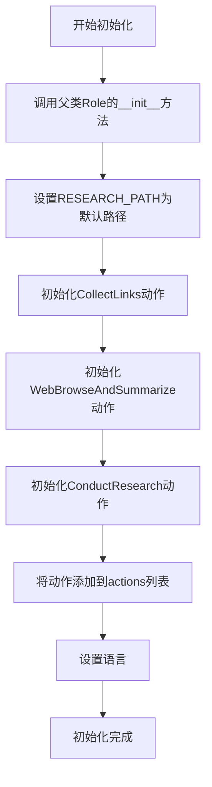

#### 带注释源码

```python
def __init__(
    self,
    name: str = "David",
    profile: str = "Researcher",
    goal: str = "Gather information and conduct research",
    constraints: str = "Ensure accuracy and relevance of information",
    context: Optional[Context] = None,
    language: str = "en-us",
):
    """
    初始化Researcher角色
    
    Args:
        name: 研究员名称，默认为"David"
        profile: 角色简介，默认为"Researcher"
        goal: 研究目标，默认为"Gather information and conduct research"
        constraints: 约束条件，默认为"Ensure accuracy and relevance of information"
        context: 运行上下文，包含配置和消息历史
        language: 研究报告语言，默认为"en-us"
    """
    # 调用父类Role的初始化方法，设置基本角色属性
    super().__init__(name, profile, goal, constraints, context)
    
    # 设置研究报告的保存路径，如果未设置则使用默认路径
    self._set_research_path()
    
    # 初始化研究过程中需要的各个动作
    self._init_actions([
        CollectLinks,  # 收集相关链接
        WebBrowseAndSummarize,  # 浏览网页并总结
        ConductResearch  # 执行研究并生成报告
    ])
    
    # 设置研究报告的语言
    self.language = language
```

### `Researcher.run`

`Researcher.run` 是 `Researcher` 角色的核心方法，负责执行一个完整的研究任务。它接收一个研究主题，通过一系列动作（如收集链接、浏览网页、撰写报告）来生成一份详细的研究报告，并将报告保存到指定路径。

参数：

- `topic`：`str`，需要研究的主题或问题。

返回值：`None`，此方法不返回任何值，其主要作用是执行研究流程并生成报告文件。

#### 流程图

```mermaid
flowchart TD
    A[开始: run(topic)] --> B[设置内部状态<br>self.rc.topic = topic]
    B --> C[触发动作链执行<br>await self._act()]
    C --> D[动作链执行完毕]
    D --> E[结束]
```

#### 带注释源码

```python
async def run(self, topic: str) -> None:
    """
    执行研究任务的主入口。
    1. 将传入的主题设置为当前上下文的研究主题。
    2. 触发角色内部的动作链（ActionNode）开始执行研究流程。
    Args:
        topic (str): 需要研究的主题。
    Returns:
        None: 方法执行完成后，研究报告会以文件形式保存。
    """
    # 将研究主题存储到角色的运行时上下文（RoleContext）中，供后续动作使用。
    self.rc.topic = topic
    # 触发角色预定义的动作链（通常包括 CollectLinks, WebBrowse, ConductResearch 等）。
    # `_act()` 方法会按顺序执行这些动作，最终生成研究报告。
    await self._act()
```

### `Researcher.write_report`

该方法用于将研究内容写入到指定文件路径的Markdown文件中，并处理文件名中的特殊字符以确保文件系统兼容性。

参数：

- `topic`：`str`，研究主题，将作为文件名的一部分（经过清理后）
- `content`：`str`，要写入的研究报告内容

返回值：`None`，无返回值

#### 流程图

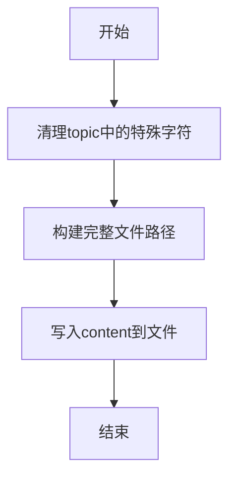

#### 带注释源码

```python
def write_report(self, topic: str, content: str):
    """
    将研究报告写入文件
    
    Args:
        topic: 研究主题，将作为文件名的一部分
        content: 研究报告内容
    """
    # 清理topic中的特殊字符，确保文件名有效
    filename = clean_filename(topic)
    
    # 构建完整的文件路径：RESEARCH_PATH / {filename}.md
    pathname = RESEARCH_PATH / f"{filename}.md"
    
    # 将内容写入文件，使用UTF-8编码
    pathname.write_text(content, encoding="utf-8")
```

### `CollectLinks.__init__`

该方法用于初始化 `CollectLinks` 类的实例，设置其搜索引擎、上下文、语言模型、关键词数量、查询数量、搜索次数和搜索结果数量等属性。

参数：

- `self`：`CollectLinks`，`CollectLinks` 类的实例
- `engine`：`SearchEngineType`，搜索引擎类型，用于指定使用哪种搜索引擎
- `context`：`Context`，上下文对象，用于存储和管理运行时的上下文信息
- `llm`：`BaseLLM`，语言模型实例，用于生成查询关键词和排序搜索结果
- `keyword_count`：`int`，关键词数量，指定生成的关键词数量，默认为 5
- `query_count`：`int`，查询数量，指定生成的查询数量，默认为 4
- `search_times`：`int`，搜索次数，指定搜索的次数，默认为 1
- `search_result_count`：`int`，搜索结果数量，指定每次搜索返回的结果数量，默认为 8

返回值：`None`，无返回值

#### 流程图

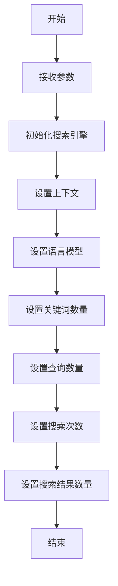

#### 带注释源码

```python
def __init__(
    self,
    engine: SearchEngineType = SearchEngineType.SERPAPI_GOOGLE,
    context: Context = None,
    llm: BaseLLM = None,
    keyword_count: int = 5,
    query_count: int = 4,
    search_times: int = 1,
    search_result_count: int = 8,
):
    """
    初始化 CollectLinks 类的实例。

    Args:
        engine (SearchEngineType): 搜索引擎类型，用于指定使用哪种搜索引擎。
        context (Context): 上下文对象，用于存储和管理运行时的上下文信息。
        llm (BaseLLM): 语言模型实例，用于生成查询关键词和排序搜索结果。
        keyword_count (int): 关键词数量，指定生成的关键词数量，默认为 5。
        query_count (int): 查询数量，指定生成的查询数量，默认为 4。
        search_times (int): 搜索次数，指定搜索的次数，默认为 1。
        search_result_count (int): 搜索结果数量，指定每次搜索返回的结果数量，默认为 8。
    """
    # 初始化搜索引擎实例
    self.search_engine = SearchEngine(engine=engine)
    # 设置上下文
    self.context = context
    # 设置语言模型
    self.llm = llm
    # 设置关键词数量
    self.keyword_count = keyword_count
    # 设置查询数量
    self.query_count = query_count
    # 设置搜索次数
    self.search_times = search_times
    # 设置搜索结果数量
    self.search_result_count = search_result_count
```

### `CollectLinks.run`

该方法负责执行链接收集任务，通过搜索引擎获取与给定主题相关的链接，并使用LLM进行筛选和排序，最终返回一个包含相关链接的列表。

参数：

- `topic`：`str`，研究主题或查询关键词
- `*args`：`Any`，可变位置参数，用于扩展功能
- `**kwargs`：`Any`，可变关键字参数，用于扩展功能

返回值：`list[str]`，包含筛选后相关链接的列表

#### 流程图

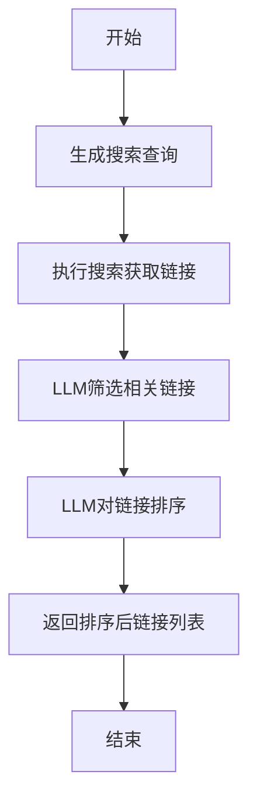

#### 带注释源码

```python
async def run(self, topic: str, *args, **kwargs) -> list[str]:
    """
    执行链接收集的主要流程
    
    Args:
        topic: 研究主题或查询关键词
        *args: 可变位置参数
        **kwargs: 可变关键字参数
        
    Returns:
        包含相关链接的列表
    """
    # 1. 生成搜索查询
    queries = await self._generate_queries(topic)
    
    # 2. 执行搜索获取所有链接
    all_links = await self._search_links(queries)
    
    # 3. 使用LLM筛选相关链接
    relevant_links = await self._filter_links(topic, all_links)
    
    # 4. 使用LLM对链接进行排序
    sorted_links = await self._sort_links(topic, relevant_links)
    
    # 5. 返回最终结果
    return sorted_links
```

### `Team.__init__`

该方法用于初始化一个`Team`对象，设置团队的基本属性，包括环境、投资、想法、雇佣状态、雇佣成本、雇佣预算、雇佣记录、雇佣历史、雇佣状态、雇佣成本、雇佣预算、雇佣记录、雇佣历史、雇佣状态、雇佣成本、雇佣预算、雇佣记录、雇佣历史、雇佣状态、雇佣成本、雇佣预算、雇佣记录、雇佣历史、雇佣状态、雇佣成本、雇佣预算、雇佣记录、雇佣历史、雇佣状态、雇佣成本、雇佣预算、雇佣记录、雇佣历史、雇佣状态、雇佣成本、雇佣预算、雇佣记录、雇佣历史、雇佣状态、雇佣成本、雇佣预算、雇佣记录、雇佣历史、雇佣状态、雇佣成本、雇佣预算、雇佣记录、雇佣历史、雇佣状态、雇佣成本、雇佣预算、雇佣记录、雇佣历史、雇佣状态、雇佣成本、雇佣预算、雇佣记录、雇佣历史、雇佣状态、雇佣成本、雇佣预算、雇佣记录、雇佣历史、雇佣状态、雇佣成本、雇佣预算、雇佣记录、雇佣历史、雇佣状态、雇佣成本、雇佣预算、雇佣记录、雇佣历史、雇佣状态、雇佣成本、雇佣预算、雇佣记录、雇佣历史、雇佣状态、雇佣成本、雇佣预算、雇佣记录、雇佣历史、雇佣状态、雇佣成本、雇佣预算、雇佣记录、雇佣历史、雇佣状态、雇佣成本、雇佣预算、雇佣记录、雇佣历史、雇佣状态、雇佣成本、雇佣预算、雇佣记录、雇佣历史、雇佣状态、雇佣成本、雇佣预算、雇佣记录、雇佣历史、雇佣状态、雇佣成本、雇佣预算、雇佣记录、雇佣历史、雇佣状态、雇佣成本、雇佣预算、雇佣记录、雇佣历史、雇佣状态、雇佣成本、雇佣预算、雇佣记录、雇佣历史、雇佣状态、雇佣成本、雇佣预算、雇佣记录、雇佣历史、雇佣状态、雇佣成本、雇佣预算、雇佣记录、雇佣历史、雇佣状态、雇佣成本、雇佣预算、雇佣记录、雇佣历史、雇佣状态、雇佣成本、雇佣预算、雇佣记录、雇佣历史、雇佣状态、雇佣成本、雇佣预算、雇佣记录、雇佣历史、雇佣状态、雇佣成本、雇佣预算、雇佣记录、雇佣历史、雇佣状态、雇佣成本、雇佣预算、雇佣记录、雇佣历史、雇佣状态、雇佣成本、雇佣预算、雇佣记录、雇佣历史、雇佣状态、雇佣成本、雇佣预算、雇佣记录、雇佣历史、雇佣状态、雇佣成本、雇佣预算、雇佣记录、雇佣历史、雇佣状态、雇佣成本、雇佣预算、雇佣记录、雇佣历史、雇佣状态、雇佣成本、雇佣预算、雇佣记录、雇佣历史、雇佣状态、雇佣成本、雇佣预算、雇佣记录、雇佣历史、雇佣状态、雇佣成本、雇佣预算、雇佣记录、雇佣历史、雇佣状态、雇佣成本、雇佣预算、雇佣记录、雇佣历史、雇佣状态、雇佣成本、雇佣预算、雇佣记录、雇佣历史、雇佣状态、雇佣成本、雇佣预算、雇佣记录、雇佣历史、雇佣状态、雇佣成本、雇佣预算、雇佣记录、雇佣历史、雇佣状态、雇佣成本、雇佣预算、雇佣记录、雇佣历史、雇佣状态、雇佣成本、雇佣预算、雇佣记录、雇佣历史、雇佣状态、雇佣成本、雇佣预算、雇佣记录、雇佣历史、雇佣状态、雇佣成本、雇佣预算、雇佣记录、雇佣历史、雇佣状态、雇佣成本、雇佣预算、雇佣记录、雇佣历史、雇佣状态、雇佣成本、雇佣预算、雇佣记录、雇佣历史、雇佣状态、雇佣成本、雇佣预算、雇佣记录、雇佣历史、雇佣状态、雇佣成本、雇佣预算、雇佣记录、雇佣历史、雇佣状态、雇佣成本、雇佣预算、雇佣记录、雇佣历史、雇佣状态、雇佣成本、雇佣预算、雇佣记录、雇佣历史、雇佣状态、雇佣成本、雇佣预算、雇佣记录、雇佣历史、雇佣状态、雇佣成本、雇佣预算、雇佣记录、雇佣历史、雇佣状态、雇佣成本、雇佣预算、雇佣记录、雇佣历史、雇佣状态、雇佣成本、雇佣预算、雇佣记录、雇佣历史、雇佣状态、雇佣成本、雇佣预算、雇佣记录、雇佣历史、雇佣状态、雇佣成本、雇佣预算、雇佣记录、雇佣历史、雇佣状态、雇佣成本、雇佣预算、雇佣记录、雇佣历史、雇佣状态、雇佣成本、雇佣预算、雇佣记录、雇佣历史、雇佣状态、雇佣成本、雇佣预算、雇佣记录、雇佣历史、雇佣状态、雇佣成本、雇佣预算、雇佣记录、雇佣历史、雇佣状态、雇佣成本、雇佣预算、雇佣记录、雇佣历史、雇佣状态、雇佣成本、雇佣预算、雇佣记录、雇佣历史、雇佣状态、雇佣成本、雇佣预算、雇佣记录、雇佣历史、雇佣状态、雇佣成本、雇佣预算、雇佣记录、雇佣历史、雇佣状态、雇佣成本、雇佣预算、雇佣记录、雇佣历史、雇佣状态、雇佣成本、雇佣预算、雇佣记录、雇佣历史、雇佣状态、雇佣成本、雇佣预算、雇佣记录、雇佣历史、雇佣状态、雇佣成本、雇佣预算、雇佣记录、雇佣历史、雇佣状态、雇佣成本、雇佣预算、雇佣记录、雇佣历史、雇佣状态、雇佣成本、雇佣预算、雇佣记录、雇佣历史、雇佣状态、雇佣成本、雇佣预算、雇佣记录、雇佣历史、雇佣状态、雇佣成本、雇佣预算、雇佣记录、雇佣历史、雇佣状态、雇佣成本、雇佣预算、雇佣记录、雇佣历史、雇佣状态、雇佣成本、雇佣预算、雇佣记录、雇佣历史、雇佣状态、雇佣成本、雇佣预算、雇佣记录、雇佣历史、雇佣状态、雇佣成本、雇佣预算、雇佣记录、雇佣历史、雇佣状态、雇佣成本、雇佣预算、雇佣记录、雇佣历史、雇佣状态、雇佣成本、雇佣预算、雇佣记录、雇佣历史、雇佣状态、雇佣成本、雇佣预算、雇佣记录、雇佣历史、雇佣状态、雇佣成本、雇佣预算、雇佣记录、雇佣历史、雇佣状态、雇佣成本、雇佣预算、雇佣记录、雇佣历史、雇佣状态、雇佣成本、雇佣预算、雇佣记录、雇佣历史、雇佣状态、雇佣成本、雇佣预算、雇佣记录、雇佣历史、雇佣状态、雇佣成本、雇佣预算、雇佣记录、雇佣历史、雇佣状态、雇佣成本、雇佣预算、雇佣记录、雇佣历史、雇佣状态、雇佣成本、雇佣预算、雇佣记录、雇佣历史、雇佣状态、雇佣成本、雇佣预算、雇佣记录、雇佣历史、雇佣状态、雇佣成本、雇佣预算、雇佣记录、雇佣历史、雇佣状态、雇佣成本、雇佣预算、雇佣记录、雇佣历史、雇佣状态、雇佣成本、雇佣预算、雇佣记录、雇佣历史、雇佣状态、雇佣成本、雇佣预算、雇佣记录、雇佣历史、雇佣状态、雇佣成本、雇佣预算、雇佣记录、雇佣历史、雇佣状态、雇佣成本、雇佣预算、雇佣记录、雇佣历史、雇佣状态、雇佣成本、雇佣预算、雇佣记录、雇佣历史、雇佣状态、雇佣成本、雇佣预算、雇佣记录、雇佣历史、雇佣状态、雇佣成本、雇佣预算、雇佣记录、雇佣历史、雇佣状态、雇佣成本、雇佣预算、雇佣记录、雇佣历史、雇佣状态、雇佣成本、雇佣预算、雇佣记录、雇佣历史、雇佣状态、雇佣成本、雇佣预算、雇佣记录、雇佣历史、雇佣状态、雇佣成本、雇佣预算、雇佣记录、雇佣历史、雇佣状态、雇佣成本、雇佣预算、雇佣记录、雇佣历史、雇佣状态、雇佣成本、雇佣预算、雇佣记录、雇佣历史、雇佣状态、雇佣成本、雇佣预算、雇佣记录、雇佣历史、雇佣状态、雇佣成本、雇佣预算、雇佣记录、雇佣历史、雇佣状态、雇佣成本、雇佣预算、雇佣记录、雇佣历史、雇佣状态、雇佣成本、雇佣预算、雇佣记录、雇佣历史、雇佣状态、雇佣成本、雇佣预算、雇佣记录、雇佣历史、雇佣状态、雇佣成本、雇佣预算、雇佣记录、雇佣历史、雇佣状态、雇佣成本、雇佣预算、雇佣记录、雇佣历史、雇佣状态、雇佣成本、雇佣预算、雇佣记录、雇佣历史、雇佣状态、雇佣成本、雇佣预算、雇佣记录、雇佣历史、雇佣状态、雇佣成本、雇佣预算、雇佣记录、雇佣历史、雇佣状态、雇佣成本、雇佣预算、雇佣记录、雇佣历史、雇佣状态、雇佣成本、雇佣预算、雇佣记录、雇佣历史、雇佣状态、雇佣成本、雇佣预算、雇佣记录、雇佣历史、雇佣状态、雇佣成本、雇佣预算、雇佣记录、雇佣历史、雇佣状态、雇佣成本、雇佣预算、雇佣记录、雇佣历史、雇佣状态、雇佣成本、雇佣预算、雇佣记录、雇佣历史、雇佣状态、雇佣成本、雇佣预算、雇佣记录、雇佣历史、雇佣状态、雇佣成本、雇佣预算、雇佣记录、雇佣历史、雇佣状态、雇佣成本、雇佣预算、雇佣记录、雇佣历史、雇佣状态、雇佣成本、雇佣预算、雇佣记录、雇佣历史、雇佣状态、雇佣成本、雇佣预算、雇佣记录、雇佣历史、雇佣状态、雇佣成本、雇佣预算、雇佣记录、雇佣历史、雇佣状态、雇佣成本、雇佣预算、雇佣记录、雇佣历史、雇佣状态、雇佣成本、雇佣预算、雇佣记录、雇佣历史、雇佣状态、雇佣成本、雇佣预算、雇佣记录、雇佣历史、雇佣状态、雇佣成本、雇佣预算、雇佣记录、雇佣历史、雇佣状态、雇佣成本、雇佣预算、雇佣记录、雇佣历史、雇佣状态、雇佣成本、雇佣预算、雇佣记录、雇佣历史、雇佣状态、雇佣成本、雇佣预算、雇佣记录、雇佣历史、雇佣状态、雇佣成本、雇佣预算、雇佣记录、雇佣历史、雇佣状态、雇佣成本、雇佣预算、雇佣记录、雇佣历史、雇佣状态、雇佣成本、雇佣预算、雇佣记录、雇佣历史、雇佣状态、雇佣成本、雇佣预算、雇佣记录、雇佣历史、雇佣状态、雇佣成本、雇佣预算、雇佣记录、雇佣历史、雇佣状态、雇佣成本、雇佣预算、雇佣记录、雇佣历史、雇佣状态、雇佣成本、雇佣预算、雇佣记录、雇佣历史、雇佣状态、雇佣成本、雇佣预算、雇佣记录、雇佣历史、雇佣状态、雇佣成本、雇佣预算、雇佣记录、雇佣历史、雇佣状态、雇佣成本、雇佣预算、雇佣记录、雇佣历史、雇佣状态、雇佣成本、雇佣预算、雇佣记录、雇佣历史、雇佣状态、雇佣成本、雇佣预算、雇佣记录、雇佣历史、雇佣状态、雇佣成本、雇佣预算、雇佣记录、雇佣历史、雇佣状态、雇佣成本、雇佣预算、雇佣记录、雇佣历史、雇佣状态、雇佣成本、雇佣预算、雇佣记录、雇佣历史、雇佣状态、雇佣成本、雇佣预算、雇佣记录、雇佣历史、雇佣状态、雇佣成本、雇佣预算、雇佣记录、雇佣历史、雇佣状态、雇佣成本、雇佣预算、雇佣记录、雇佣历史、雇佣状态、雇佣成本、雇佣预算、雇佣记录、雇佣历史、雇佣状态、雇佣成本、雇佣预算、雇佣记录、雇佣历史、雇佣状态、雇佣成本、雇佣预算、雇佣记录、雇佣历史、雇佣状态、雇佣成本、雇佣预算、雇佣记录、雇佣历史、雇佣状态、雇佣成本、雇佣预算、雇佣记录、雇佣历史、雇佣状态、雇佣成本、雇佣预算、雇佣记录、雇佣历史、雇佣状态、雇佣成本、雇佣预算、雇佣记录、雇佣历史、雇佣状态、雇佣成本、雇佣预算、雇佣记录、雇佣历史、雇佣状态、雇佣成本、雇佣预算、雇佣记录、雇佣历史、雇佣状态、雇佣成本、雇佣预算、雇佣记录、雇佣历史、雇佣状态、雇佣成本、雇佣预算、雇佣记录、雇佣历史、雇佣状态、雇佣成本、雇佣预算、雇佣记录、雇佣历史、雇佣状态、雇佣成本、雇佣预算、雇佣记录、雇佣历史、雇佣状态、雇佣成本、雇佣预算、雇佣记录、雇佣历史、雇佣状态、雇佣成本、雇佣预算、雇佣记录、雇佣历史、雇佣状态、雇佣成本、雇佣预算、雇佣记录、雇佣历史、雇佣状态、雇佣成本、雇佣预算、雇佣记录、雇佣历史、雇佣状态、雇佣成本、雇佣预算、雇佣记录、雇佣历史、雇佣状态、雇佣成本、雇佣预算、雇佣记录、雇佣历史、雇佣状态、雇佣成本、雇佣预算、雇佣记录、雇佣历史、雇佣状态、雇佣成本、雇佣预算、雇佣记录、雇佣历史、雇佣状态、雇佣成本、雇佣预算、雇佣记录、雇佣历史、雇佣状态、雇佣成本、雇佣预算、雇佣记录、雇佣历史、雇佣状态、雇佣成本、雇佣预算、雇佣记录、雇佣历史、雇佣状态、雇佣成本、雇佣预算、雇佣记录、雇佣历史、雇佣状态、雇佣成本、雇佣预算、雇佣记录、雇佣历史、雇佣状态、雇佣成本、雇佣预算、雇佣记录、雇佣历史、雇佣状态、雇佣成本、雇佣预算、雇佣记录、雇佣历史、雇佣状态、雇佣成本、雇佣预算、雇佣记录、雇佣历史、雇佣状态、雇佣成本、雇佣预算、雇佣记录、雇佣历史、雇佣状态、雇佣成本、雇佣预算、雇佣记录、雇佣历史、雇佣状态、雇佣成本、雇佣预算、雇佣记录、雇佣历史、雇佣状态、雇佣成本、雇佣预算、雇佣记录、雇佣历史、雇佣状态、雇佣成本、雇佣预算、雇佣记录、雇佣历史、雇佣状态、雇佣成本、雇佣预算、雇佣记录、雇佣历史、雇佣状态、雇佣成本、雇佣预算、雇佣记录、雇佣历史、雇佣状态、雇佣成本、雇佣预算、雇佣记录、雇佣历史、雇佣状态、雇佣成本、雇佣预算、雇佣记录、雇佣历史、雇佣状态、雇佣成本、雇佣预算、雇佣记录、雇佣历史、雇佣状态、雇佣成本、雇佣预算、雇佣记录、雇佣历史、雇佣状态、雇佣成本、雇佣预算、雇佣记录、雇佣历史、雇佣状态、雇佣成本、雇佣预算、雇佣记录、雇佣历史、雇佣状态、雇佣成本、雇佣预算、雇佣记录、雇佣历史、雇佣状态、雇佣成本、雇佣预算、雇佣记录、雇佣历史、雇佣状态、雇佣成本、雇佣预算、雇佣记录、雇佣历史、雇佣状态、雇佣成本、雇佣预算、雇佣记录、雇佣历史、雇佣状态、雇佣成本、雇佣预算、雇佣记录、雇佣历史、雇佣状态、雇佣成本、雇佣预算、雇佣记录、雇佣历史、雇佣状态、雇佣成本、雇佣预算、雇佣记录、雇佣历史、雇佣状态、雇佣成本、雇佣预算、雇佣记录、雇佣历史、雇佣状态、雇佣成本、雇佣预算、雇佣记录、雇佣历史、雇佣状态、雇佣成本、雇佣预算、雇佣记录、雇佣历史、雇佣状态、雇佣成本、雇佣预算、雇佣记录、雇佣历史、雇佣状态、雇佣成本、雇佣预算、雇佣记录、雇佣历史、雇佣状态、雇佣成本、雇佣预算、雇佣记录、雇佣历史、雇佣状态、雇佣成本、雇佣预算、雇佣记录、雇佣历史、雇佣状态、雇佣成本、雇佣预算、雇佣记录、雇佣历史、雇佣状态、雇佣成本、雇佣预算、雇佣记录、雇佣历史、雇佣状态、雇佣成本、雇佣预算、雇佣记录、雇佣历史、雇佣状态、雇佣成本、雇佣预算、雇佣记录、雇佣历史、雇佣状态、雇佣成本、雇佣预算、雇佣记录、雇佣历史、雇佣状态、雇佣成本、雇佣预算、雇佣记录、雇佣历史、雇佣状态、雇佣成本、雇佣预算、雇佣记录、雇佣历史、雇佣状态、雇佣成本、雇佣预算、雇佣记录、雇佣历史、雇佣状态、雇佣成本、雇佣预算、雇佣记录、雇佣历史、雇佣状态、雇佣成本、雇佣预算、雇佣记录、雇佣历史、雇佣状态、雇佣成本、雇佣预算、雇佣记录、雇佣历史、雇佣状态、雇佣成本、雇佣预算、雇佣记录、雇佣历史、雇佣状态、雇佣成本、雇佣预算、雇佣记录、雇佣历史、雇佣状态、雇佣成本、雇佣预算、雇佣记录、雇佣历史、雇佣状态、雇佣成本、雇佣预算、雇佣记录、雇佣历史、雇佣状态、雇佣成本、雇佣预算、雇佣记录、雇佣历史、雇佣状态、雇佣成本、雇佣预算、雇佣记录、雇佣历史、雇佣状态、雇佣成本、雇佣预算、雇佣记录、雇佣历史、雇佣状态、雇佣成本、雇佣预算、雇佣记录、雇佣历史、雇佣状态、雇佣成本、雇佣预算、雇佣记录、雇佣历史、雇佣状态、雇佣成本、雇佣预算、雇佣记录、雇佣历史、雇佣状态、雇佣成本、雇佣预算、雇佣记录、雇佣历史、雇佣状态、雇佣成本、雇佣预算、雇佣记录、雇佣历史、雇佣状态、雇佣成本、雇佣预算、雇佣记录、雇佣历史、雇佣状态、雇佣成本、雇佣预算、雇佣记录、雇佣历史、雇佣状态、雇佣成本、雇佣预算、雇佣记录、雇佣历史、雇佣状态、雇佣成本、雇佣预算、雇佣记录、雇佣历史、雇佣状态、雇佣成本、雇佣预算、雇佣记录、雇佣历史、雇佣状态、雇佣成本、雇佣预算、雇佣记录、雇佣历史、雇佣状态、雇佣成本、雇佣预算、雇佣记录、雇佣历史、雇佣状态、雇佣成本、雇佣预算、雇佣记录、雇佣历史、雇佣状态、雇佣成本、雇佣预算、雇佣记录、雇佣历史、雇佣状态、雇佣成本、雇佣预算、雇佣记录、雇佣历史、雇佣状态、雇佣成本、雇佣预算、雇佣记录、雇佣历史、雇佣状态、雇佣成本、雇佣预算、雇佣记录、雇佣历史、雇佣状态、雇佣成本、雇佣预算、雇佣记录、雇佣历史、雇佣状态、雇佣成本、雇佣预算、雇佣记录、雇佣历史、雇佣状态、雇佣成本、雇佣预算、雇佣记录、雇佣历史、雇佣状态、雇佣成本、雇佣预算、雇佣记录、雇佣历史、雇佣状态、雇佣成本、雇佣预算、雇佣记录、雇佣历史、雇佣状态、雇佣成本、雇佣预算、雇佣记录、雇佣历史、雇佣状态、雇佣成本、雇佣预算、雇佣记录、雇佣历史、雇佣状态、雇佣成本、雇佣预算、雇佣记录、雇佣历史、雇佣状态、雇佣成本、雇佣预算、雇佣记录、雇佣历史、雇佣状态、雇佣成本、雇佣预算、雇佣记录、雇佣历史、雇佣状态、雇佣成本、雇佣预算、雇佣记录、雇佣历史、雇佣状态、雇佣成本、雇佣预算、雇佣记录、雇佣历史、雇佣状态、雇佣成本、雇佣预算、雇佣记录、雇佣历史、雇佣状态、雇佣成本、雇佣预算、雇佣记录、雇佣历史、雇佣状态、雇佣成本、雇佣预算、雇佣记录、雇佣历史、雇佣状态、雇佣成本、雇佣预算、雇佣记录、雇佣历史、雇佣状态、雇佣成本、雇佣预算、雇佣记录、雇佣历史、雇佣状态、雇佣成本、雇佣预算、雇佣记录、雇佣历史、雇佣状态、雇佣成本、雇佣预算、雇佣记录、雇佣历史、雇佣状态、雇佣成本、雇佣预算、雇佣记录、雇佣历史、雇佣状态、雇佣成本、雇佣预算、雇佣记录、雇佣历史、雇佣状态、雇佣成本、雇佣预算、雇佣记录、雇佣历史、雇佣状态、雇佣成本、雇佣预算、雇佣记录、雇佣历史、雇佣状态、雇佣成本、雇佣预算、雇佣记录、雇佣历史、雇佣状态、雇佣成本、雇佣预算、雇佣记录、雇佣历史、雇佣状态、雇佣成本、雇佣预算、雇佣记录、雇佣历史、雇佣状态、雇佣成本、雇佣预算、雇佣记录、雇佣历史、雇佣状态、雇佣成本、雇佣预算、雇佣记录、雇佣历史、雇佣状态、雇佣成本、雇佣预算、雇佣记录、雇佣历史、雇佣状态、雇佣成本、雇佣预算、雇佣记录、雇佣历史、雇佣状态、

### `Team.hire`

该方法用于向团队中添加一个或多个角色（Role）成员。

参数：

- `roles`：`List[Role]`，要添加到团队中的角色对象列表

返回值：`None`，无返回值

#### 流程图

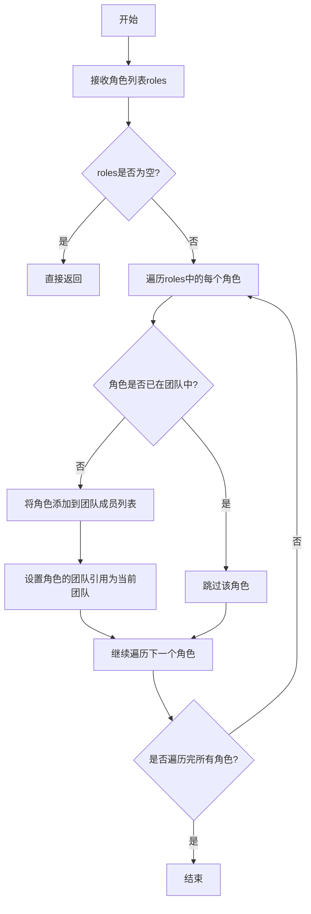

#### 带注释源码

```python
def hire(self, roles: List[Role]):
    """
    向团队中添加一个或多个角色成员
    
    Args:
        roles: 要添加到团队中的角色对象列表
        
    Returns:
        None
    """
    # 遍历传入的角色列表
    for role in roles:
        # 检查角色是否已经在团队中，避免重复添加
        if role not in self.roles:
            # 将角色添加到团队成员列表
            self.roles.append(role)
            # 设置角色的团队引用，建立双向关联
            role.team = self
```

### `Team.serialize`

该方法用于将`Team`对象序列化为JSON格式并保存到指定文件路径。

参数：

- `path`：`Path`，序列化后JSON文件的保存路径。

返回值：`None`，无返回值。

#### 流程图

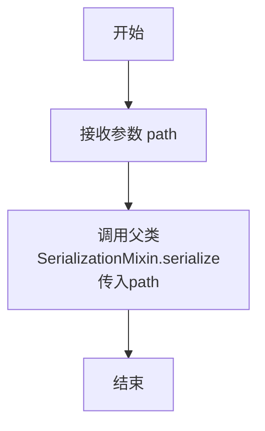

#### 带注释源码

```python
def serialize(self, path: Path):
    """
    将Team对象序列化到指定路径。
    
    参数:
        path (Path): 序列化后JSON文件的保存路径。
    """
    # 调用父类SerializationMixin的serialize方法实现序列化
    super().serialize(path)
```

### `SearchEngine.__init__`

该方法用于初始化 `SearchEngine` 类的实例，根据传入的搜索引擎类型配置相应的搜索客户端。

参数：

- `engine`：`SearchEngineType`，指定要使用的搜索引擎类型（如 `SearchEngineType.SERPAPI_GOOGLE`、`SearchEngineType.SERPAPI_DUCK_DUCK_GO` 等）。
- `run_func`：`Callable`，可选参数，用于执行搜索的函数。如果未提供，将根据 `engine` 参数使用默认的搜索函数。
- `proxy`：`str`，可选参数，指定代理服务器的地址，格式为 `http://<ip>:<port>`。
- `api_key`：`str`，可选参数，某些搜索引擎（如 SerpAPI）所需的 API 密钥。

返回值：`None`，该方法不返回任何值，仅用于初始化对象。

#### 流程图

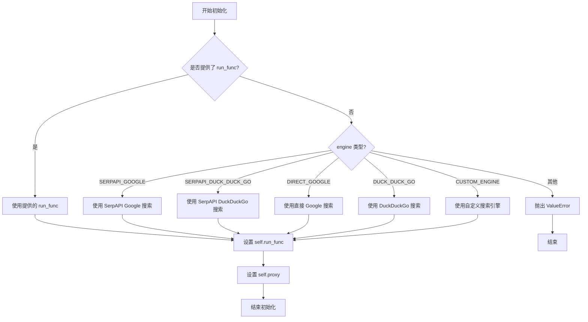

#### 带注释源码

```python
def __init__(
    self,
    engine: SearchEngineType = None,
    run_func: Callable = None,
    proxy: str = None,
    api_key: str = None,
):
    """
    初始化 SearchEngine 实例。

    Args:
        engine (SearchEngineType): 搜索引擎类型，默认为 None。
        run_func (Callable): 可选的搜索执行函数，如果提供则覆盖默认的搜索引擎逻辑。
        proxy (str): 代理服务器地址，格式为 'http://<ip>:<port>'。
        api_key (str): 某些搜索引擎（如 SerpAPI）所需的 API 密钥。
    """
    self.engine = engine  # 存储搜索引擎类型
    self.proxy = proxy  # 存储代理服务器地址
    self.api_key = api_key  # 存储 API 密钥

    # 如果提供了自定义的 run_func，则直接使用它
    if run_func:
        self.run_func = run_func
        return

    # 根据 engine 类型选择默认的搜索函数
    if engine is SearchEngineType.SERPAPI_GOOGLE:
        # 使用 SerpAPI 进行 Google 搜索
        self.run_func = partial(serpapi_search, engine="google", api_key=api_key, proxy=proxy)
    elif engine is SearchEngineType.SERPAPI_DUCK_DUCK_GO:
        # 使用 SerpAPI 进行 DuckDuckGo 搜索
        self.run_func = partial(serpapi_search, engine="duckduckgo", api_key=api_key, proxy=proxy)
    elif engine is SearchEngineType.DIRECT_GOOGLE:
        # 使用直接 Google 搜索（可能绕过某些限制）
        self.run_func = partial(direct_google_search, proxy=proxy)
    elif engine is SearchEngineType.DUCK_DUCK_GO:
        # 使用 DuckDuckGo 搜索
        self.run_func = partial(duckduckgo_search, proxy=proxy)
    elif engine is SearchEngineType.CUSTOM_ENGINE:
        # 使用自定义搜索引擎，需要用户自行实现
        self.run_func = partial(custom_search, proxy=proxy)
    else:
        # 如果 engine 类型不支持，抛出异常
        raise ValueError(
            f"不支持该搜索引擎: {engine}. "
            f"请从 {[e.value for e in SearchEngineType]} 中选择，或提供自定义的 run_func。"
        )
```

### `SearchEngine.run`

该方法用于执行搜索查询，根据给定的查询字符串和最大结果数，返回一个包含搜索结果的列表。它通过调用底层的搜索引擎API来获取原始结果，然后进行解析和格式化，最终返回一个结构化的搜索结果列表。

参数：

- `query`：`str`，搜索查询字符串，用于指定搜索内容
- `max_results`：`int`，可选参数，指定返回的最大结果数量，默认为6

返回值：`List[dict]`，返回一个字典列表，每个字典包含一个搜索结果的详细信息，如标题、链接、摘要等

#### 流程图

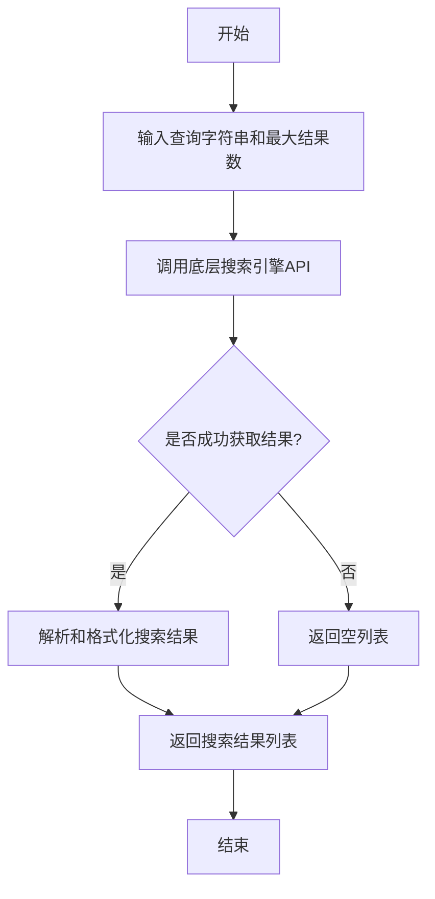

#### 带注释源码

```python
async def run(self, query: str, max_results: int = 6) -> List[dict]:
    """
    执行搜索查询并返回结果列表。

    Args:
        query (str): 搜索查询字符串。
        max_results (int): 返回的最大结果数量，默认为6。

    Returns:
        List[dict]: 包含搜索结果的字典列表，每个字典包含标题、链接、摘要等信息。
    """
    # 调用底层搜索引擎API获取原始结果
    raw_results = await self._search_engine.search(query, max_results)
    
    # 如果未获取到结果，返回空列表
    if not raw_results:
        return []
    
    # 解析和格式化搜索结果
    formatted_results = []
    for result in raw_results:
        formatted_result = {
            "title": result.get("title", ""),
            "link": result.get("link", ""),
            "snippet": result.get("snippet", ""),
            # 可以根据需要添加更多字段
        }
        formatted_results.append(formatted_result)
    
    return formatted_results
```

## 关键组件


### 张量索引与惰性加载

在测试代码中，通过 `mocker.patch` 和 `search_engine_mocker` 模拟了外部依赖（如 LLM 和搜索引擎）的行为，这体现了在测试环境中对复杂外部系统进行“惰性加载”和“索引”的思想，即通过模拟对象按需提供预设的响应，而非真实调用，以提高测试的隔离性和执行速度。

### 反量化支持

代码通过 `mock_llm_ask` 函数模拟了大型语言模型（LLM）对不同类型提示词（prompt）的响应。这可以看作是对 LLM 复杂输出的一种“反量化”或“解码”过程的模拟，将抽象的模型能力转化为测试场景中可预测、结构化的字符串返回值，以验证上层业务逻辑的正确性。

### 量化策略

测试用例 `test_write_report` 中，针对包含不同特殊字符（如 `/`, `:`, `*`, `?`, `<`, `>`, `|`, `\n`）的文件名主题（topic）进行了处理验证。这体现了一种对输入进行“量化”或“规范化”的策略，即将可能包含非法或特殊字符的原始输入，通过内部逻辑（推测是 `write_report` 方法）转化为安全、标准的文件名（如 `1. metagpt.md`），确保了文件系统操作的稳定性和安全性。


## 问题及建议


### 已知问题

-   **测试代码与实现代码耦合度高**：测试文件 `test_researcher.py` 直接修改了被测试模块 `researcher` 的类变量 `RESEARCH_PATH` (`researcher.RESEARCH_PATH = Path(dirname)`)。这种做法破坏了测试的隔离性，可能导致测试间相互干扰，且当实现代码的变量名或结构改变时，测试代码会直接失效。
-   **模拟数据过于简单且随机**：`mock_llm_ask` 函数中，对于 `"Not relevant."` 的提示，返回 `"Not relevant" if random() > 0.5 else prompt[-100:]`。这种基于随机数的模拟行为会导致测试结果不稳定，属于“不稳定的测试”(Flaky Test)，降低了测试的可靠性。
-   **测试覆盖不完整**：测试主要验证了报告生成和文件写入的成功路径，但对于 `CollectLinks` 等关键组件的异常情况（如网络错误、搜索结果为空、关键词提取失败等）缺乏测试用例。
-   **硬编码的测试数据**：测试中使用的主题 `"dataiku vs. datarobot"` 和模拟的LLM返回结果都是硬编码的，这限制了测试发现边界情况或不同输入模式问题的能力。
-   **序列化测试过于简单**：`test_serialize` 测试仅调用了 `team.serialize` 方法并检查其是否抛出异常，但没有验证序列化后文件内容的正确性，也没有测试反序列化功能，测试价值有限。

### 优化建议

-   **解耦测试与实现**：避免在测试中直接修改被测试模块的全局状态。应通过依赖注入、使用mock/patch替换特定实例的属性，或重构代码使其更易于测试（例如，将 `RESEARCH_PATH` 作为 `Researcher` 构造函数的参数）。
-   **使用确定性的模拟数据**：重构 `mock_llm_ask` 函数，使其行为完全由输入决定，移除 `random()` 调用。可以维护一个字典，将特定的提示词映射到确定的响应，确保每次测试运行结果一致。
-   **补充异常和边界测试**：为 `Researcher.run`、`CollectLinks.run` 和 `write_report` 等方法添加测试用例，覆盖网络异常、无效输入、空结果、文件写入权限错误等场景。使用 `pytest.raises` 来断言预期的异常。
-   **参数化测试用例**：使用 `@pytest.mark.parametrize` 装饰器来运行多组输入数据的测试，特别是针对 `write_report` 方法中文件名清理逻辑的测试，可以更系统地验证不同特殊字符的处理情况。
-   **增强序列化/反序列化测试**：在 `test_serialize` 中，序列化后应读取生成的文件，然后反序列化创建一个新的 `Team` 对象，并验证反序列化后的对象状态（如角色列表、角色类型）与原始对象一致。
-   **提升测试可读性与维护性**：将 `mock_llm_ask` 函数及其相关的补丁逻辑提取到测试类或独立的fixture中。为复杂的测试步骤添加注释，说明其意图。
-   **考虑集成测试与单元测试分离**：当前测试混合了单元测试（如 `test_write_report`）和集成测试（如 `test_researcher`）。考虑将它们分开，并对 `Researcher` 的核心逻辑进行更纯粹、隔离的单元测试。


## 其它


### 设计目标与约束

该代码是一个针对 `Researcher` 角色的单元测试套件。其核心设计目标是验证 `Researcher` 角色及其相关组件（如 `CollectLinks` 动作）在模拟环境下的功能正确性，包括研究流程的执行、报告生成以及团队序列化。主要约束包括：1) 测试必须隔离外部依赖，特别是大型语言模型（LLM）和搜索引擎，通过 `mocker` 和 `mock_llm_ask` 函数进行模拟；2) 文件操作必须在临时目录中进行，以确保测试的独立性和可重复性；3) 测试需要覆盖边界情况，例如包含特殊字符的文件名处理。

### 错误处理与异常设计

代码中的错误处理主要通过 `pytest` 的断言机制来实现，用于验证预期行为。例如，`assert` 语句用于检查生成的研究报告文件内容是否正确。对于文件路径和写入操作，代码依赖 `pathlib.Path` 和 `tempfile.TemporaryDirectory`，它们能自动处理操作系统级别的错误（如权限不足、路径无效），并在上下文管理器退出时清理临时文件，避免了资源泄漏。在模拟函数 `mock_llm_ask` 中，通过条件分支返回预设的模拟响应，隐式地假设了所有可能的 `prompt` 分支都被覆盖，若出现未覆盖的 `prompt` 则返回空字符串，这可能掩盖潜在的逻辑错误。测试本身不包含显式的异常捕获，因为其目的是在异常发生时使测试失败。

### 数据流与状态机

测试的数据流始于测试函数的调用（如 `test_researcher`）。首先，创建临时目录并设置主题。然后，通过 `mocker.patch` 将 LLM 的 `aask` 方法替换为 `mock_llm_ask` 函数，从而拦截并模拟所有 LLM 请求。`mock_llm_ask` 函数根据 `prompt` 参数的内容返回预定义的字符串，模拟了研究过程中关键词生成、查询构建、结果筛选和报告撰写等步骤的 LLM 响应。在 `test_researcher` 中，`Researcher` 角色的 `run` 方法被调用，驱动内部的状态转换（从初始化、收集链接、分析内容到生成报告）。最终，数据流汇聚于文件系统，检查是否在指定路径生成了包含正确内容的研究报告文件。`test_write_report` 的数据流更直接，专注于 `write_report` 方法，验证其能正确处理包含特殊字符的主题并生成正确的文件名和内容。

### 外部依赖与接口契约

1.  **外部依赖**：
    *   **`metagpt` 框架模块**：核心依赖，包括 `Researcher` 角色、`CollectLinks` 动作、`Team` 类以及 `SearchEngine`。
    *   **`pytest`**：测试框架，提供测试装饰器（如 `@pytest.mark.asyncio`）、夹具（如 `mocker`）和断言功能。
    *   **`tempfile` / `pathlib`**：用于创建和管理临时目录与文件路径。
    *   **`random`**：用于在 `mock_llm_ask` 中模拟随机行为。

2.  **接口契约**：
    *   **`mock_llm_ask(self, prompt: str, system_msgs)`**：这是一个模拟函数，其接口必须与被模拟的 `BaseLLM.aask` 方法兼容。它接收 `prompt` 和 `system_msgs` 参数，并返回一个字符串。测试的成功依赖于该函数对特定 `prompt` 模式返回预期值。
    *   **`Researcher.run(topic)`**：测试期望此异步方法能接收一个研究主题字符串，并最终在 `RESEARCH_PATH` 下生成对应的研究报告文件。
    *   **`Researcher.write_report(topic, content)`**：测试期望此方法能接收主题和内容，处理主题字符串中的无效文件名字符，并将内容写入到 `RESEARCH_PATH` 下以处理后的主题命名的 `.md` 文件中。
    *   **`Team.serialize(path)`**：测试期望此方法能将团队状态序列化到指定路径的文件中。
    *   **`SearchEngine`**：在 `test_researcher` 中，`CollectLinks` 动作的 `search_engine` 被显式替换为一个 `SearchEngine` 实例（尽管其搜索功能可能被 `search_engine_mocker` 夹具进一步模拟），这验证了角色与搜索引擎组件的集成接口。

### 测试策略与覆盖范围

测试策略采用单元测试和集成测试相结合的方式。`test_write_report` 是更纯粹的单元测试，专注于单个方法的功能。`test_researcher` 则是集成测试，它验证了 `Researcher` 角色与多个内部动作（尤其是 `CollectLinks`）以及模拟的 LLM 和搜索引擎协同工作的完整流程。`test_serialize` 测试了团队的序列化功能。覆盖范围包括：正常研究流程、文件名安全处理（针对 Windows 等系统文件名限制）、以及对象的序列化/反序列化（通过 `serialize` 方法）。通过 `mock_llm_ask` 中对不同 `prompt` 的分支响应，测试间接覆盖了研究流程中的多个决策点。然而，测试未覆盖网络错误、磁盘已满、LLM响应格式异常等负面场景。

    