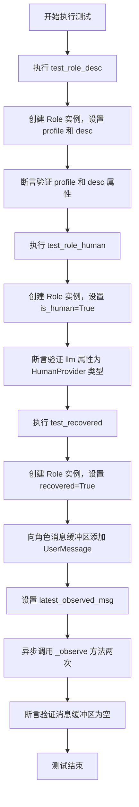
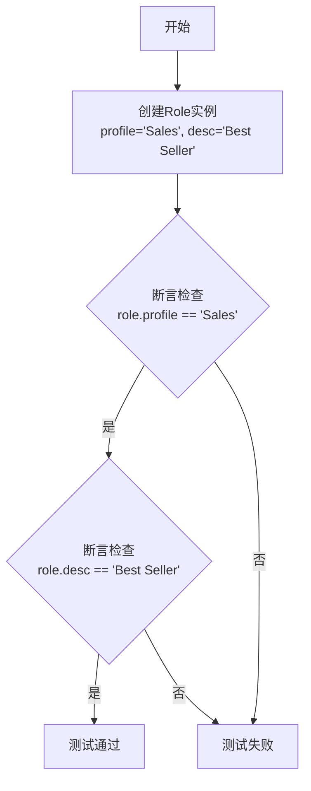
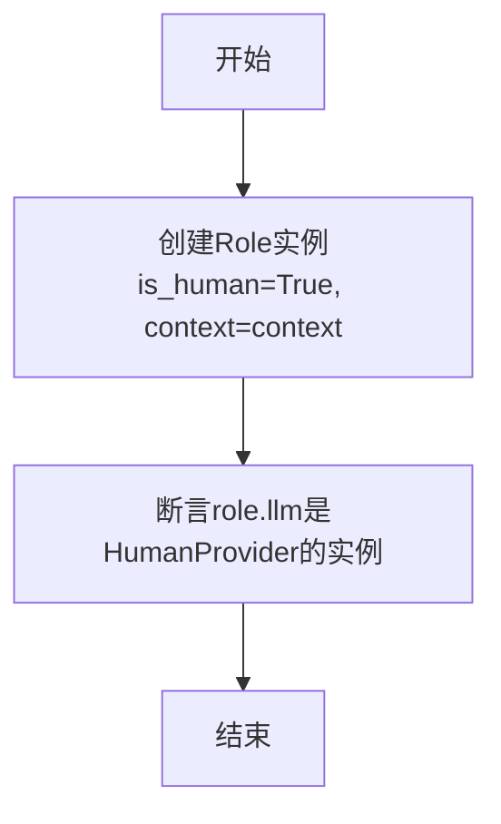
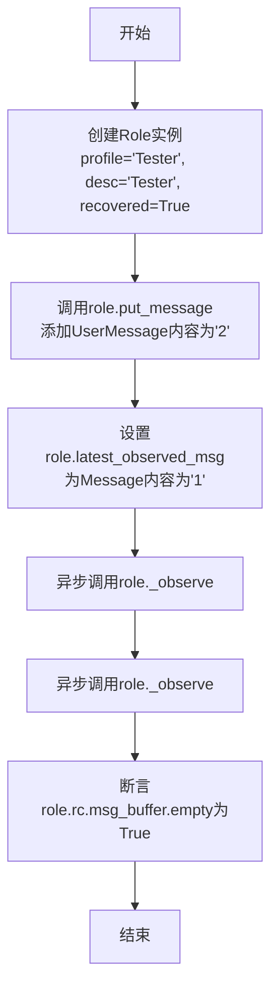
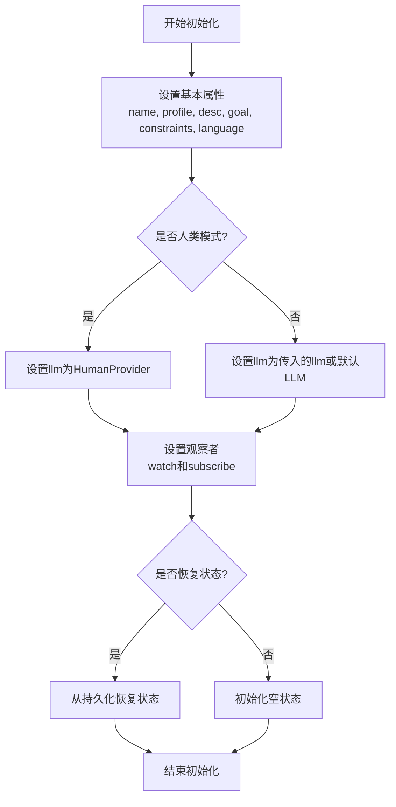
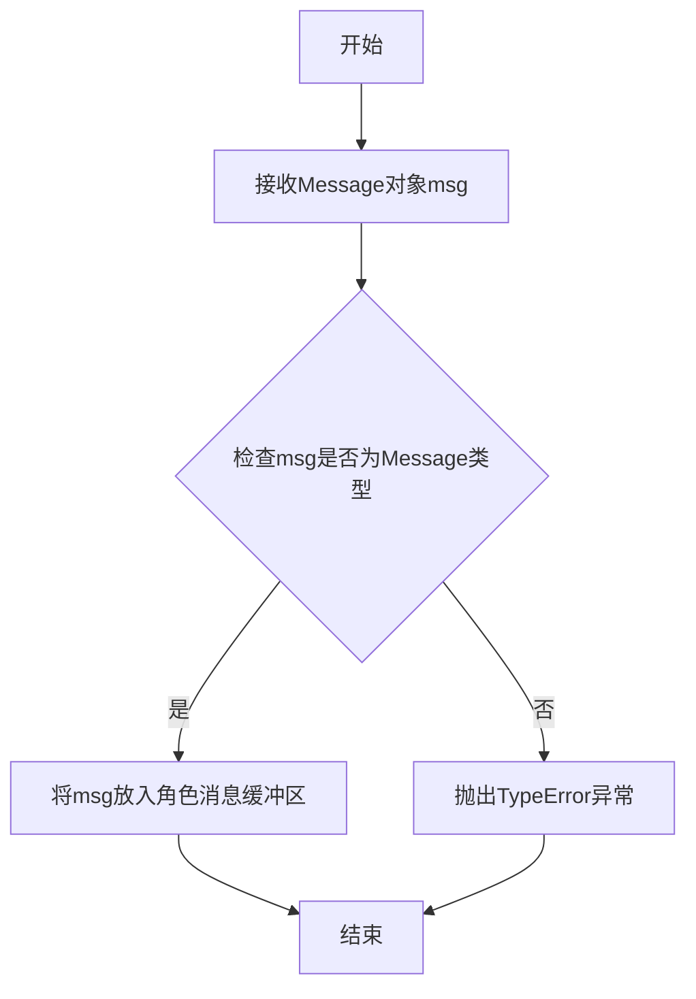
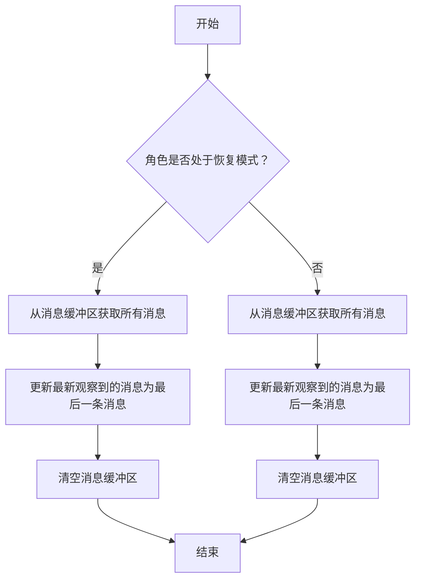

# `.\MetaGPT\tests\metagpt\roles\test_role.py` 详细设计文档

该文件是一个针对 Role 类的单元测试文件，用于验证 Role 类的基本属性设置、人类模式下的 LLM 提供者类型以及消息观察与恢复机制的正确性。

## 整体流程



## 类结构

```
Role (被测试类)
├── 属性: profile, desc, is_human, llm, rc, latest_observed_msg
├── 方法: __init__, put_message, _observe
HumanProvider (依赖类)
Message (依赖类)
UserMessage (依赖类，继承自 Message)
```

## 全局变量及字段


### `Role.profile`
    
角色的职业或身份描述，用于标识角色的类型或功能

类型：`str`
    


### `Role.desc`
    
角色的详细描述或说明，提供更具体的角色信息

类型：`str`
    


### `Role.is_human`
    
标识角色是否为人类用户，决定是否使用HumanProvider作为LLM

类型：`bool`
    


### `Role.llm`
    
语言模型提供者，根据is_human标志决定使用AI模型还是人类输入

类型：`Union[BaseLLM, HumanProvider]`
    


### `Role.rc`
    
角色上下文对象，管理角色的运行状态和消息缓冲区

类型：`RoleContext`
    


### `Role.latest_observed_msg`
    
最近观察到的消息，用于避免重复处理相同的消息

类型：`Message`
    
    

## 全局函数及方法

### `test_role_desc`

该函数是一个单元测试，用于验证`Role`类在初始化时是否正确设置了`profile`和`desc`属性。它创建一个`Role`实例，并断言其`profile`和`desc`属性与传入的构造参数一致。

参数：

- 无显式参数

返回值：`None`，无返回值

#### 流程图



#### 带注释源码

```python
def test_role_desc():
    # 创建一个Role类的实例，传入profile和desc参数
    role = Role(profile="Sales", desc="Best Seller")
    # 断言：检查实例的profile属性是否等于"Sales"
    assert role.profile == "Sales"
    # 断言：检查实例的desc属性是否等于"Best Seller"
    assert role.desc == "Best Seller"
```

### `test_role_human`

该函数是一个单元测试，用于验证当创建一个`Role`实例并设置`is_human=True`时，其`llm`属性是否为`HumanProvider`的实例。

参数：

- `context`：`Context`，测试上下文对象，用于初始化`Role`实例。

返回值：`None`，该函数为测试函数，不返回任何值。

#### 流程图



#### 带注释源码

```python
def test_role_human(context):
    # 创建一个Role实例，设置is_human为True，并传入测试上下文
    role = Role(is_human=True, context=context)
    # 断言role的llm属性是HumanProvider类的实例
    assert isinstance(role.llm, HumanProvider)
```

### `test_recovered`

该函数是一个异步单元测试，用于验证 `Role` 类在恢复模式下的行为。具体来说，它测试当 `Role` 实例被设置为恢复模式时，其消息缓冲区在多次调用 `_observe` 方法后是否为空。

参数：

- 无显式参数，但使用了 `pytest.mark.asyncio` 装饰器，使其成为一个异步测试函数。

返回值：`None`，无显式返回值，但通过断言验证测试结果。

#### 流程图



#### 带注释源码

```python
@pytest.mark.asyncio
async def test_recovered():
    # 创建一个Role实例，设置profile为'Tester'，desc为'Tester'，并启用恢复模式（recovered=True）
    role = Role(profile="Tester", desc="Tester", recovered=True)
    
    # 向Role实例的消息队列中添加一条UserMessage，内容为'2'
    role.put_message(UserMessage(content="2"))
    
    # 设置Role实例的latest_observed_msg属性为一条Message，内容为'1'
    role.latest_observed_msg = Message(content="1")
    
    # 异步调用Role实例的_observe方法，模拟观察消息的过程
    await role._observe()
    
    # 再次异步调用_observe方法，验证在恢复模式下消息缓冲区是否被正确处理
    await role._observe()
    
    # 断言Role实例的消息缓冲区为空，验证恢复模式下消息被正确消费
    assert role.rc.msg_buffer.empty()
```

### `Role.__init__`

该方法用于初始化`Role`类的实例，设置角色的基本属性、上下文、语言模型、观察者等，并根据参数配置恢复状态或设置人类交互模式。

参数：

- `name`：`str`，角色的名称，默认为空字符串
- `profile`：`str`，角色的职业或身份描述，默认为空字符串
- `desc`：`str`，角色的详细描述，默认为空字符串
- `goal`：`str`，角色的目标，默认为空字符串
- `constraints`：`str`，角色的约束条件，默认为空字符串
- `language`：`str`，角色使用的语言，默认为"en"
- `is_human`：`bool`，标识角色是否为人类交互模式，默认为`False`
- `recovered`：`bool`，标识角色是否从持久化状态恢复，默认为`False`
- `context`：`Context`，角色的上下文环境，包含配置和共享资源
- `llm`：`BaseLLM`，语言模型实例，用于角色决策和交互，默认为`None`
- `watch`：`list[str]`，角色关注的行动或消息类型列表，默认为空列表
- `subscribe`：`list[Type[Role]]`，角色订阅的其他角色类型列表，默认为空列表

返回值：`None`，无返回值

#### 流程图



#### 带注释源码

```python
def __init__(
    self,
    name: str = "",
    profile: str = "",
    desc: str = "",
    goal: str = "",
    constraints: str = "",
    language: str = "en",
    is_human: bool = False,
    recovered: bool = False,
    context: Context = None,
    llm: BaseLLM = None,
    watch: list[str] = [],
    subscribe: list[Type[Role]] = [],
):
    # 设置角色的基本属性
    self.name = name
    self.profile = profile
    self.desc = desc
    self.goal = goal
    self.constraints = constraints
    self.language = language

    # 设置上下文，如果未提供则使用全局上下文
    self.context = context or GlobalContext()
    # 设置语言模型，如果是人类模式则使用HumanProvider，否则使用传入的llm或默认LLM
    self.llm = HumanProvider() if is_human else llm or self.context.llm()
    # 设置观察者关注的行动类型
    self.watch = watch
    # 设置订阅的其他角色类型
    self.subscribe = subscribe

    # 初始化角色的运行时配置
    self.rc = RoleContext()
    # 初始化角色的记忆存储
    self.mem = LongTermMemory()
    # 初始化角色的动作集合
    self.actions = []
    # 初始化角色的状态
    self.states = []
    # 初始化角色的最新观察消息
    self.latest_observed_msg = None

    # 如果角色是从持久化状态恢复的，则调用恢复方法
    if recovered:
        self.recover()
```

### `Role.put_message`

该方法用于向角色的消息缓冲区中添加一条消息。它接收一个 `Message` 对象作为参数，并将其放入角色的消息队列中，以便后续处理。

参数：

- `msg`：`Message`，要添加到消息缓冲区的消息对象。

返回值：`None`，无返回值。

#### 流程图



#### 带注释源码

```python
def put_message(self, msg: Message):
    """
    将消息放入角色的消息缓冲区。

    参数:
        msg (Message): 要添加的消息对象。

    异常:
        TypeError: 如果msg不是Message类型。
    """
    if not isinstance(msg, Message):
        raise TypeError(f"Expected Message type, but got {type(msg)}")
    self.rc.msg_buffer.put(msg)  # 将消息放入角色的消息缓冲区
```

### `Role._observe`

该方法用于观察并处理角色（Role）的消息缓冲区中的消息。它会从消息缓冲区中获取所有消息，更新最新观察到的消息，并清空消息缓冲区。如果角色处于恢复模式（recovered=True），则只处理最新的一条消息，并清空缓冲区。

参数：

- `self`：`Role`，当前角色实例

返回值：`None`，无返回值

#### 流程图



#### 带注释源码

```python
async def _observe(self) -> None:
    """
    观察并处理消息缓冲区中的消息。
    如果角色处于恢复模式，则只处理最新的一条消息并清空缓冲区。
    否则，处理所有消息并清空缓冲区。
    """
    if self.recovered:
        # 如果处于恢复模式，只处理最新的一条消息
        if not self.rc.msg_buffer.empty():
            # 从消息缓冲区获取所有消息
            msg = self.rc.msg_buffer.get_all()
            # 更新最新观察到的消息为最后一条消息
            self.latest_observed_msg = msg[-1] if msg else None
            # 清空消息缓冲区
            self.rc.msg_buffer.clear()
    else:
        # 如果未处于恢复模式，处理所有消息
        if not self.rc.msg_buffer.empty():
            # 从消息缓冲区获取所有消息
            msg = self.rc.msg_buffer.get_all()
            # 更新最新观察到的消息为最后一条消息
            self.latest_observed_msg = msg[-1] if msg else None
            # 清空消息缓冲区
            self.rc.msg_buffer.clear()
```

## 关键组件


### Role类

Role类是MetaGPT框架中用于定义和模拟智能体角色的核心基类，它封装了角色的基本属性（如profile、desc）和行为模式（如观察、思考、行动），是构建具体智能体（如销售、测试员）的基础。

### HumanProvider

HumanProvider是一个特殊的LLM（大语言模型）提供者，当角色被标记为人类（is_human=True）时，Role类会使用它来模拟人类用户的输入交互，从而在自动化流程中引入人工决策或反馈环节。

### 消息系统（Message & UserMessage）

消息系统是Role类内部通信和状态管理的核心组件。Message和UserMessage是用于在不同角色或系统组件间传递信息的结构化数据对象。Role类通过`put_message`方法接收消息，并通过`_observe`方法处理消息队列，实现异步的事件驱动行为。

### 角色上下文（RoleContext）

RoleContext（通过`role.rc`访问）是Role类内部用于管理运行时状态和配置的上下文对象。它包含如`msg_buffer`（消息缓冲区）等关键属性，用于控制角色的观察、思考和行动循环。在测试中，通过检查`msg_buffer.empty()`来验证状态恢复逻辑。

### 恢复机制（recovered）

恢复机制是Role类的一个初始化参数。当设置为True时，表明该角色实例是从某个持久化状态恢复而来。这会影响其内部状态初始化逻辑，例如在测试中，它被用来验证角色在恢复后能正确处理消息队列而不产生重复观察。


## 问题及建议


### 已知问题

-   **测试用例 `test_recovered` 的命名和逻辑存在歧义**：测试函数名为 `test_recovered`，但其核心逻辑是测试在 `recovered=True` 状态下，`_observe` 方法的行为（即观察后消息缓冲区被清空）。这个命名未能清晰反映其测试意图，更像是测试 `_observe` 方法在特定状态下的副作用，而非 `recovered` 属性本身的功能或状态恢复逻辑。
-   **测试覆盖不完整**：当前的单元测试仅覆盖了 `Role` 类的构造函数、`is_human` 属性对 `llm` 的影响，以及 `recovered` 模式下的 `_observe` 行为。对于 `Role` 类的核心方法（如 `_act`, `_react`, `_think` 等）、状态机（`rc` 中的各种状态）、消息处理流程（`_observe` 的完整逻辑、`put_message` 的多种场景）等均未进行测试。
-   **测试数据硬编码**：测试中使用的消息内容（如 `"1"`, `"2"`）是硬编码的，虽然对于简单测试可以接受，但如果测试逻辑变得更复杂，硬编码数据可能降低测试的可读性和可维护性。
-   **缺乏对异常和边界条件的测试**：没有测试 `Role` 在接收到异常消息、空消息或处理过程中发生错误时的行为。例如，当 `llm` 为 `None` 或 `HumanProvider` 在特定操作下可能抛出的异常。
-   **`test_role_human` 测试依赖外部上下文**：该测试需要传入 `context` 参数，虽然这是通过 pytest fixture 提供的，但测试本身没有展示或验证这个 `context` 的具体内容或结构，使得测试的独立性稍弱，对 `context` 的构造方式存在隐式依赖。

### 优化建议

-   **重构并补充测试用例**：
    -   将 `test_recovered` 重命名为更具体的名称，如 `test_observe_clears_buffer_in_recovered_mode`，以准确反映其测试目的。
    -   为 `Role` 类的其他关键方法（如 `_act`, `_react`, `_think`, `run`）添加单元测试，确保核心逻辑的正确性。
    -   为 `RoleContext` (`rc`) 中的各种状态（如 `news`, `msg_buffer`, `memory` 等）的变化设计测试。
    -   增加对 `_observe` 方法在非 `recovered` 模式下的测试，验证其正常观察和存储消息的逻辑。
-   **使用测试数据工厂或 fixture**：考虑使用 `@pytest.fixture` 创建可复用的 `Role` 实例、`Message` 实例或模拟的 `llm`，以提高测试代码的清晰度和可维护性，避免硬编码。
-   **增加异常和边界测试**：
    -   测试当 `role.llm` 为 `None` 时，调用依赖 `llm` 的方法（如 `_act`）是否按预期处理（例如，抛出 `AttributeError` 或返回特定值）。
    -   测试 `put_message` 方法传入 `None` 或无效类型消息时的行为。
    -   测试 `_observe` 在消息源为空或异常时的行为。
-   **提升测试独立性**：在 `test_role_human` 中，可以显式地构造或模拟测试所需的 `context` 内容，而不是完全依赖外部 fixture，使测试意图更明确，减少对隐形上下文的依赖。
-   **考虑集成测试**：当前都是单元测试。可以补充一些集成测试，模拟 `Role` 与 `Environment`、其他 `Role` 的交互，或者测试完整的 `run` 循环，以验证组件间的协作是否符合预期。


## 其它


### 设计目标与约束

本测试文件的设计目标是验证`metagpt.roles.role.Role`类的核心功能，包括其属性初始化、与人类交互提供者（`HumanProvider`）的集成，以及在特定恢复模式下的消息观察行为。约束条件包括：1) 必须使用`pytest`框架进行单元测试；2) 测试需要覆盖同步和异步方法；3) 测试应独立，不依赖外部服务或复杂环境。

### 错误处理与异常设计

测试文件本身不包含业务逻辑的错误处理，但其测试用例旨在验证`Role`类在特定条件下的行为是否正确。例如，`test_recovered`测试用例验证了当`Role`对象处于`recovered=True`模式时，其内部消息缓冲区在连续观察后应被清空。如果`Role`类的实现有误，这些测试将失败，从而暴露出潜在的错误。测试框架`pytest`会捕获并报告断言失败等异常。

### 数据流与状态机

1.  **状态初始化 (`test_role_desc`, `test_role_human`)**: 测试验证`Role`对象在构造后，其`profile`、`desc`、`llm`等属性是否被正确设置。`test_role_human`还验证了当`is_human=True`时，`llm`属性是否为`HumanProvider`实例。
2.  **消息处理与状态转换 (`test_recovered`)**: 此测试模拟了一个特定的状态机流程：
    *   **初始状态**: `Role`对象被创建，`recovered=True`，`latest_observed_msg`被预设为`Message(content="1")`，同时通过`put_message`放入一个`UserMessage(content="2")`。
    *   **触发动作**: 连续两次调用异步方法`_observe()`。
    *   **状态验证**: 验证动作执行后，角色内部的消息缓冲区 (`role.rc.msg_buffer`) 是否为空。这测试了在恢复模式下，`_observe`方法是否按预期消费了缓冲区中的历史消息和最新观察到的消息。

### 外部依赖与接口契约

1.  **`pytest`框架**: 测试执行和组织的核心依赖。`@pytest.mark.asyncio`装饰器用于支持异步测试函数的运行。
2.  **`metagpt.roles.role.Role`类**: 被测系统（SUT）。测试依赖于其公开的接口（构造函数参数、`put_message`方法、`_observe`方法）和内部状态（`profile`, `desc`, `llm`, `rc.msg_buffer`, `latest_observed_msg`）。
3.  **`metagpt.provider.human_provider.HumanProvider`类**: 验证`Role`的`llm`属性类型时依赖的类。
4.  **`metagpt.schema.Message` 与 `UserMessage`**: 用于构建测试数据（消息对象），测试依赖于它们的构造函数。
5.  **`context` 参数 (`test_role_human`)**: 此测试用例依赖于一个名为`context`的pytest fixture来提供必要的上下文环境。该fixture的定义在其他地方，是本测试的外部依赖。

    