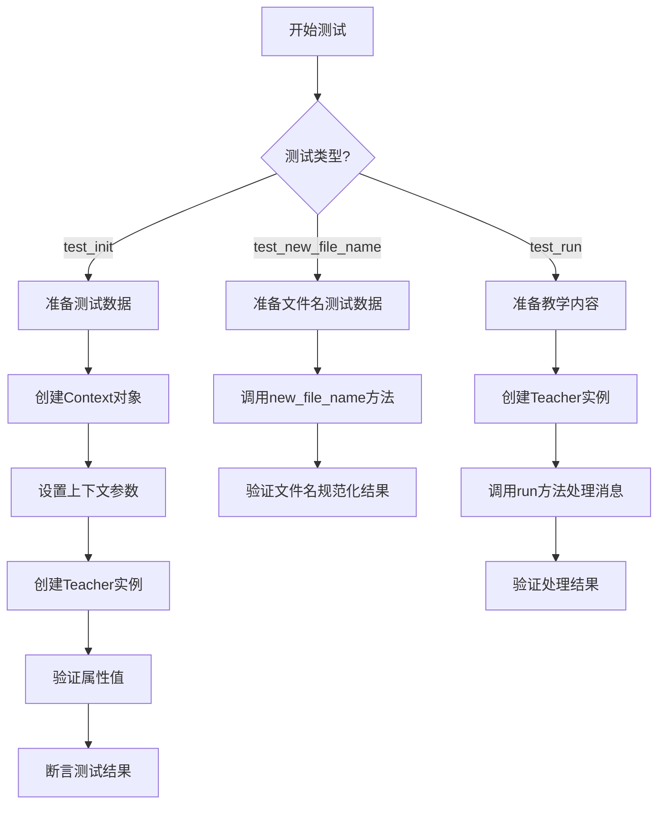
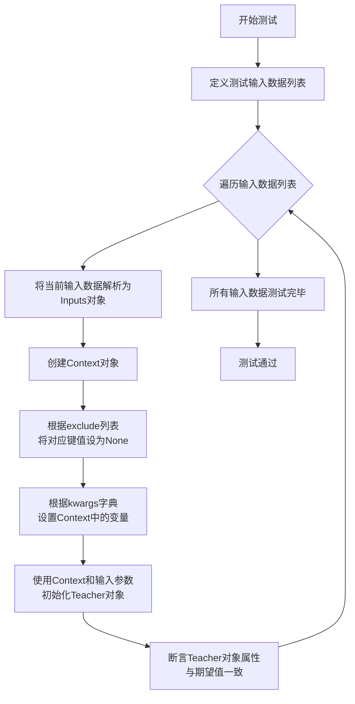
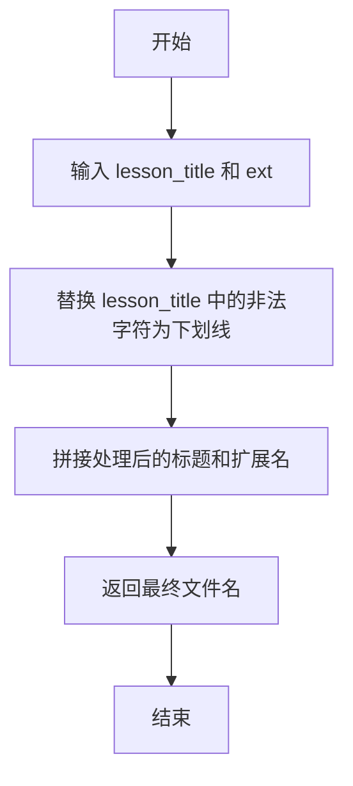
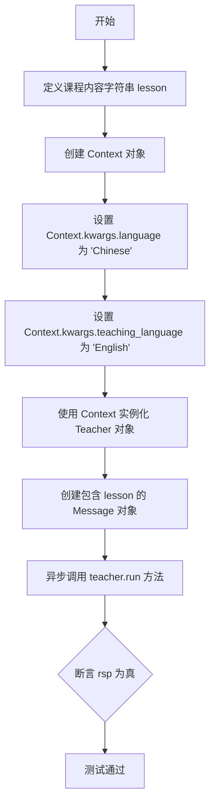
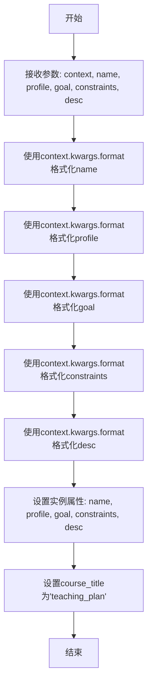
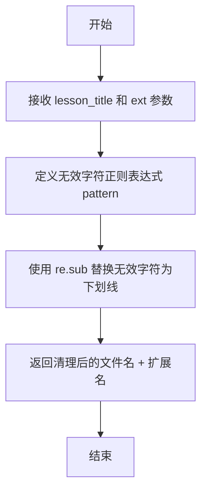
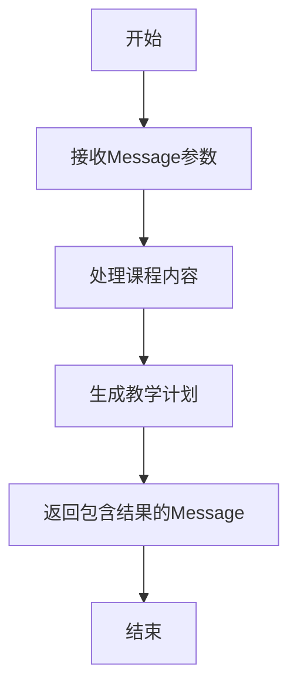

# `.\MetaGPT\tests\metagpt\roles\test_teacher.py` 详细设计文档

这是一个针对Teacher角色的单元测试文件，主要测试Teacher类的初始化、文件名生成方法和核心运行逻辑。测试用例验证了Teacher对象在上下文参数替换下的属性设置、文件名规范化处理以及教学内容的处理能力。

## 整体流程



## 类结构

```
BaseModel (pydantic基类)
├── Inputs (测试输入数据模型)
│   ├── test_init.Inputs
│   └── test_new_file_name.Inputs
Teacher (被测角色类)
├── __init__
├── new_file_name
└── run
```

## 全局变量及字段


### `inputs`
    
测试用例数据列表，包含多个测试场景的输入和期望输出

类型：`List[Dict[str, Any]]`
    


### `seed`
    
当前测试用例的输入数据对象，包含测试参数和期望值

类型：`Inputs`
    


### `context`
    
上下文对象，用于管理测试环境中的配置和参数

类型：`Context`
    


### `teacher`
    
被测试的Teacher类实例，用于执行测试操作

类型：`Teacher`
    


### `lesson`
    
测试用的课程内容字符串，模拟真实的教学材料

类型：`str`
    


### `rsp`
    
Teacher.run方法执行后的响应消息对象

类型：`Message`
    


### `Inputs.name`
    
测试输入的名称参数，可能包含占位符

类型：`str`
    


### `Inputs.profile`
    
测试输入的profile参数，可能包含占位符

类型：`str`
    


### `Inputs.goal`
    
测试输入的goal参数，可能包含占位符

类型：`str`
    


### `Inputs.constraints`
    
测试输入的constraints参数，可能包含占位符

类型：`str`
    


### `Inputs.desc`
    
测试输入的desc参数，可能包含占位符

类型：`str`
    


### `Inputs.kwargs`
    
测试输入的动态参数字典，用于替换占位符

类型：`Optional[Dict]`
    


### `Inputs.expect_name`
    
期望的Teacher.name属性值，用于断言验证

类型：`str`
    


### `Inputs.expect_profile`
    
期望的Teacher.profile属性值，用于断言验证

类型：`str`
    


### `Inputs.expect_goal`
    
期望的Teacher.goal属性值，用于断言验证

类型：`str`
    


### `Inputs.expect_constraints`
    
期望的Teacher.constraints属性值，用于断言验证

类型：`str`
    


### `Inputs.expect_desc`
    
期望的Teacher.desc属性值，用于断言验证

类型：`str`
    


### `Inputs.exclude`
    
需要从上下文中排除的键列表，用于测试占位符替换逻辑

类型：`list`
    


### `Teacher.name`
    
Teacher角色的名称，支持占位符替换

类型：`str`
    


### `Teacher.profile`
    
Teacher角色的简介描述，支持占位符替换

类型：`str`
    


### `Teacher.goal`
    
Teacher角色的目标描述，支持占位符替换

类型：`str`
    


### `Teacher.constraints`
    
Teacher角色的约束条件描述，支持占位符替换

类型：`str`
    


### `Teacher.desc`
    
Teacher角色的详细描述，支持占位符替换

类型：`str`
    


### `Teacher.course_title`
    
课程标题，默认为'teaching_plan'，用于标识教学计划

类型：`str`
    
    

## 全局函数及方法

### `test_init`

该函数是一个异步单元测试，用于验证`Teacher`类的初始化功能。它通过多组输入数据测试`Teacher`对象在初始化时，其属性（如`name`、`profile`、`goal`、`constraints`、`desc`）是否能够根据提供的参数和上下文（`Context`）中的变量进行正确的字符串格式化。测试还验证了`Teacher`对象的`course_title`属性是否被正确设置为默认值"teaching_plan"。

参数：
- 无显式参数。该函数是一个测试函数，其输入数据在函数内部定义。

返回值：`None`，该函数是一个测试函数，不返回任何值，而是通过断言（`assert`）来验证测试结果。

#### 流程图



#### 带注释源码

```python
@pytest.mark.asyncio
async def test_init():
    # 定义内部数据模型Inputs，用于结构化测试输入和期望输出
    class Inputs(BaseModel):
        name: str
        profile: str
        goal: str
        constraints: str
        desc: str
        kwargs: Optional[Dict] = None
        expect_name: str
        expect_profile: str
        expect_goal: str
        expect_constraints: str
        expect_desc: str
        exclude: list = Field(default_factory=list)

    # 定义两组测试用例输入数据
    inputs = [
        {
            # 第一组：kwargs为空，exclude列表指定了需要从Context中移除的变量。
            # 预期Teacher的属性值中的占位符不会被替换。
            "name": "Lily{language}",
            "expect_name": "Lily{language}",
            "profile": "X {teaching_language}",
            "expect_profile": "X {teaching_language}",
            "goal": "Do {something_big}, {language}",
            "expect_goal": "Do {something_big}, {language}",
            "constraints": "Do in {key1}, {language}",
            "expect_constraints": "Do in {key1}, {language}",
            "kwargs": {},
            "desc": "aaa{language}",
            "expect_desc": "aaa{language}",
            "exclude": ["language", "key1", "something_big", "teaching_language"],
        },
        {
            # 第二组：kwargs提供了具体的变量值。
            # 预期Teacher的属性值中的占位符会被kwargs中的值替换。
            "name": "Lily{language}",
            "expect_name": "LilyCN",
            "profile": "X {teaching_language}",
            "expect_profile": "X EN",
            "goal": "Do {something_big}, {language}",
            "expect_goal": "Do sleep, CN",
            "constraints": "Do in {key1}, {language}",
            "expect_constraints": "Do in HaHa, CN",
            "kwargs": {"language": "CN", "key1": "HaHa", "something_big": "sleep", "teaching_language": "EN"},
            "desc": "aaa{language}",
            "expect_desc": "aaaCN",
            "language": "CN",
            "teaching_language": "EN",
        },
    ]

    # 遍历所有测试用例
    for i in inputs:
        # 将字典数据解析为Inputs对象，便于访问
        seed = Inputs(**i)
        # 创建一个新的Context对象
        context = Context()
        # 根据exclude列表，将Context中对应的键值设为None，模拟变量不存在
        for k in seed.exclude:
            context.kwargs.set(k, None)
        # 根据kwargs字典，设置Context中的变量值
        for k, v in seed.kwargs.items():
            context.kwargs.set(k, v)

        # 使用Context和输入参数初始化Teacher对象
        teacher = Teacher(
            context=context,
            name=seed.name,
            profile=seed.profile,
            goal=seed.goal,
            constraints=seed.constraints,
            desc=seed.desc,
        )
        # 断言Teacher对象的各个属性值与期望值一致
        assert teacher.name == seed.expect_name
        assert teacher.desc == seed.expect_desc
        assert teacher.profile == seed.expect_profile
        assert teacher.goal == seed.expect_goal
        assert teacher.constraints == seed.expect_constraints
        # 断言Teacher对象的course_title属性为默认值"teaching_plan"
        assert teacher.course_title == "teaching_plan"
```

### `Teacher.new_file_name`

该方法用于根据课程标题和文件扩展名生成一个安全的、可用于文件系统的文件名。它通过移除或替换标题中的非法字符（如特殊符号、换行符等）来实现。

参数：
- `lesson_title`：`str`，原始的课程标题，可能包含非法文件名字符。
- `ext`：`str`，文件扩展名，例如 `.md` 或 `.cc`。

返回值：`str`，处理后的安全文件名。

#### 流程图



#### 带注释源码

```python
@classmethod
def new_file_name(cls, lesson_title: str, ext: str) -> str:
    """
    根据课程标题和扩展名生成安全的文件名。

    该方法执行以下步骤：
    1. 移除或替换 lesson_title 中的非法文件名字符（如 #@$%!*&\\/:*?"<>|\n\t '）。
    2. 将处理后的标题与给定的扩展名拼接，形成最终的文件名。

    参数:
        lesson_title (str): 原始的课程标题。
        ext (str): 文件扩展名（例如 '.md', '.cc'）。

    返回:
        str: 处理后的安全文件名。
    """
    # 定义需要替换的非法字符模式，使用正则表达式匹配
    # 模式匹配以下字符： # @ $ % ! * & \ / : * ? " < > | \n \t 空格 单引号
    # 并将它们替换为下划线 '_'
    safe_name = re.sub(r'[#@$%!*&\\/:*?"<>|\n\t \']', '_', lesson_title)
    # 将处理后的安全名称与扩展名拼接，形成最终的文件名
    return safe_name + ext
```

### `test_run`

该函数是一个异步单元测试，用于验证`Teacher`类的`run`方法在处理给定课程内容时的功能。它模拟了一个教学场景，其中教师接收包含课程内容的`Message`对象，并返回处理后的响应。

参数：

- `无显式参数`：该函数是一个测试函数，不接收外部参数。它内部定义了测试数据并调用被测方法。

返回值：`None`，该函数是一个测试函数，不返回业务值，而是通过断言验证测试结果。

#### 流程图



#### 带注释源码

```python
@pytest.mark.asyncio
async def test_run():
    # 定义一个多行字符串，模拟一个完整的课程单元内容。
    lesson = """
    UNIT 1 Making New Friends
    TOPIC 1 Welcome to China!
    Section A

    1a Listen and number the following names.
    Jane Mari Kangkang Michael
    Look, listen and understand. Then practice the conversation.
    Work in groups. Introduce yourself using
    I ’m ... Then practice 1a
    with your own hometown or the following places.

    1b Listen and number the following names
    Jane Michael Maria Kangkang
    1c Work in groups. Introduce yourself using I ’m ... Then practice 1a with your own hometown or the following places.
    China the USA the UK Hong Kong Beijing

    2a Look, listen and understand. Then practice the conversation
    Hello! 
    Hello! 
    Hello! 
    Hello! Are you Maria? 
    No, I’m not. I’m Jane.
    Oh, nice to meet you, Jane
    Nice to meet you, too.
    Hi, Maria!
    Hi, Kangkang!
    Welcome to China!
    Thanks.

    2b Work in groups. Make up a conversation with your own name and the
    following structures.
    A: Hello! / Good morning! / Hi! I’m ... Are you ... ?
    B: ...

    3a Listen, say and trace
    Aa Bb Cc Dd Ee Ff Gg

    3b Listen and number the following letters. Then circle the letters with the same sound as Bb.
    Aa Bb Cc Dd Ee Ff Gg

    3c Match the big letters with the small ones. Then write them on the lines.
    """
    # 创建一个应用上下文对象，用于管理配置和依赖。
    context = Context()
    # 在上下文的参数字典中设置教学语言环境：目标语言为中文。
    context.kwargs.language = "Chinese"
    # 在上下文的参数字典中设置教学语言：授课语言为英文。
    context.kwargs.teaching_language = "English"
    # 使用配置好的上下文实例化一个 Teacher 角色对象。
    teacher = Teacher(context=context)
    # 异步调用 Teacher 实例的 run 方法，传入一个包含课程内容的 Message 对象。
    # run 方法预期处理课程内容（如生成教学计划等）并返回一个响应对象。
    rsp = await teacher.run(Message(content=lesson))
    # 使用断言验证 run 方法的返回值 rsp 不为 None 或 False，即确保方法执行成功并返回了有效结果。
    assert rsp
```

### `Teacher.__init__`

该方法用于初始化`Teacher`类的实例，设置教师的基本属性，如姓名、简介、目标、约束和描述，并根据上下文中的变量对这些属性进行格式化。

参数：

- `self`：`Teacher`，当前`Teacher`类的实例
- `context`：`Context`，上下文对象，包含格式化字符串所需的变量
- `name`：`str`，教师的姓名，可能包含占位符
- `profile`：`str`，教师的简介，可能包含占位符
- `goal`：`str`，教师的目标，可能包含占位符
- `constraints`：`str`，教师的约束条件，可能包含占位符
- `desc`：`str`，教师的详细描述，可能包含占位符

返回值：`None`，无返回值

#### 流程图



#### 带注释源码

```python
def __init__(self, context: Context, name: str, profile: str, goal: str, constraints: str, desc: str):
    """
    初始化Teacher实例。
    
    参数:
        context: Context对象，包含格式化字符串所需的变量。
        name: 教师姓名，可能包含占位符。
        profile: 教师简介，可能包含占位符。
        goal: 教师目标，可能包含占位符。
        constraints: 教师约束条件，可能包含占位符。
        desc: 教师详细描述，可能包含占位符。
    """
    # 使用context.kwargs.format格式化字符串，替换占位符为实际值
    self.name = context.kwargs.format(name)  # 格式化姓名
    self.profile = context.kwargs.format(profile)  # 格式化简介
    self.goal = context.kwargs.format(goal)  # 格式化目标
    self.constraints = context.kwargs.format(constraints)  # 格式化约束条件
    self.desc = context.kwargs.format(desc)  # 格式化详细描述
    self.course_title = "teaching_plan"  # 设置课程标题为固定值
```

### `Teacher.new_file_name`

该方法用于根据课程标题生成安全的文件名。它通过移除或替换文件名中不允许的字符（如特殊字符、路径分隔符等）来确保生成的文件名符合文件系统的命名规范。

参数：

- `lesson_title`：`str`，课程标题，可能包含需要清理的特殊字符。
- `ext`：`str`，文件扩展名，例如 `.md` 或 `.cc`。

返回值：`str`，清理后的安全文件名，包含指定的扩展名。

#### 流程图



#### 带注释源码

```python
@staticmethod
def new_file_name(lesson_title: str, ext: str) -> str:
    """
    根据课程标题生成安全的文件名。

    该方法会移除或替换文件名中不允许的字符（如特殊字符、路径分隔符等），
    确保生成的文件名符合文件系统的命名规范。

    Args:
        lesson_title (str): 课程标题，可能包含需要清理的特殊字符。
        ext (str): 文件扩展名，例如 `.md` 或 `.cc`。

    Returns:
        str: 清理后的安全文件名，包含指定的扩展名。
    """
    # 定义匹配无效文件名字符的正则表达式模式
    # 无效字符包括：\ / : * ? " < > | 以及换行符和制表符
    pattern = r'[\\/*?:"<>|\n\t]'
    
    # 使用正则表达式替换无效字符为下划线
    safe_name = re.sub(pattern, '_', lesson_title)
    
    # 返回清理后的文件名加上指定的扩展名
    return safe_name + ext
```

### `Teacher.run`

该方法用于执行教师角色的主要逻辑，接收一个包含课程内容的`Message`对象，处理课程内容并生成教学计划，最终返回一个包含处理结果的`Message`对象。

参数：

- `message`：`Message`，包含课程内容的输入消息对象。

返回值：`Message`，包含处理结果（如生成的教学计划）的输出消息对象。

#### 流程图



#### 带注释源码

```python
async def run(self, message: Message) -> Message:
    """
    执行教师角色的主要逻辑。
    
    该方法接收一个包含课程内容的Message对象，处理课程内容并生成教学计划，
    最终返回一个包含处理结果的Message对象。
    
    Args:
        message (Message): 包含课程内容的输入消息对象。
    
    Returns:
        Message: 包含处理结果（如生成的教学计划）的输出消息对象。
    """
    # 处理课程内容并生成教学计划的逻辑
    # 这里可能包括解析课程内容、生成教学计划、保存文件等操作
    # 最终返回一个包含结果的Message对象
    pass
```

## 关键组件


### 上下文（Context）管理

用于管理全局或会话级别的配置和参数，支持动态设置和获取键值对，为角色（如Teacher）提供运行时环境变量。

### 角色（Teacher）初始化与模板渲染

支持通过字符串模板和上下文变量动态初始化Teacher角色的属性（如name, profile, goal等），实现配置的灵活注入和渲染。

### 文件名生成器（new_file_name）

提供静态方法，用于将课程标题等字符串转换为安全的文件名，通过移除或替换非法字符确保文件系统的兼容性。

### 异步任务执行（run）

Teacher角色的核心异步方法，接收课程内容消息，执行教学计划生成等业务流程，并返回处理结果。

### 参数化测试框架

使用pytest和pydantic BaseModel构建结构化的测试用例，支持多组输入数据的自动化验证，确保代码逻辑的正确性。


## 问题及建议


### 已知问题

-   **测试数据与逻辑耦合**：`test_init` 测试用例中，测试数据（`inputs` 列表）直接包含了用于替换的键值对（如 `"language": "CN"`）和期望结果。这种硬编码方式使得测试用例难以维护和理解，当 `Teacher` 类的初始化逻辑或 `Context.kwargs` 的替换规则发生变化时，需要同步修改大量测试数据，容易出错。
-   **测试用例职责不单一**：`test_init` 测试函数同时测试了 `Teacher` 类的初始化（包括从 `Context` 中获取参数并格式化字符串）和 `course_title` 属性的默认值。这违反了单元测试的单一职责原则，不利于测试失败时的快速定位。
-   **缺少边界和异常测试**：测试用例主要覆盖了正常路径（Happy Path）。缺少对边界条件（如空字符串、超长字符串、特殊字符在 `new_file_name` 方法中的处理）和异常情况（如 `Context.kwargs` 中缺少必要键、传入无效参数类型）的测试，测试覆盖度不足。
-   **`test_run` 测试过于简单且不稳定**：`test_run` 函数仅断言了 `teacher.run` 方法返回了一个非 `None` 值。这是一个非常弱的断言，无法验证 `run` 方法的核心业务逻辑（如是否生成了正确的教学计划、文件等）是否正确执行。此外，该测试依赖于 `Teacher.run` 方法的内部实现（可能涉及LLM调用、文件I/O等），使其成为一个不稳定的集成测试或端到端测试，而非单元测试。
-   **代码重复**：在 `test_init` 中，用于构造 `Teacher` 实例的多个属性（`name`, `profile`, `goal`, `constraints`, `desc`）的断言语句是重复的。虽然当前只有5个属性，但如果未来属性增加，这种模式会导致代码膨胀。

### 优化建议

-   **解耦测试数据与逻辑**：将 `test_init` 中的测试数据重构为更清晰的结构。可以考虑使用 `pytest` 的 `@pytest.mark.parametrize` 装饰器，将输入参数、`Context.kwargs` 设置和期望结果明确分离。甚至可以提取一个辅助函数来根据输入字典设置 `Context` 和生成期望值，使测试用例更专注于验证行为。
-   **拆分测试函数**：将 `test_init` 拆分为两个独立的测试函数：一个专门测试 `Teacher.__init__` 方法中基于 `Context.kwargs` 的字符串格式化功能；另一个专门测试 `Teacher` 实例的默认属性（如 `course_title`）。这符合单一职责原则。
-   **补充边界和异常测试**：
    -   为 `new_file_name` 方法添加测试用例，覆盖空标题、仅包含非法字符的标题、带有路径分隔符的标题等边界情况。
    -   为 `Teacher` 初始化添加测试，模拟 `Context.kwargs` 中部分替换键缺失或值为 `None` 的情况，验证其行为是否符合预期（例如，是保留占位符还是替换为空字符串）。
    -   添加参数类型验证测试（如果 `Teacher` 类有此设计）。
-   **重构 `test_run` 为真正的单元测试并增强断言**：
    -   **隔离依赖**：通过 mocking（使用 `unittest.mock` 或 `pytest-mock`）来模拟 `Teacher.run` 方法内部可能调用的外部服务（如LLM）、文件操作或其他角色交互。确保测试只验证 `Teacher` 类本身的逻辑。
    -   **强化断言**：断言应该验证核心业务逻辑的输出。例如，如果 `run` 方法最终会生成一个 `Message` 或特定数据结构，断言应检查其关键字段（如 `content` 包含特定关键词、结构符合预期）。可以 mock 内部方法，并断言它们以正确的参数被调用。
    -   **考虑测试分类**：如果 `run` 方法确实复杂且涉及集成，考虑将其测试标记为集成测试（如使用 `@pytest.mark.integration`），并与单元测试分开运行。
-   **减少代码重复**：在 `test_init` 中，可以将多个属性的断言封装在一个循环或辅助断言函数中。例如：`for attr in ['name', 'profile', 'goal', 'constraints', 'desc']: assert getattr(teacher, attr) == getattr(seed, f'expect_{attr}')`。这样更简洁，且易于扩展。
-   **提升测试可读性**：为每个测试用例添加更清晰的文档字符串（docstring），说明该用例正在测试的具体场景。在参数化测试中，使用 `ids` 参数为每组测试数据提供有意义的名称。


## 其它


### 设计目标与约束

本测试文件的设计目标是验证 `Teacher` 类的核心功能，包括其初始化时对上下文（Context）中动态参数的解析与替换、生成合规文件名的能力，以及核心的 `run` 方法处理教学材料的能力。约束条件包括：必须使用 `pytest` 框架进行异步测试；测试数据通过 `pydantic.BaseModel` 进行结构化定义和验证，以确保类型安全和数据完整性；测试用例需覆盖正常场景和边界场景（如特殊字符的文件名生成）。

### 错误处理与异常设计

测试文件本身不包含业务逻辑的错误处理，其目的是验证 `Teacher` 类的行为是否符合预期。测试用例通过 `assert` 语句来验证结果，任何未通过 `assert` 的测试都将导致测试失败，从而暴露出 `Teacher` 类实现中的潜在错误。测试数据模型（`Inputs`）利用 `pydantic` 在实例化时进行数据验证，如果输入数据不符合模型定义（如类型错误、缺少必填字段），将抛出 `ValidationError` 异常，使测试在准备阶段就失败，这有助于快速定位测试数据配置问题。

### 数据流与状态机

测试文件中的数据流是线性的、无状态的。每个测试函数（`test_init`, `test_new_file_name`, `test_run`）都是独立的。数据流起始于硬编码的测试输入列表（`inputs`），每个输入字典被转换为强类型的 `Inputs` 对象。在 `test_init` 中，数据流为：输入字典 -> `Inputs` 对象 -> `Context` 对象（注入参数）-> `Teacher` 实例 -> 断言验证属性。在 `test_new_file_name` 中，数据流为：输入字典 -> `Inputs` 对象 -> 调用静态方法 `Teacher.new_file_name` -> 断言验证返回值。在 `test_run` 中，数据流为：硬编码的 `lesson` 字符串 -> 构造 `Message` 对象 -> 调用 `teacher.run` 方法 -> 断言验证返回的响应不为空。整个测试过程不涉及复杂的状态变迁。

### 外部依赖与接口契约

1.  **pytest**: 测试运行框架。契约是使用 `@pytest.mark.asyncio` 装饰器来支持异步测试函数。
2.  **pydantic**: 数据验证与设置管理库。契约是定义 `BaseModel` 的子类来声明测试数据的结构，确保输入数据的有效性。
3.  **metagpt.context.Context**: 外部上下文依赖。契约是 `Teacher` 类的初始化或运行方法需要接收一个 `Context` 对象，并从其 `kwargs` 属性中获取运行时参数（如 `language`, `teaching_language`）。测试中需要模拟此上下文。
4.  **metagpt.roles.teacher.Teacher**: 被测系统（SUT）。契约是其构造函数接受 `name`, `profile`, `goal`, `constraints`, `desc` 等参数，并可能进行模板替换；`new_file_name` 静态方法接受标题和扩展名返回安全文件名；`run` 异步方法接受一个 `Message` 对象并返回一个响应。
5.  **metagpt.schema.Message**: 消息数据模型。契约是 `Teacher.run` 方法的输入参数类型，其 `content` 属性承载教学材料内容。

### 测试策略与覆盖范围

测试策略采用基于输入输出的黑盒测试与基于组件功能的白盒测试相结合。`test_init` 重点测试 `Teacher` 构造函数对字符串模板（如 `{language}`）的解析和上下文参数替换功能，覆盖了有/无 `kwargs` 替换、以及通过 `Context` 排除特定参数（`exclude`）的场景。`test_new_file_name` 是白盒测试，针对文件名生成这一独立工具方法，验证其对非法字符（如 `\ / : * ? " < > |`）和换行符的过滤与替换逻辑。`test_run` 是集成测试/场景测试，验证 `Teacher` 实例在接收到一个完整的教学材料（`lesson`）后，其核心 `run` 方法能够被成功调用并返回非空结果，这间接测试了 `Teacher` 内部可能存在的规划、分析或响应生成流程。覆盖范围包括：对象初始化、属性赋值、静态工具方法、主要业务方法。

    