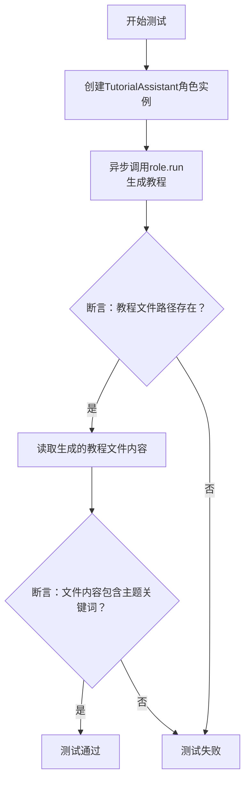
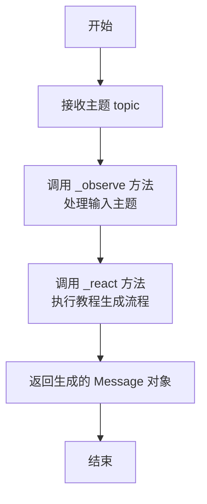

# `.\MetaGPT\tests\metagpt\roles\test_tutorial_assistant.py` 详细设计文档

这是一个使用 pytest 框架编写的异步单元测试文件，用于测试 `TutorialAssistant` 角色类的核心功能。该测试验证了给定一个主题（如“pip”）和一种语言（如“中文”）后，`TutorialAssistant` 能够成功运行并生成一个包含指定主题内容的教程文件。

## 整体流程

```mermaid
graph TD
    A[开始测试] --> B[创建TutorialAssistant实例]
    B --> C[调用role.run(topic)异步方法]
    C --> D[TutorialAssistant内部工作流程]
    D --> E{生成教程文件?}
    E -- 是 --> F[断言教程目录存在]
    F --> G[读取生成的教程文件内容]
    G --> H{内容包含主题关键词?}
    H -- 是 --> I[测试通过]
    H -- 否 --> J[测试失败]
    E -- 否 --> J
```

## 类结构

```
test_tutorial_assistant.py (测试文件)
├── 导入模块 (pytest, metagpt.const, metagpt.roles.tutorial_assistant, metagpt.utils.common)
└── test_tutorial_assistant (异步测试函数)
```

## 全局变量及字段


### `TUTORIAL_PATH`
    
一个常量，表示教程文件存储的根目录路径。

类型：`pathlib.Path`
    


    

## 全局函数及方法

### `test_tutorial_assistant`

这是一个使用 `pytest` 框架编写的异步测试函数，用于测试 `TutorialAssistant` 角色的核心功能。该测试会创建一个指定语言和主题的 `TutorialAssistant` 实例，运行其 `run` 方法生成教程，并验证生成的教程文件是否存在以及内容是否包含预期关键词。

参数：
- `language`：`str`，指定生成教程的语言，例如 “Chinese”。
- `topic`：`str`，指定生成教程的主题，例如 “Write a tutorial about pip”。
- `context`：`pytest` 的 `context` 夹具，提供测试上下文环境。

返回值：`None`，这是一个测试函数，其主要目的是通过断言（`assert`）来验证功能，不返回业务值。

#### 流程图



#### 带注释源码

```python
# 使用pytest的异步和参数化装饰器
@pytest.mark.asyncio
@pytest.mark.parametrize(("language", "topic"), [("Chinese", "Write a tutorial about pip")])
async def test_tutorial_assistant(language: str, topic: str, context):
    # 1. 使用给定的语言和上下文创建TutorialAssistant角色实例
    role = TutorialAssistant(language=language, context=context)
    
    # 2. 异步运行角色的run方法，传入主题，并获取返回的消息
    msg = await role.run(topic)
    
    # 3. 断言：检查预定义的教程存储路径是否存在
    assert TUTORIAL_PATH.exists()
    
    # 4. 从返回的消息中提取文件名（即生成的教程文件路径）
    filename = msg.content
    
    # 5. 异步读取生成的教程文件内容
    content = await aread(filename=filename)
    
    # 6. 断言：验证文件内容中是否包含主题关键词“pip”
    assert "pip" in content
```


### `aread`

`aread` 是一个异步函数，用于异步读取指定文件的内容。它封装了 `aiofiles` 库的异步文件读取功能，提供了一种在异步上下文中读取文件内容的便捷方式。

参数：

- `filename`：`str`，要读取的文件的路径。

返回值：`str`，返回读取到的文件内容字符串。

#### 流程图

```mermaid
flowchart TD
    A[开始: 调用 aread(filename)] --> B{文件是否存在?}
    B -- 是 --> C[使用 aiofiles.open 异步打开文件]
    C --> D[异步读取文件内容]
    D --> E[关闭文件]
    E --> F[返回文件内容字符串]
    B -- 否 --> G[抛出 FileNotFoundError 异常]
    G --> H[结束: 异常终止]
    F --> I[结束: 正常返回]
```

#### 带注释源码

```python
async def aread(filename: str, encoding="utf-8") -> str:
    """
    异步读取文件内容。

    该函数使用 aiofiles 库异步打开并读取指定文件的内容。
    它是对标准同步文件读取操作的异步封装，适用于异步编程环境。

    Args:
        filename (str): 要读取的文件的路径。
        encoding (str, optional): 文件编码，默认为 "utf-8"。

    Returns:
        str: 读取到的文件内容字符串。

    Raises:
        FileNotFoundError: 如果指定的文件不存在。
        IOError: 如果读取文件时发生 I/O 错误。
    """
    # 使用 aiofiles 异步打开文件，指定编码
    async with aiofiles.open(filename, mode="r", encoding=encoding) as reader:
        # 异步读取文件的全部内容
        content = await reader.read()
    # 返回读取到的内容
    return content
```


### `TutorialAssistant.run`

该方法用于启动教程助手的核心工作流程，接收一个主题，生成并保存相应的教程文档。

参数：

- `topic`：`str`，需要生成教程的主题内容。

返回值：`Message`，包含生成的教程文件的路径信息。

#### 流程图



#### 带注释源码

```python
async def run(self, topic: str) -> Message:
    """
    启动教程助手的核心工作流程。
    
    该方法接收一个主题，触发教程助手的观察和反应流程，
    最终生成并保存教程文档，返回包含文件路径的消息。
    
    Args:
        topic (str): 需要生成教程的主题内容。
        
    Returns:
        Message: 包含生成的教程文件路径信息的消息对象。
    """
    # 调用 _observe 方法处理输入的主题，将其转换为内部消息格式
    await self._observe(topic)
    # 调用 _react 方法执行教程生成的核心逻辑
    return await self._react()
```

## 关键组件


### 测试框架与工具

使用 pytest 框架进行异步单元测试，通过 `@pytest.mark.asyncio` 和 `@pytest.mark.parametrize` 装饰器定义测试用例，支持参数化测试和异步执行。

### 角色系统

通过 `TutorialAssistant` 角色类来封装教程生成的核心业务逻辑，测试中通过实例化该角色并调用其 `run` 方法来驱动功能执行。

### 文件系统操作

利用 `TUTORIAL_PATH` 常量定义教程文件的存储路径，并通过 `aread` 异步函数读取生成的教程文件内容，以验证文件生成和内容正确性。

### 断言与验证

在测试中使用断言（`assert`）来验证关键行为，包括检查输出文件路径是否存在以及生成的文件内容是否包含预期的关键词（如 "pip"），确保功能符合预期。


## 问题及建议


### 已知问题

-   **测试用例单一且固定**：当前测试仅使用一组固定的参数（`language="Chinese"`, `topic="Write a tutorial about pip"`）进行测试，无法覆盖`TutorialAssistant`角色在不同语言或不同主题下的行为，测试覆盖度不足。
-   **断言条件过于宽松**：测试仅断言生成的文件内容中包含字符串`"pip"`。这个断言过于简单，无法有效验证生成教程的质量、完整性或是否符合指定语言（如中文）的要求，可能导致测试通过但功能实际不符合预期。
-   **缺少对`TutorialAssistant.run`方法返回值的验证**：测试中使用了`msg.content`作为文件名，但未对`msg`对象的结构、类型或其`content`字段的有效性（例如，是否为合法文件路径）进行任何前置验证。
-   **潜在的异步测试执行问题**：测试使用了`pytest.mark.asyncio`，但未展示对测试执行环境（如事件循环）的明确管理。在更复杂的测试套件中，可能需要更精细的异步上下文控制。
-   **缺少异常路径测试**：测试只验证了正常执行路径（Happy Path），没有测试当输入无效参数（如空主题、不支持的语言）或`TutorialAssistant`内部过程出错时，代码是否能按预期抛出异常或进行错误处理。

### 优化建议

-   **增加参数化测试用例**：使用`@pytest.mark.parametrize`扩展测试数据，覆盖多种语言（如`"English"`, `"Japanese"`）、多种主题以及边界情况（如超长主题、特殊字符主题），以提升测试的健壮性。
-   **强化断言逻辑**：
    -   除了检查关键词，还应验证生成的文件确实位于`TUTORIAL_PATH`目录下。
    -   可以检查文件内容的基本结构（例如，是否包含标题、章节等标记）。
    -   如果`language`参数有意义，应验证生成内容确实为指定语言（可通过简单关键词或字符集判断）。
-   **验证`run`方法的返回值**：在读取文件内容前，可以添加断言检查`msg.content`是否为一个非空字符串，并且该字符串表示的文件路径确实存在。
-   **明确异步测试配置**：考虑使用`pytest-asyncio`插件，并在`pytest.ini`或`conftest.py`中配置异步支持，确保异步测试在所有环境中一致运行。
-   **补充异常测试**：编写新的测试函数，使用`pytest.raises`来验证当传入无效参数时，`TutorialAssistant`的初始化或`run`方法是否会抛出预期的异常（如`ValueError`）。
-   **考虑测试隔离与清理**：当前测试会生成实际文件。建议在测试开始前清理`TUTORIAL_PATH`下的旧测试文件，或在测试结束后进行清理，避免测试间相互影响，并确保测试环境干净。
-   **添加集成测试标记**：由于此测试涉及文件I/O和可能的外部LLM调用（取决于`TutorialAssistant`的实现），可以为其添加`@pytest.mark.integration`等自定义标记，以便与快速运行的单元测试区分开。


## 其它


### 设计目标与约束

本测试文件的设计目标是验证 `TutorialAssistant` 角色类的核心功能，即能够根据给定的主题和语言生成一份教程文档，并确保生成的文档内容正确、格式规范且存储于指定位置。约束条件包括：测试必须异步执行以匹配被测试对象的异步特性；测试环境需要模拟或提供完整的 `context` 上下文对象；测试应聚焦于核心业务流程，避免对底层实现细节（如具体的LLM调用）进行过度验证。

### 错误处理与异常设计

测试用例本身不包含复杂的业务逻辑错误处理，其错误处理主要体现在 `pytest` 框架层面：通过 `assert` 语句验证预期结果（如文件存在性、内容包含特定关键词），若断言失败则测试不通过。对于被测试的 `TutorialAssistant.run` 方法，本测试假设其内部已妥善处理可能出现的异常（如网络错误、文件读写错误）。测试的健壮性依赖于被测试代码的异常处理机制。

### 数据流与状态机

1.  **输入数据流**：测试参数 `language`（语言）和 `topic`（主题）作为初始输入。
2.  **处理过程**：
    *   实例化 `TutorialAssistant` 对象，注入 `language` 和 `context`。
    *   调用异步方法 `role.run(topic)`，触发角色的内部工作流（规划、编写、审查等动作）。此过程是测试的核心验证点。
    *   方法返回一个 `Message` 对象，其 `content` 属性被假定为生成教程的文件路径。
3.  **输出与验证流**：
    *   验证由 `TUTORIAL_PATH` 定义的目录是否存在。
    *   读取 `Message` 中指示的文件内容。
    *   验证文件内容中是否包含主题关键词（如 "pip"），以此间接验证教程内容的相关性。

### 外部依赖与接口契约

1.  **被测试对象**：`metagpt.roles.tutorial_assistant.TutorialAssistant` 类。测试依赖于其构造函数（接受 `language`, `context` 参数）和 `run` 方法（异步，接受 `topic` 参数，返回 `Message` 对象）的公共接口契约。
2.  **工具函数**：`metagpt.utils.common.aread` 异步文件读取函数。测试依赖于其能根据给定文件路径异步读取内容并返回字符串的契约。
3.  **常量**：`metagpt.const.TUTORIAL_PATH`。测试依赖于该常量指向教程文件存储的基础目录。
4.  **测试框架**：`pytest` 及 `pytest-asyncio` 插件。测试依赖于它们提供异步测试环境、参数化测试和断言功能。
5.  **隐式依赖**：`context` 夹具（fixture）。测试依赖于 `conftest.py` 或其它地方定义的 `context` 夹具来提供运行时上下文，这是测试能成功执行的关键前提。

### 测试策略与覆盖范围

本测试采用**集成测试**策略，旨在验证 `TutorialAssistant` 角色从接收指令到产出结果的核心工作流是否畅通。它覆盖了：
*   **角色初始化**：使用特定语言和上下文。
*   **业务流程执行**：调用 `run` 方法触发完整的教程生成流程。
*   **输出验证**：检查物理文件是否生成，以及文件内容是否与主题相关。
测试**未覆盖**：角色内部各个 `Action`（如规划、编写）的独立功能、异常路径（如无效主题、无权限写文件）、性能基准以及生成的教程内容的具体质量与格式细节。这些需由更细粒度的单元测试或专项测试补充。

### 环境与配置要求

1.  **运行环境**：需要支持异步操作的 Python 环境，并安装 `pytest`、`pytest-asyncio` 以及 `metagpt` 项目本身的依赖。
2.  **前置条件**：必须有可用的 `context` 配置，通常包含必要的 LLM 配置、工作区设置等，使 `TutorialAssistant` 能实际执行其任务。这可能在全局的 `conftest.py` 中配置。
3.  **文件系统**：测试需要对 `TUTORIAL_PATH` 指向的目录具有写入权限，以便验证文件生成。
4.  **网络**：如果 `TutorialAssistant` 内部动作需要访问外部服务（如 LLM API），则测试执行时需要相应的网络连接和有效的 API 密钥配置。

    