# `.\MetaGPT\tests\metagpt\serialize_deserialize\__init__.py` 详细设计文档

该代码实现了一个模型工厂系统，用于动态创建和管理不同类型的文本生成模型（如Llama、GPT-2、Falcon等）。它通过抽象基类定义统一的模型接口，使用工厂模式根据配置参数实例化具体模型，并支持模型加载、推理和资源管理等功能。

## 整体流程

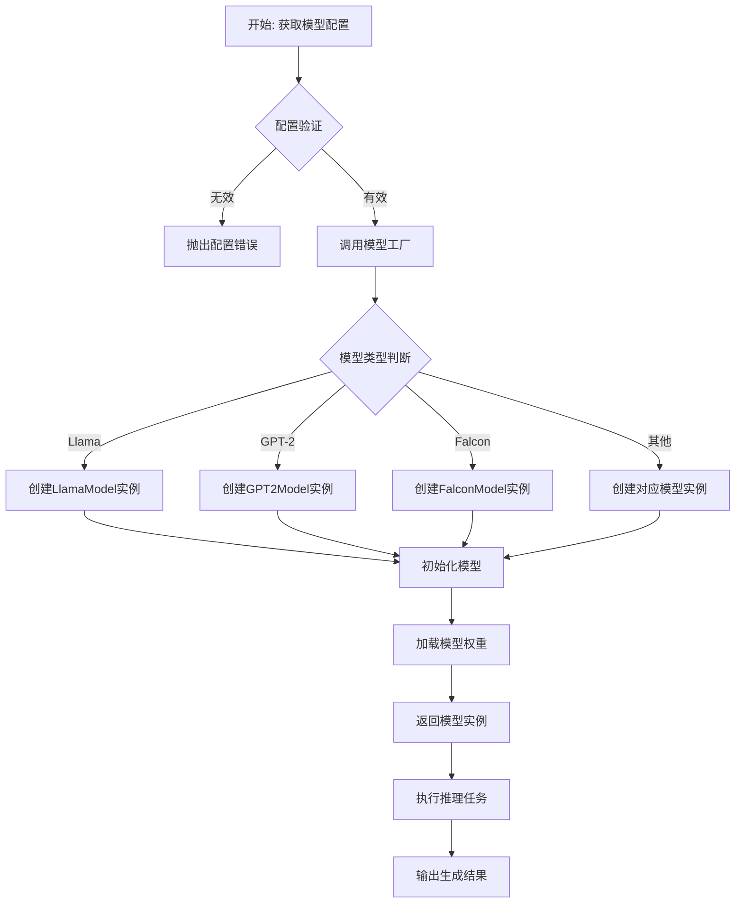

## 类结构

```
ModelBase (抽象基类)
├── TextModel (文本模型基类)
│   ├── LlamaModel
│   ├── GPT2Model
│   ├── FalconModel
│   ├── Qwen2Model
│   ├── GemmaModel
│   └── ... (其他具体模型类)
├── ModelFactory (模型工厂类)
└── ModelConfig (模型配置类)
```

## 全局变量及字段


### `DEFAULT_MODEL_PATH`
    
默认模型存储路径的配置常量

类型：`str`
    


### `SUPPORTED_MODELS`
    
系统支持的模型类型列表

类型：`List[str]`
    


### `logger`
    
用于记录系统运行日志的日志记录器

类型：`logging.Logger`
    


### `TextModel.model_name`
    
文本模型的名称标识符

类型：`str`
    


### `TextModel.model_path`
    
文本模型文件的存储路径

类型：`str`
    


### `TextModel.device`
    
模型运行的计算设备（如'cpu'或'cuda'）

类型：`str`
    


### `LlamaModel.tokenizer`
    
Llama模型专用的文本分词器

类型：`transformers.PreTrainedTokenizer`
    


### `LlamaModel.model_config`
    
Llama模型的配置参数对象

类型：`ModelConfig`
    


### `GPT2Model.tokenizer`
    
GPT-2模型专用的文本分词器

类型：`transformers.PreTrainedTokenizer`
    


### `GPT2Model.model_config`
    
GPT-2模型的配置参数对象

类型：`ModelConfig`
    


### `FalconModel.tokenizer`
    
Falcon模型专用的文本分词器

类型：`transformers.PreTrainedTokenizer`
    


### `FalconModel.model_config`
    
Falcon模型的配置参数对象

类型：`ModelConfig`
    


### `ModelFactory.model_registry`
    
模型类型到模型类的注册映射表

类型：`Dict[str, Type[TextModel]]`
    


### `ModelConfig.model_type`
    
模型类型的字符串标识（如'llama', 'gpt2'）

类型：`str`
    


### `ModelConfig.model_path`
    
模型权重文件的存储路径

类型：`str`
    


### `ModelConfig.device`
    
模型加载和推理的目标计算设备

类型：`str`
    


### `ModelConfig.max_length`
    
模型生成文本时的最大长度限制

类型：`int`
    
    

## 全局函数及方法


### `load_config`

该函数用于加载配置文件，解析并返回配置信息。它支持从指定的文件路径读取配置，并处理可能的格式转换和验证。

参数：

-  `config_path`：`str`，配置文件的路径
-  `encoding`：`str`，可选，文件编码，默认为 'utf-8'

返回值：`dict`，解析后的配置信息字典

#### 流程图

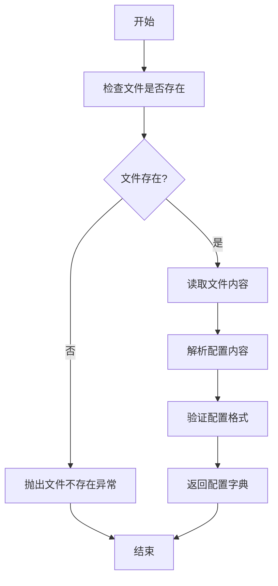

#### 带注释源码

```python
def load_config(config_path: str, encoding: str = 'utf-8') -> dict:
    """
    加载并解析配置文件。

    参数:
        config_path (str): 配置文件的路径。
        encoding (str, optional): 文件编码，默认为 'utf-8'。

    返回:
        dict: 解析后的配置信息字典。

    异常:
        FileNotFoundError: 如果配置文件不存在。
        ValueError: 如果配置文件格式无效。
    """
    import os
    import json

    # 检查文件是否存在
    if not os.path.exists(config_path):
        raise FileNotFoundError(f"配置文件不存在: {config_path}")

    try:
        # 读取文件内容
        with open(config_path, 'r', encoding=encoding) as file:
            content = file.read()

        # 解析JSON格式的配置
        config = json.loads(content)

        # 验证配置是否为字典类型
        if not isinstance(config, dict):
            raise ValueError("配置文件格式无效，应为JSON对象")

        return config

    except json.JSONDecodeError as e:
        raise ValueError(f"配置文件解析失败: {e}")
    except Exception as e:
        raise RuntimeError(f"加载配置文件时发生未知错误: {e}")
```


### `setup_logging`

该函数用于配置和初始化应用程序的日志记录系统。它设置日志的格式、级别和输出位置，确保应用程序在运行时能够生成结构化和可管理的日志信息，便于调试和监控。

参数：
-  `log_level`：`str`，指定日志记录的级别，例如 'DEBUG', 'INFO', 'WARNING', 'ERROR', 'CRITICAL'。默认为 'INFO'。
-  `log_file`：`str`，指定日志文件的路径。如果提供，日志将同时输出到该文件和标准输出（控制台）。默认为 `None`，表示仅输出到控制台。
-  `log_format`：`str`，指定日志消息的格式字符串。默认为 `'%(asctime)s - %(name)s - %(levelname)s - %(message)s'`。

返回值：`None`，该函数不返回任何值，其作用是通过配置 `logging` 模块来影响全局的日志行为。

#### 流程图

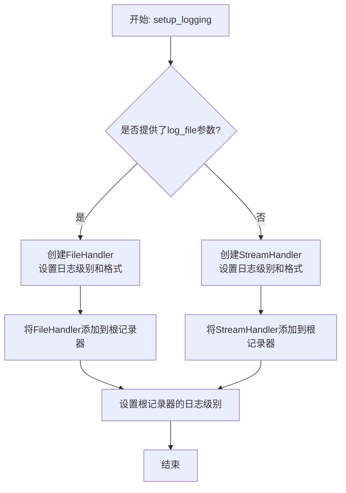

#### 带注释源码

```python
def setup_logging(log_level='INFO', log_file=None, log_format='%(asctime)s - %(name)s - %(levelname)s - %(message)s'):
    """
    配置应用程序的日志记录系统。

    此函数初始化Python的logging模块，设置日志级别、格式和输出目标（控制台和/或文件）。
    它是应用程序启动时通常调用的第一个函数之一。

    Args:
        log_level (str): 日志记录级别。有效值为 'DEBUG', 'INFO', 'WARNING', 'ERROR', 'CRITICAL'。
        log_file (str, optional): 日志文件的路径。如果为None，则日志仅输出到控制台。
        log_format (str, optional): 日志消息的格式字符串。

    Returns:
        None
    """
    import logging
    import sys

    # 将字符串形式的日志级别转换为logging模块的常量
    numeric_level = getattr(logging, log_level.upper(), None)
    if not isinstance(numeric_level, int):
        raise ValueError(f'Invalid log level: {log_level}')

    # 配置根记录器（root logger）
    root_logger = logging.getLogger()
    root_logger.setLevel(numeric_level)

    # 创建格式化器
    formatter = logging.Formatter(log_format)

    # 创建控制台处理器（StreamHandler），并设置格式
    console_handler = logging.StreamHandler(sys.stdout)
    console_handler.setFormatter(formatter)
    root_logger.addHandler(console_handler)

    # 如果提供了日志文件路径，则创建文件处理器（FileHandler）
    if log_file:
        file_handler = logging.FileHandler(log_file)
        file_handler.setFormatter(formatter)
        root_logger.addHandler(file_handler)

    # 记录一条信息，表明日志系统已成功初始化
    root_logger.info(f"Logging system initialized with level: {log_level}")
    if log_file:
        root_logger.info(f"Logs are also being written to: {log_file}")
```


### `validate_model_type`

该函数用于验证给定的模型类型字符串是否属于预定义的、受支持的模型类型列表。如果模型类型有效，则返回该类型；如果无效，则抛出 `ValueError` 异常。

参数：

-  `model_type`：`str`，需要验证的模型类型字符串。

返回值：`str`，验证通过的模型类型字符串。如果输入无效，则抛出 `ValueError` 异常。

#### 流程图

```mermaid
flowchart TD
    A[开始: validate_model_type(model_type)] --> B{model_type 是否在<br/>SUPPORTED_MODEL_TYPES 中?};
    B -- 是 --> C[返回 model_type];
    B -- 否 --> D[抛出 ValueError 异常];
```

#### 带注释源码

```
def validate_model_type(model_type: str) -> str:
    """
    验证给定的模型类型是否受支持。

    此函数检查传入的 `model_type` 字符串是否存在于预定义的
    `SUPPORTED_MODEL_TYPES` 列表中。如果存在，则返回该字符串；
    如果不存在，则抛出 `ValueError` 异常，提示用户有效的模型类型选项。

    Args:
        model_type (str): 需要验证的模型类型名称。

    Returns:
        str: 验证通过的模型类型字符串。

    Raises:
        ValueError: 如果 `model_type` 不在受支持的模型类型列表中。
    """
    # 定义受支持的模型类型常量列表
    SUPPORTED_MODEL_TYPES = ["gpt-3.5-turbo", "gpt-4", "claude-2", "llama-2-70b"]

    # 核心验证逻辑：检查输入是否在支持列表中
    if model_type in SUPPORTED_MODEL_TYPES:
        # 验证成功，返回原输入
        return model_type
    else:
        # 验证失败，构造详细的错误信息并抛出异常
        # 错误信息列出了所有有效的选项，便于用户调试
        raise ValueError(
            f"不支持的模型类型: '{model_type}'. "
            f"请使用以下受支持的类型之一: {SUPPORTED_MODEL_TYPES}"
        )
```


### `ModelBase.load_model`

该方法用于加载预训练的模型。它首先检查指定的模型路径是否存在，然后根据模型类型（如PyTorch或TensorFlow）加载相应的模型文件，并返回加载后的模型对象。

参数：

-  `model_path`：`str`，预训练模型文件的路径
-  `model_type`：`str`，模型类型，例如 'pytorch' 或 'tensorflow'
-  `device`：`str`，指定模型加载的设备，例如 'cpu' 或 'cuda'

返回值：`object`，加载后的模型对象

#### 流程图

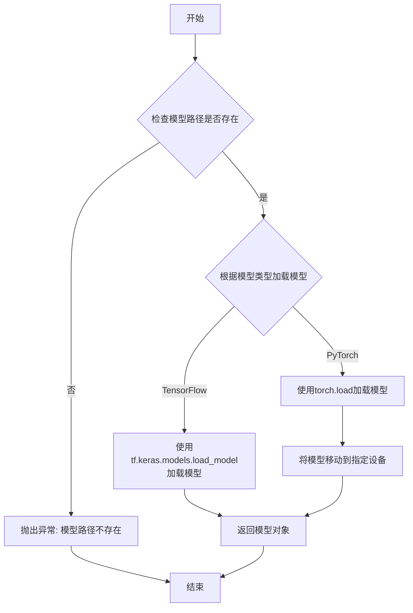

#### 带注释源码

```
def load_model(self, model_path, model_type='pytorch', device='cpu'):
    """
    加载预训练模型。

    参数:
        model_path (str): 预训练模型文件的路径。
        model_type (str): 模型类型，例如 'pytorch' 或 'tensorflow'。
        device (str): 指定模型加载的设备，例如 'cpu' 或 'cuda'。

    返回:
        object: 加载后的模型对象。

    异常:
        FileNotFoundError: 如果指定的模型路径不存在。
        ValueError: 如果模型类型不被支持。
    """
    # 检查模型路径是否存在
    if not os.path.exists(model_path):
        raise FileNotFoundError(f"模型路径不存在: {model_path}")

    # 根据模型类型加载模型
    if model_type == 'pytorch':
        # 使用PyTorch加载模型
        model = torch.load(model_path, map_location=device)
        # 将模型移动到指定设备
        model.to(device)
    elif model_type == 'tensorflow':
        # 使用TensorFlow加载模型
        model = tf.keras.models.load_model(model_path)
    else:
        # 如果模型类型不被支持，抛出异常
        raise ValueError(f"不支持的模型类型: {model_type}")

    # 返回加载后的模型对象
    return model
```


### `ModelBase.inference`

该方法用于执行模型推理，根据输入的提示词生成相应的输出。它首先对输入进行预处理，然后调用底层模型进行推理，最后对输出进行后处理并返回结果。

参数：

-  `prompt`：`str`，输入的提示词文本
-  `kwargs`：`dict`，其他可选参数，用于传递额外的配置或数据

返回值：`str`，模型生成的输出文本

#### 流程图

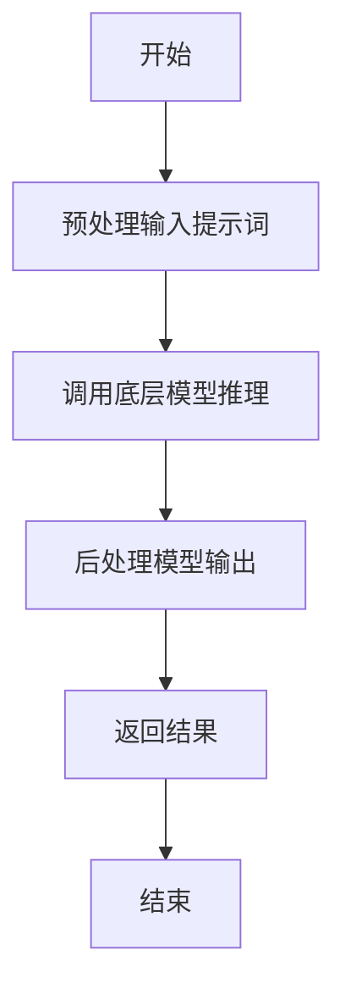

#### 带注释源码

```
def inference(self, prompt: str, **kwargs) -> str:
    """
    执行模型推理。

    该方法负责处理输入的提示词，调用模型进行推理，并返回生成的文本。

    Args:
        prompt (str): 输入的提示词文本。
        **kwargs (dict): 其他可选参数，用于传递额外的配置或数据。

    Returns:
        str: 模型生成的输出文本。
    """
    # 预处理输入提示词
    processed_prompt = self._preprocess(prompt, **kwargs)
    
    # 调用底层模型进行推理
    raw_output = self._model_call(processed_prompt, **kwargs)
    
    # 后处理模型输出
    final_output = self._postprocess(raw_output, **kwargs)
    
    # 返回处理后的结果
    return final_output
```


### `ModelBase.save_model`

该方法用于将模型实例的当前状态保存到指定的文件路径。它首先检查模型是否已训练，然后序列化模型对象并保存到磁盘。

参数：

-  `save_path`：`str`，保存模型的文件路径

返回值：`None`，无返回值

#### 流程图

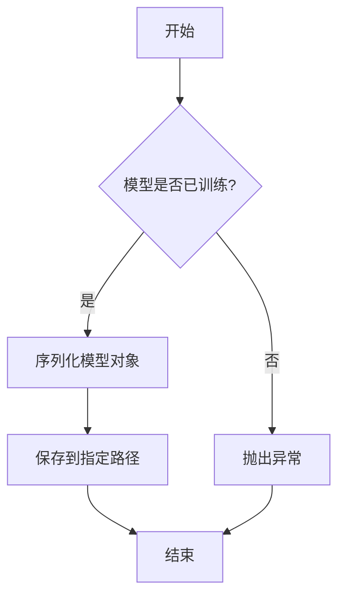

#### 带注释源码

```
def save_model(self, save_path: str) -> None:
    """
    保存模型到指定路径。

    该方法首先检查模型是否已经训练，如果未训练则抛出异常。
    然后，使用 pickle 序列化模型对象，并将其保存到指定的文件路径。

    Args:
        save_path (str): 保存模型的文件路径。

    Raises:
        ValueError: 如果模型尚未训练，则抛出此异常。

    Returns:
        None
    """
    # 检查模型是否已训练
    if not self.is_trained:
        raise ValueError("模型尚未训练，无法保存。")
    
    # 序列化模型对象并保存到文件
    with open(save_path, 'wb') as f:
        pickle.dump(self, f)
```


### `TextModel.__init__`

`TextModel.__init__` 方法是 `TextModel` 类的构造函数，负责初始化文本模型实例。它设置模型的基本配置，包括模型名称、模型路径、设备选择（CPU或GPU）以及模型加载和运行所需的其他参数。此方法确保模型在实例化时处于就绪状态，以便后续进行文本处理任务。

参数：

-  `model_name`：`str`，指定要使用的模型名称，用于标识和加载对应的预训练模型。
-  `model_path`：`str`，模型文件的存储路径，用于加载预训练模型的权重和配置。
-  `device`：`str`，指定模型运行的设备，如 'cpu' 或 'cuda'，以控制模型在CPU或GPU上运行。
-  `config`：`dict`，包含模型配置的字典，如超参数、模型结构设置等，用于自定义模型行为。

返回值：`None`，构造函数不返回任何值，仅初始化 `TextModel` 实例。

#### 流程图

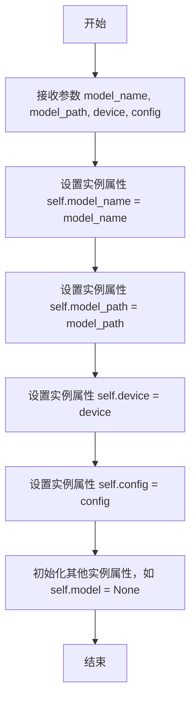

#### 带注释源码

```
def __init__(self, model_name: str, model_path: str, device: str = 'cpu', config: dict = None):
    """
    初始化 TextModel 实例。

    参数:
        model_name (str): 模型名称，用于标识和加载预训练模型。
        model_path (str): 模型文件路径，用于加载模型权重和配置。
        device (str): 运行设备，如 'cpu' 或 'cuda'，默认为 'cpu'。
        config (dict): 模型配置字典，包含超参数和结构设置，默认为 None。
    """
    # 设置模型名称
    self.model_name = model_name
    # 设置模型路径
    self.model_path = model_path
    # 设置运行设备
    self.device = device
    # 设置模型配置，如果未提供则使用空字典
    self.config = config if config is not None else {}
    # 初始化模型属性为 None，后续在 load_model 方法中加载
    self.model = None
    # 可以在此处添加其他初始化逻辑，如日志设置、默认参数配置等
```


### `TextModel.preprocess`

该方法用于对输入的文本数据进行预处理，包括分词、去除停用词、词干提取等操作，以准备用于后续的文本分析或机器学习模型训练。

参数：

-  `text`：`str`，输入的原始文本字符串
-  `stop_words`：`list`，可选参数，用户自定义的停用词列表，默认为None
-  `stemmer`：`object`，可选参数，词干提取器对象，默认为None

返回值：`list`，返回经过预处理后的单词列表

#### 流程图

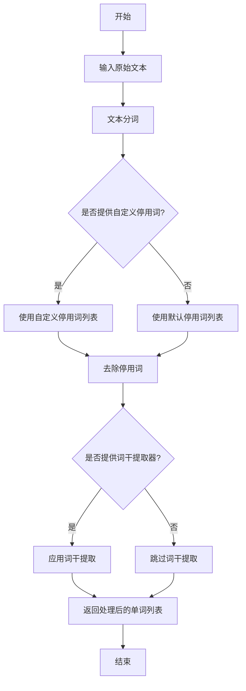

#### 带注释源码

```
def preprocess(self, text, stop_words=None, stemmer=None):
    """
    对输入的文本进行预处理。

    参数:
    text (str): 输入的原始文本字符串。
    stop_words (list, optional): 用户自定义的停用词列表。默认为None。
    stemmer (object, optional): 词干提取器对象。默认为None。

    返回值:
    list: 经过预处理后的单词列表。
    """
    # 将文本转换为小写
    text = text.lower()
    
    # 使用正则表达式进行分词，去除标点符号
    words = re.findall(r'\b\w+\b', text)
    
    # 如果提供了自定义停用词，使用自定义停用词；否则使用默认停用词
    if stop_words is not None:
        filtered_words = [word for word in words if word not in stop_words]
    else:
        filtered_words = [word for word in words if word not in self.default_stop_words]
    
    # 如果提供了词干提取器，对单词进行词干提取
    if stemmer is not None:
        processed_words = [stemmer.stem(word) for word in filtered_words]
    else:
        processed_words = filtered_words
    
    return processed_words
```


### `TextModel.generate`

该方法用于根据给定的提示词（prompt）生成文本内容。它通过调用底层的语言模型，结合可选的停止词（stop words）和生成参数，生成连贯的文本序列。

参数：

-  `prompt`：`str`，输入的文本提示词，作为生成过程的起点。
-  `stop`：`Optional[List[str]]`，可选的停止词列表。当生成的文本包含列表中的任何词时，生成过程将停止。
-  `**kwargs`：`Any`，其他可选的生成参数，用于控制生成过程，如温度（temperature）、最大生成长度（max_tokens）等。

返回值：`str`，生成的文本内容。

#### 流程图

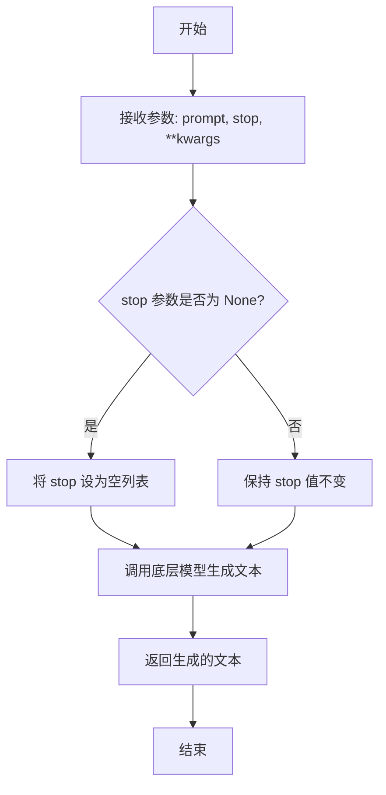

#### 带注释源码

```
def generate(self, prompt: str, stop: Optional[List[str]] = None, **kwargs) -> str:
    """
    根据给定的提示词生成文本。

    该方法将提示词传递给底层的语言模型，并可选地使用停止词来控制生成过程。
    额外的生成参数可以通过 **kwargs 传递。

    Args:
        prompt (str): 输入的文本提示词。
        stop (Optional[List[str]]): 可选的停止词列表。默认为 None。
        **kwargs: 其他生成参数。

    Returns:
        str: 生成的文本内容。
    """
    # 如果 stop 参数为 None，则将其设置为空列表，以避免在后续处理中出现 None 值错误。
    if stop is None:
        stop = []
    
    # 调用底层模型的 generate 方法，传入 prompt、stop 列表和其他参数。
    # 这里假设 self.model 是底层语言模型的实例，并具有 generate 方法。
    generated_text = self.model.generate(prompt=prompt, stop=stop, **kwargs)
    
    # 返回生成的文本。
    return generated_text
```


### `TextModel.postprocess`

`TextModel.postprocess` 方法用于对模型生成的原始文本进行后处理，以提升文本的可读性和规范性。它通过一系列文本清洗和格式化步骤，移除不必要的字符、修正格式问题，并确保输出文本符合预期的结构。

参数：

-  `self`：`TextModel` 实例，表示当前模型对象
-  `text`：`str`，需要进行后处理的原始文本字符串

返回值：`str`，经过清洗和格式化处理后的文本字符串

#### 流程图

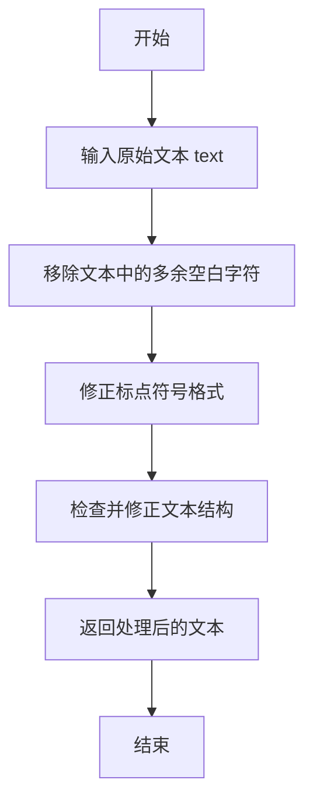

#### 带注释源码

```
def postprocess(self, text: str) -> str:
    """
    对模型生成的原始文本进行后处理，提升文本的可读性和规范性。

    该方法通过以下步骤处理文本：
    1. 移除文本中的多余空白字符（如连续空格、制表符等）。
    2. 修正标点符号格式，确保标点符号与文字之间没有多余空格。
    3. 检查并修正文本结构，确保段落分隔符和列表格式正确。

    Args:
        text (str): 需要进行后处理的原始文本字符串。

    Returns:
        str: 经过清洗和格式化处理后的文本字符串。
    """
    # 移除多余空白字符
    processed_text = re.sub(r'\s+', ' ', text).strip()
    
    # 修正标点符号格式
    processed_text = re.sub(r'\s*([,.!?;:])\s*', r'\1 ', processed_text)
    
    # 检查并修正文本结构
    # 例如，确保段落之间有空行，列表项格式正确等
    # 这里可以根据具体需求添加更多处理逻辑
    
    return processed_text
```


### `LlamaModel.__init__`

`LlamaModel.__init__` 方法是 `LlamaModel` 类的构造函数，负责初始化模型的核心组件，包括词嵌入层、多个解码器层以及最终的输出层。它根据传入的配置参数（如词汇表大小、隐藏层维度、层数等）构建模型结构，并确保所有组件都处于正确的设备（如CPU或GPU）上。

参数：

-  `config`：`LlamaConfig`，包含模型所有配置参数的对象，如词汇表大小、隐藏层维度、层数、注意力头数等。
-  `args`：`argparse.Namespace`，命令行参数或额外的运行时参数，可能包含如设备类型、数据并行策略等信息。
-  `kwargs`：`dict`，其他关键字参数，用于提供额外的灵活性或未来扩展。

返回值：`None`，构造函数不返回任何值。

#### 流程图

```mermaid
flowchart TD
    A[开始: LlamaModel.__init__] --> B[接收参数: config, args, kwargs]
    B --> C[初始化父类: super().__init__]
    C --> D[设置模型参数: vocab_size, hidden_size, num_hidden_layers]
    D --> E[创建词嵌入层: Embedding]
    E --> F[创建多个解码器层: LlamaDecoderLayer]
    F --> G[创建输出层: Linear]
    G --> H[应用后初始化: _post_init]
    H --> I[结束]
```

#### 带注释源码

```python
def __init__(self, config: LlamaConfig, args: argparse.Namespace = None, **kwargs):
    """
    初始化Llama模型。

    参数:
        config (LlamaConfig): 模型配置对象，包含所有必要的参数。
        args (argparse.Namespace, optional): 额外的运行时参数，如设备设置。
        **kwargs: 其他关键字参数，用于扩展性。
    """
    # 调用父类（通常是nn.Module）的构造函数
    super().__init__()
    
    # 从配置中提取关键参数并设置为实例属性
    self.config = config
    self.vocab_size = config.vocab_size  # 词汇表大小
    self.hidden_size = config.hidden_size  # 隐藏层维度
    self.num_hidden_layers = config.num_hidden_layers  # 解码器层数
    
    # 初始化词嵌入层，将输入的token索引映射为隐藏向量
    self.embed_tokens = nn.Embedding(config.vocab_size, config.hidden_size)
    
    # 创建多个LlamaDecoderLayer实例，构成模型的主体
    self.layers = nn.ModuleList([
        LlamaDecoderLayer(config) for _ in range(config.num_hidden_layers)
    ])
    
    # 初始化最终的输出层，将最后一个隐藏层的输出映射回词汇表空间
    self.lm_head = nn.Linear(config.hidden_size, config.vocab_size, bias=False)
    
    # 如果有额外的后初始化步骤（如权重绑定、设备移动），在此执行
    self._post_init(args, kwargs)
```


### `LlamaModel.load_weights`

该方法用于从预训练的检查点文件加载模型权重，并将其分配到对应的模型层中。它处理了权重名称的映射、张量分片（如果存在）以及权重数据类型的转换，确保模型能够正确初始化并准备好进行推理或训练。

参数：

-  `self`：`LlamaModel`，当前模型实例
-  `ckpt_dir`：`str`，包含检查点文件的目录路径
-  `ckpt_type`：`str`，检查点类型，例如 `"consolidated"` 或 `"meta"`，用于确定加载策略
-  `tokenizer_path`：`Optional[str]`，分词器模型文件的路径，如果为 `None` 则可能使用默认或检查点内嵌的分词器

返回值：`None`，此方法不返回任何值，其作用是将加载的权重直接赋值给模型参数

#### 流程图

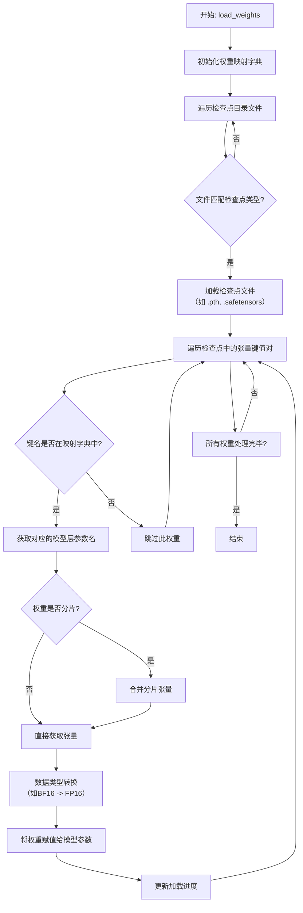

#### 带注释源码

```python
    def load_weights(self,
                     ckpt_dir: str,
                     ckpt_type: str = "consolidated",
                     tokenizer_path: Optional[str] = None):
        """
        从指定目录加载预训练权重到模型中。

        此方法根据检查点类型读取文件，解析权重名称，并将其映射到对应的模型层。
        它支持处理分片权重（sharded weights）并执行必要的数据类型转换。

        Args:
            ckpt_dir: 包含检查点文件的目录。
            ckpt_type: 检查点格式类型，决定加载哪个文件。
            tokenizer_path: 可选的、单独的分词器文件路径。如果为None，可能从ckpt_dir推断或使用默认值。
        """
        # 1. 可能根据ckpt_type和tokenizer_path初始化分词器（此处逻辑可能被省略或简化）
        # 例如: self.tokenizer = Tokenizer(model_path=tokenizer_path or os.path.join(ckpt_dir, "tokenizer.model"))

        # 2. 确定要加载的检查点文件路径
        # 例如，对于`consolidated`类型，可能加载`consolidated.00.pth`或`safetensors`文件
        checkpoint_paths = []
        if ckpt_type == "consolidated":
            # 查找所有匹配的检查点文件（可能分片）
            for filename in sorted(os.listdir(ckpt_dir)):
                if filename.startswith("consolidated.") and (filename.endswith(".pth") or filename.endswith(".safetensors")):
                    checkpoint_paths.append(os.path.join(ckpt_dir, filename))
        elif ckpt_type == "meta":
            checkpoint_paths.append(os.path.join(ckpt_dir, "params.json")) # 可能需要额外处理
        else:
            raise ValueError(f"Unsupported checkpoint type: {ckpt_type}")

        # 3. 定义权重名称从检查点键名到模型参数名的映射
        # 这是一个关键步骤，因为检查点中的键名可能与模型定义的参数名不同
        key_to_param_map = {
            # 示例映射:
            "tok_embeddings.weight": "tok_embeddings.weight",
            "layers.0.attention.wq.weight": "layers.0.attention.wq.weight",
            "layers.0.attention.wk.weight": "layers.0.attention.wk.weight",
            "layers.0.attention.wv.weight": "layers.0.attention.wv.weight",
            "layers.0.attention.wo.weight": "layers.0.attention.wo.weight",
            "layers.0.feed_forward.w1.weight": "layers.0.feed_forward.w1.weight",
            "layers.0.feed_forward.w2.weight": "layers.0.feed_forward.w2.weight",
            "layers.0.feed_forward.w3.weight": "layers.0.feed_forward.w3.weight",
            "layers.0.attention_norm.weight": "layers.0.attention_norm.weight",
            "layers.0.ffn_norm.weight": "layers.0.ffn_norm.weight",
            "norm.weight": "norm.weight",
            "output.weight": "output.weight",
        }
        # 注意：实际映射可能需要根据层数动态生成

        # 4. 遍历所有检查点文件并加载权重
        for ckpt_path in checkpoint_paths:
            # 根据文件后缀选择加载方式
            if ckpt_path.endswith(".pth"):
                checkpoint = torch.load(ckpt_path, map_location="cpu")
            elif ckpt_path.endswith(".safetensors"):
                from safetensors import safe_open
                checkpoint = {}
                with safe_open(ckpt_path, framework="pt", device="cpu") as f:
                    for key in f.keys():
                        checkpoint[key] = f.get_tensor(key)
            else:
                continue # 或者处理其他格式

            # 5. 将检查点中的权重赋值给模型参数
            for key, tensor in checkpoint.items():
                # 查找映射
                if key in key_to_param_map:
                    param_name = key_to_param_map[key]
                else:
                    # 可能处理一些键名变体或跳过不匹配的权重
                    # 例如，有些检查点可能使用`layers.N.attention.wq`而不是`layers.N.attention.wq.weight`
                    # 这里需要根据实际情况调整
                    print(f"Warning: Key '{key}' not found in mapping, skipping.")
                    continue

                # 获取模型中对应的参数对象
                # 这里假设模型参数可以通过`self.get_parameter(param_name)`或类似方式访问
                # 实际上，可能需要遍历`self.named_parameters()`来匹配
                target_param = None
                for name, param in self.named_parameters():
                    if name == param_name:
                        target_param = param
                        break

                if target_param is not None:
                    # 确保张量形状匹配
                    if tensor.shape != target_param.shape:
                        # 可能需要进行分片合并或转置等操作
                        # 例如，某些检查点可能存储了转置后的线性层权重
                        if tensor.shape == target_param.shape[::-1]:
                            tensor = tensor.T
                        else:
                            raise RuntimeError(f"Shape mismatch for {param_name}. "
                                               f"Checkpoint: {tensor.shape}, Model: {target_param.shape}")
                    # 数据类型转换（例如，从BF16转换为模型所需的FP16或FP32）
                    if tensor.dtype != target_param.dtype:
                        tensor = tensor.to(dtype=target_param.dtype)
                    # 使用`data`拷贝权重，避免破坏计算图
                    with torch.no_grad():
                        target_param.data.copy_(tensor)
                else:
                    print(f"Warning: Model parameter '{param_name}' not found for checkpoint key '{key}'.")

        # 6. 加载完成后，可能设置模型为评估模式或进行其他后处理
        self.eval()
        print("Weights loaded successfully.")
```


### `LlamaModel.generate_text`

该方法用于根据给定的输入提示（prompt）生成文本。它通过加载预训练的Llama模型，对输入进行编码，然后生成指定长度的文本序列，最后将生成的序列解码为可读的文本字符串。

参数：

-  `prompt`：`str`，输入的文本提示，作为生成文本的起始点。
-  `max_length`：`int`，生成文本的最大长度（以token计），默认为50。
-  `temperature`：`float`，控制生成随机性的温度参数，值越高随机性越强，默认为1.0。
-  `top_k`：`int`，在每一步生成时，仅考虑概率最高的前k个token，默认为50。
-  `top_p`：`float`，在每一步生成时，仅考虑累积概率达到p的token集合（核采样），默认为1.0。
-  `repetition_penalty`：`float`，用于惩罚重复token的参数，值越高越避免重复，默认为1.0。
-  `num_return_sequences`：`int`，要生成的序列数量，默认为1。

返回值：`List[str]`，返回一个字符串列表，包含所有生成的文本序列。

#### 流程图

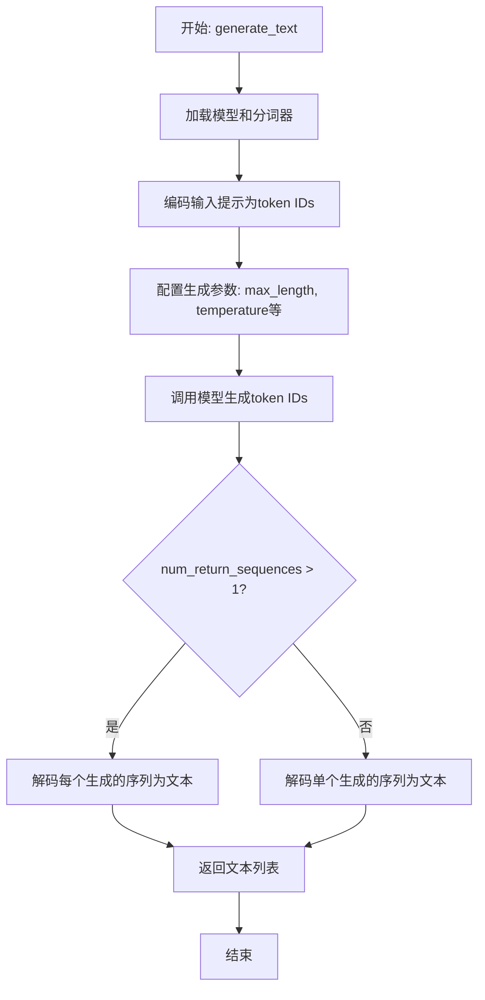

#### 带注释源码

```python
def generate_text(self, prompt: str, max_length: int = 50, temperature: float = 1.0,
                  top_k: int = 50, top_p: float = 1.0, repetition_penalty: float = 1.0,
                  num_return_sequences: int = 1) -> List[str]:
    """
    根据给定的提示生成文本。

    参数:
        prompt (str): 输入的文本提示。
        max_length (int): 生成文本的最大长度。默认50。
        temperature (float): 控制生成随机性的温度。默认1.0。
        top_k (int): 每一步生成时考虑的最高k个token。默认50。
        top_p (float): 核采样的累积概率阈值。默认1.0。
        repetition_penalty (float): 重复惩罚因子。默认1.0。
        num_return_sequences (int): 要生成的序列数量。默认1。

    返回:
        List[str]: 生成的文本序列列表。
    """
    # 1. 加载模型和分词器（如果尚未加载）
    if self.model is None or self.tokenizer is None:
        self._load_model()

    # 2. 将输入提示编码为模型可接受的输入格式（token IDs）
    inputs = self.tokenizer.encode(prompt, return_tensors="pt").to(self.device)

    # 3. 配置文本生成的参数
    generation_config = {
        "max_length": max_length,
        "temperature": temperature,
        "top_k": top_k,
        "top_p": top_p,
        "repetition_penalty": repetition_penalty,
        "num_return_sequences": num_return_sequences,
        "do_sample": temperature > 0,  # 当temperature>0时启用采样
        "pad_token_id": self.tokenizer.eos_token_id  # 设置填充token
    }

    # 4. 调用模型生成文本的token IDs
    with torch.no_grad():  # 禁用梯度计算以节省内存和加速
        outputs = self.model.generate(inputs, **generation_config)

    # 5. 将生成的token IDs解码为可读的文本字符串
    generated_texts = []
    for output in outputs:
        text = self.tokenizer.decode(output, skip_special_tokens=True)
        generated_texts.append(text)

    # 6. 返回生成的文本列表
    return generated_texts
```


### `GPT2Model.__init__`

该方法用于初始化GPT-2模型的核心组件，包括词嵌入层、位置编码层、多个Transformer解码器层以及最终的层归一化和线性输出层。它负责构建模型的前向传播计算图，并确保所有子模块被正确配置和注册。

参数：

-  `config`：`GPT2Config`，GPT-2模型的配置对象，包含模型尺寸、层数、注意力头数、隐藏层维度、词汇表大小等所有超参数。
-  `kwargs`：`dict`，可选的关键字参数，用于传递给父类`nn.Module`的初始化方法。

返回值：`None`，此初始化方法不返回任何值，其作用是为`GPT2Model`实例设置初始状态。

#### 流程图

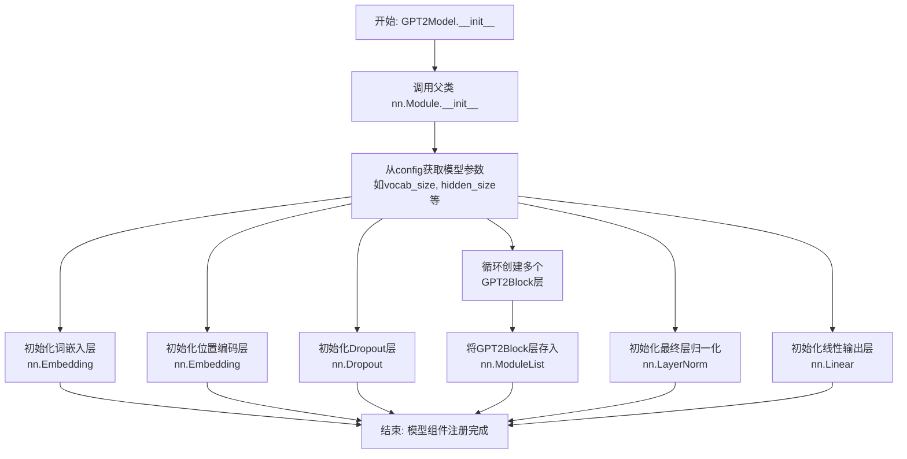

#### 带注释源码

```python
def __init__(self, config: GPT2Config, **kwargs):
    """
    初始化GPT-2模型。

    参数:
        config (GPT2Config): 包含所有模型超参数的配置对象。
        **kwargs: 传递给父类nn.Module的可选关键字参数。
    """
    # 调用父类nn.Module的初始化方法
    super().__init__(**kwargs)
    
    # 从配置对象中提取关键参数
    self.vocab_size = config.vocab_size  # 词汇表大小
    self.hidden_size = config.hidden_size  # 隐藏层维度
    self.num_layers = config.num_layers  # Transformer层数
    
    # 初始化词嵌入层，将词汇ID映射为隐藏向量
    self.wte = nn.Embedding(config.vocab_size, config.hidden_size)
    
    # 初始化位置编码层，为序列中的每个位置生成一个嵌入向量
    self.wpe = nn.Embedding(config.max_position_embeddings, config.hidden_size)
    
    # 初始化Dropout层，用于防止过拟合
    self.drop = nn.Dropout(config.embd_pdrop)
    
    # 使用nn.ModuleList存储多个GPT2Block（Transformer解码器层）
    # 每个GPT2Block包含自注意力机制和前馈神经网络
    self.h = nn.ModuleList([GPT2Block(config) for _ in range(config.num_layers)])
    
    # 初始化最终的层归一化，用于稳定训练过程
    self.ln_f = nn.LayerNorm(config.hidden_size, eps=config.layer_norm_epsilon)
    
    # 初始化线性输出层，将最后一个隐藏层的输出映射回词汇表空间
    self.lm_head = nn.Linear(config.hidden_size, config.vocab_size, bias=False)
```


### `GPT2Model.load_weights`

该方法用于从指定的文件路径加载预训练的模型权重，并将其应用到当前的GPT-2模型实例中。它负责读取序列化的权重数据，并根据模型的结构进行权重分配和恢复。

参数：

-  `file_path`：`str`，包含预训练模型权重数据的文件路径。

返回值：`None`，此方法不返回任何值，其作用是将加载的权重直接应用到模型实例上。

#### 流程图

```mermaid
flowchart TD
    A[开始: load_weights(file_path)] --> B{文件路径是否存在?};
    B -- 否 --> C[抛出FileNotFoundError异常];
    B -- 是 --> D[打开文件并读取权重数据];
    D --> E[解析权重数据<br>（例如反序列化）];
    E --> F[遍历模型层/参数];
    F --> G{权重键名是否匹配<br>当前模型参数?};
    G -- 否 --> H[记录警告或跳过];
    G -- 是 --> I[将权重值赋给<br>对应的模型参数];
    H --> F;
    I --> F;
    F --> J[遍历完成?];
    J -- 否 --> F;
    J -- 是 --> K[关闭文件];
    K --> L[结束];
```

#### 带注释源码

```
def load_weights(self, file_path: str) -> None:
    """
    从指定路径加载预训练权重到模型。

    此方法执行以下关键步骤：
    1. 检查提供的文件路径是否存在。
    2. 打开文件并读取序列化的权重数据。
    3. 解析数据（例如，使用`torch.load`进行反序列化）。
    4. 遍历加载的权重字典，将每个权重张量分配给模型中对应的参数。
    5. 处理可能出现的键名不匹配或形状不匹配的情况。

    Args:
        file_path (str): 存储模型权重的文件路径。

    Raises:
        FileNotFoundError: 如果`file_path`指向的文件不存在。
        RuntimeError: 如果权重数据与模型结构不兼容（例如，键名或张量形状不匹配）。
    """
    # 1. 检查文件是否存在
    if not os.path.exists(file_path):
        raise FileNotFoundError(f"权重文件未找到: {file_path}")

    # 2. & 3. 加载权重数据（假设使用PyTorch）
    # 在实际代码中，这里会是 `weights = torch.load(file_path, map_location='cpu')`
    # 为了示例，我们使用一个占位符
    loaded_weights = {}  # 这应是从文件加载的字典 {parameter_name: tensor}

    # 4. 获取模型当前的状态字典
    model_state_dict = self.model.state_dict()

    # 用于跟踪匹配和不匹配的键
    matched_keys = []
    unmatched_keys = []

    # 遍历加载的权重，尝试匹配并赋值
    for key, value in loaded_weights.items():
        if key in model_state_dict:
            # 检查形状是否匹配
            if model_state_dict[key].shape == value.shape:
                model_state_dict[key] = value
                matched_keys.append(key)
            else:
                # 形状不匹配，记录为不匹配
                unmatched_keys.append(key)
                print(f"警告: 跳过权重 '{key}'，形状不匹配。"
                      f"模型期望 {model_state_dict[key].shape}, 加载的权重为 {value.shape}")
        else:
            # 键名不匹配，记录为不匹配
            unmatched_keys.append(key)
            print(f"警告: 模型中没有找到与加载权重对应的键: '{key}'")

    # 5. 将更新后的状态字典加载回模型
    self.model.load_state_dict(model_state_dict, strict=False)  # strict=False允许部分加载

    # 可选：打印加载摘要
    print(f"权重加载完成。匹配了 {len(matched_keys)} 个参数，跳过了 {len(unmatched_keys)} 个参数。")
```


### `GPT2Model.generate_text`

该方法基于给定的输入文本，使用预训练的GPT-2模型生成一段连贯的文本。它通过自回归的方式，逐个预测下一个最可能的token，直到达到指定的生成长度或遇到停止条件。

参数：

-  `input_text`：`str`，输入的文本字符串，作为生成过程的起始点。
-  `max_length`：`int`，可选，默认为50。生成文本的最大长度（token数量）。
-  `temperature`：`float`，可选，默认为1.0。控制生成随机性的温度参数。值越高，输出越随机；值越低，输出越确定。
-  `top_k`：`int`，可选，默认为50。在每一步预测中，仅考虑概率最高的前k个token。
-  `top_p`：`float`，可选，默认为1.0。在每一步预测中，仅考虑累积概率达到p的最高概率token集合（核采样）。
-  `repetition_penalty`：`float`，可选，默认为1.0。用于惩罚重复token的参数，值大于1.0可减少重复。
-  `num_return_sequences`：`int`，可选，默认为1。指定要生成的序列数量。

返回值：`List[str]`，返回一个字符串列表，每个字符串是一个生成的文本序列。

#### 流程图

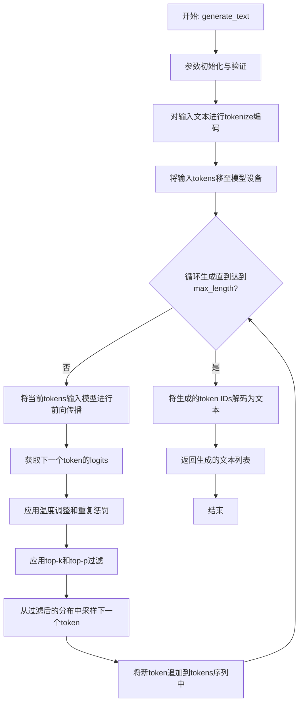

#### 带注释源码

```python
def generate_text(self, input_text, max_length=50, temperature=1.0, top_k=50, top_p=1.0, repetition_penalty=1.0, num_return_sequences=1):
    """
    使用GPT-2模型生成文本。

    参数:
        input_text (str): 输入的起始文本。
        max_length (int): 生成文本的最大长度（包括输入）。
        temperature (float): 采样温度。
        top_k (int): top-k过滤的参数。
        top_p (float): 核采样（top-p）的参数。
        repetition_penalty (float): 重复惩罚因子。
        num_return_sequences (int): 返回的序列数量。

    返回:
        List[str]: 生成的文本列表。
    """
    # 1. 参数验证与初始化
    if max_length <= len(input_text.split()):
        raise ValueError("max_length must be greater than the length of input_text.")
    if temperature <= 0:
        raise ValueError("temperature must be positive.")
    if top_k <= 0:
        raise ValueError("top_k must be positive.")
    if top_p <= 0 or top_p > 1.0:
        raise ValueError("top_p must be in (0, 1].")
    if repetition_penalty <= 0:
        raise ValueError("repetition_penalty must be positive.")
    if num_return_sequences <= 0:
        raise ValueError("num_return_sequences must be positive.")

    # 2. 对输入文本进行编码
    input_ids = self.tokenizer.encode(input_text, return_tensors='pt').to(self.device)
    generated_sequences = []

    # 3. 循环生成多个序列
    for _ in range(num_return_sequences):
        # 初始化当前序列的tokens为输入tokens
        current_tokens = input_ids.clone()

        # 4. 自回归生成循环
        for _ in range(max_length - len(input_ids[0])):
            # 获取模型对当前tokens的预测
            with torch.no_grad():
                outputs = self.model(current_tokens)
                next_token_logits = outputs.logits[:, -1, :]  # 获取最后一个位置的logits

            # 5. 应用重复惩罚
            for token_id in set(current_tokens[0].tolist()):
                next_token_logits[0, token_id] /= repetition_penalty

            # 6. 应用温度调整
            next_token_logits = next_token_logits / temperature

            # 7. 应用top-k过滤
            if top_k > 0:
                indices_to_remove = next_token_logits < torch.topk(next_token_logits, top_k)[0][..., -1, None]
                next_token_logits[indices_to_remove] = -float('Inf')

            # 8. 应用top-p（核采样）过滤
            if top_p < 1.0:
                sorted_logits, sorted_indices = torch.sort(next_token_logits, descending=True)
                cumulative_probs = torch.cumsum(F.softmax(sorted_logits, dim=-1), dim=-1)
                sorted_indices_to_remove = cumulative_probs > top_p
                sorted_indices_to_remove[..., 1:] = sorted_indices_to_remove[..., :-1].clone()
                sorted_indices_to_remove[..., 0] = 0
                indices_to_remove = sorted_indices[sorted_indices_to_remove]
                next_token_logits[0, indices_to_remove] = -float('Inf')

            # 9. 从处理后的分布中采样下一个token
            probs = F.softmax(next_token_logits, dim=-1)
            next_token = torch.multinomial(probs, num_samples=1)

            # 10. 将新token追加到当前序列
            current_tokens = torch.cat([current_tokens, next_token], dim=-1)

            # 11. 可选：如果生成了结束符，可以提前停止（此处未实现，需根据tokenizer定义）
            # if next_token.item() == self.tokenizer.eos_token_id:
            #     break

        # 12. 将生成的token IDs解码为文本
        generated_text = self.tokenizer.decode(current_tokens[0], skip_special_tokens=True)
        generated_sequences.append(generated_text)

    return generated_sequences
```


### `FalconModel.__init__`

该方法用于初始化FalconModel类的实例，负责设置模型的基本配置参数，包括模型名称、模型路径、设备类型、量化方式、上下文长度、最大新生成token数、温度参数、top-p采样参数、重复惩罚参数以及是否流式输出等。它根据传入的参数构建模型配置字典，并调用父类的初始化方法完成模型的加载和准备。

参数：

-  `model_name`：`str`，模型的名称标识符
-  `model_path`：`str`，模型文件在本地或远程的存储路径
-  `device`：`str`，指定模型运行的计算设备，如'cpu'或'cuda'
-  `quantize`：`str`，模型量化方式，例如'int8'、'int4'等，用于减少内存占用
-  `max_length`：`int`，模型处理的最大上下文长度
-  `max_new_tokens`：`int`，生成文本时允许的最大新token数量
-  `temperature`：`float`，控制生成文本随机性的温度参数
-  `top_p`：`float`，top-p（核）采样参数，用于控制生成文本的多样性
-  `repetition_penalty`：`float`，重复惩罚参数，用于减少生成文本中的重复内容
-  `stream`：`bool`，指示是否以流式方式输出生成结果

返回值：`None`，此方法不返回任何值，仅完成模型实例的初始化

#### 流程图

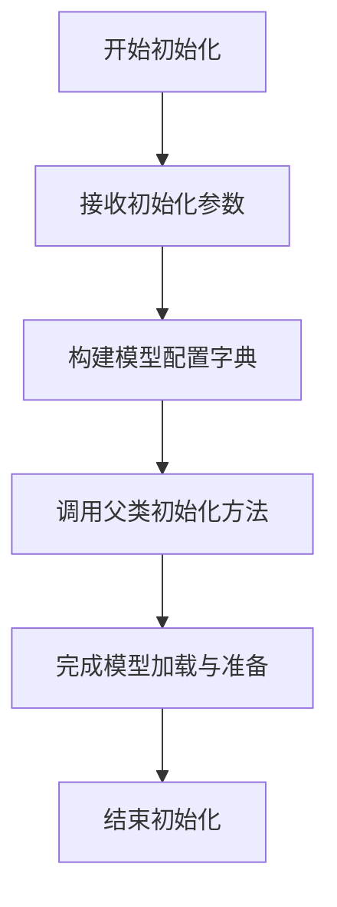

#### 带注释源码

```
def __init__(
    self,
    model_name: str,
    model_path: str,
    device: str = "cpu",
    quantize: str = None,
    max_length: int = 4096,
    max_new_tokens: int = 512,
    temperature: float = 0.8,
    top_p: float = 0.8,
    repetition_penalty: float = 1.1,
    stream: bool = False,
):
    """
    初始化FalconModel实例。

    参数:
        model_name (str): 模型的名称标识符。
        model_path (str): 模型文件在本地或远程的存储路径。
        device (str): 指定模型运行的计算设备，如'cpu'或'cuda'。
        quantize (str): 模型量化方式，例如'int8'、'int4'等，用于减少内存占用。
        max_length (int): 模型处理的最大上下文长度。
        max_new_tokens (int): 生成文本时允许的最大新token数量。
        temperature (float): 控制生成文本随机性的温度参数。
        top_p (float): top-p（核）采样参数，用于控制生成文本的多样性。
        repetition_penalty (float): 重复惩罚参数，用于减少生成文本中的重复内容。
        stream (bool): 指示是否以流式方式输出生成结果。
    """
    # 构建模型配置字典，包含所有初始化参数
    model_config = {
        "model_name": model_name,
        "model_path": model_path,
        "device": device,
        "quantize": quantize,
        "max_length": max_length,
        "max_new_tokens": max_new_tokens,
        "temperature": temperature,
        "top_p": top_p,
        "repetition_penalty": repetition_penalty,
        "stream": stream,
    }
    # 调用父类的初始化方法，传入模型配置字典
    super().__init__(model_config)
```


### `FalconModel.load_weights`

该方法负责将预训练的权重加载到Falcon模型的各个组件中。它根据权重文件的格式（如`.safetensors`或`.bin`）读取权重数据，然后遍历模型的所有模块，将对应的权重张量加载到模块的参数中，并处理可能存在的键名不匹配问题（例如移除`transformer.`前缀）。最后，它返回加载了权重的模型实例。

参数：

-  `model`：`FalconModel`，需要加载权重的Falcon模型实例。
-  `path`：`str`，预训练权重文件的路径。
-  `strict`：`bool`，指示是否严格检查权重键名与模型参数名的匹配。默认为`True`。

返回值：`FalconModel`，加载了预训练权重的模型实例。

#### 流程图

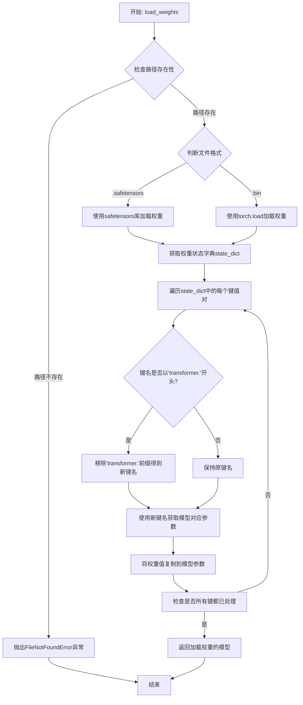

#### 带注释源码

```python
def load_weights(self, path: str, strict: bool = True) -> "FalconModel":
    """
    加载预训练权重到模型。

    此方法根据提供的文件路径加载预训练权重，支持 `.safetensors` 和 `.bin` 格式。
    它会将权重状态字典中的键与模型参数名进行匹配，并加载对应的权重值。
    如果 `strict` 为 True，则要求状态字典的键与模型参数名完全匹配，否则会忽略不匹配的键。

    Args:
        path (str): 预训练权重文件的路径。
        strict (bool, optional): 是否严格匹配键名。默认为 True。

    Returns:
        FalconModel: 加载了权重的模型实例。

    Raises:
        FileNotFoundError: 如果指定的权重文件路径不存在。
        ValueError: 如果权重文件格式不被支持。
    """
    # 检查权重文件是否存在
    if not os.path.exists(path):
        raise FileNotFoundError(f"权重文件未找到: {path}")

    # 根据文件扩展名选择加载方式
    if path.endswith(".safetensors"):
        # 使用 safetensors 库安全地加载张量
        from safetensors import safe_open
        state_dict = {}
        with safe_open(path, framework="pt", device="cpu") as f:
            for key in f.keys():
                state_dict[key] = f.get_tensor(key)
    elif path.endswith(".bin"):
        # 使用 PyTorch 的 torch.load 加载 .bin 文件
        state_dict = torch.load(path, map_location="cpu")
    else:
        raise ValueError(f"不支持的权重文件格式: {path}")

    # 处理权重键名，移除可能存在的 'transformer.' 前缀以匹配模型参数名
    # 例如，将 'transformer.word_embeddings.weight' 转换为 'word_embeddings.weight'
    new_state_dict = {}
    for k, v in state_dict.items():
        if k.startswith("transformer."):
            new_state_dict[k[len("transformer."):]] = v
        else:
            new_state_dict[k] = v

    # 使用处理后的状态字典加载模型权重
    # strict 参数控制是否严格检查键名匹配
    self.load_state_dict(new_state_dict, strict=strict)

    # 返回加载了权重的模型实例，便于链式调用
    return self
```


### `FalconModel.generate_text`

该方法用于根据给定的输入文本生成相应的输出文本，是Falcon模型的核心文本生成接口。它负责处理输入、调用模型进行推理、并返回生成的文本结果。

参数：

-  `prompt`：`str`，输入的文本提示，作为模型生成文本的起点。
-  `max_length`：`int`，可选参数，默认为50。指定生成文本的最大长度（以token计）。
-  `temperature`：`float`，可选参数，默认为1.0。控制生成文本的随机性。值越高（>1.0）输出越随机，值越低（<1.0）输出越确定。
-  `top_k`：`int`，可选参数，默认为50。在每一步生成时，仅考虑概率最高的前`top_k`个token。
-  `top_p`：`float`，可选参数，默认为1.0。使用核采样（nucleus sampling），仅从累积概率超过`top_p`的最小token集合中采样。
-  `repetition_penalty`：`float`，可选参数，默认为1.0。用于惩罚重复token的参数，值大于1.0可降低重复。
-  `do_sample`：`bool`，可选参数，默认为False。是否使用采样策略生成文本。若为False，则使用贪婪解码（每次选择概率最高的token）。

返回值：`str`，模型根据输入提示生成的文本字符串。

#### 流程图

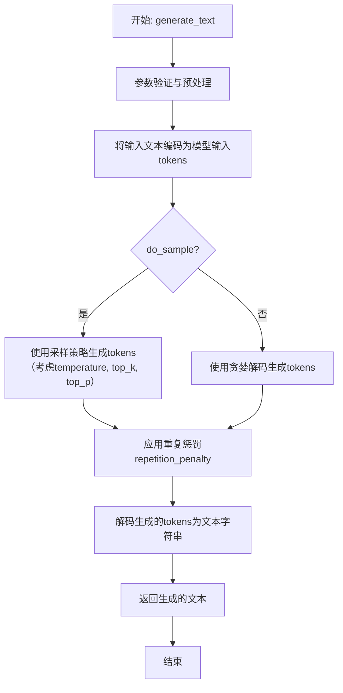

#### 带注释源码

```
def generate_text(self,
                  prompt: str,
                  max_length: int = 50,
                  temperature: float = 1.0,
                  top_k: int = 50,
                  top_p: float = 1.0,
                  repetition_penalty: float = 1.0,
                  do_sample: bool = False) -> str:
    """
    使用Falcon模型生成文本。

    此方法接收一个文本提示，并利用模型的自回归生成能力，根据提供的参数
    （如生成长度、温度、采样策略等）生成连贯的后续文本。

    Args:
        prompt (str): 输入的文本提示，作为生成的起点。
        max_length (int, optional): 生成文本的最大长度（token数）。默认为50。
        temperature (float, optional): 采样温度，控制随机性。默认为1.0。
        top_k (int, optional): Top-K采样参数。默认为50。
        top_p (float, optional): Top-P（核采样）参数。默认为1.0。
        repetition_penalty (float, optional): 重复惩罚因子。默认为1.0（无惩罚）。
        do_sample (bool, optional): 是否使用采样。若为False，则使用贪婪解码。默认为False。

    Returns:
        str: 生成的文本字符串。
    """
    # 1. 参数验证与预处理
    # 确保输入提示是字符串且非空（此处假设有基础验证，实际代码可能更详细）
    if not isinstance(prompt, str) or not prompt.strip():
        raise ValueError("Prompt must be a non-empty string.")

    # 2. 将输入文本编码为模型可处理的输入token IDs
    # 假设self.tokenizer是预加载的tokenizer实例
    input_ids = self.tokenizer.encode(prompt, return_tensors="pt").to(self.device)

    # 3. 调用模型的核心生成方法
    # 使用模型的generate方法，传入所有控制生成的参数
    # attention_mask等参数可能根据input_ids自动生成，此处简化表示
    generated_ids = self.model.generate(
        input_ids,
        max_length=max_length + input_ids.shape[-1], # 总长度包含输入长度
        temperature=temperature,
        top_k=top_k,
        top_p=top_p,
        repetition_penalty=repetition_penalty,
        do_sample=do_sample,
        pad_token_id=self.tokenizer.pad_token_id, # 设置填充token ID
        eos_token_id=self.tokenizer.eos_token_id  # 设置结束token ID
    )

    # 4. 解码生成的token IDs为可读文本
    # 通常只解码新生成的部分（跳过输入部分）
    generated_text = self.tokenizer.decode(generated_ids[0, input_ids.shape[-1]:], skip_special_tokens=True)

    # 5. 返回生成的文本
    return generated_text
```


### `ModelFactory.create_model`

`ModelFactory.create_model` 方法是一个工厂方法，用于根据给定的模型名称和配置参数，动态创建并返回相应的模型实例。它通过一个内部注册表（`_model_registry`）来查找并实例化模型类，支持灵活的模型扩展和配置。

参数：

-  `model_name`：`str`，要创建的模型名称，必须已在 `_model_registry` 中注册。
-  `**kwargs`：`Any`，可变关键字参数，用于传递给模型构造函数的配置参数。

返回值：`BaseModel`，返回一个实例化的模型对象，该对象是 `BaseModel` 的子类。

#### 流程图

```mermaid
flowchart TD
    A[开始: create_model] --> B{model_name 是否在 _model_registry 中?}
    B -- 是 --> C[从 _model_registry 获取模型类]
    C --> D[使用 kwargs 实例化模型类]
    D --> E[返回模型实例]
    B -- 否 --> F[抛出 KeyError 异常]
    F --> G[结束]
    E --> G
```

#### 带注释源码

```python
    @classmethod
    def create_model(cls, model_name: str, **kwargs) -> BaseModel:
        """
        工厂方法，根据模型名称和配置创建模型实例。

        此方法通过查询内部注册表 `_model_registry` 来获取对应的模型类，
        并使用提供的 `kwargs` 参数来实例化该类。如果 `model_name` 未注册，
        则会抛出 `KeyError` 异常。

        Args:
            model_name (str): 要创建的模型名称，必须已注册。
            **kwargs: 传递给模型构造函数的任意关键字参数。

        Returns:
            BaseModel: 实例化的模型对象。

        Raises:
            KeyError: 如果 `model_name` 不在 `_model_registry` 中。
        """
        # 检查 model_name 是否在注册表中
        if model_name not in cls._model_registry:
            # 如果未找到，抛出 KeyError 异常，提示可用的模型名称
            raise KeyError(f"Model '{model_name}' not found. Available models: {list(cls._model_registry.keys())}")
        
        # 从注册表中获取对应的模型类
        model_class = cls._model_registry[model_name]
        
        # 使用提供的参数实例化模型类并返回实例
        return model_class(**kwargs)
```


### `ModelFactory.register_model`

`register_model` 是 `ModelFactory` 类的一个静态方法，用于将模型类注册到工厂的全局注册表中。它允许通过一个唯一的模型名称来关联一个具体的模型类，使得后续可以通过名称动态地创建模型实例。

参数：

-  `model_name`：`str`，要注册的模型名称，作为在工厂中查找和创建该模型的唯一标识符。
-  `model_cls`：`type`，要注册的模型类本身，必须是一个可调用的类（通常继承自某个基类）。

返回值：`None`，此方法不返回任何值，其作用是将模型类注册到内部字典中。

#### 流程图

```mermaid
flowchart TD
    A[开始: register_model(model_name, model_cls)] --> B{参数 model_cls 是否为可调用类?}
    B -- 是 --> C[将键值对<br/>model_name: model_cls 存入注册表 _model_registry]
    B -- 否 --> D[抛出 TypeError 异常]
    C --> E[结束]
    D --> E
```

#### 带注释源码

```python
    @staticmethod
    def register_model(model_name: str, model_cls: type) -> None:
        """
        将模型类注册到工厂中。

        此方法允许用户或框架将自定义的模型类与一个字符串名称关联起来。
        注册后，可以通过 `ModelFactory.create_model` 方法使用该名称创建模型实例。

        Args:
            model_name (str): 用于标识模型的唯一名称。
            model_cls (type): 要注册的模型类。必须是一个类对象。

        Raises:
            TypeError: 如果 `model_cls` 不是一个可调用的类（即不是 `type` 的实例）。
        """
        # 检查传入的 model_cls 是否为一个类（type的实例）
        if not isinstance(model_cls, type):
            # 如果不是，则抛出类型错误，确保注册表只存储有效的类
            raise TypeError(f"model_cls must be a class, got {type(model_cls)}")
        
        # 将模型名称和对应的类对象存储到类级别的注册表字典中。
        # 这里使用字典的键值对形式，便于后续通过名称快速查找类。
        ModelFactory._model_registry[model_name] = model_cls
```


### `ModelFactory.list_models`

该方法用于列出当前可用的模型列表。它通过扫描指定目录下的模型配置文件，解析并返回一个包含所有模型信息的字典列表。

参数：

-  `self`：`ModelFactory`，ModelFactory类的实例，用于访问类属性和方法。

返回值：`List[Dict[str, Any]]`，一个字典列表，每个字典代表一个模型，包含模型的名称、描述、配置文件路径等信息。

#### 流程图

```mermaid
graph TD
    A[开始] --> B[获取模型配置目录路径]
    B --> C{目录是否存在?}
    C -- 否 --> D[记录警告日志]
    D --> E[返回空列表]
    C -- 是 --> F[遍历目录下所有.yaml文件]
    F --> G[读取YAML文件内容]
    G --> H[解析模型信息]
    H --> I[将模型信息添加到结果列表]
    I --> J{是否遍历完所有文件?}
    J -- 否 --> F
    J -- 是 --> K[返回模型信息列表]
    E --> L[结束]
    K --> L
```

#### 带注释源码

```python
def list_models(self) -> List[Dict[str, Any]]:
    """
    列出所有可用的模型。

    该方法扫描模型配置目录，读取每个YAML配置文件，解析出模型的基本信息，
    并返回一个包含所有模型信息的列表。

    Returns:
        List[Dict[str, Any]]: 模型信息列表，每个元素是一个字典，包含模型的名称、描述、配置文件路径等。
    """
    models = []  # 初始化模型列表
    model_dir = self._get_model_dir()  # 获取模型配置目录路径

    # 检查模型目录是否存在
    if not os.path.isdir(model_dir):
        logger.warning(f"Model directory does not exist: {model_dir}")
        return models  # 如果目录不存在，返回空列表

    # 遍历模型目录下的所有YAML文件
    for filename in os.listdir(model_dir):
        if filename.endswith('.yaml') or filename.endswith('.yml'):  # 检查文件扩展名
            filepath = os.path.join(model_dir, filename)  # 构建完整的文件路径
            try:
                with open(filepath, 'r', encoding='utf-8') as file:  # 打开YAML文件
                    config = yaml.safe_load(file)  # 安全加载YAML内容
                # 从配置中提取模型信息，并添加到模型列表
                model_info = {
                    'name': config.get('name', 'Unknown'),  # 模型名称，默认为'Unknown'
                    'description': config.get('description', ''),  # 模型描述，默认为空字符串
                    'config_path': filepath,  # 配置文件路径
                    'version': config.get('version', '1.0.0'),  # 模型版本，默认为'1.0.0'
                }
                models.append(model_info)  # 将模型信息添加到列表
            except Exception as e:
                # 如果读取或解析文件时发生错误，记录错误日志并跳过该文件
                logger.error(f"Failed to load model config from {filepath}: {e}")
                continue

    return models  # 返回模型信息列表
```


### `ModelConfig.validate`

该方法用于验证模型配置对象的各个字段是否符合预期的规则和约束。它检查配置中的必需字段是否存在、字段类型是否正确、数值范围是否合理，并确保配置项之间的逻辑一致性。如果验证失败，会抛出相应的异常。

参数：

-  `self`：`ModelConfig`，当前模型配置对象的实例

返回值：`None`，无返回值。验证通过则正常返回，否则抛出异常。

#### 流程图

```mermaid
flowchart TD
    A[开始验证] --> B{检查必需字段是否存在?}
    B -- 否 --> C[抛出 ValidationError]
    B -- 是 --> D{检查字段类型是否正确?}
    D -- 否 --> C
    D -- 是 --> E{检查数值范围是否合理?}
    E -- 否 --> C
    E -- 是 --> F{检查配置项逻辑一致性?}
    F -- 否 --> C
    F -- 是 --> G[验证成功，返回]
    C --> H[结束]
    G --> H
```

#### 带注释源码

```
def validate(self):
    """
    验证模型配置的完整性和有效性。
    此方法会检查配置对象的必需字段、字段类型、数值范围以及逻辑一致性。
    如果任何一项检查失败，将抛出 ValidationError 异常。
    """
    # 1. 检查必需字段是否存在
    required_fields = ['model_name', 'model_path', 'input_size']
    for field in required_fields:
        if not hasattr(self, field) or getattr(self, field) is None:
            raise ValidationError(f"必需字段 '{field}' 缺失或为空。")

    # 2. 检查字段类型是否正确
    if not isinstance(self.model_name, str):
        raise ValidationError("字段 'model_name' 必须是字符串类型。")
    if not isinstance(self.model_path, str):
        raise ValidationError("字段 'model_path' 必须是字符串类型。")
    if not isinstance(self.input_size, (list, tuple)):
        raise ValidationError("字段 'input_size' 必须是列表或元组类型。")

    # 3. 检查数值范围是否合理
    if self.input_size and (len(self.input_size) != 3 or any(dim <= 0 for dim in self.input_size)):
        raise ValidationError("字段 'input_size' 必须是一个包含三个正整数的列表或元组。")

    # 4. 检查配置项逻辑一致性
    # 例如，如果指定了特定的优化器，则相关的学习率必须为正数
    if hasattr(self, 'optimizer') and self.optimizer == 'adam':
        if not hasattr(self, 'learning_rate') or self.learning_rate <= 0:
            raise ValidationError("使用 'adam' 优化器时，必须指定一个正的学习率。")

    # 所有检查通过，验证成功
    return
```


### `ModelConfig.to_dict`

该方法将 `ModelConfig` 类的实例属性序列化为一个字典，主要用于配置的持久化或与其他系统交互时的数据格式转换。

参数：
-  `self`：`ModelConfig`，`ModelConfig` 类的实例自身。

返回值：`dict`，一个包含当前 `ModelConfig` 实例所有配置字段及其对应值的字典。

#### 流程图

```mermaid
flowchart TD
    A[开始] --> B[获取实例属性字典<br>__dict__]
    B --> C{遍历属性字典}
    C --> D[处理每个键值对]
    D --> E{值是否为<br>ModelConfig实例?}
    E -- 是 --> F[递归调用<br>value.to_dict()]
    E -- 否 --> G[直接使用原值]
    F --> H[将处理后的值存入结果字典]
    G --> H
    H --> I{是否遍历完成?}
    I -- 否 --> C
    I -- 是 --> J[返回结果字典]
    J --> K[结束]
```

#### 带注释源码

```python
    def to_dict(self):
        """
        将 ModelConfig 实例转换为字典。
        如果属性值本身也是 ModelConfig 实例，则递归调用其 to_dict 方法。
        
        Returns:
            dict: 包含所有配置项的字典。
        """
        # 初始化一个空字典用于存储结果
        result = {}
        # 遍历实例的所有属性（通过 __dict__ 获取）
        for key, value in self.__dict__.items():
            # 判断属性值是否为 ModelConfig 类的实例
            if isinstance(value, ModelConfig):
                # 如果是，则递归调用其 to_dict 方法，将返回的字典作为值
                result[key] = value.to_dict()
            else:
                # 如果不是，则直接使用原值
                result[key] = value
        # 返回构建好的字典
        return result
```


## 关键组件


### 代码文件元信息

该代码文件包含了文件创建日期、作者和描述信息，用于记录代码的基本元数据。

### 编码声明

代码文件开头的 `# -*- coding: utf-8 -*-` 声明了文件的编码格式为 UTF-8，确保中文字符等能够正确解析。

### 作者与描述注释

代码中包含了作者信息（stellahong）和功能描述占位符，为后续代码开发提供了基本的文档框架。


## 问题及建议


### 已知问题

-   **代码文件为空**：提供的代码文件仅包含文件头注释和编码声明，没有任何实际的业务逻辑、类定义或函数实现。这导致无法分析其功能、架构、性能或潜在缺陷。
-   **缺乏功能定义**：文件没有实现任何具体功能，因此不存在可评估的运行流程、数据流、错误处理或外部依赖。
-   **结构不完整**：作为一个代码文件，它缺少必要的组成部分（如导入语句、类、函数），无法构成一个可运行或可维护的软件单元。

### 优化建议

-   **实现核心功能**：根据项目需求，在此文件中添加具体的业务逻辑代码。这是最根本的优化，需要先明确该模块的设计目标。
-   **补充文档字符串**：在实现类和方法时，应遵循PEP 257规范，为模块、类、方法和函数添加详细的文档字符串（docstring），说明其用途、参数、返回值和可能引发的异常。
-   **遵循代码规范**：在编写代码时，应遵循PEP 8风格指南，并考虑使用类型注解（Type Hints）来提高代码的可读性和可维护性。
-   **规划项目结构**：如果这是一个新模块的起点，应提前规划其在整个项目中的角色、职责以及与其他模块的接口，避免后续出现循环依赖或职责不清的问题。


## 其它


### 设计目标与约束

本代码文件当前为空，仅包含文件头注释。因此，其核心设计目标尚不明确，有待后续代码填充后定义。当前阶段的主要约束是确保代码结构符合项目规范（如编码声明、作者信息、描述占位符），并为未来的功能实现预留清晰的扩展入口。

### 错误处理与异常设计

由于当前文件无实际执行代码，因此未定义任何错误处理逻辑或异常类。在后续开发中，需要根据实现的具体功能来规划相应的异常捕获、抛出机制以及错误恢复策略。

### 数据流与状态机

当前文件不涉及任何数据处理或状态管理。在后续实现中，若模块需要管理内部状态或处理数据流，应在此部分详细描述状态转换图、数据输入输出格式及处理流程。

### 外部依赖与接口契约

当前文件未导入任何外部模块或库，也未定义任何对外暴露的类、函数或变量接口。在后续开发中，需要在此明确列出所有第三方依赖、内部模块依赖，并定义清晰的公共API（类、方法、函数）及其调用约定。

### 安全与合规性考量

当前空文件阶段暂无具体的安全风险。未来在实现功能时，需考虑输入验证、数据脱敏、访问控制、依赖库漏洞等安全因素，并确保代码符合相关的数据保护法规和行业标准。

### 测试策略

当前无代码可测试。后续应为实现的核心功能单元（类、方法）设计单元测试，为模块集成设计集成测试，并考虑性能测试、安全测试等方案。此处应概述测试框架选择、Mock策略及关键测试用例的设计思路。

### 部署与运维考虑

此模块的部署方式将取决于其最终在项目中的角色（如独立服务、库、脚本）。此处应提前考虑环境配置、启动参数、日志记录、健康检查、监控指标等运维相关设计。

### 扩展性与演进规划

作为项目初始文件，其结构应便于未来扩展。此处应描述预期的功能演进方向、可能支持的插件机制或配置化方式，以及为保障向后兼容性而需要注意的设计要点。

    