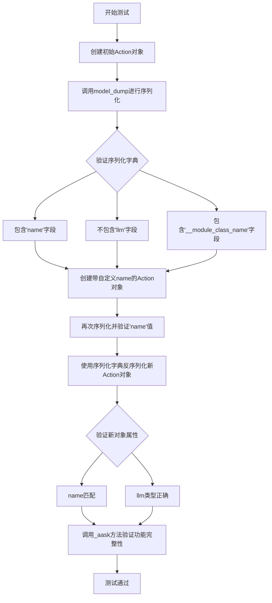
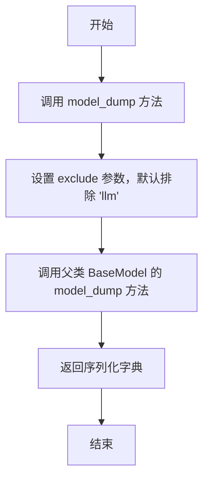
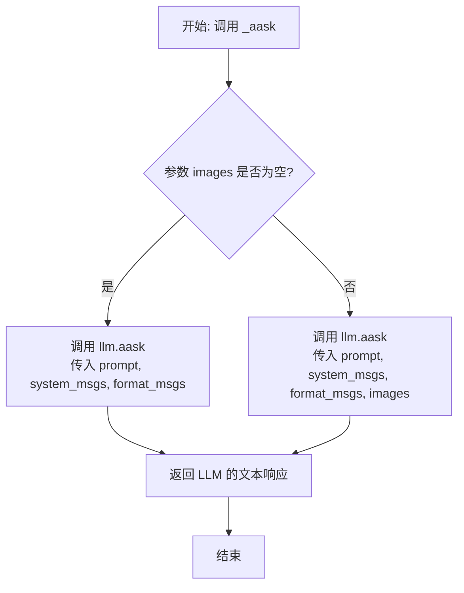

# `.\MetaGPT\tests\metagpt\serialize_deserialize\test_action.py` 详细设计文档

该代码是一个使用pytest框架编写的异步单元测试，用于测试Action类的序列化（serialization）与反序列化（deserialization）功能，验证其model_dump方法能正确导出属性（如name）并排除特定内部属性（如llm），同时确保通过导出的字典能成功重建一个功能完整的Action对象。

## 整体流程



## 类结构

```
Action (被测试类)
├── 字段: name, llm, context, __module_class_name (推断)
├── 方法: model_dump, _aask
└── ... (其他未在测试中直接使用的方法)
```

## 全局变量及字段


### `Action.name`
    
Action实例的名称，用于标识该动作。

类型：`str`
    


### `Action.llm`
    
语言模型实例，用于执行AI驱动的任务，如生成文本或回答问题。

类型：`LLM`
    


### `Action.context`
    
执行上下文，包含环境信息、配置和共享资源，如LLM实例。

类型：`Context`
    


### `Action.__module_class_name`
    
内部使用的模块和类名标识符，用于序列化和反序列化时识别类类型。

类型：`str`
    
    

## 全局函数及方法

### `test_action_serdeser`

这是一个使用 `pytest` 框架编写的异步单元测试函数，用于测试 `Action` 类的序列化（`model_dump`）和反序列化（通过构造函数重建对象）功能。它验证了序列化后的字典包含预期的字段（如 `name` 和 `__module_class_name`），排除了不应导出的字段（如 `llm`），并确保反序列化后重建的 `Action` 对象功能正常（例如，其 `llm` 属性类型正确且能正常调用 `_aask` 方法）。

参数：

- `context`：`pytest.fixture`，测试上下文，提供测试所需的依赖项（如 `llm` 实例）。

返回值：`None`，测试函数通常不显式返回值，其成功与否由断言决定。

#### 流程图

```mermaid
flowchart TD
    A[开始测试] --> B[创建Action对象<br/>action = Action]
    B --> C[序列化Action对象<br/>ser_action_dict = action.model_dump]
    C --> D{断言验证序列化字典<br/>包含'name'且不包含'llm'}
    D -->|通过| E[创建带name的Action对象<br/>action = Action]
    E --> F[再次序列化<br/>ser_action_dict = action.model_dump]
    F --> G{断言验证序列化字典<br/>的'name'字段为'test'}
    G -->|通过| H[反序列化重建对象<br/>new_action = Action]
    H --> I{断言验证重建对象<br/>属性与功能]
    I -->|通过| J[测试结束]
    D -->|失败| K[测试失败]
    G -->|失败| K
    I -->|失败| K
```

#### 带注释源码

```python
# 使用pytest的异步标记，表示这是一个异步测试函数
@pytest.mark.asyncio
async def test_action_serdeser(context):
    # 1. 使用提供的context创建一个基础的Action对象
    action = Action(context=context)
    # 2. 调用model_dump方法将action对象序列化为字典
    ser_action_dict = action.model_dump()
    # 3. 断言序列化后的字典包含'name'字段
    assert "name" in ser_action_dict
    # 4. 断言序列化后的字典不包含'llm'字段（因为该字段被标记为不导出）
    assert "llm" not in ser_action_dict  # not export
    # 5. 断言序列化后的字典包含'__module_class_name'字段（用于类重建）
    assert "__module_class_name" in ser_action_dict

    # 6. 创建一个指定name为"test"的Action对象
    action = Action(name="test", context=context)
    # 7. 再次序列化这个对象
    ser_action_dict = action.model_dump()
    # 8. 断言序列化字典中'name'字段的值是"test"
    assert "test" in ser_action_dict["name"]

    # 9. 使用序列化后的字典（和context）反序列化，重建一个新的Action对象
    new_action = Action(**ser_action_dict, context=context)

    # 10. 断言新对象的name属性为"test"
    assert new_action.name == "test"
    # 11. 断言新对象的llm属性类型与context中llm的类型一致
    assert isinstance(new_action.llm, type(context.llm()))
    # 12. 异步调用新对象的_aask方法，并断言返回的响应长度大于0，验证其功能正常
    assert len(await new_action._aask("who are you")) > 0
```

### `Action.model_dump`

`Action.model_dump` 是 `Action` 类的一个方法，用于将 `Action` 实例序列化为一个字典。该方法会导出实例的字段，但会排除某些特定字段（如 `llm`），并添加元信息（如 `__module_class_name`）以支持后续的反序列化。

参数：

- `self`：`Action` 实例，表示要序列化的对象。
- `exclude`：`set`，可选，指定要从序列化结果中排除的字段集合。
- `by_alias`：`bool`，可选，如果为 `True`，则使用字段的别名作为字典键。
- `exclude_unset`：`bool`，可选，如果为 `True`，则排除未设置的字段。
- `exclude_defaults`：`bool`，可选，如果为 `True`，则排除具有默认值的字段。
- `exclude_none`：`bool`，可选，如果为 `True`，则排除值为 `None` 的字段。
- `**kwargs`：`dict`，可选，其他传递给底层序列化器的关键字参数。

返回值：`dict`，返回一个包含 `Action` 实例序列化数据的字典。

#### 流程图



#### 带注释源码

```python
def model_dump(
    self,
    *,
    exclude: Optional[set] = None,
    by_alias: bool = False,
    exclude_unset: bool = False,
    exclude_defaults: bool = False,
    exclude_none: bool = False,
    **kwargs,
) -> dict:
    """
    将 Action 实例序列化为字典。

    该方法重写了 BaseModel 的 model_dump 方法，默认排除 'llm' 字段，
    以确保序列化时不包含 LLM 实例。

    参数:
        exclude: 可选，指定要排除的字段集合。
        by_alias: 如果为 True，使用字段别名作为字典键。
        exclude_unset: 如果为 True，排除未设置的字段。
        exclude_defaults: 如果为 True，排除具有默认值的字段。
        exclude_none: 如果为 True，排除值为 None 的字段。
        **kwargs: 其他传递给底层序列化器的关键字参数。

    返回:
        包含 Action 实例序列化数据的字典。
    """
    # 默认排除 'llm' 字段，除非在 exclude 参数中明确指定
    if exclude is None:
        exclude = {"llm"}
    else:
        exclude.add("llm")
    
    # 调用父类 BaseModel 的 model_dump 方法进行序列化
    return super().model_dump(
        exclude=exclude,
        by_alias=by_alias,
        exclude_unset=exclude_unset,
        exclude_defaults=exclude_defaults,
        exclude_none=exclude_none,
        **kwargs,
    )
```

### `Action._aask`

`Action._aask` 是 `Action` 类的一个异步方法，用于向大语言模型（LLM）发送提示词（prompt）并获取其生成的文本响应。该方法封装了与LLM的交互逻辑，是`Action`执行其核心功能（如生成代码、回答问题等）的关键步骤。

参数：

-  `prompt`：`str`，发送给大语言模型的提示文本。
-  `system_msgs`：`Optional[list[str]]`，可选的系统消息列表，用于在对话中提供上下文或指令。
-  `format_msgs`：`Optional[list[dict[str, str]]]`，可选的消息格式化列表，用于结构化提示。
-  `images`：`Optional[Union[str, list[str]]]`，可选的图像输入，可以是单个图像路径或路径列表，用于支持多模态模型。

返回值：`str`，大语言模型根据提示生成的文本响应。

#### 流程图



#### 带注释源码

```python
async def _aask(
    self,
    prompt: str,
    system_msgs: Optional[list[str]] = None,
    format_msgs: Optional[list[dict[str, str]]] = None,
    images: Optional[Union[str, list[str]]] = None,
) -> str:
    """
    异步地向语言模型发送提示并获取响应。

    此方法根据是否提供了图像，选择调用不同的底层LLM接口。
    它是Action执行其任务（如编写代码、分析需求）的核心方法。

    Args:
        prompt (str): 主要的用户提示。
        system_msgs (Optional[list[str]]): 可选的系统消息列表，用于设定对话上下文。
        format_msgs (Optional[list[dict[str, str]]]): 可选的结构化消息列表，用于更复杂的提示构建。
        images (Optional[Union[str, list[str]]]): 可选的图像输入，用于多模态模型。

    Returns:
        str: 语言模型生成的文本响应。
    """
    # 判断是否传入了图像参数
    if images:
        # 如果传入了图像，则调用支持多模态的ask方法
        return await self.llm.aask(prompt, system_msgs, format_msgs, images=images)
    else:
        # 如果没有传入图像，则调用标准的文本ask方法
        return await self.llm.aask(prompt, system_msgs, format_msgs)
```

## 关键组件


### Action 类

Action 类是 MetaGPT 框架中定义动作行为的基类，它封装了与大型语言模型（LLM）交互的核心逻辑，支持序列化与反序列化操作。

### 序列化与反序列化 (SerDeser)

代码通过 `model_dump` 方法将 Action 实例序列化为字典，并通过字典参数重建（反序列化）新的 Action 实例，验证了对象状态的持久化与恢复能力。

### 上下文 (Context) 依赖

Action 的初始化与运行依赖于一个 `context` 对象，该上下文提供了必要的运行环境，例如访问 LLM 实例 (`context.llm()`)。

### 异步执行

代码通过 `async`/`await` 关键字和 `pytest.mark.asyncio` 装饰器，展示了 Action 类中 `_aask` 方法的异步执行特性，用于与 LLM 进行异步交互。

### 单元测试框架 (pytest)

代码使用 pytest 框架编写单元测试，验证 Action 类的序列化、反序列化功能以及异步方法的正确性。


## 问题及建议


### 已知问题

-   **测试用例与实现逻辑耦合度过高**：测试代码 `test_action_serdeser` 直接依赖于 `Action` 类的内部实现细节，例如检查序列化字典中是否包含 `"llm"` 字段以及 `"__module_class_name"` 字段。这使得测试变得脆弱，一旦 `Action` 类的序列化逻辑（如 `model_dump` 方法）或内部字段命名发生改变，即使类的核心功能（序列化/反序列化）依然正确，此测试用例也会失败。
-   **测试断言过于具体和内部化**：断言 `assert "llm" not in ser_action_dict` 和 `assert "__module_class_name" in ser_action_dict` 是在验证 `model_dump` 方法的内部行为，而非其对外契约（即序列化后数据的完整性和可用性）。这违背了“黑盒测试”的原则，将测试焦点从“功能是否正确”转移到了“实现细节是否与当前一致”。
-   **异步测试的潜在资源管理问题**：测试中创建了新的 `Action` 实例 (`new_action`) 并调用了其异步方法 `_aask`，但未展示对可能创建的异步资源（如网络连接、后台任务）进行清理的步骤。虽然在此简单测试中可能不会引发问题，但在更复杂的场景或测试套件中，这可能成为潜在的内存泄漏或资源未释放的风险点。
-   **上下文（Context）依赖的隐式传递**：测试通过 `context` fixture 提供依赖，并在反序列化时通过 `**ser_action_dict, context=context` 传递。这种方式虽然有效，但掩盖了 `Action` 类在反序列化后对 `context` 的依赖关系。如果 `Action` 类的构造逻辑发生变化，或者 `context` 的提供方式改变，测试可能无法准确反映实际使用中可能出现的错误。

### 优化建议

-   **重构测试以关注公共接口和行为**：修改测试用例，使其专注于验证 `Action` 对象的序列化与反序列化过程的正确性，而不是内部字段。例如，可以断言序列化后再反序列化得到的对象，其核心业务属性（如 `name`）与原始对象一致，并且反序列化后的对象能够正常执行其核心方法（如 `_aask`），而不去断言序列化字典的具体键值。
-   **采用更健壮和面向行为的断言**：将 `assert "llm" not in ser_action_dict` 这类实现细节断言，替换为如 `assert new_action.llm is not None` 或验证 `new_action` 能成功执行需要 `llm` 的方法。对于 `__module_class_name`，如果它是框架反序列化所必需的，测试应更关注“包含该键的反序列化字典能成功创建对象”，而不是“序列化输出必须包含该键”。
-   **明确异步资源的生命周期管理**：在测试中，如果 `Action` 或 `_aask` 方法会创建需要显式清理的资源（如客户端、连接池），应在测试结束时（例如在 `async def` 函数内使用 `async with` 或在 `pytest.fixture` 中）确保这些资源被正确关闭和清理。考虑使用 `pytest` 的异步 fixture 来管理测试资源的设置和拆卸。
-   **提升测试的清晰度与可维护性**：
    -   **使用更具描述性的变量名**：例如，将 `ser_action_dict` 改为 `serialized_data`。
    -   **分离测试点**：考虑将测试拆分为多个独立的测试函数，分别测试“序列化包含必要信息”、“反序列化重建对象”、“反序列化对象功能正常”等不同方面，使每个测试的意图更单一、明确。
    -   **考虑使用参数化测试**：如果需要对多种不同的 `Action` 初始状态（不同的 `name` 等）进行序列化/反序列化测试，可以使用 `@pytest.mark.parametrize` 来减少重复代码。
-   **增强对依赖注入的测试**：可以添加一个测试，验证当反序列化数据中不包含 `context`（或提供无效 `context`）时，`Action` 的构造是否会抛出预期的异常，以确保类对必要依赖的约束是明确的。


## 其它


### 设计目标与约束

本测试代码的设计目标是验证 `Action` 类的序列化与反序列化功能，确保其核心属性（如 `name`）能够正确保存和恢复，同时验证某些内部或依赖属性（如 `llm`）在序列化过程中被正确排除。约束包括：必须使用 `pytest` 异步测试框架；测试依赖于外部提供的 `context` 上下文环境；序列化/反序列化过程需遵循 `pydantic` 的 `model_dump` 和模型重建机制。

### 错误处理与异常设计

测试代码本身不包含显式的错误处理逻辑，其正确性依赖于 `pytest` 框架的断言机制。如果序列化结果不符合预期（如缺少 `"name"` 字段或包含了 `"llm"` 字段），或者反序列化后重建的对象属性与预期不符，`assert` 语句将抛出 `AssertionError`，导致测试失败。测试的健壮性依赖于 `Action` 类自身构造和序列化方法的鲁棒性。

### 数据流与状态机

1.  **初始化**：测试首先创建一个 `Action` 实例（`action`），其状态由传入的 `context` 决定。
2.  **序列化（状态导出）**：调用 `action.model_dump()`，将对象状态转换为字典 `ser_action_dict`。此过程应包含 `name` 和 `__module_class_name` 等元信息，但排除 `llm` 等非序列化字段。
3.  **验证序列化结果**：通过断言检查 `ser_action_dict` 的内容是否符合预期。
4.  **带参数初始化与序列化**：创建另一个具有特定 `name`（`"test"`）的 `Action` 实例并序列化，验证自定义属性被正确保存。
5.  **反序列化（状态恢复）**：使用序列化得到的字典 `ser_action_dict` 和原始 `context` 作为参数，重建一个新的 `Action` 实例（`new_action`）。
6.  **验证反序列化结果**：断言 `new_action` 的 `name` 属性已恢复，`llm` 属性被正确重新注入（类型与 `context.llm()` 相同），并且恢复后的对象功能正常（通过 `_aask` 方法验证）。

### 外部依赖与接口契约

1.  **`pytest` 框架**：依赖其测试运行、异步支持（`@pytest.mark.asyncio`）和断言功能。
2.  **`metagpt.actions.Action` 类**：这是被测试的核心类。测试依赖于其：
    *   构造函数：接受 `context` 和 `name` 等参数。
    *   `model_dump` 方法：返回一个代表对象状态的字典。
    *   `_aask` 方法：一个异步方法，用于验证恢复后对象的功能。
3.  **`context` 对象（测试夹具）**：由外部测试环境提供，是 `Action` 类运行所必需的上下文，至少需要提供 `llm()` 方法。测试与其契约是：`context` 必须有效，且其 `llm()` 方法返回一个可用的 LLM 实例。
4.  **`pydantic` 基类**：`Action` 类可能继承自 `pydantic` 的 `BaseModel`，从而拥有 `model_dump` 和基于字典的构造函数。这是序列化/反序列化能力的隐含依赖。

### 测试策略与覆盖范围

本测试采用**单元测试**策略，聚焦于 `Action` 类的序列化与反序列化这一单一功能点。覆盖范围包括：
*   **默认序列化**：验证默认创建的 `Action` 对象序列化后包含必要字段（`name`, `__module_class_name`）且排除特定字段（`llm`）。
*   **自定义属性序列化**：验证自定义的 `name` 属性能被正确序列化。
*   **反序列化正确性**：验证从序列化字典重建的对象，其核心属性（`name`）和功能依赖（`llm` 的类型和 `_aask` 方法的可用性）均恢复正确。
*   **功能完整性验证**：通过调用 `_aask` 方法，确保反序列化后的对象不仅数据结构正确，而且具备预期的业务功能。


    