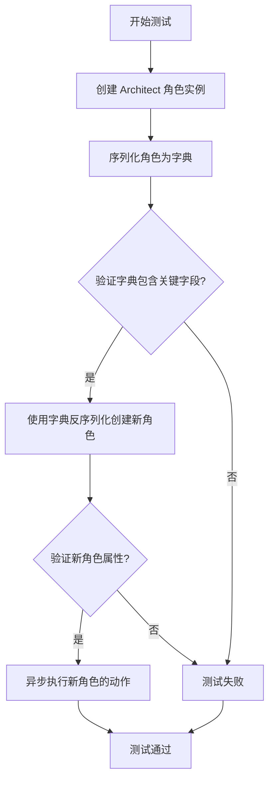
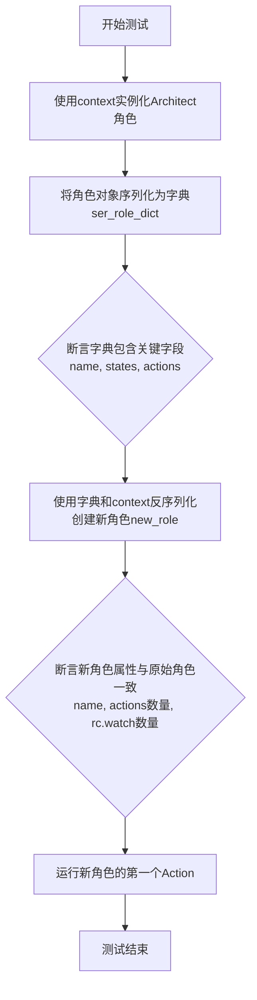
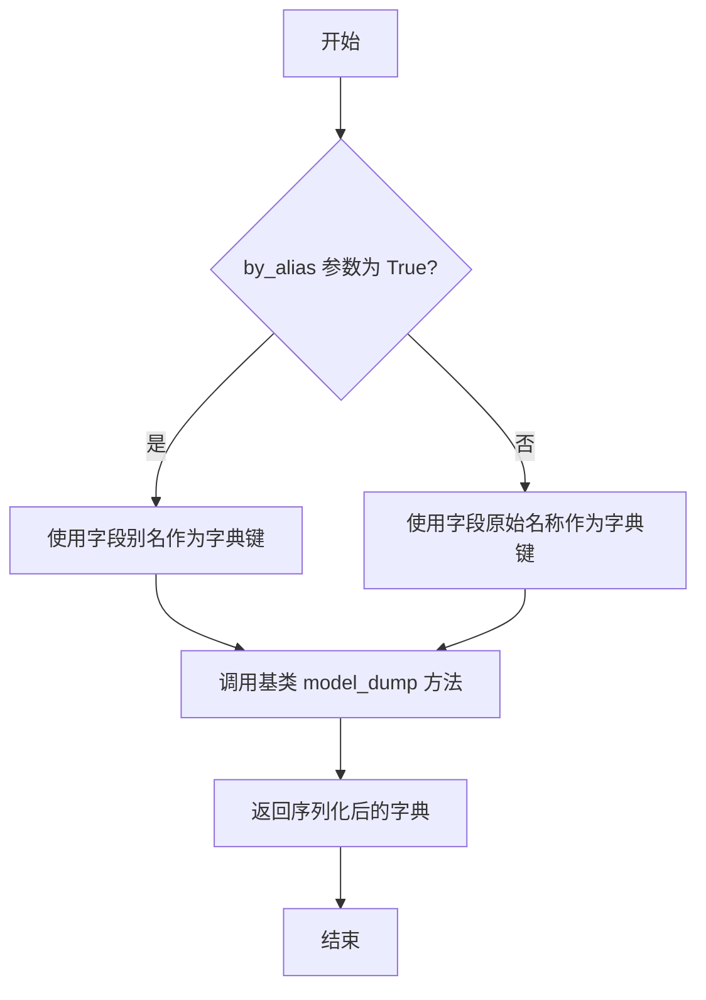
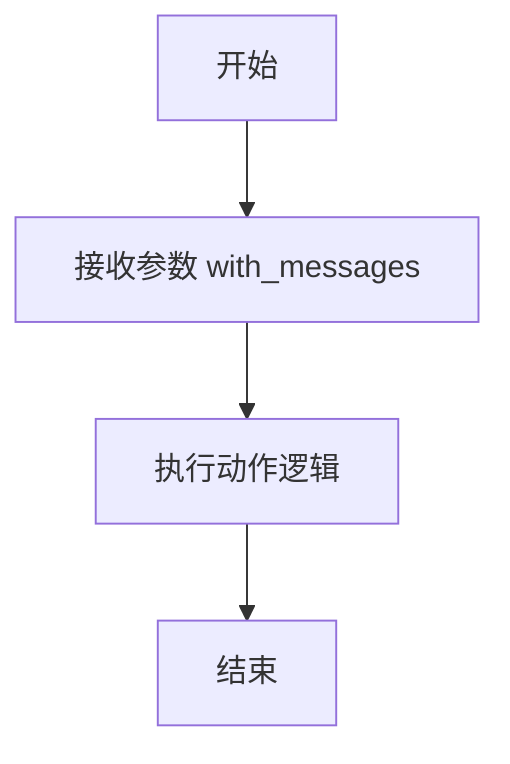

# `.\MetaGPT\tests\metagpt\serialize_deserialize\test_architect.py` 详细设计文档

该代码是一个针对 Architect 角色的序列化与反序列化功能的单元测试。它首先创建一个 Architect 实例，将其序列化为字典，验证字典包含关键字段，然后使用该字典反序列化创建一个新的 Architect 实例，并验证新实例的属性（如名称、动作数量、观察列表）与原始实例一致，最后异步执行新实例的一个动作以验证其功能完整性。

## 整体流程



## 类结构

```
Architect (被测试角色类)
├── 继承自: Role (元类)
│   ├── 字段: name, states, actions, rc
│   └── 方法: model_dump
└── 关联类: Action (动作基类)
```

## 全局变量及字段


### `role`
    
测试中创建的Architect角色实例，用于序列化测试

类型：`Architect`
    


### `ser_role_dict`
    
通过model_dump方法序列化Architect角色后得到的字典表示

类型：`dict`
    


### `new_role`
    
通过反序列化ser_role_dict字典重新构建的Architect角色实例

类型：`Architect`
    


### `Architect.name`
    
Architect角色的名称标识符，默认值为'Bob'

类型：`str`
    


### `Architect.states`
    
Architect角色的状态列表，用于跟踪角色在不同阶段的状态

类型：`list`
    


### `Architect.actions`
    
Architect角色可执行的动作列表，包含具体的操作能力

类型：`list[Action]`
    


### `Architect.rc`
    
Architect角色的运行时上下文，包含角色执行所需的环境和配置信息

类型：`RoleContext`
    
    

## 全局函数及方法

### `test_architect_serdeser`

这是一个使用 `pytest` 框架编写的异步测试函数，用于测试 `Architect` 角色的序列化与反序列化功能。它验证了角色对象在序列化为字典并重新实例化后，其核心属性和行为是否保持一致。

参数：
- `context`：`object`，测试上下文对象，通常包含测试所需的配置和环境信息。

返回值：`None`，测试函数通常不显式返回值，其成功与否由断言决定。

#### 流程图



#### 带注释源码

```python
# 这是一个异步的pytest测试函数
@pytest.mark.asyncio
async def test_architect_serdeser(context):
    # 步骤1：使用传入的context实例化一个Architect角色对象
    role = Architect(context=context)
    
    # 步骤2：将角色对象序列化（model_dump）为一个字典，使用别名模式
    ser_role_dict = role.model_dump(by_alias=True)
    
    # 步骤3：断言序列化后的字典包含必要的关键字段
    assert "name" in ser_role_dict
    assert "states" in ser_role_dict
    assert "actions" in ser_role_dict

    # 步骤4：使用序列化后的字典和原始context反序列化，创建一个新的Architect角色对象
    new_role = Architect(**ser_role_dict, context=context)
    
    # 步骤5：断言新角色的属性与原始角色一致
    assert new_role.name == "Bob"  # 检查角色名
    assert len(new_role.actions) == 1  # 检查Action列表长度
    assert len(new_role.rc.watch) == 1  # 检查观察列表长度
    assert isinstance(new_role.actions[0], Action)  # 检查Action类型
    
    # 步骤6：异步运行新角色的第一个Action，并传入特定消息以验证其功能
    await new_role.actions[0].run(with_messages="write a cli snake game")
```


### `Architect.model_dump`

该方法用于将`Architect`角色实例序列化为一个字典，支持通过别名进行字段映射。它继承自基类的`model_dump`方法，用于对象的持久化或网络传输。

参数：

-  `by_alias`：`bool`，如果为True，则使用字段的别名作为字典的键；如果为False，则使用字段的原始名称。默认为False。
-  `exclude_unset`：`bool`，如果为True，则排除未设置的字段（即保持默认值的字段）。默认为False。
-  `exclude_defaults`：`bool`，如果为True，则排除等于默认值的字段。默认为False。
-  `exclude_none`：`bool`，如果为True，则排除值为None的字段。默认为False。
-  `**kwargs`：`Any`，其他传递给基类`model_dump`方法的参数。

返回值：`dict`，返回一个包含`Architect`实例所有字段及其值的字典。字典的键根据`by_alias`参数决定使用字段名还是别名。

#### 流程图



#### 带注释源码

```
def model_dump(
    self,
    *,
    by_alias: bool = False,  # 控制是否使用字段别名作为键
    exclude_unset: bool = False,  # 是否排除未设置的字段
    exclude_defaults: bool = False,  # 是否排除等于默认值的字段
    exclude_none: bool = False,  # 是否排除值为None的字段
    **kwargs,  # 其他传递给基类方法的参数
) -> dict:  # 返回一个字典
    # 调用父类（例如Pydantic BaseModel）的model_dump方法进行实际的序列化操作
    # 所有参数（by_alias, exclude_unset等）都原样传递给父类方法
    return super().model_dump(
        by_alias=by_alias,
        exclude_unset=exclude_unset,
        exclude_defaults=exclude_defaults,
        exclude_none=exclude_none,
        **kwargs,
    )
```


### `Action.run`

该方法用于执行一个具体的动作，通常涉及处理输入消息并生成相应的输出结果。它是异步执行的，允许在等待某些操作完成时不会阻塞其他任务。

参数：

- `with_messages`：`str`，包含需要处理的消息内容，例如任务描述或指令。

返回值：`None`，该方法不返回任何值，但会执行相应的动作逻辑。

#### 流程图



#### 带注释源码

```python
async def run(self, with_messages: str) -> None:
    """
    执行动作的核心方法。

    该方法接收一个字符串参数，表示需要处理的消息内容，然后根据具体实现执行相应的动作逻辑。
    由于是异步方法，它可以在等待某些操作（如网络请求、文件读写等）完成时让出控制权，提高程序的并发性能。

    参数:
        with_messages (str): 需要处理的消息内容。

    返回值:
        None: 该方法不返回任何值。
    """
    # 具体的动作逻辑实现
    # 例如：解析消息、调用其他方法、生成输出等
    pass
```

## 关键组件


### 测试框架 (pytest)

用于编写和运行单元测试的Python测试框架，支持异步测试和断言验证。

### 异步测试装饰器 (@pytest.mark.asyncio)

标记测试函数为异步协程，使其能够在pytest中正确运行。

### 角色类 (Architect)

代表架构师角色的类，继承自基础角色类，包含特定的状态、行为和上下文。

### 动作类 (Action)

代表可执行动作的基类，定义了动作的通用接口和行为。

### 序列化与反序列化 (model_dump)

将角色对象的状态和配置序列化为字典格式，以便于存储或传输，并支持通过字典参数重建对象。

### 上下文对象 (context)

提供角色运行所需的环境信息和共享资源，如配置、内存和工具访问。

### 角色控制器 (rc.watch)

角色内部用于监控或记录特定事件或消息的机制。


## 问题及建议


### 已知问题

-   **测试用例与具体实现强耦合**：测试用例中硬编码了角色名称 `"Bob"` 和 `rc.watch` 的长度 `1`。如果 `Architect` 类的默认初始化逻辑发生改变（例如，默认名称或观察列表长度变化），此测试将失败，这降低了测试的健壮性，使其更像是实现细节的测试而非功能测试。
-   **异步测试的潜在执行问题**：测试函数 `test_architect_serdeser` 被标记为 `@pytest.mark.asyncio`，但代码末尾的 `pytest.main([__file__, "-s"])` 调用可能无法正确处理异步测试，除非使用 `pytest-asyncio` 插件并正确配置，否则直接运行脚本可能导致异步测试不被执行或报错。
-   **序列化/反序列化测试覆盖不完整**：测试仅验证了序列化后的字典包含某些键以及反序列化后部分属性的相等性。它没有验证序列化/反序列化过程的完整性，例如所有关键状态（如 `rc.memory`、`rc.news` 等）是否都能被正确保存和恢复，也没有测试在复杂或嵌套对象场景下的健壮性。
-   **缺乏对 `Action.run` 方法的隔离测试**：测试的最后一行直接调用了 `new_role.actions[0].run(with_messages="...")`。这并非对 `Architect` 序列化本身的核心测试，且依赖于 `Action` 的具体实现。如果 `Action.run` 需要网络访问或复杂环境，这会使测试变成集成测试，速度慢且不稳定。更好的做法是 mock 这个方法或将其分离到另一个测试中。

### 优化建议

-   **解耦测试断言与具体实现**：避免硬编码具体的默认值。可以通过从角色实例中获取预期值（例如，`assert new_role.name == role.name`），或使用测试常量/工厂函数来设置测试上下文，使测试专注于“序列化-反序列化后对象等价”这一行为，而非具体的属性值。
-   **明确异步测试运行配置**：确保项目依赖中包含 `pytest-asyncio`，并在 `pytest.ini` 或 `pyproject.toml` 中配置默认的异步测试运行方式。对于直接运行脚本的场景，考虑使用 `asyncio.run()` 来包装测试调用，或者明确指出应使用 `pytest` 命令执行测试。
-   **增强序列化测试的完备性**：设计更全面的测试用例，验证反序列化后的对象与原对象在状态、行为上的完全等价性。可以比较序列化前后整个对象的深度拷贝，或者为 `Role` 基类/`Architect` 类实现一个 `__eq__` 方法用于测试断言。同时，测试边界情况，如空状态、包含特殊字符的名称等。
-   **重构测试以隔离依赖**：将 `Action.run` 的调用分离到独立的集成测试或 `Action` 类的单元测试中。在当前测试中，如果必须验证反序列化后的 `Action` 对象可用，应使用 Mock 对象替换真实的 `run` 方法，仅验证其被正确关联和调用，而不执行实际逻辑。这符合单元测试的单一职责和快速反馈原则。
-   **补充负面测试用例**：添加测试用例来验证反序列化过程中的错误处理，例如传入无效的序列化字典、缺失必需字段等，确保代码的鲁棒性。


## 其它


### 设计目标与约束

本测试代码的设计目标是验证`Architect`角色的序列化与反序列化功能，确保其核心属性（如名称、状态、动作）在序列化后能够正确恢复，并且恢复后的角色实例能够正常执行其动作。约束包括：必须使用`pytest`框架进行异步测试，确保测试的可靠性和可重复性；测试数据依赖于传入的`context`上下文对象；反序列化后的角色实例必须能够执行其`Action`动作。

### 错误处理与异常设计

测试代码中未显式包含错误处理逻辑，主要依赖`pytest`框架的断言机制来验证预期行为。如果序列化或反序列化过程失败，或者恢复后的角色属性不符合预期，断言将失败并抛出`AssertionError`，测试用例将标记为失败。此外，`await new_role.actions[0].run(...)`可能抛出与动作执行相关的异常，这些异常将导致测试失败，从而暴露出集成或功能问题。

### 数据流与状态机

数据流起始于测试函数接收的`context`上下文对象，用于初始化`Architect`角色实例。该实例通过`model_dump`方法序列化为字典（`ser_role_dict`）。该字典作为输入，用于反序列化创建新的`Architect`实例（`new_role`）。测试断言验证了关键数据（名称、状态、动作列表、观察列表）在流经序列化与反序列化过程后保持一致。最后，数据流至动作执行阶段，通过调用`new_role.actions[0].run(...)`触发角色动作。本测试不涉及复杂的状态机变迁，主要验证对象状态的持久化与恢复。

### 外部依赖与接口契约

1.  **pytest框架**：依赖`pytest`及其`@pytest.mark.asyncio`装饰器来运行异步测试用例。
2.  **metagpt.roles.architect.Architect类**：是被测试的主要对象，其构造函数、`model_dump`方法、`name`属性、`actions`属性、`rc.watch`属性的行为构成了核心接口契约。
3.  **metagpt.actions.action.Action类**：作为`Architect.actions`的成员，其`run`方法是测试最终验证的接口，契约要求其能接受`with_messages`参数并执行。
4.  **context对象**：作为测试夹具（fixture）注入，是初始化`Architect`所必需的依赖项，其具体结构和内容由上游测试配置定义。

    