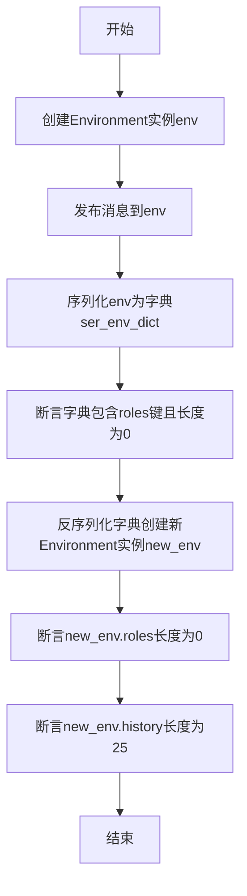
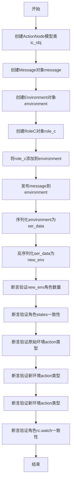
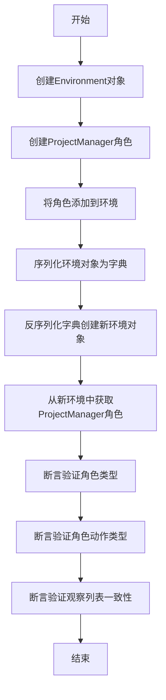
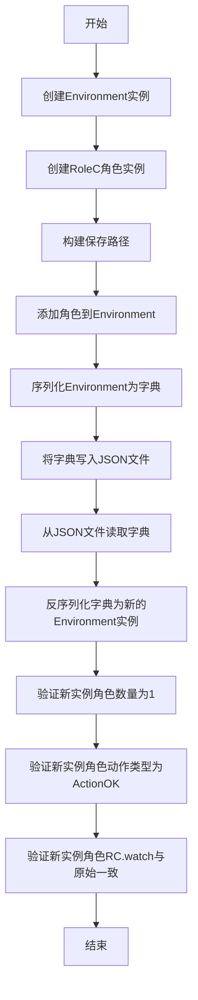
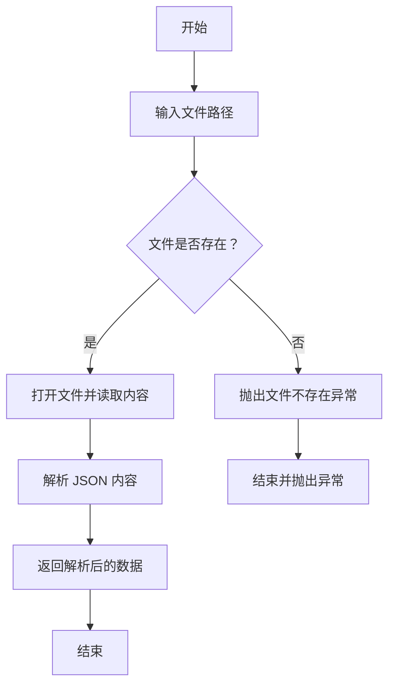
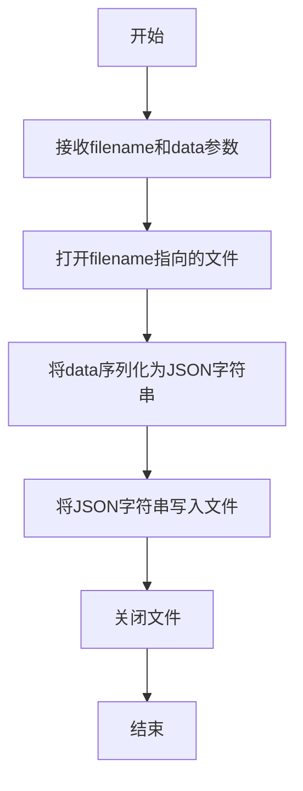
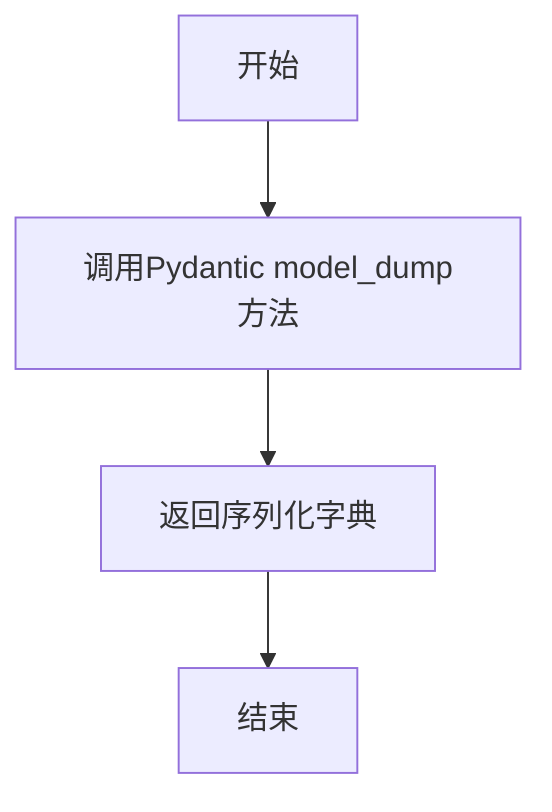
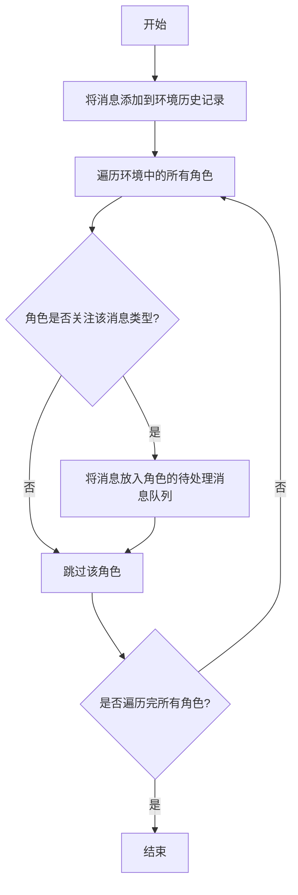
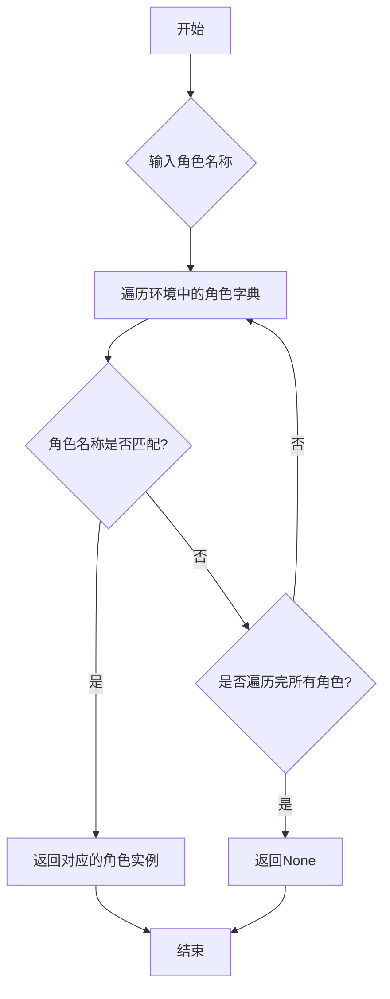
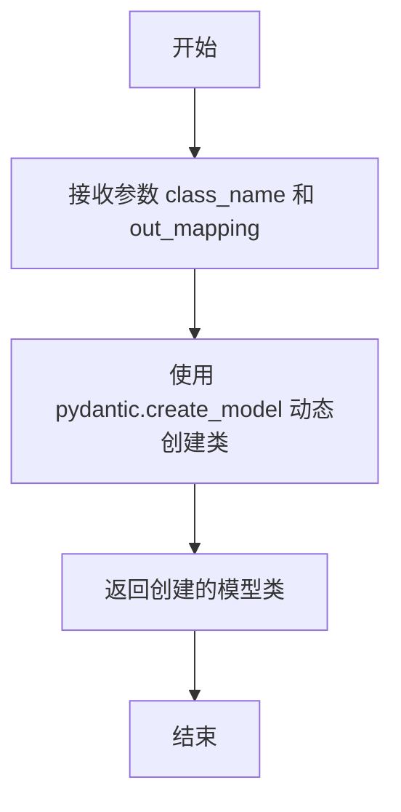

# `.\MetaGPT\tests\metagpt\serialize_deserialize\test_environment.py` 详细设计文档

该文件是一个单元测试文件，用于测试 MetaGPT 框架中 Environment 类的序列化与反序列化功能。它通过创建 Environment 实例、添加角色、发布消息，然后将其序列化为字典或 JSON 文件，再反序列化回新的 Environment 实例，最后验证反序列化后的对象状态与原始对象的一致性，确保序列化/反序列化过程正确无误。

## 整体流程

```mermaid
graph TD
    A[开始测试] --> B[创建 Environment 实例]
    B --> C[添加角色/发布消息]
    C --> D[序列化 Environment]
    D --> E{序列化方式?}
    E -- 内存字典 --> F[model_dump() 为字典]
    E -- 文件存储 --> G[write_json_file 保存为 JSON]
    F --> H[从字典反序列化新 Environment]
    G --> I[read_json_file 读取 JSON]
    I --> H
    H --> J[验证新 Environment 状态]
    J --> K[断言检查角色、消息、动作等]
    K --> L[测试结束]
```

## 类结构

```
测试文件结构
├── test_env_serdeser (基础序列化测试)
├── test_environment_serdeser (带复杂消息的序列化测试)
├── test_environment_serdeser_v2 (带 ProjectManager 的序列化测试)
└── test_environment_serdeser_save (文件读写序列化测试)
```

## 全局变量及字段


### `serdeser_path`
    
测试序列化/反序列化文件的存储路径

类型：`pathlib.Path`
    


### `stg_path`
    
团队环境序列化数据的存储目录路径

类型：`pathlib.Path`
    


### `env_path`
    
环境对象序列化后的JSON文件路径

类型：`pathlib.Path`
    


### `out_mapping`
    
定义ActionNode输出字段类型映射的字典

类型：`dict`
    


### `out_data`
    
提供给ActionNode模型类的测试数据

类型：`dict`
    


### `ic_obj`
    
动态创建的ActionNode模型类

类型：`type`
    


### `message`
    
包含指令内容的测试消息对象

类型：`Message`
    


### `environment`
    
测试中的环境对象实例

类型：`Environment`
    


### `role_c`
    
用于测试的自定义角色实例

类型：`RoleC`
    


### `ser_data`
    
环境对象序列化后的字典数据

类型：`dict`
    


### `new_env`
    
反序列化后新建的环境对象实例

类型：`Environment`
    


### `pm`
    
项目经理角色实例

类型：`ProjectManager`
    


### `role`
    
从反序列化环境中获取的角色实例

类型：`ProjectManager`
    


### `env_dict`
    
从JSON文件读取的环境序列化数据

类型：`dict`
    


### `Environment.roles`
    
环境中所有角色的映射，键为角色名，值为角色实例

类型：`dict`
    


### `Environment.history`
    
环境中历史消息的列表

类型：`list`
    


### `Environment.context`
    
环境运行的上下文对象

类型：`object`
    


### `Message.content`
    
消息的文本内容

类型：`str`
    


### `Message.instruct_content`
    
消息的指令内容对象

类型：`object`
    


### `Message.role`
    
消息发送者的角色标识

类型：`str`
    


### `Message.cause_by`
    
触发此消息的动作类型

类型：`str`
    


### `RoleC.states`
    
RoleC角色的状态列表

类型：`list`
    


### `RoleC.actions`
    
RoleC角色可执行的动作列表

类型：`list`
    


### `RoleC.rc`
    
RoleC角色的运行时配置对象

类型：`object`
    


### `ProjectManager.profile`
    
项目经理角色的个人资料标识

类型：`str`
    


### `ProjectManager.actions`
    
项目经理角色可执行的动作列表

类型：`list`
    


### `ProjectManager.rc`
    
项目经理角色的运行时配置对象

类型：`object`
    
    

## 全局函数及方法

### `test_env_serdeser`

该函数是一个单元测试，用于验证`Environment`类的序列化与反序列化功能。它创建一个`Environment`实例，发布一条消息，然后将其序列化为字典，再反序列化为新的`Environment`实例，最后验证新实例的属性是否符合预期。

参数：

- `context`：`object`，测试上下文对象，提供测试所需的运行环境或配置信息。

返回值：`None`，该函数为测试函数，不返回任何值，通过断言验证测试结果。

#### 流程图



#### 带注释源码

```python
def test_env_serdeser(context):
    # 创建一个Environment实例，传入测试上下文
    env = Environment(context=context)
    # 向环境中发布一条测试消息
    env.publish_message(message=Message(content="test env serialize"))

    # 将Environment实例序列化为字典
    ser_env_dict = env.model_dump()
    # 断言序列化后的字典包含'roles'键
    assert "roles" in ser_env_dict
    # 断言'roles'键对应的值为空列表（长度为0）
    assert len(ser_env_dict["roles"]) == 0

    # 使用序列化后的字典和上下文反序列化，创建新的Environment实例
    new_env = Environment(**ser_env_dict, context=context)
    # 断言新实例的roles列表长度为0
    assert len(new_env.roles) == 0
    # 断言新实例的history列表长度为25
    assert len(new_env.history) == 25
```

### `test_environment_serdeser`

该函数是一个单元测试，用于验证`Environment`类的序列化与反序列化功能。它创建一个包含自定义`ActionNode`模型的`Message`对象，将其发布到环境中，然后序列化整个环境，再反序列化回来，最后验证反序列化后的环境状态与原始环境一致，包括角色、动作和观察列表等。

参数：

- `context`：`object`，测试上下文对象，提供测试所需的运行环境或配置。

返回值：`None`，该函数是一个测试函数，不返回任何值，通过断言（assert）来验证测试结果。

#### 流程图



#### 带注释源码

```python
def test_environment_serdeser(context):
    # 定义输出映射和数据，用于创建ActionNode模型类
    out_mapping = {"field1": (list[str], ...)}
    out_data = {"field1": ["field1 value1", "field1 value2"]}
    ic_obj = ActionNode.create_model_class("prd", out_mapping)

    # 创建一个Message对象，包含指令内容（基于上面创建的模型类）
    message = Message(
        content="prd", 
        instruct_content=ic_obj(**out_data), 
        role="product manager", 
        cause_by=any_to_str(UserRequirement)
    )

    # 创建Environment对象
    environment = Environment(context=context)
    # 创建RoleC角色对象
    role_c = RoleC()
    # 将角色添加到环境中
    environment.add_role(role_c)
    # 发布消息到环境
    environment.publish_message(message)

    # 序列化环境对象为字典
    ser_data = environment.model_dump()
    # 断言验证序列化数据中包含特定角色的名称
    assert ser_data["roles"]["Role C"]["name"] == "RoleC"

    # 反序列化字典数据，创建新的Environment对象
    new_env: Environment = Environment(**ser_data, context=context)
    # 断言验证新环境中角色数量为1
    assert len(new_env.roles) == 1

    # 断言验证新环境与原始环境中对应角色的states属性一致
    assert list(new_env.roles.values())[0].states == list(environment.roles.values())[0].states
    # 断言验证原始环境中第一个动作是ActionOK类型
    assert isinstance(list(environment.roles.values())[0].actions[0], ActionOK)
    # 断言验证新环境中第一个动作是ActionOK类型（精确类型比较）
    assert type(list(new_env.roles.values())[0].actions[0]) == ActionOK
    # 断言验证新环境中第二个动作是ActionRaise类型
    assert type(list(new_env.roles.values())[0].actions[1]) == ActionRaise
    # 断言验证新环境与原始环境中对应角色的rc.watch属性一致
    assert list(new_env.roles.values())[0].rc.watch == role_c.rc.watch
```

### `test_environment_serdeser_v2`

该函数用于测试`Environment`类的序列化与反序列化功能，特别是验证包含`ProjectManager`角色的环境对象在序列化后，反序列化得到的对象能正确恢复角色类型、动作及观察列表。

参数：

- `context`：`object`，测试上下文对象，提供测试所需的运行环境。

返回值：`None`，该函数为测试函数，无返回值。

#### 流程图



#### 带注释源码

```python
def test_environment_serdeser_v2(context):
    # 1. 创建环境对象
    environment = Environment(context=context)
    # 2. 创建项目管理员角色
    pm = ProjectManager()
    # 3. 将角色添加到环境中
    environment.add_role(pm)

    # 4. 序列化环境对象为字典
    ser_data = environment.model_dump()

    # 5. 反序列化字典，创建新的环境对象
    new_env: Environment = Environment(**ser_data, context=context)
    # 6. 从新环境中根据角色描述获取角色
    role = new_env.get_role(pm.profile)
    # 7. 断言验证角色类型为ProjectManager
    assert isinstance(role, ProjectManager)
    # 8. 断言验证角色的第一个动作为WriteTasks类型
    assert isinstance(role.actions[0], WriteTasks)
    # 9. 断言验证新环境中所有角色的第一个动作为WriteTasks类型
    assert isinstance(list(new_env.roles.values())[0].actions[0], WriteTasks)
    # 10. 断言验证新环境中角色的观察列表与原角色一致
    assert list(new_env.roles.values())[0].rc.watch == pm.rc.watch
```

### `test_environment_serdeser_save`

该函数是一个单元测试，用于验证`Environment`类的序列化与反序列化功能，特别是通过JSON文件进行持久化存储和恢复的过程。它创建一个`Environment`实例，添加一个角色，将其序列化为JSON并保存到文件，然后从文件读取并反序列化为新的`Environment`实例，最后验证新实例的状态与原始实例一致。

参数：

- `context`：`Context`，测试上下文对象，提供测试所需的运行环境和配置信息。

返回值：`None`，该函数是一个测试函数，不返回任何值，通过断言验证测试结果。

#### 流程图



#### 带注释源码

```python
def test_environment_serdeser_save(context):
    # 1. 创建一个新的Environment实例，传入测试上下文
    environment = Environment(context=context)
    # 2. 创建一个RoleC角色实例
    role_c = RoleC()

    # 3. 构建序列化/反序列化测试的保存目录和文件路径
    stg_path = serdeser_path.joinpath("team", "environment")
    env_path = stg_path.joinpath("env.json")
    # 4. 将RoleC角色添加到Environment中
    environment.add_role(role_c)

    # 5. 将Environment实例序列化为字典，并写入指定的JSON文件
    write_json_file(env_path, environment.model_dump())

    # 6. 从JSON文件中读取字典数据
    env_dict = read_json_file(env_path)
    # 7. 使用读取的字典数据和上下文反序列化，创建一个新的Environment实例
    new_env: Environment = Environment(**env_dict, context=context)
    # 8. 断言验证：新Environment实例中应恰好有1个角色
    assert len(new_env.roles) == 1
    # 9. 断言验证：新实例中第一个角色的第一个动作类型应为ActionOK
    assert type(list(new_env.roles.values())[0].actions[0]) == ActionOK
    # 10. 断言验证：新实例中角色的rc.watch属性应与原始角色一致
    assert list(new_env.roles.values())[0].rc.watch == role_c.rc.watch
```

### `any_to_str`

该函数用于将任意输入对象（如类、实例、字符串等）转换为一个标准化的字符串表示形式。它主要用于获取对象的唯一标识，通常用于序列化或日志记录场景。

参数：

- `obj`：`Any`，任意类型的输入对象，可以是类、实例、字符串等。

返回值：`str`，返回对象的字符串表示形式。如果输入是字符串，则直接返回；如果是类或实例，则返回其完全限定名（模块名 + 类名）；否则返回对象的字符串表示。

#### 流程图

```mermaid
graph TD
    A[开始] --> B{输入obj是否为字符串?}
    B -- 是 --> C[直接返回obj]
    B -- 否 --> D{obj是否有__module__和__name__属性?}
    D -- 是 --> E[返回 f"{obj.__module__}.{obj.__name__}"]
    D -- 否 --> F[返回 str(obj)]
    C --> G[结束]
    E --> G
    F --> G
```

#### 带注释源码

```python
def any_to_str(obj: Any) -> str:
    """
    将任意对象转换为字符串表示形式。

    如果输入是字符串，则直接返回。
    如果输入是类或实例，则返回其完全限定名（模块名 + 类名）。
    否则返回对象的字符串表示。

    Args:
        obj (Any): 任意类型的输入对象。

    Returns:
        str: 对象的字符串表示形式。
    """
    if isinstance(obj, str):
        # 如果输入已经是字符串，直接返回
        return obj
    elif hasattr(obj, "__module__") and hasattr(obj, "__name__"):
        # 如果对象有 __module__ 和 __name__ 属性（通常是类或函数），返回完全限定名
        return f"{obj.__module__}.{obj.__name__}"
    else:
        # 其他情况，返回对象的字符串表示
        return str(obj)
```

### `read_json_file`

`read_json_file` 是一个全局函数，用于从指定的 JSON 文件路径读取数据，并将其解析为 Python 字典或列表对象。

参数：

- `file_path`：`str`，JSON 文件的路径。

返回值：`Union[dict, list]`，解析后的 JSON 数据，通常是一个字典或列表。

#### 流程图



#### 带注释源码

```python
def read_json_file(file_path: str) -> Union[dict, list]:
    """
    读取指定路径的 JSON 文件并解析为 Python 对象。

    Args:
        file_path (str): JSON 文件的路径。

    Returns:
        Union[dict, list]: 解析后的 JSON 数据，通常是一个字典或列表。

    Raises:
        FileNotFoundError: 如果文件不存在。
        JSONDecodeError: 如果 JSON 格式无效。
    """
    with open(file_path, 'r', encoding='utf-8') as file:
        data = json.load(file)
    return data
```

### `write_json_file`

将给定的数据对象序列化为JSON格式并写入指定的文件路径。

参数：
- `filename`：`str`，目标JSON文件的完整路径。
- `data`：`Any`，需要被序列化并写入文件的数据对象，通常是字典或列表。

返回值：`None`，该函数没有返回值，仅执行文件写入操作。

#### 流程图



#### 带注释源码

```python
def write_json_file(filename: str, data: Any):
    """
    将数据写入JSON文件。

    Args:
        filename (str): 目标JSON文件的完整路径。
        data (Any): 需要被序列化并写入文件的数据对象。
    """
    # 使用'w'模式打开文件，确保文件被覆盖写入
    with open(filename, "w", encoding="utf-8") as file:
        # 使用json.dump将数据序列化为JSON格式并写入文件
        # ensure_ascii=False允许非ASCII字符（如中文）直接存储
        # indent=2使生成的JSON文件具有可读的缩进格式
        json.dump(data, file, ensure_ascii=False, indent=2)
```

### `Environment.model_dump`

该方法用于将`Environment`对象序列化为一个字典，以便于存储或传输。它通过调用Pydantic的`model_dump`方法，将对象的所有字段（包括嵌套对象）转换为字典形式。

参数：

-  `self`：`Environment`，当前`Environment`对象实例
-  `**kwargs`：`Any`，传递给Pydantic `model_dump`方法的额外关键字参数

返回值：`dict`，包含`Environment`对象所有字段的字典表示

#### 流程图



#### 带注释源码

```python
def model_dump(self, **kwargs) -> dict:
    """
    将Environment对象序列化为字典。
    
    该方法继承自Pydantic BaseModel，用于将对象转换为字典格式，
    便于JSON序列化或存储。
    
    Args:
        **kwargs: 传递给Pydantic model_dump方法的额外参数
        
    Returns:
        dict: 包含对象所有字段的字典
    """
    return super().model_dump(**kwargs)
```

### `Environment.add_role`

将给定的角色对象添加到环境实例的角色字典中，并建立角色与环境之间的双向关联。

参数：

- `role`：`Role`，要添加到环境中的角色实例。

返回值：`None`，无返回值。

#### 流程图

```mermaid
flowchart TD
    A[开始: add_role(role)] --> B{role是否已存在于self.roles中?}
    B -- 是 --> C[直接返回]
    B -- 否 --> D[将role添加到self.roles字典<br>key: role.profile, value: role]
    D --> E[设置role的所属环境<br>role.set_env(self)]
    E --> F[结束]
```

#### 带注释源码

```python
def add_role(self, role: "Role"):
    """
    将角色添加到环境中。

    此方法将给定的角色实例添加到当前环境管理的角色字典中。
    添加前会检查该角色是否已存在（通过角色配置中的profile字段作为键）。
    如果角色已存在，则直接返回；否则，将角色添加到字典，并调用角色的`set_env`方法，
    建立角色与当前环境之间的双向关联。

    Args:
        role (Role): 要添加到环境中的角色实例。该角色应具有`profile`属性作为唯一标识。

    Returns:
        None: 此方法不返回任何值。
    """
    # 检查角色是否已存在于当前环境的角色字典中。
    # 使用角色的profile作为字典的键进行查找。
    if role.profile in self.roles:
        # 如果角色已存在，则无需重复添加，直接返回。
        return
    # 如果角色不存在，则将其添加到角色字典中。
    # key: role.profile (角色的唯一标识)
    # value: role (角色实例本身)
    self.roles[role.profile] = role
    # 建立角色与当前环境之间的关联。
    # 调用角色的`set_env`方法，将当前环境实例(self)设置为角色的运行环境。
    role.set_env(self)
```

### `Environment.publish_message`

该方法用于在环境中发布消息，将消息添加到环境的历史记录中，并通知所有关注该消息类型的角色进行处理。

参数：

- `message`：`Message`，要发布的消息对象，包含消息内容、发送者、接收者等信息。

返回值：`None`，无返回值。

#### 流程图



#### 带注释源码

```python
def publish_message(self, message: Message) -> None:
    """
    发布消息到环境中，将消息添加到历史记录并通知相关角色。

    Args:
        message (Message): 要发布的消息对象。
    """
    # 将消息添加到环境的历史记录中
    self.history.add(message)

    # 遍历环境中的所有角色
    for role in self.roles.values():
        # 检查角色是否关注该消息类型
        if role.is_watch(message):
            # 将消息放入角色的待处理消息队列
            role.put_message(message)
```

### `Environment.get_role`

该方法用于根据角色名称从环境中获取对应的角色实例。

参数：

- `role_name`：`str`，要查找的角色名称

返回值：`Optional[Role]`，如果找到则返回对应的角色实例，否则返回None

#### 流程图



#### 带注释源码

```python
def get_role(self, role_name: str) -> Optional[Role]:
    """
    根据角色名称获取角色实例
    
    Args:
        role_name (str): 要查找的角色名称
        
    Returns:
        Optional[Role]: 如果找到则返回对应的角色实例，否则返回None
    """
    # 遍历环境中的所有角色
    for role in self.roles.values():
        # 检查角色名称是否匹配
        if role.profile == role_name:
            # 找到匹配的角色，返回实例
            return role
    # 未找到匹配的角色，返回None
    return None
```

### `ActionNode.create_model_class`

该方法用于动态创建一个Pydantic模型类，该类基于给定的输出映射（out_mapping）定义其字段。这通常用于在运行时根据特定的数据模式生成一个结构化的数据容器（InstructContent），以便在消息传递或序列化/反序列化过程中使用。

参数：

- `class_name`：`str`，要创建的模型类的名称。
- `out_mapping`：`dict`，一个字典，定义了模型类的字段。键为字段名，值为一个元组，包含字段类型和可选的默认值或`...`（表示必填字段）。

返回值：`Type[BaseModel]`，返回一个动态生成的Pydantic模型类，该类可用于实例化对象，其字段由`out_mapping`定义。

#### 流程图



#### 带注释源码

```python
@classmethod
def create_model_class(cls, class_name: str, out_mapping: dict) -> Type[BaseModel]:
    """
    动态创建一个Pydantic模型类。

    该方法根据提供的字段映射（out_mapping）动态生成一个Pydantic模型类。
    这在需要根据运行时信息定义结构化数据模式时非常有用，例如在生成特定类型的指令内容时。

    Args:
        class_name (str): 要创建的模型类的名称。
        out_mapping (dict): 字段定义映射。格式为 {field_name: (field_type, ...)}，
                            其中 field_type 是类型注解，`...` 表示该字段为必填项。

    Returns:
        Type[BaseModel]: 一个动态生成的Pydantic模型类。

    Example:
        >>> out_mapping = {"field1": (list[str], ...)}
        >>> ModelClass = ActionNode.create_model_class("MyModel", out_mapping)
        >>> instance = ModelClass(field1=["value1", "value2"])
    """
    # 使用 pydantic 的 create_model 函数动态创建类
    # class_name 参数指定了生成类的名称
    # __base__ 参数指定了生成类的基类，这里固定为 BaseModel
    # __module__ 参数指定了生成类所在的模块，这里设置为当前类所在的模块
    # **out_mapping 将字段映射解包，作为类的字段定义
    return create_model(
        class_name,
        __base__=BaseModel,
        __module__=cls.__module__,
        **out_mapping,
    )
```

## 关键组件


### 环境（Environment）

用于模拟和管理多智能体系统中的角色（Role）及其交互，提供消息发布、角色管理以及序列化/反序列化支持。

### 角色（Role）

代表系统中的智能体，具有特定的行为（Action）和状态，能够接收和处理环境中的消息。

### 消息（Message）

在环境与角色之间传递的信息单元，包含内容、发送者、消息类型以及可选的指令内容（Instruct Content）。

### 动作节点（ActionNode）

用于创建动态的数据模型类，以结构化的方式定义和验证动作的输出数据。

### 序列化与反序列化（Serialization/Deserialization）

支持将环境、角色等复杂对象转换为字典或JSON格式进行存储或传输，并能从这些格式中恢复对象状态。

### 项目结构管理（Project Management）

涉及项目规划、任务分解等高层管理功能，通常由特定角色（如ProjectManager）及其关联动作（如WriteTasks）实现。

### 测试框架（Test Framework）

使用pytest组织单元测试，验证环境、角色等组件的序列化/反序列化功能及其交互逻辑的正确性。


## 问题及建议

### 已知问题

-   **测试用例之间存在潜在的相互干扰**：测试用例 `test_env_serdeser`、`test_environment_serdeser`、`test_environment_serdeser_v2` 和 `test_environment_serdeser_save` 都使用了 `Environment` 类，并且部分测试（如 `test_environment_serdeser_save`）会向文件系统写入数据。如果测试未正确清理（例如删除写入的文件），或者测试执行顺序不当，可能导致测试结果不稳定或失败。
-   **硬编码的测试数据路径**：在 `test_environment_serdeser_save` 中，文件路径 `serdeser_path.joinpath("team", "environment")` 是硬编码的。这降低了测试的灵活性，并且如果基础路径 `serdeser_path` 配置不当或测试环境不同，可能导致文件读写错误。
-   **对 `context` 参数的强依赖**：所有测试函数都依赖于传入的 `context` 参数（`context` fixture）。虽然这是 Pytest 的常见模式，但测试用例本身没有展示 `context` 的创建或模拟，使得测试的可读性和独立性有所降低。如果 `context` 的构造复杂或状态异常，会影响所有相关测试。
-   **断言中使用了 `type(...) == ...`**：在 `test_environment_serdeser` 和 `test_environment_serdeser_save` 中，使用了 `type(list(new_env.roles.values())[0].actions[1]) == ActionRaise` 这样的断言。使用 `==` 进行类型比较不如使用 `isinstance` 健壮，因为 `isinstance` 会考虑继承关系，而 `type(...) == ...` 不会。
-   **测试覆盖范围可能不完整**：当前测试主要关注 `Environment` 对象的序列化/反序列化（serdeser）功能，包括添加角色、发布消息、保存到文件等。但可能未覆盖所有边界情况，例如环境对象为空、角色列表为空、消息内容异常、序列化数据损坏等情况下的行为。

### 优化建议

-   **确保测试的独立性和隔离性**：为每个测试用例使用独立的临时目录或文件路径，特别是在涉及文件操作的测试（如 `test_environment_serdeser_save`）中。可以使用 Pytest 的 `tmp_path` fixture 来管理临时文件，确保测试结束后自动清理，避免测试间干扰。
-   **使用更灵活的路径管理**：避免在测试代码中硬编码路径。可以依赖 `serdeser_path` fixture，或者使用 `tmp_path` 来动态生成测试所需的目录和文件路径，提高测试的可移植性和可靠性。
-   **明确 `context` 的依赖和模拟**：在测试文件或相关文档中，应说明 `context` fixture 的具体实现和预期状态。或者，在测试内部对 `context` 进行必要的模拟（Mock），以减少对外部 fixture 的依赖，使测试更自包含。
-   **将类型断言改为使用 `isinstance`**：将 `type(obj) == Class` 形式的断言改为 `isinstance(obj, Class)`，以提高断言的健壮性，特别是当代码未来可能引入子类时。
-   **补充边界和异常情况测试**：考虑增加测试用例以覆盖更多边界情况，例如：
    -   反序列化一个空的或损坏的 JSON 数据。
    -   `Environment` 初始状态下无角色、无历史消息时的行为。
    -   尝试添加重复角色或无效角色时的处理。
    -   发布空消息或消息内容为 `None` 时的行为。
-   **考虑使用参数化测试**：如果多个测试用例有相似的结构（例如测试不同的角色类型或消息类型），可以考虑使用 `@pytest.mark.parametrize` 来减少代码重复，提高测试的可维护性。
-   **增强测试的可读性**：为测试函数和重要的断言添加更清晰的注释，说明测试的意图和验证的逻辑。特别是对于涉及多个步骤（如创建对象、序列化、反序列化、比较）的测试，清晰的注释有助于理解测试目的。

## 其它


### 设计目标与约束

本测试模块的设计目标是验证 `Environment` 类及其相关组件（如 `Role`、`Message`、`ActionNode`）的序列化与反序列化功能。核心约束包括：
1.  **功能正确性**：确保序列化后的数据能完整、准确地还原为原始对象状态，包括嵌套的复杂对象（如角色、动作、消息）。
2.  **框架兼容性**：测试代码需与 `pytest` 框架无缝集成，并利用项目定义的测试工具（如 `serdeser_path`）和模拟类（如 `RoleC`, `ActionOK`, `ActionRaise`）。
3.  **数据完整性**：验证序列化过程不仅处理基本属性，还需处理对象间的关系（如环境中的角色集合、角色的观察列表 `rc.watch`）和动态内容（如消息的 `instruct_content`）。
4.  **持久化支持**：测试序列化数据能够通过文件系统（JSON 文件）进行保存和加载，确保流程的端到端正确性。

### 错误处理与异常设计

测试用例本身旨在验证正常流程，但代码结构体现了对异常和边界的关注：
1.  **隐式异常处理**：测试用例通过 `assert` 语句验证关键状态，若断言失败，`pytest` 将报告测试未通过，这本身就是一种错误反馈机制。
2.  **类型安全验证**：多个测试（如 `test_environment_serdeser`, `test_environment_serdeser_v2`）使用 `isinstance` 和 `type() ==` 来验证反序列化后对象的类型是否正确，确保反序列化未引发类型错误或数据损坏。
3.  **数据缺失与格式容错**：虽然未显式测试，但 `read_json_file` / `write_json_file` 的使用隐含了对文件 I/O 操作中可能出现的异常（如文件不存在、JSON 格式错误）的依赖，这些应由被调用的工具函数或 `pytest` 框架处理。
4.  **环境隔离**：每个测试函数都接收独立的 `context` 夹具，确保测试间的环境隔离，避免状态污染导致的错误。

### 数据流与状态机

测试展示了 `Environment` 对象在序列化/反序列化过程中的关键数据流和状态转换：
1.  **初始状态**：创建 `Environment` 实例，可能添加 `Role` 实例并发布 `Message`。
2.  **序列化状态**：调用 `environment.model_dump()`，将对象状态转换为可序列化的字典（`ser_env_dict`）。此状态应包含所有必要字段（如 `"roles"`, `"history"`）。
3.  **持久化状态（可选）**：序列化字典可通过 `write_json_file` 写入磁盘，转化为持久化存储状态。
4.  **反序列化状态**：从字典（或从文件读取的字典）通过 `Environment(**ser_data, context=context)` 重建新环境对象。这是状态机的关键验证点。
5.  **状态等价性验证**：通过一系列 `assert` 比较新环境与原始环境在角色数量、角色内部状态（`states`, `actions`, `rc.watch`）、消息历史等方面的等价性，确保状态机转换无损。

### 外部依赖与接口契约

测试代码依赖于以下外部组件，并遵循特定接口契约：
1.  **`pytest` 框架**：提供测试发现、运行和断言机制。依赖其 `context` 夹具（具体定义未在代码中展示，但推测提供运行时上下文）。
2.  **`metagpt` 核心模块**：
    *   `Environment` 类：必须提供 `model_dump()` 方法用于序列化，并支持通过字典参数进行反序列化构造。
    *   `Role` 及其子类（`RoleC`, `ProjectManager`）：必须正确实现序列化协议，其字段（如 `actions`, `states`, `rc`）应能被正确序列化和还原。
    *   `Message` 类：需支持包含复杂 `instruct_content`（如 `ActionNode` 创建的 Pydantic 模型）的序列化。
    *   `ActionNode`：提供 `create_model_class` 方法，用于动态创建可作为 `instruct_content` 的 Pydantic 模型类。
    *   `Action` 及其子类（`UserRequirement`, `WriteTasks`, `ActionOK`, `ActionRaise`）：需能被正确序列化/反序列化，并保持类型信息。
3.  **工具函数**：`any_to_str`, `read_json_file`, `write_json_file` 来自 `metagpt.utils.common`，分别用于类型转换和文件操作。
4.  **测试工具**：`serdeser_path` 来自 `tests.metagpt.serialize_deserialize.test_serdeser_base`，提供测试文件存储路径。
5.  **接口契约**：所有被测试的类都应支持 Pydantic 的序列化协议（`model_dump` 和 `__init__` 与字典的兼容性）。`Environment` 的 `add_role`、`publish_message`、`get_role` 等方法的行为在序列化前后应保持一致。

    