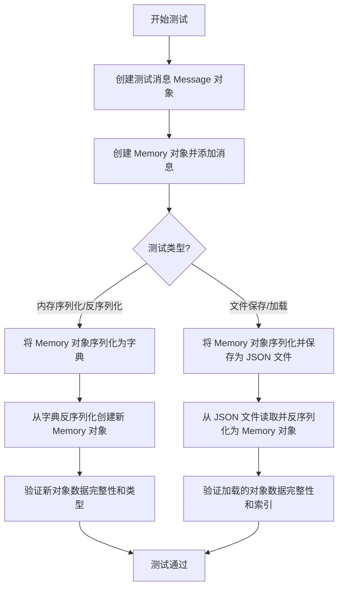
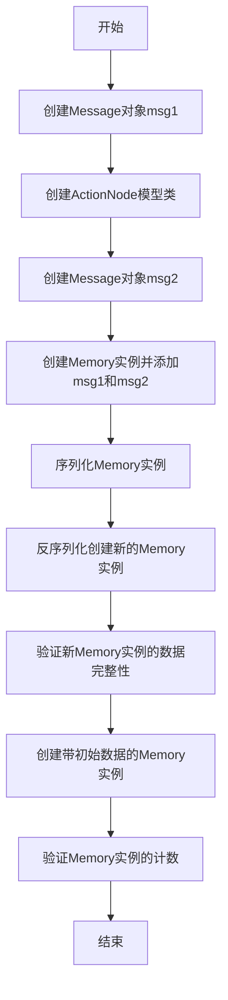
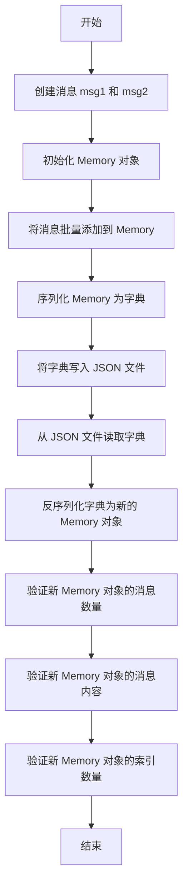
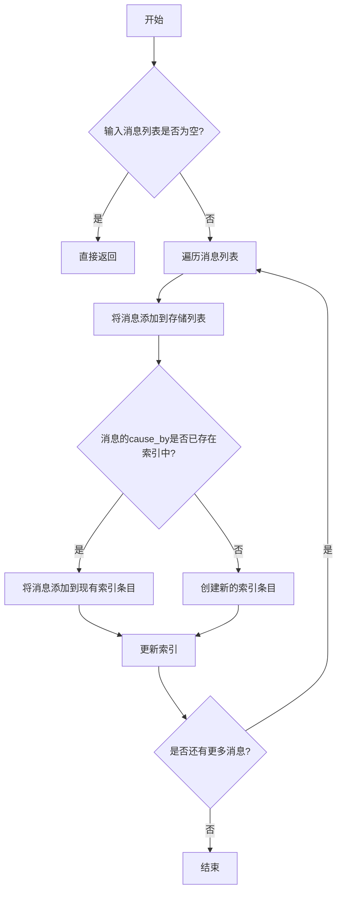
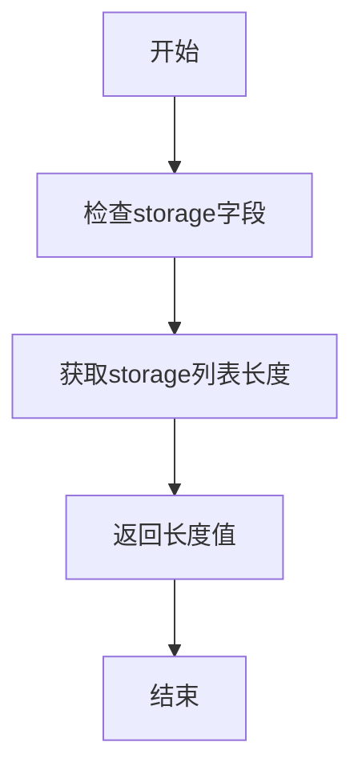
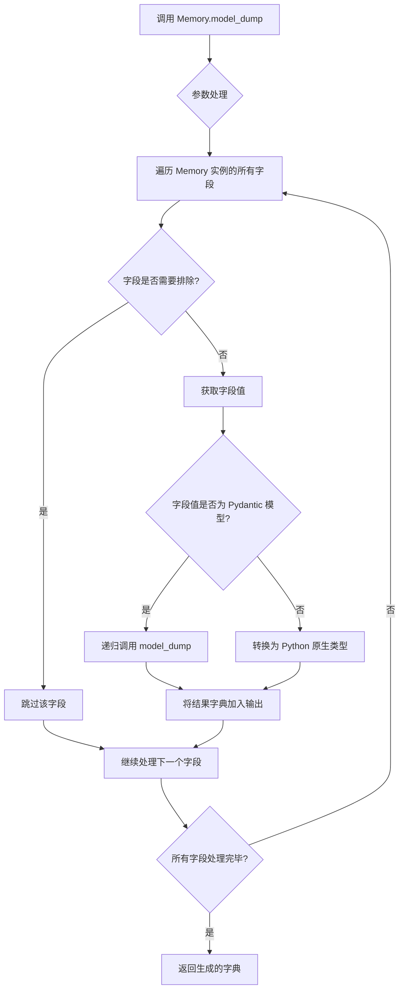
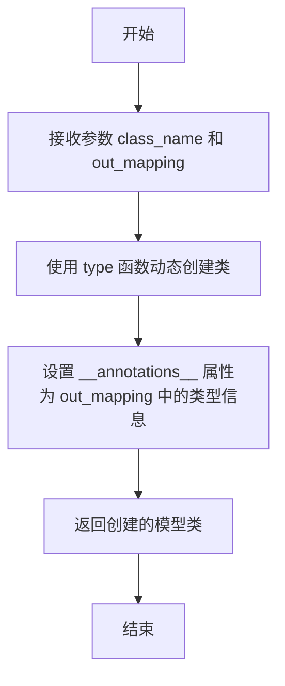

# `.\MetaGPT\tests\metagpt\serialize_deserialize\test_memory.py` 详细设计文档

该文件是一个单元测试文件，用于测试 MetaGPT 框架中 Memory 类的序列化与反序列化功能，验证 Memory 对象（包含 Message 消息）能够正确保存到 JSON 文件并从 JSON 文件恢复，同时保持数据的完整性和结构。

## 整体流程



## 类结构

```
BaseModel (Pydantic 基类)
├── ActionNode (动作节点)
├── Message (消息类)
├── Memory (记忆类)
└── 其他测试相关类
```

## 全局变量及字段


### `serdeser_path`
    
测试序列化/反序列化时使用的文件路径对象，指向测试数据存储目录

类型：`pathlib.Path`
    


### `Memory.storage`
    
存储所有消息对象的列表，按添加顺序保存完整的对话历史

类型：`list[Message]`
    


### `Memory.index`
    
基于消息触发原因(cause_by)建立的索引字典，用于快速按消息类型检索相关消息

类型：`dict[str, list[Message]]`
    


### `Message.role`
    
消息发送者的角色标识，如'User'、'Boss'、'Architect'等，表示消息来源

类型：`str`
    


### `Message.content`
    
消息的文本内容，包含具体的对话或指令信息

类型：`str`
    


### `Message.cause_by`
    
消息触发原因的类型字符串，指向触发该消息的动作类，用于消息分类和索引

类型：`str`
    


### `Message.instruct_content`
    
结构化的指令内容对象，包含特定动作生成的格式化数据，可为空

类型：`BaseModel | None`
    
    

## 全局函数及方法

### `test_memory_serdeser`

该函数是一个单元测试，用于验证`Memory`类的序列化（serialization）和反序列化（deserialization）功能。它创建了两个不同类型的`Message`对象，将它们添加到`Memory`实例中，然后通过序列化和反序列化过程验证数据的完整性和一致性。

参数：

- `context`：`object`，测试上下文，通常用于提供测试环境或配置信息。

返回值：`None`，无返回值。

#### 流程图



#### 带注释源码

```python
def test_memory_serdeser(context):
    # 创建第一个Message对象，模拟用户需求
    msg1 = Message(role="Boss", content="write a snake game", cause_by=UserRequirement)

    # 定义输出映射和数据，用于创建ActionNode模型类
    out_mapping = {"field2": (list[str], ...)}
    out_data = {"field2": ["field2 value1", "field2 value2"]}
    # 创建ActionNode模型类实例
    ic_obj = ActionNode.create_model_class("system_design", out_mapping)
    # 创建第二个Message对象，模拟系统设计内容
    msg2 = Message(
        role="Architect", instruct_content=ic_obj(**out_data), content="system design content", cause_by=WriteDesign
    )

    # 创建Memory实例并批量添加Message对象
    memory = Memory()
    memory.add_batch([msg1, msg2])
    # 序列化Memory实例为字典
    ser_data = memory.model_dump()

    # 反序列化字典创建新的Memory实例
    new_memory = Memory(**ser_data)
    # 验证新Memory实例中的Message数量
    assert new_memory.count() == 2
    # 获取第二个Message并验证其类型和属性
    new_msg2 = new_memory.get(2)[0]
    assert isinstance(new_msg2, BaseModel)
    assert isinstance(new_memory.storage[-1], BaseModel)
    assert new_memory.storage[-1].cause_by == any_to_str(WriteDesign)
    assert new_msg2.role == "Boss"

    # 创建带初始数据的Memory实例并验证其计数
    memory = Memory(storage=[msg1, msg2], index={msg1.cause_by: [msg1], msg2.cause_by: [msg2]})
    assert memory.count() == 2
```

### `test_memory_serdeser_save`

该函数是一个单元测试，用于验证`Memory`类的序列化与反序列化功能，特别是将内存对象保存到JSON文件并从文件中恢复的过程。它创建了两个不同类型的消息，将它们添加到内存中，然后将内存状态序列化为JSON并写入文件。接着，它从文件中读取JSON数据，反序列化为新的内存对象，并验证新内存对象的内容与原始内存对象一致。

参数：

- `context`：`object`，测试上下文，通常用于提供测试环境或配置信息，但在此函数中未直接使用。

返回值：`None`，该函数是一个单元测试，不返回任何值，通过断言验证功能正确性。

#### 流程图



#### 带注释源码

```python
def test_memory_serdeser_save(context):
    # 创建第一条消息，角色为用户，内容为编写2048游戏，原因为用户需求
    msg1 = Message(role="User", content="write a 2048 game", cause_by=UserRequirement)

    # 定义输出映射和数据，用于创建动态的 Pydantic 模型类
    out_mapping = {"field1": (list[str], ...)}
    out_data = {"field1": ["field1 value1", "field1 value2"]}
    # 创建动态模型类
    ic_obj = ActionNode.create_model_class("system_design", out_mapping)
    # 创建第二条消息，角色为架构师，包含动态模型实例，原因为编写设计
    msg2 = Message(
        role="Architect", instruct_content=ic_obj(**out_data), content="system design content", cause_by=WriteDesign
    )

    # 初始化 Memory 对象
    memory = Memory()
    # 批量添加消息到 Memory
    memory.add_batch([msg1, msg2])

    # 定义存储路径和内存文件路径
    stg_path = serdeser_path.joinpath("team", "environment")
    memory_path = stg_path.joinpath("memory.json")
    # 将 Memory 对象序列化为字典并写入 JSON 文件
    write_json_file(memory_path, memory.model_dump())
    # 断言文件存在
    assert memory_path.exists()

    # 从 JSON 文件读取字典数据
    memory_dict = read_json_file(memory_path)
    # 将字典数据反序列化为新的 Memory 对象
    new_memory = Memory(**memory_dict)
    # 验证新 Memory 对象中的消息数量为2
    assert new_memory.count() == 2
    # 获取新 Memory 对象中的第二条消息
    new_msg2 = new_memory.get(1)[0]
    # 验证新消息的 instruct_content 字段值
    assert new_msg2.instruct_content.field1 == ["field1 value1", "field1 value2"]
    # 验证新消息的 cause_by 字段值
    assert new_msg2.cause_by == any_to_str(WriteDesign)
    # 验证新 Memory 对象的索引数量为2
    assert len(new_memory.index) == 2
```

### `Memory.add_batch`

该方法用于批量添加消息到内存存储中，同时更新索引以支持按消息的触发原因（cause_by）进行快速检索。

参数：

- `msgs`：`list[Message]`，要添加到内存中的消息列表

返回值：`None`，无返回值

#### 流程图



#### 带注释源码

```python
def add_batch(self, msgs: list[Message]):
    """
    批量添加消息到内存存储中，并更新索引
    
    Args:
        msgs: 要添加的消息列表，每个消息必须是Message类型
    """
    # 如果消息列表为空，直接返回
    if not msgs:
        return
    
    # 遍历所有消息
    for msg in msgs:
        # 将消息添加到存储列表中
        self.storage.append(msg)
        
        # 获取消息的触发原因（cause_by）作为索引键
        key = msg.cause_by
        
        # 如果该触发原因尚未在索引中，创建新的索引条目
        if key not in self.index:
            self.index[key] = []
        
        # 将消息添加到对应触发原因的索引列表中
        self.index[key].append(msg)
```

### `Memory.count`

该方法用于获取当前内存中存储的消息数量。

参数：无

返回值：`int`，返回内存中存储的消息数量

#### 流程图



#### 带注释源码

```python
def count(self) -> int:
    """
    返回内存中存储的消息数量
    
    该方法通过获取storage列表的长度来统计当前内存中的消息数量。
    storage是Memory类中用于存储Message对象的列表字段。
    
    Returns:
        int: 内存中存储的消息数量
    """
    return len(self.storage)
```

### `Memory.get`

该方法用于从内存存储中检索指定数量的消息。它根据给定的数量参数，从存储列表的末尾开始返回相应数量的消息。如果请求的数量大于存储中的消息总数，则返回所有消息。

参数：

- `k`：`int`，要检索的消息数量。如果为0或负数，则返回空列表。

返回值：`list[Message]`，返回一个包含指定数量消息的列表，按存储顺序从旧到新排列。

#### 流程图

```mermaid
graph TD
    A[开始] --> B{检查 k <= 0?}
    B -- 是 --> C[返回空列表]
    B -- 否 --> D[计算起始索引 start = max(0, len(storage) - k)]
    D --> E[切片 storage 从 start 到末尾]
    E --> F[返回切片后的消息列表]
    F --> G[结束]
```

#### 带注释源码

```python
def get(self, k: int = 0) -> list[Message]:
    """
    从内存存储中获取最近的k条消息。
    
    参数:
        k (int): 要获取的消息数量。如果k为0或负数，则返回空列表。
    
    返回:
        list[Message]: 包含最近k条消息的列表，按存储顺序从旧到新排列。
    """
    if k <= 0:  # 如果k无效，返回空列表
        return []
    # 计算起始索引，确保不超出列表范围
    start = max(0, len(self.storage) - k)
    # 返回从起始索引到末尾的切片
    return self.storage[start:]
```

### `Memory.model_dump`

`Memory.model_dump` 是 `pydantic.BaseModel` 的内置方法，用于将 `Memory` 实例序列化为一个字典。该方法递归地处理所有字段，将 Pydantic 模型、嵌套模型以及基本数据类型转换为 Python 原生字典格式，便于后续的 JSON 序列化或网络传输。

参数：

- `include`：`Union[AbstractSetIntStr, MappingIntStrAny]`，可选，指定需要包含在输出字典中的字段。
- `exclude`：`Union[AbstractSetIntStr, MappingIntStrAny]`，可选，指定需要从输出字典中排除的字段。
- `by_alias`：`bool`，默认为 `False`，是否使用字段别名作为字典键。
- `exclude_unset`：`bool`，默认为 `False`，是否排除未设置的字段（即保持默认值的字段）。
- `exclude_defaults`：`bool`，默认为 `False`，是否排除等于默认值的字段。
- `exclude_none`：`bool`，默认为 `False`，是否排除值为 `None` 的字段。
- `round_trip`：`bool`，默认为 `False`，是否保证输出的字典能够通过验证重新创建原始模型。
- `warnings`：`bool`，默认为 `True`，是否在数据转换过程中显示警告。

返回值：`dict`，包含 `Memory` 实例所有字段及其值的字典，其中字段值已转换为 Python 原生类型。

#### 流程图



#### 带注释源码

```python
def model_dump(
    self,
    *,
    include: Union[AbstractSetIntStr, MappingIntStrAny] = None,
    exclude: Union[AbstractSetIntStr, MappingIntStrAny] = None,
    by_alias: bool = False,
    exclude_unset: bool = False,
    exclude_defaults: bool = False,
    exclude_none: bool = False,
    round_trip: bool = False,
    warnings: bool = True,
) -> Dict[str, Any]:
    """
    将模型实例序列化为字典。
    
    这是 Pydantic BaseModel 的内置方法，用于递归地将模型及其嵌套字段
    转换为 Python 原生字典格式。
    
    Args:
        include: 指定要包含的字段，可以是字段名的集合或映射
        exclude: 指定要排除的字段，可以是字段名的集合或映射
        by_alias: 是否使用字段别名作为字典键
        exclude_unset: 是否排除未设置的字段（保持默认值的字段）
        exclude_defaults: 是否排除等于默认值的字段
        exclude_none: 是否排除值为 None 的字段
        round_trip: 是否确保输出的字典能重新创建原始模型
        warnings: 是否在转换过程中显示警告
        
    Returns:
        包含模型所有字段及其值的字典
    """
    # 此方法由 Pydantic 自动生成，实际实现会递归处理所有字段
    # 包括嵌套的 Pydantic 模型、列表、字典等
    return self.__pydantic_serializer__.to_python(
        self,
        mode='json',
        by_alias=by_alias,
        include=include,
        exclude=exclude,
        exclude_unset=exclude_unset,
        exclude_defaults=exclude_defaults,
        exclude_none=exclude_none,
        round_trip=round_trip,
        warnings=warnings,
    )
```

### `ActionNode.create_model_class`

该方法用于动态创建一个Pydantic模型类，该模型类基于提供的字段映射（out_mapping）定义其结构。它通常用于在运行时生成具有特定字段和类型的指令内容（instruct_content）模型，以便在消息传递和序列化/反序列化过程中使用。

参数：

- `class_name`：`str`，要创建的模型类的名称。
- `out_mapping`：`dict`，一个字典，其中键是字段名，值是一个元组，包含字段类型和可选的默认值或省略号（...）表示必填字段。

返回值：`Type[BaseModel]`，返回一个动态生成的Pydantic模型类。

#### 流程图



#### 带注释源码

```python
@classmethod
def create_model_class(cls, class_name: str, out_mapping: dict) -> Type[BaseModel]:
    """
    动态创建一个Pydantic模型类。

    参数:
        class_name (str): 要创建的模型类的名称。
        out_mapping (dict): 字段映射字典，键为字段名，值为 (类型, 默认值/...) 元组。

    返回:
        Type[BaseModel]: 动态生成的Pydantic模型类。
    """
    # 使用 type 函数动态创建类，继承自 BaseModel
    # 第一个参数是类名，第二个参数是基类元组，第三个参数是类属性字典
    model_class = type(
        class_name,
        (BaseModel,),
        {
            "__annotations__": {
                # 遍历 out_mapping，提取字段名和类型信息，构建 __annotations__ 字典
                key: value[0] for key, value in out_mapping.items()
            }
        },
    )
    return model_class
```

## 关键组件


### Memory

Memory 类是系统的核心记忆组件，负责存储和管理消息（Message）历史，支持批量添加、序列化/反序列化以及基于索引的快速检索。

### Message

Message 类是信息传递的基本单元，封装了角色、内容、触发动作等属性，是 Memory 存储和索引的主要对象。

### ActionNode

ActionNode 类用于动态创建 Pydantic 模型类，这些模型作为消息的结构化指令内容（instruct_content），增强了消息的语义和可处理性。

### 序列化与反序列化

代码通过 `model_dump()` 和 `Memory(**data)` 实现了 Memory 对象与 JSON 字典之间的转换，并结合 `write_json_file` 和 `read_json_file` 工具函数支持持久化存储与加载。


## 问题及建议


### 已知问题

-   **测试用例与实现逻辑耦合度高**：`test_memory_serdeser_save` 测试用例依赖于特定的文件路径 (`serdeser_path.joinpath("team", "environment")`) 和文件操作 (`write_json_file`, `read_json_file`)。这使得测试不是完全自包含的，可能受到文件系统状态的影响，并且在并行测试或不同环境中运行时可能失败。
-   **测试数据构造复杂且脆弱**：测试用例中通过 `ActionNode.create_model_class` 动态创建 Pydantic 模型类来构造 `Message` 的 `instruct_content`。这种方式虽然灵活，但使得测试数据的构造过程复杂，且依赖于 `ActionNode` 的内部实现。如果 `create_model_class` 的接口或行为发生变化，这些测试可能会无声地失败或产生误导性结果。
-   **断言逻辑存在潜在混淆**：在 `test_memory_serdeser` 中，断言 `new_msg2.role == "Boss"` 可能是一个笔误或逻辑错误。根据前面的代码，`new_msg2` 是从索引为2的位置获取的（`new_memory.get(2)[0]`），而 `memory.add_batch([msg1, msg2])` 是先添加 `msg1` (role="Boss")，后添加 `msg2` (role="Architect")。如果 `Memory.get(index)` 的 `index` 参数是1-based（即1表示第一个消息），那么 `get(2)` 应该获取到 `msg2` (role="Architect")。因此，这个断言可能与预期行为不符，暴露出对 `Memory.get` 方法索引语义的理解可能存在歧义或测试用例本身有误。
-   **缺少对异常和边界条件的测试**：当前测试主要覆盖了正常的序列化/反序列化流程。没有看到对 `Memory` 类在异常情况下的测试，例如：向 `add_batch` 传入空列表、`storage` 或 `index` 初始化参数包含无效数据、文件读写失败等场景。

### 优化建议

-   **使用临时文件和依赖注入**：对于涉及文件操作的测试（如 `test_memory_serdeser_save`），建议使用 Python 的 `tempfile` 模块创建临时目录和文件，确保测试的独立性和自清理。或者，考虑将文件路径作为参数注入，以便在测试中更容易地模拟和控制。
-   **简化测试数据构造并提高稳定性**：考虑为测试定义一个固定的、简单的 Pydantic 模型类，而不是在每次测试中动态创建。这可以减少对 `ActionNode` 的依赖，使测试数据更清晰、更稳定。例如，可以在测试模块的顶部定义一个 `SimpleInstructContent` 类。
-   **审查并修正测试断言逻辑**：仔细检查 `test_memory_serdeser` 中关于 `new_msg2.role` 的断言。确认 `Memory.get(index)` 方法中 `index` 参数的确切语义（是0-based还是1-based，或者是其他含义）。根据正确的语义修正断言，或者如果确实是测试用例错误，则修正测试数据或获取逻辑，并添加注释说明。
-   **补充异常和边界测试**：增加测试用例以覆盖 `Memory` 类的边界条件和潜在异常。例如：
    -   测试 `add_batch([])` 是否正确处理空列表。
    -   测试使用无效数据构造 `Memory` 实例时是否抛出合适的验证错误（利用 Pydantic 的特性）。
    -   测试 `get` 方法在索引越界时的行为（返回空列表？抛出异常？）。
    -   模拟 `write_json_file` 或 `read_json_file` 失败时（如权限错误、磁盘满）的异常处理（如果 `Memory` 有相关逻辑，否则应在更高层处理）。
-   **提高测试的可读性和维护性**：将测试数据（如 `msg1`, `msg2`）的创建提取为测试类内部的辅助方法或 fixture（如果使用 pytest），避免在多个测试方法中重复相似的构造代码。使用更清晰的变量名，例如 `deserialized_memory` 代替 `new_memory`，`first_msg`, `second_msg` 代替 `new_msg2` 等。
-   **考虑测试索引结构的正确性**：当前测试验证了 `index` 字典的长度，但没有深入验证其内容（键值映射关系）是否正确。可以增加断言来检查 `index` 是否确实将 `cause_by` 正确映射到了对应的 `Message` 列表。


## 其它


### 设计目标与约束

本代码是 MetaGPT 项目中 `Memory` 类的单元测试模块。其核心设计目标是验证 `Memory` 类的序列化（serialization）与反序列化（deserialization）功能，以及其与文件系统（JSON 文件）交互的正确性。约束条件包括：1) 必须使用 Pydantic 的 `BaseModel` 作为数据模型基础，以确保序列化兼容性；2) 测试需要覆盖 `Memory` 的核心方法，如 `add_batch`、`get`、`count` 以及 `model_dump`；3) 测试数据需模拟真实场景，包含不同角色、内容和 `cause_by` 属性的 `Message` 对象，以及包含动态生成 Pydantic 模型（`instruct_content`）的复杂消息。

### 错误处理与异常设计

当前测试代码未显式包含错误处理逻辑，其正确性依赖于被测试的 `Memory` 类及 `Message` 类的内部实现。潜在的异常点包括：1) 在反序列化过程中，如果 JSON 数据格式与 `Memory` 或嵌套的 `Message`/`instruct_content` 模型不匹配，Pydantic 会抛出 `ValidationError`；2) 文件操作（`write_json_file`、`read_json_file`）可能因路径不存在或权限问题引发 `IOError` 或 `OSError`。测试用例本身通过 `assert` 语句验证预期行为，若断言失败则抛出 `AssertionError`，标志着测试未通过。

### 数据流与状态机

测试执行的数据流清晰：1) **初始化阶段**：创建两个具有不同属性的 `Message` 对象（`msg1`, `msg2`），其中 `msg2` 包含一个由 `ActionNode.create_model_class` 动态创建的 Pydantic 模型实例作为 `instruct_content`。2) **内存操作阶段**：实例化 `Memory` 对象，通过 `add_batch` 方法批量添加消息。此时 `Memory` 内部状态（`storage` 列表和 `index` 字典）发生变化。3) **序列化/反序列化验证阶段**：调用 `model_dump` 将 `Memory` 对象序列化为字典，然后利用该字典反序列化生成新的 `Memory` 对象（`new_memory`）。通过断言验证 `new_memory` 的状态（消息数量、消息内容、索引等）与原对象一致。4) **文件持久化验证阶段**：将 `Memory` 对象序列化后的字典写入 JSON 文件，再从文件读回并反序列化。验证从文件恢复的 `Memory` 对象状态与原始对象一致，特别是动态生成的 `instruct_content` 字段的值。

### 外部依赖与接口契约

1.  **Pydantic (`BaseModel`)**: `Memory` 和 `Message` 类继承自 `BaseModel`，测试依赖于其提供的序列化（`model_dump`）、反序列化（`__init__`）及数据验证功能。
2.  **MetaGPT 内部模块**:
    *   `metagpt.memory.memory.Memory`: 被测试的主类，需提供 `add_batch`, `get`, `count`, `model_dump` 等方法。
    *   `metagpt.schema.Message`: 消息数据模型，需包含 `role`, `content`, `cause_by`, `instruct_content` 等字段。
    *   `metagpt.actions.action_node.ActionNode`: 提供 `create_model_class` 方法，用于在运行时创建特定的 Pydantic 模型类。
    *   `metagpt.actions.add_requirement.UserRequirement` 与 `metagpt.actions.design_api.WriteDesign`: 作为 `Message.cause_by` 的类型标识。
    *   `metagpt.utils.common`: 提供 `any_to_str`, `read_json_file`, `write_json_file` 等工具函数。
3.  **文件系统**: 测试 `test_memory_serdeser_save` 依赖于本地文件系统来读写 JSON 文件，路径由 `serdeser_path`（来自测试基础类）构建。
4.  **测试框架 (pytest)**: 代码虽未显式导入，但函数名以 `test_` 开头，且使用 `context` 参数，暗示其运行在 pytest 框架下，并可能使用了特定的 fixture（如 `serdeser_path`）。

### 测试策略与覆盖范围

测试采用黑盒与白盒结合的策略。1) **功能验证**：验证 `Memory` 对象在内存中序列化/反序列化后能保持数据完整性和一致性（`test_memory_serdeser`）。2) **持久化验证**：验证 `Memory` 对象能正确保存到文件并从文件恢复，包括复杂嵌套对象（`test_memory_serdeser_save`）。3) **状态验证**：通过检查 `count()`、`get()` 返回结果、`storage` 列表内容、`index` 字典结构以及消息的具体属性（如 `role`, `cause_by`, `instruct_content` 字段值），确保 `Memory` 内部状态管理正确。测试覆盖了 `Memory` 的核心数据流转路径和持久化场景。

### 安全性与合规性考虑

1.  **数据序列化安全**：测试中序列化的数据来源于可控的测试用例构造，不涉及不可信的外部输入。但在实际应用 `Memory` 类时，从外部文件或网络反序列化数据需警惕恶意数据可能引发的安全问题（如通过构造特定数据触发异常或消耗资源）。
2.  **文件操作安全**：测试文件操作在临时或专用的测试目录（`serdeser_path`）下进行，避免了污染生产目录或产生冲突。写入文件的内容是序列化的内部对象，不包含敏感信息（在测试上下文中）。
3.  **依赖安全**：依赖于 Pydantic 的数据验证，这在一定程度上能防止无效或畸形数据被反序列化后进入系统。测试验证了这种验证机制在正常数据下的有效性。

    