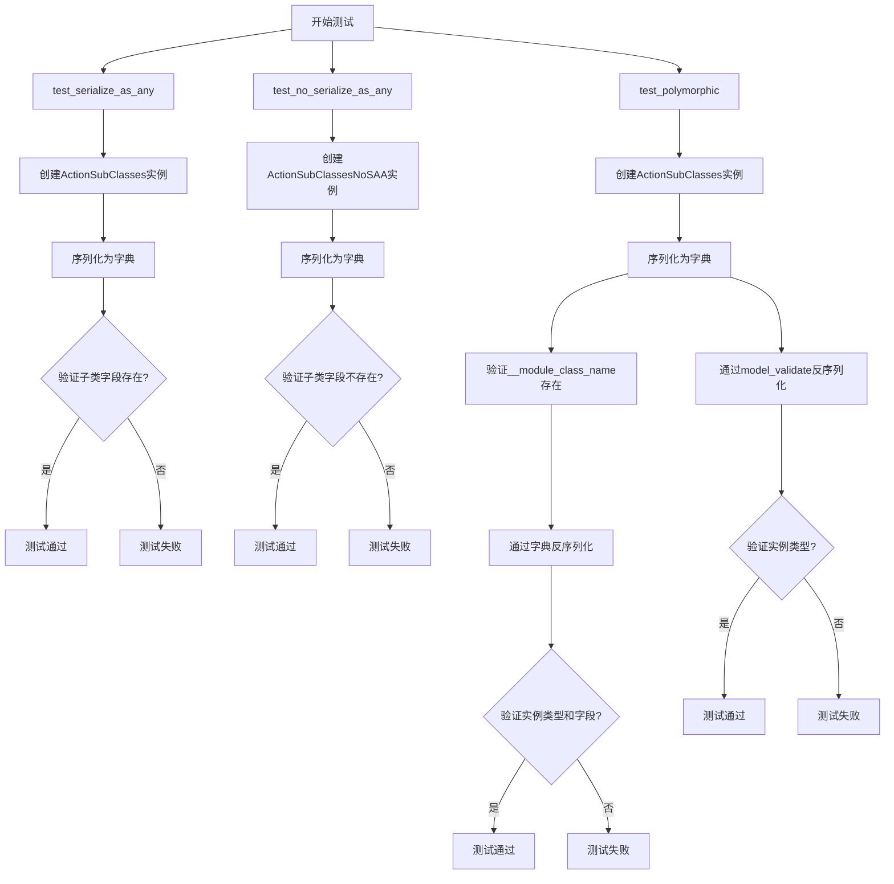
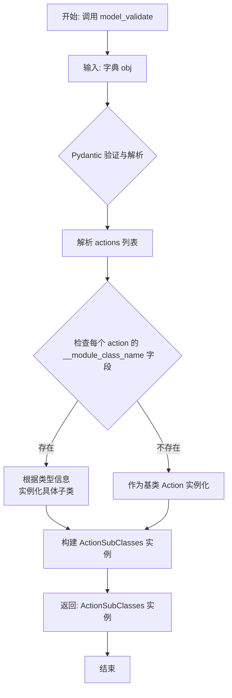
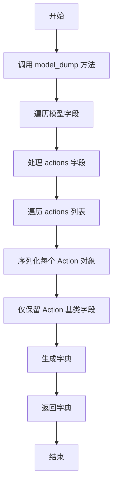

# `.\MetaGPT\tests\metagpt\serialize_deserialize\test_polymorphic.py` 详细设计文档

该代码是一个单元测试文件，用于测试Pydantic模型在多态序列化/反序列化场景下的行为，特别是验证`SerializeAsAny`装饰器在包含子类对象的列表字段中，能否正确保留子类的特定字段信息。

## 整体流程



## 类结构

```
BaseModel (Pydantic基类)
├── ActionSubClasses
└── ActionSubClassesNoSAA
Action (metagpt.actions)
├── ActionOKV2 (tests.metagpt.serialize_deserialize.test_serdeser_base)
└── ActionPass (tests.metagpt.serialize_deserialize.test_serdeser_base)
```

## 全局变量及字段


### `ActionSubClasses.actions`
    
存储Action子类实例的列表，使用SerializeAsAny确保序列化时保留子类类型信息

类型：`list[SerializeAsAny[Action]]`
    


### `ActionSubClassesNoSAA.actions`
    
存储Action子类实例的列表，不使用SerializeAsAny，序列化时可能丢失子类特定字段

类型：`list[Action]`
    
    

## 全局函数及方法

### `test_serialize_as_any`

该函数是一个单元测试，用于验证在序列化包含多态子类（如`ActionOKV2`和`ActionPass`）的列表时，使用`SerializeAsAny`注解是否能正确保留子类特有的字段（例如`extra_field`）。它通过创建`ActionSubClasses`实例、将其序列化为字典，并断言字典中包含了子类的特定字段来测试这一功能。

参数：无

返回值：`None`，该函数不返回任何值，仅执行断言测试。

#### 流程图

```mermaid
flowchart TD
    A[开始] --> B[创建ActionSubClasses实例<br>包含ActionOKV2和ActionPass]
    B --> C[调用model_dump()<br>序列化为字典]
    C --> D{断言字典中actions[0]<br>包含extra_field}
    D -->|是| E[测试通过]
    D -->|否| F[测试失败]
    E --> G[结束]
    F --> G
```

#### 带注释源码

```python
def test_serialize_as_any():
    """test subclasses of action with different fields in ser&deser"""
    # ActionOKV2 with a extra field `extra_field`
    # 1. 创建包含多态Action子类的ActionSubClasses实例
    action_subcls = ActionSubClasses(actions=[ActionOKV2(), ActionPass()])
    # 2. 将实例序列化为字典
    action_subcls_dict = action_subcls.model_dump()
    # 3. 断言序列化后的字典中，第一个action（ActionOKV2实例）包含了其特有的`extra_field`字段
    assert action_subcls_dict["actions"][0]["extra_field"] == ActionOKV2().extra_field
```

### `test_no_serialize_as_any`

该函数是一个单元测试，用于验证当不使用 `SerializeAsAny` 注解时，`ActionSubClassesNoSAA` 类在序列化其包含的 `Action` 子类列表时，不会保留子类特有的字段（如 `extra_field`），而是按照基类 `Action` 的字段进行序列化。

参数：
- 无显式参数。该函数是一个测试函数，不接收外部参数。

返回值：`None`，该函数是一个单元测试，不返回任何值，主要通过断言（assert）来验证预期行为。

#### 流程图

```mermaid
flowchart TD
    A[开始] --> B[创建ActionSubClassesNoSAA实例<br>包含ActionOKV2和ActionPass]
    B --> C[调用model_dump()序列化实例为字典]
    C --> D{检查字典中actions[0]是否包含'extra_field'}
    D -- 否 --> E[断言通过，测试成功]
    D -- 是 --> F[断言失败，测试失败]
    E --> G[结束]
    F --> G
```

#### 带注释源码

```python
def test_no_serialize_as_any():
    # ActionOKV2 with a extra field `extra_field`
    # 创建一个ActionSubClassesNoSAA实例，其actions列表包含ActionOKV2和ActionPass对象。
    # ActionOKV2是Action的子类，并带有一个额外的字段`extra_field`。
    action_subcls = ActionSubClassesNoSAA(actions=[ActionOKV2(), ActionPass()])
    
    # 将Pydantic模型实例序列化为字典。
    action_subcls_dict = action_subcls.model_dump()
    
    # 断言：在不使用`SerializeAsAny`注解的情况下，序列化后的字典中，
    # actions列表的第一个元素（对应ActionOKV2实例）不包含其特有的`extra_field`键。
    # 这是因为`ActionSubClassesNoSAA`的actions字段类型注解为`list[Action]`，
    # Pydantic会按照基类Action的模型定义进行序列化，忽略子类的额外字段。
    assert "extra_field" not in action_subcls_dict["actions"][0]
```

### `test_polymorphic`

该函数是一个单元测试，用于验证 `ActionSubClasses` 模型（使用 `SerializeAsAny` 包装 `Action` 列表）在序列化和反序列化过程中能够正确处理多态性。具体来说，它测试了包含不同子类（`ActionOKV2` 和 `ActionPass`）的列表在通过 `model_dump()` 序列化为字典，再通过构造函数或 `model_validate()` 反序列化回对象时，是否能保持各自的类型和字段信息。

参数：
- 无显式参数。该函数是一个单元测试，不接收外部参数。

返回值：`None`，该函数是一个测试用例，主要功能是执行断言验证，不返回任何值。

#### 流程图

```mermaid
flowchart TD
    A[开始] --> B[创建 ActionOKV2 实例 ok_v2]
    B --> C[创建 ActionSubClasses 实例 action_subcls<br>包含 ActionOKV2 和 ActionPass]
    C --> D[序列化 action_subcls 为字典 action_subcls_dict]
    D --> E[深拷贝字典得到 action_subcls_dict2]
    E --> F{断言：action_subcls_dict 中<br>第一个action包含 '__module_class_name' 键}
    F --> G[通过构造函数反序列化 action_subcls_dict<br>得到 new_action_subcls]
    G --> H{断言：new_action_subcls.actions[0]<br>是 ActionOKV2 类型}
    H --> I{断言：new_action_subcls.actions[0].extra_field<br>等于 ok_v2.extra_field}
    I --> J{断言：new_action_subcls.actions[1]<br>是 ActionPass 类型}
    J --> K[通过 model_validate 反序列化 action_subcls_dict2<br>得到 new_action_subcls]
    K --> L{断言：new_action_subcls.actions[0]<br>是 ActionOKV2 类型}
    L --> M{断言：new_action_subcls.actions[1]<br>是 ActionPass 类型}
    M --> N[结束]
```

#### 带注释源码

```python
def test_polymorphic():
    # 1. 创建一个 ActionOKV2 实例，用于后续的字段值比较。
    ok_v2 = ActionOKV2(
        **{"name": "ActionOKV2", "context": "", "prefix": "", "desc": "", "extra_field": "ActionOKV2 Extra Info"}
    )

    # 2. 创建 ActionSubClasses 实例，其 actions 列表包含两个不同类型的 Action 子类。
    action_subcls = ActionSubClasses(actions=[ActionOKV2(), ActionPass()])
    
    # 3. 将对象序列化为字典。由于使用了 SerializeAsAny，子类的特定字段（如 extra_field）和类型信息（__module_class_name）会被保留。
    action_subcls_dict = action_subcls.model_dump()
    
    # 4. 深拷贝序列化后的字典，用于后续不同的反序列化方法测试。
    action_subcls_dict2 = copy.deepcopy(action_subcls_dict)

    # 5. 断言：序列化后的字典中，第一个 action 包含了 '__module_class_name' 键。
    #    这证明了 SerializeAsAny 成功保留了子类的类型信息，用于后续的反序列化。
    assert "__module_class_name" in action_subcls_dict["actions"][0]

    # 6. 测试反序列化方法一：使用模型的构造函数 (**kwargs)。
    #    将序列化后的字典传入，重新构建 ActionSubClasses 对象。
    new_action_subcls = ActionSubClasses(**action_subcls_dict)
    
    # 7. 断言：反序列化后，列表中的第一个元素确实是 ActionOKV2 类型，而不是其基类 Action。
    assert isinstance(new_action_subcls.actions[0], ActionOKV2)
    # 8. 断言：该 ActionOKV2 实例的 extra_field 字段值与最初创建的 ok_v2 实例一致。
    #    这证明了子类特有的字段在序列化-反序列化循环中得以完整保留。
    assert new_action_subcls.actions[0].extra_field == ok_v2.extra_field
    # 9. 断言：列表中的第二个元素确实是 ActionPass 类型。
    assert isinstance(new_action_subcls.actions[1], ActionPass)

    # 10. 测试反序列化方法二：使用 Pydantic 的 model_validate 类方法。
    #     使用深拷贝的字典进行验证，确保测试独立性。
    new_action_subcls = ActionSubClasses.model_validate(action_subcls_dict2)
    
    # 11. 断言：通过 model_validate 反序列化后，类型信息同样正确恢复。
    assert isinstance(new_action_subcls.actions[0], ActionOKV2)
    # 12. 断言：第二个元素的类型也正确恢复。
    assert isinstance(new_action_subcls.actions[1], ActionPass)
```

### `ActionSubClasses.model_dump`

该方法用于将 `ActionSubClasses` 模型实例序列化为一个字典。它继承自 Pydantic 的 `BaseModel.model_dump` 方法，能够处理包含多态类型（通过 `SerializeAsAny` 标注）的字段，确保子类特有的字段（如 `ActionOKV2` 的 `extra_field`）在序列化结果中被正确保留。

参数：
- `self`：`ActionSubClasses`，`ActionSubClasses` 模型的一个实例。
- `mode`：`str`，可选参数，指定序列化模式，例如 `'python'` 或 `'json'`，默认为 `'python'`。
- `include`：`Union[AbstractSetIntStr, MappingIntStrAny]`，可选参数，指定要包含在输出中的字段。
- `exclude`：`Union[AbstractSetIntStr, MappingIntStrAny]`，可选参数，指定要从输出中排除的字段。
- `by_alias`：`bool`，可选参数，如果为 `True`，则使用字段的别名作为字典键。
- `exclude_unset`：`bool`，可选参数，如果为 `True`，则排除未设置的字段（即保持默认值的字段）。
- `exclude_defaults`：`bool`，可选参数，如果为 `True`，则排除等于默认值的字段。
- `exclude_none`：`bool`，可选参数，如果为 `True`，则排除值为 `None` 的字段。
- `round_trip`：`bool`，可选参数，如果为 `True`，则序列化结果应能通过 `model_validate` 重新生成原模型。
- `warnings`：`bool`，可选参数，是否显示警告信息。

返回值：`dict`，返回一个字典，包含模型实例的所有字段及其值。对于 `actions` 列表中的每个 `Action` 子类对象，其特有的字段（如 `extra_field`）和用于反序列化的元数据（如 `__module_class_name`）都会被包含在内。

#### 流程图

```mermaid
flowchart TD
    A[开始] --> B[调用 BaseModel.model_dump]
    B --> C{遍历模型字段}
    C --> D[处理 actions 字段]
    D --> E{字段类型为<br>SerializeAsAny[Action]?}
    E -- 是 --> F[序列化每个 Action 子类对象<br>包含子类特有字段]
    E -- 否 --> G[按常规 Pydantic 规则序列化]
    F --> H[生成包含 __module_class_name 的字典]
    G --> H
    H --> I[返回完整的序列化字典]
    I --> J[结束]
```

#### 带注释源码

```python
def model_dump(
    self,
    *,
    mode: 'Literal["json", "python"]' = 'python',
    include: 'IncEx' = None,
    exclude: 'IncEx' = None,
    by_alias: bool = False,
    exclude_unset: bool = False,
    exclude_defaults: bool = False,
    exclude_none: bool = False,
    round_trip: bool = False,
    warnings: bool = True,
) -> 'Dict[str, Any]':
    """
    将模型实例序列化为字典。
    
    继承自 Pydantic BaseModel 的方法，用于处理包含 `SerializeAsAny` 标注字段的
    多态序列化。确保 Action 子类的所有字段都被正确导出。
    
    参数:
        mode: 序列化模式，'python' 返回 Python 对象，'json' 返回 JSON 兼容对象。
        include: 指定要包含的字段。
        exclude: 指定要排除的字段。
        by_alias: 是否使用字段别名。
        exclude_unset: 是否排除未设置的字段。
        exclude_defaults: 是否排除等于默认值的字段。
        exclude_none: 是否排除值为 None 的字段。
        round_trip: 是否确保序列化结果可反序列化。
        warnings: 是否显示警告。
        
    返回:
        包含模型数据的字典。对于 `actions` 列表，每个元素都是其对应子类
        （如 ActionOKV2, ActionPass）的完整字段表示。
    """
    # 此方法的具体实现由 Pydantic 在运行时提供。
    # 对于 ActionSubClasses，关键行为由 `SerializeAsAny` 标注驱动。
    # 当序列化 `actions` 字段时，Pydantic 会识别列表中每个对象的实际类型，
    # 并调用该类型的 `model_dump` 方法，从而保留子类特有字段。
    # 如果启用了 round_trip，还会包含 `__module_class_name` 等元数据。
    return super().model_dump(
        mode=mode,
        include=include,
        exclude=exclude,
        by_alias=by_alias,
        exclude_unset=exclude_unset,
        exclude_defaults=exclude_defaults,
        exclude_none=exclude_none,
        round_trip=round_trip,
        warnings=warnings,
    )
```

### `ActionSubClasses.model_validate`

该方法用于从给定的字典数据中验证并创建一个 `ActionSubClasses` 实例。它利用 Pydantic 的模型验证功能，确保输入数据符合 `ActionSubClasses` 类的结构，并正确处理包含 `SerializeAsAny` 注解的多态字段。

参数：

- `obj`：`dict`，包含要验证的数据的字典，通常来自序列化后的 `ActionSubClasses` 实例。

返回值：`ActionSubClasses`，返回一个验证后的 `ActionSubClasses` 实例，其 `actions` 字段中的元素会根据序列化时存储的类型信息正确反序列化为相应的子类实例（如 `ActionOKV2` 或 `ActionPass`）。

#### 流程图



#### 带注释源码

```python
# 这是 Pydantic BaseModel 的内置类方法，并非在提供的代码片段中显式定义。
# 其核心逻辑由 Pydantic 框架提供，用于根据模型定义验证输入数据。
# 对于 ActionSubClasses 类，其关键行为由字段定义 `list[SerializeAsAny[Action]]` 驱动。

@classmethod
def model_validate(
    cls: type['Model'],  # 类本身，此处为 ActionSubClasses
    obj: Any,            # 要验证的对象，通常是字典
    *,
    strict: bool | None = None,
    from_attributes: bool | None = None,
    context: dict[str, Any] | None = None
) -> 'Model':           # 返回验证后的模型实例
    """
    验证提供的 `obj` 数据是否符合当前 Pydantic 模型（ActionSubClasses）的定义。
    对于 `actions` 字段，由于使用了 `SerializeAsAny[Action]`，Pydantic 会
    查找输入字典中每个 action 对象里的 `__module_class_name` 字段（由
    `SerializeAsAny` 在序列化时自动添加），并使用该信息将字典反序列化
    为正确的 Action 子类（如 ActionOKV2 或 ActionPass）的实例。
    如果找不到类型信息，则可能作为基类 Action 实例化或引发错误。
    """
    # 实际的验证、数据转换和实例化逻辑由 Pydantic 内部实现。
    # 用户调用方式：ActionSubClasses.model_validate(some_dict)
    pass
```

### `ActionSubClassesNoSAA.model_dump`

该方法用于将 `ActionSubClassesNoSAA` 类的实例序列化为一个字典。它继承自 Pydantic 的 `BaseModel`，因此 `model_dump` 方法会递归地将模型的所有字段（包括嵌套模型）转换为标准的 Python 字典。在本例中，`actions` 字段是一个 `Action` 对象列表，由于没有使用 `SerializeAsAny` 注解，序列化时会丢失子类特有的字段（如 `ActionOKV2` 的 `extra_field`），而只保留基类 `Action` 定义的字段。

参数：
- `self`：`ActionSubClassesNoSAA`，`ActionSubClassesNoSAA` 类的实例，表示要序列化的对象。

返回值：`dict`，返回一个字典，包含模型所有字段的键值对。对于 `actions` 列表，其中的 `Action` 子类对象会被序列化为只包含基类 `Action` 字段的字典。

#### 流程图



#### 带注释源码

```python
def model_dump(
    self,
    *,
    mode: Union[str, Literal['python', 'json']] = 'python',
    include: Optional[IncEx] = None,
    exclude: Optional[IncEx] = None,
    context: Optional[Dict[str, Any]] = None,
    by_alias: bool = False,
    exclude_unset: bool = False,
    exclude_defaults: bool = False,
    exclude_none: bool = False,
    round_trip: bool = False,
    warnings: Union[bool, Literal['none', 'warn', 'error']] = True,
    serialize_as_any: bool = False,
) -> Dict[str, Any]:
    """
    将模型实例序列化为字典。
    
    由于 ActionSubClassesNoSAA 的 actions 字段定义为 list[Action]，
    没有使用 SerializeAsAny 注解，因此在序列化 Action 的子类（如 ActionOKV2）时，
    只会保留 Action 基类中定义的字段，子类特有的字段（如 extra_field）会被丢弃。
    
    参数:
        mode: 序列化模式，'python' 返回 Python 对象，'json' 返回可 JSON 序列化的对象。
        include: 指定要包含的字段。
        exclude: 指定要排除的字段。
        context: 额外的序列化上下文。
        by_alias: 是否使用字段别名作为键。
        exclude_unset: 是否排除未设置的字段。
        exclude_defaults: 是否排除等于默认值的字段。
        exclude_none: 是否排除值为 None 的字段。
        round_trip: 是否支持反序列化回原对象。
        warnings: 警告处理方式。
        serialize_as_any: 是否将多态字段序列化为任意类型。
        
    返回:
        包含模型字段键值对的字典。
    """
    # 内部实现由 Pydantic 处理，递归遍历字段并转换为字典
    # 对于 actions 字段，由于类型注解为 list[Action]，Pydantic 会调用每个 Action 子类实例的 model_dump 方法
    # 但由于没有 SerializeAsAny，子类实例会被视为 Action 类型，因此只序列化 Action 基类的字段
    return super().model_dump(
        mode=mode,
        include=include,
        exclude=exclude,
        context=context,
        by_alias=by_alias,
        exclude_unset=exclude_unset,
        exclude_defaults=exclude_defaults,
        exclude_none=exclude_none,
        round_trip=round_trip,
        warnings=warnings,
        serialize_as_any=serialize_as_any,
    )
```

## 关键组件


### Pydantic 多态序列化支持

通过使用 `SerializeAsAny` 包装器，在序列化和反序列化过程中保留子类的具体类型信息和特有字段，实现多态类型的正确处理。

### 模型配置 `arbitrary_types_allowed`

在 Pydantic 模型的 `ConfigDict` 中设置 `arbitrary_types_allowed=True`，允许模型字段接受非 Pydantic 类型的任意 Python 对象，为处理复杂的继承层次结构提供灵活性。

### 深度拷贝与模型验证

使用 `copy.deepcopy` 创建数据字典的独立副本，确保测试数据隔离。通过 `model_validate` 方法从字典数据重建模型实例，验证反序列化过程的正确性。


## 问题及建议


### 已知问题

-   **`ActionSubClassesNoSAA` 类功能缺失**：该类在定义时未使用 `SerializeAsAny`，导致其无法在序列化/反序列化过程中保留子类特有的字段（如 `ActionOKV2` 的 `extra_field`）。这与其命名和测试用例 `test_no_serialize_as_any` 的意图相悖，实际上是一个功能不完整的反例或错误实现，容易造成混淆。
-   **测试用例对实现细节的强依赖**：测试用例 `test_polymorphic` 中直接断言序列化后的字典包含 `"__module_class_name"` 键。此键名是 `SerializeAsAny` 或底层 Pydantic 实现用于类型追溯的内部细节，并非公开 API 的一部分。依赖此类内部实现使得测试用例脆弱，当库的内部实现变更时，测试将毫无意义地失败。
-   **硬编码的测试数据与重复**：在 `test_polymorphic` 中，用于构造 `ok_v2` 对象的字典数据是硬编码的字符串。同时，`ActionOKV2()` 在多个测试中被重复实例化（例如在 `test_serialize_as_any`、`test_polymorphic` 和与 `ok_v2` 的比较中），存在轻微的代码重复。

### 优化建议

-   **重构或删除 `ActionSubClassesNoSAA`**：如果该类仅用于演示 `SerializeAsAny` 的必要性，应将其重命名为更清晰的名称（如 `ActionSubClassesBroken` 或 `ActionSubClassesWithoutPolymorphism`）并在文档中明确说明。否则，应考虑删除此类及其测试，以避免在代码库中保留一个已知的、功能异常的模式。
-   **改进测试断言，避免依赖内部实现**：修改 `test_polymorphic` 中的断言，不再检查 `"__module_class_name"` 的存在。测试应聚焦于公开的行为（即反序列化后能正确恢复子类类型及其字段），而非内部序列化格式。例如，可以断言反序列化后的对象是 `ActionOKV2` 类型且其 `extra_field` 属性值正确。
-   **提取共享的测试数据**：将 `ActionOKV2` 的默认实例或用于比较的 `ok_v2` 实例提取为模块级或测试类级的 fixture（例如使用 `pytest.fixture`），以减少重复并提高可维护性。对于硬编码的字典，可以改为使用对象的 `model_dump()` 方法动态生成，或提取为常量。
-   **增强测试的完整性与清晰度**：考虑增加测试用例，验证更复杂的嵌套结构或列表中有多个不同类型子类时的序列化/反序列化行为。同时，为测试函数和辅助类添加更详细的文档字符串，说明其测试目的和使用的模式。


## 其它


### 设计目标与约束

本代码模块的核心设计目标是验证 Pydantic 模型在序列化（`model_dump`）和反序列化（`model_validate`/`__init__`）过程中，对包含多态（子类）对象的列表字段的处理能力。具体目标是测试 `SerializeAsAny` 装饰器在保持子类特有字段和类型信息方面的关键作用。主要约束包括：1) 必须使用 Pydantic V2 的 `BaseModel` 作为基类；2) 需要处理 `Action` 基类的不同子类（`ActionOKV2`, `ActionPass`）；3) 在序列化输出中需要保留用于动态反序列化的类型标识（如 `__module_class_name`）。

### 错误处理与异常设计

当前代码为单元测试，主要使用 `assert` 语句进行验证，未显式定义复杂的错误处理逻辑。潜在的异常可能来源于：1) Pydantic 模型验证失败（如字段类型不匹配），会抛出 `ValidationError`；2) 深拷贝操作 `copy.deepcopy` 失败（如遇到不可序列化的对象）。测试用例的设计旨在确保在正确使用 `SerializeAsAny` 时不会触发这些异常，并通过断言失败来暴露未使用 `SerializeAsAny` 时导致的字段丢失问题。

### 数据流与状态机

数据流始于预定义的 `Action` 子类实例（`ActionOKV2`, `ActionPass`）。这些实例被组装到 `ActionSubClasses` 或 `ActionSubClassesNoSAA` 模型的 `actions` 列表中。核心流程是：**实例化模型 -> 序列化为字典 (`model_dump`) -> （可选深拷贝） -> 反序列化回模型 (`model_validate` 或直接初始化)**。状态变化体现在数据表示形式的转换：内存中的对象实例 -> 包含元数据的字典 -> 新的对象实例。`test_polymorphic` 函数完整地演示了这个闭环数据流，并验证了最终状态（新实例的类型和字段值）与初始状态的一致性。

### 外部依赖与接口契约

1.  **Pydantic V2 (`pydantic.BaseModel`, `pydantic.ConfigDict`, `pydantic.SerializeAsAny`)**: 核心依赖，提供数据模型定义、序列化、反序列化及配置功能。`SerializeAsAny` 是实现多态序列化的关键。
2.  **`metagpt.actions.Action`**: 外部基类，定义了 `ActionOKV2` 和 `ActionPass` 的公共接口。本测试代码依赖于其子类的实现细节（如 `ActionOKV2.extra_field`）。
3.  **Python 标准库 `copy`**: 用于创建字典的深拷贝，以测试反序列化函数对原始数据源的独立性。
4.  **隐式契约**: `Action` 的子类必须能被 Pydantic 序列化/反序列化。序列化后的字典预期包含 `__module_class_name` 这样的键，以供 Pydantic 在反序列化时识别正确的子类类型。

### 测试策略与用例覆盖

本模块包含三个测试函数，采用白盒测试方法，针对 `SerializeAsAny` 的功能点进行验证：
1.  `test_serialize_as_any`: 验证使用 `SerializeAsAny` 时，子类特有字段（`extra_field`）在序列化输出中得以保留。
2.  `test_no_serialize_as_any`: 验证未使用 `SerializeAsAny` 时，子类实例被序列化为基类 `Action`，导致特有字段丢失。这是一个反向测试。
3.  `test_polymorphic`: 综合性测试，验证完整的“序列化-反序列化”环路的正确性。包括：a) 序列化输出包含类型标识；b) 通过两种方式（`__init__` 和 `model_validate`）反序列化后，能正确恢复原始子类类型及字段值。用例覆盖了核心的序列化、反序列化 API 及多态性保持。

    