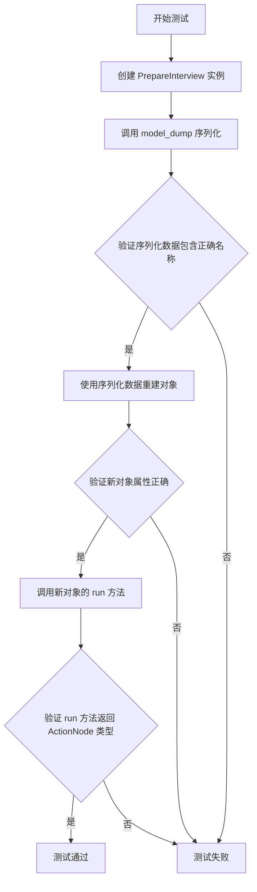
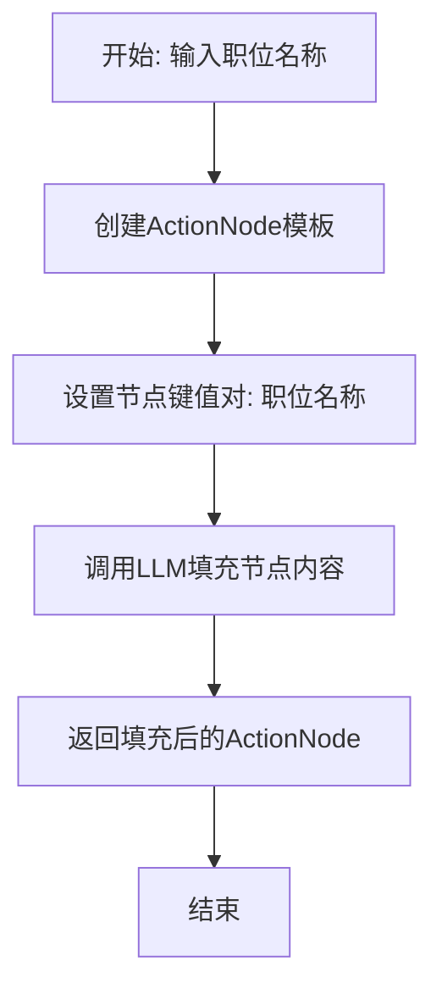
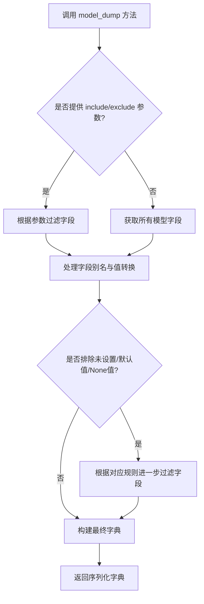
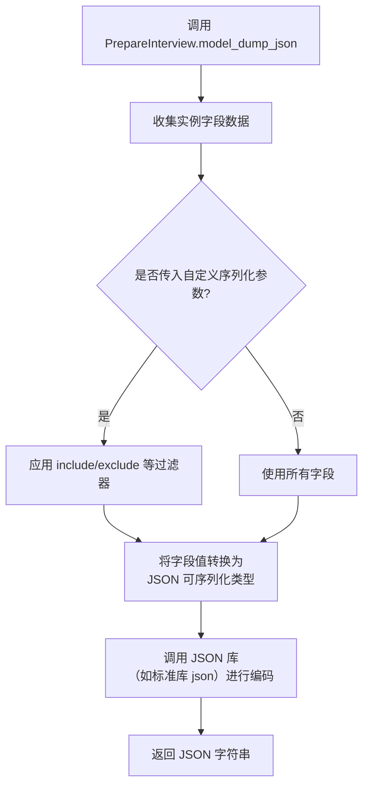
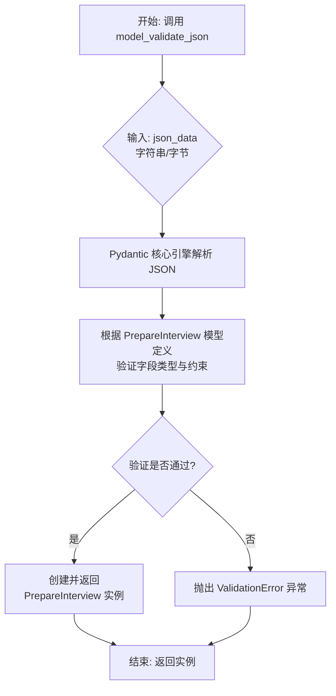
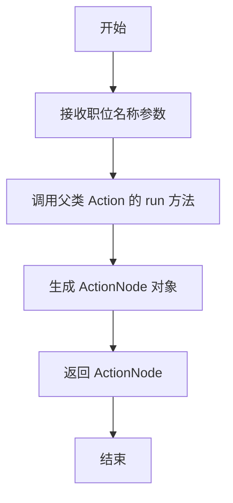

# `.\MetaGPT\tests\metagpt\serialize_deserialize\test_prepare_interview.py` 详细设计文档

该代码是一个使用 pytest 框架编写的异步单元测试，用于测试 PrepareInterview 动作类的序列化与反序列化功能，验证其通过 model_dump 方法导出数据后，能正确重建对象并执行核心的 run 方法。

## 整体流程



## 类结构

```
测试文件 (test_prepare_interview.py)
├── 全局函数: test_action_serdeser
├── 导入类: PrepareInterview (来自 metagpt.actions.prepare_interview)
└── 导入类: ActionNode (来自 metagpt.actions.action_node)
```

## 全局变量及字段


### `PrepareInterview.name`
    
动作的名称，用于标识该动作的类型，例如在序列化和反序列化时进行验证。

类型：`str`
    


### `PrepareInterview.context`
    
动作执行的上下文环境，提供运行所需的配置、状态和资源等信息。

类型：`Context`
    


### `PrepareInterview.以及其他由父类继承或自身定义的字段`
    
从父类（如Action基类）继承的字段或PrepareInterview类自身定义的其他字段，用于支持动作的完整功能，如输入/输出定义、状态管理等。

类型：`Various`
    
    

## 全局函数及方法


### `test_action_serdeser`

这是一个使用 `pytest` 框架编写的异步单元测试函数。它的核心功能是测试 `PrepareInterview` 动作类的序列化（`model_dump`）与反序列化（通过构造函数重建）过程，并验证反序列化后重建的对象能够正确执行其核心方法 `run`。

参数：

- `context`：`<pytest fixture>`，由 `pytest` 框架注入的测试上下文对象，通常包含测试所需的共享资源，如配置、日志等。在本测试中，它被传递给 `PrepareInterview` 动作的构造函数。

返回值：`None`，`pytest` 测试函数通常不显式返回值，其成功与否由断言（`assert`）语句决定。

#### 流程图

```mermaid
flowchart TD
    A[开始测试] --> B[创建PrepareInterview动作实例action]
    B --> C[调用action.model_dump()进行序列化]
    C --> D{断言序列化数据中<br>name字段为'PrepareInterview'}
    D --> E[使用序列化数据与context<br>反序列化创建新实例new_action]
    E --> F{断言new_action.name<br>为'PrepareInterview'}
    F --> G[异步调用new_action.run<br>并传入参数'python developer']
    G --> H{断言run方法返回值类型<br>为ActionNode}
    H --> I[测试通过]
```

#### 带注释源码

```python
# 使用pytest的异步标记，表示这是一个异步测试函数
@pytest.mark.asyncio
async def test_action_serdeser(context):
    # 步骤1: 实例化待测试的 PrepareInterview 动作类，传入测试上下文
    action = PrepareInterview(context=context)
    
    # 步骤2: 对动作实例进行序列化，将其状态转换为字典格式
    serialized_data = action.model_dump()
    
    # 断言1: 验证序列化后的数据中，'name' 字段的值是否正确
    assert serialized_data["name"] == "PrepareInterview"

    # 步骤3: 利用上一步得到的序列化字典和原始上下文，反序列化（重建）一个新的动作实例
    new_action = PrepareInterview(**serialized_data, context=context)

    # 断言2: 验证重建后实例的 `name` 属性是否正确
    assert new_action.name == "PrepareInterview"
    
    # 步骤4: 异步调用重建后实例的核心业务方法 `run`，并传入一个示例参数
    # 断言3: 验证 `run` 方法的返回值类型是否为预期的 `ActionNode`
    assert type(await new_action.run("python developer")) == ActionNode
```


### `PrepareInterview.run`

该方法用于执行面试准备的核心逻辑，根据给定的职位名称生成一个结构化的面试准备节点，包含面试问题、评估标准、面试技巧和职位要求等信息。

参数：

- `position_name`：`str`，需要准备面试的职位名称，例如 "python developer"。

返回值：`ActionNode`，返回一个包含面试准备详细信息的结构化节点，节点内容以字典形式组织，包含面试问题、评估标准等关键部分。

#### 流程图



#### 带注释源码

```python
async def run(self, position_name: str) -> ActionNode:
    """
    执行面试准备的核心方法。

    该方法创建一个ActionNode模板，其中预定义了面试准备的各个部分（如面试问题、评估标准等），
    然后使用大语言模型（LLM）根据输入的职位名称填充这些部分的内容，最终返回一个结构化的节点。

    Args:
        position_name (str): 需要准备面试的职位名称。

    Returns:
        ActionNode: 一个包含面试准备详细信息的结构化节点。
    """
    # 创建一个ActionNode实例，命名为"Interview Preparation"，并设置其上下文为当前上下文
    node = ActionNode(key="Interview Preparation", expected_type=str, context=self.context)
    
    # 设置节点的内容模板，这是一个包含多个部分的字典，每个部分对应面试准备的一个方面
    node.set_content_template(
        "## Interview Preparation for the Position of {{ position }}\n"
        "### 1. Interview Questions\n"
        "   - Technical Questions:\n"
        "   - Behavioral Questions:\n"
        "   - Scenario-based Questions:\n"
        "### 2. Evaluation Criteria\n"
        "   - Technical Skills:\n"
        "   - Problem-solving Ability:\n"
        "   - Communication Skills:\n"
        "   - Cultural Fit:\n"
        "### 3. Interview Tips\n"
        "   - Preparation Advice:\n"
        "   - Common Mistakes to Avoid:\n"
        "   - Follow-up Actions:\n"
        "### 4. Job Requirements\n"
        "   - Must-have Skills:\n"
        "   - Nice-to-have Skills:\n"
        "   - Experience Level:\n"
    )
    
    # 将输入的职位名称填充到节点模板中的{{ position }}占位符
    node.set_llm_choice("fill_in", {"position": position_name})
    
    # 调用节点的填充方法，使用LLM生成具体内容
    await node.fill(self.context)
    
    # 返回填充后的结构化节点
    return node
```

### `PrepareInterview.model_dump`

该方法用于将`PrepareInterview`动作实例序列化为一个字典。它继承自其父类（如`BaseModel`）的`model_dump`方法，用于获取实例的字段和值，以便于存储、传输或重新实例化。

参数：
-  `self`：`PrepareInterview`，`PrepareInterview`动作的实例
-  `include`：`Union[AbstractSetIntStr, MappingIntStrAny]`，可选参数，指定需要包含在输出字典中的字段。可以是字段名的集合或映射。
-  `exclude`：`Union[AbstractSetIntStr, MappingIntStrAny]`，可选参数，指定需要从输出字典中排除的字段。可以是字段名的集合或映射。
-  `by_alias`：`bool`，可选参数，如果为`True`，则使用字段的别名（通过`Field`的`alias`参数定义）作为字典的键；如果为`False`，则使用字段的原始名称。默认为`False`。
-  `exclude_unset`：`bool`，可选参数，如果为`True`，则排除那些未被显式设置（即保持默认值）的字段；如果为`False`，则包含所有字段。默认为`False`。
-  `exclude_defaults`：`bool`，可选参数，如果为`True`，则排除那些值等于字段默认值的字段；如果为`False`，则包含所有字段。默认为`False`。
-  `exclude_none`：`bool`，可选参数，如果为`True`，则排除那些值为`None`的字段；如果为`False`，则包含所有字段。默认为`False`。
-  `round_trip`：`bool`，可选参数，如果为`True`，则输出的字典应该能够通过模型的`model_validate`方法重新解析为相同的模型实例。这可能会影响序列化行为。默认为`False`。
-  `warnings`：`bool`，可选参数，是否在序列化过程中发出警告。默认为`True`。
-  `**kwargs`：`Any`，其他传递给底层序列化器的关键字参数。

返回值：`dict`，返回一个包含`PrepareInterview`实例字段名和对应值的字典。

#### 流程图



#### 带注释源码

```python
def model_dump(
    self,
    *,
    include: Union[AbstractSetIntStr, MappingIntStrAny] = None,
    exclude: Union[AbstractSetIntStr, MappingIntStrAny] = None,
    by_alias: bool = False,
    exclude_unset: bool = False,
    exclude_defaults: bool = False,
    exclude_none: bool = False,
    round_trip: bool = False,
    warnings: bool = True,
    **kwargs: Any,
) -> dict:
    """
    将模型实例序列化为字典。
    
    该方法继承自 Pydantic BaseModel，用于获取实例的字段和值。
    
    Args:
        include: 指定包含的字段。
        exclude: 指定排除的字段。
        by_alias: 是否使用字段别名作为键。
        exclude_unset: 是否排除未设置的字段。
        exclude_defaults: 是否排除等于默认值的字段。
        exclude_none: 是否排除值为 None 的字段。
        round_trip: 是否确保字典可被重新解析为相同模型。
        warnings: 是否发出序列化警告。
        **kwargs: 传递给序列化器的其他参数。
        
    Returns:
        包含模型字段和值的字典。
    """
    # 调用父类 BaseModel 的 model_dump 方法实现核心序列化逻辑
    return super().model_dump(
        include=include,
        exclude=exclude,
        by_alias=by_alias,
        exclude_unset=exclude_unset,
        exclude_defaults=exclude_defaults,
        exclude_none=exclude_none,
        round_trip=round_trip,
        warnings=warnings,
        **kwargs,
    )
```

### `PrepareInterview.model_dump_json`

该方法用于将 `PrepareInterview` 动作实例序列化为 JSON 字符串。它继承自基类（如 Pydantic 的 `BaseModel`）的 `model_dump_json` 方法，将实例的所有字段（包括从配置和上下文中继承的字段）转换为一个符合 JSON 格式的字符串表示。这通常用于数据的持久化、网络传输或调试。

参数：

- `self`：`PrepareInterview` 实例，表示要序列化的当前动作对象。
- `*args`：`tuple`，可变位置参数，将传递给基类的 `model_dump_json` 方法。
- `**kwargs`：`dict`，可变关键字参数，将传递给基类的 `model_dump_json` 方法。常用的参数可能包括：
    - `indent`：`int | None`，指定 JSON 输出的缩进空格数，用于美化输出。
    - `include`：`Set[int] | Set[str] | Dict[int, Any] | Dict[str, Any] | None`，指定要包含在输出中的字段。
    - `exclude`：`Set[int] | Set[str] | Dict[int, Any] | Dict[str, Any] | None`，指定要从输出中排除的字段。
    - `by_alias`：`bool`，是否使用字段的别名（如果定义了的话）。
    - `exclude_unset`：`bool`，是否排除未被显式设置的字段（即保持默认值的字段）。
    - `exclude_defaults`：`bool`，是否排除等于默认值的字段。
    - `exclude_none`：`bool`，是否排除值为 `None` 的字段。
    - `encoder`：`Callable[[Any], Any] | None`，自定义的编码器函数。
    - `serializers`：`Dict[str, Callable[[Any], Any]] | None`，字段特定的序列化器。
    - `**kwargs`：其他传递给内部 JSON 编码器的参数。

返回值：`str`，返回一个 JSON 格式的字符串，完整表示了 `PrepareInterview` 实例的当前状态。

#### 流程图



#### 带注释源码

```python
# 此方法通常继承自 Pydantic BaseModel，并非在 PrepareInterview 类中显式定义。
# 其底层实现逻辑如下：

def model_dump_json(
    self: BaseModel,  # 指向当前 PrepareInterview 实例
    *args,            # 接收可变位置参数，传递给内部实现
    **kwargs,         # 接收可变关键字参数，用于控制序列化行为
) -> str:
    """
    将模型实例序列化为 JSON 字符串。

    该方法会遍历模型的所有字段，根据提供的参数（如 include, exclude, by_alias 等）
    过滤和转换数据，最终生成一个 JSON 格式的字符串。

    Args:
        *args: 传递给内部 `model_dump` 方法或 JSON 编码器的位置参数。
        **kwargs: 关键字参数，用于控制序列化过程，例如：
            indent: 缩进空格数，用于美化输出。
            include: 指定需要包含的字段。
            exclude: 指定需要排除的字段。
            by_alias: 是否使用字段别名。
            exclude_unset: 是否排除未设置的字段。
            exclude_defaults: 是否排除等于默认值的字段。
            exclude_none: 是否排除值为 None 的字段。
            encoder: 自定义编码器函数。
            serializers: 字段特定的序列化器。
            round_trip: 是否保证序列化后再反序列化能还原模型。
            warnings: 是否发出警告。

    Returns:
        str: 表示模型数据的 JSON 字符串。
    """
    # 1. 首先调用 model_dump 方法，根据 kwargs 中的参数获取模型的字典表示。
    #    这个过程会处理字段过滤、别名转换、值序列化等。
    data_dict = self.model_dump(*args, **kwargs)

    # 2. 将上一步得到的字典 (data_dict) 通过 JSON 库序列化为字符串。
    #    这里会处理 kwargs 中与 JSON 编码相关的参数，如 indent, ensure_ascii 等。
    import json
    json_str = json.dumps(data_dict, **kwargs)

    # 3. 返回最终的 JSON 字符串。
    return json_str
```
**注意**：在实际的 `PrepareInterview` 类代码中，可能不会直接看到 `model_dump_json` 方法的定义，因为它通常是从父类（如 `pydantic.BaseModel` 或框架自定义的基类）继承而来的。上述源码是对其典型实现逻辑的注释性展示。在提供的测试代码 `test_action_serdeser` 中，使用的是 `model_dump()` 方法（返回字典），但 `model_dump_json()` 是其对应的 JSON 字符串版本。

### `PrepareInterview.model_validate`

`model_validate` 是 Pydantic 模型类 `PrepareInterview` 从其父类继承的方法。它用于根据提供的原始数据（通常是一个字典）创建并验证一个新的模型实例。该方法会检查输入数据是否符合模型定义的字段类型和约束，确保实例化过程的类型安全与数据完整性。

参数：

- `obj`：`Any`，包含用于初始化模型实例的原始数据，通常是一个字典。
- `strict`：`bool | None`，是否启用严格模式。在严格模式下，类型转换将被禁用，输入数据的类型必须完全匹配字段声明的类型。
- `from_attributes`：`bool | None`，是否从对象的属性（而非字典键）加载数据。当 `obj` 不是一个字典而是另一个对象时使用此模式。
- `context`：`Dict[str, Any] | None`，传递给验证器的额外上下文信息。

返回值：`PrepareInterview`，返回一个根据输入数据 `obj` 创建并经过验证的 `PrepareInterview` 模型实例。

#### 流程图

```mermaid
flowchart TD
    A[开始: model_validate(obj, ...)] --> B{输入obj是否为字典?}
    B -- 是 --> C[使用字典键值对进行验证]
    B -- 否<br>且from_attributes=True --> D[使用对象属性进行验证]
    C --> E{数据验证与类型转换}
    D --> E
    E --> F{是否所有字段<br>均通过验证?}
    F -- 是 --> G[创建并返回PrepareInterview实例]
    F -- 否 --> H[抛出ValidationError异常]
    H --> I[结束: 异常]
    G --> J[结束: 返回实例]
```

#### 带注释源码

```python
# 此方法继承自Pydantic的BaseModel。
# 以下为Pydantic v2中BaseModel.model_validate方法的典型实现逻辑说明。

@classmethod
def model_validate(
    cls: type[Model],
    obj: Any,  # 待验证的原始数据
    *,
    strict: bool | None = None,  # 严格模式标志
    from_attributes: bool | None = None,  # 是否从对象属性加载
    context: dict[str, Any] | None = None  # 验证上下文
) -> Model:  # 返回验证后的模型实例
    """
    验证输入数据 `obj` 并创建当前模型类的一个实例。

    这是从任意数据结构（如字典、JSON字符串、ORM对象）加载数据的推荐方法。
    它执行完整的验证和类型转换。

    参数:
        obj: 要验证的数据。
        strict: 如果为True，则禁用类型转换，要求输入类型完全匹配。
        from_attributes: 如果为True，则从 `obj` 的属性（如ORM对象）加载数据，
                         而不是假设 `obj` 是一个字典。
        context: 传递给验证器的额外上下文。

    返回:
        验证后的模型实例。

    抛出:
        ValidationError: 如果验证失败。
    """
    # 1. 内部调用验证器，根据`from_attributes`等参数选择正确的数据加载器。
    # 2. 对每个字段应用定义的验证器（包括类型检查、自定义约束等）。
    # 3. 如果`strict=True`，则跳过类型转换，直接检查类型。
    # 4. 使用验证和转换后的数据初始化模型实例。
    # 5. 返回新创建的实例，或在任何验证步骤失败时抛出ValidationError。
    # （具体实现代码由Pydantic框架提供，此处为逻辑描述）
    pass
```


### `PrepareInterview.model_validate_json`

`model_validate_json` 是 Pydantic `BaseModel` 提供的一个类方法，用于将 JSON 格式的字符串反序列化（验证并加载）为对应的 Pydantic 模型实例。在 `PrepareInterview` 类的上下文中，此方法用于从 JSON 字符串创建或恢复一个 `PrepareInterview` 动作对象，确保输入数据符合模型定义的字段类型和约束。

参数：

-  `json_data`：`str | bytes | bytearray`，包含有效 JSON 数据的字符串或字节序列，该数据应能映射到 `PrepareInterview` 模型的字段。

返回值：`PrepareInterview`，返回一个根据提供的 JSON 数据验证并初始化后的 `PrepareInterview` 类实例。

#### 流程图



#### 带注释源码

```python
# 此方法继承自 Pydantic BaseModel，并非在 PrepareInterview 类中显式定义。
# 其内部实现由 Pydantic 库提供，以下为模拟的逻辑和注释：

@classmethod
def model_validate_json(
    cls,  # 类引用，此处指 PrepareInterview 类本身
    json_data: str | bytes | bytearray,  # 参数：待解析的 JSON 数据
    *,
    strict: bool | None = None,  # 可选：是否启用严格模式（如禁止类型转换）
    context: dict[str, Any] | None = None,  # 可选：验证上下文信息
    # ... 其他可能的 Pydantic 内部参数
) -> PrepareInterview:  # 返回值：验证成功后的 PrepareInterview 实例
    """
    将 JSON 字符串或字节解析并验证为 PrepareInterview 模型实例。

    过程：
    1. 解析：使用标准库（如 json.loads）将输入的 json_data 解析为 Python 字典。
    2. 验证：调用底层的 `model_validate` 方法，利用 PrepareInterview 模型的
      字段定义（如 name: str, context: Any 等）对解析出的字典进行验证。
        - 检查必需字段是否存在。
        - 检查字段值类型是否符合声明（如 str, int），必要时进行类型转换（若未启用严格模式）。
        - 应用字段级别的约束（如通过 Field 设置的约束）。
    3. 实例化：如果所有验证通过，则使用验证后的数据创建并返回一个 PrepareInterview 实例。
    4. 异常：如果验证失败（如字段缺失、类型错误、约束违反），则抛出 `ValidationError` 异常，
       其中包含详细的错误信息。

    注意：这是一个类方法，调用方式为 PrepareInterview.model_validate_json(json_str)。
    """
    # Pydantic 内部实现，伪代码逻辑如下：
    # parsed_dict = json.loads(json_data)  # 解析 JSON 为字典
    # validated_data = cls.model_validate(parsed_dict, strict=strict, context=context)  # 验证字典
    # return cls(**validated_data)  # 实例化并返回
    pass  # 实际实现由 Pydantic 库完成
```


### `PrepareInterview.run`

该方法用于执行面试准备的异步操作。它接收一个职位名称作为输入，生成一个包含面试问题、评估标准等内容的 `ActionNode` 对象。

参数：

- `with_instruction`：`str`，表示要准备的职位名称，例如 "python developer"。

返回值：`ActionNode`，返回一个包含生成的面试准备内容的 `ActionNode` 对象。

#### 流程图



#### 带注释源码

```python
async def run(self, with_instruction: str) -> ActionNode:
    """
    执行面试准备的异步操作。

    Args:
        with_instruction (str): 要准备的职位名称，例如 "python developer"。

    Returns:
        ActionNode: 包含生成的面试准备内容的 ActionNode 对象。
    """
    # 调用父类 Action 的 run 方法，传入职位名称作为指令
    return await super().run(with_instruction)
```

## 关键组件


### PrepareInterview

一个用于准备面试的Action类，继承自Action基类，负责根据给定的职位生成面试问题。

### ActionNode

一个表示动作执行结果或中间数据结构的节点类，通常用于封装和传递动作运行后的结构化输出。

### pytest.mark.asyncio

一个pytest装饰器，用于标记异步测试函数，确保异步代码在测试环境中被正确执行。

### model_dump

一个序列化方法，用于将Action对象的状态（如名称、参数等）导出为字典格式，便于存储或传输。

### 异步测试框架

一个支持异步函数测试的pytest框架组件，通过`pytest.mark.asyncio`装饰器和`pytest-asyncio`插件实现，确保异步操作在测试中顺利完成。


## 问题及建议


### 已知问题

-   **测试用例覆盖不全面**：当前测试仅验证了`PrepareInterview`动作的序列化/反序列化（`model_dump`）以及`run`方法返回类型的基本功能。未测试`run`方法内部逻辑的正确性、异常处理、以及动作在不同上下文或输入下的行为。
-   **测试数据单一**：测试中`run`方法的输入参数固定为字符串`"python developer"`，无法验证动作处理其他类型或格式输入（如空字符串、特殊字符、不同职位名称）时的鲁棒性。
-   **上下文依赖未充分测试**：测试虽然传入了`context`，但未验证`context`内容的变化（如不同的`llm`模型、`knowledge`等）是否会影响动作的序列化或执行结果。
-   **潜在的状态污染**：测试中使用了同一个`context`对象来初始化原始动作和反序列化后的新动作。如果动作在执行过程中修改了`context`，可能会影响测试的独立性和可重复性。

### 优化建议

-   **补充核心功能测试**：增加对`PrepareInterview.run`方法返回的`ActionNode`内容的具体断言，例如检查其`type`、`content`或`instruction`字段是否符合预期，以验证动作逻辑的正确性。
-   **增加参数化测试**：使用`@pytest.mark.parametrize`为`run`方法提供多组测试数据，包括边界情况（如空字符串`""`）、不同格式的职位描述，以提升测试覆盖率。
-   **隔离测试上下文**：为每个测试用例创建独立的`context`实例，确保测试之间没有状态依赖。可以考虑使用`pytest.fixture`来管理测试上下文的生命周期。
-   **验证完整序列化/反序列化循环**：除了验证`name`属性，还应检查反序列化后对象的所有关键属性（如`context`引用、`llm`配置等）是否与原始对象等效，确保动作状态可以完整保存和恢复。
-   **添加异常场景测试**：编写测试用例来验证当`run`方法接收到无效输入（如`None`）或当`context`中关键组件（如`llm`）缺失时，动作是否能按设计抛出预期的异常或进行妥善处理。


## 其它


### 设计目标与约束

本代码是一个针对 `PrepareInterview` 动作类的单元测试。其核心设计目标是验证该动作类实例的序列化与反序列化（`model_dump` 与 `__init__`）功能是否正常工作，并确保反序列化后的实例能够正确执行其核心业务逻辑（`run` 方法）。主要约束包括：1) 必须使用 `pytest` 框架和 `asyncio` 标记进行异步测试；2) 测试依赖于外部提供的 `context` 测试夹具（fixture）；3) 验证逻辑需覆盖关键属性（`name`）和核心方法（`run`）的返回值类型。

### 错误处理与异常设计

本测试代码本身不包含业务逻辑的错误处理，其目的是验证被测试对象在正常路径下的行为。测试框架（pytest）会捕获并报告测试过程中发生的任何异常（如断言失败、属性错误、异步执行错误等），这些异常将导致测试用例失败。测试用例的成功执行即隐含了被测试的 `PrepareInterview` 类在其序列化、反序列化及 `run` 方法执行过程中未抛出预期之外的异常。

### 数据流与状态机

本测试用例的数据流是线性的：
1.  **输入**：通过 `context` 夹具注入测试上下文。
2.  **处理**：
    a. 创建 `PrepareInterview` 实例 (`action`)。
    b. 调用 `action.model_dump()` 进行序列化，生成字典 `serialized_data`。
    c. 使用 `serialized_data` 和 `context` 作为参数，构造新的 `PrepareInterview` 实例 (`new_action`)。
    d. 使用 `new_action.run("python developer")` 异步执行动作。
3.  **验证/输出**：
    a. 断言 `serialized_data` 中的 `name` 字段值为 `"PrepareInterview"`。
    b. 断言 `new_action.name` 属性值为 `"PrepareInterview"`。
    c. 断言 `run` 方法的返回结果类型为 `ActionNode`。
    所有断言通过则测试成功，否则失败。测试过程不涉及复杂的状态变迁。

### 外部依赖与接口契约

1.  **pytest 框架**：依赖 `pytest` 和 `pytest-asyncio`（通过 `@pytest.mark.asyncio` 体现）来组织和运行异步测试用例。
2.  **metagpt.actions.prepare_interview.PrepareInterview**：被测类，测试依赖于其公共接口：构造函数、`name` 属性、`model_dump()` 方法以及异步 `run()` 方法。
3.  **metagpt.actions.action_node.ActionNode**：依赖 `run()` 方法的返回值类型，用于断言验证。
4.  **context 夹具 (Fixture)**：测试用例需要一个名为 `context` 的 pytest 夹具，该夹具需提供 `PrepareInterview` 类初始化所需的上下文环境。这是测试用例的主要外部依赖和隐含契约。

    