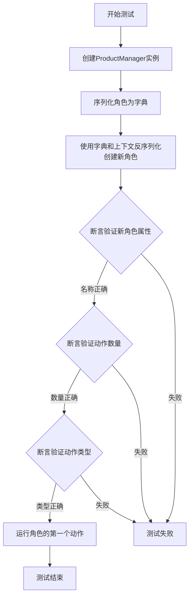
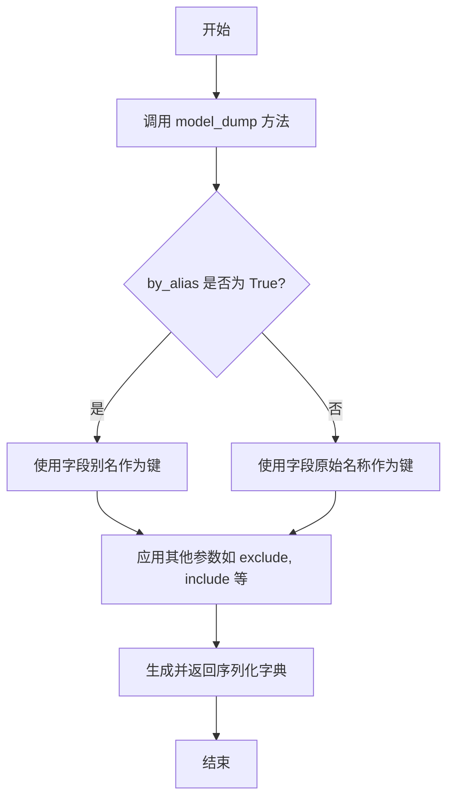
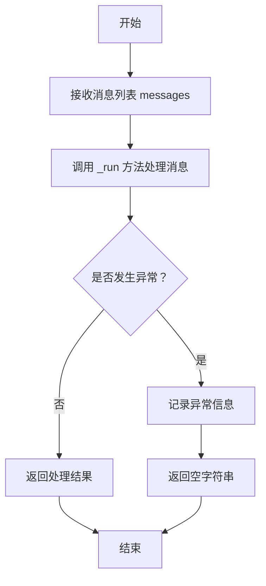

# `.\MetaGPT\tests\metagpt\serialize_deserialize\test_product_manager.py` 详细设计文档

该代码是一个使用pytest框架编写的异步测试函数，用于测试ProductManager角色的序列化与反序列化功能，验证角色在序列化后重建时能保持其属性（如名称、动作列表）的完整性，并能正常执行其动作。

## 整体流程



## 类结构

```
ProductManager (被测试角色类)
├── 继承自: (未在代码中显示，推测为Role基类)
│   ├── 属性: name, actions, context等
│   └── 方法: model_dump等
├── Action (动作类)
│   └── 方法: run
└── Message (消息类)
    └── 属性: content
```

## 全局变量及字段


### `new_filename`
    
用于测试的文件名参数，由pytest fixture提供

类型：`pytest fixture`
    


### `context`
    
用于测试的上下文参数，由pytest fixture提供

类型：`pytest fixture`
    


### `role`
    
初始化的ProductManager角色实例

类型：`ProductManager`
    


### `ser_role_dict`
    
通过model_dump方法序列化后的角色字典

类型：`dict`
    


### `new_role`
    
通过反序列化字典重新构建的ProductManager角色实例

类型：`ProductManager`
    


### `ProductManager.name`
    
ProductManager角色的名称，默认为'Alice'

类型：`str`
    


### `ProductManager.actions`
    
ProductManager角色可执行的动作列表

类型：`list[Action]`
    


### `ProductManager.context`
    
ProductManager角色的运行上下文环境

类型：`object`
    


### `Message.content`
    
Message对象的内容字段，用于存储消息文本

类型：`str`
    
    

## 全局函数及方法

### `test_product_manager_serdeser`

该函数是一个异步测试函数，用于验证`ProductManager`角色的序列化与反序列化功能。它首先创建一个`ProductManager`实例，将其序列化为字典，然后通过字典反序列化创建一个新实例。测试验证新实例的属性与原始实例一致，并确保反序列化后的`Action`对象能正常运行。

参数：

- `new_filename`：`pytest fixture`，用于生成临时文件名，但在此测试中未直接使用。
- `context`：`pytest fixture`，提供测试上下文环境，用于初始化`ProductManager`。

返回值：`None`，无返回值，仅执行断言验证。

#### 流程图

```mermaid
graph TD
    A[开始测试] --> B[创建ProductManager实例role]
    B --> C[序列化role为字典ser_role_dict]
    C --> D[反序列化字典创建新实例new_role]
    D --> E[断言验证new_role.name]
    E --> F[断言验证new_role.actions数量]
    F --> G[断言验证new_role.actions[0]类型]
    G --> H[异步运行new_role.actions[0]]
    H --> I[测试结束]
```

#### 带注释源码

```python
@pytest.mark.asyncio  # 标记为异步测试函数
async def test_product_manager_serdeser(new_filename, context):
    # 创建ProductManager实例，传入上下文
    role = ProductManager(context=context)
    
    # 将role实例序列化为字典，使用别名模式
    ser_role_dict = role.model_dump(by_alias=True)
    
    # 通过反序列化字典创建新的ProductManager实例，传入上下文
    new_role = ProductManager(**ser_role_dict, context=context)

    # 断言验证新实例的名称为"Alice"
    assert new_role.name == "Alice"
    # 断言验证新实例的actions列表长度为2
    assert len(new_role.actions) == 2
    # 断言验证新实例的第一个action是Action类型
    assert isinstance(new_role.actions[0], Action)
    
    # 异步运行新实例的第一个action，传入消息内容
    await new_role.actions[0].run([Message(content="write a cli snake game")])
```

### `ProductManager.model_dump`

该方法用于将`ProductManager`角色实例序列化为一个字典，支持通过别名进行字段映射，便于后续的持久化存储或网络传输。

参数：

- `by_alias`：`bool`，如果为True，则使用字段的别名作为字典的键；如果为False，则使用字段的原始名称。默认为False。
- `exclude`：`Union[AbstractSetIntStr, MappingIntStrAny]`，指定要从输出中排除的字段集合或映射。
- `include`：`Union[AbstractSetIntStr, MappingIntStrAny]`，指定要包含在输出中的字段集合或映射。
- `context`：`Any`，传递给序列化器的上下文。
- `exclude_unset`：`bool`，如果为True，则排除未设置的字段（即保持默认值的字段）。
- `exclude_defaults`：`bool`，如果为True，则排除等于默认值的字段。
- `exclude_none`：`bool`，如果为True，则排除值为None的字段。
- `round_trip`：`bool`，如果为True，则序列化输出应能够反序列化回相同的模型。
- `warnings`：`Union[bool, Literal['none', 'warn', 'error']]`，控制是否发出警告。
- `serialize_as_any`：`bool`，如果为True，则字段按其声明的类型序列化，而不考虑子类。

返回值：`dict`，包含`ProductManager`实例序列化后的字段名和值的字典。

#### 流程图



#### 带注释源码

```
def model_dump(
    self,
    *,
    by_alias: bool = False,  # 是否使用字段别名作为键
    exclude: Union[AbstractSetIntStr, MappingIntStrAny] = None,  # 排除的字段
    include: Union[AbstractSetIntStr, MappingIntStrAny] = None,  # 包含的字段
    context: Any = None,  # 序列化上下文
    exclude_unset: bool = False,  # 排除未设置的字段
    exclude_defaults: bool = False,  # 排除等于默认值的字段
    exclude_none: bool = False,  # 排除值为None的字段
    round_trip: bool = False,  # 是否支持往返序列化
    warnings: Union[bool, Literal['none', 'warn', 'error']] = True,  # 警告控制
    serialize_as_any: bool = False,  # 是否按声明类型序列化
) -> dict:
    """
    将模型实例序列化为字典。
    
    参数:
        by_alias: 是否使用字段别名作为字典键。
        exclude: 指定要从输出中排除的字段。
        include: 指定要包含在输出中的字段。
        context: 传递给序列化器的上下文。
        exclude_unset: 是否排除未设置的字段。
        exclude_defaults: 是否排除等于默认值的字段。
        exclude_none: 是否排除值为None的字段。
        round_trip: 序列化输出是否应能反序列化回相同模型。
        warnings: 控制是否发出警告。
        serialize_as_any: 是否按字段声明类型序列化。
    
    返回:
        包含序列化字段名和值的字典。
    """
    # 调用父类（BaseModel）的model_dump方法实现序列化
    return super().model_dump(
        by_alias=by_alias,
        exclude=exclude,
        include=include,
        context=context,
        exclude_unset=exclude_unset,
        exclude_defaults=exclude_defaults,
        exclude_none=exclude_none,
        round_trip=round_trip,
        warnings=warnings,
        serialize_as_any=serialize_as_any,
    )
```

### `Action.run`

该方法用于执行一个具体的动作，接收消息列表作为输入，并返回一个字符串作为执行结果。它通过调用 `_run` 方法来实现具体的业务逻辑，并处理可能的异常情况。

参数：

- `messages`：`List[Message]`，包含执行动作所需信息的消息列表。

返回值：`str`，动作执行的结果字符串。

#### 流程图



#### 带注释源码

```python
async def run(self, *args, **kwargs) -> Any:
    """
    执行动作的主要方法，调用 _run 方法并处理异常。

    Args:
        *args: 可变位置参数，传递给 _run 方法。
        **kwargs: 可变关键字参数，传递给 _run 方法。

    Returns:
        Any: 动作执行的结果，如果发生异常则返回空字符串。
    """
    try:
        # 调用 _run 方法执行具体的业务逻辑
        return await self._run(*args, **kwargs)
    except Exception as e:
        # 记录异常信息，便于调试和错误追踪
        logger.exception(f"{self.__class__.__name__}.run 错误: {e}")
        # 发生异常时返回空字符串，避免程序崩溃
        return ""
```

## 关键组件


### ProductManager

ProductManager 是一个角色类，负责产品管理相关的职责，包括定义产品需求和规划产品路线图。

### Action

Action 是一个动作基类，定义了角色可以执行的具体操作，如运行特定任务或处理消息。

### Message

Message 是一个消息类，用于在角色之间传递信息，包含消息内容和其他相关属性。

### pytest.mark.asyncio

pytest.mark.asyncio 是一个测试装饰器，用于标记异步测试函数，确保测试在异步环境中正确运行。

### context

context 是一个上下文对象，提供了角色运行所需的环境信息和配置，如共享状态和资源。

### serdeser (序列化与反序列化)

serdeser 指的是序列化与反序列化过程，用于将对象转换为可存储或传输的格式（如字典），并重新构建为对象。


## 问题及建议


### 已知问题

-   **测试用例名称不明确**：测试函数名`test_product_manager_serdeser`中的`serdeser`缩写不够直观，不利于快速理解测试目的（序列化与反序列化）。
-   **测试数据硬编码**：测试中断言了角色名称为固定的`"Alice"`，这依赖于`ProductManager`类的默认配置。如果默认配置发生变更，此测试将失败，降低了测试的健壮性和可维护性。
-   **测试逻辑耦合度高**：测试在验证反序列化功能的同时，还执行了`Action.run`方法。这违反了单元测试的单一职责原则，使得测试目的不纯粹，且在`Action.run`失败时难以区分是序列化问题还是`Action`执行问题。
-   **缺少关键属性验证**：测试仅验证了`name`和`actions`的部分属性，对于序列化/反序列化过程是否完整保留了角色的所有关键状态（如`profile`, `goal`, `constraints`等）缺乏验证。
-   **异步测试标记冗余**：函数已使用`@pytest.mark.asyncio`装饰器，但同时也使用了`pytest.mark.asyncio`标记，在最新版本的pytest-asyncio中可能造成冗余或冲突。

### 优化建议

-   **重命名测试函数**：将`test_product_manager_serdeser`更名为更清晰的`test_product_manager_serialization_deserialization`或`test_serde`。
-   **解耦测试逻辑**：
    -   将序列化/反序列化的验证与`Action`执行的验证分离为两个独立的测试函数。
    -   在序列化测试中，专注于比较原始对象与反序列化后对象的字段一致性，可使用`role.model_dump()`与`new_role.model_dump()`进行深度比较。
-   **使用明确的测试数据**：在测试中显式地创建并配置`ProductManager`对象，为其设置特定的、非默认的`name`、`goal`等属性值，然后验证这些属性在序列化前后保持一致，避免依赖默认值。
-   **扩展断言范围**：在序列化测试中，增加对角色其他重要状态字段（如`profile`, `goal`, `constraints`）的断言，确保状态完整保留。
-   **清理测试标记**：移除`@pytest.mark.asyncio`装饰器或`pytest.mark.asyncio`标记中的其中一个，遵循项目约定的单一方式。
-   **考虑增加异常场景测试**：补充测试用例，例如测试反序列化无效数据时的错误处理。


## 其它


### 设计目标与约束

本测试代码的设计目标是验证 `ProductManager` 角色的序列化与反序列化功能，确保其核心属性（如名称、持有的 `Action` 对象）在序列化/反序列化后保持一致，并且反序列化后的 `Action` 对象功能正常。主要约束包括：1) 依赖 `pytest` 框架进行异步测试；2) 测试数据（如 `new_filename`, `context`）由外部 `fixture` 提供；3) 测试需验证反序列化后 `Action` 对象的可执行性。

### 错误处理与异常设计

测试代码本身不包含显式的业务逻辑错误处理，其正确性依赖于 `pytest` 框架的断言机制。如果序列化/反序列化过程失败、属性不匹配或 `Action.run` 方法执行异常，测试将失败并抛出相应的 `AssertionError` 或运行时异常，从而指示功能缺陷。这是一种通过测试失败来暴露问题的设计。

### 数据流与状态机

1.  **数据流**：测试流程始于外部 `fixture` 提供的 `new_filename` 和 `context` 数据。`context` 用于初始化 `ProductManager` 实例（`role`）。该实例被序列化为字典（`ser_role_dict`），此字典作为输入，结合 `context` 反序列化生成新实例（`new_role`）。最后，`Message` 对象作为输入触发 `new_role` 中 `Action` 的执行。
2.  **状态机**：本测试不涉及复杂的状态转换。它验证的是对象从“初始状态”到“序列化状态”（字典），再回到“反序列化状态”（新对象）的转换过程，并确保关键状态（属性值、行为）在转换后保持不变。

### 外部依赖与接口契约

1.  **外部依赖**：
    *   `pytest` 及 `pytest.mark.asyncio`：测试框架和异步支持。
    *   `metagpt.roles.product_manager.ProductManager`：被测角色类。
    *   `metagpt.actions.action.Action`：角色持有的动作基类。
    *   `metagpt.schema.Message`：消息类，作为 `Action.run` 的输入。
    *   `new_filename` 和 `context` `fixture`：提供测试所需的上下文和可能的环境配置。
2.  **接口契约**：
    *   `ProductManager.model_dump(by_alias=True)`：应返回一个可序列化的字典。
    *   `ProductManager(**ser_role_dict, context=context)`：应能使用序列化字典和上下文成功构造新实例。
    *   `Action.run([Message(...)])`：应能异步执行并处理传入的 `Message` 列表。

### 测试策略与覆盖范围

本测试采用**集成测试**策略，聚焦于 `ProductManager` 对象的序列化/反序列化生命周期及其与核心组件（`Action`）的集成。覆盖范围包括：1) 对象属性的序列化与恢复（名称、`actions` 列表）；2) 反序列化后 `Action` 实例的类型正确性；3) 反序列化后 `Action` 业务功能（`run` 方法）的基本可执行性。它未覆盖 `Action.run` 的具体业务逻辑正确性、异常场景下的序列化行为，或 `ProductManager` 其他方法的测试。

### 安全性与合规性考虑

此单元测试代码不直接涉及用户数据、网络通信或持久化存储，因此主要的安全与合规性考虑在于其依赖项（`metagpt` 框架）的安全性。测试本身应确保不引入恶意代码或依赖不安全的第三方包。代码中无硬编码的敏感信息（如密钥），测试数据通过安全的 `fixture` 机制管理。

    