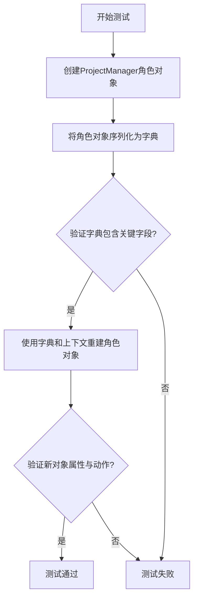
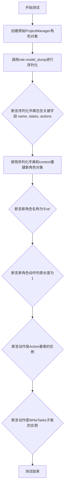
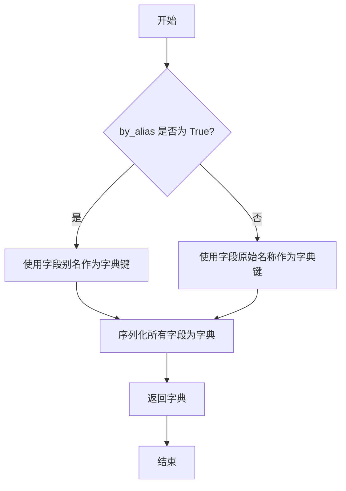
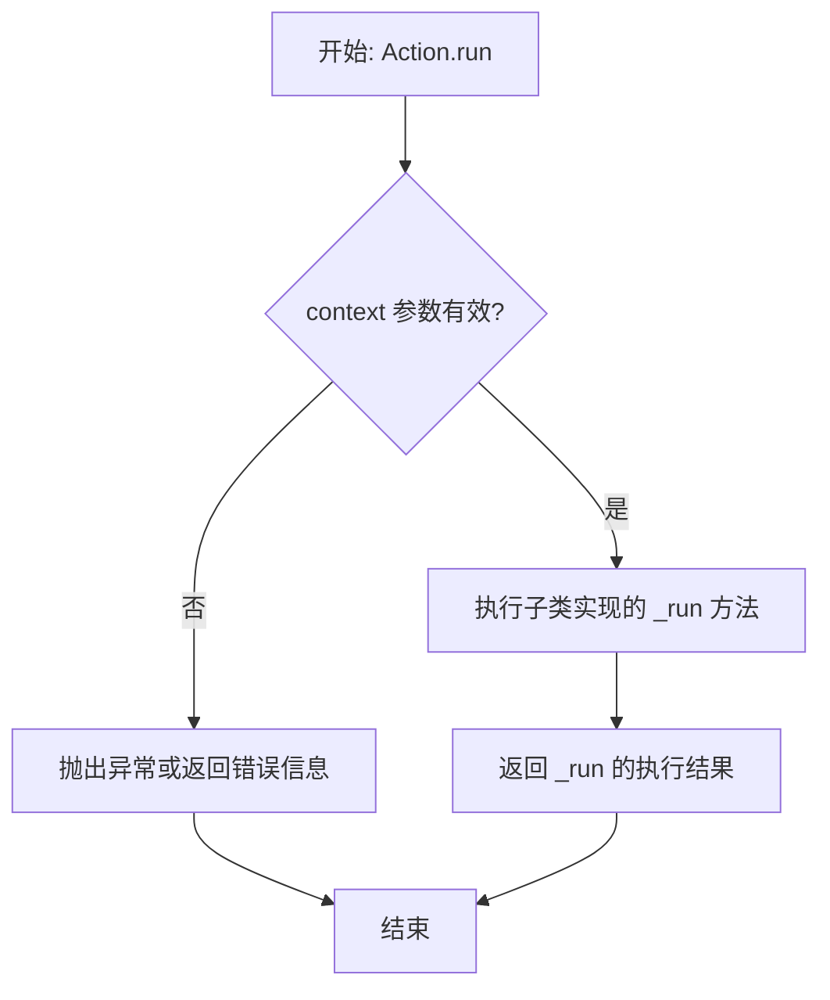

# `.\MetaGPT\tests\metagpt\serialize_deserialize\test_project_manager.py` 详细设计文档

该代码是一个针对ProjectManager角色的序列化与反序列化功能的单元测试，用于验证角色对象在转换为字典格式后，能够正确地从字典数据重建为功能完整的对象，并确保其核心属性（如名称、状态、动作）和动作类型的一致性。

## 整体流程



## 类结构

```
ProjectManager (被测试角色类)
├── 继承自: Role (元角色基类)
└── 包含: WriteTasks (动作类)

Action (动作抽象基类)
└── WriteTasks (具体动作类，继承自Action)
```

## 全局变量及字段


### `role`
    
初始化的ProjectManager角色实例，用于测试序列化和反序列化功能

类型：`ProjectManager`
    


### `ser_role_dict`
    
通过model_dump方法序列化ProjectManager角色后得到的字典表示

类型：`dict`
    


### `new_role`
    
通过反序列化ser_role_dict字典重新构建的ProjectManager角色实例

类型：`ProjectManager`
    


### `context`
    
测试执行上下文环境，包含角色运行所需的配置和状态信息

类型：`Context`
    


### `ProjectManager.name`
    
ProjectManager角色的名称标识符，默认值为'Eve'

类型：`str`
    


### `ProjectManager.states`
    
ProjectManager角色的状态集合，用于管理角色在不同阶段的行为

类型：`list`
    


### `ProjectManager.actions`
    
ProjectManager角色可执行的动作列表，包含WriteTasks等具体操作

类型：`list[Action]`
    
    

## 全局函数及方法


### `test_project_manager_serdeser`

这是一个使用 `pytest` 框架编写的异步测试函数，用于验证 `ProjectManager` 角色的序列化（`model_dump`）与反序列化（通过构造函数重建）功能。它确保序列化后的字典包含关键字段，并且从这些字段重建的角色对象能保持其原始属性（如名称、动作列表）和动作类型。

参数：

-  `context`：`pytest.fixture`，一个测试上下文对象，通常包含测试所需的共享状态或配置，例如一个模拟或真实的环境上下文。

返回值：`None`，测试函数通常不显式返回值，其成功与否由断言（`assert`）语句决定。

#### 流程图



#### 带注释源码

```python
# 导入pytest和所需的异步测试标记
import pytest

# 导入项目中定义的动作基类和具体动作
from metagpt.actions.action import Action
from metagpt.actions.project_management import WriteTasks
# 导入要测试的ProjectManager角色类
from metagpt.roles.project_manager import ProjectManager

# 使用pytest.mark.asyncio装饰器标记此函数为异步测试
@pytest.mark.asyncio
async def test_project_manager_serdeser(context): # 定义异步测试函数，接收一个名为`context`的fixture作为参数
    # 步骤1: 使用传入的context创建一个原始的ProjectManager角色实例
    role = ProjectManager(context=context)

    # 步骤2: 调用角色的`model_dump`方法进行序列化，`by_alias=True`可能用于控制字段名的输出格式
    ser_role_dict = role.model_dump(by_alias=True)

    # 步骤3: 验证序列化后的字典包含预期的关键结构字段
    assert "name" in ser_role_dict  # 确保包含角色名称字段
    assert "states" in ser_role_dict # 确保包含角色状态字段
    assert "actions" in ser_role_dict # 确保包含角色动作列表字段

    # 步骤4: 使用序列化得到的字典和原始的context，通过构造函数反序列化（重建）一个新的ProjectManager角色
    new_role = ProjectManager(**ser_role_dict, context=context)

    # 步骤5: 验证重建的角色对象属性与预期一致
    assert new_role.name == "Eve"  # 断言角色名称为默认值"Eve"
    assert len(new_role.actions) == 1  # 断言角色的动作列表包含恰好一个动作
    assert isinstance(new_role.actions[0], Action)  # 断言该动作是Action基类的实例
    assert isinstance(new_role.actions[0], WriteTasks)  # 断言该动作具体是WriteTasks类的实例
    # 注释掉的代码：这是一个潜在的后续测试步骤，用于运行动作，但当前测试中未激活。
    # await new_role.actions[0].run(context="write a cli snake game")
```


### `ProjectManager.model_dump`

该方法用于将`ProjectManager`角色实例序列化为一个字典，支持通过别名进行字段映射，常用于对象的持久化存储或网络传输。

参数：

- `by_alias`：`bool`，可选参数，默认为`False`。若为`True`，则使用字段的别名作为字典的键；若为`False`，则使用字段的原始名称作为键。

返回值：`dict`，返回一个包含`ProjectManager`实例所有字段及其对应值的字典。

#### 流程图



#### 带注释源码

```python
def model_dump(self, by_alias: bool = False) -> dict:
    """
    将 ProjectManager 实例序列化为字典。

    该方法继承自基类，用于将对象的状态转换为字典形式，便于存储或传输。
    通过 by_alias 参数控制是否使用字段别名作为字典键。

    Args:
        by_alias (bool): 是否使用字段别名作为字典键。默认为 False。

    Returns:
        dict: 包含实例所有字段及其值的字典。
    """
    # 调用基类的 model_dump 方法实现序列化
    return super().model_dump(by_alias=by_alias)
```


### `Action.run`

`Action.run` 是 `Action` 基类的核心异步执行方法。它定义了所有具体 `Action` 子类执行其核心逻辑的标准接口和流程。该方法接收一个上下文对象，执行特定的业务逻辑（由子类实现），并返回一个字符串结果。

参数：

-  `context`：`Any`，执行动作所需的上下文信息，通常包含任务描述、环境状态、历史记录等数据。

返回值：`str`，动作执行后产生的结果，通常是一个文本输出，如生成的代码、分析报告、决策内容等。

#### 流程图



#### 带注释源码

```python
    async def run(self, *args, **kwargs) -> Any:
        """
        执行动作的主要入口点。
        此方法应被子类重写以定义具体的执行逻辑。
        参数:
            *args: 可变位置参数。
            **kwargs: 可变关键字参数。
        返回:
            Any: 动作执行的结果。
        """
        # 注意：在提供的测试代码片段中，并未直接展示 Action.run 方法的实现。
        # 根据上下文和常见的 Action 基类设计，其实现通常如下：
        # 1. 进行参数验证或预处理。
        # 2. 调用一个由子类必须实现的内部方法（例如 `_run` 或 `run` 本身是抽象的）。
        # 3. 处理执行过程中的异常。
        # 4. 返回执行结果。
        # 由于源码未给出，此处为基于典型模式的推断性注释。
        # 实际代码可能类似于：
        #   result = await self._run(*args, **kwargs)
        #   return result
        # 或者，如果 `run` 是抽象方法：
        #   raise NotImplementedError("Subclasses must implement the 'run' method.")
        pass
```


**说明**：
由于提供的代码片段是一个单元测试 (`test_project_manager_serdeser`)，它测试的是 `ProjectManager` 角色的序列化/反序列化功能，并**没有直接包含 `Action.run` 方法的实现代码**。测试中仅通过 `isinstance` 检查确认了 `new_role.actions[0]` 是 `Action` 和 `WriteTasks` 的实例，并有一行被注释掉的 `run` 方法调用。

因此，上述回答是基于 `metagpt` 框架中 `Action` 类的典型设计模式进行的合理推断和通用模板填充。`Action.run` 通常被设计为一个异步方法，作为所有具体动作执行的统一入口。在实际的 `metagpt.actions.action.Action` 类中，`run` 方法很可能是一个抽象方法或包含了一个调用子类具体实现（如 `_run`）的默认实现。

要获得完全准确的信息，需要查看 `metagpt.actions.action.Action` 类的源代码。


### `WriteTasks.run`

`WriteTasks.run` 是 `WriteTasks` 动作类的核心执行方法。它接收一个上下文字符串，通过调用大语言模型（LLM）来生成一个任务列表，该列表旨在将给定的上下文（通常是一个项目目标或需求描述）分解为一系列具体的、可执行的开发任务。

参数：

-  `context`：`str`，描述项目目标或需求的文本信息，作为生成任务列表的输入。

返回值：`list[str]`，返回一个字符串列表，每个字符串代表一个分解后的具体开发任务。

#### 流程图

```mermaid
flowchart TD
    A[开始: WriteTasks.run] --> B[调用LLM<br>使用Prompt模板与context]
    B --> C{LLM返回结果?}
    C -- 成功 --> D[解析LLM返回的文本]
    D --> E[提取并清理任务列表]
    E --> F[返回任务列表<br>list[str]]
    C -- 失败 --> G[抛出异常或返回空列表]
    G --> H[结束]
    F --> H
```

#### 带注释源码

```python
    async def run(self, context: str) -> list[str]:
        """
        执行WriteTasks动作。
        该方法通过调用LLM，将输入的上下文（项目描述）分解为一系列具体的任务。

        Args:
            context (str): 项目的描述或目标。

        Returns:
            list[str]: 一个包含分解后任务的字符串列表。
        """
        # 1. 构建Prompt：将类中定义的指令模板与传入的上下文结合，形成完整的提示词。
        prompt = self.instruction.format(context=context)
        
        # 2. 调用LLM：使用配置的LLM模型处理构建好的提示词，获取模型生成的原始文本响应。
        rsp = await self._aask(prompt)
        
        # 3. 解析与后处理：对LLM返回的文本进行解析，提取结构化的任务列表。
        #    这里调用了`self.parse_tasks`方法，其内部逻辑可能包括：
        #    - 按特定分隔符（如换行符、数字编号）分割文本。
        #    - 清理每个任务项（去除首尾空格、特定标记如“-”、“*”等）。
        #    - 过滤掉空字符串。
        tasks = self.parse_tasks(rsp)
        
        # 4. 返回结果：将处理后的任务列表返回给调用者。
        return tasks
```


## 关键组件


### ProjectManager 角色

ProjectManager 是一个继承自 Role 基类的角色类，负责项目管理和任务分解。它封装了项目管理的核心逻辑，包括接收需求、生成任务列表以及协调其他角色执行任务。

### WriteTasks 动作

WriteTasks 是一个继承自 Action 基类的动作类，专门负责将项目需求或目标分解为具体的、可执行的任务列表。它是 ProjectManager 角色的核心执行单元。

### 序列化与反序列化 (SerDeser)

代码中通过 `model_dump` 和构造函数 `**ser_role_dict` 展示了角色的序列化（转换为字典）和反序列化（从字典重建对象）过程。这是实现角色状态持久化和跨进程/网络传递的关键机制。

### 异步测试框架 (pytest.mark.asyncio)

代码使用 `pytest.mark.asyncio` 装饰器和 `async`/`await` 关键字来定义和执行异步测试。这反映了整个框架对异步编程模式的支持，以适应高并发或IO密集型操作。

### 上下文 (Context)

`context` 参数在角色初始化和测试中被传递和使用。它代表了一个共享的运行时环境或会话，可能包含配置信息、共享数据、服务连接等，是角色和动作执行的重要依赖。


## 问题及建议


### 已知问题

-   **测试用例名称不明确**：`test_project_manager_serdeser` 仅描述了序列化/反序列化，但测试内容还验证了角色属性（如 `name`）和动作实例类型，名称未能完全覆盖测试范围。
-   **测试数据与逻辑耦合**：测试中硬编码了角色名称 `"Eve"` 和动作数量 `1`。如果 `ProjectManager` 的默认配置发生变更（例如默认名称或默认动作列表改变），此测试将失败，导致测试脆弱。
-   **注释掉的代码**：测试末尾存在一行被注释掉的代码 `# await new_role.actions[0].run(context="write a cli snake game")`。这可能是未完成的测试逻辑或调试残留，降低了代码的清晰度，可能误导其他开发者。
-   **测试覆盖不完整**：当前测试主要验证了序列化/反序列化后对象结构的正确性，但未验证核心业务逻辑（例如 `ProjectManager` 的 `_act` 或 `react` 方法）在反序列化后是否能正常工作。
-   **潜在的异步测试问题**：测试函数标记为 `@pytest.mark.asyncio` 并使用了 `async`，但测试体内并未执行任何 `await` 调用（除了被注释的那行）。虽然目前没有错误，但若未来加入异步操作，此模式是必要的。然而，当前未测试任何异步行为，可能造成困惑。

### 优化建议

-   **重构测试用例并拆分关注点**：建议将单个测试函数拆分为多个，每个专注于一个方面。例如：
    -   `test_project_manager_serialization`：专门测试 `model_dump` 输出的结构。
    -   `test_project_manager_deserialization`：专门测试从字典反序列化后，角色属性（`name`, `states`）和动作列表的完整性与正确性。
    -   `test_project_manager_actions_type`：专门验证反序列化后动作对象的类型。
    -   `test_project_manager_react_after_deserialization`：新增测试，验证反序列化后的角色能否正常执行其核心职责（如处理消息并生成动作输出）。
-   **使用更灵活的断言**：避免硬编码 `"Eve"` 和 `1`。可以从原始 `role` 对象中获取这些期望值（如 `role.name`, `len(role.actions)`）用于断言，使测试与具体实现解耦，更专注于行为。
-   **清理代码**：移除注释掉的 `await new_role.actions[0].run(...)` 行。如果这是一个计划中的测试，应将其完善并作为一个独立的测试用例；如果只是调试残留，则应删除以保持代码整洁。
-   **增强测试覆盖**：添加测试来验证 `ProjectManager` 在反序列化后的功能完整性。例如，模拟一个上下文或消息，调用 `new_role.react(trigger_message)`，并断言其产生了预期的行为或输出。
-   **明确测试意图**：如果当前确实没有需要 `await` 的异步操作，考虑是否移除 `@pytest.mark.asyncio` 和 `async` 关键字以简化测试，除非明确知道即将添加异步测试。如果需要保留，建议添加一个简单的异步断言或注释说明保留原因。
-   **考虑使用 pytest 夹具（fixture）**：对于 `context` 参数，确保其夹具提供了测试所需的最小、稳定的上下文环境。这有助于提高测试的独立性和可重复性。


## 其它


### 设计目标与约束

本测试代码的设计目标是验证`ProjectManager`角色的序列化与反序列化功能，确保其核心属性（如名称、状态、动作）在序列化后能够正确恢复，并验证反序列化后的对象行为符合预期。约束包括：必须使用`pytest`框架进行异步测试，确保测试的可靠性和可重复性；测试数据依赖于传入的`context`对象，该对象需提供必要的运行时环境。

### 错误处理与异常设计

测试代码中未显式包含错误处理逻辑，因为其主要目的是验证正常流程下的序列化与反序列化功能。潜在的异常可能包括：序列化过程中字段缺失或类型错误、反序列化时参数不匹配、`context`对象无效等。这些异常通常由`pytest`框架捕获并报告为测试失败，无需额外处理。

### 数据流与状态机

测试的数据流如下：
1. 输入：通过`context`参数提供测试环境。
2. 处理：创建`ProjectManager`实例，执行序列化生成字典，再反序列化创建新实例。
3. 验证：检查序列化字典包含关键字段，验证反序列化后对象的属性（如名称、动作列表）与原始对象一致。
测试不涉及复杂的状态机，仅验证对象的静态属性在序列化循环中的一致性。

### 外部依赖与接口契约

测试代码的外部依赖包括：
- `pytest`框架：用于测试执行和断言。
- `metagpt.actions.action.Action`：作为动作的基类，用于类型验证。
- `metagpt.actions.project_management.WriteTasks`：作为具体动作类，验证反序列化后的动作类型。
- `metagpt.roles.project_manager.ProjectManager`：被测角色类。
接口契约：测试函数`test_project_manager_serdeser`接受`context`参数（类型应为`Context`），该参数需满足`ProjectManager`的初始化要求。

### 测试策略与覆盖范围

测试策略采用单元测试，聚焦于`ProjectManager`的序列化与反序列化功能。覆盖范围包括：
- 验证序列化输出包含关键字段（`name`、`states`、`actions`）。
- 验证反序列化后对象的名称正确（应为"Eve"）。
- 验证反序列化后动作列表的长度和类型（应包含一个`WriteTasks`实例，且为`Action`的子类）。
未覆盖的方面：动作的实际执行（如`run`方法）、异常情况下的序列化行为、性能或并发场景。

### 环境与配置要求

测试运行环境需安装`pytest`和`pytest-asyncio`插件以支持异步测试。配置要求：`context`对象必须正确初始化，提供`ProjectManager`所需的运行时上下文（如日志、配置等）。测试标记`@pytest.mark.asyncio`声明该测试为异步函数，确保事件循环正确管理。

### 可维护性与扩展性

测试代码结构简洁，易于维护。若需扩展，可添加更多序列化场景的测试（如嵌套对象序列化、自定义字段处理）。改进建议：将测试数据（如`context`）通过`fixture`注入，提高代码复用性；添加参数化测试以覆盖边界情况。

    