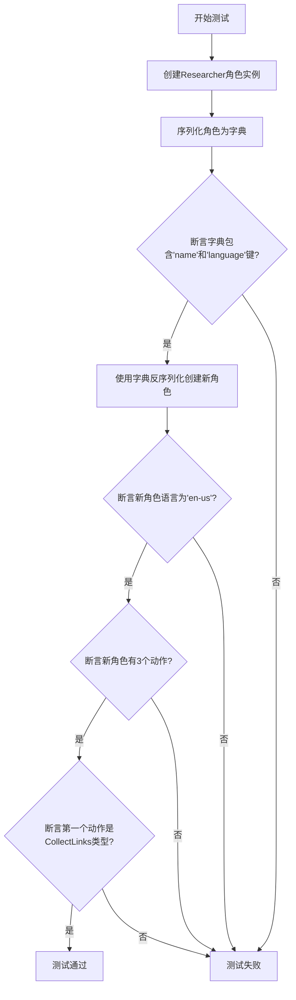
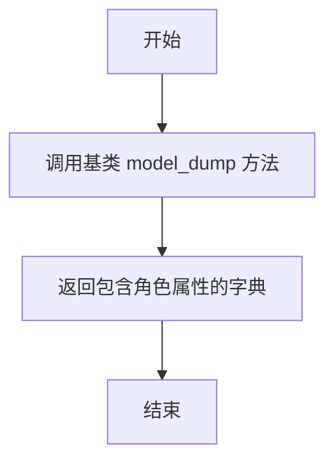

# `.\MetaGPT\tests\metagpt\serialize_deserialize\test_reasearcher.py` 详细设计文档

该代码是一个使用 pytest 框架编写的异步单元测试，用于验证 Researcher 角色的序列化（serialization）与反序列化（deserialization）功能。它创建了一个 Researcher 实例，将其转换为字典格式，然后利用该字典数据重新构建一个新的 Researcher 实例，并验证新实例的关键属性（如语言、动作列表）与预期一致，以确保角色状态在序列化/反序列化过程中得以正确保存和恢复。

## 整体流程

```mermaid
graph TD
    A[开始测试] --> B[创建 Researcher 角色实例]
    B --> C[调用 model_dump() 序列化为字典]
    C --> D{验证字典包含关键字段}
    D -- 是 --> E[使用字典数据反序列化创建新角色]
    E --> F{验证新角色属性}
    F -- 语言为 'en-us' --> G{验证动作数量为3}
    G -- 是 --> H{验证第一个动作类型为 CollectLinks}
    H -- 是 --> I[测试通过]
    D -- 否 --> J[断言失败，测试终止]
    F -- 否 --> J
    G -- 否 --> J
    H -- 否 --> J
```

## 类结构

```
测试文件 (test_tutorial_assistant_serdeser.py)
├── 全局函数: test_tutorial_assistant_serdeser
├── 导入类: Researcher (来自 metagpt.roles.researcher)
└── 导入类: CollectLinks (来自 metagpt.actions)
```

## 全局变量及字段


### `role`
    
一个 Researcher 角色的实例，用于测试序列化和反序列化功能。

类型：`Researcher`
    


### `ser_role_dict`
    
通过 role.model_dump() 方法生成的字典，包含了 Researcher 角色的序列化状态。

类型：`dict`
    


### `new_role`
    
通过反序列化 ser_role_dict 字典创建的新 Researcher 角色实例，用于验证序列化/反序列化的正确性。

类型：`Researcher`
    


### `context`
    
测试的上下文环境，通常包含配置、日志等运行时信息，用于初始化 Researcher 角色。

类型：`Context`
    


### `Researcher.name`
    
Researcher 角色的名称标识符。

类型：`str`
    


### `Researcher.language`
    
Researcher 角色使用的语言设置，例如 'en-us'。

类型：`str`
    


### `Researcher.actions`
    
Researcher 角色所持有的动作（Action）列表，定义了其行为逻辑。

类型：`list[Action]`
    
    

## 全局函数及方法

### `test_tutorial_assistant_serdeser`

该函数是一个异步单元测试，用于验证 `Researcher` 角色的序列化（serialization）与反序列化（deserialization）功能。它首先创建一个 `Researcher` 实例并将其序列化为字典，然后使用该字典数据反序列化创建一个新的 `Researcher` 实例，最后断言新实例的属性（如语言、动作列表）与预期一致，以确保序列化/反序列化过程正确无误。

参数：

- `context`：`<class 'metagpt.Context'>`，测试执行所需的运行时上下文对象，通常包含配置、环境等信息。

返回值：`None`，该函数为测试函数，不返回具体值，仅通过断言验证测试结果。

#### 流程图



#### 带注释源码

```python
# 导入pytest测试框架和异步支持
import pytest

# 导入测试中需要使用的类
from metagpt.actions import CollectLinks
from metagpt.roles.researcher import Researcher

# 使用pytest装饰器标记此函数为异步测试
@pytest.mark.asyncio
# 定义异步测试函数，接收一个context参数（通常由pytest fixture提供）
async def test_tutorial_assistant_serdeser(context):
    # 步骤1：使用传入的context创建一个Researcher角色实例
    role = Researcher(context=context)
    
    # 步骤2：将角色实例序列化（model_dump）为一个字典
    ser_role_dict = role.model_dump()
    
    # 步骤3：断言序列化后的字典包含'name'和'language'这两个关键字段
    assert "name" in ser_role_dict
    assert "language" in ser_role_dict

    # 步骤4：使用序列化得到的字典（**ser_role_dict）和原始context反序列化，创建一个新的Researcher实例
    new_role = Researcher(**ser_role_dict, context=context)
    
    # 步骤5：断言新创建的角色语言属性为默认值"en-us"
    assert new_role.language == "en-us"
    # 步骤6：断言新角色的动作列表长度为3
    assert len(new_role.actions) == 3
    # 步骤7：断言新角色动作列表的第一个元素是CollectLinks类的实例
    assert isinstance(new_role.actions[0], CollectLinks)

    # 开发者留下的TODO注释：指出未来需要测试在不同动作失败的情况下，角色的记忆（Memory）功能是否能正常保存。
    # todo: 需要测试不同的action失败下，记忆是否正常保存
```

### `Researcher.model_dump`

该方法用于将`Researcher`角色实例序列化为一个字典，以便于存储、传输或后续反序列化。它继承自基类的`model_dump`方法，用于提取角色的核心属性。

参数：
-  `self`：`Researcher`，`Researcher`类的实例
-  `*args`：`tuple`，传递给基类`model_dump`方法的可变位置参数
-  `**kwargs`：`dict`，传递给基类`model_dump`方法的关键字参数

返回值：`dict`，包含`Researcher`实例核心属性（如`name`， `language`等）的字典

#### 流程图



#### 带注释源码

```python
def model_dump(self, *args, **kwargs):
    """
    将 Researcher 实例序列化为字典。
    此方法调用父类的 model_dump 方法来获取角色的基本属性字典。
    
    Args:
        *args: 传递给父类 model_dump 的可变位置参数。
        **kwargs: 传递给父类 model_dump 的关键字参数。
        
    Returns:
        dict: 包含角色序列化后属性的字典。
    """
    # 调用父类（例如 Role 类）的 model_dump 方法
    # 该方法会处理角色的通用属性序列化
    return super().model_dump(*args, **kwargs)
```

## 关键组件


### Researcher 角色

Researcher 是一个实现了特定研究任务的智能体角色，它封装了执行研究流程所需的状态和行为。

### 序列化与反序列化 (SerDeser)

代码通过 `model_dump()` 方法将角色对象序列化为字典，并通过构造函数 `Researcher(**ser_role_dict, ...)` 进行反序列化，以验证角色状态（如名称、语言、动作列表）在序列化前后的一致性。

### 动作 (Action) 系统

Researcher 角色包含一个动作列表 (`actions`)，例如 `CollectLinks`，这些动作定义了角色的具体能力。测试验证了反序列化后动作实例的类型和数量保持不变。

### 异步测试框架

代码使用 `pytest.mark.asyncio` 装饰器和 `async/await` 语法来编写和运行异步测试，确保与 MetaGPT 框架的异步操作兼容。

### 测试上下文 (Context)

测试函数接收一个 `context` 参数，该参数为角色提供了运行所需的共享环境（如配置、内存、日志等），并在序列化与反序列化过程中保持上下文的一致性。


## 问题及建议


### 已知问题

-   **测试用例不完整**：代码中有一个 `todo` 注释，指出需要测试在不同的 `action` 执行失败的情况下，角色的记忆（`memory`）是否能够正常保存。这表明当前测试仅覆盖了序列化与反序列化的基本功能，但未验证在异常或失败场景下系统的健壮性。
-   **硬编码断言值**：测试中直接断言 `new_role.language == "en-us"` 和 `len(new_role.actions) == 3`。这些值依赖于 `Researcher` 角色的默认配置。如果未来角色的默认语言或默认行动列表发生变更，此测试将失败，降低了测试的稳定性和可维护性。
-   **上下文（Context）依赖管理**：测试函数接收一个 `context` 参数并用于创建角色。虽然这是依赖注入的良好实践，但测试用例本身没有展示或验证这个 `context` 的内容或状态在序列化/反序列化过程中是否被正确处理和传递。

### 优化建议

-   **补充异常场景测试**：实现 `todo` 注释中的建议，编写测试用例来模拟 `CollectLinks` 等 `action` 执行失败的情况，验证 `Researcher` 角色的状态（特别是记忆）是否能够被正确持久化和恢复，确保系统的错误恢复机制有效。
-   **使用更灵活的断言**：避免对默认配置进行硬编码断言。可以改为从 `Researcher` 类或相关配置中获取预期的默认值进行断言，或者专门测试序列化/反序列化过程本身是否正确，而非特定默认值。例如，可以比较序列化前和反序列化后的两个对象在关键属性上是否一致。
-   **明确上下文序列化测试**：增加对 `context` 对象在序列化/反序列化过程中行为的验证。可以测试角色是否保留了正确的上下文引用，或者上下文中特定的数据是否通过角色间接地影响了序列化结果。
-   **提升测试隔离性**：考虑使用 `pytest` 的 `fixture` 来更清晰地为测试准备 `context` 和其他依赖，使测试设置更简洁，并减少测试间的相互影响。


## 其它


### 设计目标与约束

本代码是一个单元测试，旨在验证 `Researcher` 角色的序列化与反序列化功能。其核心设计目标是确保 `Researcher` 实例在通过 `model_dump()` 方法转换为字典并重新实例化后，其关键属性（如 `name`、`language`）和内部状态（如 `actions` 列表及其类型）能够被正确恢复。约束条件包括：测试运行于异步环境（`pytest.mark.asyncio`），依赖于外部提供的 `context` 对象，并且当前仅验证了部分核心属性，对于更复杂的场景（如不同 Action 执行失败时的记忆保存）存在待办事项（TODO）。

### 错误处理与异常设计

当前测试代码本身不包含显式的错误处理逻辑。其正确性依赖于 `pytest` 框架的断言机制：如果任何 `assert` 语句失败，测试将标记为失败。测试的潜在异常来源包括：`Researcher` 类初始化失败、`model_dump()` 方法调用失败、或反序列化时参数不匹配导致的异常。这些异常将由 `pytest` 捕获并报告为测试错误。代码中的 TODO 注释暗示了未来需要增加针对 Action 执行失败场景下，角色内部记忆（Memory）是否正常保存的测试，这属于测试用例覆盖度的扩展，而非运行时错误处理。

### 数据流与状态机

本测试的数据流是线性的：
1.  **输入**：外部提供的 `context` 对象（测试夹具）。
2.  **处理**：
    a. 使用 `context` 初始化一个 `Researcher` 实例 (`role`)。
    b. 调用 `role.model_dump()` 将实例序列化为字典 (`ser_role_dict`)。
    c. 使用 `ser_role_dict` 和 `context` 作为参数，反序列化创建一个新的 `Researcher` 实例 (`new_role`)。
3.  **验证**：
    a. 断言 `ser_role_dict` 包含 `name` 和 `language` 键。
    b. 断言 `new_role` 的 `language` 属性为 `"en-us"`。
    c. 断言 `new_role` 的 `actions` 列表长度为 3。
    d. 断言 `new_role.actions[0]` 是 `CollectLinks` 类的实例。
4.  **状态**：测试不涉及复杂的状态机。它验证的是从初始状态（原始 `role` 对象）到序列化状态（字典），再回到新对象状态（`new_role`）的往返过程（Round-trip）中，关键属性的不变性。

### 外部依赖与接口契约

1.  **pytest 框架**：依赖 `pytest` 和 `pytest-asyncio` 插件来运行异步测试。`@pytest.mark.asyncio` 装饰器是执行异步测试函数的契约。
2.  **metagpt.actions.CollectLinks**：作为 `Researcher.actions` 的预期组件之一被导入和进行类型断言，依赖其正确的类定义。
3.  **metagpt.roles.researcher.Researcher**：这是被测试的主要类。测试依赖于其公共接口：
    *   `__init__(context)`：构造函数。
    *   `model_dump()`：返回实例字典表示的方法。
    *   属性：`name`（字符串）、`language`（字符串，默认应为 `"en-us"`）、`actions`（列表）。
4.  **context 对象（测试夹具）**：测试函数接收一个名为 `context` 的参数，这是一个由测试框架（例如 `conftest.py`）提供的外部依赖。它模拟了 `Researcher` 角色运行所需的上下文环境（可能包含配置、日志、内存存储等）。测试的成功执行依赖于该 `context` 对象满足 `Researcher` 类的初始化要求。

    