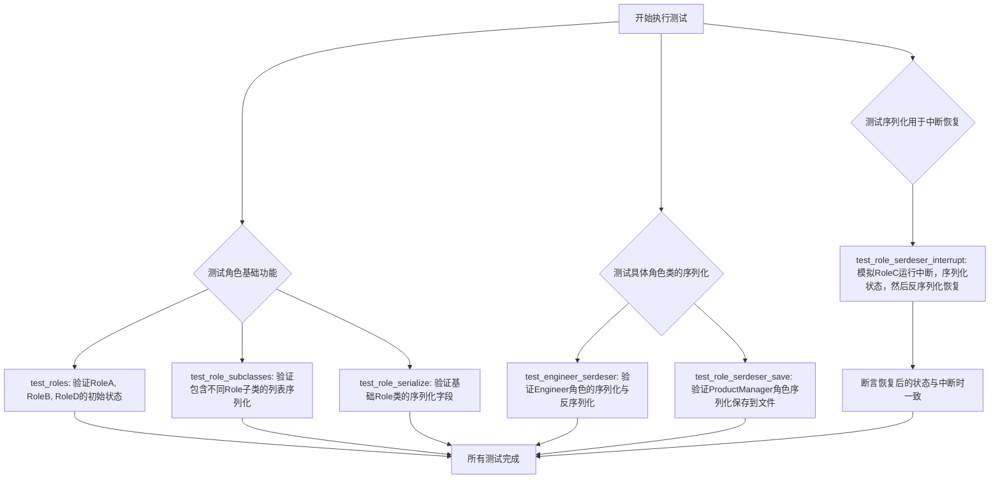
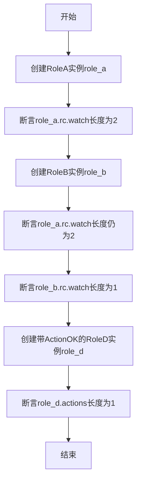
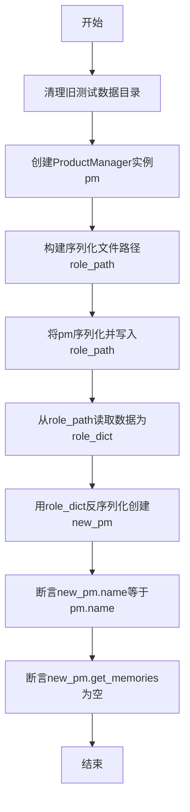
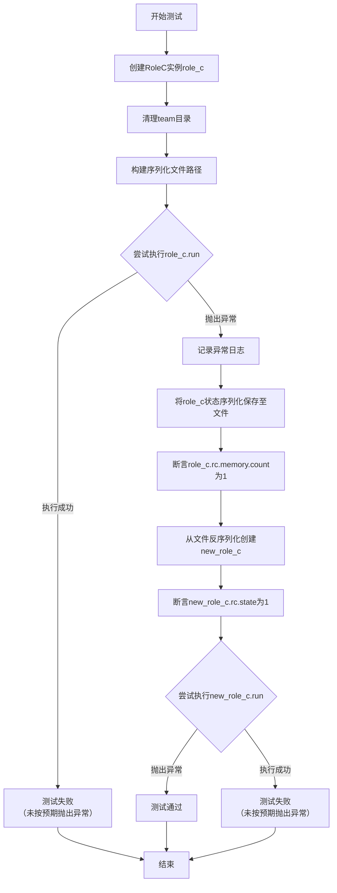
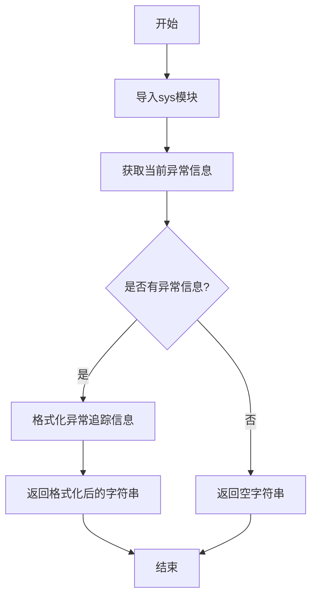
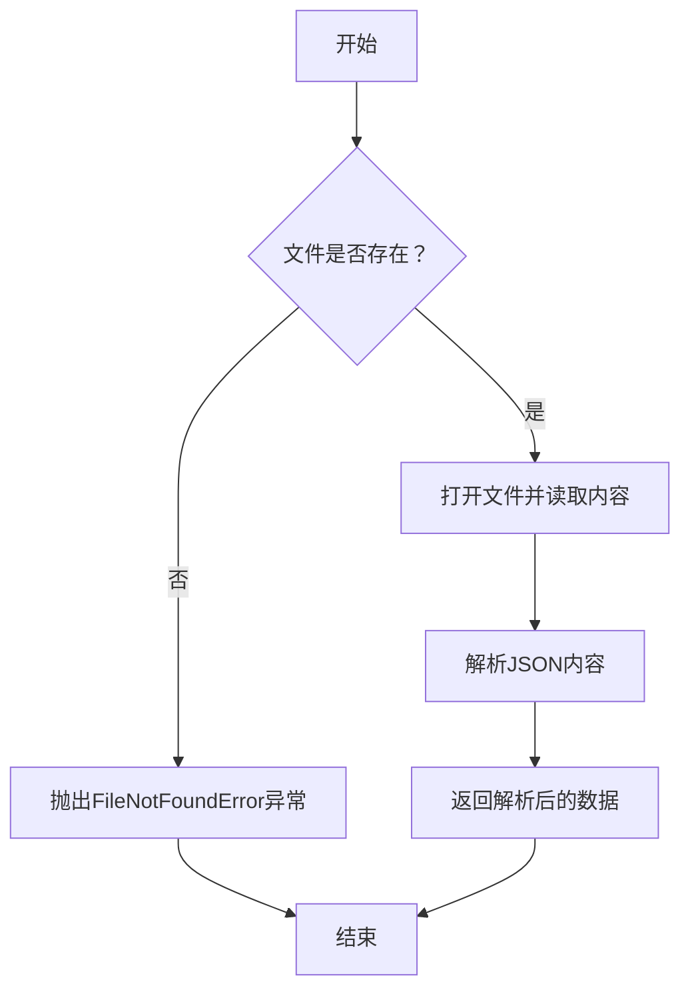
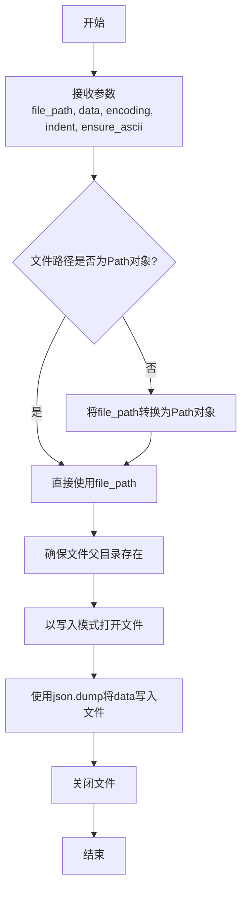
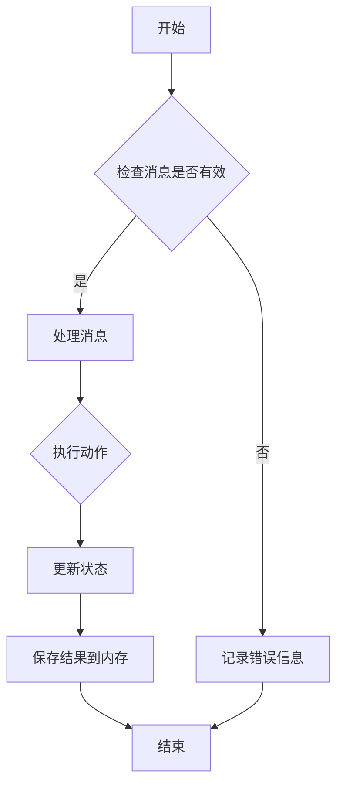

# `.\MetaGPT\tests\metagpt\serialize_deserialize\test_role.py` 详细设计文档

该文件是一个单元测试文件，用于测试 MetaGPT 框架中 Role（角色）类及其子类的序列化（serialization）与反序列化（deserialization）功能，确保角色对象在保存到文件或从文件加载后，其状态、属性和行为能够正确恢复。

## 整体流程



## 类结构

```
BaseModel (Pydantic)
├── RoleSubClasses (测试辅助类)
├── Role (metagpt.roles.role.Role)
│   ├── RoleA (tests...test_serdeser_base.RoleA)
│   ├── RoleB (tests...test_serdeser_base.RoleB)
│   ├── RoleC (tests...test_serdeser_base.RoleC)
│   ├── RoleD (tests...test_serdeser_base.RoleD)
│   ├── Engineer (metagpt.roles.engineer.Engineer)
│   └── ProductManager (metagpt.roles.product_manager.ProductManager)
```

## 全局变量及字段


### `serdeser_path`
    
用于序列化和反序列化测试的目录路径，存储测试过程中生成的临时文件。

类型：`Path`
    


### `logger`
    
用于记录测试过程中的日志信息，包括错误和调试信息。

类型：`Logger`
    


### `RoleSubClasses.roles`
    
存储多个Role子类实例的列表，用于测试具有相同字段的不同角色子类的序列化和反序列化。

类型：`list[SerializeAsAny[Role]]`
    


### `Engineer.name`
    
工程师角色的名称，默认值为'Alex'，用于标识该角色的身份。

类型：`str`
    


### `Engineer.states`
    
工程师角色的状态列表，用于跟踪和管理角色在运行过程中的不同状态。

类型：`list`
    


### `Engineer.actions`
    
工程师角色可执行的动作列表，包含如WriteCode等具体操作，定义了角色的行为能力。

类型：`list[Action]`
    


### `Engineer.use_code_review`
    
标志位，指示工程师角色是否启用代码审查功能，默认值为False。

类型：`bool`
    


### `ProductManager.name`
    
产品经理角色的名称，用于标识该角色的身份。

类型：`str`
    


### `ProductManager.states`
    
产品经理角色的状态列表，用于跟踪和管理角色在运行过程中的不同状态。

类型：`list`
    


### `ProductManager.actions`
    
产品经理角色可执行的动作列表，定义了角色的行为能力。

类型：`list[Action]`
    
    

## 全局函数及方法

### `test_roles`

该函数是一个单元测试，用于验证`Role`类及其子类（`RoleA`、`RoleB`、`RoleD`）在序列化和反序列化过程中的行为，特别是检查`actions`和`rc.watch`属性的正确性。

参数：
- `context`：`pytest.fixture`，测试上下文，提供测试所需的共享资源或设置。

返回值：`None`，该函数是一个测试函数，不返回任何值，通过断言（`assert`）来验证测试结果。

#### 流程图



#### 带注释源码

```python
def test_roles(context):
    # 创建RoleA的实例，并验证其内部rc.watch列表的长度是否为2
    role_a = RoleA()
    assert len(role_a.rc.watch) == 2

    # 创建RoleB的实例
    role_b = RoleB()
    # 再次验证role_a的rc.watch长度未受影响，仍为2
    assert len(role_a.rc.watch) == 2
    # 验证新创建的role_b的rc.watch列表长度为1
    assert len(role_b.rc.watch) == 1

    # 创建一个RoleD实例，并传入一个ActionOK动作作为其actions列表
    role_d = RoleD(actions=[ActionOK()])
    # 验证role_d的actions列表长度为1
    assert len(role_d.actions) == 1
```

### `test_role_subclasses`

该函数用于测试包含不同`Role`子类实例的`RoleSubClasses`模型在序列化与反序列化过程中的行为，确保子类类型信息能被正确保留。

参数：

- `context`：`pytest.fixture`，测试上下文，提供测试所需的共享资源或设置。

返回值：`None`，该函数为测试函数，不返回具体值，通过断言验证测试结果。

#### 流程图

```mermaid
flowchart TD
    A[开始] --> B[定义内部类 RoleSubClasses]
    B --> C[实例化 RoleSubClasses<br>包含 RoleA 和 RoleB]
    C --> D[序列化实例为字典]
    D --> E[从字典反序列化<br>创建新实例]
    E --> F[断言新实例的<br>roles[0] 类型为 RoleA]
    F --> G[断言新实例的<br>roles[1] 类型为 RoleB]
    G --> H[结束]
```

#### 带注释源码

```python
def test_role_subclasses(context):
    """test subclasses of role with same fields in ser&deser"""

    # 1. 定义一个内部数据模型 `RoleSubClasses`，其 `roles` 字段是一个列表，
    #    列表中的元素使用 `SerializeAsAny[Role]` 进行标注。
    #    这告诉 Pydantic 在序列化和反序列化时，保留列表中每个元素的具体子类类型信息。
    class RoleSubClasses(BaseModel):
        roles: list[SerializeAsAny[Role]] = []

    # 2. 实例化 `RoleSubClasses`，其 `roles` 列表包含 `RoleA` 和 `RoleB` 的实例。
    role_subcls = RoleSubClasses(roles=[RoleA(), RoleB()])
    # 3. 将实例序列化为字典。`model_dump()` 方法会根据字段定义和 `SerializeAsAny` 的指示，
    #    在生成的字典中保留 `RoleA` 和 `RoleB` 的类型信息（通常通过 `__module__` 和 `__class__` 等字段）。
    role_subcls_dict = role_subcls.model_dump()

    # 4. 使用上一步生成的字典，通过解包操作反序列化出一个新的 `RoleSubClasses` 实例。
    new_role_subcls = RoleSubClasses(**role_subcls_dict)
    # 5. 断言新实例的 `roles` 列表中的第一个元素是 `RoleA` 类型。
    assert isinstance(new_role_subcls.roles[0], RoleA)
    # 6. 断言新实例的 `roles` 列表中的第二个元素是 `RoleB` 类型。
    assert isinstance(new_role_subcls.roles[1], RoleB)
```

### `test_role_serialize`

该函数用于测试 `Role` 类的序列化功能，验证通过 `model_dump()` 方法序列化后的字典是否包含预期的关键字段。

参数：

- `context`：`pytest.fixture`，测试上下文，提供测试所需的环境和资源。

返回值：`None`，无返回值，仅执行断言验证。

#### 流程图

```mermaid
flowchart TD
    A[开始] --> B[创建Role实例]
    B --> C[调用model_dump()序列化]
    C --> D[验证序列化字典包含'name'字段]
    D --> E[验证序列化字典包含'states'字段]
    E --> F[验证序列化字典包含'actions'字段]
    F --> G[测试通过]
    G --> H[结束]
```

#### 带注释源码

```python
def test_role_serialize(context):
    # 创建一个 Role 类的实例
    role = Role()
    # 调用 model_dump() 方法将角色实例序列化为字典
    ser_role_dict = role.model_dump()
    # 断言序列化后的字典中包含 'name' 字段
    assert "name" in ser_role_dict
    # 断言序列化后的字典中包含 'states' 字段
    assert "states" in ser_role_dict
    # 断言序列化后的字典中包含 'actions' 字段
    assert "actions" in ser_role_dict
```

### `test_engineer_serdeser`

该函数是一个单元测试，用于验证`Engineer`角色的序列化（`model_dump`）与反序列化（`__init__`）功能。它创建一个`Engineer`实例，将其序列化为字典，然后使用该字典反序列化创建一个新实例，并断言新实例的属性与原始实例一致。

参数：

- `context`：`pytest.fixture`，测试上下文，提供测试所需的临时环境或资源。

返回值：`None`，该函数是一个测试函数，不返回任何值，通过断言（`assert`）来验证测试结果。

#### 流程图

```mermaid
flowchart TD
    A[开始测试] --> B[创建Engineer实例role]
    B --> C[调用role.model_dump()<br>序列化为字典ser_role_dict]
    C --> D[使用ser_role_dict<br>反序列化创建新实例new_role]
    D --> E{断言验证}
    E --> F[断言new_role.name == 'Alex']
    F --> G[断言new_role.use_code_review is False]
    G --> H[断言len(new_role.actions) == 1]
    H --> I[断言isinstance(new_role.actions[0], WriteCode)]
    I --> J[测试通过]
    E -- 任一断言失败 --> K[测试失败，抛出AssertionError]
```

#### 带注释源码

```python
def test_engineer_serdeser(context):
    # 1. 创建一个Engineer角色的实例
    role = Engineer()
    
    # 2. 将role实例序列化（转换为字典格式）
    ser_role_dict = role.model_dump()
    
    # 3. 验证序列化后的字典包含预期的关键字段
    assert "name" in ser_role_dict
    assert "states" in ser_role_dict
    assert "actions" in ser_role_dict

    # 4. 使用序列化后的字典反序列化，创建一个新的Engineer实例
    new_role = Engineer(**ser_role_dict)
    
    # 5. 断言新实例的属性与原始实例的默认属性一致
    #    验证角色名称为默认的"Alex"
    assert new_role.name == "Alex"
    #    验证代码审查功能默认关闭
    assert new_role.use_code_review is False
    #    验证动作列表长度为1（默认应包含WriteCode动作）
    assert len(new_role.actions) == 1
    #    验证动作列表中的第一个动作是WriteCode类型
    assert isinstance(new_role.actions[0], WriteCode)
```

### `test_role_serdeser_save`

该函数是一个单元测试，用于验证`ProductManager`角色的序列化（保存到JSON文件）与反序列化（从JSON文件加载）功能。它首先清理旧的测试数据，然后创建一个`ProductManager`实例，将其序列化并保存到指定路径的JSON文件中，接着从该文件读取数据并反序列化为一个新的`ProductManager`实例，最后断言新实例的属性与原始实例一致，并验证其记忆为空。

参数：

- `context`：`pytest.fixture`，测试上下文，提供测试所需的临时环境或资源。

返回值：`None`，该函数是一个测试函数，不返回任何值，通过断言（assert）来验证测试结果。

#### 流程图



#### 带注释源码

```python
def test_role_serdeser_save(context):
    # 1. 清理旧的测试数据目录，确保测试环境干净
    shutil.rmtree(serdeser_path.joinpath("team"), ignore_errors=True)

    # 2. 创建一个ProductManager角色实例
    pm = ProductManager()

    # 3. 构建序列化文件的存储路径。路径结构为：{基础路径}/team/environment/roles/{类名}_{实例名}/role.json
    stg_path = serdeser_path.joinpath("team", "environment", "roles", f"{pm.__class__.__name__}_{pm.name}")
    role_path = stg_path.joinpath("role.json")
    
    # 4. 将ProductManager实例pm序列化为字典，并写入到role_path指定的JSON文件中
    write_json_file(role_path, pm.model_dump())

    # 5. 从刚写入的JSON文件中读取数据，得到字典role_dict
    role_dict = read_json_file(role_path)
    
    # 6. 使用读取到的字典role_dict作为参数，反序列化创建一个新的ProductManager实例new_pm
    new_pm = ProductManager(**role_dict)
    
    # 7. 断言：新实例的名称与原始实例的名称相同
    assert new_pm.name == pm.name
    # 8. 断言：新实例的记忆（获取最近1条）为空列表，验证反序列化后状态正确初始化
    assert len(new_pm.get_memories(1)) == 0
```

### `test_role_serdeser_interrupt`

这是一个异步测试函数，用于验证`Role`类（或其子类`RoleC`）在运行过程中发生异常中断时，其序列化（保存状态）与反序列化（恢复状态）的正确性。具体测试场景是：`RoleC`实例在执行`run`方法时抛出异常，此时将其状态序列化保存到文件；之后从文件反序列化恢复一个新的`RoleC`实例，验证其内部状态（如`rc.state`）被正确恢复，并且恢复后的实例在相同条件下再次运行会引发预期的异常。

参数：

- `context`：`pytest.fixture`，测试上下文或依赖注入的fixture，用于提供测试运行环境。

返回值：`None`，测试函数通常不返回具体值，而是通过断言（`assert`）来验证测试结果。

#### 流程图



#### 带注释源码

```python
@pytest.mark.asyncio  # 标记此函数为异步测试，以便pytest-asyncio插件能正确处理
async def test_role_serdeser_interrupt(context):
    # 1. 创建待测试的RoleC实例
    role_c = RoleC()
    # 2. 清理之前测试可能遗留的序列化数据目录，确保环境干净
    shutil.rmtree(serdeser_path.joinpath("team"), ignore_errors=True)

    # 3. 构建用于保存角色序列化数据的文件路径
    #    路径格式：{serdeser_path}/team/environment/roles/{类名}_{实例名}/role.json
    stg_path = serdeser_path.joinpath("team", "environment", "roles", f"{role_c.__class__.__name__}_{role_c.name}")
    role_path = stg_path.joinpath("role.json")
    
    # 4. 核心测试逻辑：模拟角色运行中断并序列化
    try:
        # 尝试运行role_c，预期会抛出异常（由RoleC.run的实现决定）
        await role_c.run(with_message=Message(content="demo", cause_by=UserRequirement))
    except Exception:
        # 捕获异常，记录详细的错误信息（包括堆栈跟踪）
        logger.error(f"Exception in `role_c.run`, detail: {format_trackback_info()}")
        # 关键步骤：在异常发生时，将role_c的当前状态序列化并保存到文件
        write_json_file(role_path, role_c.model_dump())

    # 5. 验证中断后role_c的某些状态（如记忆数量）符合预期
    assert role_c.rc.memory.count() == 1

    # 6. 反序列化与恢复验证
    #    从之前保存的文件中读取序列化数据
    role_dict = read_json_file(role_path)
    #    使用该数据创建一个新的RoleC实例new_role_c
    new_role_c: Role = RoleC(**role_dict)
    #    验证反序列化后的实例正确恢复了中断时的状态（例如rc.state应为1）
    assert new_role_c.rc.state == 1

    # 7. 验证恢复后的实例在相同条件下运行，依然会抛出异常
    #    使用pytest.raises上下文管理器来断言会抛出Exception
    with pytest.raises(Exception):
        await new_role_c.run(with_message=Message(content="demo", cause_by=UserRequirement))
```

### `format_trackback_info`

该函数用于捕获并格式化当前异常的追踪信息，返回一个易于阅读的字符串，通常用于日志记录或错误报告。

参数：
- 无参数

返回值：`str`，返回格式化的异常追踪信息字符串。

#### 流程图



#### 带注释源码

```python
def format_trackback_info() -> str:
    """
    格式化当前异常的追踪信息。

    该函数捕获当前异常的追踪信息，并将其格式化为一个易于阅读的字符串。
    如果没有异常信息，则返回空字符串。

    Returns:
        str: 格式化的异常追踪信息字符串。
    """
    import sys  # 导入sys模块以访问异常信息

    # 获取当前异常信息
    exc_info = sys.exc_info()
    if exc_info[0] is None:
        # 如果没有异常信息，返回空字符串
        return ""
    # 使用traceback模块格式化异常信息
    import traceback
    formatted_traceback = traceback.format_exception(*exc_info)
    # 将格式化的追踪信息连接为字符串并返回
    return "".join(formatted_traceback)
```

### `read_json_file`

从指定路径读取JSON文件，并将其内容解析为Python字典或列表。

参数：
- `file_path`：`str`，JSON文件的路径

返回值：`dict | list`，解析后的JSON数据

#### 流程图



#### 带注释源码

```python
def read_json_file(file_path: str) -> dict | list:
    """
    读取JSON文件并返回解析后的数据。

    Args:
        file_path (str): JSON文件的路径。

    Returns:
        dict | list: 解析后的JSON数据。

    Raises:
        FileNotFoundError: 如果文件不存在。
        JSONDecodeError: 如果JSON格式无效。
    """
    with open(file_path, 'r', encoding='utf-8') as file:
        data = json.load(file)
    return data
```

### `write_json_file`

该函数用于将Python对象（通常是字典或Pydantic模型实例的字典表示）序列化为JSON格式，并写入到指定的文件路径。它封装了标准库的JSON写入操作，提供了便捷的文件写入功能。

参数：

- `file_path`：`Path`，目标JSON文件的路径，类型为`pathlib.Path`。
- `data`：`dict`，要写入的Python字典数据。
- `encoding`：`str`，可选参数，默认为`"utf-8"`，指定文件写入时使用的字符编码。
- `indent`：`int`，可选参数，默认为`2`，指定JSON格式化时的缩进空格数，用于美化输出。
- `ensure_ascii`：`bool`，可选参数，默认为`False`，控制是否确保所有非ASCII字符被转义。设为`False`允许直接写入Unicode字符。

返回值：`None`，该函数没有返回值，其主要作用是执行文件写入操作。

#### 流程图



#### 带注释源码

```python
def write_json_file(file_path: Path, data: dict, encoding="utf-8", indent=2, ensure_ascii=False):
    """
    将字典数据写入JSON文件。

    此函数接收一个文件路径和一个字典，将字典序列化为JSON格式并写入文件。
    它支持自定义编码、缩进和ASCII字符处理。

    Args:
        file_path (Path): 要写入的JSON文件路径。
        data (dict): 要序列化并写入的字典数据。
        encoding (str, optional): 文件编码，默认为 "utf-8"。
        indent (int, optional): JSON格式化缩进空格数，默认为 2。
        ensure_ascii (bool, optional): 是否转义非ASCII字符，默认为 False。

    Returns:
        None: 此函数不返回任何值。
    """
    # 如果传入的file_path不是Path对象，则将其转换为Path对象以确保路径操作的一致性。
    if not isinstance(file_path, Path):
        file_path = Path(file_path)
    # 确保目标文件的父目录存在，如果不存在则创建，避免因目录不存在而导致的文件写入错误。
    file_path.parent.mkdir(parents=True, exist_ok=True)
    # 以写入模式打开文件，使用指定的编码。
    # 使用json.dump方法将字典数据序列化为JSON字符串并写入文件。
    # indent参数控制输出格式的美观度，ensure_ascii控制非ASCII字符的转义行为。
    with file_path.open("w", encoding=encoding) as f:
        json.dump(data, f, indent=indent, ensure_ascii=ensure_ascii)
```

### `RoleC.run`

该方法用于执行RoleC角色的主要业务流程。它接收一个消息作为输入，处理该消息，并根据角色的状态机执行相应的动作。在运行过程中，如果遇到异常，会记录错误信息并保存角色状态，以便后续恢复。

参数：

- `with_message`：`Message`，触发角色运行的消息，包含消息内容和起因

返回值：`None`，无返回值

#### 流程图



#### 带注释源码

```python
async def run(self, with_message: Message) -> None:
    """
    执行RoleC角色的主要业务流程。
    
    该方法接收一个消息作为输入，处理该消息，并根据角色的状态机执行相应的动作。
    在运行过程中，如果遇到异常，会记录错误信息并保存角色状态，以便后续恢复。
    
    Args:
        with_message (Message): 触发角色运行的消息，包含消息内容和起因
    
    Returns:
        None: 无返回值
    """
    try:
        # 处理传入的消息
        self._process_message(with_message)
        
        # 根据当前状态执行相应的动作
        await self._execute_action()
        
        # 更新角色状态
        self._update_state()
        
        # 将处理结果保存到内存中
        self._save_to_memory()
        
    except Exception as e:
        # 记录异常信息
        logger.error(f"Exception in `role_c.run`, detail: {format_trackback_info()}")
        
        # 保存角色状态以便后续恢复
        self._save_state_for_recovery()
        
        # 重新抛出异常
        raise
```

### `ProductManager.get_memories`

该方法用于从角色的记忆系统中检索指定数量的最近记忆（消息）。它通过调用内部记忆管理器的`get`方法来实现，允许产品经理角色回顾其历史交互或决策记录。

参数：

- `k`：`int`，指定要检索的记忆数量。该参数决定了返回消息列表的长度。

返回值：`list[Message]`，返回一个包含最近`k`条消息的列表。如果可用消息少于`k`条，则返回所有可用消息。

#### 流程图

```mermaid
graph TD
    A[开始] --> B[接收参数 k]
    B --> C[调用 self.rc.memory.get(k)]
    C --> D[返回消息列表]
    D --> E[结束]
```

#### 带注释源码

```python
def get_memories(self, k=0) -> list[Message]:
    """
    从角色的记忆系统中获取最近的k条消息。
    
    参数:
        k (int): 要检索的记忆数量。如果为0，则返回所有记忆。
    
    返回:
        list[Message]: 包含最近k条消息的列表。
    """
    # 调用内部记忆管理器的get方法，传入参数k以获取指定数量的最近消息
    return self.rc.memory.get(k)
```

## 关键组件

### Role 类及其子类

用于测试 MetaGPT 框架中角色（Role）类的序列化与反序列化功能，包括基础角色、工程师、产品经理等子类的实例化、字段验证和状态持久化。

### Pydantic BaseModel 与 SerializeAsAny

利用 Pydantic 的 BaseModel 提供数据验证和序列化支持，SerializeAsAny 确保在序列化/反序列化多态角色列表时能正确保留具体子类类型。

### 角色动作（Actions）与观察（Watch）

测试角色实例中动作（actions）列表的配置，以及角色上下文（rc）中观察（watch）列表的初始化与验证，确保角色能正确响应特定类型的消息。

### 角色状态持久化与恢复

通过将角色实例序列化为 JSON 文件并重新加载，测试角色在异常中断后的状态恢复能力，包括内存状态、执行状态和配置的完整性。

### 测试工具与辅助函数

使用 pytest 框架进行异步和同步测试，结合 shutil 管理测试目录，并通过自定义工具函数（如 format_trackback_info、read_json_file、write_json_file）处理错误信息和文件操作。

## 问题及建议

### 已知问题

-   **测试用例 `test_role_serdeser_interrupt` 存在逻辑缺陷**：该测试用例期望在 `role_c.run` 抛出异常后，通过 `write_json_file` 保存角色状态。然而，`role_c.run` 方法内部可能已经捕获了异常并进行了处理，导致测试中的 `try...except` 块无法捕获到预期的异常，从而使 `write_json_file` 可能不会被执行，影响测试的可靠性和对序列化中断恢复场景的验证。
-   **硬编码的测试数据与路径**：代码中多处使用了硬编码的字符串（如 `"demo"`）和通过 `serdeser_path` 拼接的固定目录结构（如 `"team/environment/roles"`）。这使得测试与特定的文件系统布局紧密耦合，降低了测试的灵活性和可移植性，在环境变化时容易失败。
-   **测试资源清理不彻底**：`test_role_serdeser_save` 和 `test_role_serdeser_interrupt` 测试用例中，使用 `shutil.rmtree` 删除目录时，如果目录不存在或权限不足，`ignore_errors=True` 会静默忽略错误，这可能掩盖了环境配置问题，且未确保清理操作完全成功，可能导致残留文件影响后续测试。
-   **异步测试的异常断言过于宽泛**：`test_role_serdeser_interrupt` 中使用 `with pytest.raises(Exception)` 来断言 `new_role_c.run` 会抛出异常。捕获通用的 `Exception` 过于宽泛，可能掩盖非预期的错误类型，降低了测试的精确性和调试价值。

### 优化建议

-   **重构测试用例以精确模拟和验证异常流程**：对于 `test_role_serdeser_interrupt`，应重构测试策略。可以改为直接模拟（Mock）`role_c.run` 方法，使其在特定条件下抛出可控的异常，然后验证序列化文件是否正确写入。或者，如果 `role_c.run` 的设计就是可恢复的，则应调整测试预期，验证其恢复后的状态，而非依赖一个宽泛的异常。
-   **使用 pytest 的临时目录和配置化测试数据**：利用 `pytest` 的 `tmp_path` fixture 来管理测试生成的临时文件和目录，替代硬编码的 `serdeser_path`，确保测试隔离性和自动清理。将测试用的消息内容等字符串提取为模块级常量或 fixture，提高可维护性。
-   **增强测试的健壮性和明确性**：在清理目录时，可以添加检查，确保目录在删除前后状态符合预期，或使用更精确的异常处理。对于异步测试的异常断言，应指定更具体的异常类型（例如 `RuntimeError` 或自定义的业务异常），使测试意图更清晰，并能准确捕获目标错误。
-   **补充关键场景的测试覆盖**：当前测试主要覆盖了角色的序列化/反序列化基本功能、继承结构以及中断场景。建议补充以下测试：1) 角色在反序列化后，其内部状态（如 `rc.memory`、`rc.state`）与原始对象完全一致的验证；2) 包含复杂动作（Action）图或观察（Watch）列表的角色序列化；3) 多角色在团队环境中的联合序列化与恢复场景。

## 其它


### 设计目标与约束

本测试代码的设计目标是验证MetaGPT框架中角色（Role）类的序列化（serialization）与反序列化（deserialization）功能，以及不同角色子类在序列化过程中的行为一致性。约束包括：1）必须使用Pydantic的BaseModel作为基类以实现序列化；2）测试需要覆盖基础Role类、具体角色子类（如Engineer, ProductManager）以及包含嵌套角色的复杂结构；3）测试过程需要模拟运行中断并恢复的场景，以验证状态持久化的正确性；4）测试环境需要能够清理和重建，以保证测试的独立性和可重复性。

### 错误处理与异常设计

测试代码中显式地包含了错误处理逻辑。在`test_role_serdeser_interrupt`测试用例中，预期`role_c.run()`方法会抛出异常。当异常发生时，代码会捕获该异常，记录错误日志（包含详细的堆栈跟踪信息），并将当前角色实例的状态序列化保存到文件中。这种设计允许测试模拟一个运行中断的场景，并在后续通过反序列化恢复角色状态，验证状态恢复后程序的行为是否符合预期（例如，状态值被正确恢复，且再次运行会引发相同异常）。这体现了对“持久化以支持断点续跑”这一特性的测试。

### 数据流与状态机

测试代码主要验证角色内部状态（`rc.state`）和记忆（`rc.memory`）在序列化/反序列化过程中的正确流转。
1.  **状态流转**：在中断测试中，`RoleC`的`run`方法会将`rc.state`从初始值（例如0）递增。当运行被异常中断时，该状态值（例如1）被序列化保存。反序列化后，新的`RoleC`实例应从状态1开始，这通过断言`new_role_c.rc.state == 1`进行验证。
2.  **记忆流转**：`RoleC`的`run`方法会向记忆中添加一条消息。中断后，通过断言`role_c.rc.memory.count() == 1`验证消息已被存储。虽然反序列化后的新实例记忆是空的（因为测试中未序列化整个环境，只序列化了角色），但这部分逻辑验证了角色在运行过程中对记忆系统的使用。
3.  **配置与动作流转**：对于`Engineer`等角色，测试验证了其属性（如`name`, `use_code_review`）和持有的动作列表（`actions`）在序列化/反序列化后保持不变且类型正确。

### 外部依赖与接口契约

1.  **Pydantic**：核心外部依赖。代码中所有角色类均继承自`pydantic.BaseModel`，并依赖其`model_dump()`和`model_validate()`（通过`**dict`调用）方法进行序列化与反序列化。`SerializeAsAny`用于处理多态类型的列表字段，确保序列化后类型信息不丢失。
2.  **pytest**：测试框架。用于组织测试用例（`test_*`函数）、管理异步测试（`@pytest.mark.asyncio`）、提供上下文（`context` fixture）和进行断言检查。
3.  **shutil**：用于测试前的目录清理（`shutil.rmtree`），确保每次测试在一个干净的环境中进行。
4.  **metagpt 内部模块**：测试代码深度依赖于MetaGPT框架的内部模块，包括`Role`、`Engineer`、`ProductManager`等角色类，`WriteCode`等动作类，`Message`等模式类，以及`read_json_file`、`write_json_file`等工具函数。这要求被测试的代码结构保持稳定，接口契约（如`Role`类的`model_dump`、`run`方法，`rc`属性的结构）一旦改变，本测试代码需要同步更新。
5.  **序列化路径约定**：测试依赖于一个约定的序列化文件存储路径结构（`serdeser_path.joinpath(“team”, “environment”, “roles”, …)`），这构成了与测试环境（或持久化层）的隐式接口契约。

### 测试策略与覆盖范围

1.  **单元测试**：测试单个角色类（如`Role`, `Engineer`）的序列化/反序列化基本功能（`test_role_serialize`, `test_engineer_serdeser`）。
2.  **集成测试**：测试角色与文件系统的集成，即序列化到文件和从文件反序列化（`test_role_serdeser_save`）。
3.  **场景测试**：模拟复杂场景，如程序运行中断后通过持久化状态恢复执行（`test_role_serdeser_interrupt`）。
4.  **继承与多态测试**：验证包含多态角色列表的复杂模型能否正确序列化和反序列化（`test_role_subclasses`）。
5.  **状态与行为验证**：不仅验证数据被保存和加载，还验证加载后对象的行为（如状态值、方法调用结果）与预期一致。

    