# `.\MetaGPT\tests\metagpt\serialize_deserialize\test_schema.py` 详细设计文档

该文件是一个单元测试文件，用于测试 MetaGPT 框架中 `Message` 类及其相关上下文类（如 `Document`, `Documents`, `CodingContext`, `TestingContext`）的序列化与反序列化功能。核心功能是验证这些数据模型在通过 Pydantic 的 `model_dump` 方法转换为字典，以及通过构造函数从字典重建对象时，能够保持数据的一致性和完整性，特别是对包含复杂指令内容（`instruct_content`）的 `Message` 对象的处理。

## 整体流程

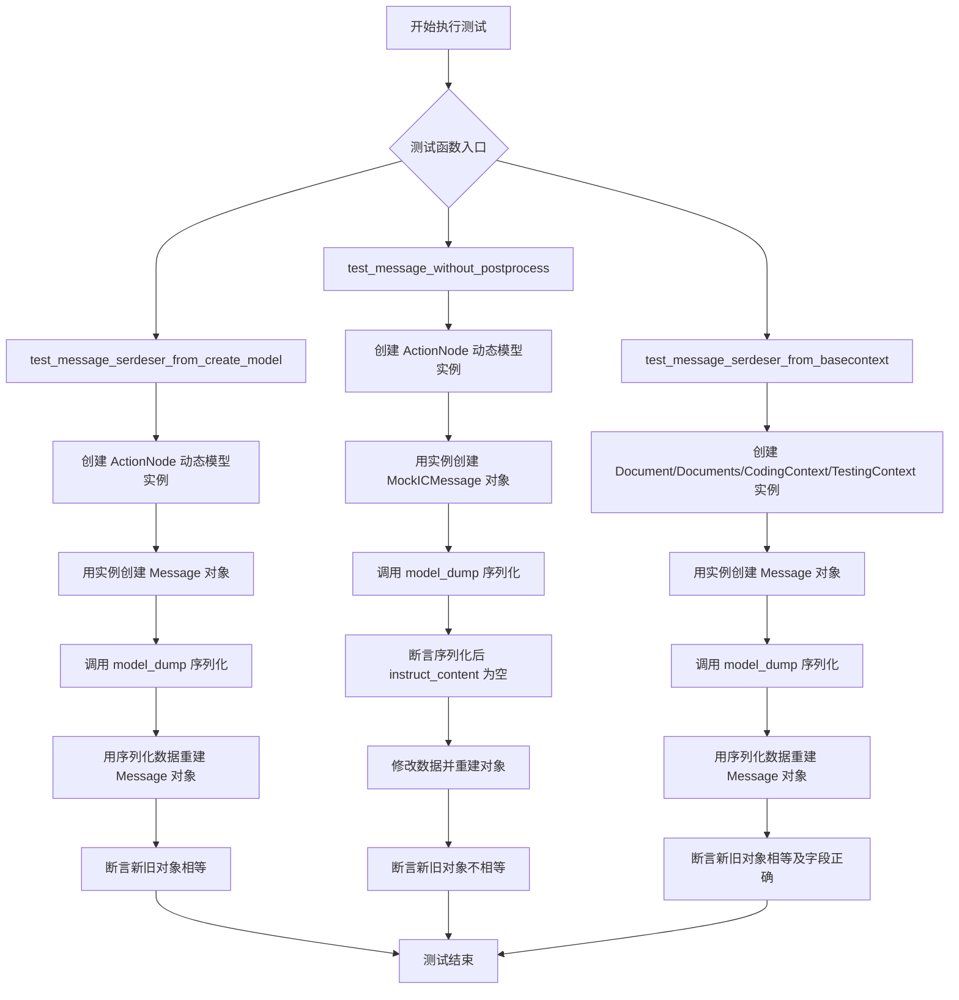

## 类结构

```
Pytest Test Suite
├── test_message_serdeser_from_create_model
├── test_message_without_postprocess
└── test_message_serdeser_from_basecontext

External Classes (Under Test)
├── Message
├── ActionNode
├── Document
├── Documents
├── CodingContext
├── TestingContext
├── MockICMessage (from tests)
└── MockMessage (from tests)
```

## 全局变量及字段


### `Message.content`
    
消息的主要内容或文本信息。

类型：`str`
    


### `Message.instruct_content`
    
消息携带的结构化指令内容，可以是多种类型的对象。

类型：`Union[ActionNode, Document, Documents, CodingContext, TestingContext, None]`
    


### `Message.role`
    
发送或处理此消息的角色标识，例如'engineer'。

类型：`str`
    


### `Message.cause_by`
    
触发此消息的原因，通常是一个Action类或其字符串表示。

类型：`Union[str, Type[Action]]`
    


### `Document.content`
    
文档的文本内容。

类型：`str`
    


### `Document.filename`
    
文档的文件名。

类型：`str`
    


### `Document.root_path`
    
文档在文件系统中的根路径。

类型：`str`
    


### `Documents.docs`
    
一个文档集合，以字典形式存储，键为文档标识，值为Document对象。

类型：`Dict[str, Document]`
    


### `CodingContext.filename`
    
代码文件的名称。

类型：`str`
    


### `CodingContext.design_doc`
    
与代码相关的设计文档。

类型：`Document`
    


### `CodingContext.task_doc`
    
描述编码任务的文档。

类型：`Document`
    


### `CodingContext.code_doc`
    
实际的代码文档。

类型：`Document`
    


### `TestingContext.filename`
    
测试文件的名称。

类型：`str`
    


### `TestingContext.code_doc`
    
被测试的代码文档。

类型：`Document`
    


### `TestingContext.test_doc`
    
包含测试用例的文档。

类型：`Document`
    


### `MockICMessage.content`
    
模拟消息的主要内容。

类型：`str`
    


### `MockICMessage.instruct_content`
    
模拟消息携带的结构化指令内容。

类型：`Union[ActionNode, Document, Documents, CodingContext, TestingContext, None]`
    
    

## 全局函数及方法

### `test_message_serdeser_from_create_model`

该函数是一个单元测试，用于验证 `Message` 类在序列化（`model_dump`）和反序列化（通过构造函数重建）过程中，当 `instruct_content` 字段包含由 `ActionNode.create_model_class` 动态创建的 Pydantic 模型实例时，其数据和行为是否能被正确保持。测试涵盖了序列化后数据的结构验证、反序列化后对象的相等性比较，以及 `cause_by` 字段的字符串化处理。

参数：
- 无显式参数。这是一个单元测试函数，其参数由 `pytest` 框架隐式管理。

返回值：`None`，这是一个测试函数，其主要通过断言（`assert`）来验证逻辑，不返回业务值。

#### 流程图

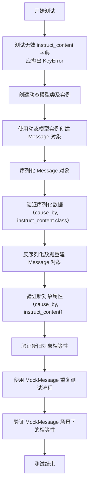

#### 带注释源码

```python
def test_message_serdeser_from_create_model():
    # 1. 测试边界情况：验证当 instruct_content 是一个普通字典（而非 Pydantic 模型）时，
    #    Message 的构造函数会抛出 KeyError 异常。这确保了 instruct_content 字段的类型安全。
    with pytest.raises(KeyError):
        _ = Message(content="code", instruct_content={"class": "test", "key": "value"})

    # 2. 准备测试数据：定义一个输出映射和数据，用于创建动态的 Pydantic 模型类。
    out_mapping = {"field3": (str, ...), "field4": (list[str], ...)}
    out_data = {"field3": "field3 value3", "field4": ["field4 value1", "field4 value2"]}
    
    # 3. 使用 ActionNode 工具方法，根据映射动态创建一个名为 "code" 的 Pydantic 模型类。
    ic_obj = ActionNode.create_model_class("code", out_mapping)
    # 4. 使用测试数据实例化这个动态创建的模型。
    ic_inst = ic_obj(**out_data)

    # 5. 创建主测试对象：一个包含动态模型实例作为 instruct_content 的 Message。
    message = Message(content="code", instruct_content=ic_inst, role="engineer", cause_by=WriteCode)
    
    # 6. 序列化：将 Message 对象转换为字典。
    ser_data = message.model_dump()
    # 7. 验证序列化结果：
    #    - cause_by 字段应被正确序列化为模块路径字符串。
    assert ser_data["cause_by"] == "metagpt.actions.write_code.WriteCode"
    #    - instruct_content 字典中应包含动态模型的类名。
    assert ser_data["instruct_content"]["class"] == "code"

    # 8. 反序列化：使用序列化后的字典重新构建 Message 对象。
    new_message = Message(**ser_data)
    # 9. 验证反序列化后对象的属性：
    #    - cause_by 字段应能正确映射回原始类（通过 any_to_str 比较）。
    assert new_message.cause_by == any_to_str(WriteCode)
    assert new_message.cause_by in [any_to_str(WriteCode)]
    #    - instruct_content 应与原始动态模型实例相等。
    assert new_message.instruct_content == ic_obj(**out_data)
    assert new_message.instruct_content == ic_inst
    #    - instruct_content 的模型字典表示也应相等。
    assert new_message.instruct_content.model_dump() == ic_obj(**out_data).model_dump()
    #    - 整个 Message 对象应相等。
    assert new_message == message

    # 10. 扩展测试：使用一个预定义的 MockMessage 类重复上述序列化/反序列化流程，
    #     以验证机制对于非动态创建的 Pydantic 模型同样有效。
    mock_msg = MockMessage()
    message = Message(content="test_ic", instruct_content=mock_msg)
    ser_data = message.model_dump()
    new_message = Message(**ser_data)
    assert new_message.instruct_content == mock_msg
    assert new_message == message
```

### `test_message_without_postprocess`

该函数是一个单元测试，旨在验证当`Message`对象的`instruct_content`字段是通过`ActionNode.create_model_class`动态创建的模型类实例时，如果该`Message`类（此处为`MockICMessage`）没有实现相应的后处理逻辑（`postprocess`），那么在序列化（`model_dump`）和反序列化（`Message(**ser_data)`）过程中，`instruct_content`信息会丢失，导致新旧消息对象不相等。它演示了`instruct_content`序列化对`postprocess`方法的依赖。

参数：
- 无显式参数。该函数是一个无参数的测试函数。

返回值：`None`，该函数是一个单元测试，不返回业务逻辑值，其目的是通过断言（`assert`）验证代码行为。

#### 流程图

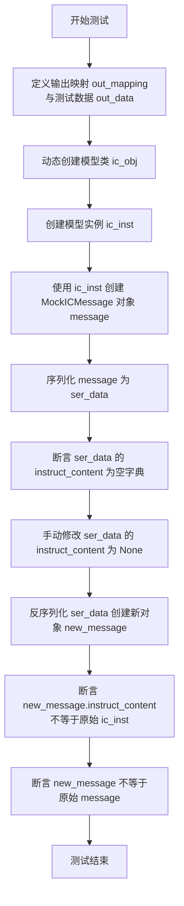

#### 带注释源码

```python
def test_message_without_postprocess():
    """to explain `instruct_content` from `create_model_class` should be postprocessed"""
    # 1. 定义测试数据：一个包含列表字段的映射和对应的值。
    out_mapping = {"field1": (list[str], ...)}
    out_data = {"field1": ["field1 value1", "field1 value2"]}
    
    # 2. 使用 ActionNode 动态创建一个名为 "code" 的 Pydantic 模型类。
    ic_obj = ActionNode.create_model_class("code", out_mapping)
    
    # 3. 使用上一步创建的模型类和测试数据，实例化一个对象作为 instruct_content。
    #    然后，使用这个 instruct_content 创建一个 MockICMessage 对象。
    #    MockICMessage 是 Message 的一个子类，可能未实现完整的 postprocess 逻辑。
    message = MockICMessage(content="code", instruct_content=ic_obj(**out_data))
    
    # 4. 将 message 对象序列化为字典。
    ser_data = message.model_dump()
    
    # 5. 关键断言：由于 MockICMessage 可能缺少正确的后处理，
    #    序列化后的 instruct_content 是一个空字典，而不是包含数据的字典。
    assert ser_data["instruct_content"] == {}
    
    # 6. 手动修改序列化数据，将 instruct_content 设置为 None，模拟反序列化输入。
    ser_data["instruct_content"] = None
    
    # 7. 使用修改后的序列化数据反序列化，创建一个新的 MockICMessage 对象。
    new_message = MockICMessage(**ser_data)
    
    # 8. 断言：新对象的 instruct_content 与原始动态创建的模型实例不相等。
    #    因为反序列化过程无法从空字典或None重建复杂的动态模型对象。
    assert new_message.instruct_content != ic_obj(**out_data)
    
    # 9. 最终断言：新旧两个 Message 对象不相等，证明了序列化/反序列化环路的断裂。
    assert new_message != message
```

### `test_message_serdeser_from_basecontext`

该函数是一个单元测试，用于验证 `Message` 类与从 `BaseContext` 派生的类（如 `Document`, `Documents`, `CodingContext`, `TestingContext`）进行序列化（`model_dump`）和反序列化（`Message(**ser_data)`）的正确性。它测试了包含这些复杂指令内容的 `Message` 对象在序列化后能完整保留数据，并且反序列化后能重建出与原对象相等的对象。

参数：
- 无显式参数。它是一个单元测试函数，通过内部创建对象和调用方法进行测试。

返回值：`None`，单元测试函数通常不返回值，而是通过断言（`assert`）来验证逻辑。

#### 流程图

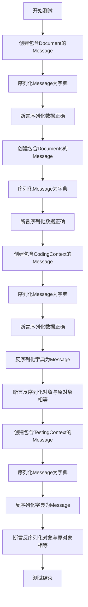

#### 带注释源码

```python
def test_message_serdeser_from_basecontext():
    # 测试1: 使用Document作为instruct_content
    doc_msg = Message(content="test_document", instruct_content=Document(content="test doc"))
    ser_data = doc_msg.model_dump()  # 序列化Message对象为字典
    # 验证序列化后的字典中，instruct_content字段的值正确
    assert ser_data["instruct_content"]["value"]["content"] == "test doc"
    assert ser_data["instruct_content"]["value"]["filename"] == ""

    # 测试2: 使用Documents（包含多个Document）作为instruct_content
    docs_msg = Message(
        content="test_documents", instruct_content=Documents(docs={"doc1": Document(content="test doc")})
    )
    ser_data = docs_msg.model_dump()
    # 验证序列化后的字典结构正确
    assert ser_data["instruct_content"]["class"] == "Documents"
    assert ser_data["instruct_content"]["value"]["docs"]["doc1"]["content"] == "test doc"
    assert ser_data["instruct_content"]["value"]["docs"]["doc1"]["filename"] == ""

    # 测试3: 使用CodingContext作为instruct_content
    code_ctxt = CodingContext(
        filename="game.py",
        design_doc=Document(root_path="docs/system_design", filename="xx.json", content="xxx"),
        task_doc=Document(root_path="docs/tasks", filename="xx.json", content="xxx"),
        code_doc=Document(root_path="xxx", filename="game.py", content="xxx"),
    )
    code_ctxt_msg = Message(content="coding_context", instruct_content=code_ctxt)
    ser_data = code_ctxt_msg.model_dump()
    assert ser_data["instruct_content"]["class"] == "CodingContext"  # 验证类名正确序列化

    # 反序列化：使用序列化后的字典重建Message对象
    new_code_ctxt_msg = Message(**ser_data)
    # 验证反序列化后的对象与原对象相等
    assert new_code_ctxt_msg.instruct_content == code_ctxt
    # 验证嵌套对象的属性正确恢复
    assert new_code_ctxt_msg.instruct_content.code_doc.filename == "game.py"
    assert new_code_ctxt_msg == code_ctxt_msg  # 验证整个Message对象相等

    # 测试4: 使用TestingContext作为instruct_content
    testing_ctxt = TestingContext(
        filename="test.py",
        code_doc=Document(root_path="xxx", filename="game.py", content="xxx"),
        test_doc=Document(root_path="docs/tests", filename="test.py", content="xxx"),
    )
    testing_ctxt_msg = Message(content="testing_context", instruct_content=testing_ctxt)
    ser_data = testing_ctxt_msg.model_dump()
    new_testing_ctxt_msg = Message(**ser_data)
    # 验证反序列化后的对象与原对象相等
    assert new_testing_ctxt_msg.instruct_content == testing_ctxt
    assert new_testing_ctxt_msg.instruct_content.test_doc.filename == "test.py"
    assert new_testing_ctxt_msg == testing_ctxt_msg
```

### `Message.model_dump`

该方法用于将 `Message` 实例序列化为一个字典，以便于存储或传输。它处理了 `instruct_content` 字段的特殊序列化逻辑，确保复杂对象（如 Pydantic 模型）能被正确转换为字典形式。

参数：

- `self`：`Message` 实例，表示要序列化的消息对象。
- `**kwargs`：`Any`，传递给底层 Pydantic `model_dump` 方法的额外关键字参数。

返回值：`dict`，包含 `Message` 实例所有字段的序列化字典表示。

#### 流程图

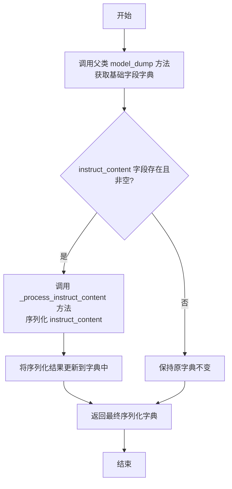

#### 带注释源码

```python
def model_dump(self, **kwargs) -> dict:
    """
    序列化 Message 实例为字典。
    
    此方法重写了 Pydantic 的 model_dump，专门处理 `instruct_content` 字段。
    如果 `instruct_content` 存在，它会调用 `_process_instruct_content` 方法
    将其转换为可序列化的字典格式，然后合并到基础序列化结果中。
    
    Args:
        **kwargs: 传递给底层 Pydantic model_dump 方法的额外参数。
    
    Returns:
        dict: 包含所有字段序列化结果的字典。
    """
    # 调用父类（BaseModel）的 model_dump 方法获取基础字段的字典
    ser_data = super().model_dump(**kwargs)
    
    # 检查 instruct_content 字段是否存在且不为 None
    if self.instruct_content:
        # 处理 instruct_content，将其转换为字典格式
        ser_ic = self._process_instruct_content(self.instruct_content)
        # 将处理后的 instruct_content 字典更新到总序列化数据中
        ser_data.update(ser_ic)
    
    # 返回完整的序列化字典
    return ser_data
```

### `Message.__init__`

`Message.__init__` 方法是 `Message` 类的构造函数，用于初始化一个消息实例。它接收消息内容、指令内容、角色、原因等参数，并设置相应的字段。该方法还负责处理指令内容的序列化和反序列化逻辑，确保消息对象在创建时具有正确的状态。

参数：

- `content`：`str`，消息的文本内容
- `instruct_content`：`Any`，指令内容，可以是任何类型的对象，通常用于存储结构化数据
- `role`：`str`，消息的发送者角色，例如 "engineer"
- `cause_by`：`Any`，触发此消息的原因，通常是一个动作类
- `sent_from`：`str`，消息的发送者
- `send_to`：`str`，消息的接收者

返回值：`None`，构造函数不返回任何值

#### 流程图

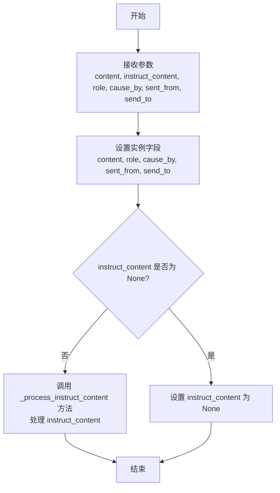

#### 带注释源码

```python
def __init__(
    self,
    content: str,
    instruct_content: Any = None,
    role: str = "user",  # 发送者角色，默认为 "user"
    cause_by: Any = None,  # 触发此消息的原因，可以是任何类型
    sent_from: str = "",
    send_to: str = "",
):
    # 设置消息的基本属性
    self.content = content  # 消息的文本内容
    self.role = role  # 发送者角色
    self.cause_by = cause_by  # 触发此消息的原因
    self.sent_from = sent_from  # 消息的发送者
    self.send_to = send_to  # 消息的接收者

    # 处理指令内容
    if instruct_content is None:
        self.instruct_content = None  # 如果指令内容为空，设置为 None
    else:
        # 调用内部方法处理指令内容，确保其格式正确
        self.instruct_content = self._process_instruct_content(instruct_content)
```

### `ActionNode.create_model_class`

该方法用于动态创建一个Pydantic模型类，该模型类基于提供的字段映射（out_mapping）进行定义。它主要用于在运行时生成结构化的指令内容（instruct_content）类，这些类可以用于序列化和反序列化消息中的结构化数据。

参数：

- `class_name`：`str`，要创建的模型类的名称。
- `out_mapping`：`dict[str, tuple[type, ...]]`，一个字典，其中键是字段名，值是一个元组，包含字段的类型和Pydantic的`...`（表示必填字段）或其他字段配置。

返回值：`type[pydantic.BaseModel]`，返回一个动态生成的Pydantic模型类。

#### 流程图

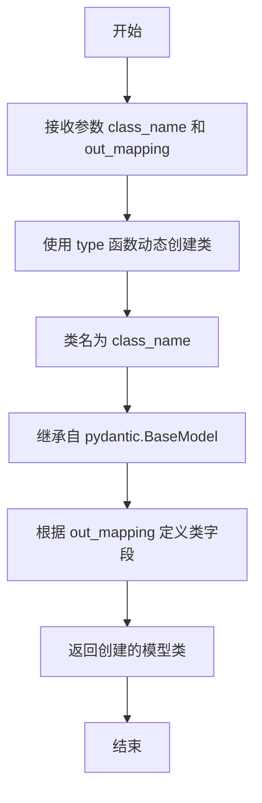

#### 带注释源码

```python
@classmethod
def create_model_class(cls, class_name: str, out_mapping: dict[str, tuple[type, ...]]) -> type[BaseModel]:
    """
    动态创建一个Pydantic模型类。

    该方法根据提供的字段映射（out_mapping）动态生成一个Pydantic模型类。
    这在需要根据运行时信息创建结构化数据模型时非常有用，例如在生成指令内容时。

    Args:
        class_name (str): 要创建的模型类的名称。
        out_mapping (dict[str, tuple[type, ...]]): 字段映射字典。
            键是字段名，值是一个元组，通常包含字段类型和Pydantic的`...`（表示必填字段）。

    Returns:
        type[BaseModel]: 动态生成的Pydantic模型类。

    Example:
        >>> out_mapping = {"field1": (str, ...), "field2": (list[int], ...)}
        >>> ModelClass = ActionNode.create_model_class("MyModel", out_mapping)
        >>> instance = ModelClass(field1="hello", field2=[1, 2, 3])
        >>> print(instance.field1)  # 输出: hello
    """
    # 使用 type 函数动态创建类。第一个参数是类名，第二个是基类元组，第三个是类的属性字典。
    # 这里，我们根据 out_mapping 构建类的字段定义。
    model_class = type(
        class_name,  # 动态生成的类名
        (BaseModel,),  # 继承自 pydantic.BaseModel
        {"__annotations__": {k: v[0] for k, v in out_mapping.items()}, **out_mapping},  # 定义类的字段注解和默认值
    )
    return model_class  # 返回创建的模型类
```

### `Document.model_dump`

`Document.model_dump` 是 Pydantic 模型 `Document` 的实例方法，用于将模型实例序列化为一个字典。该方法继承自 Pydantic 的 `BaseModel`，负责将模型的所有字段（包括通过 `Field` 定义的字段）及其值转换为一个标准的 Python 字典，以便于 JSON 序列化、存储或传输。在序列化过程中，它会处理字段别名、排除默认值等配置。

参数：

- `self`：`Document` 类型，表示 `Document` 模型的一个实例。
- `mode`：`str` 类型，默认为 `'python'`。指定序列化的模式。`'python'` 模式返回 Python 原生字典；`'json'` 模式返回一个 JSON 字符串。
- `include`：`Union[AbstractSetIntStr, MappingIntStrAny]` 类型，可选。指定需要包含在输出字典中的字段。
- `exclude`：`Union[AbstractSetIntStr, MappingIntStrAny]` 类型，可选。指定需要从输出字典中排除的字段。
- `by_alias`：`bool` 类型，默认为 `False`。如果为 `True`，则使用字段别名作为字典的键；否则使用字段的原始名称。
- `exclude_unset`：`bool` 类型，默认为 `False`。如果为 `True`，则排除未设置的字段（即保持默认值的字段）。
- `exclude_defaults`：`bool` 类型，默认为 `False`。如果为 `True`，则排除等于默认值的字段。
- `exclude_none`：`bool` 类型，默认为 `False`。如果为 `True`，则排除值为 `None` 的字段。
- `round_trip`：`bool` 类型，默认为 `False`。如果为 `True`，则序列化和反序列化应能保持数据不变。
- `warnings`：`bool` 类型，默认为 `True`。是否在序列化过程中显示警告。

返回值：`dict` 类型，返回一个包含模型字段名和对应值的字典。

#### 流程图

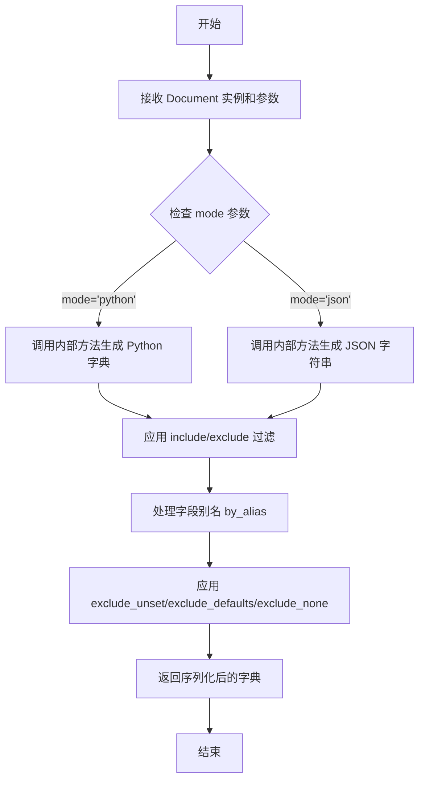

#### 带注释源码

```python
def model_dump(
    self,
    *,
    mode: Literal['json', 'python'] = 'python',
    include: Union[AbstractSetIntStr, MappingIntStrAny] = None,
    exclude: Union[AbstractSetIntStr, MappingIntStrAny] = None,
    by_alias: bool = False,
    exclude_unset: bool = False,
    exclude_defaults: bool = False,
    exclude_none: bool = False,
    round_trip: bool = False,
    warnings: bool = True,
) -> dict:
    """
    将模型实例序列化为字典。
    
    参数:
        mode: 序列化模式，'python' 返回字典，'json' 返回 JSON 字符串。
        include: 指定包含的字段。
        exclude: 指定排除的字段。
        by_alias: 是否使用字段别名。
        exclude_unset: 是否排除未设置的字段。
        exclude_defaults: 是否排除等于默认值的字段。
        exclude_none: 是否排除值为 None 的字段。
        round_trip: 是否确保序列化和反序列化数据一致。
        warnings: 是否显示警告。
        
    返回:
        序列化后的字典。
    """
    # 调用 Pydantic BaseModel 的 model_dump 方法
    return super().model_dump(
        mode=mode,
        include=include,
        exclude=exclude,
        by_alias=by_alias,
        exclude_unset=exclude_unset,
        exclude_defaults=exclude_defaults,
        exclude_none=exclude_none,
        round_trip=round_trip,
        warnings=warnings,
    )
```

### `Document.__init__`

`Document.__init__` 是 `Document` 类的构造函数，用于初始化一个文档对象。它接受文档内容、文件名和根路径等参数，并设置相应的类字段。

参数：

- `content`：`str`，文档的文本内容
- `filename`：`str`，文档的文件名，默认为空字符串
- `root_path`：`str`，文档的根路径，默认为空字符串

返回值：`None`，构造函数不返回任何值

#### 流程图

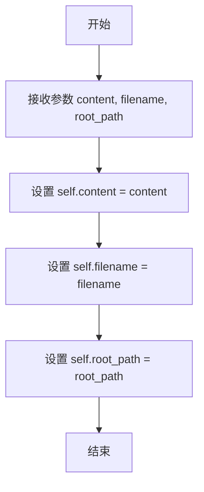

#### 带注释源码

```python
def __init__(self, content: str = "", filename: str = "", root_path: str = ""):
    """
    初始化 Document 对象。

    Args:
        content (str): 文档的文本内容，默认为空字符串。
        filename (str): 文档的文件名，默认为空字符串。
        root_path (str): 文档的根路径，默认为空字符串。
    """
    self.content = content  # 设置文档内容
    self.filename = filename  # 设置文档文件名
    self.root_path = root_path  # 设置文档根路径
```

### `Documents.model_dump`

该方法用于将`Documents`对象序列化为一个字典，以便于存储或传输。它继承自Pydantic的`BaseModel.model_dump`方法，将对象的所有字段（包括嵌套的`Document`对象）转换为标准的Python数据类型。

参数：

-  `self`：`Documents`，`Documents`类的实例
-  `*args`：`tuple`，传递给父类`model_dump`方法的可变位置参数
-  `**kwargs`：`dict`，传递给父类`model_dump`方法的关键字参数

返回值：`dict`，包含`Documents`对象所有字段及其值的字典

#### 流程图

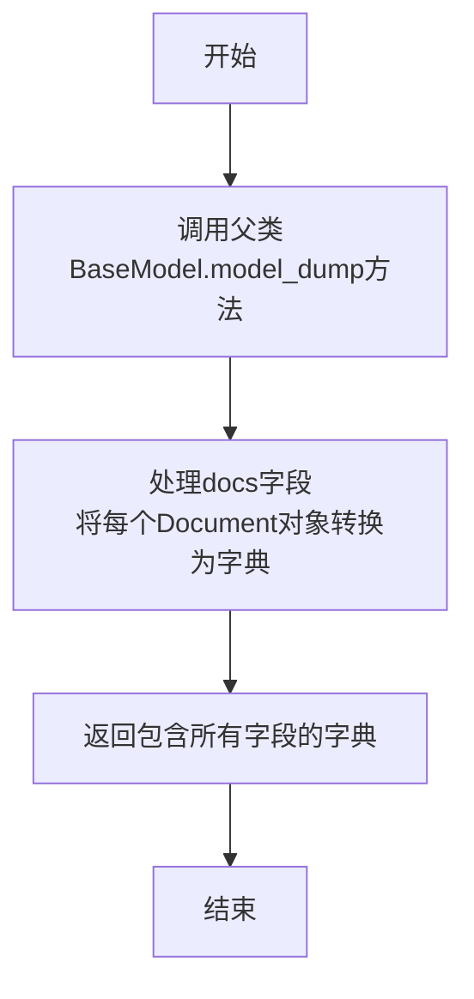

#### 带注释源码

```python
def model_dump(self, *args, **kwargs) -> dict:
    """
    将Documents对象序列化为字典。
    
    该方法重写了Pydantic BaseModel的model_dump方法，确保docs字段中的
    每个Document对象都能被正确序列化为字典格式。
    
    Args:
        *args: 传递给父类model_dump方法的可变位置参数
        **kwargs: 传递给父类model_dump方法的关键字参数
        
    Returns:
        dict: 包含所有字段值的字典，其中docs字段的值是Document对象字典的映射
    """
    # 调用父类的model_dump方法获取基础序列化结果
    data = super().model_dump(*args, **kwargs)
    
    # 特殊处理docs字段，确保每个Document对象都被序列化
    if "docs" in data and data["docs"]:
        # 将docs字典中的每个Document对象转换为字典
        data["docs"] = {
            key: doc.model_dump() if hasattr(doc, "model_dump") else doc
            for key, doc in data["docs"].items()
        }
    
    return data
```

### `Documents.__init__`

初始化一个`Documents`实例，用于管理一组`Document`对象。该方法接受一个可选的字典参数，用于初始化内部的文档集合。

参数：

- `docs`：`Optional[Dict[str, Document]]`，一个可选的字典，键为文档标识符，值为`Document`对象。如果未提供，则初始化为空字典。

返回值：`None`，无返回值。

#### 流程图

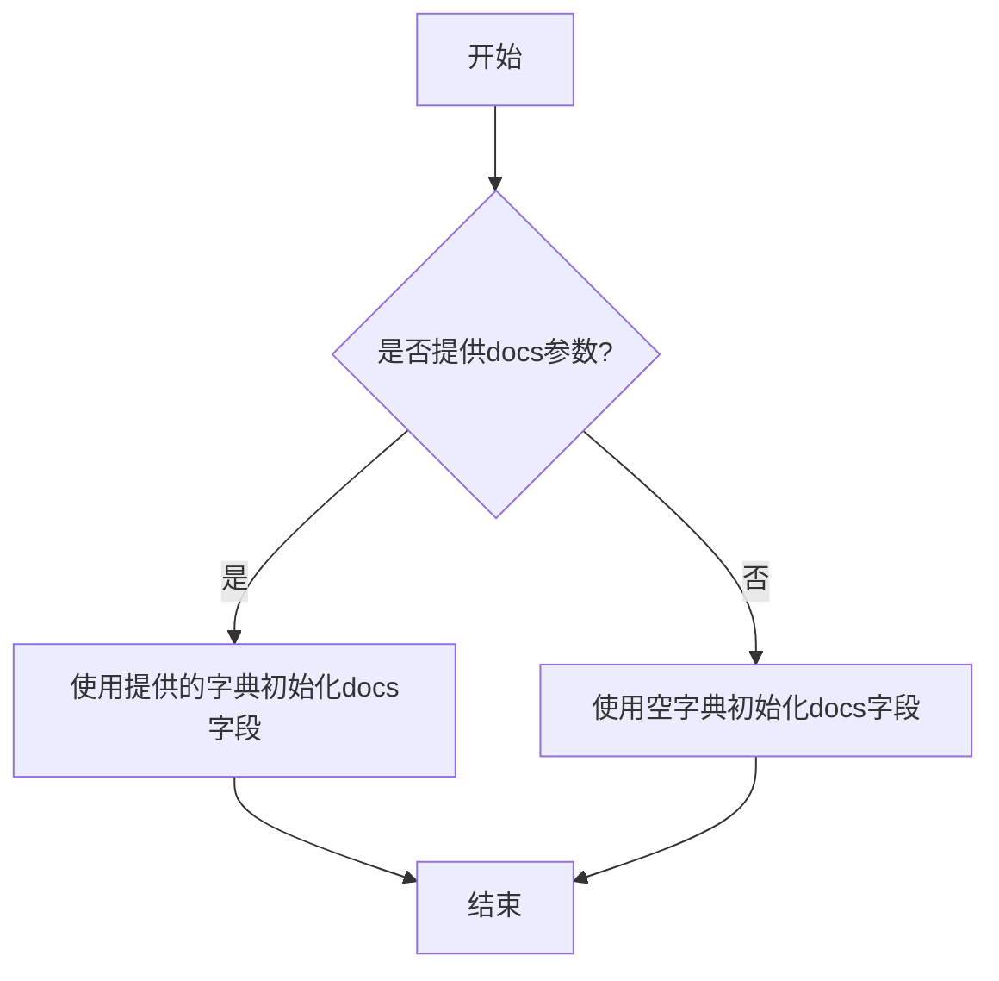

#### 带注释源码

```python
def __init__(self, docs: Optional[Dict[str, Document]] = None):
    # 如果提供了docs参数，则使用它初始化self.docs；否则初始化为空字典
    self.docs = docs or {}
```

### `CodingContext.model_dump`

该方法用于将`CodingContext`实例序列化为一个字典，以便于存储或传输。它继承自Pydantic的`BaseModel.model_dump`方法，将模型的所有字段（包括嵌套的`Document`对象）转换为标准的Python数据类型（如`dict`, `list`, `str`, `int`等）。

参数：

-  `self`：`CodingContext`，`CodingContext`类的实例。
-  `mode`：`str`， 序列化模式，例如 `'python'` 或 `'json'`，默认为 `'python'`。
-  `include`：`Union[AbstractSetIntStr, MappingIntStrAny]`， 指定需要包含的字段。
-  `exclude`：`Union[AbstractSetIntStr, MappingIntStrAny]`， 指定需要排除的字段。
-  `by_alias`：`bool`， 是否使用字段的别名作为键。
-  `exclude_unset`：`bool`， 是否排除未设置的字段（即使用默认值的字段）。
-  `exclude_defaults`：`bool`， 是否排除等于默认值的字段。
-  `exclude_none`：`bool`， 是否排除值为`None`的字段。
-  `round_trip`：`bool`， 是否支持序列化后反序列化回原对象。
-  `warnings`：`bool`， 是否在序列化过程中显示警告。

返回值：`dict`，一个包含`CodingContext`实例所有字段数据的字典。

#### 流程图

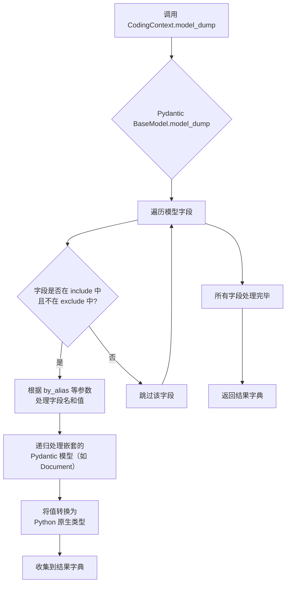

#### 带注释源码

```python
def model_dump(
    self,
    *,
    mode: Literal['json', 'python'] = 'python',
    include: Union[AbstractSetIntStr, MappingIntStrAny] = None,
    exclude: Union[AbstractSetIntStr, MappingIntStrAny] = None,
    by_alias: bool = False,
    exclude_unset: bool = False,
    exclude_defaults: bool = False,
    exclude_none: bool = False,
    round_trip: bool = False,
    warnings: bool = True,
) -> Dict[str, Any]:
    """
    将模型实例序列化为字典。
    这是对 Pydantic BaseModel.model_dump 方法的重写/继承。
    
    Args:
        mode: 输出模式，'python' 返回 Python 对象，'json' 返回可 JSON 序列化的对象。
        include: 指定要包含的字段。
        exclude: 指定要排除的字段。
        by_alias: 是否使用字段别名。
        exclude_unset: 是否排除未设置的字段。
        exclude_defaults: 是否排除等于默认值的字段。
        exclude_none: 是否排除值为 None 的字段。
        round_trip: 是否确保序列化结果可以反序列化回相同的模型。
        warnings: 是否发出序列化警告。
        
    Returns:
        包含模型数据的字典。
    """
    # 此方法的具体实现在 Pydantic 的 BaseModel 中。
    # 对于 CodingContext，它会处理以下字段：
    # - filename: str
    # - design_doc: Document
    # - task_doc: Document
    # - code_doc: Document
    # 并递归调用这些 Document 对象的 model_dump 方法。
    return super().model_dump(
        mode=mode,
        include=include,
        exclude=exclude,
        by_alias=by_alias,
        exclude_unset=exclude_unset,
        exclude_defaults=exclude_defaults,
        exclude_none=exclude_none,
        round_trip=round_trip,
        warnings=warnings,
    )
```

### `CodingContext.__init__`

初始化一个CodingContext实例，用于封装与代码生成相关的上下文信息，包括文件名、设计文档、任务文档和代码文档。

参数：

- `filename`：`str`，要生成的代码文件名
- `design_doc`：`Document`，系统设计文档
- `task_doc`：`Document`，任务描述文档
- `code_doc`：`Document`，生成的代码文档

返回值：`None`，无返回值

#### 流程图

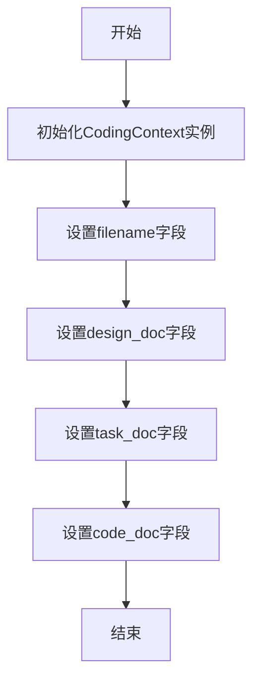

#### 带注释源码

```python
def __init__(
    self,
    filename: str,
    design_doc: Document,
    task_doc: Document,
    code_doc: Document,
):
    # 设置代码文件名
    self.filename = filename
    # 设置系统设计文档
    self.design_doc = design_doc
    # 设置任务描述文档
    self.task_doc = task_doc
    # 设置生成的代码文档
    self.code_doc = code_doc
```

### `TestingContext.model_dump`

该方法用于将 `TestingContext` 实例序列化为一个字典，以便于存储、传输或进一步处理。它继承自 Pydantic 的 `BaseModel.model_dump` 方法，确保所有字段（包括嵌套的 Pydantic 模型）都能被正确地转换为 Python 原生类型（如 `dict`, `list`, `str`, `int` 等）。

参数：

- `self`：`TestingContext`，`TestingContext` 类的实例。
- `**kwargs`：`Any`，传递给底层 Pydantic `model_dump` 方法的可选关键字参数，用于控制序列化行为（例如，排除某些字段、包含默认值等）。

返回值：`dict`，一个包含 `TestingContext` 实例所有字段及其值的字典。字典的键是字段名，值是字段对应的序列化后的数据。

#### 流程图

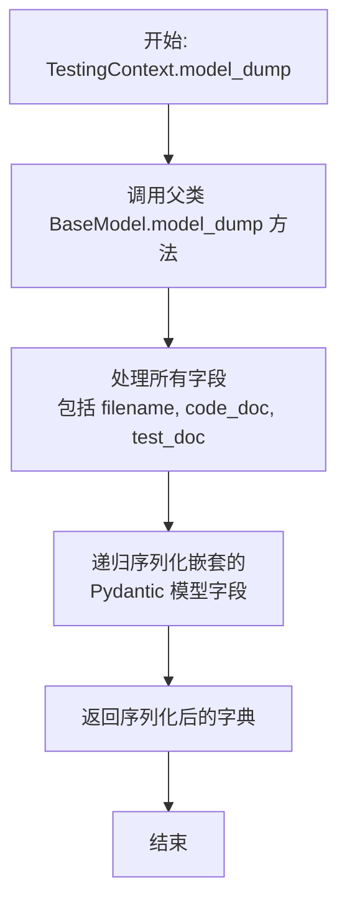

#### 带注释源码

```python
def model_dump(
    self,
    **kwargs: Any,  # 接收控制序列化的可选参数，如 mode, include, exclude, by_alias 等
) -> dict:  # 返回一个表示对象状态的字典
    """
    继承自 Pydantic BaseModel 的方法。
    将 TestingContext 实例及其所有字段（包括嵌套的 Document 对象）转换为字典。
    这是序列化过程的核心步骤，用于生成可 JSON 序列化的数据。
    """
    # 实际实现由 Pydantic 的 BaseModel 提供。
    # 此方法会遍历 TestingContext 的所有字段：
    # 1. `filename: str`
    # 2. `code_doc: Document`
    # 3. `test_doc: Document`
    # 对于 `code_doc` 和 `test_doc` 这两个 Document 类型的字段，
    # Pydantic 会递归调用它们的 model_dump 方法，确保整个对象树都被序列化。
    return super().model_dump(**kwargs)
```

### `TestingContext.__init__`

`TestingContext.__init__` 是 `TestingContext` 数据类的构造函数，用于初始化一个测试上下文对象。该对象封装了与测试相关的关键信息，包括被测试代码的文件名、代码文档和测试文档。

参数：

- `filename`：`str`，被测试代码的文件名（例如 "game.py"）
- `code_doc`：`Document`，包含被测试代码详细信息的文档对象
- `test_doc`：`Document`，包含测试代码详细信息的文档对象

返回值：`None`，构造函数不返回任何值

#### 流程图

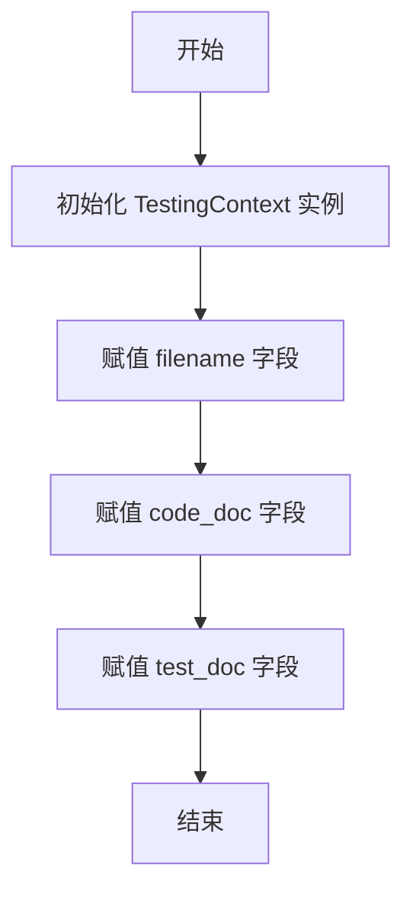

#### 带注释源码

```python
def __init__(self, filename: str, code_doc: Document, test_doc: Document):
    # 初始化 TestingContext 实例
    # filename: 被测试代码的文件名
    # code_doc: 包含被测试代码详细信息的文档对象
    # test_doc: 包含测试代码详细信息的文档对象
    self.filename = filename
    self.code_doc = code_doc
    self.test_doc = test_doc
```

### `MockICMessage.model_dump`

该方法用于将`MockICMessage`实例序列化为一个字典。它继承自Pydantic的`BaseModel.model_dump`方法，用于生成一个包含模型所有字段及其值的字典表示，通常用于JSON序列化或数据持久化。

参数：
- `self`：`MockICMessage`，`MockICMessage`类的实例。
- `*args`：`tuple`，传递给父类`model_dump`方法的可变位置参数。
- `**kwargs`：`dict`，传递给父类`model_dump`方法的关键字参数。

返回值：`dict`，返回一个包含`MockICMessage`实例所有字段及其值的字典。

#### 流程图

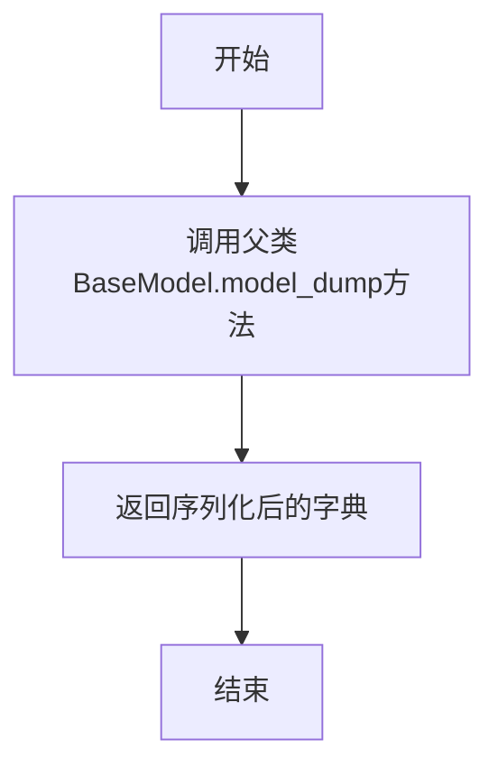

#### 带注释源码

```python
def model_dump(self, *args, **kwargs):
    """
    将MockICMessage实例序列化为字典。
    继承自Pydantic的BaseModel.model_dump方法。
    
    Args:
        *args: 传递给父类model_dump方法的可变位置参数。
        **kwargs: 传递给父类model_dump方法的关键字参数。
    
    Returns:
        dict: 包含实例所有字段及其值的字典。
    """
    return super().model_dump(*args, **kwargs)
```

### `MockICMessage.__init__`

该方法用于初始化`MockICMessage`类的实例，继承自`Message`类，主要用于测试场景中模拟带有指令内容的消息对象。它通过调用父类的初始化方法，设置消息的内容、指令内容、角色和触发原因等属性。

参数：

- `content`：`str`，消息的文本内容
- `instruct_content`：`Any`，消息的指令内容，可以是任意类型
- `role`：`str`，消息发送者的角色
- `cause_by`：`Any`，触发该消息的原因，可以是任意类型

返回值：`None`，无返回值

#### 流程图

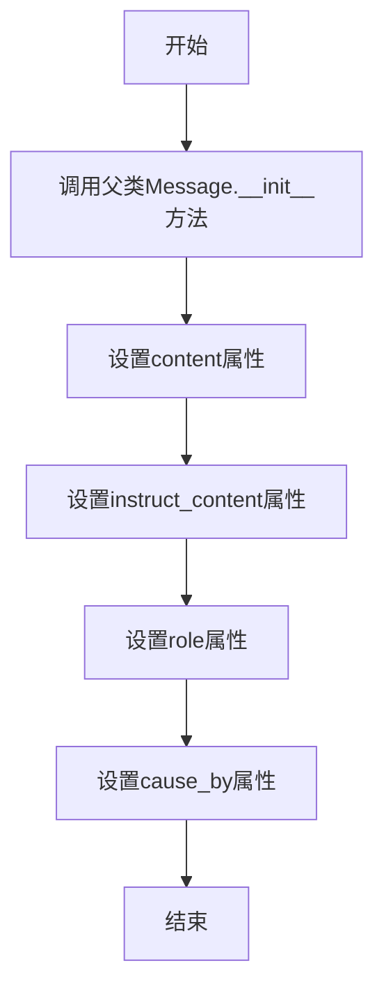

#### 带注释源码

```python
def __init__(self, content: str, instruct_content: Any = None, role: str = "user", cause_by: Any = None):
    """
    初始化MockICMessage实例。

    Args:
        content (str): 消息的文本内容。
        instruct_content (Any, optional): 消息的指令内容，默认为None。
        role (str, optional): 消息发送者的角色，默认为"user"。
        cause_by (Any, optional): 触发该消息的原因，默认为None。
    """
    super().__init__(content=content, instruct_content=instruct_content, role=role, cause_by=cause_by)
```

### `MockMessage.model_dump`

该方法用于将`MockMessage`实例序列化为一个字典。它继承自Pydantic的`BaseModel.model_dump`方法，用于将模型实例转换为一个包含其字段和值的字典，以便于序列化（如转换为JSON）或用于其他需要字典格式的场景。

参数：
- `self`：`MockMessage`，`MockMessage`类的实例。
- `*args`：`tuple`，传递给父类`model_dump`方法的可变位置参数。
- `**kwargs`：`dict`，传递给父类`model_dump`方法的关键字参数，例如`include`、`exclude`、`by_alias`等。

返回值：`dict`，返回一个字典，其中包含`MockMessage`实例所有字段的名称和对应的值。

#### 流程图

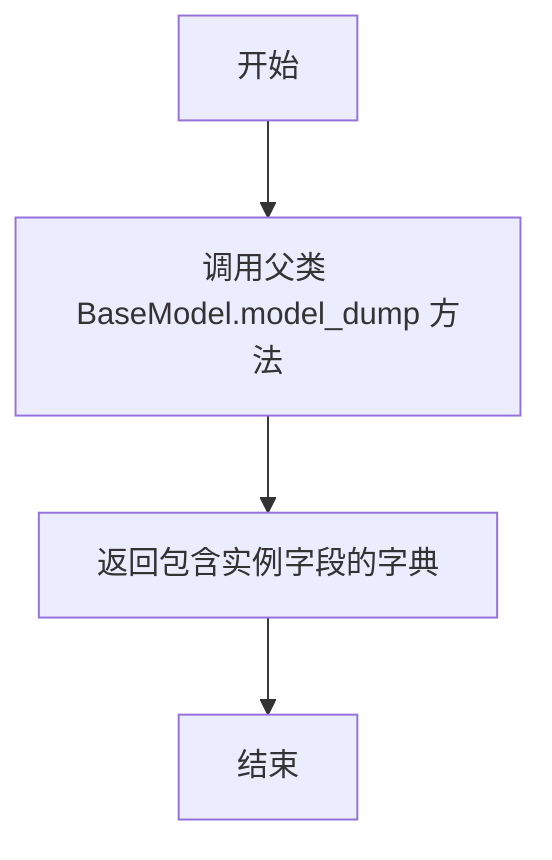

#### 带注释源码

```python
def model_dump(self, *args, **kwargs):
    """
    将模型实例序列化为字典。
    继承自 Pydantic BaseModel 的 model_dump 方法。
    
    Args:
        *args: 传递给父类方法的位置参数。
        **kwargs: 传递给父类方法的关键字参数。
        
    Returns:
        dict: 包含模型字段和值的字典。
    """
    return super().model_dump(*args, **kwargs)
```

### `MockMessage.__init__`

该方法用于初始化`MockMessage`类的实例，通常用于测试中模拟`Message`对象的行为。它继承自父类的`__init__`方法，并可能设置一些默认值或特定属性以支持测试场景。

参数：
- `self`：`MockMessage`，当前实例的引用
- `*args`：`tuple`，可变位置参数，传递给父类初始化方法
- `**kwargs`：`dict`，可变关键字参数，传递给父类初始化方法

返回值：`None`，无返回值

#### 流程图

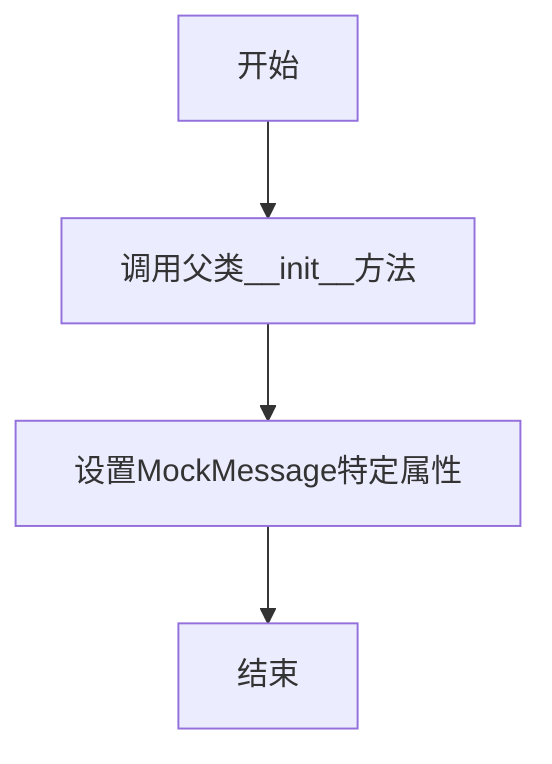

#### 带注释源码

```python
def __init__(self, *args, **kwargs):
    """
    初始化MockMessage实例。
    
    该方法通过调用父类的__init__方法并传递所有参数来初始化实例。
    在测试中，MockMessage通常用于模拟Message对象，可能设置默认值或特定属性。
    
    Args:
        *args: 可变位置参数，传递给父类初始化方法。
        **kwargs: 可变关键字参数，传递给父类初始化方法。
    """
    super().__init__(*args, **kwargs)  # 调用父类的初始化方法
    # 这里可以添加MockMessage特有的初始化逻辑，例如设置默认属性值
```

## 关键组件

### Message 类

用于在智能体间传递信息，包含内容、发送者角色、触发动作以及结构化的指令内容（instruct_content），支持序列化与反序列化。

### ActionNode.create_model_class 方法

动态创建 Pydantic 模型类，用于定义和验证 `Message` 中 `instruct_content` 字段的结构化数据格式。

### instruct_content 字段

`Message` 类的核心字段，用于承载结构化的指令或上下文数据，支持多种类型（如动态创建的 Pydantic 模型实例或 `Document`、`CodingContext` 等预定义类型），并需在序列化/反序列化时进行特殊处理。

### Document 类

表示一个文档对象，包含内容、文件名、根路径等元数据，可作为 `Message` 中 `instruct_content` 的一种具体类型。

### Documents 类

一个文档集合，以字典形式管理多个 `Document` 对象，可作为 `Message` 中 `instruct_content` 的一种具体类型。

### CodingContext 类

表示编码任务的上下文信息，包含相关的设计文档、任务文档和代码文档，可作为 `Message` 中 `instruct_content` 的一种具体类型。

### TestingContext 类

表示测试任务的上下文信息，包含相关的代码文档和测试文档，可作为 `Message` 中 `instruct_content` 的一种具体类型。

## 问题及建议


### 已知问题

-   **序列化/反序列化逻辑不一致**：`test_message_without_postprocess` 测试用例揭示了 `MockICMessage` 类（或其基类）在序列化 `instruct_content` 时存在缺陷。当 `instruct_content` 是由 `ActionNode.create_model_class` 创建的动态 Pydantic 模型实例时，序列化后的数据为空字典 `{}`，导致反序列化后无法恢复原始对象，破坏了数据完整性。
-   **异常处理粒度较粗**：`test_message_serdeser_from_create_model` 函数开头使用 `pytest.raises(KeyError)` 来捕获 `Message` 初始化时的异常。这表明当传入的 `instruct_content` 是一个普通字典而非有效的 `InstructContent` 类型时，会抛出 `KeyError`。这种错误类型不够具体，不利于调用者区分是数据格式错误还是其他键错误。
-   **测试用例存在潜在脆弱性**：测试用例 `test_message_serdeser_from_create_model` 中使用了 `any_to_str(WriteCode)` 进行断言。`any_to_str` 函数的实现和稳定性直接影响测试的可靠性。如果该函数的逻辑发生变化（例如，返回的字符串格式改变），可能导致测试失败，即使核心的序列化功能正常。
-   **依赖不明确的测试工具类**：测试代码依赖于外部定义的 `MockICMessage` 和 `MockMessage` 类。这些类的内部实现（特别是 `MockICMessage` 的序列化行为）对于理解当前测试失败的原因至关重要，但其定义不在当前代码片段中，增加了理解和维护测试的难度。

### 优化建议

-   **修复 `MockICMessage` 的序列化行为**：应调查 `MockICMessage` 或其基类（可能是 `Message`）中 `model_dump` 或相关序列化方法的实现。确保由 `ActionNode.create_model_class` 生成的动态 Pydantic 模型实例能够被正确序列化和反序列化。可能需要重写 `model_dump` 方法或为这些动态类实现自定义的序列化逻辑。
-   **使用更精确的异常类型**：建议在 `Message` 类的初始化方法中，对 `instruct_content` 参数进行更严格的类型或结构验证。当传入无效的字典时，抛出更具语义的异常，例如 `ValueError` 或自定义的 `InvalidInstructContentError`，并附上清晰的错误信息，以提高代码的可调试性。
-   **增强测试的健壮性**：在 `test_message_serdeser_from_create_model` 中，避免直接依赖 `any_to_str` 这类辅助函数的结果进行关键断言。可以考虑直接比较 `cause_by` 属性与 `WriteCode` 类本身（如果支持），或者断言反序列化后的 `cause_by` 能够正确映射回原始的 `WriteCode` 类。同时，应为 `any_to_str` 函数本身编写单元测试。
-   **内联或清晰说明测试工具类**：考虑将 `MockICMessage` 和 `MockMessage` 的定义移至当前测试文件内，或者在其定义处添加明确的注释，说明其设计目的和与 `Message` 类的区别（尤其是 `MockICMessage` 为何会丢失 `instruct_content` 数据）。这有助于其他开发者理解测试场景和失败原因。
-   **补充边界和错误用例测试**：当前测试主要覆盖了正常流程。建议增加更多测试用例，例如：测试 `instruct_content` 为 `None`、空字典、非Pydantic模型对象等边界情况；测试 `Message` 中其他字段（如 `sent_from`, `send_to`）的序列化；测试循环引用或复杂嵌套对象的序列化能力。


## 其它


### 设计目标与约束

本测试代码的设计目标是验证 `metagpt.schema` 模块中 `Message` 类及其相关上下文类（如 `CodingContext`, `Document`, `Documents`, `TestingContext`）的序列化（`model_dump`）与反序列化（通过 `__init__` 或 `model_validate`）功能。核心约束包括：确保 `instruct_content` 字段能够正确序列化和反序列化不同类型的对象（包括由 `ActionNode.create_model_class` 动态创建的 Pydantic 模型、以及预定义的上下文类），并验证序列化后的数据格式符合预期，反序列化后能重建出语义上等价的对象。

### 错误处理与异常设计

测试代码中明确包含了对异常情况的测试。在 `test_message_serdeser_from_create_model` 函数开头，使用 `pytest.raises(KeyError)` 验证当向 `Message` 构造函数传递一个字典形式的 `instruct_content` 时，会抛出 `KeyError` 异常。这体现了设计上要求 `instruct_content` 必须是一个已定义的 Pydantic 模型实例，而不是原始字典，从而在类型安全上进行了约束。其他测试用例则专注于验证正常流程下的正确性，通过断言（`assert`）来确保序列化/反序列化过程无错误且结果符合预期。

### 数据流与状态机

本测试代码不涉及复杂的状态机。其数据流清晰：每个测试函数都遵循“准备输入数据 -> 执行操作（构造对象、序列化、反序列化）-> 验证输出”的模式。数据流的核心是 `Message` 对象及其 `instruct_content` 字段。测试覆盖了多种 `instruct_content` 数据源的流转：1) 动态创建的 Pydantic 模型实例；2) 预定义的 `Document`、`Documents` 实例；3) 复合的上下文对象 `CodingContext` 和 `TestingContext`。验证点在于数据在序列化为字典（`dict`）和反序列化回对象的过程中，内容、类型和结构是否保持一致。

### 外部依赖与接口契约

1.  **Pydantic**: 代码深度依赖 Pydantic 库的 `BaseModel` 来实现数据模型的序列化（`model_dump`）和反序列化（`model_validate`）。`Message` 及其 `instruct_content` 所承载的各类上下文类都是 Pydantic 模型。
2.  **`ActionNode.create_model_class`**: 测试依赖于 `metagpt.actions.action_node.ActionNode` 类的 `create_model_class` 方法，该方法用于动态生成 Pydantic 模型类。这是 `instruct_content` 的一种重要来源，测试验证了由此生成的模型实例能正确参与序列化循环。
3.  **`any_to_str`**: 使用了 `metagpt.utils.common.any_to_str` 函数来处理类引用（如 `WriteCode`）的字符串表示，用于比较 `cause_by` 字段。这定义了 `Message` 类中 `cause_by` 字段序列化后的字符串格式契约。
4.  **`pytest`**: 作为测试框架，用于组织测试用例、捕获异常和运行断言。
5.  **Mock 对象 (`MockICMessage`, `MockMessage`)**: 测试使用了项目中定义的 Mock 类来模拟特定行为（如无后处理的序列化），验证了 `Message` 类对 `instruct_content` 进行特殊后处理的必要性，这定义了 `Message` 类内部处理逻辑的隐含契约。

### 测试策略与覆盖范围

测试策略采用基于场景的单元测试，针对 `Message` 类的序列化/反序列化这一核心功能点，设计了多个具有代表性的场景：
1.  **动态模型场景**: 测试 `instruct_content` 为动态创建的 Pydantic 模型实例时的序列化循环。
2.  **异常输入场景**: 测试传入非法格式的 `instruct_content` 时应抛出异常。
3.  **后处理必要性场景**: 通过 Mock 对象验证，如果 `Message` 子类不执行特定的后处理，序列化动态模型会失败。
4.  **基础上下文场景**: 测试 `instruct_content` 为简单的 `Document` 和 `Documents` 对象。
5.  **复合上下文场景**: 测试 `instruct_content` 为嵌套结构的 `CodingContext` 和 `TestingContext` 对象。
覆盖范围全面，涵盖了 `Message` 类与 `schema` 模块内其他主要类交互的关键路径，确保了数据在不同形态间转换的可靠性。

    