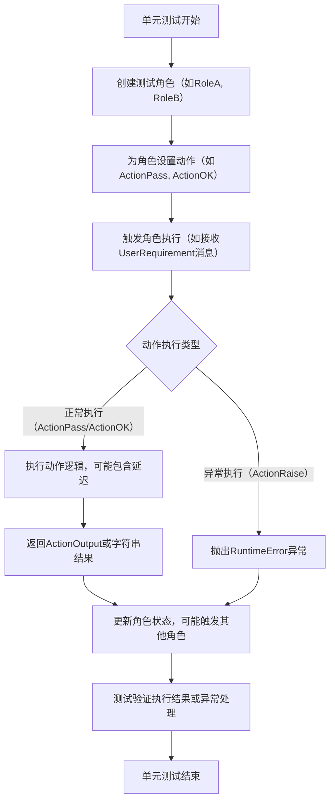
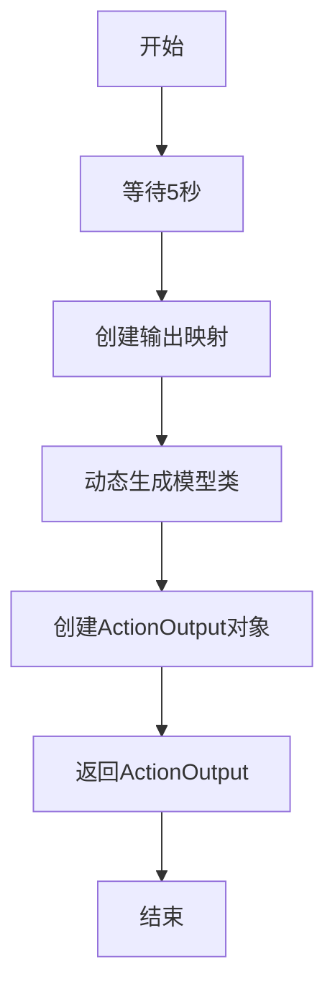
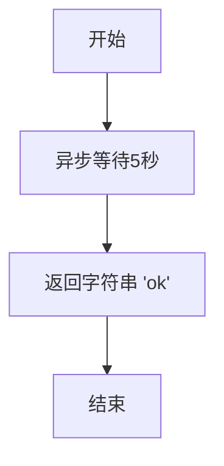
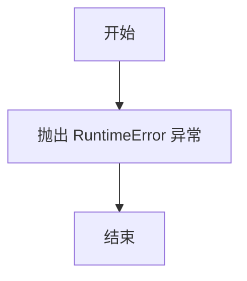
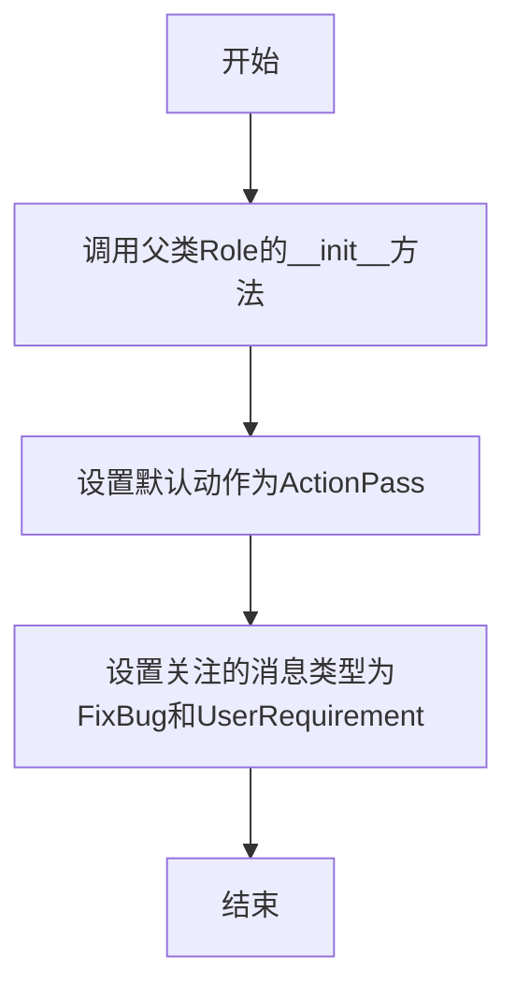
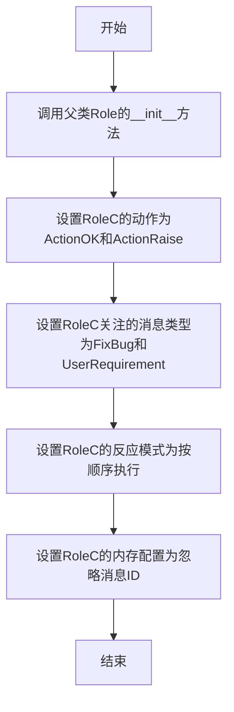

# `.\MetaGPT\tests\metagpt\serialize_deserialize\test_serdeser_base.py` 详细设计文档

该文件定义了一系列用于单元测试的模拟动作（Action）和角色（Role），包括正常执行、异常抛出、消息传递等不同行为的实现，用于测试MetaGPT框架中角色与动作的交互、状态管理及序列化/反序列化功能。

## 整体流程



## 类结构

```
BaseModel (Pydantic基类)
├── MockMessage (模拟消息类)
├── MockICMessage (模拟带指令内容的消息类)
├── Action (MetaGPT动作基类)
│   ├── ActionPass (模拟通过动作)
│   ├── ActionOK (模拟成功动作)
│   ├── ActionRaise (模拟异常动作)
│   └── ActionOKV2 (带额外字段的成功动作)
└── Role (MetaGPT角色基类)
    ├── RoleA (角色A，监听FixBug和UserRequirement)
    ├── RoleB (角色B，按顺序执行，监听ActionPass)
    ├── RoleC (角色C，按顺序执行，忽略消息ID)
    └── RoleD (角色D，基础配置)
```

## 全局变量及字段


### `serdeser_path`
    
用于序列化和反序列化测试的存储路径，指向项目data目录下的serdeser_storage文件夹

类型：`Path`
    


### `MockMessage.content`
    
模拟消息的内容，默认值为'test_msg'

类型：`str`
    


### `MockICMessage.content`
    
模拟指令消息的内容，默认值为'test_ic_msg'

类型：`str`
    


### `MockICMessage.instruct_content`
    
可选的指令内容，用于测试没有后处理的普通字典

类型：`Optional[BaseModel]`
    


### `ActionPass.name`
    
动作类的名称，固定为'ActionPass'

类型：`str`
    


### `ActionOK.name`
    
动作类的名称，固定为'ActionOK'

类型：`str`
    


### `ActionRaise.name`
    
动作类的名称，固定为'ActionRaise'

类型：`str`
    


### `ActionOKV2.name`
    
动作类的名称，固定为'ActionOKV2'

类型：`str`
    


### `ActionOKV2.extra_field`
    
动作类的额外字段，用于存储额外信息，默认值为'ActionOKV2 Extra Info'

类型：`str`
    


### `RoleA.name`
    
角色A的名称，默认值为'RoleA'

类型：`str`
    


### `RoleA.profile`
    
角色A的简介，默认值为'Role A'

类型：`str`
    


### `RoleA.goal`
    
角色A的目标，固定为'RoleA's goal'

类型：`str`
    


### `RoleA.constraints`
    
角色A的约束条件，固定为'RoleA's constraints'

类型：`str`
    


### `RoleB.name`
    
角色B的名称，默认值为'RoleB'

类型：`str`
    


### `RoleB.profile`
    
角色B的简介，默认值为'Role B'

类型：`str`
    


### `RoleB.goal`
    
角色B的目标，固定为'RoleB's goal'

类型：`str`
    


### `RoleB.constraints`
    
角色B的约束条件，固定为'RoleB's constraints'

类型：`str`
    


### `RoleC.name`
    
角色C的名称，默认值为'RoleC'

类型：`str`
    


### `RoleC.profile`
    
角色C的简介，默认值为'Role C'

类型：`str`
    


### `RoleC.goal`
    
角色C的目标，固定为'RoleC's goal'

类型：`str`
    


### `RoleC.constraints`
    
角色C的约束条件，固定为'RoleC's constraints'

类型：`str`
    


### `RoleD.name`
    
角色D的名称，默认值为'RoleD'

类型：`str`
    


### `RoleD.profile`
    
角色D的简介，默认值为'Role D'

类型：`str`
    


### `RoleD.goal`
    
角色D的目标，固定为'RoleD's goal'

类型：`str`
    


### `RoleD.constraints`
    
角色D的约束条件，固定为'RoleD's constraints'

类型：`str`
    
    

## 全局函数及方法

### `ActionPass.run`

该方法是一个异步方法，用于模拟一个通过性动作的执行。它首先等待5秒以模拟耗时操作，然后创建一个动态的ActionNode模型类，并返回一个包含执行结果的ActionOutput对象。

参数：

- `messages`：`list["Message"]`，传入的消息列表，用于触发动作执行，但在此方法中未实际使用。

返回值：`ActionOutput`，返回一个ActionOutput对象，其中包含动作执行的结果信息。

#### 流程图



#### 带注释源码

```python
async def run(self, messages: list["Message"]) -> ActionOutput:
    # 模拟耗时操作，等待5秒，以便其他角色可以观察到执行的消息
    await asyncio.sleep(5)
    
    # 定义输出映射，指定输出字段的名称和类型
    output_mapping = {"result": (str, ...)}
    
    # 动态创建一个名为"pass"的模型类，基于output_mapping定义其结构
    pass_class = ActionNode.create_model_class("pass", output_mapping)
    
    # 创建ActionOutput对象，包含描述信息和动态模型实例
    pass_output = ActionOutput("ActionPass run passed", pass_class(**{"result": "pass result"}))
    
    # 返回ActionOutput对象
    return pass_output
```


### `ActionOK.run`

`ActionOK.run` 方法是 `ActionOK` 动作类的核心执行方法。它是一个异步方法，用于模拟一个耗时操作，并在操作完成后返回一个简单的成功状态字符串。

参数：

-  `messages`：`list["Message"]`，一个消息列表，通常包含触发此动作的上下文信息。在本方法中，此参数未被使用。

返回值：`str`，一个字符串 "ok"，表示动作执行成功。

#### 流程图



#### 带注释源码

```python
async def run(self, messages: list["Message"]) -> str:
    # 使用 asyncio.sleep 模拟一个耗时操作，等待5秒。
    # 这通常用于测试异步并发场景，或者模拟需要等待外部响应的操作。
    await asyncio.sleep(5)
    # 方法执行完毕，返回一个简单的成功标识字符串 "ok"。
    return "ok"
```


### `ActionRaise.run`

该方法是一个异步方法，用于模拟一个会抛出异常的动作执行过程。当调用此方法时，它会立即抛出一个 `RuntimeError` 异常，并附带错误信息 "parse error in ActionRaise"。这通常用于单元测试中，以验证系统在遇到错误时的异常处理能力。

参数：

- `messages`：`list["Message"]`，一个消息列表，表示传递给该动作的输入消息。在本方法中，此参数未被使用。

返回值：`str`，本方法不会正常返回任何值，而是会抛出 `RuntimeError` 异常。

#### 流程图



#### 带注释源码

```python
async def run(self, messages: list["Message"]) -> str:
    # 该方法直接抛出一个 RuntimeError 异常，用于模拟动作执行失败的情况。
    # 异常信息为 "parse error in ActionRaise"，这有助于在测试中识别错误来源。
    raise RuntimeError("parse error in ActionRaise")
```

### `RoleA.__init__`

RoleA类的构造函数，用于初始化RoleA实例。它首先调用父类Role的构造函数，然后设置该角色的默认动作为ActionPass，并设置该角色关注的消息类型为FixBug和UserRequirement。

参数：

- `self`：`RoleA`，RoleA类的实例
- `kwargs`：`dict`，可变关键字参数，用于传递给父类Role的构造函数

返回值：`None`，无返回值

#### 流程图



#### 带注释源码

```python
def __init__(self, **kwargs):
    # 调用父类Role的构造函数，传入可变关键字参数
    super(RoleA, self).__init__(**kwargs)
    # 设置该角色的默认动作为ActionPass
    self.set_actions([ActionPass])
    # 设置该角色关注的消息类型为FixBug和UserRequirement
    self._watch([FixBug, UserRequirement])
```


### `RoleB.__init__`

RoleB类的构造函数，用于初始化RoleB实例。它首先调用父类Role的构造函数，然后设置RoleB的默认行为：将`ActionOK`和`ActionRaise`两个动作设置为该角色的可执行动作，并设置该角色关注（监听）`ActionPass`类型的消息。最后，它将角色的反应模式设置为`RoleReactMode.BY_ORDER`，即按顺序执行动作。

参数：

-  `kwargs`：`dict`，关键字参数字典，用于传递给父类Role的构造函数，以覆盖或设置父类及本类的字段。

返回值：`None`，构造函数不返回任何值。

#### 流程图

```mermaid
flowchart TD
    A[开始 RoleB.__init__] --> B[调用父类Role.__init__<br>传入kwargs]
    B --> C[设置动作列表<br>self.set_actions([ActionOK, ActionRaise])]
    C --> D[设置关注的消息类型<br>self._watch([ActionPass])]
    D --> E[设置反应模式<br>self.rc.react_mode = RoleReactMode.BY_ORDER]
    E --> F[结束]
```

#### 带注释源码

```python
def __init__(self, **kwargs):
    # 调用父类Role的构造函数，传入所有关键字参数，确保父类及本类定义的Pydantic字段被正确初始化。
    super(RoleB, self).__init__(**kwargs)
    # 设置该角色（RoleB）可以执行的动作列表。这里设置了两个动作：ActionOK和ActionRaise。
    self.set_actions([ActionOK, ActionRaise])
    # 设置该角色关注（或“监听”）的消息类型。当接收到ActionPass类型的消息时，该角色可能会被触发。
    self._watch([ActionPass])
    # 设置该角色的反应模式为“按顺序执行”（BY_ORDER）。
    # 这意味着当角色被触发后，它会按照在set_actions中设置的顺序（ActionOK在前，ActionRaise在后）来执行动作。
    self.rc.react_mode = RoleReactMode.BY_ORDER
```


### `RoleC.__init__`

RoleC类的构造函数，用于初始化RoleC实例。它首先调用父类Role的构造函数，然后设置RoleC的特定属性，包括可执行的动作（ActionOK和ActionRaise）、关注的消息类型（FixBug和UserRequirement）、反应模式（按顺序执行）以及内存配置（忽略消息ID）。

参数：

-  `kwargs`：`dict`，关键字参数，用于传递给父类Role的构造函数，以初始化RoleC实例的基类属性。

返回值：`None`，构造函数不返回任何值。

#### 流程图



#### 带注释源码

```python
def __init__(self, **kwargs):
    # 调用父类Role的构造函数，传入所有关键字参数以初始化基类属性
    super(RoleC, self).__init__(**kwargs)
    # 设置RoleC可以执行的动作列表，包括ActionOK和ActionRaise
    self.set_actions([ActionOK, ActionRaise])
    # 设置RoleC关注的消息类型，当收到FixBug或UserRequirement消息时会触发反应
    self._watch([FixBug, UserRequirement])
    # 设置RoleC的反应模式为按顺序执行，即按动作列表顺序执行
    self.rc.react_mode = RoleReactMode.BY_ORDER
    # 配置RoleC的内存，忽略消息ID，可能用于简化内存管理或测试
    self.rc.memory.ignore_id = True
```


## 关键组件


### Action

Action是定义具体任务或操作的基类，子类通过实现`run`方法来完成特定功能。它封装了执行逻辑，并能返回结构化的输出。

### Role

Role是代表具有特定目标、能力和行为模式的智能体（Agent）的基类。它通过设置关注的动作（`_watch`）和自身可执行的动作（`set_actions`）来定义其行为逻辑和反应模式。

### ActionNode

ActionNode是一个用于创建动态数据模型和结构化输出的工具类。它允许在运行时根据定义的输出映射（`output_mapping`）生成Pydantic模型，便于对动作执行结果进行类型化封装和验证。

### RoleReactMode

RoleReactMode是一个枚举类，定义了角色对接收到的消息或触发事件的不同反应模式，例如按顺序执行（`BY_ORDER`）或其它模式，用于控制角色的决策流程。

### ActionOutput

ActionOutput是一个用于封装动作执行结果的数据结构。它包含一个人类可读的内容描述和一个结构化的`instruct_content`（通常是一个Pydantic模型实例），便于后续处理或传递给其他角色。

### MockMessage / MockICMessage

MockMessage和MockICMessage是用于单元测试的模拟消息类。它们模拟了真实消息对象的结构，其中MockICMessage额外包含了一个可选的`instruct_content`字段，用于测试包含结构化指令内容的场景。


## 问题及建议


### 已知问题

-   **硬编码的睡眠时间**：`ActionPass` 和 `ActionOK` 类中的 `run` 方法使用了 `await asyncio.sleep(5)`。这种硬编码的延迟在单元测试中可能用于模拟耗时操作或同步测试流程，但它降低了测试的确定性和执行速度。如果测试环境或需求变化，调整这些延迟将需要修改源代码。
-   **潜在的循环导入风险**：代码中从 `metagpt.actions` 导入了 `Action`, `ActionOutput`, `UserRequirement`，并从 `metagpt.roles.role` 导入了 `Role`, `RoleReactMode`。同时，`Action` 的 `run` 方法签名中使用了 `list["Message"]` 类型提示。如果 `Message` 类定义在 `metagpt.actions` 或其它模块中，且这些模块又反向导入了当前模块（例如，在测试中注册这些 Mock 类），则可能引发循环导入错误。
-   **Mock类定义不完整**：`MockICMessage` 类的 `instruct_content` 字段类型为 `Optional[BaseModel]`，但在实际测试使用中，可能需要一个具体的模型实例。当前定义过于通用，可能无法满足特定测试场景对 `instruct_content` 结构的要求。
-   **代码重复与硬编码**：`RoleA`, `RoleB`, `RoleC`, `RoleD` 的 `__init__` 方法中存在大量重复的代码结构（如调用 `super().__init__`, `self.set_actions`, `self._watch`）。角色名称、简介、目标、约束等属性也以硬编码字符串形式直接写在类定义中，这使得创建具有不同配置的角色变得繁琐且容易出错。
-   **异常处理缺失**：`ActionRaise` 类在其 `run` 方法中直接抛出 `RuntimeError`，但代码中并未展示上层（如 `Role` 类）如何捕获和处理此类异常。在单元测试的上下文中，这可能是故意为之以测试错误处理逻辑。然而，如果这是生产代码的模拟，则暴露出异常传播机制需要被明确定义和测试。
-   **未使用的导入和变量**：导入了 `serdeser_path` 但未在后续代码中使用。`ActionOKV2` 类被定义但未被任何 `Role` 类使用。这可能是为未来的测试预留的，但也造成了代码冗余和潜在的混淆。

### 优化建议

-   **使用可配置的延迟或测试工具**：将 `asyncio.sleep(5)` 中的固定延迟替换为从环境变量、配置文件或通过类参数传入的可配置值。更好的方法是使用像 `asyncio.sleep(0)` 或专门的测试工具（如 `unittest.mock.AsyncMock` 或 `asyncio` 的 `wait_for` 配合一个很短的超时）来避免不必要的等待，从而加速测试执行。
-   **重构导入和使用字符串字面量**：对于 `run` 方法签名中的 `list["Message"]`，考虑使用 `from __future__ import annotations` 来确保其作为前向引用被正确处理，或者将 `Message` 导入到模块作用域。同时，检查整个项目的导入结构，确保测试工具模块不会成为生产代码模块的依赖项，以避免循环导入。
-   **完善Mock类并提供工厂方法**：为 `MockICMessage` 定义一个具体的 `BaseModel` 子类作为 `instruct_content` 的默认值或示例，使其更实用。可以为这些 Mock 类创建工厂函数（例如 `create_mock_message`, `create_mock_ic_message`），以便在测试中灵活地生成具有不同内容的对象。
-   **使用参数化或工厂模式创建Role**：消除 `RoleA`-`RoleD` 中的重复代码。可以创建一个 `Role` 的测试基类或一个工厂函数，接受 `name`, `profile`, `goal`, `constraints`, `actions`, `watch_list`, `react_mode` 等参数，并返回配置好的 `Role` 实例。这将使测试代码更简洁，更易于维护和扩展。
-   **明确异常处理契约**：在测试文档或代码注释中明确说明 `ActionRaise` 的预期行为，以及对应的 `Role`（如 `RoleB`, `RoleC`）在遇到内部 `Action` 异常时应如何反应（例如，停止执行、发布错误消息、触发特定处理流程）。确保单元测试覆盖这些异常场景。
-   **清理未使用的代码**：移除未使用的导入（如 `serdeser_path` 如果确实不需要）和未实例化的类（如 `ActionOKV2`，除非有明确的未来使用计划）。保持测试代码的整洁，有助于提高可读性和可维护性。如果 `ActionOKV2` 是为特定测试预留的，可以添加注释说明其用途。


## 其它


### 设计目标与约束

该代码模块的核心设计目标是提供一个用于单元测试的、可复用的基础动作（Action）和角色（Role）模拟类集合。它旨在隔离测试环境与生产代码，确保测试的可靠性和可重复性。主要约束包括：1) 所有类必须继承自框架定义的基类（如 `Action`, `Role`），以保持与主框架的兼容性；2) 模拟行为（如睡眠、返回固定值、抛出异常）需清晰、简单，以方便测试用例验证特定逻辑；3) 避免引入复杂的业务逻辑，专注于模拟框架交互的边界情况。

### 错误处理与异常设计

代码中显式设计了错误处理路径。`ActionRaise` 类的 `run` 方法会主动抛出 `RuntimeError("parse error in ActionRaise")`，用于测试框架或上层角色在遇到动作执行失败时的异常捕获、传播和处理机制。其他动作类（如 `ActionPass`, `ActionOK`）则模拟正常执行路径。角色类（如 `RoleB`, `RoleC`）通过设置 `react_mode = RoleReactMode.BY_ORDER`，可以测试在有序执行动作时，当其中一个动作（`ActionRaise`）失败后，后续流程（如同一个角色中的`ActionOK`是否还会执行）的行为，这是错误处理集成测试的关键部分。

### 数据流与状态机

数据流主要围绕 `Message` 对象在角色间的传递。例如，`RoleA` 监听（`_watch`）`FixBug` 和 `UserRequirement` 类型的消息，当收到此类消息时，会触发其设定的动作 `ActionPass`。`ActionPass` 执行后产生一个包含 `ActionOutput` 的结果，这个结果可能会作为新的 `Message` 被其他监听的角色（如 `RoleB` 监听了 `ActionPass`）接收和处理，从而形成一个简单的、基于消息发布-订阅模式的数据流。角色的内部状态（如记忆 `rc.memory`、反应模式 `rc.react_mode`）由角色上下文（`RoleContext`, `rc`）管理，影响其对消息的反应逻辑（例如 `RoleC` 设置了 `rc.memory.ignore_id = True` 来测试特定记忆行为）。

### 外部依赖与接口契约

1.  **框架依赖**：强依赖于 `metagpt` 框架的核心抽象类（`Action`, `Role`, `Message`, `ActionOutput`, `UserRequirement` 等）和枚举（`RoleReactMode`）。代码必须符合这些基类定义的接口契约（如 `Action.run` 的签名）。
2.  **Pydantic 依赖**：使用 `pydantic` 的 `BaseModel` 和 `Field` 来定义数据模型（`MockMessage`, `MockICMessage`）和进行字段验证与序列化，确保测试数据结构的规范性。
3.  **异步运行时依赖**：动作的 `run` 方法是异步的（`async def`），依赖于 `asyncio` 事件循环。测试环境必须提供合适的异步上下文。
4.  **文件系统依赖**：`serdeser_path` 全局变量定义了一个路径，指向 `data/serdeser_storage` 目录。这表明部分测试可能涉及对象的序列化与反序列化，并依赖此目录的存在。
5.  **接口契约**：
    *   `Action.run(messages: list["Message"])`：必须返回 `ActionOutput` 或 `str`。
    *   角色构造函数中的 `set_actions` 和 `_watch` 方法调用，定义了角色的能力集和触发条件。

### 测试策略与覆盖场景

此模块本身是测试工具，但它隐含了需要被验证的测试场景：
1.  **正常流程测试**：通过 `ActionOK`, `ActionPass`, `RoleA`, `RoleB` 等，测试动作成功执行、结果正确封装传递、角色间基于消息的协作流程。
2.  **异常流程测试**：通过 `ActionRaise` 和设置了 `BY_ORDER` 反应模式的角色（`RoleB`, `RoleC`），测试框架对动作执行异常的处理能力，包括异常是否被正确捕获、是否影响后续预定动作、错误信息是否可追溯。
3.  **配置与状态测试**：通过 `RoleC`（设置 `ignore_id=True`）和 `RoleD`（无额外配置），测试不同角色配置（记忆、反应模式）下的行为差异。
4.  **数据模型测试**：通过 `MockMessage` 和 `MockICMessage`，测试包含或不包含 `instruct_content` 字段的消息在系统内的处理兼容性。
5.  **序列化/反序列化测试**：通过 `serdeser_path` 暗示的存储位置，测试角色或动作状态的持久化与恢复功能。

    