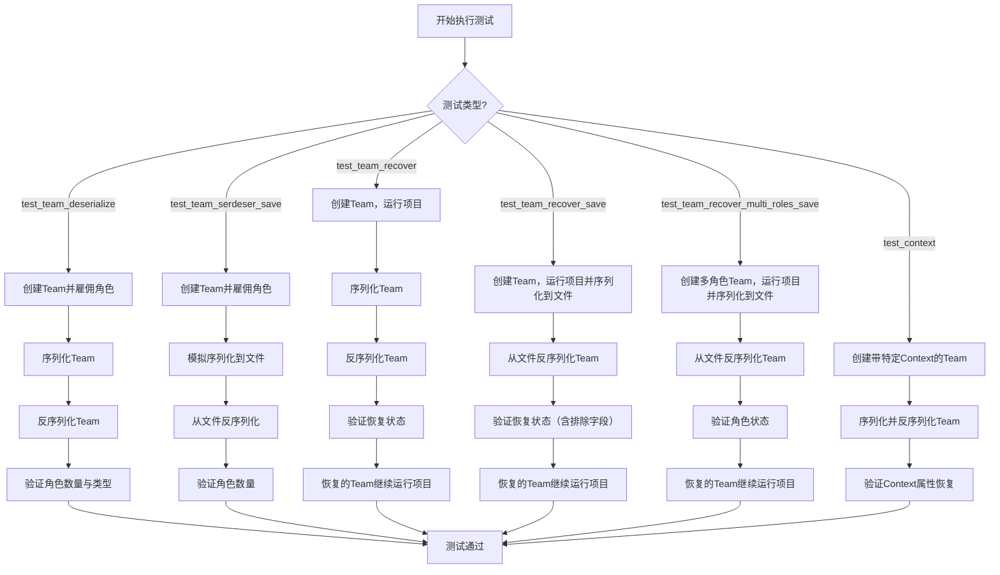
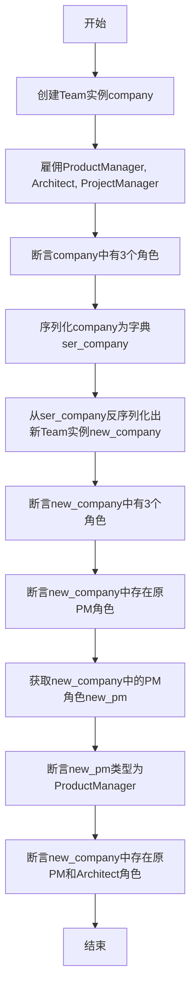
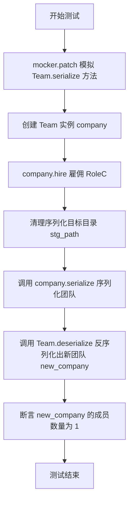
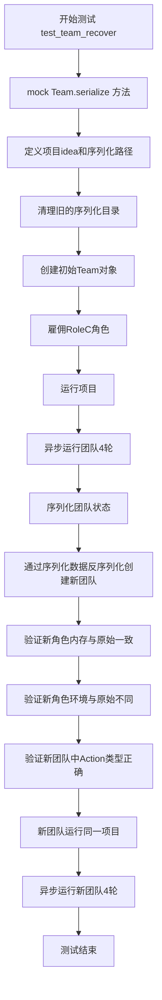
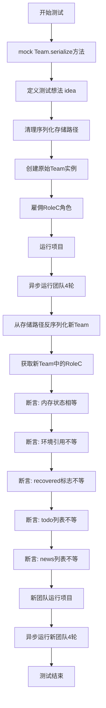
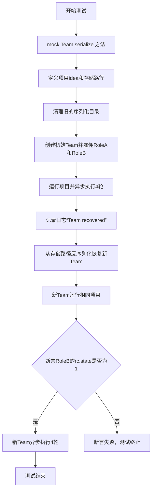
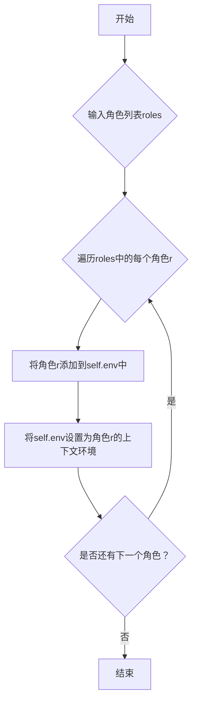
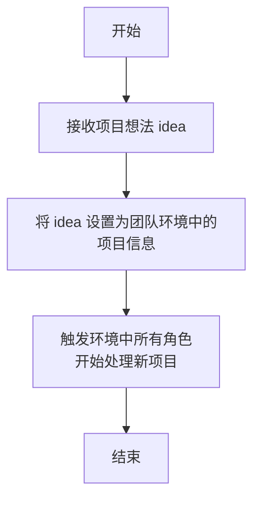
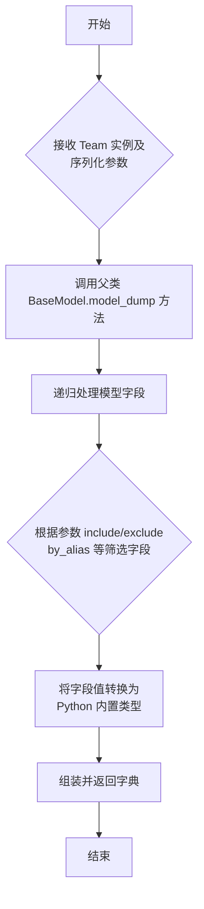
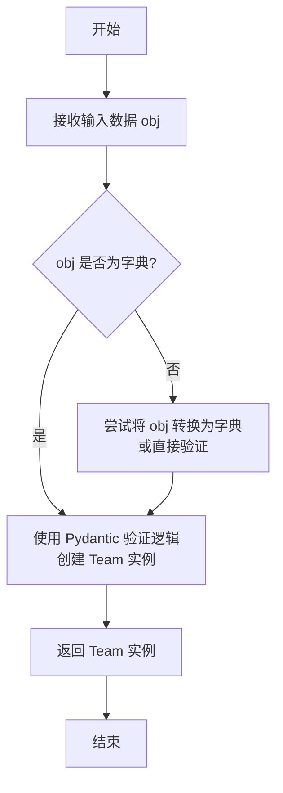

# `.\MetaGPT\tests\metagpt\serialize_deserialize\test_team.py` 详细设计文档

该文件是一个测试文件，用于验证 MetaGPT 框架中 Team（团队）类的序列化（serialize）与反序列化（deserialize）功能，以及团队在序列化后恢复状态并继续执行项目的能力。测试覆盖了团队的基本序列化、从文件恢复、多角色场景恢复以及与上下文（Context）的集成。

## 整体流程



## 类结构

```
测试文件 (test_team_serdeser.py)
├── 全局函数
│   ├── test_team_deserialize
│   ├── mock_team_serialize
│   ├── test_team_serdeser_save
│   ├── test_team_recover
│   ├── test_team_recover_save
│   ├── test_team_recover_multi_roles_save
│   └── test_context
└── 外部依赖类
    ├── Team (metagpt.team)
    ├── Context (metagpt.context)
    ├── ProductManager (metagpt.roles)
    ├── Architect (metagpt.roles)
    ├── ProjectManager (metagpt.roles)
    ├── RoleA (tests.metagpt.serialize_deserialize.test_serdeser_base)
    ├── RoleB (tests.metagpt.serialize_deserialize.test_serdeser_base)
    └── RoleC (tests.metagpt.serialize_deserialize.test_serdeser_base)
```

## 全局变量及字段


### `serdeser_path`
    
用于序列化和反序列化测试的基准目录路径。

类型：`Path`
    


### `logger`
    
用于记录测试执行过程中的日志信息的日志记录器。

类型：`Logger`
    


### `Team.context`
    
团队运行时的上下文环境，包含配置、成本管理、仓库等信息。

类型：`Context`
    


### `Team.env`
    
团队运行的环境，管理角色、消息和任务执行。

类型：`Environment`
    


### `Team.serialize`
    
将团队对象序列化到指定路径的方法。

类型：`method`
    


### `Team.deserialize`
    
从指定路径反序列化并重建团队对象的方法。

类型：`method`
    


### `Context.kwargs`
    
上下文中的关键字参数存储，用于传递动态配置。

类型：`dict`
    


### `Context.cost_manager`
    
成本管理器，用于跟踪和控制团队运行的成本。

类型：`CostManager`
    


### `Context.repo`
    
代码仓库对象，管理项目文件和工作目录。

类型：`Repository`
    


### `ProductManager.profile`
    
产品经理的角色标识符，用于在环境中唯一识别该角色。

类型：`str`
    


### `ProductManager.rc`
    
产品经理的运行时上下文，包含状态、记忆和待办事项。

类型：`RoleContext`
    


### `Architect.profile`
    
架构师的角色标识符，用于在环境中唯一识别该角色。

类型：`str`
    


### `Architect.rc`
    
架构师的运行时上下文，包含状态、记忆和待办事项。

类型：`RoleContext`
    


### `ProjectManager.profile`
    
项目经理的角色标识符，用于在环境中唯一识别该角色。

类型：`str`
    


### `ProjectManager.rc`
    
项目经理的运行时上下文，包含状态、记忆和待办事项。

类型：`RoleContext`
    


### `RoleA.profile`
    
RoleA的角色标识符，用于在环境中唯一识别该角色。

类型：`str`
    


### `RoleA.rc`
    
RoleA的运行时上下文，包含状态、记忆和待办事项。

类型：`RoleContext`
    


### `RoleA.actions`
    
RoleA可执行的动作列表。

类型：`list[Action]`
    


### `RoleA.recovered`
    
标识RoleA是否是从序列化状态恢复的。

类型：`bool`
    


### `RoleB.profile`
    
RoleB的角色标识符，用于在环境中唯一识别该角色。

类型：`str`
    


### `RoleB.rc`
    
RoleB的运行时上下文，包含状态、记忆和待办事项。

类型：`RoleContext`
    


### `RoleB.actions`
    
RoleB可执行的动作列表。

类型：`list[Action]`
    


### `RoleB.recovered`
    
标识RoleB是否是从序列化状态恢复的。

类型：`bool`
    


### `RoleC.profile`
    
RoleC的角色标识符，用于在环境中唯一识别该角色。

类型：`str`
    


### `RoleC.rc`
    
RoleC的运行时上下文，包含状态、记忆和待办事项。

类型：`RoleContext`
    


### `RoleC.actions`
    
RoleC可执行的动作列表。

类型：`list[Action]`
    


### `RoleC.recovered`
    
标识RoleC是否是从序列化状态恢复的。

类型：`bool`
    
    

## 全局函数及方法

### `test_team_deserialize`

该函数是一个单元测试，用于验证`Team`类的反序列化功能。它创建一个包含多个角色的`Team`实例，将其序列化为字典，然后从该字典反序列化出一个新的`Team`实例，最后验证新实例中的角色信息与原始实例一致。

参数：

- `context`：`Context`，测试执行所需的上下文环境，提供必要的配置和运行时信息。

返回值：`None`，该函数是一个测试函数，不返回任何值，通过断言（assert）来验证功能正确性。

#### 流程图



#### 带注释源码

```python
def test_team_deserialize(context):
    # 1. 使用传入的上下文创建一个新的Team实例
    company = Team(context=context)

    # 2. 创建具体的角色实例
    pm = ProductManager()
    arch = Architect()
    
    # 3. 雇佣（添加）多个角色到Team中
    company.hire(
        [
            pm,
            arch,
            ProjectManager(),
        ]
    )
    # 4. 断言初始Team实例中恰好有3个角色
    assert len(company.env.get_roles()) == 3
    
    # 5. 将Team实例序列化为字典（使用Pydantic的model_dump方法）
    ser_company = company.model_dump()
    
    # 6. 从序列化后的字典反序列化，创建一个新的Team实例
    new_company = Team.model_validate(ser_company)

    # 7. 断言新Team实例中也有3个角色
    assert len(new_company.env.get_roles()) == 3
    
    # 8. 断言新Team实例中可以通过原PM的profile找到对应的角色（角色存在性验证）
    assert new_company.env.get_role(pm.profile) is not None

    # 9. 获取新Team实例中的PM角色
    new_pm = new_company.env.get_role(pm.profile)
    
    # 10. 断言新PM角色的类型是ProductManager（类型正确性验证）
    assert type(new_pm) == ProductManager
    
    # 11. 再次断言新Team实例中存在原PM和Architect角色（冗余验证，确保关键角色存在）
    assert new_company.env.get_role(pm.profile) is not None
    assert new_company.env.get_role(arch.profile) is not None
```

### `mock_team_serialize`

这是一个用于模拟 `Team` 类序列化行为的辅助函数。它接收一个 `Team` 实例和一个目标路径，将该实例的序列化数据（通过 `model_dump()` 方法获得）以 JSON 格式写入到指定路径下的 `team.json` 文件中。此函数主要用于单元测试，用于替换 `Team.serialize` 方法，以便在不依赖真实文件系统的情况下验证序列化逻辑。

参数：
- `self`：`Team`，需要被序列化的 `Team` 类实例。
- `stg_path`：`pathlib.Path`，序列化数据的目标存储路径，默认为 `serdeser_path.joinpath("team")`。

返回值：`None`，此函数不返回任何值，其作用是将数据写入文件。

#### 流程图

```mermaid
flowchart TD
    A[开始] --> B[构造 team.json 的完整路径]
    B --> C[调用 self.model_dump() 获取序列化数据]
    C --> D[调用 write_json_file 将数据写入文件]
    D --> E[结束]
```

#### 带注释源码

```python
def mock_team_serialize(self, stg_path: Path = serdeser_path.joinpath("team")):
    # 构造 team.json 文件的完整路径
    team_info_path = stg_path.joinpath("team.json")
    # 调用 self.model_dump() 获取 Team 实例的序列化字典数据
    # 调用 write_json_file 函数将字典数据写入到 team_info_path 指定的 JSON 文件中
    write_json_file(team_info_path, self.model_dump())
```

### `test_team_serdeser_save`

该函数是一个单元测试，用于验证`Team`类的序列化（保存到磁盘）和反序列化（从磁盘加载）功能。它通过模拟（Mock）`Team.serialize`方法，创建一个包含特定角色的团队，将其序列化到指定目录，然后从该目录反序列化出一个新的团队实例，最后断言新团队的成员数量与原始团队一致，从而验证序列化/反序列化过程的正确性。

参数：
-  `mocker`：`pytest-mock`提供的`MockerFixture`类型对象，用于在测试中模拟（Mock）对象和方法。
-  `context`：`Context`类型，测试环境的上下文对象，包含运行所需的配置和状态信息。

返回值：`None`，该函数是一个测试函数，不返回具体值，其成功与否由内部的`assert`语句决定。

#### 流程图



#### 带注释源码

```python
def test_team_serdeser_save(mocker, context):
    # 使用 mocker 模拟（替换）metagpt.team.Team 类的 serialize 方法，
    # 使其在测试中执行自定义的 mock_team_serialize 函数，避免真实的文件操作影响测试隔离性。
    mocker.patch("metagpt.team.Team.serialize", mock_team_serialize)

    # 使用传入的 context 创建一个新的 Team 实例。
    company = Team(context=context)
    # 为这个团队雇佣一个 RoleC 角色的成员。
    company.hire([RoleC()])

    # 定义序列化文件的目标存储路径。
    stg_path = serdeser_path.joinpath("team")
    # 清理该路径下的所有现有文件和目录，确保测试从一个干净的状态开始。
    shutil.rmtree(stg_path, ignore_errors=True)

    # 调用被模拟的 serialize 方法，将团队信息序列化（保存）到 stg_path 路径。
    company.serialize(stg_path=stg_path)

    # 调用 Team 类的静态方法 deserialize，从 stg_path 路径反序列化（加载）出一个新的 Team 实例。
    new_company = Team.deserialize(stg_path)

    # 断言新反序列化出来的团队 new_company 中，环境（env）里的角色（roles）数量为 1。
    # 这验证了序列化和反序列化过程没有丢失团队的结构信息。
    assert len(new_company.env.roles) == 1
```

### `test_team_recover`

该函数是一个异步单元测试，用于验证`Team`（团队）对象的序列化与反序列化（即“恢复”）功能。它模拟了一个团队执行一个项目（“write a snake game”）数轮后，将其状态序列化，然后通过反序列化创建一个新的团队对象，并验证新团队能够从序列化的状态中正确恢复关键属性（如角色的记忆），最后继续执行项目以验证恢复后的团队功能正常。

参数：

- `mocker`：`pytest-mock`提供的`MockerFixture`类型，用于在测试中模拟（mock）对象和行为。
- `context`：`Context`类型，测试框架提供的上下文对象，包含团队运行所需的环境配置，如工作目录、成本管理器等。

返回值：`None`，该函数是一个测试函数，不返回业务值，其成功与否由内部的断言（`assert`）语句决定。

#### 流程图



#### 带注释源码

```python
@pytest.mark.asyncio  # 标记此函数为异步测试，以便pytest-asyncio插件能正确处理
async def test_team_recover(mocker, context):  # 定义异步测试函数，接收mocker和context参数
    # 使用mocker替换`metagpt.team.Team`类的`serialize`方法，使其在测试中调用我们定义的`mock_team_serialize`函数
    mocker.patch("metagpt.team.Team.serialize", mock_team_serialize)

    idea = "write a snake game"  # 定义测试中团队要执行的项目描述
    stg_path = serdeser_path.joinpath("team")  # 定义序列化文件存储的路径
    shutil.rmtree(stg_path, ignore_errors=True)  # 清理该路径，确保测试从一个干净的状态开始

    # 创建初始的Team对象，并传入测试上下文
    company = Team(context=context)
    role_c = RoleC()  # 创建一个RoleC类型的角色实例
    company.hire([role_c])  # 将角色雇佣到团队中
    company.run_project(idea)  # 让团队开始运行指定的项目
    await company.run(n_round=4)  # 异步运行团队4轮，模拟项目执行过程

    # 将当前团队的状态序列化为字典格式
    ser_data = company.model_dump()
    # 使用序列化后的数据直接实例化一个新的Team对象，模拟“恢复”过程
    new_company = Team(**ser_data)

    # 从恢复后的新团队中获取对应profile的角色
    new_role_c = new_company.env.get_role(role_c.profile)
    # 断言：恢复后角色的内存（rc.memory）应与原始角色相同
    assert new_role_c.rc.memory == role_c.rc.memory
    # 断言：恢复后角色的环境（rc.env）对象引用不应与原始角色相同（应是新对象）
    assert new_role_c.rc.env != role_c.rc.env
    # 断言：新团队中第一个角色的第一个动作类型应为ActionOK
    assert type(list(new_company.env.roles.values())[0].actions[0]) == ActionOK

    # 让恢复后的新团队运行同一个项目
    new_company.run_project(idea)
    # 异步运行新团队4轮，验证恢复后的团队能继续正常工作
    await new_company.run(n_round=4)
```


### `test_team_recover_save`

这是一个异步的单元测试函数，用于测试`Team`（团队）类的序列化（保存到磁盘）和反序列化（从磁盘恢复）功能，并验证恢复后的团队状态与原始团队状态的一致性。测试模拟了一个团队执行一个项目（“写一个2048网页游戏”）若干轮次后，将团队状态序列化保存，然后从保存的数据中反序列化恢复出一个新团队，并验证恢复后团队的关键属性（如成员的内存状态）与原始团队一致，同时确保某些在序列化过程中被排除的属性（如`rc.todo`, `rc.news`）确实不同。最后，测试恢复后的团队是否能继续执行项目。

参数：

-  `mocker`：`pytest_mock.plugin.MockerFixture`，pytest-mock插件提供的Mock夹具，用于在测试中模拟（mock）对象或函数的行为。
-  `context`：`metagpt.context.Context`，MetaGPT框架的上下文对象，包含运行环境、配置、资源管理等全局信息。

返回值：`None`，这是一个测试函数，不返回具体值，其成功与否由内部的断言（`assert`）语句决定。

#### 流程图



#### 带注释源码

```python
@pytest.mark.asyncio  # 标记此函数为异步测试，以便pytest-asyncio插件处理
async def test_team_recover_save(mocker, context):
    """
    测试团队序列化保存后恢复的功能。
    核心流程：创建团队 -> 执行任务 -> 序列化保存 -> 反序列化恢复 -> 验证状态 -> 恢复后继续执行。
    """
    # 1. Mock（模拟）Team类的serialize方法，使其调用本模块定义的mock_team_serialize函数
    #    这样在测试中调用`company.serialize()`时，不会真正执行复杂的序列化逻辑，而是将数据写入指定路径。
    mocker.patch("metagpt.team.Team.serialize", mock_team_serialize)

    # 2. 定义测试用的项目想法
    idea = "write a 2048 web game"
    # 3. 指定序列化数据存储的目录路径
    stg_path = serdeser_path.joinpath("team")
    # 4. 清理存储路径，确保测试从一个干净的环境开始
    shutil.rmtree(stg_path, ignore_errors=True)

    # 5. 创建原始的Team实例，并传入测试上下文
    company = Team(context=context)
    # 6. 创建一个RoleC角色实例
    role_c = RoleC()
    # 7. 雇佣该角色到团队中
    company.hire([role_c])
    # 8. 为团队设置项目目标
    company.run_project(idea)
    # 9. 异步运行团队4轮，模拟团队协作完成任务的过程
    await company.run(n_round=4)

    # 10. 关键步骤：从之前mock的serialize方法写入的路径中，反序列化恢复出一个新的Team实例
    new_company = Team.deserialize(stg_path)
    # 11. 从新团队中获取对应profile的RoleC角色实例
    new_role_c = new_company.env.get_role(role_c.profile)

    # 12. 验证阶段：比较恢复后的角色状态与原始角色状态
    #     a. 内存状态应该相等，因为序列化/反序列化过程应保持核心数据
    assert new_role_c.rc.memory == role_c.rc.memory
    #     b. 环境引用不应该相等，因为反序列化会创建新的环境对象
    assert new_role_c.rc.env != role_c.rc.env
    #     c. `recovered`标志位应该不相等。注释提到是因为之前的测试断言是`!=`，
    #        这里可能是一个特定的测试点，验证反序列化后该标志被正确设置（例如设为True）。
    assert new_role_c.recovered != role_c.recovered  # here cause previous ut is `!=`
    #     d. `rc.todo`（待办列表）应该不相等，因为序列化配置中排除了此字段
    assert new_role_c.rc.todo != role_c.rc.todo  # serialize exclude `rc.todo`
    #     e. `rc.news`（消息列表）应该不相等，因为序列化配置中排除了此字段
    assert new_role_c.rc.news != role_c.rc.news  # serialize exclude `rc.news`

    # 13. 功能验证：恢复后的团队应该能够继续工作
    #     为恢复后的新团队设置相同的项目目标
    new_company.run_project(idea)
    #     异步运行新团队4轮，验证其功能完整性
    await new_company.run(n_round=4)
```


### `test_team_recover_multi_roles_save`

这是一个异步测试函数，用于验证包含多个角色的`Team`对象在序列化（保存到磁盘）和反序列化（从磁盘恢复）后，其状态和行为是否能够正确恢复。具体来说，它测试了在运行一个项目（例如“编写一个贪吃蛇游戏”）并执行多轮交互后，将团队状态序列化保存，然后从保存的数据中恢复一个新的团队实例，并验证恢复后的团队能够继续运行项目，且关键角色（如`RoleB`）的内部状态（如`rc.state`）符合预期。

参数：

- `mocker`：`pytest-mock`提供的`MockerFixture`类型，用于在测试中模拟（mock）对象和方法，以隔离外部依赖或改变特定对象的行为。
- `context`：`Context`类型，表示运行上下文，包含配置、工作目录、成本管理等环境信息，用于初始化`Team`对象。

返回值：`None`，这是一个测试函数，其主要目的是通过断言（assert）验证功能正确性，不返回业务值。

#### 流程图



#### 带注释源码

```python
@pytest.mark.asyncio  # 标记此函数为异步测试，以便pytest-asyncio插件能够正确处理
async def test_team_recover_multi_roles_save(mocker, context):
    # 使用mocker模拟Team类的serialize方法，将其替换为自定义的mock_team_serialize函数。
    # 这样在测试中调用company.serialize()时，实际执行的是mock逻辑，将数据保存到指定路径。
    mocker.patch("metagpt.team.Team.serialize", mock_team_serialize)

    # 定义测试用的项目想法和序列化数据的存储路径。
    idea = "write a snake game"
    stg_path = serdeser_path.joinpath("team")
    # 清理存储路径，确保测试从一个干净的状态开始。
    shutil.rmtree(stg_path, ignore_errors=True)

    # 创建两个自定义测试角色实例。
    role_a = RoleA()
    role_b = RoleB()

    # 使用提供的context创建一个新的Team实例。
    company = Team(context=context)
    # 雇佣（添加）两个角色到团队中。
    company.hire([role_a, role_b])
    # 为团队设置要运行的项目（idea）。
    company.run_project(idea)
    # 异步运行团队4轮，模拟角色间的协作过程。
    await company.run(n_round=4)

    # 记录日志，表示即将进行恢复操作。
    logger.info("Team recovered")

    # 关键步骤：从之前serialize方法（已被mock）保存的路径反序列化，恢复出一个新的Team实例。
    new_company = Team.deserialize(stg_path)
    # 为恢复后的新团队运行相同的项目。
    new_company.run_project(idea)

    # 断言：检查恢复后的新团队中，RoleB角色的内部状态`rc.state`是否等于1。
    # 这验证了角色状态在序列化/反序列化过程中得到了部分或正确的保持。
    assert new_company.env.get_role(role_b.profile).rc.state == 1

    # 让恢复后的新团队继续异步运行4轮，验证其能够正常继续工作流程。
    await new_company.run(n_round=4)
```

### `test_context`

该函数是一个异步测试函数，用于验证`Team`类在序列化和反序列化过程中，其关联的`Context`对象（包含配置、成本管理器、仓库等信息）能够被正确地保存和恢复。它通过创建一个带有特定上下文设置的团队，将其序列化到磁盘，然后反序列化回来，并断言恢复后的上下文属性与原始值一致。

参数：

- `context`：`pytest.fixture`，一个由测试框架提供的`Context`对象fixture，作为测试的初始上下文环境。

返回值：`None`，这是一个测试函数，不返回业务值，而是通过断言（`assert`）来验证测试结果。

#### 流程图

```mermaid
flowchart TD
    A[开始测试<br>test_context] --> B[配置初始Context<br>设置kwargs.a与max_budget]
    B --> C[创建Team对象<br>company = Team(context=context)]
    C --> D[序列化Team到指定路径<br>company.serialize(save_to)]
    D --> E[从路径反序列化Team<br>使用新的Context对象]
    E --> F{断言验证<br>恢复的Context属性}
    F -->|验证仓库路径| G[assert company.env.context.repo]
    F -->|验证kwargs.a| H[assert company.env.context.kwargs.a == 'a']
    F -->|验证max_budget| I[assert max_budget == 9]
    G --> J[测试通过]
    H --> J
    I --> J
    J --> K[结束]
```

#### 带注释源码

```python
@pytest.mark.asyncio  # 标记此函数为异步测试函数，以便pytest-asyncio插件能正确处理
async def test_context(context):  # 定义异步测试函数，接收一个`context` fixture作为参数
    # 1. 配置初始的Context对象
    context.kwargs.set("a", "a")  # 在上下文的kwargs字典中设置键值对 "a": "a"
    context.cost_manager.max_budget = 9  # 将上下文成本管理器的最大预算设置为9

    # 2. 使用配置好的上下文创建一个Team实例
    company = Team(context=context)

    # 3. 定义序列化文件的保存路径（位于上下文仓库的工作目录下的"serial"子目录）
    save_to = context.repo.workdir / "serial"

    # 4. 将Team对象序列化到指定路径
    company.serialize(save_to)

    # 5. 从指定路径反序列化Team对象，并传入一个新的空Context对象用于接收数据
    company.deserialize(save_to, Context())

    # 6. 进行一系列断言，验证反序列化后恢复的Context属性是否正确
    assert company.env.context.repo  # 断言恢复的上下文包含仓库对象
    assert company.env.context.repo.workdir == context.repo.workdir  # 断言仓库工作目录路径一致
    assert company.env.context.kwargs.a == "a"  # 断言kwargs中的'a'键值被正确恢复
    assert company.env.context.cost_manager.max_budget == context.cost_manager.max_budget  # 断言最大预算被正确恢复
```

### `Team.hire`

该方法用于向团队（Team）中雇佣（添加）一个或多个角色（Role）实例。它会将传入的角色列表中的每个角色添加到团队的环境（Environment）中，并建立角色与环境的双向关联。

参数：
- `roles`：`List[Role]`，一个包含要雇佣的`Role`实例的列表。

返回值：`None`，该方法不返回任何值。

#### 流程图



#### 带注释源码

```python
def hire(self, roles: list[Role]):
    """
    雇佣（添加）一个或多个角色到团队中。
    该方法会遍历传入的角色列表，将每个角色添加到团队的环境（self.env）中，
    并设置角色的环境上下文为当前团队的环境。
    Args:
        roles (list[Role]): 要添加到团队中的角色实例列表。
    """
    # 遍历传入的角色列表
    for role in roles:
        # 将当前角色添加到团队的环境（Environment）中
        self.env.add_role(role)
        # 将团队的环境设置为该角色的运行上下文环境，建立双向关联
        role.set_env(self.env)
```

### `Team.run_project`

该方法用于启动团队的一个新项目。它接收一个项目想法（idea）作为输入，将其设置为团队环境中的项目信息，并触发环境中的角色开始处理该项目。该方法不返回任何值，其主要作用是通过设置环境状态来初始化项目执行流程。

参数：

- `idea`：`str`，描述项目核心概念的字符串，例如“write a snake game”。

返回值：`None`，无返回值。

#### 流程图



#### 带注释源码

```python
def run_project(self, idea: str):
    """
    启动团队的一个新项目。
    
    该方法将传入的项目想法（idea）设置为团队环境（self.env）中的项目信息，
    并通知环境中的所有角色开始处理这个新项目。
    
    Args:
        idea (str): 描述项目核心概念的字符串。
    """
    # 将项目想法设置到团队环境中
    self.env.set_project(idea)
    # 触发环境中所有角色，开始处理这个新项目
    self.env.publish_message(None)
```

### `Team.run`

该方法用于启动团队协作流程，异步执行多轮任务，驱动团队成员（角色）根据项目目标进行交互和决策，直到达到指定的轮次或满足停止条件。

参数：

- `n_round`：`int`，指定团队需要运行的轮次数。每一轮通常代表一次完整的团队成员间交互循环。
- `idea`：`str`，可选参数，描述项目的核心想法或目标。如果提供，会通过`run_project`方法初始化项目环境。
- `invest`：`float`，可选参数，表示项目的初始投资或预算。
- `n_roles`：`int`，可选参数，指定团队中角色的数量。

返回值：`None`，该方法不返回任何值，其作用在于执行团队协作过程。

#### 流程图

```mermaid
graph TD
    A[开始运行 Team.run] --> B{是否提供了 idea 参数?};
    B -- 是 --> C[调用 self.run_project(idea, invest, n_roles) 初始化项目];
    B -- 否 --> D;
    C --> D[进入 for 循环，迭代 n_round 次];
    D --> E[调用 self.env.run 执行一轮团队协作];
    E --> F{是否达到停止条件?};
    F -- 是 --> G[提前结束循环];
    F -- 否 --> D;
    D --> H[循环结束];
    G --> H;
    H --> I[结束运行];
```

#### 带注释源码

```python
async def run(self, n_round=3, idea="", invest=0.0, n_roles=3):
    """
    启动团队协作的主运行方法。
    
    如果提供了项目想法（idea），则首先初始化项目环境。
    然后，在指定的轮次（n_round）内，驱动环境（env）执行团队协作流程。
    
    Args:
        n_round (int): 团队运行的轮次数。
        idea (str): 项目的核心想法描述。
        invest (float): 项目投资额。
        n_roles (int): 团队角色数量。
    """
    # 如果提供了项目想法，则初始化项目
    if idea:
        self.run_project(idea, invest, n_roles)
    
    # 循环执行指定轮次的团队协作
    for _ in range(n_round):
        # 调用环境（env）的run方法执行一轮团队交互
        await self.env.run()
```

### `Team.model_dump`

该方法继承自 Pydantic 的 `BaseModel`，用于将 `Team` 实例序列化为一个字典。它递归地处理模型的所有字段，将字段名和值转换为 Python 内置类型（如 `dict`, `list`, `str`, `int`, `float`, `bool` 等），以便于 JSON 序列化或其它形式的持久化存储。

参数：
-  `self`：`Team`，`Team` 类的实例。
-  `*`：`Any`，用于捕获位置参数，确保方法签名与父类兼容。
-  `include`：`Union[AbstractSetIntStr, MappingIntStrAny]`，指定需要包含在输出字典中的字段。可以是字段名的集合或映射。
-  `exclude`：`Union[AbstractSetIntStr, MappingIntStrAny]`，指定需要从输出字典中排除的字段。可以是字段名的集合或映射。
-  `by_alias`：`bool`，如果为 `True`，则使用字段的别名（通过 `Field(alias=...)` 定义）作为字典的键；否则使用字段名。
-  `exclude_unset`：`bool`，如果为 `True`，则排除未显式设置的字段（即使用默认值的字段）。
-  `exclude_defaults`：`bool`，如果为 `True`，则排除值等于字段默认值的字段。
-  `exclude_none`：`bool`，如果为 `True`，则排除值为 `None` 的字段。
-  `**kwargs`：`Any`，用于捕获额外的关键字参数，确保方法签名与父类兼容。

返回值：`dict`，一个包含 `Team` 实例所有（或根据参数筛选后）字段及其值的字典，所有值都已转换为 Python 内置类型。

#### 流程图



#### 带注释源码

```python
def model_dump(
    self,
    *,
    include: Union[AbstractSetIntStr, MappingIntStrAny] = None,
    exclude: Union[AbstractSetIntStr, MappingIntStrAny] = None,
    by_alias: bool = False,
    exclude_unset: bool = False,
    exclude_defaults: bool = False,
    exclude_none: bool = False,
    **kwargs,
) -> dict:
    """
    将模型实例序列化为字典。
    
    此方法继承自 Pydantic BaseModel，用于生成一个包含模型数据的字典，
    所有值都转换为 Python 基本类型（如 dict, list, str, int 等）。
    
    Args:
        include: 指定要包含的字段。可以是字段名集合或字段名到包含规则的映射。
        exclude: 指定要排除的字段。可以是字段名集合或字段名到排除规则的映射。
        by_alias: 如果为 True，在输出字典中使用字段别名作为键。
        exclude_unset: 如果为 True，排除未设置的字段（即仍为默认值的字段）。
        exclude_defaults: 如果为 True，排除值等于字段默认值的字段。
        exclude_none: 如果为 True，排除值为 None 的字段。
        **kwargs: 额外的关键字参数，用于未来扩展或与父类方法兼容。
        
    Returns:
        dict: 表示模型数据的字典。
    """
    # 方法体由 Pydantic 在 BaseModel 中实现。
    # 它会遍历模型的所有字段，根据上述参数进行筛选和转换。
    # 对于嵌套的 Pydantic 模型，会递归调用其 model_dump 方法。
    # 最终返回一个完全由 Python 内置类型构成的字典。
    return super().model_dump(
        include=include,
        exclude=exclude,
        by_alias=by_alias,
        exclude_unset=exclude_unset,
        exclude_defaults=exclude_defaults,
        exclude_none=exclude_none,
        **kwargs,
    )
```

### `Team.model_validate`

`Team.model_validate` 是 Pydantic 模型 `Team` 的一个类方法，用于从字典数据中验证并创建 `Team` 实例。它执行数据验证，确保输入数据符合 `Team` 模型的定义，然后返回一个有效的 `Team` 对象实例。

参数：

- `obj`：`Any`，包含 `Team` 实例数据的字典或对象。

返回值：`Team`，验证通过后创建的 `Team` 实例。

#### 流程图



#### 带注释源码

```python
@classmethod
def model_validate(
    cls: type[_T],
    obj: Any,
    *,
    strict: bool | None = None,
    from_attributes: bool | None = None,
    context: dict[str, Any] | None = None,
) -> _T:
    """
    Pydantic 提供的类方法，用于验证输入数据并创建模型实例。
    
    参数:
        cls: 当前类（Team）。
        obj: 要验证的数据，通常是字典。
        strict: 是否启用严格模式（类型严格检查）。
        from_attributes: 是否从对象属性创建模型。
        context: 额外的上下文信息。
    
    返回:
        验证后的 Team 实例。
    """
    # 此方法由 Pydantic 自动生成，内部逻辑包括：
    # 1. 验证输入数据是否符合 Team 模型的字段定义和类型。
    # 2. 如果验证失败，抛出 ValidationError。
    # 3. 验证成功后，使用数据创建并返回 Team 实例。
    return super().model_validate(
        obj,
        strict=strict,
        from_attributes=from_attributes,
        context=context,
    )
```

## 关键组件


### Team 类

团队协作与项目管理组件，负责组建团队、管理角色、运行项目以及支持序列化/反序列化操作。

### Context 类

上下文管理组件，提供运行环境、配置参数、成本管理及工作目录等全局信息。

### 序列化与反序列化机制

支持将团队状态（包括角色、环境、上下文等）保存到文件系统以及从文件系统恢复，用于实现状态的持久化和恢复。

### 角色系统

定义了不同职能的角色（如 ProductManager, Architect, ProjectManager 等），每个角色具有特定的行为（Actions）和状态，可在团队环境中协同工作。

### 测试框架与 Mock 机制

使用 pytest 框架和 mocker 工具对团队组建、序列化、恢复及多角色协作等核心功能进行单元测试和集成测试。


## 问题及建议


### 已知问题

-   **测试代码与实现代码耦合度高**：测试文件 `test_team_serdeser.py` 中定义了 `mock_team_serialize` 函数，并通过 `mocker.patch` 直接替换了 `metagpt.team.Team.serialize` 方法。这表明 `Team.serialize` 方法可能依赖于外部文件系统操作（如写入磁盘），导致单元测试难以独立运行，且测试覆盖的是被 Mock 后的行为，而非真实逻辑。
-   **序列化/反序列化逻辑的健壮性测试不足**：测试用例 `test_team_recover_save` 中，断言 `new_role_c.recovered != role_c.recovered` 和 `new_role_c.rc.todo != role_c.rc.todo` 表明，序列化过程可能有意或无意地排除了某些关键运行时状态（如 `rc.todo`, `rc.news`, `recovered` 标志）。这可能导致反序列化后的对象状态不完整，无法完全恢复执行现场，存在潜在的数据丢失风险。
-   **资源清理可能不彻底**：多个测试用例使用 `shutil.rmtree(stg_path, ignore_errors=True)` 清理测试目录。`ignore_errors=True` 参数虽然能避免因目录不存在而报错，但也可能掩盖了真正的权限或文件锁定错误，导致测试环境残留，影响后续测试的独立性。
-   **异步测试的潜在竞态条件**：测试用例使用了 `@pytest.mark.asyncio` 和 `await company.run(n_round=4)`。虽然代码中未直接体现，但在 `Team.run` 方法内部，如果涉及多个角色的并发 `_observe` 和 `_think` 操作，且序列化/反序列化过程未妥善处理异步上下文或任务状态，在恢复后继续执行时可能存在未定义的竞态行为。
-   **上下文（Context）传播的隐式依赖**：测试 `test_context` 验证了 `Context` 对象在序列化后的传递。测试的成功依赖于 `Team` 和 `Environment` 对 `Context` 的深拷贝或引用传递的正确实现。如果序列化逻辑（如 `model_dump`）未能正确处理 `Context` 内部的复杂对象（如 `cost_manager`, `repo`），可能导致反序列化后上下文信息不一致。

### 优化建议

-   **重构序列化方法以提高可测试性**：将 `Team.serialize` 方法的核心逻辑（如数据准备、结构构建）与副作用操作（如文件写入）分离。可以提取一个 `_prepare_serialization_data` 方法返回字典，而 `serialize` 方法负责调用它并写入文件。这样，单元测试可以直接验证 `_prepare_serialization_data` 返回的数据结构，而文件操作可以通过 Mock 或集成测试单独验证。
-   **审查并完善序列化字段范围**：检查 `Team`、`Role` 及相关组件（如 `RoleContext` 即 `rc`）的 Pydantic 模型定义。确保所有需要持久化以恢复执行状态的关键字段（如 `rc.todo`, `rc.news`, `recovered`）都被包含在 `model_dump` 的默认输出或通过 `include` 参数指定。对于不应序列化的临时状态，应使用 `exclude` 明确排除，并在文档中说明。
-   **增强测试环境的隔离性**：为每个测试用例使用唯一的、随机的临时目录路径，并在测试结束后（使用 `pytest.fixture` 的 `finalizer`）确保清理。这可以避免测试间相互干扰，并更容易发现资源泄漏问题。例如，使用 `tempfile.TemporaryDirectory`。
-   **增加序列化一致性与状态恢复的验证点**：在反序列化后，增加更全面的断言，不仅检查对象存在和类型，还应检查关键的业务状态是否一致。例如，对于恢复后的团队，可以验证其项目目标、各角色的记忆、待办事项列表等是否与序列化前等价。
-   **补充边界和异常情况测试**：添加测试用例，例如：序列化空团队、序列化后修改源数据再反序列化、对不存在的路径进行反序列化、序列化数据格式损坏等情况，以确保 `serialize` 和 `deserialize` 方法的鲁棒性。
-   **考虑异步状态的序列化**：如果 `Team` 的运行涉及异步任务（`asyncio.Task`），评估这些任务状态是否应该以及如何被序列化。如果不需要序列化任务对象本身，则应在序列化前确保所有异步操作已妥善完成或取消，并在反序列化后重新初始化必要的异步上下文。


## 其它


### 设计目标与约束

本测试模块的设计目标是验证`Team`类的序列化与反序列化功能，确保团队状态（包括成员角色、环境上下文、项目状态等）能够被正确保存和恢复。约束包括：1) 必须与`metagpt`框架的序列化机制（基于Pydantic的`model_dump`和`model_validate`）兼容；2) 测试需要模拟文件系统操作（如写入、读取JSON文件），并确保测试隔离性，不污染实际工作目录；3) 异步测试需要正确处理事件循环，以验证团队在恢复后能继续执行异步协作流程。

### 错误处理与异常设计

测试代码本身不包含复杂的业务逻辑错误处理，其重点在于验证序列化/反序列化过程在正常和边界条件下的行为。潜在的异常场景包括：1) 序列化路径不存在或不可写，通过`shutil.rmtree`和`ignore_errors=True`进行清理，但未显式处理权限错误；2) 反序列化时JSON文件格式错误或数据不完整，依赖Pydantic的验证机制抛出`ValidationError`，测试通过断言验证恢复后的对象状态是否正确来间接确认；3) 模拟（mocking）失败可能导致原始`serialize`方法被调用，通过`mocker.patch`确保替换成功。

### 数据流与状态机

测试数据流围绕`Team`对象的状态变化展开：1) **初始化与雇佣**：创建`Team`实例，通过`hire`方法添加`Role`对象，状态从空团队变为包含指定角色的团队；2) **序列化**：调用`serialize`方法（或模拟方法），将团队对象的状态（通过`model_dump`）持久化为JSON文件，数据流从内存对象到磁盘文件；3) **反序列化**：调用`deserialize`方法，从磁盘文件读取JSON数据并重建`Team`对象（通过`model_validate`或构造函数），数据流从磁盘文件回到内存对象；4) **恢复后运行**：反序列化后的团队执行`run_project`和`run`，验证其状态机（如角色的`rc.state`、内存、待办事项）能够从序列化点正确恢复并继续推进。

### 外部依赖与接口契约

1.  **Pydantic (`BaseModel`)**：`Team`及其内部角色类继承自`BaseModel`，测试依赖其`model_dump()`和`model_validate()`方法进行序列化和反序列化。接口契约是这些方法能正确导出和导入所有标记为可序列化的字段。
2.  **`metagpt`框架内部模块**：测试依赖`Context`、`Team`、`ProductManager`、`Architect`、`ProjectManager`等核心类，以及`write_json_file`工具函数。接口契约是这些类提供预期的构造函数、`hire`、`run_project`、`run`等方法，且`Role`具有`profile`、`rc`等属性。
3.  **pytest框架**：使用`pytest`进行测试组织，依赖`mocker` fixture进行模拟，`pytest.mark.asyncio`标记异步测试。接口契约是pytest能正确发现、运行测试，并管理模拟对象和异步环境。
4.  **标准库 (`shutil`, `pathlib`)**：用于测试环境的清理（`shutil.rmtree`）和路径操作（`Path`）。接口契约是这些库能正常执行文件系统操作。

    