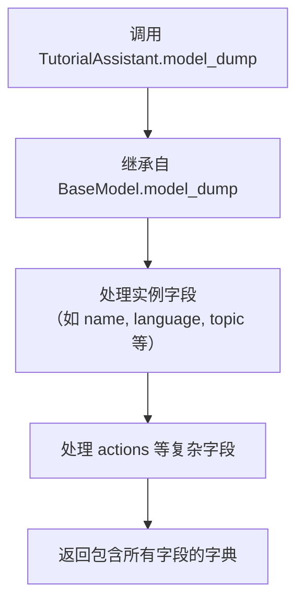

# `.\MetaGPT\tests\metagpt\serialize_deserialize\test_tutorial_assistant.py` 详细设计文档

该代码是一个使用 pytest 框架编写的异步单元测试，用于验证 TutorialAssistant 角色的序列化（serialize）与反序列化（deserialize）功能。它通过创建角色实例、将其转换为字典、然后从该字典重建新实例，来确保关键属性（如名称、语言、主题）和内部动作（WriteDirectory）在序列化过程中被正确保留。

## 整体流程

```mermaid
graph TD
    A[开始测试] --> B[创建 TutorialAssistant 实例]
    B --> C[调用 model_dump() 序列化为字典]
    C --> D{验证字典包含关键字段}
    D -- 是 --> E[使用字典反序列化创建新实例]
    E --> F{验证新实例属性与动作}
    D -- 否 --> G[测试失败]
    F -- 通过 --> H[测试成功]
    F -- 失败 --> G
```

## 类结构

```
pytest 测试模块
├── 全局函数: test_tutorial_assistant_serdeser
├── 导入类: TutorialAssistant (来自 metagpt.roles.tutorial_assistant)
└── 导入类: WriteDirectory (来自 metagpt.actions.write_tutorial)
```

## 全局变量及字段


### `role`
    
测试中初始化的TutorialAssistant角色实例，用于序列化和反序列化验证。

类型：`TutorialAssistant`
    


### `ser_role_dict`
    
通过role.model_dump()方法生成的字典，包含TutorialAssistant实例的序列化数据。

类型：`dict`
    


### `new_role`
    
使用ser_role_dict字典反序列化后重新创建的TutorialAssistant角色实例，用于验证序列化/反序列化的正确性。

类型：`TutorialAssistant`
    


### `TutorialAssistant.name`
    
TutorialAssistant角色的名称，在测试中默认值为'Stitch'。

类型：`str`
    


### `TutorialAssistant.language`
    
TutorialAssistant角色生成教程内容时使用的语言。

类型：`str`
    


### `TutorialAssistant.topic`
    
TutorialAssistant角色需要为其编写教程的主题或话题。

类型：`str`
    


### `TutorialAssistant.actions`
    
TutorialAssistant角色所具备的一系列动作（Action）列表，用于执行教程编写的不同步骤。

类型：`list[Action]`
    
    

## 全局函数及方法

### `test_tutorial_assistant_serdeser`

这是一个使用 `pytest` 框架编写的异步测试函数，用于验证 `TutorialAssistant` 角色的序列化与反序列化功能。它测试了角色对象在转换为字典（序列化）并重新创建（反序列化）后，其核心属性和内部状态是否保持一致。

参数：

-   `context`：`pytest.fixture`，测试上下文或环境，通常由 `pytest` 框架注入，用于提供测试所需的共享资源或配置。

返回值：`None`，测试函数通常不显式返回值，其成功与否由断言（`assert`）语句决定。

#### 流程图

```mermaid
flowchart TD
    A[开始测试] --> B[创建 TutorialAssistant 实例]
    B --> C[序列化: 调用 model_dump() 获取字典]
    C --> D{断言: 字典包含关键字段?}
    D -->|是| E[反序列化: 用字典创建新实例]
    E --> F{断言: 新实例属性与原始一致?}
    F -->|是| G[测试通过]
    D -->|否| H[测试失败]
    F -->|否| H
```

#### 带注释源码

```python
# 使用 pytest 的异步标记，表示这是一个异步测试函数
@pytest.mark.asyncio
async def test_tutorial_assistant_serdeser(context):
    # 1. 创建 TutorialAssistant 角色的一个实例
    role = TutorialAssistant()
    
    # 2. 序列化：将角色实例转换（dump）为一个字典
    ser_role_dict = role.model_dump()
    
    # 3. 断言：验证序列化后的字典包含预期的关键字段
    assert "name" in ser_role_dict
    assert "language" in ser_role_dict
    assert "topic" in ser_role_dict
    
    # 4. 反序列化：使用上一步得到的字典，通过解包的方式创建一个新的 TutorialAssistant 实例
    new_role = TutorialAssistant(**ser_role_dict)
    
    # 5. 断言：验证新创建的实例其属性值与原始实例一致
    #    检查名称是否为默认值 "Stitch"
    assert new_role.name == "Stitch"
    #    检查 actions 列表的长度是否为 1
    assert len(new_role.actions) == 1
    #    检查 actions 列表中的第一个元素是否是 WriteDirectory 类型
    assert isinstance(new_role.actions[0], WriteDirectory)
```

### `TutorialAssistant.model_dump`

该方法用于将 `TutorialAssistant` 角色实例序列化为一个字典，以便于存储、传输或用于创建新的实例副本。它继承自 Pydantic 的 `BaseModel.model_dump` 方法，返回一个包含实例所有字段及其值的字典。

参数：
- `self`：`TutorialAssistant` 实例，表示要序列化的当前角色对象。
- `**kwargs`：可变关键字参数，传递给父类 `BaseModel.model_dump` 方法以控制序列化行为（例如，排除某些字段、包含默认值等）。

返回值：`dict`，一个包含 `TutorialAssistant` 实例所有可序列化字段及其对应值的字典。

#### 流程图



#### 带注释源码

```python
# 该方法继承自 Pydantic BaseModel 的 model_dump 方法。
# 其核心逻辑由父类实现，用于将模型实例序列化为字典。
def model_dump(
    self,
    *,
    mode: Literal['json', 'python'] = 'python',
    include: IncEx = None,
    exclude: IncEx = None,
    by_alias: bool = False,
    exclude_unset: bool = False,
    exclude_defaults: bool = False,
    exclude_none: bool = False,
    round_trip: bool = False,
    warnings: bool = True,
) -> Dict[str, Any]:
    """
    将模型实例序列化为字典。
    
    参数:
        mode: 序列化模式，'json' 或 'python'。
        include: 指定要包含的字段。
        exclude: 指定要排除的字段。
        by_alias: 是否使用字段别名作为键。
        exclude_unset: 是否排除未设置的字段（即使用默认值的字段）。
        exclude_defaults: 是否排除等于默认值的字段。
        exclude_none: 是否排除值为 None 的字段。
        round_trip: 是否确保序列化结果可以反序列化回原模型。
        warnings: 是否在数据不一致时发出警告。
        
    返回:
        包含模型字段和值的字典。
    """
    # 具体实现由 Pydantic 的 BaseModel 提供。
    # 它会遍历 TutorialAssistant 类定义的所有字段（如 name, profile, goal, constraints, language, topic, main_title, directory, actions 等），
    # 并根据上述参数处理每个字段的值，最终组装成一个字典返回。
    return super().model_dump(
        mode=mode,
        include=include,
        exclude=exclude,
        by_alias=by_alias,
        exclude_unset=exclude_unset,
        exclude_defaults=exclude_defaults,
        exclude_none=exclude_none,
        round_trip=round_trip,
        warnings=warnings,
    )
```

## 关键组件


### 序列化与反序列化（SerDeser）

支持将角色对象序列化为字典格式，并能够从字典数据中反序列化重建角色对象，用于状态的持久化或传输。

### 角色（Role）基类

定义了角色的基本属性和行为，包括名称、语言、主题和一系列动作，是构建特定角色（如教程助手）的基础。

### 动作（Action）基类

定义了可执行动作的接口，如编写教程目录，角色通过执行一系列动作来完成特定任务。

### 测试框架集成

使用pytest框架进行异步单元测试，验证角色的序列化、反序列化功能以及属性、动作的正确性。


## 问题及建议


### 已知问题

-   **测试用例名称不明确**：测试函数名`test_tutorial_assistant_serdeser`中的`serdeser`缩写不够直观，可能降低代码可读性，不利于其他开发者快速理解测试目的。
-   **硬编码断言值**：测试中断言`new_role.name == "Stitch"`使用了硬编码的字符串`"Stitch"`。如果`TutorialAssistant`类的默认`name`属性在未来发生变更，此测试将失败，导致不必要的维护负担。
-   **测试覆盖不完整**：当前测试仅验证了序列化/反序列化后角色的`name`、`language`、`topic`字段是否存在，以及`actions`列表的长度和类型。未验证反序列化后所有关键字段（如`language`, `topic`的具体值，或`profile`, `goal`等可能存在的属性）是否与原始对象完全一致，存在覆盖缺口。
-   **对上下文依赖不明确**：测试函数接收`context`参数但未在函数体内使用，这可能引起混淆，让人怀疑是否遗漏了某些依赖项的准备或清理步骤。
-   **缺乏异常场景测试**：测试只验证了正常路径（序列化与反序列化成功）。未包含对异常或边界情况的测试，例如，使用无效的输入数据反序列化时，`TutorialAssistant`类的行为是否符合预期。

### 优化建议

-   **重命名测试函数**：将`test_tutorial_assistant_serdeser`更名为更具描述性的名称，例如`test_tutorial_assistant_serialization_deserialization`，以提高可读性。
-   **使用角色实例属性进行断言**：避免硬编码`"Stitch"`，改为使用原始`role`实例的属性进行断言，例如`assert new_role.name == role.name`。这使测试与类的默认值解耦，更加健壮。
-   **扩展断言以验证完整状态**：在反序列化后，增加断言来比较`new_role`与原始`role`在所有重要属性上是否相等。可以遍历`ser_role_dict`的键，或显式列出需要比较的属性（如`name`, `language`, `topic`, `profile`, `goal`等）。
-   **明确或移除未使用的`context`参数**：如果`context` fixture在此测试中确实不需要，应将其从参数列表中移除。如果需要用于设置环境，则应在测试中明确使用它。
-   **补充异常和边界测试**：添加新的测试用例，例如：测试向`TutorialAssistant`构造函数传递损坏的或不完整的字典时是否会引发适当的异常（如`ValidationError`），以增强测试套件的鲁棒性。
-   **考虑使用参数化测试**：如果未来需要测试`TutorialAssistant`在不同初始配置下的序列化/反序列化行为，可以使用`@pytest.mark.parametrize`来避免编写多个重复的测试函数。


## 其它


### 设计目标与约束

本代码是一个针对 `TutorialAssistant` 角色的单元测试，其核心设计目标是验证该角色的序列化（`model_dump`）与反序列化（通过构造函数）功能是否正常工作。主要约束包括：
1.  **测试范围**：测试焦点仅限于 `TutorialAssistant` 类实例的字段序列化和通过序列化数据重建对象的能力，不涉及角色完整的业务流程或异步动作执行。
2.  **依赖环境**：测试依赖于 `pytest` 框架和 `pytest.mark.asyncio` 插件来运行异步测试函数，并需要一个有效的 `context` 测试夹具（fixture）来提供必要的运行时上下文。
3.  **断言完整性**：测试断言覆盖了序列化字典中关键字段的存在性，以及反序列化后新对象的核心属性（`name`、`actions` 列表的长度和类型）与原始对象或默认值的一致性。

### 错误处理与异常设计

本测试代码本身不包含业务逻辑的错误处理，其主要目的是验证正常路径。测试框架（pytest）会处理测试执行中的异常：
1.  **测试失败**：如果任何 `assert` 语句失败，pytest 将捕获 `AssertionError` 并将其报告为测试失败，提供详细的差异信息。
2.  **运行时异常**：如果在测试执行过程中（如角色初始化、序列化、反序列化）抛出未预期的异常（例如 `KeyError`、`TypeError`），pytest 会将其捕获并标记该测试为失败或错误状态，同时输出异常堆栈跟踪，这有助于识别被测试代码（`TutorialAssistant` 或 `WriteDirectory`）中的缺陷。
3.  **夹具缺失**：如果所需的 `context` 夹具未定义或配置不当，pytest 将在测试收集或启动阶段报错。

### 数据流与状态机

本测试的数据流是线性且简单的：
1.  **输入**：测试函数接收一个 `context` 夹具作为输入，该夹具提供了测试所需的共享环境或配置。
2.  **处理**：
    a. **初始化**：创建 `TutorialAssistant` 实例（`role`）。
    b. **序列化**：调用 `role.model_dump()`，将角色对象的状态转换为字典（`ser_role_dict`）。
    c. **验证序列化输出**：断言字典包含预期的键（`name`, `language`, `topic`）。
    d. **反序列化**：使用 `ser_role_dict` 作为关键字参数，通过 `TutorialAssistant(**ser_role_dict)` 构造一个新的角色实例（`new_role`）。
    e. **验证反序列化结果**：断言新实例的属性符合预期（名称为 `"Stitch"`，有一个类型为 `WriteDirectory` 的 Action）。
3.  **输出**：测试不产生业务输出，其“输出”是测试通过或失败的状态。数据从 `role` 对象流向 `ser_role_dict`，再流向 `new_role` 对象，验证点分布在这个流转路径上。测试不涉及角色内部的状态变迁（状态机），仅验证对象状态的持久化与恢复。

### 外部依赖与接口契约

1.  **pytest 框架**：依赖 pytest 作为测试运行器和断言框架。使用 `@pytest.mark.asyncio` 装饰器来支持异步测试函数的执行。
2.  **context 夹具**：依赖一个名为 `context` 的 pytest 夹具。该夹具需返回一个满足 `metagpt` 角色初始化所需上下文的对象（具体类型和结构由 `metagpt` 框架定义）。这是测试能成功创建 `TutorialAssistant` 实例的前提条件。
3.  **metagpt 库**：
    *   `TutorialAssistant` 类：测试直接实例化和验证该类。依赖其 `__init__` 方法、`model_dump` 方法以及 `name`、`actions` 等属性的行为。
    *   `WriteDirectory` 类：用于验证 `actions` 列表中的元素类型。依赖其作为可识别类的存在。
    *   序列化协议：依赖 `TutorialAssistant` 继承的基类（推测为 Pydantic 的 `BaseModel`）提供的 `model_dump` 方法和通过字典反序列化的构造函数。这构成了测试所验证的核心接口契约：对象必须能无损地转换为字典并通过字典重建。

    