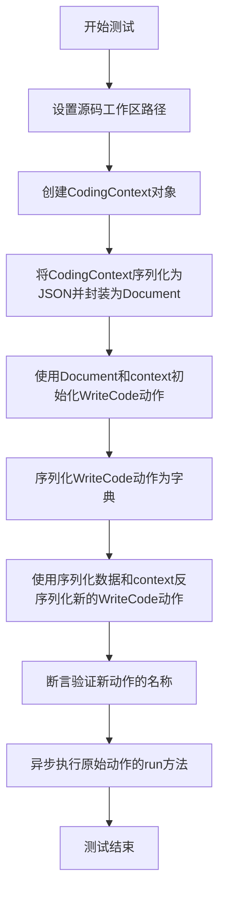
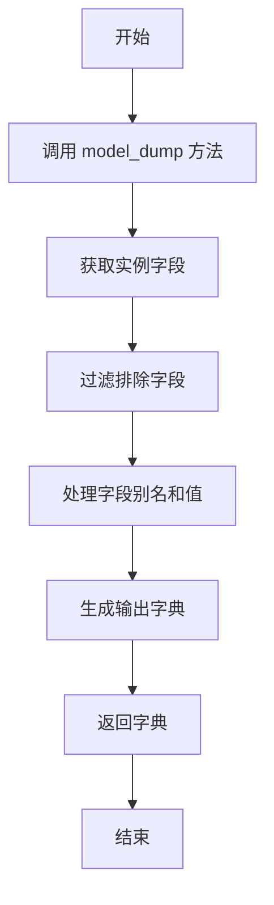
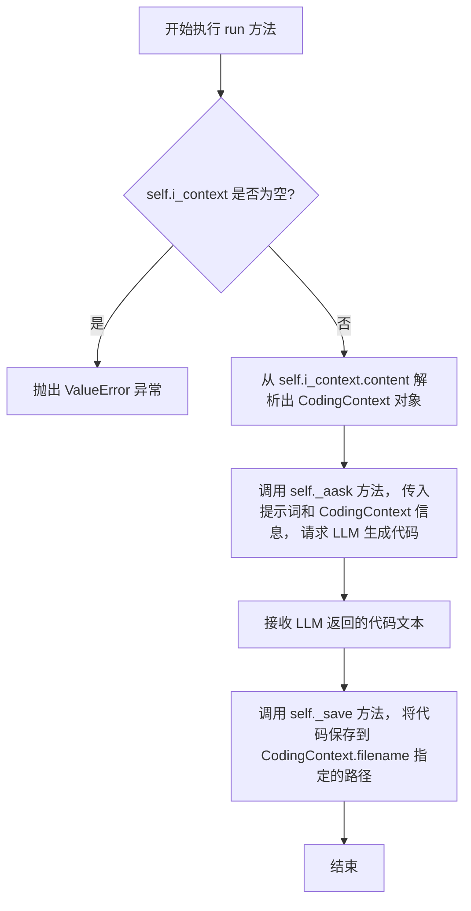
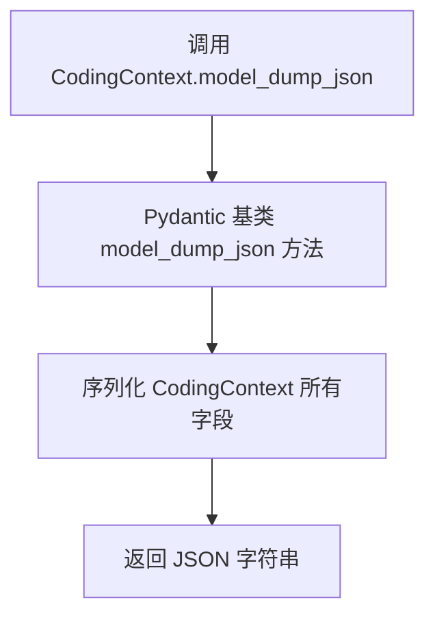

# `.\MetaGPT\tests\metagpt\serialize_deserialize\test_write_code.py` 详细设计文档

该代码是一个测试文件，用于验证 WriteCode 动作类的序列化/反序列化功能以及异步执行代码生成的能力。它通过 pytest 框架创建测试用例，测试 WriteCode 类在序列化后关键属性是否保留、敏感字段是否被正确排除，以及异步运行时代码生成功能是否正常工作。

## 整体流程

```mermaid
graph TD
    A[开始测试] --> B{测试序列化/反序列化?}
    B -- 是 --> C[创建 WriteCode 实例]
    C --> D[序列化为字典]
    D --> E{验证名称正确且排除敏感字段}
    E -- 通过 --> F[测试通过]
    E -- 失败 --> G[测试失败]
    B -- 否 --> H[创建带 CodingContext 的 WriteCode 实例]
    H --> I[序列化并反序列化实例]
    I --> J[验证反序列化后名称正确]
    J --> K[异步运行 action.run()]
    K --> L[测试完成]
```

## 类结构

```
测试文件 (test_write_code.py)
├── 全局函数 test_write_design_serdeser
└── 异步全局函数 test_write_code_serdeser
```

## 全局变量及字段


### `WriteCode.name`
    
动作的名称标识符，固定为'WriteCode'

类型：`str`
    


### `WriteCode.i_context`
    
包含编码上下文信息的输入文档

类型：`Document`
    


### `WriteCode.context`
    
执行动作所需的运行时环境上下文

类型：`Context`
    


### `WriteCode.llm`
    
用于生成代码的大型语言模型实例

类型：`LLM`
    


### `CodingContext.filename`
    
要生成的代码文件的名称

类型：`str`
    


### `CodingContext.design_doc`
    
包含设计说明的文档，用于指导代码生成

类型：`Document`
    


### `Document.content`
    
文档的核心内容，可以是文本、JSON字符串或其他结构化数据

类型：`str`
    
    

## 全局函数及方法

### `test_write_design_serdeser`

该函数是一个单元测试，用于验证`WriteCode`动作类的序列化（`model_dump`）功能。它创建一个`WriteCode`实例，将其序列化为字典，然后断言序列化后的字典中包含正确的动作名称（`"WriteCode"`）且不包含`llm`字段（该字段被标记为不导出）。

参数：
- `context`：`pytest fixture`，测试上下文，提供测试所需的共享资源，例如配置和模拟对象。

返回值：`None`，该函数是一个测试函数，不返回业务值，仅通过断言进行验证。

#### 流程图

```mermaid
flowchart TD
    A[开始] --> B[创建WriteCode实例<br>action = WriteCode(context=context)]
    B --> C[序列化实例<br>ser_action_dict = action.model_dump()]
    C --> D{断言检查}
    D --> E[断言名称正确<br>assert ser_action_dict["name"] == "WriteCode"]
    E --> F[断言llm字段不存在<br>assert "llm" not in ser_action_dict]
    F --> G[结束]
```

#### 带注释源码

```python
def test_write_design_serdeser(context):
    # 1. 使用传入的测试上下文（context）创建一个WriteCode动作实例。
    action = WriteCode(context=context)
    
    # 2. 调用model_dump方法将动作实例序列化为一个字典。
    ser_action_dict = action.model_dump()
    
    # 3. 断言序列化后的字典中，'name'字段的值是"WriteCode"。
    assert ser_action_dict["name"] == "WriteCode"
    
    # 4. 断言序列化后的字典中不包含'llm'字段。
    #    这通常是因为'llm'字段在Pydantic模型中被标记为不导出（例如，使用`exclude`）。
    assert "llm" not in ser_action_dict  # not export
```

### `test_write_code_serdeser`

该函数是一个异步测试函数，用于测试`WriteCode`动作类的序列化与反序列化功能。它首先创建一个包含编码上下文的`WriteCode`动作实例，将其序列化为字典，然后利用序列化数据重新构建一个新的`WriteCode`实例，并验证新实例的基本属性。最后，它异步执行原始动作的`run`方法以验证其功能。

参数：

- `context`：`<class 'metagpt.Context'>`，测试上下文对象，提供`WriteCode`动作执行所需的环境信息，如源码工作区路径。

返回值：`None`，该函数为测试函数，不返回具体值，仅通过断言验证测试结果。

#### 流程图



#### 带注释源码

```python
@pytest.mark.asyncio  # 标记此函数为异步测试函数，以便pytest-asyncio插件能正确处理
async def test_write_code_serdeser(context):
    # 设置源码工作区路径为仓库工作目录下的'srcs'文件夹
    context.src_workspace = context.repo.workdir / "srcs"
    
    # 创建一个CodingContext对象，包含文件名和设计文档内容
    coding_context = CodingContext(
        filename="test_code.py", 
        design_doc=Document(content="write add function to calculate two numbers")
    )
    
    # 将CodingContext对象序列化为JSON字符串，并用Document封装
    doc = Document(content=coding_context.model_dump_json())
    
    # 使用封装的Document和提供的context初始化一个WriteCode动作实例
    action = WriteCode(i_context=doc, context=context)
    
    # 将WriteCode动作实例序列化为字典
    serialized_data = action.model_dump()
    
    # 使用序列化后的字典数据和原始context反序列化，创建一个新的WriteCode动作实例
    new_action = WriteCode(**serialized_data, context=context)

    # 断言新创建的动作实例的名称为"WriteCode"
    assert new_action.name == "WriteCode"
    
    # 异步执行原始动作实例的run方法，以验证其功能
    await action.run()
```

### `WriteCode.model_dump`

`model_dump` 是 Pydantic 模型提供的一个方法，用于将模型实例序列化为一个字典。在 `WriteCode` 类中，它继承自 `Action` 类，而 `Action` 类是一个 Pydantic 模型。因此，`model_dump` 方法用于将 `WriteCode` 实例的字段（不包括那些被标记为排除的字段，如 `llm`）导出为一个字典，便于序列化、存储或传输。

参数：

-  `self`：`WriteCode` 实例，表示要序列化的对象。
-  `include`：`Union[AbstractSetIntStr, MappingIntStrAny]`，可选，指定要包含在输出字典中的字段。
-  `exclude`：`Union[AbstractSetIntStr, MappingIntStrAny]`，可选，指定要从输出字典中排除的字段。
-  `by_alias`：`bool`，可选，如果为 True，则使用字段的别名作为字典的键。
-  `exclude_unset`：`bool`，可选，如果为 True，则只包含显式设置的字段，排除默认值。
-  `exclude_defaults`：`bool`，可选，如果为 True，则排除等于默认值的字段。
-  `exclude_none`：`bool`，可选，如果为 True，则排除值为 None 的字段。
-  `round_trip`：`bool`，可选，如果为 True，则确保输出的字典可以反序列化回相同的模型实例。
-  `warnings`：`bool`，可选，如果为 True，则在遇到问题时发出警告。
-  `context`：`Any`，可选，传递给序列化器的上下文。

返回值：`dict`，包含 `WriteCode` 实例字段的字典，但排除了被标记为排除的字段（如 `llm`）。

#### 流程图



#### 带注释源码

```python
def model_dump(
    self,
    *,
    include: Union[AbstractSetIntStr, MappingIntStrAny] = None,
    exclude: Union[AbstractSetIntStr, MappingIntStrAny] = None,
    by_alias: bool = False,
    exclude_unset: bool = False,
    exclude_defaults: bool = False,
    exclude_none: bool = False,
    round_trip: bool = False,
    warnings: bool = True,
    context: Any = None,
) -> dict:
    """
    将 Pydantic 模型实例序列化为字典。

    参数:
        include: 指定要包含的字段。
        exclude: 指定要排除的字段。
        by_alias: 是否使用字段别名作为键。
        exclude_unset: 是否排除未设置的字段。
        exclude_defaults: 是否排除等于默认值的字段。
        exclude_none: 是否排除值为 None 的字段。
        round_trip: 是否确保字典可反序列化。
        warnings: 是否发出警告。
        context: 序列化上下文。

    返回:
        包含模型字段的字典。
    """
    # 调用父类 Pydantic 模型的 model_dump 方法
    return super().model_dump(
        include=include,
        exclude=exclude,
        by_alias=by_alias,
        exclude_unset=exclude_unset,
        exclude_defaults=exclude_defaults,
        exclude_none=exclude_none,
        round_trip=round_trip,
        warnings=warnings,
        context=context,
    )
```

### `WriteCode.run`

`WriteCode.run` 是 `WriteCode` 类的异步执行方法，其核心功能是根据给定的编码上下文（`CodingContext`），调用大型语言模型（LLM）生成符合设计文档要求的代码，并将生成的代码保存到指定的工作空间文件中。

参数：

-  `self`：`WriteCode` 类实例，表示当前执行的动作对象。
-  `*args`：`tuple`，可变位置参数，当前实现中未使用。
-  `**kwargs`：`dict`，可变关键字参数，当前实现中未使用。

返回值：`None`，该方法不返回任何值，其主要作用是通过副作用（生成并保存代码文件）来完成任务。

#### 流程图



#### 带注释源码

```python
    async def run(self, *args, **kwargs) -> None:
        """
        执行代码编写任务的主方法。
        流程：
        1. 检查实例变量 `i_context` 是否存在，它应包含序列化的 `CodingContext` 信息。
        2. 从 `i_context.content` 中反序列化出 `CodingContext` 对象。
        3. 基于 `CodingContext` 中的设计文档（`design_doc`）和文件名（`filename`）构建提示词。
        4. 调用 `_aask` 方法请求 LLM 生成代码。
        5. 使用 `_save` 方法将生成的代码保存到 `CodingContext` 指定的工作空间路径下的文件中。
        
        参数:
            *args: 可变位置参数，未使用。
            **kwargs: 可变关键字参数，未使用。
            
        异常:
            ValueError: 如果 `self.i_context` 为 None，则抛出此异常。
        """
        # 1. 检查必要的输入上下文是否存在
        if not self.i_context:
            raise ValueError("Coding Context is missing!")
        
        # 2. 从存储的上下文中解析出 CodingContext 对象
        # `self.i_context` 是一个 Document 对象，其 `content` 字段存储了 CodingContext 的 JSON 字符串
        coding_context = CodingContext(**json.loads(self.i_context.content))
        
        # 3. 构建请求 LLM 的提示词
        # 提示词结合了设计文档的要求和具体的代码文件名
        prompt = f"Write {coding_context.filename} with following tasks:\n {coding_context.design_doc.content}"
        
        # 4. 调用异步请求方法，获取 LLM 生成的代码
        code_text = await self._aask(prompt)
        
        # 5. 将生成的代码保存到文件系统
        # `self.context` 提供了工作空间等运行时信息，`coding_context.filename` 指定了文件名
        self._save(coding_context.filename, code_text)
```

### `CodingContext.model_dump_json`

该方法用于将`CodingContext`实例序列化为一个JSON格式的字符串。它通过调用Pydantic基类的`model_dump_json`方法实现，确保所有可序列化的字段（包括嵌套模型）都被正确地转换为JSON字符串。

参数：
- `self`：`CodingContext`，`CodingContext`类的实例。
- `**kwargs`：`Any`，传递给Pydantic `model_dump_json`方法的额外关键字参数。

返回值：`str`，表示`CodingContext`实例数据的JSON字符串。

#### 流程图



#### 带注释源码

```python
def model_dump_json(self, **kwargs) -> str:
    """
    将模型实例序列化为JSON字符串。
    
    此方法继承自Pydantic的BaseModel，用于生成当前实例的JSON表示。
    它可以接受额外的关键字参数来控制序列化过程，例如`indent`用于美化输出。
    
    Args:
        **kwargs: 传递给Pydantic `model_dump_json`方法的额外参数。
    
    Returns:
        str: 表示模型数据的JSON格式字符串。
    """
    # 调用父类Pydantic BaseModel的model_dump_json方法
    # 该方法会处理所有字段的序列化，包括处理别名、排除字段等。
    return super().model_dump_json(**kwargs)
```

## 关键组件


### WriteCode 类

WriteCode 类是 MetaGPT 框架中的一个核心动作（Action），负责根据设计文档（CodingContext）生成具体的代码实现。它封装了从接收编码需求到调用大语言模型（LLM）生成代码，再到可能进行后续处理（如代码格式化、测试生成等）的完整流程。

### CodingContext 类

CodingContext 类是代码生成任务的上下文信息载体，它定义了生成代码所需的核心元数据，例如目标文件名（filename）和详细的设计需求文档（design_doc）。该类通过序列化（如 model_dump_json）支持在系统不同组件间传递完整的代码生成任务描述。

### Document 类

Document 类是 MetaGPT 框架中用于封装文本内容的基础数据结构。在 WriteCode 的上下文中，它用于承载序列化后的 CodingContext 信息（i_context），使得复杂的上下文对象可以作为一个简单的文本字段进行传递和处理，体现了框架对信息封装和流动的设计。

### 序列化与反序列化机制

该机制允许将 WriteCode 动作实例及其关联的上下文（CodingContext）转换为字典（model_dump）或 JSON 字符串（model_dump_json）进行持久化或传输，并能够从这些序列化数据中重建对象（WriteCode(**serialized_data)）。这是实现动作状态保存、分布式任务调度或调试的关键基础。

### 异步执行框架

代码通过 pytest.mark.asyncio 装饰器和 async/await 关键字，展示了 WriteCode 动作的 run 方法在一个异步执行环境中被调用。这反映了 MetaGPT 框架对高并发、非阻塞 I/O（如网络请求调用 LLM API）操作的支持，是构建高效智能体系统的关键技术。


## 问题及建议


### 已知问题

-   **测试用例命名与功能不符**：测试函数 `test_write_design_serdeser` 和 `test_write_code_serdeser` 的名称暗示它们测试的是序列化/反序列化功能，但 `test_write_code_serdeser` 函数的主要逻辑是执行 `action.run()`，这更侧重于测试 `WriteCode` 动作的执行流程，而非纯粹的序列化/反序列化验证。这可能导致测试意图不明确。
-   **测试数据构造存在冗余**：在 `test_write_code_serdeser` 中，创建了一个 `CodingContext` 对象，然后将其序列化为 JSON 字符串并包装进一个 `Document` 对象 (`doc`)，最后用这个 `doc` 来初始化 `WriteCode` 动作。而 `CodingContext` 本身已经是一个结构化的数据模型。这种 `CodingContext -> JSON String -> Document` 的转换可能是不必要的，除非这是 `WriteCode` 动作 `i_context` 参数要求的特定格式。如果是这样，测试应更清晰地说明这一设计约束。
-   **异步测试的断言不完整**：`test_write_code_serdeser` 是一个异步测试，它调用了 `await action.run()`，但没有对 `run` 方法的结果或副作用进行任何断言。这使得测试的价值有限，无法验证 `WriteCode` 动作是否按预期生成了代码或执行了正确的逻辑。
-   **上下文对象修改可能影响其他测试**：`test_write_code_serdeser` 中直接修改了传入的 `context` 对象的 `src_workspace` 属性。如果 `context` 是一个被多个测试共享的 fixture，这种修改可能会产生不可预测的副作用，影响其他测试的执行。
-   **缺少对异常路径的测试**：当前测试只覆盖了正常执行路径。没有测试当 `WriteCode` 动作接收到无效的 `i_context`（例如格式错误的 JSON、缺失必要字段的 `Document`）或当 `llm` 服务调用失败时的异常处理。

### 优化建议

-   **重构测试函数以明确职责**：
    -   将 `test_write_code_serdeser` 拆分为两个独立的测试：一个专门测试 `WriteCode` 动作的序列化与反序列化（验证 `model_dump` 和从字典重建的正确性），另一个专门测试 `WriteCode.run()` 方法的异步执行逻辑和结果。
    -   为测试 `run` 方法的测试函数起一个更贴切的名字，例如 `test_write_code_execution`。
-   **简化测试数据准备**：
    -   审查 `WriteCode` 动作 `i_context` 参数的类型要求。如果它可以直接接受 `CodingContext` 对象或字典，则应该直接传递，避免不必要的序列化步骤。如果必须使用 `Document` 包装，应在测试注释中说明原因。
    -   考虑使用 pytest 的 fixture 来创建可重用的、隔离的测试上下文 (`context`) 和 `CodingContext` 数据，确保每个测试的独立性。
-   **增强测试断言**：
    -   在测试 `run` 方法的用例中，添加对 `action.run()` 返回值的断言。例如，检查返回的 `Code` 对象是否包含预期的文件名、语言和代码内容。
    -   验证动作执行后，是否在指定的 `src_workspace` 路径下创建了正确的文件。
-   **确保测试隔离性**：
    -   如果 `context` 是共享 fixture，避免在测试函数内部修改其属性。可以创建一个该 fixture 的副本，或者在 fixture 内部为每个测试提供独立的上下文实例。
-   **补充异常和边界测试**：
    -   添加测试用例来验证 `WriteCode` 动作在 `i_context` 为 `None`、空 `Document` 或包含无效 JSON 的 `Document` 时的行为。
    -   添加测试来模拟 `llm` 调用失败（例如通过 mocking 抛出异常），并验证动作的错误处理逻辑（例如是否抛出了预期的异常或记录了错误）。
-   **提升测试可读性**：
    -   在测试中使用更明确的变量名。例如，将 `serialized_data` 改为 `serialized_action_data`，将 `new_action` 改为 `deserialized_action`。
    -   为复杂的测试步骤添加简要的注释。


## 其它


### 设计目标与约束

本代码模块是`metagpt`框架中`WriteCode`动作的单元测试。其主要设计目标是验证`WriteCode`类的序列化/反序列化（Ser/Deser）功能，以及异步执行`run`方法的基本流程。约束条件包括：1) 依赖`pytest`测试框架；2) 需要模拟或提供`CodingContext`、`Document`等上下文对象；3) 测试环境需配置`metagpt`的运行时上下文（`context`）。

### 错误处理与异常设计

当前测试代码未显式包含错误处理逻辑。测试用例依赖于`pytest`的断言机制来验证预期行为，如果序列化字段缺失、类型不匹配或异步执行失败，测试将失败并抛出`AssertionError`或相关异常。潜在的异常点包括：1) `model_dump()`或`model_dump_json()`方法调用失败；2) 使用`**serialized_data`重构对象时数据不完整；3) `await action.run()`执行过程中`WriteCode`内部逻辑出错。

### 数据流与状态机

1.  **数据流**：
    *   **输入**：测试函数接收一个`context` fixture作为主要输入，其中包含模拟的运行时环境（如`repo.workdir`）。
    *   **处理**：
        *   `test_write_design_serdeser`：创建`WriteCode`实例 -> 调用`model_dump()`序列化 -> 验证序列化字典的特定字段。
        *   `test_write_code_serdeser`：构造`CodingContext`和包装它的`Document` -> 创建`WriteCode`实例（`i_context`） -> 序列化并反序列化重构新实例 -> 验证名称并异步执行原实例的`run`方法。
    *   **输出**：测试的“输出”是断言结果（通过或失败）。`action.run()`的执行是副作用，其具体输出（生成的代码）在本测试中未被验证。

2.  **状态机**：
    测试本身不定义复杂的状态机。它验证的是`WriteCode`对象在两个状态间的转换：从初始化的对象状态，到序列化后的字典状态，再反序列化回一个新的对象状态，并确保核心属性（如`name`）的一致性。

### 外部依赖与接口契约

1.  **外部依赖**：
    *   `pytest`：测试运行框架。
    *   `metagpt.actions.WriteCode`：被测试的核心类。
    *   `metagpt.schema.CodingContext`, `metagpt.schema.Document`：用于构建测试数据的数据模型。
    *   `context` pytest fixture：提供测试所需的运行时上下文，具体定义在其他地方。测试对其结构有假设（如包含`repo.workdir`）。

2.  **接口契约**：
    *   `WriteCode`类：必须实现`model_dump()`方法用于序列化，并支持通过`**kwargs`进行反序列化重构。必须实现异步的`run()`方法。
    *   `CodingContext`与`Document`类：必须实现`model_dump_json()`等方法，并遵循Pydantic基类的序列化契约。
    *   `context` fixture：必须提供`src_workspace`路径和`repo.workdir`属性。

### 测试策略与用例覆盖

1.  **测试策略**：采用单元测试，隔离测试`WriteCode`的序列化及核心执行流程。使用fixture管理公共上下文，构造特定数据对象模拟真实输入。
2.  **用例覆盖**：
    *   `test_write_design_serdeser`：验证基本序列化功能，确保关键字段存在且敏感字段（如`llm`）被排除。
    *   `test_write_code_serdeser`：验证完整的序列化-反序列化环（round-trip）后对象属性的一致性，并触发异步执行以验证`run`方法可被调用（不验证其功能正确性）。
3.  **覆盖缺口**：未测试`WriteCode.run()`方法实际生成的代码内容是否正确；未测试异常输入下的行为；未测试`WriteCode`与其他组件（如LLM）集成的场景。


    