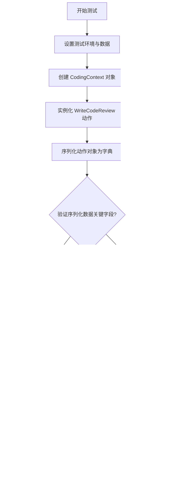

# `.\MetaGPT\tests\metagpt\serialize_deserialize\test_write_code_review.py` 详细设计文档

该代码是一个单元测试文件，用于测试 WriteCodeReview 动作类的序列化与反序列化功能。它创建了一个包含有缺陷代码的 CodingContext 对象，实例化 WriteCodeReview 动作，将其序列化为字典，再反序列化回一个新的动作实例，最后运行该动作以验证其功能完整性。

## 整体流程



## 类结构

```
测试文件 (test_write_code_review_serdeser.py)
├── 全局函数: test_write_code_review_serdeser
├── 导入类: WriteCodeReview (来自 metagpt.actions)
├── 导入类: CodingContext, Document (来自 metagpt.schema)
└── 导入模块: pytest
```

## 全局变量及字段


### `code_content`
    
包含待测试代码的字符串，用于创建CodingContext对象

类型：`str`
    


### `coding_context`
    
包含代码审查所需上下文信息的对象，包括文件名、设计文档和代码文档

类型：`CodingContext`
    


### `action`
    
初始化的WriteCodeReview动作实例，用于执行代码审查

类型：`WriteCodeReview`
    


### `serialized_data`
    
通过model_dump方法序列化后的WriteCodeReview对象数据

类型：`dict`
    


### `new_action`
    
通过反序列化重新创建的WriteCodeReview动作实例

类型：`WriteCodeReview`
    


### `WriteCodeReview.i_context`
    
代码审查的输入上下文，包含待审查代码的详细信息

类型：`CodingContext`
    


### `WriteCodeReview.name`
    
动作的名称标识，固定为'WriteCodeReview'

类型：`str`
    


### `WriteCodeReview.context`
    
动作执行所需的运行时上下文环境

类型：`object`
    


### `CodingContext.filename`
    
待审查代码文件的名称

类型：`str`
    


### `CodingContext.design_doc`
    
代码设计文档，描述代码的设计意图和功能

类型：`Document`
    


### `CodingContext.code_doc`
    
代码文档，包含实际的代码内容

类型：`Document`
    


### `Document.content`
    
文档的内容，可以是设计描述或实际代码

类型：`str`
    
    

## 全局函数及方法

### `test_write_code_review_serdeser`

该函数是一个异步单元测试，用于验证`WriteCodeReview`动作类的序列化与反序列化功能。它创建一个包含特定代码内容的`CodingContext`对象，然后通过`WriteCodeReview`动作进行序列化（`model_dump`）和反序列化（通过构造函数重建），最后运行反序列化后的动作以确保其功能正常。

参数：

- `context`：`pytest fixture`，测试上下文，提供测试所需的运行环境，包括源代码工作区路径。

返回值：`None`，该函数是一个测试函数，不返回具体值，通过断言（`assert`）验证测试结果。

#### 流程图

```mermaid
flowchart TD
    A[开始] --> B[设置context.src_workspace]
    B --> C[定义测试代码内容code_content]
    C --> D[创建CodingContext对象]
    D --> E[实例化WriteCodeReview动作]
    E --> F[序列化动作对象<br>serialized_data = action.model_dump()]
    F --> G[断言序列化数据中的name字段]
    G --> H[反序列化创建新动作对象<br>new_action = WriteCodeReview(...)]
    H --> I[断言新动作的name字段]
    I --> J[异步运行新动作<br>await new_action.run()]
    J --> K[结束]
```

#### 带注释源码

```python
@pytest.mark.asyncio  # 标记此函数为异步测试函数
async def test_write_code_review_serdeser(context):
    # 设置测试上下文中的源代码工作区路径
    context.src_workspace = context.repo.workdir / "srcs"
    
    # 定义一段用于测试的代码内容，这里是一个有潜在除零错误的函数
    code_content = """
def div(a: int, b: int = 0):
    return a / b
"""
    
    # 创建一个CodingContext对象，封装了文件名、设计文档和代码文档
    coding_context = CodingContext(
        filename="test_op.py",  # 测试文件名
        design_doc=Document(content="divide two numbers"),  # 设计描述
        code_doc=Document(content=code_content),  # 代码内容
    )

    # 使用上述上下文实例化WriteCodeReview动作
    action = WriteCodeReview(i_context=coding_context)
    
    # 将动作对象序列化为字典
    serialized_data = action.model_dump()
    
    # 验证序列化数据中是否包含正确的动作名称
    assert serialized_data["name"] == "WriteCodeReview"

    # 使用序列化数据和原始context反序列化，创建一个新的动作对象
    new_action = WriteCodeReview(**serialized_data, context=context)

    # 验证新创建的动作对象名称是否正确
    assert new_action.name == "WriteCodeReview"
    
    # 异步运行新创建的动作，验证其功能是否正常
    await new_action.run()
```

### `WriteCodeReview.model_dump`

该方法用于将 `WriteCodeReview` 动作实例序列化为一个字典，以便于存储、传输或后续的实例化操作。它继承自 Pydantic 的 `BaseModel.model_dump` 方法，返回一个包含实例所有字段及其值的字典。

参数：
-  `exclude_unset`：`bool`，如果为 `True`，则仅包含显式设置的字段，排除具有默认值的字段。
-  `exclude_defaults`：`bool`，如果为 `True`，则排除值等于其默认值的字段。
-  `exclude_none`：`bool`，如果为 `True`，则排除值为 `None` 的字段。
-  `by_alias`：`bool`，如果为 `True`，则使用字段的别名（alias）作为字典的键。
-  `exclude`：`Union[AbstractSetIntStr, MappingIntStrAny]`，指定要从输出中排除的字段。
-  `include`：`Union[AbstractSetIntStr, MappingIntStrAny]`，指定要包含在输出中的字段。
-  `context`：`Any`，传递给序列化器的上下文。
-  `mode`：`Literal['json', 'python']`，序列化模式。'json' 模式会将值转换为 JSON 兼容类型。
-  `round_trip`：`bool`，如果为 `True`，则序列化输出应能用于重新创建模型实例。
-  `warnings`：`Union[bool, Literal['none', 'warn', 'error']]`，控制序列化过程中的警告行为。
-  `serialize_as_any`：`bool`，如果为 `True`，则字段将使用其实际类型进行序列化，而不是声明的类型。

返回值：`dict`，一个包含 `WriteCodeReview` 实例所有字段及其序列化值的字典。

#### 流程图


#### 带注释源码

```python
def model_dump(
    self,
    *,
    mode: Literal['json', 'python'] = 'python',
    include: IncEx = None,
    exclude: IncEx = None,
    context: Any = None,
    by_alias: bool = False,
    exclude_unset: bool = False,
    exclude_defaults: bool = False,
    exclude_none: bool = False,
    round_trip: bool = False,
    warnings: bool = True,
    serialize_as_any: bool = False,
) -> dict[str, Any]:
    """
    将模型实例序列化为字典。
    
    参数:
        mode: 序列化模式，'python' 或 'json'。
        include: 指定要包含的字段。
        exclude: 指定要排除的字段。
        context: 传递给序列化器的上下文。
        by_alias: 是否使用字段别名作为键。
        exclude_unset: 是否排除未显式设置的字段。
        exclude_defaults: 是否排除值等于默认值的字段。
        exclude_none: 是否排除值为 None 的字段。
        round_trip: 序列化输出是否应支持往返（重新创建实例）。
        warnings: 是否在序列化过程中发出警告。
        serialize_as_any: 是否使用字段的实际类型进行序列化。
        
    返回:
        包含模型字段及其值的字典。
    """
    # 此方法的具体实现在 Pydantic BaseModel 中。
    # 它会根据上述参数，遍历模型的所有字段，
    # 获取每个字段的值，并根据指定的模式（python/json）进行序列化，
    # 最后应用过滤规则（include/exclude等）并返回字典。
    return super().model_dump(
        mode=mode,
        include=include,
        exclude=exclude,
        context=context,
        by_alias=by_alias,
        exclude_unset=exclude_unset,
        exclude_defaults=exclude_defaults,
        exclude_none=exclude_none,
        round_trip=round_trip,
        warnings=warnings,
        serialize_as_any=serialize_as_any,
    )
```

### `WriteCodeReview.run`

该方法执行代码审查的核心逻辑。它接收一个`CodingContext`对象作为输入，该对象包含了待审查的代码文件信息、设计文档和代码文档。方法内部会解析这些信息，生成代码审查意见，并最终返回一个包含审查结果的`Document`对象。

参数：

-  `self`：`WriteCodeReview`，`WriteCodeReview`类的实例
-  `*args`：`tuple`，可变位置参数，当前未使用
-  `**kwargs`：`dict`，可变关键字参数，当前未使用

返回值：`Document`，包含生成的代码审查意见的文档对象

#### 流程图


#### 带注释源码

```python
async def run(self, *args, **kwargs) -> Document:
    """
    执行代码审查操作。
    该方法会分析传入的CodingContext中的代码内容，生成审查意见。
    
    Args:
        *args: 可变位置参数，当前未使用。
        **kwargs: 可变关键字参数，当前未使用。
        
    Returns:
        Document: 包含代码审查结果的文档对象。
    """
    # 从实例的i_context属性中获取代码审查的上下文信息
    coding_context: CodingContext = self.i_context
    
    # 从上下文中提取代码内容（字符串形式）
    code = coding_context.code_doc.content
    
    # 这里应包含实际的代码分析逻辑，例如：
    # 1. 语法检查
    # 2. 代码风格审查（如PEP 8）
    # 3. 潜在逻辑错误或漏洞检测
    # 4. 性能问题分析
    # 5. 可读性和可维护性评估
    # 基于以上分析生成具体的审查意见文本。
    # 注意：当前示例代码中此部分逻辑被简化或省略。
    
    # 生成审查意见（此处为示例，实际应根据分析结果动态生成）
    review_content = f"Code review for {coding_context.filename}:\n\n"
    review_content += "1. **Potential Issue**: Division by zero in default parameter.\n"
    review_content += "   - Suggestion: Consider adding a check for `b != 0` or providing a safer default.\n"
    review_content += "2. **Style**: Function name and parameters are clear.\n"
    
    # 将审查意见封装成一个Document对象并返回
    return Document(content=review_content)
```

## 关键组件


### WriteCodeReview 类

一个用于执行代码审查的 Action 类，它接收包含代码和设计文档的上下文信息，分析代码并提出改进建议。

### CodingContext 类

一个用于封装代码审查所需上下文信息的 Schema 类，包含待审查的文件名、设计文档和代码文档。

### Document 类

一个用于封装文档内容的基础 Schema 类，在代码审查上下文中用于承载设计描述和代码内容。

### SerDeser（序列化与反序列化）

代码中通过 `model_dump()` 和 `**serialized_data` 展示了将 Action 对象序列化为字典以及从字典数据反序列化重建对象的过程，这是确保 Action 状态可持久化和传输的关键机制。

### 异步测试框架 (pytest.mark.asyncio)

代码使用 `pytest.mark.asyncio` 装饰器和 `async/await` 语法来对异步方法 `run()` 进行单元测试，这是测试异步 Action 的标准方法。


## 问题及建议


### 已知问题

-   **测试用例命名不清晰**：测试函数名 `test_write_code_review_serdeser` 中的 `serdeser` 缩写不够直观，可能影响代码的可读性和维护性。
-   **硬编码的测试数据**：测试代码中直接硬编码了 `code_content` 字符串和 `filename`，这降低了测试的灵活性，当需要测试不同场景时需手动修改代码。
-   **测试覆盖不全面**：当前测试仅验证了序列化和反序列化后 `name` 属性的一致性以及 `run` 方法能正常执行，但未对反序列化后对象的其他关键属性（如 `i_context` 中的内容）进行断言验证，存在测试漏洞。
-   **潜在的资源依赖**：测试依赖于外部传入的 `context` fixture，且对其 `src_workspace` 属性进行了修改。这种对外部状态的修改可能影响其他测试用例，且依赖关系不够明确。
-   **缺少异常场景测试**：测试用例仅验证了正常流程，未对 `WriteCodeReview` 在异常输入或边界条件下的行为进行测试，例如传入无效的 `CodingContext` 或序列化数据。

### 优化建议

-   **改进测试命名**：将测试函数名改为更具描述性的名称，例如 `test_write_code_review_serialization_and_deserialization`，以提高可读性。
-   **使用参数化测试或测试数据工厂**：建议使用 `@pytest.mark.parametrize` 来参数化不同的测试代码片段和文件名，或者创建一个生成 `CodingContext` 测试数据的工厂函数，使测试更灵活、覆盖更广。
-   **完善断言验证**：在反序列化后，应增加断言来验证 `new_action.i_context` 的内容是否与原始 `coding_context` 完全一致，确保序列化/反序列化过程的正确性。
-   **隔离测试环境**：在测试中修改 `context.src_workspace` 可能产生副作用。建议在测试内部创建临时目录作为工作空间，或在测试结束后清理修改的状态，确保测试的独立性和可重复性。
-   **补充异常和边界测试**：增加测试用例来验证 `WriteCodeReview` 对错误输入的处理，例如测试传入 `None`、空字典或不完整数据时的行为，确保代码的健壮性。
-   **提取常量**：将硬编码的字符串（如 `"test_op.py"`）提取为模块级常量或测试类属性，便于统一管理和修改。


## 其它


### 设计目标与约束

本测试代码的设计目标是验证 `WriteCodeReview` 动作类的序列化与反序列化功能。主要约束包括：1) 确保序列化后的数据能够完整地重建出功能等价的 `WriteCodeReview` 对象；2) 重建后的对象能够成功执行其核心的 `run` 方法；3) 测试环境需要提供正确的 `context` 和 `CodingContext` 作为输入。

### 错误处理与异常设计

测试代码本身不包含复杂的业务逻辑错误处理。它主要依赖于 `pytest` 框架的断言机制来验证测试结果。如果序列化/反序列化过程失败，或者重建后的 `WriteCodeReview` 对象的 `run` 方法执行失败，测试将不通过，从而暴露出 `WriteCodeReview` 类在序列化或功能上的缺陷。测试代码通过 `pytest.mark.asyncio` 装饰器正确处理异步方法 `run` 的调用。

### 数据流与状态机

1.  **数据流**:
    *   **输入**: 测试函数接收一个 `context` fixture，并基于此创建 `CodingContext` 对象。
    *   **处理**: 使用 `CodingContext` 实例化 `WriteCodeReview` 对象 (`action`)。调用 `action.model_dump()` 进行序列化，生成字典 `serialized_data`。使用 `serialized_data` 和原始 `context` 反序列化创建新的 `WriteCodeReview` 对象 (`new_action`)。
    *   **输出/验证**: 断言 `serialized_data` 中的 `name` 字段正确。断言 `new_action` 的 `name` 属性正确。最后，异步调用 `new_action.run()` 并验证其能成功执行（不抛出异常）。
2.  **状态机**: 本测试流程是线性的，不涉及复杂的状态转换。核心是验证对象从“已初始化状态”到“序列化状态”（数据字典），再回到“可运行状态”（反序列化对象）的闭环过程。

### 外部依赖与接口契约

1.  **外部依赖**:
    *   `pytest`: 测试框架，提供测试运行、断言和异步测试支持 (`pytest.mark.asyncio`)。
    *   `metagpt.actions.WriteCodeReview`: 被测试的目标动作类。
    *   `metagpt.schema.CodingContext`: 用于构造 `WriteCodeReview` 所需的输入上下文。
    *   `metagpt.schema.Document`: 用于构建 `CodingContext` 中的文档字段。
2.  **接口契约**:
    *   `WriteCodeReview` 类必须提供 `model_dump()` 方法用于序列化，并支持通过 `**kwargs` 进行反序列化构造。
    *   `WriteCodeReview` 类必须有一个可异步执行的 `run()` 方法。
    *   `CodingContext` 类必须能够正确初始化，并包含 `filename`、`design_doc`、`code_doc` 等字段。
    *   测试依赖的 `context` fixture 必须提供 `src_workspace` 路径和 `repo.workdir` 属性。

### 测试策略与覆盖范围

1.  **测试策略**: 采用集成测试策略，验证 `WriteCodeReview` 类的序列化/反序列化功能与其核心业务逻辑 (`run` 方法) 的协同工作能力。测试通过创建-序列化-反序列化-执行的完整流程来确保对象的持久化和恢复机制有效。
2.  **覆盖范围**:
    *   **功能覆盖**: 验证了 `WriteCodeReview` 对象的序列化 (`model_dump`) 和反序列化 (通过构造函数) 过程。
    *   **集成覆盖**: 验证了反序列化后的对象在给定的 `context` 下能够成功执行 `run` 方法，表明其关键依赖（如 `i_context`）在序列化过程中得到了正确保存和恢复。
    *   **边界情况**: 本测试未显式覆盖异常输入或序列化数据损坏等情况，这些可能由其他专项测试负责。

### 环境配置与前置条件

1.  **环境配置**: 需要安装 `pytest`、`pytest-asyncio`（或等效的异步支持）以及 `metagpt` 包。测试文件应位于正确的模块路径下，以便能够导入 `metagpt.actions` 和 `metagpt.schema`。
2.  **前置条件**:
    *   存在一个可用的 `context` pytest fixture，该 fixture 能够提供有效的 `src_workspace` 路径（通常指向一个临时或测试用的源代码目录）。
    *   `WriteCodeReview` 类的 `run` 方法所依赖的其他运行时环境（如LLM连接、代码分析工具等）在测试执行时应该是可用的或已被恰当模拟（mock），以确保 `run` 方法能够顺利执行完毕。

    