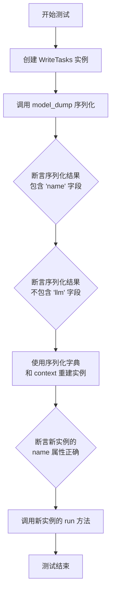
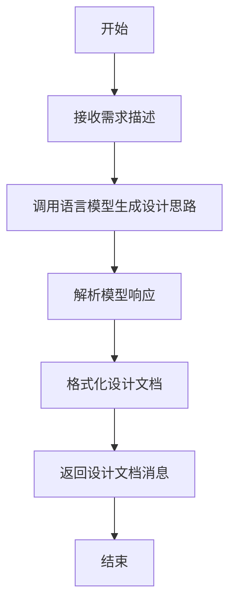
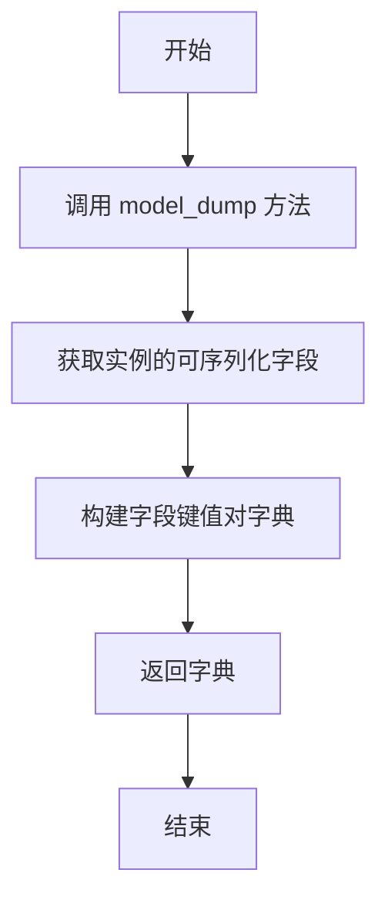
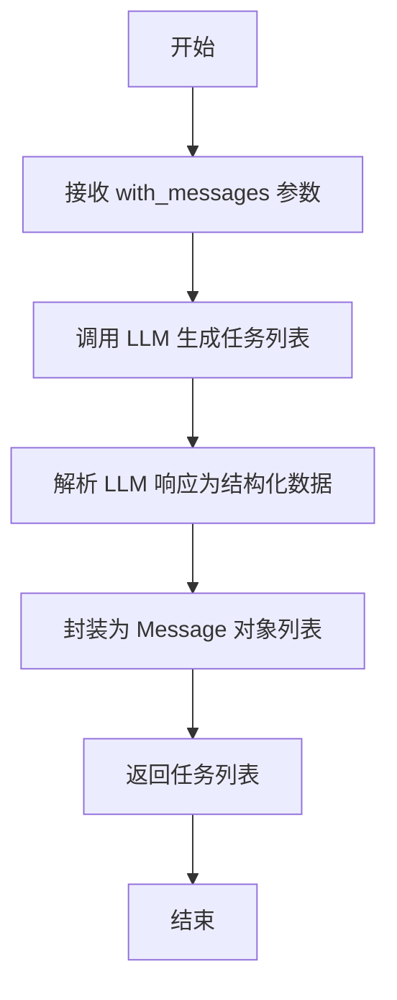

# `.\MetaGPT\tests\metagpt\serialize_deserialize\test_write_design.py` 详细设计文档

该文件是一个使用pytest框架编写的异步单元测试文件，主要用于测试MetaGPT框架中WriteDesign和WriteTasks两个Action类的序列化/反序列化功能及其核心run方法的正确性。

## 整体流程

```mermaid
graph TD
    A[开始执行测试] --> B{测试WriteDesign序列化?}
    B -- 是 --> C[创建WriteDesign实例]
    C --> D[调用model_dump()序列化]
    D --> E{验证序列化字典包含'name'但不包含'llm'?}
    E -- 否 --> F[测试失败]
    E -- 是 --> G[用序列化数据重建WriteDesign实例]
    G --> H[验证新实例名称]
    H --> I[调用新实例的run方法]
    I --> J[测试WriteTasks序列化?]
    B -- 否 --> J
    J -- 是 --> K[创建WriteTasks实例]
    K --> L[调用model_dump()序列化]
    L --> M{验证序列化字典包含'name'但不包含'llm'?}
    M -- 否 --> N[测试失败]
    M -- 是 --> O[用序列化数据重建WriteTasks实例]
    O --> P[验证新实例名称]
    P --> Q[调用新实例的run方法]
    Q --> R[所有测试通过]
    J -- 否 --> R
```

## 类结构

```
pytest框架
├── test_write_design_serialize (异步测试函数)
└── test_write_task_serialize (异步测试函数)
```

## 全局变量及字段


### `WriteDesign.name`
    
动作的名称标识符，用于区分不同的动作类型。

类型：`str`
    


### `WriteDesign.llm`
    
用于执行任务的大型语言模型实例，提供AI能力支持。

类型：`BaseLLM`
    


### `WriteDesign.context`
    
动作执行的上下文环境，包含运行时所需的各种资源和配置信息。

类型：`Context`
    


### `WriteTasks.name`
    
动作的名称标识符，用于区分不同的动作类型。

类型：`str`
    


### `WriteTasks.llm`
    
用于执行任务的大型语言模型实例，提供AI能力支持。

类型：`BaseLLM`
    


### `WriteTasks.context`
    
动作执行的上下文环境，包含运行时所需的各种资源和配置信息。

类型：`Context`
    
    

## 全局函数及方法

### `test_write_design_serialize`

这是一个使用 `pytest` 框架编写的异步单元测试函数，用于测试 `WriteDesign` 类的序列化（`model_dump`）与反序列化（通过构造函数重建）功能，并验证重建后的对象能够正确执行其核心的 `run` 方法。

参数：
- `context`：`pytest fixture`，测试上下文，提供测试所需的依赖环境（如 `LLM` 实例等）。

返回值：`None`，这是一个测试函数，其主要目的是通过断言（`assert`）来验证功能，不返回业务值。

#### 流程图

```mermaid
flowchart TD
    A[开始测试] --> B[使用context fixture<br>创建WriteDesign实例action]
    B --> C[调用action.model_dump()<br>进行序列化]
    C --> D{断言: ser_action_dict<br>包含'name'键?}
    D -- 是 --> E{断言: ser_action_dict<br>不包含'llm'键?}
    E -- 是 --> F[使用ser_action_dict和context<br>反序列化创建new_action]
    F --> G{断言: new_action.name<br>等于'WriteDesign'?}
    G -- 是 --> H[调用await new_action.run<br>执行核心功能]
    H --> I[测试通过]
    D -- 否 --> J[测试失败]
    E -- 否 --> J
    G -- 否 --> J
```

#### 带注释源码

```python
# 标记此函数为异步的pytest测试用例
@pytest.mark.asyncio
async def test_write_design_serialize(context):
    # 步骤1: 使用传入的测试上下文(context)创建一个WriteDesign动作实例
    action = WriteDesign(context=context)
    
    # 步骤2: 调用model_dump方法将action实例序列化为字典。
    #        这通常用于导出模型的字段（排除某些敏感或无需持久化的字段，如llm）。
    ser_action_dict = action.model_dump()
    
    # 步骤3: 验证序列化后的字典包含预期的字段。
    #        断言1: 字典中应包含'name'字段，用于标识动作类型。
    assert "name" in ser_action_dict
    #        断言2: 字典中不应包含'llm'字段，因为该字段可能被标记为不导出（如使用pydantic的exclude设置）。
    assert "llm" not in ser_action_dict  # not export

    # 步骤4: 反序列化过程。使用序列化后的字典和原始context，通过**解包重新构造一个新的WriteDesign实例。
    new_action = WriteDesign(**ser_action_dict, context=context)
    
    # 步骤5: 验证新构建的实例属性正确。
    #        断言3: 新实例的name属性应为"WriteDesign"。
    assert new_action.name == "WriteDesign"
    
    # 步骤6: 调用新实例的run方法，验证反序列化后的对象功能完整，可以执行其核心任务。
    #        `with_messages`参数提供了运行任务所需的初始提示或上下文信息。
    await new_action.run(with_messages="write a cli snake game")
    # 如果以上所有步骤未抛出异常，则测试通过。
```

### `test_write_task_serialize`

这是一个使用 `pytest` 框架编写的异步单元测试函数，用于测试 `WriteTasks` 动作类的序列化与反序列化功能。它验证了 `model_dump` 方法能正确导出类属性（排除特定字段如 `llm`），并能通过导出的字典成功重建一个功能完整的 `WriteTasks` 实例。

参数：

- `context`：`pytest.fixture`，测试上下文，通常包含测试所需的配置、环境等信息。

返回值：`None`，测试函数通常不显式返回值，其成功与否由断言决定。

#### 流程图



#### 带注释源码

```python
# 使用 pytest 的异步标记，表示这是一个异步测试函数
@pytest.mark.asyncio
async def test_write_task_serialize(context):
    # 1. 使用传入的 context 创建一个 WriteTasks 动作实例
    action = WriteTasks(context=context)
    
    # 2. 调用 model_dump 方法将实例序列化为字典
    ser_action_dict = action.model_dump()
    
    # 3. 断言序列化后的字典中包含 'name' 键
    assert "name" in ser_action_dict
    # 4. 断言序列化后的字典中不包含 'llm' 键（该字段被标记为不导出）
    assert "llm" not in ser_action_dict  # not export

    # 5. 使用序列化得到的字典和原始的 context 重新构建一个 WriteTasks 实例
    new_action = WriteTasks(**ser_action_dict, context=context)
    # 6. 断言新实例的 name 属性值为 "WriteTasks"
    assert new_action.name == "WriteTasks"
    
    # 7. 调用新实例的 run 方法，模拟执行一个任务（"write a cli snake game"）
    await new_action.run(with_messages="write a cli snake game")
```

### `WriteDesign.model_dump`

`model_dump` 是 Pydantic 模型基类提供的一个方法，用于将模型实例序列化为一个字典。它递归地处理所有字段，将字段名作为键，字段值作为值。对于 `WriteDesign` 这个动作类，此方法会导出其所有可序列化的字段（通常是配置和状态字段），但会排除像 `llm`（大语言模型客户端）这样的敏感或运行时依赖字段，以确保序列化结果的安全性和可移植性。

参数：
- `self`：`WriteDesign` 实例，表示要序列化的当前动作对象。
- `**kwargs`：`Any`，可选的关键字参数，用于传递给底层的 Pydantic `model_dump` 方法以定制序列化行为（例如，通过 `exclude` 排除特定字段）。

返回值：`dict`，返回一个字典，包含了 `WriteDesign` 实例所有可序列化字段的名称和值。这个字典可以用于持久化存储或通过网络传输，之后可以通过 `WriteDesign(**dict)` 的方式反序列化重建对象。

#### 流程图

```mermaid
flowchart TD
    A[开始: 调用 WriteDesign.model_dump()] --> B[Pydantic 基类 model_dump 方法]
    B --> C{遍历所有模型字段}
    C --> D[获取字段名和值]
    D --> E[检查字段是否可序列化<br>（排除如 `llm` 的字段）]
    E --> F[将字段名和值加入结果字典]
    F --> C
    C --> G[所有字段处理完毕]
    G --> H[返回序列化后的字典]
    H --> I[结束]
```

#### 带注释源码

```python
def model_dump(
    self,
    **kwargs: Any,  # 接收可选的定制化参数，如 `exclude`, `include`, `mode` 等
) -> dict:
    """
    将当前 Pydantic 模型实例序列化为字典。
    此方法继承自 Pydantic 的 `BaseModel`。

    Args:
        **kwargs: 传递给 Pydantic `model_dump` 方法的可选关键字参数。

    Returns:
        dict: 包含模型所有可序列化字段的字典。
    """
    # 调用父类 Pydantic BaseModel 的 model_dump 方法执行实际的序列化逻辑。
    # 默认情况下，它会导出所有未标记为 `exclude` 的字段。
    # 在 WriteDesign 类中，`llm` 字段很可能通过类配置被排除在序列化之外。
    return super().model_dump(**kwargs)
```

### `WriteDesign.run`

该方法执行设计文档的生成流程。它接收一个包含需求描述的消息，通过语言模型生成设计思路，然后解析并格式化输出为结构化的设计文档。

参数：

- `with_messages`：`str`，包含需求描述的字符串，用于指导设计文档的生成。

返回值：`List[Message]`，返回一个消息列表，其中包含生成的设计文档内容。

#### 流程图



#### 带注释源码

```python
async def run(self, with_messages: str) -> List[Message]:
    """
    执行设计文档生成的主要方法。
    
    参数:
        with_messages (str): 包含需求描述的字符串。
    
    返回:
        List[Message]: 包含生成的设计文档的消息列表。
    """
    # 调用语言模型生成设计思路
    prompt = self._build_prompt(with_messages)
    rsp = await self._aask(prompt)
    
    # 解析模型响应
    design_doc = self._parse_response(rsp)
    
    # 格式化设计文档
    formatted_doc = self._format_design_doc(design_doc)
    
    # 返回设计文档消息
    return [Message(content=formatted_doc, role="assistant")]
```

### `WriteTasks.model_dump`

该方法用于将`WriteTasks`类的实例序列化为一个字典。它继承自Pydantic的`BaseModel`，因此`model_dump`方法会返回一个包含模型所有可序列化字段（即非私有字段且非排除字段）的字典。在给定的上下文中，它被用于测试序列化和反序列化过程，确保`llm`等特定字段不会被导出。

参数：
- `self`：`WriteTasks`实例，表示要序列化的对象。
- `**kwargs`：可变关键字参数，用于传递给Pydantic `model_dump`方法的额外选项（例如，`exclude`、`include`等）。在测试代码中未显式使用，但方法支持。

返回值：`dict`，返回一个字典，包含`WriteTasks`实例中所有可序列化字段的键值对。

#### 流程图



#### 带注释源码

```python
def model_dump(self, **kwargs):
    """
    将模型实例序列化为字典。
    
    继承自Pydantic BaseModel，此方法会返回实例中所有
    可序列化字段的字典表示。默认排除私有字段和标记为排除的字段。
    
    Args:
        **kwargs: 传递给Pydantic model_dump方法的额外参数，
                  例如 exclude, include, mode 等。
    
    Returns:
        dict: 包含实例字段键值对的字典。
    """
    # 调用父类BaseModel的model_dump方法
    # 该方法会处理字段的序列化，包括嵌套模型、自定义编码器等
    return super().model_dump(**kwargs)
```

**注意**：由于`WriteTasks`类继承自Pydantic的`BaseModel`，其`model_dump`方法的实际实现在Pydantic库中。上述源码是一个示意性的注释，说明了方法的行为和参数。在实际的`WriteTasks`类定义中，可能不会显式重写此方法，而是直接使用继承而来的实现。测试代码验证了`llm`字段（可能是一个复杂的、不可序列化的对象）没有被包含在输出的字典中。

### `WriteTasks.run`

该方法用于执行任务编写操作，根据给定的消息（如项目描述）生成详细的任务列表。它通过调用语言模型（LLM）来解析输入，并返回结构化的任务信息。

参数：
- `with_messages`：`str`，包含项目描述或需求的消息，用于生成任务列表。

返回值：`List[Message]`，返回一个消息列表，其中包含生成的任务信息。

#### 流程图



#### 带注释源码

```python
async def run(self, with_messages: str) -> List[Message]:
    """
    执行任务编写操作，根据输入消息生成任务列表。

    Args:
        with_messages (str): 包含项目描述或需求的消息。

    Returns:
        List[Message]: 生成的任务消息列表。
    """
    # 调用语言模型生成任务列表
    prompt = self._build_prompt(with_messages)
    llm_response = await self.llm.aask(prompt)
    
    # 解析响应为结构化任务数据
    tasks = self._parse_response(llm_response)
    
    # 将任务数据封装为 Message 对象
    messages = [Message(content=task) for task in tasks]
    
    return messages
```

## 关键组件


### 序列化/反序列化机制

代码通过 `model_dump()` 方法将动作对象序列化为字典，并支持通过构造函数参数重建对象，实现了对象状态的持久化和传输，同时通过排除 `llm` 等字段来控制序列化范围。

### 异步测试框架

代码使用 `pytest.mark.asyncio` 装饰器和 `async/await` 语法，对异步方法 `run` 进行单元测试，确保了异步操作在测试环境中的正确执行。

### 依赖注入与上下文管理

测试用例通过 `context` 参数（fixture）向 `WriteDesign` 和 `WriteTasks` 动作对象注入运行所需的上下文信息，实现了依赖的解耦和灵活配置。

### 动作（Action）模式

代码测试了 `WriteDesign` 和 `WriteTasks` 这两个具体的动作类，它们封装了特定的业务逻辑（如生成设计、生成任务），并通过统一的 `run` 接口执行，体现了职责分离的设计思想。


## 问题及建议


### 已知问题

-   **测试用例与实现逻辑耦合度高**：测试用例 `test_write_design_serialize` 和 `test_write_task_serialize` 直接调用了 `WriteDesign` 和 `WriteTasks` 的 `run` 方法，并传递了具体的业务参数（`"write a cli snake game"`）。这使得测试不仅验证了序列化/反序列化功能，还依赖于特定 Action 的内部运行逻辑和 LLM 的响应。如果 `run` 方法的实现或依赖的 LLM 服务发生变化，即使序列化功能正常，测试也可能失败，降低了测试的纯粹性和稳定性。
-   **测试数据硬编码**：测试中使用的输入数据 `"write a cli snake game"` 是硬编码的字符串。这限制了测试的覆盖范围，只能验证这一种特定输入场景下的行为。如果 Action 需要处理更复杂或多样化的输入，当前的测试用例无法充分验证其健壮性。
-   **缺少异常和边界情况测试**：当前测试只验证了“正常路径”（happy path），即序列化和反序列化成功且 `run` 方法能执行的情况。没有测试异常情况，例如：反序列化时传入无效或缺失的数据、`run` 方法执行过程中发生错误等。这可能导致代码在遇到边界或异常条件时行为不可预测。
-   **异步测试可能未完全验证并发安全性**：测试使用了 `@pytest.mark.asyncio` 标记，但测试用例本身是线性的，没有模拟或测试多个 `WriteDesign` 或 `WriteTasks` 实例并发运行时的状态安全或资源竞争问题。如果这些 Action 内部有共享状态或非线程安全的操作，可能存在潜在风险。
-   **断言不够充分**：测试仅断言了序列化后的字典包含 `"name"` 键且不包含 `"llm"` 键，以及反序列化后对象的 `name` 属性正确。没有验证序列化/反序列化过程是否完整地保存和恢复了对象的所有必要状态（除了显式排除的 `llm`）。例如，`context` 或其他可能影响 `run` 方法的字段是否被正确处理。

### 优化建议

-   **解耦测试关注点**：将测试拆分为更细粒度的单元测试。例如：
    -   一个测试专门验证 `model_dump()` 方法是否正确排除了 `llm` 等敏感或无需序列化的字段，并包含了必要的字段。
    -   一个测试专门验证通过 `model_dump()` 得到的字典能否成功用于重构对象（即反序列化）。
    -   对于 `run` 方法的测试，应单独进行，并使用 Mock 对象替换掉 `llm` 等外部依赖，专注于验证 Action 的内部业务逻辑，而不是其与序列化功能的结合。
-   **参数化测试数据**：使用 `@pytest.mark.parametrize` 为测试提供多组不同的输入数据，以覆盖更广泛的场景，例如不同的任务描述、空字符串、非常长的字符串等。
-   **增加异常和边界测试**：添加测试用例来验证：
    -   向 `WriteDesign` 或 `WriteTasks` 构造函数传递无效 `ser_action_dict` 时的行为（应抛出适当的异常）。
    -   `run` 方法在接收到 `None`、空消息或非法类型消息时的处理。
    -   模拟 `llm` 调用失败时，`run` 方法的错误处理机制。
-   **增强断言**：在序列化/反序列化测试中，除了检查 `name`，还可以比较原始对象和反序列化后对象在所有应持久化的属性上是否一致（深度比较）。确保重构后的对象在功能上与原始对象等价。
-   **考虑添加集成测试**：在单元测试保证各组件正确性的基础上，可以设立一个轻量级的集成测试，使用真实的 `context` 和 Mock LLM，来验证 `WriteDesign` 和 `WriteTasks` 从序列化到执行 `run` 的完整流程。但这应与上述单元测试分离，并明确其作为集成测试的定位。
-   **明确测试依赖**：在测试文件或项目文档中，明确说明这些测试对 `metagpt.actions` 模块中 `WriteDesign` 和 `WriteTasks` 类的依赖关系，以及它们所期望的 `context` 对象的形态，有助于维护和理解测试环境。


## 其它


### 设计目标与约束

本测试代码的设计目标是验证 `WriteDesign` 和 `WriteTasks` 这两个 Action 类的序列化与反序列化功能，确保其核心属性（如 `name`）能够正确持久化，同时验证敏感或运行时依赖的属性（如 `llm`）不会被意外导出。约束包括：必须使用 `pytest` 框架进行异步测试；测试需要依赖外部提供的 `context` 夹具（fixture）；序列化/反序列化过程需使用 Pydantic 的 `model_dump` 方法。

### 错误处理与异常设计

当前测试代码未显式包含错误处理逻辑。测试的成功与否完全依赖于 `assert` 语句。如果序列化字典中缺少 `"name"` 键或包含了 `"llm"` 键，测试将失败。如果反序列化后对象的 `name` 属性与预期不符，测试将失败。如果 `run` 方法执行过程中抛出任何异常，测试也将失败。这是一种通过测试框架来捕获和报告错误的隐式错误处理设计。

### 数据流与状态机

1.  **测试数据流**：测试流程始于外部提供的 `context` 对象。首先，使用 `context` 实例化一个 Action 对象（`WriteDesign` 或 `WriteTasks`）。接着，调用 `action.model_dump()` 生成序列化字典 `ser_action_dict`。然后，利用 `**ser_action_dict` 展开该字典，并结合原始的 `context`，反序列化出一个新的 Action 对象 `new_action`。最后，调用 `new_action.run(...)` 方法执行一个示例任务。数据从 `context` 流入 Action 实例，经序列化转为字典，再反序列化重建实例，最终触发 `run` 方法。
2.  **对象状态机**：Action 对象（如 `WriteDesign`）具有初始状态（由 `context` 初始化）。`model_dump()` 调用将其可序列化状态捕获为一个静态字典。反序列化过程 `WriteDesign(**ser_action_dict, context=context)` 利用该字典和新的 `context` 创建一个新对象，该对象应达到与原始对象功能等价的状态（至少就 `name` 属性而言），从而可以成功执行 `run` 方法。

### 外部依赖与接口契约

1.  **外部依赖**：
    *   `pytest` 和 `pytest-asyncio`：测试运行框架。
    *   `metagpt.actions.WriteDesign` 和 `metagpt.actions.WriteTasks`：被测试的核心业务类。
    *   `context` 夹具：一个 `pytest` fixture，提供 Action 类运行所需的上下文环境（推测包含配置、LLM实例等）。这是测试的关键外部依赖，其具体实现和状态对测试有直接影响。
2.  **接口契约**：
    *   Action 类必须继承自 Pydantic `BaseModel`，以提供 `model_dump` 方法。
    *   Action 类必须定义 `name` 类属性或字段，并且该字段必须被包含在 `model_dump()` 的输出中。
    *   Action 类可能包含一个 `llm` 字段，并且该字段必须被 `model_dump()` 排除（通过 `model_config` 或字段配置实现）。
    *   Action 类必须实现一个异步 `run` 方法，其签名包含 `with_messages` 参数。

### 测试策略与覆盖范围

1.  **测试策略**：采用单元测试策略，聚焦于单个 Action 类的序列化/反序列化行为。测试是异步的，以匹配被测试方法 `run` 的异步特性。使用了参数化测试的潜在基础（两个几乎相同的测试函数），但当前是硬编码的。
2.  **覆盖范围**：
    *   **功能覆盖**：验证了序列化字典包含必要字段（`"name"`）且不包含敏感字段（`"llm"`）。
    *   **往返一致性**：验证了通过序列化字典能成功重建对象，且重建对象的 `name` 属性正确。
    *   **集成与可用性**：通过调用重建对象的 `run` 方法，验证了反序列化后的对象不仅是数据结构完整的，而且是功能可用的。
    *   **当前未覆盖**：未测试 `model_dump` 的其他配置项（如 `exclude_none`）；未测试 `llm` 字段被排除的具体机制（如通过 `exclude`）；未测试 `context` 在序列化/反序列化过程中的角色（测试中它是独立传入的）；未测试 `run` 方法内部逻辑的正确性，仅测试了其可被调用而不抛出异常。


    