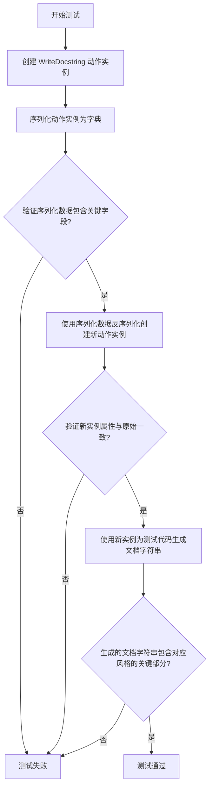
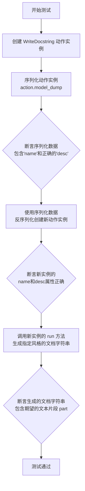
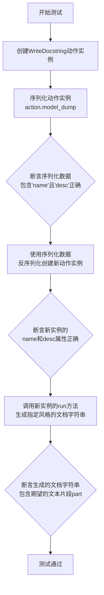
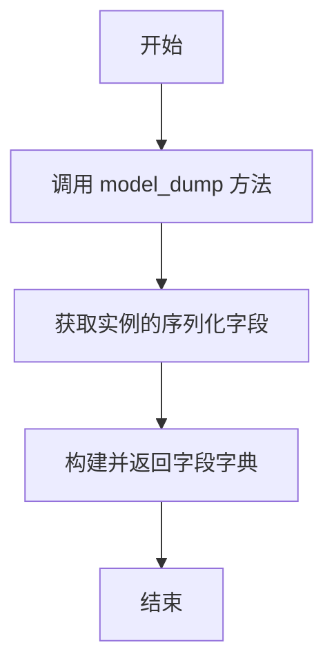
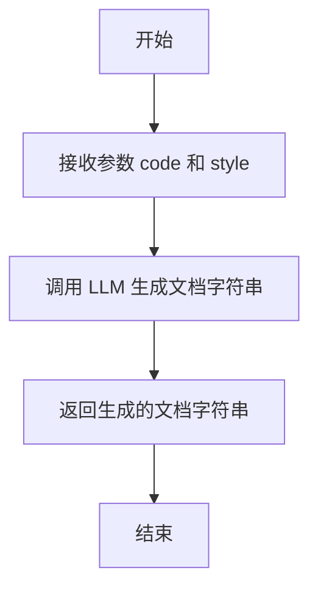
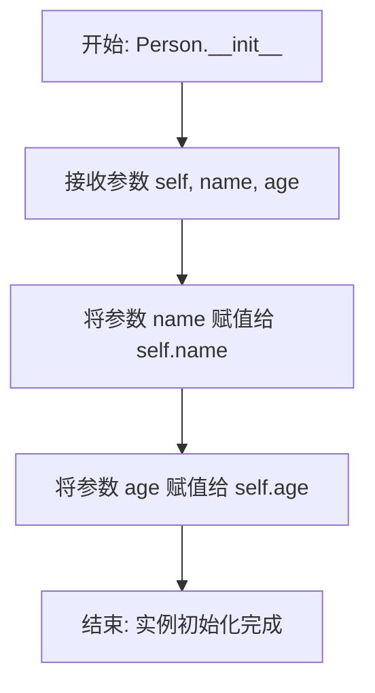
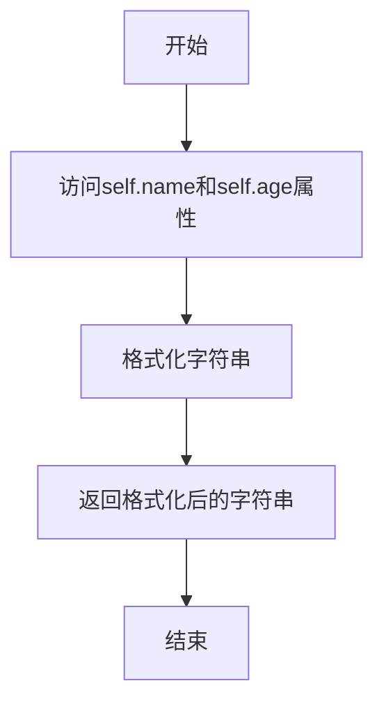

# `.\MetaGPT\tests\metagpt\serialize_deserialize\test_write_docstring.py` 详细设计文档

该文件是一个针对 WriteDocstring 动作类的单元测试，用于验证该类在序列化/反序列化后，仍能正确地为给定的代码片段生成符合不同风格（Google、NumPy、Sphinx）的文档字符串。

## 整体流程



## 类结构

```
pytest 测试框架
├── test_action_serdeser (异步测试函数)
└── 被测对象: WriteDocstring (来自 metagpt.actions.write_docstring)
```

## 全局变量及字段


### `code`
    
包含待测试函数和类定义的Python代码字符串，用于测试WriteDocstring动作生成文档字符串的功能。

类型：`str`
    


### `WriteDocstring.name`
    
动作的名称，标识该动作的类型，固定为'WriteDocstring'。

类型：`str`
    


### `WriteDocstring.desc`
    
动作的简短描述，说明其核心功能是'为代码编写文档字符串'。

类型：`str`
    


### `WriteDocstring.context`
    
动作执行的上下文环境，提供运行所需的配置、日志、工作空间等共享资源。

类型：`Context`
    


### `Person.name`
    
表示Person实例的姓名属性。

类型：`str`
    


### `Person.age`
    
表示Person实例的年龄属性。

类型：`int`
    
    

## 全局函数及方法

### `test_action_serdeser`

这是一个使用 `pytest` 框架编写的异步测试函数，用于测试 `WriteDocstring` 动作类的序列化/反序列化功能及其 `run` 方法。它通过参数化测试验证了 `WriteDocstring` 动作在生成不同风格（Google、NumPy、Sphinx）的代码文档字符串时的正确性。

参数：
- `style`：`str`，指定要测试的文档字符串风格（如 "google", "numpy", "sphinx"）。
- `part`：`str`，期望在生成的文档字符串中包含的特定文本片段，用于断言验证。
- `context`：`Context`，测试执行所需的上下文环境，通常由 `pytest` fixture 提供。

返回值：`None`，测试函数通常不返回值，而是通过断言（`assert`）来验证测试结果。

#### 流程图



#### 带注释源码

```python
# 使用 pytest 的异步和参数化装饰器标记此测试函数
@pytest.mark.asyncio
@pytest.mark.parametrize(
    # 定义参数化测试的数据集，每个元组包含 (style, part)
    ("style", "part"),
    [
        ("google", "Args:"),        # 测试 Google 风格，期望结果包含 "Args:"
        ("numpy", "Parameters"),    # 测试 NumPy 风格，期望结果包含 "Parameters"
        ("sphinx", ":param name:"), # 测试 Sphinx 风格，期望结果包含 ":param name:"
    ],
    ids=["google", "numpy", "sphinx"], # 为每组参数指定一个易读的测试ID
)
async def test_action_serdeser(style: str, part: str, context):
    # 1. 创建 WriteDocstring 动作实例
    action = WriteDocstring(context=context)
    # 2. 序列化该动作实例为字典
    serialized_data = action.model_dump()

    # 3. 验证序列化数据包含关键字段且描述正确
    assert "name" in serialized_data
    assert serialized_data["desc"] == "Write docstring for code."

    # 4. 使用序列化后的数据反序列化，创建一个新的动作实例
    new_action = WriteDocstring(**serialized_data, context=context)

    # 5. 验证新实例的属性与预期一致
    assert new_action.name == "WriteDocstring"
    assert new_action.desc == "Write docstring for code."
    # 6. 运行新实例的 `run` 方法，为提供的 `code` 生成指定 `style` 的文档字符串
    ret = await new_action.run(code, style=style)
    # 7. 验证生成的文档字符串包含对应风格的特征文本
    assert part in ret
```

### `test_action_serdeser`

该函数是一个异步的pytest测试函数，用于测试`WriteDocstring`动作类的序列化与反序列化功能，以及其`run`方法在不同文档字符串风格下的正确性。它通过参数化测试验证了三种风格（google, numpy, sphinx）的文档字符串生成。

参数：
- `style`：`str`，指定要测试的文档字符串风格（如“google”、“numpy”、“sphinx”）。
- `part`：`str`，期望在生成的文档字符串中出现的特定文本片段，用于断言验证。
- `context`：`Context`，测试执行上下文，通常由pytest fixture提供，包含动作执行所需的环境信息。

返回值：`None`，pytest测试函数不显式返回值，其通过断言（assert）来验证测试结果。

#### 流程图



#### 带注释源码

```python
# 使用pytest的异步和参数化装饰器标记此测试函数
@pytest.mark.asyncio
@pytest.mark.parametrize(
    # 定义参数化测试的数据集，每个元组包含(style, part)
    ("style", "part"),
    [
        ("google", "Args:"),        # 测试google风格，期望结果包含"Args:"
        ("numpy", "Parameters"),    # 测试numpy风格，期望结果包含"Parameters"
        ("sphinx", ":param name:"), # 测试sphinx风格，期望结果包含":param name:"
    ],
    ids=["google", "numpy", "sphinx"], # 为每组参数指定一个易读的测试ID
)
async def test_action_serdeser(style: str, part: str, context):
    # 1. 创建WriteDocstring动作实例
    action = WriteDocstring(context=context)

    # 2. 序列化动作实例为字典
    serialized_data = action.model_dump()

    # 3. 验证序列化数据的基本结构
    assert "name" in serialized_data
    assert serialized_data["desc"] == "Write docstring for code."

    # 4. 使用序列化数据反序列化，创建一个新的动作实例
    new_action = WriteDocstring(**serialized_data, context=context)

    # 5. 验证新实例的属性是否正确恢复
    assert new_action.name == "WriteDocstring"
    assert new_action.desc == "Write docstring for code."

    # 6. 调用新实例的run方法，为预定义的`code`生成指定风格的文档字符串
    ret = await new_action.run(code, style=style)

    # 7. 断言生成的文档字符串(ret)中包含对应风格的特征文本(part)
    assert part in ret
```

### `WriteDocstring.model_dump`

该方法用于将`WriteDocstring`动作实例序列化为一个字典，以便于存储、传输或重新实例化。它返回一个包含实例所有可序列化字段的字典。

参数：
-  `self`：`WriteDocstring`，`WriteDocstring`类的实例。

返回值：`dict`，一个包含实例序列化数据的字典。

#### 流程图



#### 带注释源码

```python
def model_dump(self) -> dict:
    """
    将当前动作实例序列化为一个字典。
    此方法通常由Pydantic的BaseModel提供，用于获取模型字段的字典表示。
    返回的字典可用于重新创建该动作的实例。

    Returns:
        dict: 包含实例所有可序列化字段的字典。
    """
    # 调用父类（BaseModel）的model_dump方法，获取字段的字典表示。
    # 这通常包括在类定义中声明的所有Pydantic字段。
    return super().model_dump()
```

### `WriteDocstring.run`

该方法用于为给定的代码生成指定风格的文档字符串（docstring）。

参数：

-  `code`：`str`，需要生成文档字符串的源代码字符串。
-  `style`：`str`，指定生成的文档字符串风格，例如 "google"、"numpy" 或 "sphinx"。

返回值：`str`，生成的文档字符串。

#### 流程图



#### 带注释源码

```python
async def run(self, code: str, style: str = "google") -> str:
    """
    为给定的代码生成指定风格的文档字符串。

    Args:
        code (str): 需要生成文档字符串的源代码字符串。
        style (str): 指定生成的文档字符串风格，例如 "google"、"numpy" 或 "sphinx"。

    Returns:
        str: 生成的文档字符串。
    """
    # 调用 LLM 生成文档字符串
    prompt = self._build_prompt(code, style)
    docstring = await self._aask(prompt)
    return docstring
```

### `Person.__init__`

该方法用于初始化`Person`类的实例，设置实例的`name`和`age`属性。

参数：

- `self`：`Person`，指向当前创建的`Person`类实例
- `name`：`str`，表示人员的姓名
- `age`：`int`，表示人员的年龄

返回值：`None`，此方法不返回任何值，仅用于初始化实例

#### 流程图



#### 带注释源码

```python
def __init__(self, name: str, age: int):
    # 将传入的姓名参数赋值给实例变量 self.name
    self.name = name
    # 将传入的年龄参数赋值给实例变量 self.age
    self.age = age
```

### `Person.greet`

该方法用于生成一个包含个人信息的问候语字符串。

参数：
- `self`：`Person`，指向当前Person实例的引用

返回值：`str`，返回一个格式化的问候字符串，包含实例的`name`和`age`属性。

#### 流程图



#### 带注释源码

```python
def greet(self):
    # 使用实例的name和age属性，格式化生成问候语字符串
    return f"Hello, my name is {self.name} and I am {self.age} years old."
```

## 关键组件


### WriteDocstring 类

一个用于为给定代码生成符合指定风格（如 Google、NumPy、Sphinx）的文档字符串（docstring）的 Action 类。

### 测试用例 `test_action_serdeser`

一个参数化测试函数，用于验证 `WriteDocstring` 类的序列化/反序列化（model_dump）功能，以及其 `run` 方法能够根据不同的文档字符串风格参数（`style`）生成包含特定关键词的文档字符串。


## 问题及建议


### 已知问题

-   **测试用例与类功能耦合度过高**：`test_action_serdeser` 测试函数不仅测试了 `WriteDocstring` 类的序列化/反序列化功能 (`model_dump` 和 `__init__`)，还同步测试了其核心业务逻辑 `run` 方法。这违反了单元测试的单一职责原则，使得测试目的不清晰，且当 `run` 方法逻辑变更或出错时，会同时导致序列化测试失败，增加了问题定位的复杂度。
-   **硬编码的测试数据与断言**：测试中用于验证 `run` 方法输出的断言 (`assert part in ret`) 依赖于对 `style` 参数与生成文档字符串格式之间对应关系的硬编码知识。如果 `WriteDocstring` 类内部对于不同 `style` 的输出格式发生改变，即使功能正确，此测试也会失败，降低了测试的健壮性和可维护性。
-   **异步测试的潜在复杂性**：虽然当前测试使用了 `@pytest.mark.asyncio`，但测试函数本身 (`test_action_serdeser`) 结构相对简单。如果未来 `WriteDocstring.run` 方法或相关依赖的异步逻辑变得复杂，当前扁平的测试结构可能难以处理更复杂的异步场景或错误条件测试。
-   **缺少对异常和边界条件的测试**：测试用例仅覆盖了正常路径（给定合法代码和风格参数）。未测试 `WriteDocstring` 类在接收到非法输入（如 `None`、空字符串、无效的 `style` 参数）时的行为，也未测试 `run` 方法在处理复杂或包含语法错误的代码时的鲁棒性。

### 优化建议

-   **拆分测试职责**：将 `test_action_serdeser` 拆分为至少两个独立的测试函数。一个专门测试 `WriteDocstring` 的序列化/反序列化功能（验证 `model_dump` 和通过序列化数据重建对象），另一个或多个专门测试 `run` 方法的功能（验证给定代码和风格能生成正确的文档字符串）。这符合单一职责原则，使测试意图更明确。
-   **解耦测试数据与实现细节**：对于 `run` 方法的测试，应避免直接断言生成的字符串中包含特定的硬编码片段。更优的做法是：1) 为每种 `style` 定义预期的、完整的文档字符串作为测试预期结果；或 2) 使用文档字符串解析库（如 `docstring_parser`）来解析 `run` 方法的输出，并断言解析出的结构化信息（如参数描述、返回值描述等）符合预期。这使测试不依赖于具体的文本格式，只关注功能正确性。
-   **增强测试覆盖度**：补充以下测试用例：
    -   **异常路径测试**：测试 `run` 方法在 `code` 参数为 `None`、空字符串、无效Python代码时的行为（是否抛出预期异常）。
    -   **边界条件测试**：测试 `style` 参数传入不支持的值时的行为。
    -   **复杂代码测试**：使用更复杂的代码样例（如嵌套类、装饰器、异步函数等）来测试 `run` 方法的解析和生成能力。
-   **考虑使用测试夹具 (Fixture)**：将公共的测试资源（如示例 `code` 字符串、`WriteDocstring` 实例的创建）通过 `pytest.fixture` 进行管理，提高代码复用性并使测试函数更简洁。
-   **审视异步测试的必要性**：评估 `WriteDocstring.run` 方法是否必须是异步的。如果其内部并没有真正的 `I/O` 等待或并发操作，考虑将其改为同步方法，可以简化测试和调用方的代码。如果必须异步，确保测试充分覆盖了异步上下文中的各种情况。


## 其它


### 设计目标与约束

本测试代码的设计目标是验证 `WriteDocstring` 动作类的序列化/反序列化（SerDeser）功能及其核心的文档字符串生成功能。主要约束包括：
1.  **功能验证**：确保 `WriteDocstring` 类实例可以通过 `model_dump()` 方法正确序列化，并能通过反序列化重建，且重建后的实例属性与原始实例一致。
2.  **多格式支持**：验证 `WriteDocstring` 类的 `run` 方法能够根据指定的风格参数（`google`, `numpy`, `sphinx`）为给定的示例代码生成相应格式的文档字符串。
3.  **异步兼容**：测试函数本身是异步的，需要与 `WriteDocstring.run` 异步方法正确协作。
4.  **测试隔离**：测试依赖于 `pytest` 框架和 `metagpt.actions.write_docstring.WriteDocstring` 类，应确保测试环境已正确配置这些依赖。

### 错误处理与异常设计

当前测试代码主要关注正向功能测试，未显式包含错误处理测试用例。潜在的异常场景及现有设计包括：
1.  **无效代码输入**：`WriteDocstring.run` 方法在接收到无法解析的代码字符串时，其内部实现（未在测试中展示）应能抛出适当的异常（如 `SyntaxError` 或自定义的 `CodeParseError`）。本测试未覆盖此场景。
2.  **无效风格参数**：如果传入 `run` 方法的 `style` 参数不是受支持的值（如 `"unknown"`），`WriteDocstring` 类的实现应进行处理。本测试通过参数化只测试了受支持的风格。
3.  **序列化/反序列化异常**：`action.model_dump()` 和 `WriteDocstring(**serialized_data, ...)` 调用依赖于 Pydantic 模型的基础功能。若 `WriteDocstring` 类包含不可序列化的字段，此处可能失败，但测试未涉及。
4.  **测试断言失败**：测试使用 `assert` 语句验证预期结果。任何断言失败都会导致测试用例失败，并由 `pytest` 框架报告。

### 数据流与状态机

本测试用例的数据流清晰，不涉及复杂的状态转换：
1.  **输入**：
    *   固定的示例 `code` 字符串。
    *   通过 `@pytest.mark.parametrize` 注入的参数对：`style`（文档字符串风格）和 `part`（预期在生成结果中包含的文本片段）。
    *   `pytest` fixture 提供的 `context` 对象。
2.  **处理过程**：
    *   **序列化路径**：创建 `WriteDocstring` 实例 (`action`) -> 调用 `action.model_dump()` 生成 `serialized_data` 字典 -> 验证字典包含关键字段。
    *   **反序列化与执行路径**：使用 `serialized_data` 和 `context` 重建 `WriteDocstring` 实例 (`new_action`) -> 验证新实例属性 -> 调用 `await new_action.run(code, style=style)` 生成文档字符串 (`ret`)。
3.  **输出/验证**：验证生成的文档字符串 `ret` 中包含与所选风格对应的特定文本片段 `part`。
4.  **状态**：测试函数本身是无状态的。`WriteDocstring` 类实例在测试中被创建、序列化、重建并使用，但其内部状态（如果有）未被测试显式验证，测试焦点在于其输入输出行为。

### 外部依赖与接口契约

1.  **测试框架**：`pytest` 和 `pytest-asyncio`。契约包括使用 `@pytest.mark.asyncio` 装饰异步测试函数，以及使用 `@pytest.mark.parametrize` 进行参数化测试。
2.  **被测系统 (SUT)**：`metagpt.actions.write_docstring.WriteDocstring` 类。契约包括：
    *   该类是一个 Pydantic 模型，提供 `model_dump()` 方法进行序列化。
    *   其实例化需要 `context` 参数。
    *   它拥有 `name` 和 `desc` 属性。
    *   它提供一个异步方法 `run(code: str, style: str)`，接受代码字符串和风格参数，并返回一个包含文档字符串的字符串。
3.  **测试数据**：硬编码的 `code` 字符串，定义了简单的函数和类，用作 `WriteDocstring.run` 方法的输入。
4.  **隐式依赖**：`WriteDocstring` 类的内部实现可能依赖其他库（如 `ast` 用于解析代码，或 `docstring_parser` 等用于生成文档字符串），但这些依赖的细节对当前测试是透明的，测试只关注其公共接口和行为。

    