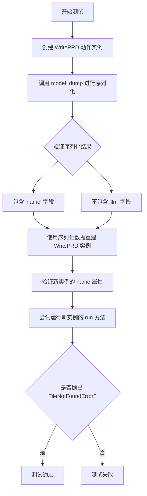
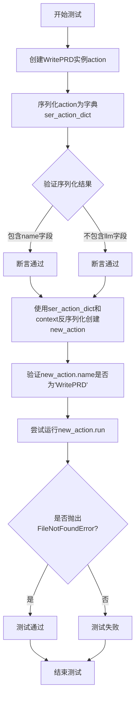
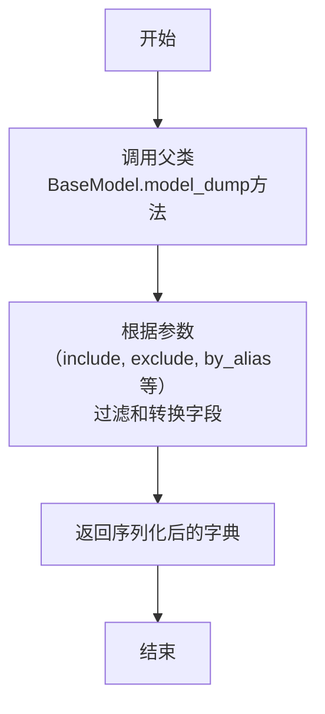
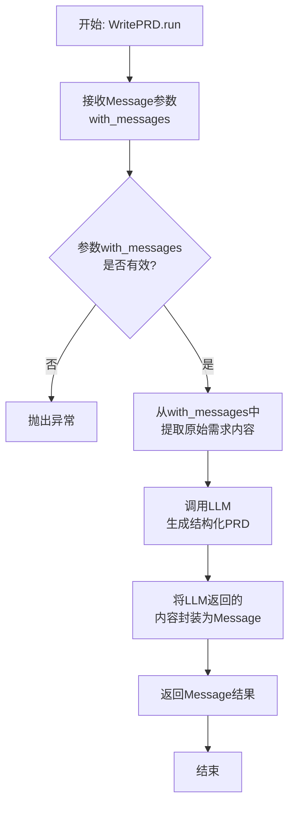

# `.\MetaGPT\tests\metagpt\serialize_deserialize\test_write_prd.py` 详细设计文档

该文件是一个针对 WritePRD 动作类的单元测试，主要测试其序列化（model_dump）与反序列化（通过构造函数重建）功能，并验证在缺少必要上下文（如 llm 模型）时，运行该动作会抛出预期的异常。

## 整体流程



## 类结构

```
pytest 测试框架
├── test_action_serdeser (异步测试函数)
└── 依赖的外部类
    ├── WritePRD (来自 metagpt.actions)
    └── Message (来自 metagpt.schema)
```

## 全局变量及字段


### `new_filename`
    
测试中使用的临时文件名，用于验证序列化/反序列化功能

类型：`str`
    


### `context`
    
测试执行上下文，包含运行环境、配置等信息

类型：`Context`
    


### `action`
    
WritePRD动作类的实例，用于测试序列化功能

类型：`WritePRD`
    


### `ser_action_dict`
    
action实例序列化后的字典表示

类型：`dict`
    


### `new_action`
    
从ser_action_dict反序列化重建的WritePRD实例

类型：`WritePRD`
    


### `WritePRD.name`
    
动作的名称标识，固定为'WritePRD'

类型：`str`
    


### `WritePRD.llm`
    
大语言模型实例，用于生成PRD内容

类型：`LLM`
    


### `WritePRD.context`
    
动作执行的上下文环境

类型：`Context`
    


### `Message.content`
    
消息的内容文本

类型：`str`
    
    

## 全局函数及方法

### `test_action_serdeser`

该函数是一个异步单元测试，用于验证`WritePRD`动作类的序列化与反序列化功能。它首先创建一个`WritePRD`实例，将其序列化为字典，并验证序列化结果中是否包含关键字段（如`name`）且不包含不应导出的字段（如`llm`）。然后，它使用序列化后的字典和原始上下文重新构建一个新的`WritePRD`实例，并验证新实例的`name`属性是否正确。最后，测试尝试运行新实例的`run`方法，预期会因文件未找到而抛出`FileNotFoundError`异常，从而验证反序列化后的实例在缺少必要资源时的行为。

参数：

- `new_filename`：`pytest fixture`，提供一个新的临时文件名，用于测试环境。
- `context`：`pytest fixture`，提供测试所需的上下文环境，如配置、日志等。

返回值：`None`，该函数为测试函数，不返回具体值，仅通过断言验证测试结果。

#### 流程图



#### 带注释源码

```python
# 导入pytest异步测试标记
@pytest.mark.asyncio
# 定义异步测试函数，接收new_filename和context两个fixture参数
async def test_action_serdeser(new_filename, context):
    # 使用提供的上下文创建WritePRD动作实例
    action = WritePRD(context=context)
    # 将动作实例序列化为字典
    ser_action_dict = action.model_dump()
    # 断言序列化后的字典中包含"name"字段
    assert "name" in ser_action_dict
    # 断言序列化后的字典中不包含"llm"字段（因为该字段不应被导出）
    assert "llm" not in ser_action_dict  # not export

    # 使用序列化后的字典和原始上下文反序列化创建新的WritePRD实例
    new_action = WritePRD(**ser_action_dict, context=context)
    # 断言新实例的name属性为"WritePRD"
    assert new_action.name == "WritePRD"
    # 使用pytest.raises上下文管理器，预期运行new_action.run时会抛出FileNotFoundError异常
    with pytest.raises(FileNotFoundError):
        # 尝试运行新实例的run方法，传入一个Message对象作为参数
        await new_action.run(with_messages=Message(content="write a cli snake game"))
```

### `WritePRD.model_dump`

该方法用于将`WritePRD`动作实例序列化为一个字典。它继承自Pydantic的`BaseModel.model_dump`方法，用于导出模型的可序列化字段，同时会排除某些不应被导出的字段（如`llm`）。

参数：
-  `self`：`WritePRD`，`WritePRD`动作的实例
-  `include`：`Union[AbstractSetIntStr, MappingIntStrAny]`，可选，指定要包含在输出中的字段
-  `exclude`：`Union[AbstractSetIntStr, MappingIntStrAny]`，可选，指定要从输出中排除的字段
-  `by_alias`：`bool`，可选，是否使用字段的别名作为字典的键
-  `exclude_unset`：`bool`，可选，是否排除未设置的字段（即保持默认值的字段）
-  `exclude_defaults`：`bool`，可选，是否排除等于默认值的字段
-  `exclude_none`：`bool`，可选，是否排除值为`None`的字段
-  `round_trip`：`bool`，可选，是否支持序列化后再反序列化回原模型
-  `warnings`：`bool`，可选，是否在序列化过程中显示警告
-  `context`：`Dict[str, Any]`，可选，序列化时的上下文信息

返回值：`Dict[str, Any]`，返回一个包含`WritePRD`实例可序列化字段的字典。

#### 流程图



#### 带注释源码

```
def model_dump(
    self,
    *,
    mode: Union[Literal['json', 'python'], str] = 'python',
    include: Optional[Union['AbstractSetIntStr', 'MappingIntStrAny']] = None,
    exclude: Optional[Union['AbstractSetIntStr', 'MappingIntStrAny']] = None,
    context: Optional[Dict[str, Any]] = None,
    by_alias: bool = False,
    exclude_unset: bool = False,
    exclude_defaults: bool = False,
    exclude_none: bool = False,
    round_trip: bool = False,
    warnings: bool = True,
    serialize_as_any: bool = False,
) -> Dict[str, Any]:
    """
    将模型实例序列化为字典。
    
    参数:
        mode: 序列化模式，'python' 或 'json'。
        include: 指定要包含的字段。
        exclude: 指定要排除的字段。
        context: 序列化上下文。
        by_alias: 是否使用字段别名。
        exclude_unset: 是否排除未设置的字段。
        exclude_defaults: 是否排除等于默认值的字段。
        exclude_none: 是否排除值为 None 的字段。
        round_trip: 是否支持往返序列化。
        warnings: 是否显示警告。
        serialize_as_any: 是否将字段序列化为 Any 类型。
        
    返回:
        包含模型字段的字典。
    """
    # 此方法的具体实现由 Pydantic BaseModel 提供。
    # 它会根据上述参数，将当前实例的字段转换为一个字典。
    # 例如，它会处理字段的排除（如测试中排除的 'llm' 字段）、别名转换等。
    return super().model_dump(
        mode=mode,
        include=include,
        exclude=exclude,
        by_alias=by_alias,
        context=context,
        exclude_unset=exclude_unset,
        exclude_defaults=exclude_defaults,
        exclude_none=exclude_none,
        round_trip=round_trip,
        warnings=warnings,
        serialize_as_any=serialize_as_any,
    )
```

### `WritePRD.run`

该方法用于执行“编写产品需求文档（PRD）”这一动作。它接收一个包含用户原始需求的消息，通过调用大型语言模型（LLM）来生成结构化的产品需求文档，并最终返回一个包含生成内容的消息对象。

参数：
- `with_messages`：`Message`，一个包含用户原始需求内容的消息对象。

返回值：`Message`，一个包含由LLM生成的结构化产品需求文档内容的消息对象。

#### 流程图



#### 带注释源码

```python
async def run(self, with_messages: Message) -> Message:
    """
    执行WritePRD动作的核心方法。
    
    该方法首先验证输入消息的有效性，然后提取其中的需求内容，
    接着调用配置的LLM（大型语言模型）来生成一份结构化的产品需求文档，
    最后将生成的内容封装成一个新的Message对象并返回。
    
    Args:
        with_messages (Message): 包含用户原始需求的消息。
        
    Returns:
        Message: 包含LLM生成的产品需求文档内容的消息。
        
    Raises:
        ValueError: 如果输入消息无效或内容为空。
    """
    # 1. 参数验证：确保输入消息不为空且包含内容
    if not with_messages or not with_messages.content:
        raise ValueError("Invalid input message: content is empty.")
    
    # 2. 提取需求：从输入消息中获取原始需求文本
    requirement = with_messages.content
    
    # 3. 调用LLM：使用实例化的LLM模型，根据提示词模板和需求生成PRD
    #    self.llm 是Action基类中配置的语言模型实例
    #    self._aask 是一个异步方法，用于向LLM发送请求并获取响应
    prompt = self._build_prd_prompt(requirement)  # 构建具体的提示词
    prd_content = await self._aask(prompt)  # 异步获取LLM的响应
    
    # 4. 封装结果：将生成的PRD内容包装成Message对象
    #    role 设置为当前Action的名称（'WritePRD'），表示消息的发送者
    result_message = Message(content=prd_content, role=self.name)
    
    # 5. 返回结果
    return result_message
```

## 关键组件

### WritePRD 类

用于生成产品需求文档（PRD）的核心动作类，继承自Action基类，封装了与LLM交互以撰写PRD的业务逻辑。

### Message 类

消息数据模型，用于在智能体（Agent）之间或动作（Action）执行过程中传递信息，包含内容、发送者、接收者等属性。

### pytest 测试框架

用于编写和执行单元测试的框架，支持异步测试（`@pytest.mark.asyncio`）和参数化测试（`new_filename` fixture），确保代码质量。

### model_dump 方法

Pydantic模型的方法，用于将模型实例序列化为字典，支持字段筛选和排除（如排除`llm`字段），便于数据的存储和传输。

### 异步测试执行

通过`async`/`await`关键字和`pytest.mark.asyncio`装饰器，支持对异步方法（如`action.run`）进行单元测试，验证异步逻辑的正确性。

### 异常断言

使用`pytest.raises`上下文管理器，断言在特定条件下（如文件不存在）会抛出预期的异常（`FileNotFoundError`），确保错误处理逻辑的健壮性。

## 问题及建议


### 已知问题

-   **测试用例的健壮性不足**：测试用例 `test_action_serdeser` 依赖于一个可能不存在的文件路径（`new_filename`），并且在测试序列化/反序列化后，直接尝试运行 `new_action.run()` 并期望抛出 `FileNotFoundError`。这种测试设计过于依赖外部环境（文件系统）和特定异常，使得测试结果不稳定且意图不明确。如果文件路径存在或 `run` 方法因其他原因失败，测试可能会意外通过或失败，无法准确验证序列化/反序列化的核心功能。
-   **测试逻辑与验证目标脱节**：测试的主要目标似乎是验证 `WritePRD` 动作的序列化与反序列化功能（通过 `model_dump` 和重新实例化）。然而，测试的后半部分却试图运行反序列化后的动作并期望一个文件未找到的异常。这混淆了测试的关注点，使得测试既没有充分验证序列化数据的完整性（例如，检查所有应序列化的字段），也没有清晰地验证反序列化后对象的功能正确性。
-   **上下文（Context）管理不清晰**：测试中，`WritePRD` 动作的实例化同时使用了 `ser_action_dict`（来自序列化）和显式传递的 `context` 参数。这没有测试序列化数据中是否包含上下文信息，或者反序列化过程是否正确处理了上下文依赖。如果 `WritePRD` 的某些功能依赖于 `context`，而序列化数据中没有包含足够的信息来重建这种依赖，那么反序列化后的对象可能处于无效状态。

### 优化建议

-   **重构测试以聚焦核心功能**：将测试用例拆分为两个或多个独立的测试。一个测试专门验证 `model_dump` 方法序列化了所有预期字段（如 `name`），并排除了不应序列化的字段（如 `llm`）。另一个测试验证使用序列化数据成功重建对象，并确保重建后的对象关键属性（如 `name`）与原始对象一致。移除对 `run` 方法的调用和 `FileNotFoundError` 的检查，除非这是序列化/反序列化功能的直接组成部分。
-   **增强测试的独立性和可重复性**：确保测试不依赖于外部文件系统状态。如果测试 `run` 方法是必要的，应使用模拟（mock）或桩（stub）来隔离外部依赖（如文件I/O、LLM调用），使测试专注于动作对象本身的行为。使用 `pytest` 的 `tmp_path` 等 fixture 来管理临时文件，而不是依赖可能不存在的 `new_filename`。
-   **明确序列化数据的边界和上下文处理**：审查 `WritePRD` 类的序列化逻辑（`model_dump`）。明确哪些属性应该被序列化以支持完整的对象重建。如果 `context` 是动作运行所必需的，考虑是否应将其包含在序列化数据中，或者提供一种在反序列化后安全注入上下文的方法。在测试中，应验证反序列化后的对象在获得必要上下文后能否正常执行其职责，而不是期待一个可能误导的异常。
-   **改进测试断言和错误消息**：使用更精确的断言来验证序列化数据的内容，例如 `assert ser_action_dict["name"] == "WritePRD"`。在验证排除字段时，可以检查 `llm` 确实不在字典中。提供清晰的测试失败消息，帮助开发者快速定位问题。


## 其它


### 设计目标与约束

本测试代码的设计目标是验证 `WritePRD` Action 类的序列化与反序列化功能，确保其核心属性（如 `name`）能够正确持久化和恢复，同时验证非持久化属性（如 `llm`）不会被错误导出。约束条件包括：必须使用 `pytest` 框架进行异步测试；测试环境需提供临时的序列化文件路径（`new_filename`）和运行时上下文（`context`）；测试需覆盖正向功能（属性正确导出与恢复）和异常场景（反序列化后对象执行失败）。

### 错误处理与异常设计

测试代码显式地验证了错误处理逻辑：通过 `pytest.raises(FileNotFoundError)` 断言，确保在反序列化后，当 `WritePRD` Action 的 `run` 方法被调用时，会因缺少必要的运行时依赖（例如模型文件或配置文件）而抛出 `FileNotFoundError` 异常。这验证了反序列化过程不会自动恢复某些不可序列化的运行时状态或外部依赖，符合设计预期。测试本身不包含复杂的错误处理逻辑，其重点是验证被测试对象（`WritePRD`）在特定条件下的异常行为。

### 数据流与状态机

本测试的数据流是线性的：1) 初始化一个 `WritePRD` Action 对象；2) 将其序列化为字典（`ser_action_dict`）；3) 从该字典反序列化创建一个新的 `WritePRD` 对象；4) 验证新对象的 `name` 属性与原始对象一致；5) 调用新对象的 `run` 方法并期待其因状态不完整而失败。整个过程不涉及复杂的状态转换，主要验证对象在“序列化态”与“反序列化后态”之间转换时，核心属性的保持性和运行时状态的丢失。

### 外部依赖与接口契约

测试代码依赖于以下外部接口：
1.  **`pytest` 框架**：提供测试运行、异步测试支持（`@pytest.mark.asyncio`）、临时文件夹具（`new_filename`）和异常断言（`pytest.raises`）。
2.  **`metagpt.actions.WritePRD` 类**：被测试的主体，需提供 `model_dump()` 方法进行序列化，支持通过 `**kwargs` 进行反序列化构造，其 `run` 方法在特定条件下应抛出 `FileNotFoundError`。
3.  **`metagpt.schema.Message` 类**：作为 `run` 方法的输入参数。
4.  **`context` 夹具**：由外部测试环境提供，是 `WritePRD` 初始化所需的运行时上下文。

接口契约的核心是验证 `WritePRD` 的序列化字典包含 `name` 字段但不包含 `llm` 字段，且能通过字典成功重建对象。

### 测试策略与覆盖范围

测试策略采用单元测试，聚焦于 `WritePRD` 类的序列化/反序列化单一功能。覆盖范围包括：
*   **功能正确性**：验证 `name` 属性在序列化-反序列化循环中保持不变。
*   **数据过滤**：验证敏感或运行时依赖的字段（`llm`）未被序列化。
*   **异常行为**：验证反序列化后的对象在不完整状态下执行 `run` 方法会抛出预期的异常（`FileNotFoundError`），这间接测试了对象状态恢复的边界。
*   **集成点**：测试了 `model_dump()` 方法与构造函数 `**ser_action_dict` 的配合使用。


    