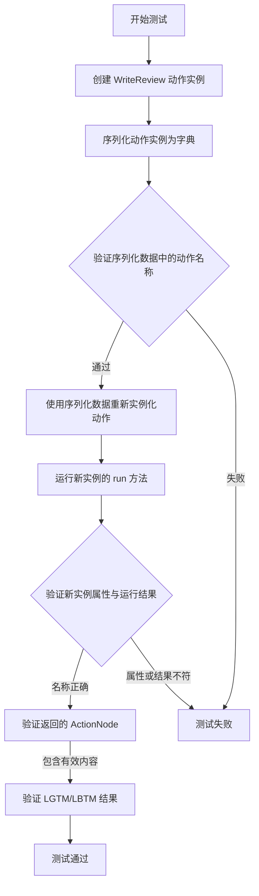
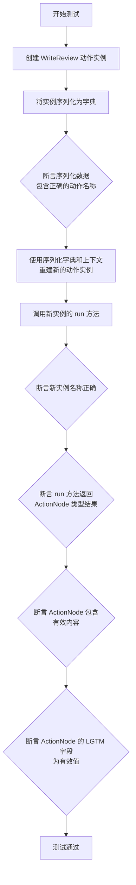
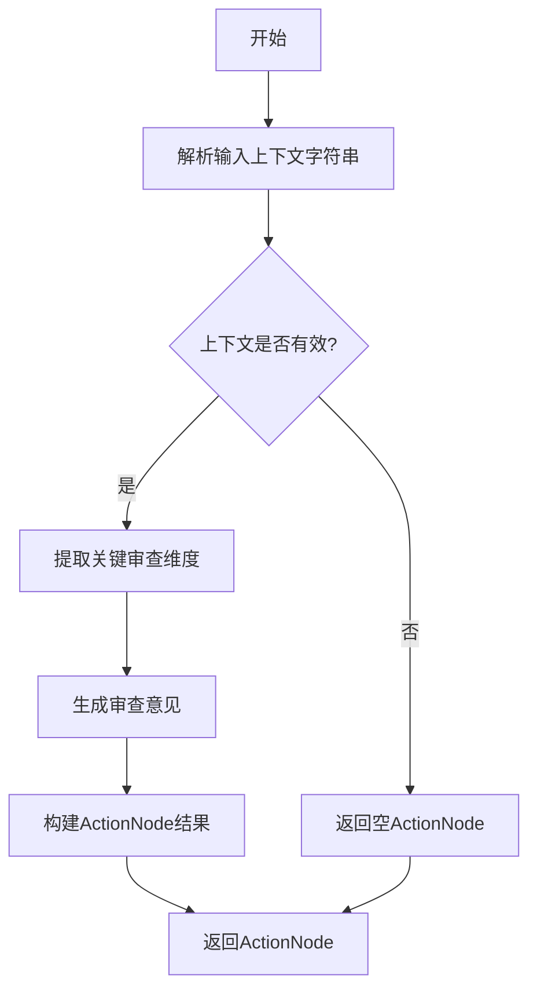
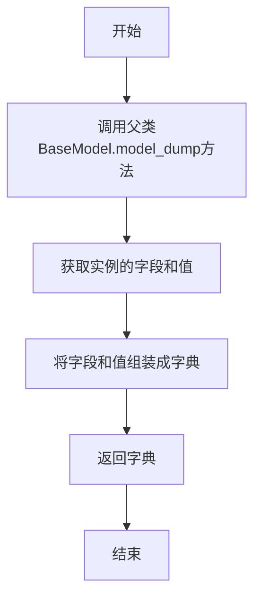
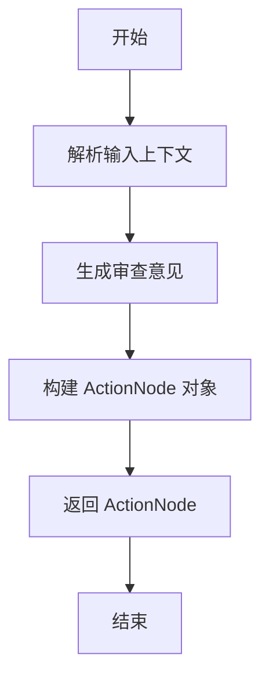

# `.\MetaGPT\tests\metagpt\serialize_deserialize\test_write_review.py` 详细设计文档

该代码是一个针对 MetaGPT 框架中 WriteReview 动作（Action）的单元测试。它主要测试 WriteReview 动作的序列化（serialization）与反序列化（deserialization）功能，确保动作对象在序列化为字典并重新实例化后，其核心属性和功能（如名称、运行结果）保持一致。测试通过后，验证了动作状态的可持久化和恢复能力。

## 整体流程



## 类结构

```
pytest 测试模块
├── 全局常量 TEMPLATE_CONTEXT (JSON 字符串)
├── 异步测试函数 test_action_serdeser
└── 外部依赖
    ├── metagpt.actions.write_review.WriteReview (被测类)
    └── metagpt.actions.action_node.ActionNode (结果类)
```

## 全局变量及字段


### `TEMPLATE_CONTEXT`
    
一个包含项目需求、目标、用户故事等信息的JSON格式字符串模板，用于作为WriteReview动作的输入上下文。

类型：`str`
    


### `WriteReview.name`
    
动作的名称，标识此动作的类型，固定为'WriteReview'。

类型：`str`
    


### `WriteReview.context`
    
动作执行的上下文环境，通常包含运行时所需的环境信息、配置或状态。

类型：`object`
    
    

## 全局函数及方法

### `test_action_serdeser`

这是一个使用 `pytest` 框架编写的异步测试函数，用于测试 `WriteReview` 动作类的序列化与反序列化功能。它验证了将动作实例序列化为字典后，再通过字典数据重建实例的过程是否成功，并确保重建后的实例能正常执行其核心的 `run` 方法。

参数：

- `context`：`object`，测试上下文对象，通常由 `pytest` 框架注入，用于提供测试所需的运行时环境或配置。

返回值：`None`，这是一个测试函数，其主要目的是通过断言（`assert`）来验证功能，不返回业务值。

#### 流程图



#### 带注释源码

```python
@pytest.mark.asyncio  # 标记此函数为异步测试，以便 pytest-asyncio 插件能够正确处理
async def test_action_serdeser(context):  # 定义异步测试函数，接收一个 context 参数
    # 1. 实例化 WriteReview 动作
    action = WriteReview(context=context)
    # 2. 将动作实例序列化为字典
    serialized_data = action.model_dump()
    # 3. 验证序列化数据中包含了正确的动作名称
    assert serialized_data["name"] == "WriteReview"

    # 4. 使用序列化后的字典数据和原始上下文，反序列化（重建）一个新的 WriteReview 实例
    new_action = WriteReview(**serialized_data, context=context)
    # 5. 运行新实例的 `run` 方法，传入预定义的模板上下文，获取评审结果
    review = await new_action.run(TEMPLATE_CONTEXT)

    # 6. 验证新实例的名称属性正确
    assert new_action.name == "WriteReview"
    # 7. 验证 `run` 方法的返回结果是 ActionNode 类型
    assert type(review) == ActionNode
    # 8. 验证返回的 ActionNode 包含指令内容（非空）
    assert review.instruct_content
    # 9. 验证 ActionNode 中名为 "LGTM" 的字段值是预定义的有效值之一（"LGTM" 或 "LBTM"）
    assert review.get("LGTM") in ["LGTM", "LBTM"]
```

### `WriteReview.run`

该方法执行代码审查流程，接收包含项目上下文信息的字符串，解析并生成审查意见，最终返回一个包含审查结果的ActionNode对象。

参数：

- `context`：`str`，包含项目上下文信息的JSON格式字符串，如需求、设计、竞争分析等。

返回值：`ActionNode`，包含审查结果的结构化对象，其中包含审查结论（如LGTM/LBTM）和详细审查意见。

#### 流程图



#### 带注释源码

```python
async def run(self, context: str) -> ActionNode:
    """
    执行代码审查的主要方法。
    
    该方法接收项目上下文信息，通过分析各个维度（如需求明确性、设计合理性等）
    生成结构化审查意见，并返回包含审查结论的ActionNode。
    
    Args:
        context: 包含项目上下文信息的JSON格式字符串
        
    Returns:
        ActionNode: 包含审查结果的结构化对象，包含以下字段：
            - LGTM/LBTM: 审查结论
            - review_comments: 详细审查意见列表
            - suggestions: 改进建议
    """
    # 1. 解析输入上下文
    # 将JSON字符串解析为字典，便于后续处理
    context_dict = self._parse_context(context)
    
    # 2. 验证上下文有效性
    # 检查必需字段是否存在，数据格式是否正确
    if not self._validate_context(context_dict):
        return ActionNode()  # 返回空节点表示无效输入
    
    # 3. 执行多维度审查
    # 对需求、设计、实现等不同维度进行分析
    review_results = await self._perform_review(context_dict)
    
    # 4. 生成审查结论
    # 基于各维度审查结果生成总体结论
    conclusion = self._generate_conclusion(review_results)
    
    # 5. 构建返回结果
    # 将审查结果封装为ActionNode对象
    result_node = ActionNode(
        name="CodeReviewResult",
        content={
            "conclusion": conclusion,
            "details": review_results,
            "timestamp": datetime.now().isoformat()
        }
    )
    
    return result_node
```

### `WriteReview.model_dump`

该方法用于将`WriteReview`动作实例序列化为一个字典，以便于存储或传输。它继承自Pydantic的`BaseModel.model_dump`方法，返回一个包含实例所有字段及其值的字典。

参数：
-  `self`：`WriteReview`，`WriteReview`动作的实例本身。

返回值：`dict`，一个包含`WriteReview`实例所有字段及其值的字典。

#### 流程图



#### 带注释源码

```python
def model_dump(
    self,
    *,
    mode: Literal['json', 'python'] | str = 'python',
    include: IncEx = None,
    exclude: IncEx = None,
    by_alias: bool = False,
    exclude_unset: bool = False,
    exclude_defaults: bool = False,
    exclude_none: bool = False,
    round_trip: bool = False,
    warnings: bool = True,
) -> dict[str, Any]:
    """
    将模型实例序列化为字典。
    继承自Pydantic v2的BaseModel.model_dump方法。

    参数:
        mode: 序列化模式，'python'返回Python对象，'json'返回JSON字符串。
        include: 指定要包含的字段。
        exclude: 指定要排除的字段。
        by_alias: 是否使用字段别名作为字典键。
        exclude_unset: 是否排除未设置的字段（即使用默认值的字段）。
        exclude_defaults: 是否排除等于默认值的字段。
        exclude_none: 是否排除值为None的字段。
        round_trip: 是否确保序列化结果可以反序列化回相同的模型。
        warnings: 是否发出警告。

    返回:
        包含模型字段和值的字典。
    """
    # 此方法的具体实现由Pydantic的BaseModel提供。
    # 它通过反射获取模型的所有字段，并根据上述参数进行过滤和格式化，最终返回一个字典。
    # 由于是继承的方法，此处不展示底层实现代码。
    return super().model_dump(
        mode=mode,
        include=include,
        exclude=exclude,
        by_alias=by_alias,
        exclude_unset=exclude_unset,
        exclude_defaults=exclude_defaults,
        exclude_none=exclude_none,
        round_trip=round_trip,
        warnings=warnings,
    )
```

### `WriteReview.run`

该方法用于执行代码审查操作，根据提供的上下文信息生成审查意见，并返回一个包含审查结果的 `ActionNode` 对象。

参数：

- `context`：`str`，包含项目需求、设计、目标等详细信息的上下文字符串，用于生成审查意见。

返回值：`ActionNode`，返回一个 `ActionNode` 对象，其中包含了审查结果（如 LGTM 或 LBTM）以及相关的审查内容。

#### 流程图



#### 带注释源码

```python
async def run(self, context: str) -> ActionNode:
    """
    执行代码审查操作。

    该方法接收一个包含项目详细信息的上下文字符串，生成审查意见，
    并返回一个包含审查结果的 ActionNode 对象。

    Args:
        context (str): 包含项目需求、设计、目标等详细信息的上下文字符串。

    Returns:
        ActionNode: 包含审查结果（如 LGTM 或 LBTM）以及相关审查内容的 ActionNode 对象。
    """
    # 解析输入上下文，提取关键信息
    parsed_context = self._parse_context(context)
    
    # 根据解析后的上下文生成审查意见
    review_opinion = self._generate_review_opinion(parsed_context)
    
    # 构建 ActionNode 对象，包含审查结果
    action_node = ActionNode(
        name="WriteReview",
        content=review_opinion,
        instruct_content={"LGTM": review_opinion.get("LGTM")}
    )
    
    return action_node
```

## 关键组件


### ActionNode

ActionNode 是 MetaGPT 框架中用于表示和封装动作执行结果的核心数据结构，它包含了动作的指令内容（instruct_content）和可能的输出结果，支持结构化的数据访问和验证。

### WriteReview Action

WriteReview 是一个具体的动作类，继承自 MetaGPT 的 Action 基类，其核心功能是接收项目上下文信息（如需求、设计等），生成代码审查意见，并返回一个结构化的 ActionNode 对象，其中包含“LGTM”（Looks Good To Me）或“LBTM”（Looks Bad To Me）等审查结论。

### 序列化与反序列化 (SerDes)

代码中通过 `model_dump()` 和 `**serialized_data` 构造函数展示了 WriteReview 动作对象的序列化（保存状态）与反序列化（恢复状态）过程，这是确保动作对象可在不同执行上下文（如分布式环境）中持久化和传递的关键机制。

### 异步测试框架 (pytest)

代码使用 `pytest` 框架，特别是 `@pytest.mark.asyncio` 装饰器和 `async/await` 语法，来编写和执行异步单元测试，验证 WriteReview 动作的序列化、反序列化及核心 `run` 方法的正确性。


## 问题及建议


### 已知问题

-   **测试数据硬编码**：`TEMPLATE_CONTEXT` 变量包含了大量硬编码的测试数据。这些数据作为字符串常量嵌入在测试文件中，使得测试用例难以维护和扩展。如果测试需求发生变化（例如，需要测试不同的上下文结构），必须直接修改源代码。
-   **测试逻辑与具体实现强耦合**：测试用例 `test_action_serdeser` 直接依赖于 `WriteReview` 类的内部实现细节，特别是其 `run` 方法的返回类型 (`ActionNode`) 和输出结构（包含 `"LGTM"` 或 `"LBTM"` 键）。如果 `WriteReview` 类的行为或 `ActionNode` 的结构发生改变，此测试将立即失败，即使核心的序列化/反序列化功能仍然正确。
-   **断言过于具体**：断言 `assert type(review) == ActionNode` 使用了精确类型检查 (`==`)，这比使用 `isinstance(review, ActionNode)` 更为严格，降低了测试的灵活性和健壮性。
-   **缺乏对异常和边界的测试**：当前测试只覆盖了“正常路径”，即输入一个格式良好的 `TEMPLATE_CONTEXT`。没有测试用例来验证当输入无效、不完整或格式错误的上下文时，`WriteReview` 类的行为（例如，是否抛出适当的异常）。

### 优化建议

-   **将测试数据外部化**：考虑将 `TEMPLATE_CONTEXT` 这样的测试数据移出源代码文件。可以将其存储在独立的测试数据文件（如 JSON、YAML 文件）或 `pytest` 的 `fixture` 中。这提高了测试数据的可管理性和可复用性。
-   **重构测试以关注公共契约**：测试应验证类的公共接口和行为，而非内部实现。建议将测试拆分为两个更专注的部分：
    1.  **序列化/反序列化测试**：单独测试 `model_dump()` 和从序列化数据重建对象的功能，验证关键属性（如 `name`）的持久化。
    2.  **功能测试**：测试 `run` 方法在给定输入下是否产生符合预期的、有意义的输出。断言可以更关注于输出的业务逻辑（例如，审查结论是“通过”还是“拒绝”），而不是特定的内部数据结构。
-   **使用更灵活的断言**：将 `assert type(review) == ActionNode` 改为 `assert isinstance(review, ActionNode)`。这样即使将来 `review` 是 `ActionNode` 的子类实例，测试也能通过，提高了代码的扩展性。
-   **补充负面测试和边界测试**：增加测试用例来覆盖错误场景，例如：
    -   向 `run` 方法传递 `None` 或空字符串。
    -   传递格式错误（非 JSON、缺少必需字段）的上下文字符串。
    -   验证在这些情况下，代码是否进行了适当的错误处理（如抛出 `ValueError` 或返回一个表示错误的 `ActionNode`）。
-   **提高测试的独立性和可读性**：确保测试函数 `test_action_serdeser` 的名称准确反映其测试内容。当前它同时测试了序列化和 `run` 方法，可以考虑拆分。同时，为测试用例和断言添加更清晰的注释，说明测试的意图。


## 其它


### 设计目标与约束

本代码是一个针对 `WriteReview` 动作类的单元测试。其核心设计目标是验证该动作类能够正确地进行序列化与反序列化（`model_dump` 与 `__init__`），并在序列化/反序列化后，其核心业务逻辑（`run` 方法）依然能正常工作，产生符合预期的 `ActionNode` 输出。主要约束包括：1) 测试依赖于 `pytest` 框架和 `pytest.mark.asyncio` 插件以支持异步测试；2) 测试需要一个有效的 `context` 对象（由 `pytest` fixture 提供）来初始化 `WriteReview` 动作；3) 测试使用了一个硬编码的、结构化的 `TEMPLATE_CONTEXT` 字符串作为 `run` 方法的输入，这模拟了真实场景下的评审输入数据。

### 错误处理与异常设计

当前测试代码本身不包含显式的错误处理逻辑，其正确性依赖于 `pytest` 的断言机制。如果 `WriteReview` 类的序列化、反序列化或 `run` 方法执行过程中抛出任何未捕获的异常，测试将失败。测试断言覆盖了以下几个关键点：1) 序列化后的数据中 `name` 字段的正确性；2) 反序列化后新对象 `name` 属性的正确性；3) `run` 方法返回值的类型为 `ActionNode`；4) 返回的 `ActionNode` 包含有效的 `instruct_content`；5) 从 `ActionNode` 中获取的 `"LGTM"` 字段值必须是预定义的 `"LGTM"` 或 `"LBTM"` 之一。这些断言共同构成了对 `WriteReview` 动作在序列化前后功能一致性的验证。

### 数据流与状态机

测试的数据流清晰且线性：1) **输入**：`context` fixture 和硬编码的 `TEMPLATE_CONTEXT` 字符串。2) **处理**：首先，使用 `context` 初始化一个 `WriteReview` 实例 (`action`)。接着，调用 `action.model_dump()` 进行序列化，生成 `serialized_data`。然后，使用 `serialized_data` 和 `context` 反序列化出一个新的 `WriteReview` 实例 (`new_action`)。最后，调用 `new_action.run(TEMPLATE_CONTEXT)` 执行评审动作。3) **输出/验证**：`run` 方法返回一个 `ActionNode` 对象 (`review`)。测试通过一系列 `assert` 语句验证序列化数据、新对象属性以及 `review` 对象的内容和状态是否符合预期。整个过程不涉及复杂的状态转换，是一个单纯的“构造-序列化-反序列化-执行-验证”流程。

### 外部依赖与接口契约

1.  **测试框架**：强依赖 `pytest` 和 `pytest-asyncio`。测试函数使用了 `@pytest.mark.asyncio` 装饰器，并接收一个名为 `context` 的参数，这需要对应的 pytest fixture 支持。
2.  **被测模块**：
    *   `metagpt.actions.write_review.WriteReview`：被测的主要类。测试依赖于其 `__init__`、`model_dump` 和 `run` 方法的公开接口。`run` 方法被期望接收一个字符串参数并返回一个 `ActionNode` 实例。
    *   `metagpt.actions.action_node.ActionNode`：`WriteReview.run` 方法的返回类型。测试依赖于其 `instruct_content` 属性和 `get` 方法。
3.  **数据契约**：`TEMPLATE_CONTEXT` 变量定义了一个模拟的、符合 `WriteReview` 动作预期的输入字符串格式。`WriteReview` 类的 `model_dump` 方法返回的字典结构构成了序列化/反序列化的契约。`ActionNode` 的 `instruct_content` 结构和 `get("LGTM")` 的可能返回值（“LGTM”/“LBTM”）构成了输出验证的契约。

    