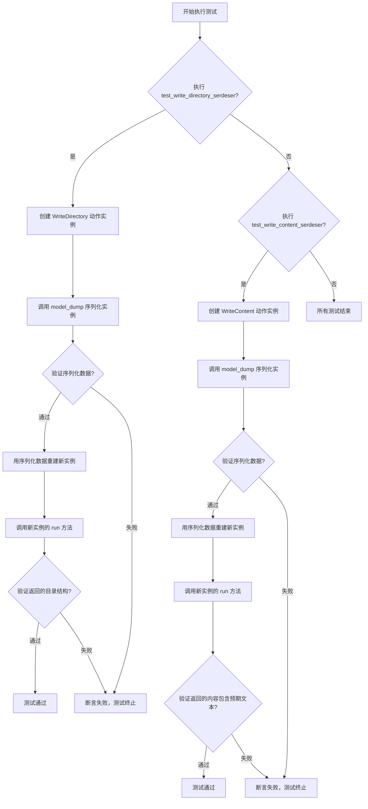
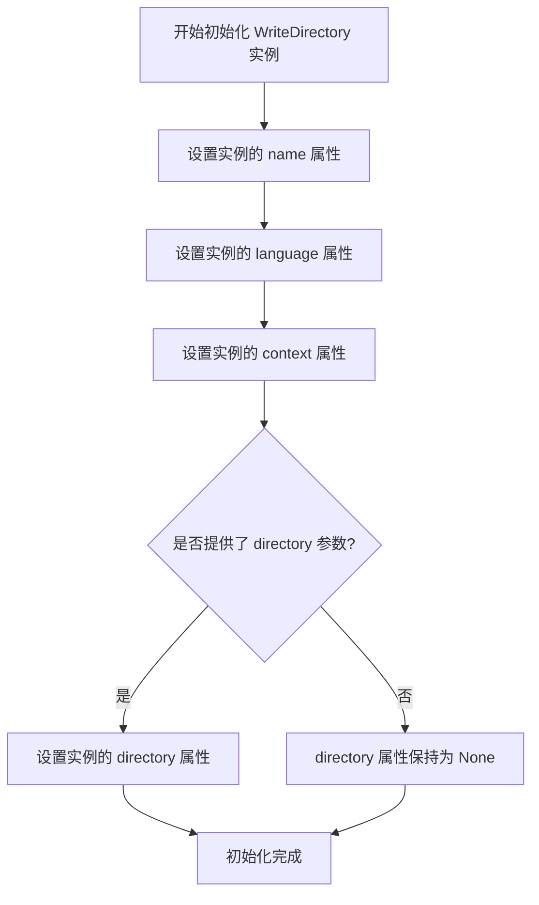
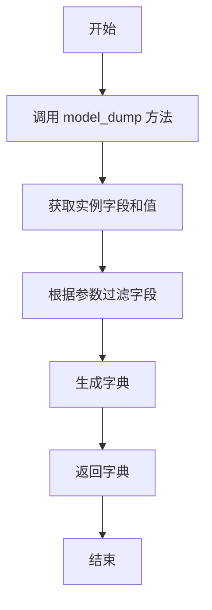
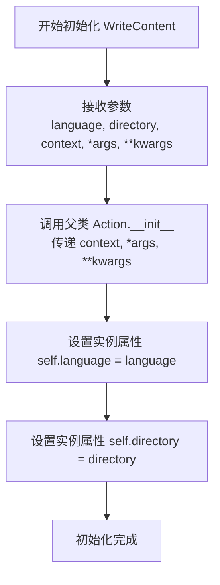
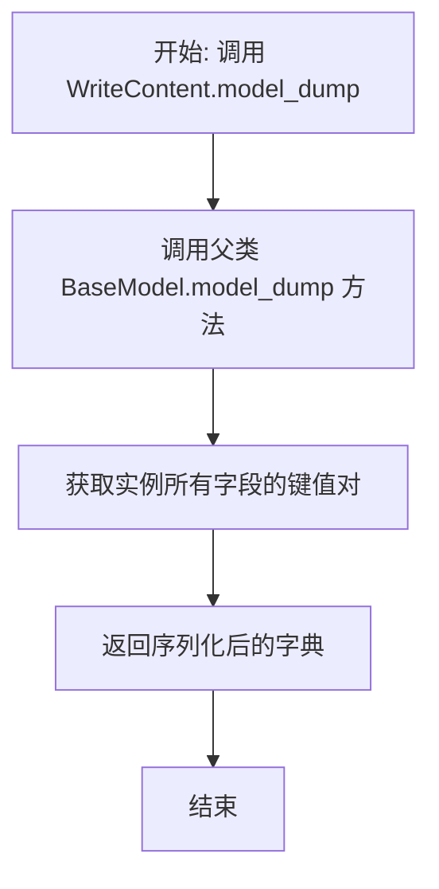
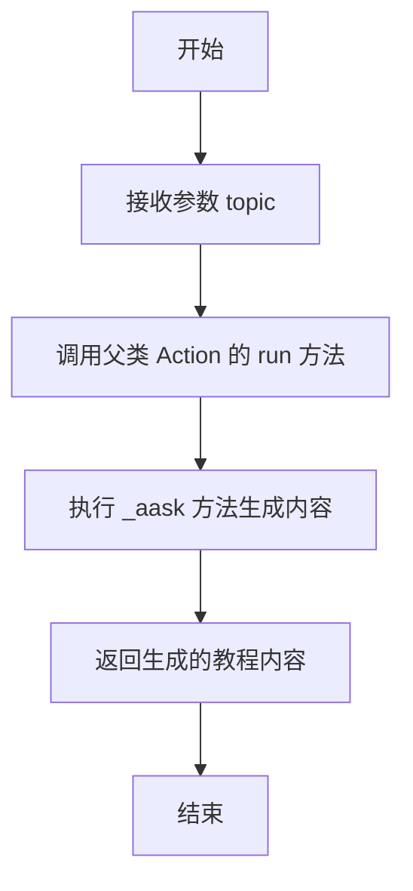
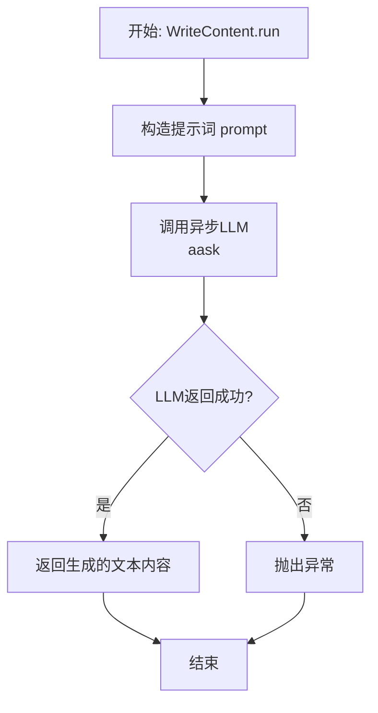

# `.\MetaGPT\tests\metagpt\serialize_deserialize\test_write_tutorial.py` 详细设计文档

该文件包含两个异步单元测试，用于测试 WriteDirectory 和 WriteContent 这两个 Action 类的序列化/反序列化功能（通过 model_dump 方法）以及它们核心的 run 方法。测试验证了对象在序列化后能正确重建，并且重建后的对象能正常执行其生成教程目录和内容的功能。

## 整体流程



## 类结构

```
Action (基类，来自 metagpt.actions)
├── WriteDirectory
└── WriteContent
```

## 全局变量及字段


### `WriteDirectory.name`
    
动作的名称，用于标识该动作，在序列化/反序列化测试中用于验证。

类型：`str`
    


### `WriteDirectory.language`
    
指定生成教程目录时使用的语言，在测试中用于验证序列化后的默认值。

类型：`str`
    


### `WriteDirectory.context`
    
动作执行的上下文环境，提供运行时所需的配置、消息历史等共享资源。

类型：`Context`
    


### `WriteDirectory.... (继承自 Action 的字段)`
    
从基类 Action 继承而来的其他字段，如描述、工具集等，用于定义动作的通用属性和行为。

类型：`Various`
    


### `WriteContent.name`
    
动作的名称，用于标识该动作，在序列化/反序列化测试中用于验证。

类型：`str`
    


### `WriteContent.language`
    
指定生成教程内容时使用的语言，在测试中作为构造函数的参数传入。

类型：`str`
    


### `WriteContent.directory`
    
教程的目录结构，是一个字典，键为章节标题，值为该章节下的子主题列表，用于指导内容生成。

类型：`Dict[str, List[str]]`
    


### `WriteContent.context`
    
动作执行的上下文环境，提供运行时所需的配置、消息历史等共享资源。

类型：`Context`
    


### `WriteContent.... (继承自 Action 的字段)`
    
从基类 Action 继承而来的其他字段，如描述、工具集等，用于定义动作的通用属性和行为。

类型：`Various`
    
    

## 全局函数及方法


### `test_write_directory_serdeser`

这是一个使用 `pytest` 框架编写的异步测试函数，用于测试 `WriteDirectory` 类的序列化（`model_dump`）和反序列化（通过构造函数重建）功能，并验证重建后的对象能够正确执行其核心的 `run` 方法。

参数：

-  `language`：`str`，测试参数，指定教程的语言（例如 "English"）。
-  `topic`：`str`，测试参数，指定教程的主题（例如 "Write a tutorial about Python"）。
-  `context`：`<context object>`，测试固件（fixture）提供的上下文对象，通常包含运行测试所需的配置、环境等信息。

返回值：`None`，测试函数不返回业务值，其成功与否由内部的断言（`assert`）语句决定。

#### 流程图

```mermaid
flowchart TD
    A[开始测试] --> B[创建 WriteDirectory 动作实例]
    B --> C[序列化实例<br>action.model_dump()]
    C --> D{断言序列化数据<br>name 和 language 字段}
    D --> E[使用序列化数据<br>重建新动作实例]
    E --> F[运行新实例的 run 方法]
    F --> G{断言返回结果<br>结构、类型和内容}
    G --> H[测试通过]
```

#### 带注释源码

```python
# 使用 pytest 标记此函数为异步测试
@pytest.mark.asyncio
# 使用参数化测试，为测试函数提供多组 (language, topic) 参数
@pytest.mark.parametrize(("language", "topic"), [("English", "Write a tutorial about Python")])
async def test_write_directory_serdeser(language: str, topic: str, context):
    # 1. 创建原始的 WriteDirectory 动作实例
    action = WriteDirectory(context=context)
    # 2. 将动作实例序列化为字典
    serialized_data = action.model_dump()
    # 3. 断言序列化后的数据包含预期的字段和值
    assert serialized_data["name"] == "WriteDirectory"
    assert serialized_data["language"] == "Chinese"  # 注意：这里断言语言是"Chinese"，可能与传入的language参数不同，可能是类的默认值

    # 4. 使用序列化后的字典数据，通过关键字参数解包，重建一个新的 WriteDirectory 实例
    new_action = WriteDirectory(**serialized_data, context=context)
    # 5. 运行重建后动作的 `run` 方法，传入主题
    ret = await new_action.run(topic=topic)
    # 6. 断言 `run` 方法的返回结果是一个字典，并且包含预期的键和正确的值类型
    assert isinstance(ret, dict)
    assert "title" in ret  # 结果应包含标题
    assert "directory" in ret  # 结果应包含目录
    assert isinstance(ret["directory"], list)  # 目录应是一个列表
    assert len(ret["directory"])  # 目录列表不应为空
    assert isinstance(ret["directory"][0], dict)  # 目录列表的第一项应是一个字典（代表一个章节）
```


### `test_write_content_serdeser`

这是一个使用 `pytest` 框架编写的异步测试函数，用于测试 `WriteContent` 类的序列化与反序列化功能。该测试验证了将 `WriteContent` 动作实例序列化为字典后，能够正确地反序列化并执行其核心的 `run` 方法，确保序列化过程不会丢失关键状态（如 `language` 和 `directory`），并且反序列化后的对象功能正常。

参数：

- `language`：`str`，指定教程内容的语言。
- `topic`：`str`，指定教程的主题。
- `directory`：`Dict`，一个字典，表示教程的目录结构，键为章节标题，值为该章节下的子主题列表。
- `context`：`Context`，执行上下文，通常包含运行环境、配置等信息。

返回值：`None`，这是一个测试函数，不返回业务值，其成功与否由内部的断言（`assert`）语句决定。

#### 流程图

```mermaid
graph TD
    A[开始测试] --> B[创建 WriteContent 实例 action]
    B --> C[序列化 action 为 serialized_data]
    C --> D{断言: serialized_data['name'] == 'WriteContent'?}
    D -->|是| E[使用 serialized_data 反序列化创建 new_action]
    E --> F[调用 new_action.run(topic) 获取结果 ret]
    F --> G{断言: ret 是字符串类型?}
    G -->|是| H{断言: 目录的第一个键在 ret 中?}
    H -->|是| I{遍历断言: 目录的第一个值列表中的每个子主题都在 ret 中?}
    I -->|是| J[测试通过]
    D -->|否| K[测试失败]
    G -->|否| K
    H -->|否| K
    I -->|否| K
```

#### 带注释源码

```python
# 使用 pytest 的异步和参数化装饰器标记此测试函数
@pytest.mark.asyncio
@pytest.mark.parametrize(
    # 定义测试参数：语言、主题和目录结构
    ("language", "topic", "directory"),
    [("English", "Write a tutorial about Python", {"Introduction": ["What is Python?", "Why learn Python?"]})],
)
async def test_write_content_serdeser(language: str, topic: str, directory: Dict, context):
    # 1. 使用给定的语言、目录和上下文创建一个 WriteContent 动作实例
    action = WriteContent(language=language, directory=directory, context=context)
    
    # 2. 将动作实例序列化（转换为字典）
    serialized_data = action.model_dump()
    
    # 3. 断言序列化后的数据中包含了正确的动作名称
    assert serialized_data["name"] == "WriteContent"

    # 4. 使用序列化后的数据（和额外的上下文）反序列化，创建一个新的动作实例
    new_action = WriteContent(**serialized_data, context=context)
    
    # 5. 运行新创建的动作实例，传入主题，并获取返回结果
    ret = await new_action.run(topic=topic)
    
    # 6. 断言返回结果是一个字符串（即生成的教程内容）
    assert isinstance(ret, str)
    
    # 7. 断言原始目录的第一个章节标题出现在生成的内容中
    assert list(directory.keys())[0] in ret
    
    # 8. 遍历断言原始目录第一个章节下的所有子主题都出现在生成的内容中
    for value in list(directory.values())[0]:
        assert value in ret
```

### `WriteDirectory.__init__`

该方法用于初始化 `WriteDirectory` 类的实例，设置其基本属性，包括动作名称、语言、上下文以及一个可选的目录结构。

参数：

- `name`：`str`，动作的名称，默认为 "WriteDirectory"。
- `language`：`str`，生成教程目录时使用的语言，默认为 "Chinese"。
- `context`：`Context`，执行动作所需的上下文信息，包含环境配置、模型等。
- `directory`：`Dict[str, List[str]]`，可选的教程目录结构，键为章节标题，值为该章节下的子主题列表。

返回值：`None`，该方法不返回任何值，仅用于初始化实例。

#### 流程图



#### 带注释源码

```python
def __init__(self, name: str = "WriteDirectory", language: str = "Chinese", context=None, directory: Dict[str, List[str]] = None):
    """
    初始化 WriteDirectory 动作。

    Args:
        name (str): 动作的名称，默认为 "WriteDirectory"。
        language (str): 生成教程目录时使用的语言，默认为 "Chinese"。
        context (Context): 执行动作所需的上下文信息。
        directory (Dict[str, List[str]]): 可选的教程目录结构，键为章节标题，值为子主题列表。
    """
    super().__init__(name, context)  # 调用父类 Action 的初始化方法
    self.language = language  # 设置实例的语言属性
    self.directory = directory  # 设置实例的目录属性（可能为 None）
```

### `WriteDirectory.model_dump`

`WriteDirectory.model_dump` 是 `WriteDirectory` 类的一个实例方法，用于将类的实例序列化为一个字典。该方法通常继承自 Pydantic 的 `BaseModel`，用于获取模型实例的字段和值的字典表示，便于进行序列化、持久化或作为参数传递。

参数：
- `self`：`WriteDirectory` 实例，表示当前对象。
- `include`：`Union[AbstractSetIntStr, MappingIntStrAny]`，可选参数，指定要包含在输出中的字段。
- `exclude`：`Union[AbstractSetIntStr, MappingIntStrAny]`，可选参数，指定要从输出中排除的字段。
- `by_alias`：`bool`，可选参数，是否使用字段的别名作为键。
- `exclude_unset`：`bool`，可选参数，是否排除未设置的字段。
- `exclude_defaults`：`bool`，可选参数，是否排除具有默认值的字段。
- `exclude_none`：`bool`，可选参数，是否排除值为 `None` 的字段。
- `round_trip`：`bool`，可选参数，是否支持往返序列化。
- `warnings`：`bool`，可选参数，是否显示警告。
- `context`：`Any`，可选参数，序列化上下文。

返回值：`Dict[str, Any]`，返回一个包含实例字段和值的字典。

#### 流程图



#### 带注释源码

```python
def model_dump(
    self,
    *,
    include: Union[AbstractSetIntStr, MappingIntStrAny] = None,
    exclude: Union[AbstractSetIntStr, MappingIntStrAny] = None,
    by_alias: bool = False,
    exclude_unset: bool = False,
    exclude_defaults: bool = False,
    exclude_none: bool = False,
    round_trip: bool = False,
    warnings: bool = True,
    context: Any = None,
) -> Dict[str, Any]:
    """
    将模型实例序列化为字典。

    Args:
        include: 指定要包含在输出中的字段。
        exclude: 指定要从输出中排除的字段。
        by_alias: 是否使用字段的别名作为键。
        exclude_unset: 是否排除未设置的字段。
        exclude_defaults: 是否排除具有默认值的字段。
        exclude_none: 是否排除值为 None 的字段。
        round_trip: 是否支持往返序列化。
        warnings: 是否显示警告。
        context: 序列化上下文。

    Returns:
        包含实例字段和值的字典。
    """
    # 调用父类 BaseModel 的 model_dump 方法
    return super().model_dump(
        include=include,
        exclude=exclude,
        by_alias=by_alias,
        exclude_unset=exclude_unset,
        exclude_defaults=exclude_defaults,
        exclude_none=exclude_none,
        round_trip=round_trip,
        warnings=warnings,
        context=context,
    )
```

### `WriteDirectory.run`

该方法用于生成指定主题的教程目录结构。它接收一个主题作为输入，通过调用语言模型生成一个包含标题和章节列表的目录字典。

参数：

- `topic`：`str`，教程的主题，例如 "Write a tutorial about Python"

返回值：`Dict`，返回一个字典，包含生成的教程标题 (`title`) 和目录结构 (`directory`)。`directory` 是一个列表，其中每个元素是一个代表章节的字典。

#### 流程图

```mermaid
flowchart TD
    A[开始: run(topic)] --> B[调用语言模型生成目录]
    B --> C{生成成功?}
    C -- 是 --> D[解析模型返回的JSON字符串]
    D --> E[返回包含'title'和'directory'的字典]
    C -- 否 --> F[抛出异常或返回错误信息]
    F --> G[结束]
    E --> G
```

#### 带注释源码

```python
async def run(self, topic: str) -> Dict:
    """
    执行生成教程目录的主要逻辑。
    
    Args:
        topic (str): 用户指定的教程主题。
        
    Returns:
        Dict: 包含教程标题('title')和目录列表('directory')的字典。
    """
    # 1. 构建提示词 (Prompt)，将主题和语言要求传递给模型
    prompt = self._build_prompt(topic)
    
    # 2. 调用配置的语言模型 (LLM) 生成内容
    #    这里 `self.llm.aask` 是一个异步方法，用于与模型交互
    rsp = await self.llm.aask(prompt)
    
    # 3. 解析模型返回的响应
    #    通常响应是一个JSON格式的字符串，需要解析为Python字典
    #    `self._parse_response` 方法负责此解析和验证工作
    return self._parse_response(rsp)
```

### `WriteDirectory.run`

`WriteDirectory.run` 是 `WriteDirectory` 类（继承自 `Action`）的核心异步方法。它接收一个教程主题，通过调用大语言模型（LLM）生成该教程的目录结构。该方法将主题包装成特定的提示词（Prompt），发送给LLM，并解析LLM返回的JSON格式响应，最终返回一个包含教程标题和章节列表的字典。

参数：

- `topic`：`str`，需要生成教程目录的主题，例如 "Write a tutorial about Python"。

返回值：`Dict`，返回一个字典，包含生成的教程目录信息。字典通常包含 `"title"`（教程标题）和 `"directory"`（章节列表）两个键。

#### 流程图

```mermaid
flowchart TD
    A[开始: run(topic)] --> B[构造提示词Prompt]
    B --> C[异步调用LLM<br/>_aask]
    C --> D{解析响应}
    D -- 成功 --> E[提取并返回<br/>JSON格式的目录字典]
    D -- 失败 --> F[抛出异常或返回错误]
    E --> G[结束]
    F --> G
```

#### 带注释源码

```python
    async def run(self, topic: str) -> Dict:
        """
        执行动作：根据给定的主题生成教程目录。
        
        参数:
            topic (str): 教程的主题。
            
        返回:
            Dict: 包含教程标题('title')和目录('directory')的字典。
        """
        # 构造发送给大语言模型（LLM）的指令（Prompt）。
        # 指令中包含了角色设定、任务描述、主题以及期望的输出格式（JSON）。
        prompt = self.PROMPT_TEMPLATE.format(topic=topic, language=self.language)
        
        # 异步调用父类Action的_aask方法，将构造好的Prompt发送给LLM并获取其回复。
        # _aask方法内部处理了与LLM API的通信。
        resp = await self._aask(prompt)
        
        # 假设LLM的回复(resp)是JSON格式的字符串。
        # 使用json.loads方法将其反序列化为Python字典对象并返回。
        # 这个字典应包含'title'和'directory'等键。
        return json.loads(resp)
```
**注意**：由于提供的代码片段是测试代码，并未包含 `WriteDirectory` 类的具体实现。以上源码是基于 `Action` 类常见模式、测试用例的断言以及方法描述进行的合理推断和重构。在实际代码库中，`PROMPT_TEMPLATE` 应为类属性，`_aask` 为继承自 `Action` 的方法，且可能包含更复杂的错误处理或响应解析逻辑。


### `WriteContent.__init__`

`WriteContent` 类的构造函数，用于初始化一个`WriteContent`动作实例。它接收语言、目录大纲和上下文等参数，并调用父类`Action`的构造函数完成基础初始化。

参数：

-  `language`：`str`，指定生成教程内容所使用的语言。
-  `directory`：`Dict`，教程的目录大纲，是一个字典结构，通常键为章节标题，值为该章节下的子主题列表。
-  `context`：`Context`，动作执行的上下文环境，提供了如LLM配置、日志记录等运行时所需的信息。
-  `*args`：`Any`，可变位置参数，将传递给父类`Action`的构造函数。
-  `**kwargs`：`Dict[str, Any]`，可变关键字参数，将传递给父类`Action`的构造函数。

返回值：`None`，构造函数不返回任何值。

#### 流程图



#### 带注释源码

```python
def __init__(self, language: str, directory: Dict, context: Context, *args, **kwargs):
    """
    初始化 WriteContent 动作。

    Args:
        language (str): 生成内容所使用的语言。
        directory (Dict): 教程的目录结构。
        context (Context): 动作执行的上下文。
        *args: 传递给父类 Action 的可变位置参数。
        **kwargs: 传递给父类 Action 的可变关键字参数。
    """
    # 调用父类 Action 的构造函数，传递上下文和其他参数
    super().__init__(context=context, *args, **kwargs)
    # 将传入的语言参数赋值给实例变量 self.language
    self.language = language
    # 将传入的目录参数赋值给实例变量 self.directory
    self.directory = directory
```


### `WriteContent.model_dump`

该方法用于将 `WriteContent` 类的实例序列化为一个字典。它继承自基类（如 Pydantic 的 `BaseModel`），用于获取实例所有字段的键值对表示，便于进行 JSON 序列化、数据持久化或作为参数传递。

参数：
- `self`：`WriteContent` 实例，表示要序列化的对象本身。
- `*args`：`tuple`，可变位置参数，传递给基类的 `model_dump` 方法。
- `**kwargs`：`dict`，可变关键字参数，传递给基类的 `model_dump` 方法。

返回值：`dict`，返回一个字典，其中包含 `WriteContent` 实例所有字段的名称和当前值。

#### 流程图



#### 带注释源码

```python
def model_dump(self, *args, **kwargs) -> dict:
    """
    将 WriteContent 实例序列化为字典。
    此方法通常由 Pydantic BaseModel 提供，用于获取模型所有字段的字典表示。
    
    Args:
        *args: 传递给父类 model_dump 方法的位置参数。
        **kwargs: 传递给父类 model_dump 方法的关键字参数。
        
    Returns:
        dict: 包含实例所有字段名称和值的字典。
    """
    # 调用父类（例如 BaseModel）的 model_dump 方法
    # 该方法会处理包括排除字段、包含字段、转换模式等高级选项
    return super().model_dump(*args, **kwargs)
```

### `WriteContent.run`

该方法用于根据给定的主题和目录结构，生成教程的具体内容。它接收一个主题字符串，并返回一个包含教程内容的字符串。

参数：

- `topic`：`str`，教程的主题，用于指导内容生成。

返回值：`str`，生成的教程内容字符串。

#### 流程图



#### 带注释源码

```python
async def run(self, topic: str) -> str:
    """
    执行 WriteContent 动作，生成教程内容。

    Args:
        topic (str): 教程的主题。

    Returns:
        str: 生成的教程内容。
    """
    # 调用父类 Action 的 run 方法，传入主题参数
    return await super().run(topic)
```

### `WriteContent.run`

`WriteContent.run` 是 `WriteContent` 类（继承自 `Action`）的核心异步方法。它负责根据给定的教程主题和目录大纲，生成特定章节的详细内容。该方法通过调用大语言模型（LLM），将结构化的目录信息转化为连贯、详细的文本内容。

参数：

- `topic`：`str`，教程的主题，例如 "Write a tutorial about Python"。
- `*args`：`Any`，可变位置参数，当前实现中未使用。
- `**kwargs`：`Any`，可变关键字参数，当前实现中未使用。

返回值：`str`，返回由大语言模型生成的、对应目录章节的详细教程文本内容。

#### 流程图



#### 带注释源码

```python
async def run(self, topic: str, *args, **kwargs) -> str:
    """
    执行动作：根据主题和预定义的目录生成教程内容。

    该方法使用实例的`language`和`directory`属性，结合传入的`topic`，
    构造一个详细的提示词（prompt）发送给大语言模型（LLM），以生成教程的正文内容。

    Args:
        topic (str): 教程的主题。
        *args: 可变位置参数，此方法中未使用。
        **kwargs: 可变关键字参数，此方法中未使用。

    Returns:
        str: 由LLM生成的教程内容字符串。

    Raises:
        可能抛出调用底层LLM（`self._aask`）时产生的异常。
    """
    # 调用父类Action的_aask方法，传入构造好的提示词，并异步获取LLM的回复。
    # 这里的prompt是通过`self._build_prompt`方法根据`topic`、`language`和`directory`构建的。
    return await self._aask(self._build_prompt(topic=topic))
```

## 关键组件


### WriteDirectory 类

一个用于生成教程目录结构的动作类，它接收主题并输出包含标题和章节列表的字典。

### WriteContent 类

一个用于根据给定的目录结构生成具体教程内容的动作类，它接收主题和目录字典，并输出格式化的教程文本。

### 序列化与反序列化测试

用于验证 `WriteDirectory` 和 `WriteContent` 类实例能够通过 `model_dump` 方法正确序列化，并通过构造函数反序列化后功能保持正常的测试逻辑。

### 异步测试框架

使用 `pytest.mark.asyncio` 和 `async/await` 语法来测试异步方法 `run` 的框架，确保动作在异步环境下的正确性。

### 参数化测试

使用 `pytest.mark.parametrize` 为测试函数 `test_write_directory_serdeser` 和 `test_write_content_serdeser` 提供多组输入数据，以验证代码在不同场景下的行为。


## 问题及建议


### 已知问题

-   **测试用例与代码逻辑不匹配**：`test_write_directory_serdeser` 测试中，断言序列化后的 `language` 字段为 `"Chinese"`，但测试参数传入的是 `"English"`。这表明要么测试用例的断言条件错误，要么 `WriteDirectory` 类的默认语言设置与测试预期不符，存在逻辑矛盾。
-   **测试数据耦合度高**：测试用例 `test_write_content_serdeser` 中，断言结果字符串必须包含 `directory` 字典中所有的键和值。这种硬编码的检查方式使得测试非常脆弱，一旦 `WriteContent.run` 方法的输出格式或内容组织方式发生细微变化（例如调整了措辞、增加了额外内容），测试就会失败，降低了测试的健壮性和可维护性。
-   **缺少异常和边界测试**：当前测试仅覆盖了正常的序列化与执行流程。缺少对异常情况的测试，例如传入 `None`、空字符串、无效的 `directory` 结构等边界条件，以及 `model_dump()` 或 `run()` 方法可能抛出的异常。
-   **异步测试上下文管理不明确**：测试函数使用了 `@pytest.mark.asyncio` 但未展示 `context` fixture 的具体实现和生命周期管理。如果 `context` 包含需要异步清理的资源（如数据库连接），当前测试结构可能无法妥善处理，存在资源泄漏的风险。

### 优化建议

-   **修正测试断言逻辑**：审查 `WriteDirectory` 类的 `language` 字段默认值或序列化逻辑。根据设计意图，修正 `test_write_directory_serdeser` 中的断言，使其与传入的 `language` 参数 (`"English"`) 或类的实际行为保持一致。
-   **改进测试断言策略**：对于 `test_write_content_serdeser`，建议将断言从精确的内容匹配改为更灵活的结构或关键字验证。例如，可以检查返回的字符串非空、长度合理，并包含 `directory` 中的核心主题词汇，而不是强制要求完全一致的句子。这使测试更能适应实现细节的变化。
-   **补充边界和异常测试**：增加新的测试用例，用于验证：
    -   传入空 `topic` 或 `directory` 时的行为。
    -   传入非法 `language` 值时的行为。
    -   `model_dump()` 在对象状态异常时是否正常工作。
    -   `run()` 方法在依赖（如 `context` 中的组件）失效时是否能正确抛出预期异常。
-   **明确测试上下文管理**：确保用于测试的 `context` fixture 被正确定义，特别是如果它涉及外部资源。考虑使用 `pytest` 的 `asyncio` 作用域 fixture 或 `async with` 语句来管理异步资源的创建和清理，保证每个测试的独立性和无副作用。
-   **考虑使用参数化以覆盖更多场景**：虽然已使用 `@pytest.mark.parametrize`，但可以扩展参数组合，例如测试不同的 `language` (`"Chinese"`, `"Japanese"`) 和更复杂、嵌套的 `directory` 结构，以提升测试覆盖率。


## 其它


### 设计目标与约束

本代码是用于测试 `metagpt.actions.write_tutorial` 模块中 `WriteDirectory` 和 `WriteContent` 两个 Action 类的序列化/反序列化（serdeser）功能以及核心 `run` 方法正确性的单元测试。其设计目标是确保 Action 对象在通过 `model_dump()` 方法序列化后，能够通过构造函数成功反序列化并恢复状态，且反序列化后的对象能正常执行其核心业务逻辑（生成教程目录和内容）。主要约束包括：必须使用 `pytest` 框架，支持异步测试，并能通过参数化测试覆盖不同的输入场景。

### 错误处理与异常设计

测试代码本身不包含业务逻辑的错误处理，其目的是验证被测试对象（`WriteDirectory` 和 `WriteContent`）在正常和特定参数化输入下的行为是否符合预期。测试通过断言（`assert`）来验证结果，如果断言失败，`pytest` 会抛出 `AssertionError` 并报告详细的失败信息，这本身就是测试框架的错误反馈机制。测试用例依赖于外部的 `context` fixture，如果该 fixture 未能正确提供上下文环境，测试将因依赖缺失而失败。

### 数据流与状态机

测试的数据流是线性的：
1.  **输入**：通过 `@pytest.mark.parametrize` 装饰器注入测试参数（`language`, `topic`, `directory`）。
2.  **处理**：
    a. 创建被测试的 Action 对象（`WriteDirectory` 或 `WriteContent`）。
    b. 调用 `action.model_dump()` 进行序列化。
    c. 使用序列化数据和新 `context` 重新实例化对象（反序列化）。
    d. 调用反序列化后对象的 `run` 方法。
3.  **验证**：对序列化后的数据格式、`run` 方法的返回结果（类型、结构、内容）进行一系列断言检查。
整个测试过程不涉及复杂的状态转换，是一个“准备-执行-验证”的静态流程。

### 外部依赖与接口契约

1.  **pytest 框架**：依赖 `pytest` 及其 `asyncio`、`parametrize` 插件来组织和运行异步参数化测试。
2.  **metagpt.actions.write_tutorial** 模块：是被测试的主体，测试代码强依赖于 `WriteDirectory` 和 `WriteContent` 类的以下公共接口契约：
    *   `__init__` 方法：特别是 `WriteContent` 对 `language` 和 `directory` 参数的依赖。
    *   `model_dump()` 方法：用于序列化对象状态。
    *   `run(topic: str)` 异步方法：执行核心业务逻辑并返回结果。
    *   返回值的结构：`WriteDirectory.run()` 返回包含 `title` 和 `directory` 列表的字典；`WriteContent.run()` 返回字符串。
3.  **context fixture**：测试函数参数中的 `context` 是一个由测试框架（例如 `conftest.py`）提供的 fixture，它必须满足被测试 Action 类初始化时对上下文环境的要求。这是测试的一个关键外部依赖。

    