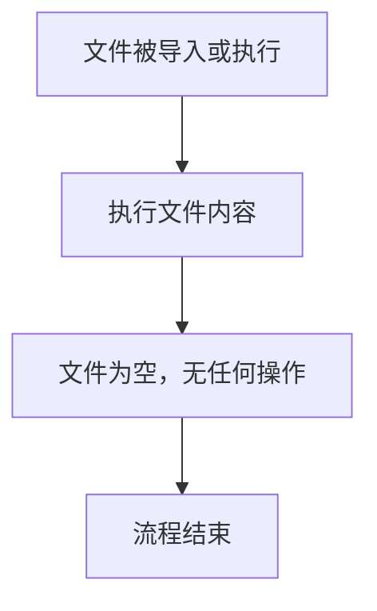

# `.\MetaGPT\tests\metagpt\strategy\__init__.py` 详细设计文档

这是一个空的Python包初始化文件，仅包含文件头注释，没有定义任何实际的代码功能、类、函数或变量。

## 整体流程



## 类结构

```
无类层次结构
```

## 全局变量及字段


    

## 全局函数及方法


## 关键组件


### 代码文件结构

这是一个Python包的初始化文件（__init__.py），用于定义包的公共接口和初始化逻辑。

### 包元数据

文件头部包含了标准的Python脚本声明、编码格式以及作者、创建时间和文件名等元数据注释。


## 问题及建议


### 已知问题

-   **空文件问题**：当前 `__init__.py` 文件为空，仅包含元数据注释。这可能导致该模块无法被正确导入或初始化，特别是当该目录作为包使用时，缺少必要的包级初始化逻辑。
-   **元数据注释过时**：文件头部的 `@Time`、`@Author`、`@File` 注释信息可能已过时，与实际代码维护状态不符，可能误导其他开发者。
-   **缺少包声明**：如果该目录是一个Python包，空的 `__init__.py` 可能意味着缺少包级别的 `__all__` 列表来控制 `from package import *` 的行为，或者缺少包级别的便利导入。

### 优化建议

-   **明确包用途**：根据该目录在项目中的角色，决定 `__init__.py` 的内容。如果它是一个普通的包目录，可以保持为空或添加 `__all__` 定义。如果它需要暴露特定的子模块、类或函数，应在 `__init__.py` 中进行导入，以简化外部调用（例如 `from mypackage import MyClass` 而不是 `from mypackage.mymodule import MyClass`）。
-   **更新或移除元数据**：考虑使用更动态或更准确的元数据管理方式（如通过 `setup.py` 或 `pyproject.toml`），或者至少确保文件头注释与当前维护者及代码状态一致。
-   **添加类型提示存根**：如果这是一个包含多个子模块的包，可以考虑在 `__init__.py` 中添加类型提示（Type Hints）存根，以提升IDE的智能提示和静态类型检查工具（如mypy）的支持。
-   **考虑使用 `py.typed` 标记**：如果包支持类型提示，应在包根目录添加一个名为 `py.typed` 的空文件，以向类型检查器表明此包已提供类型信息。


## 其它


### 设计目标与约束

该代码文件是一个Python包的初始化文件（`__init__.py`），其主要设计目标是定义当前目录为一个Python包，并可能用于初始化包的命名空间、控制包的导入行为或执行包的启动代码。当前文件内容为空，表明其核心约束是保持最小化，仅履行包标识的基础职责，未引入任何额外的功能、依赖或初始化逻辑。

### 错误处理与异常设计

由于当前`__init__.py`文件不包含任何可执行代码（仅包含文档字符串和元数据注释），因此不存在运行时错误处理或异常设计。任何与该文件相关的错误（如文件权限问题、编码错误）将由Python解释器在导入包时处理。

### 数据流与状态机

本文件不涉及任何数据处理逻辑，因此没有数据流。同时，它也不管理或维护任何状态，故不存在状态机设计。

### 外部依赖与接口契约

此`__init__.py`文件本身没有声明任何外部依赖（如`import`语句）。作为包的入口点，它隐式地定义了包的公共接口契约，即允许外部模块通过`import`语句导入本包。当前空文件意味着包的所有公共接口将由包内其他模块定义，本文件不主动暴露任何特定模块、类或函数。

    